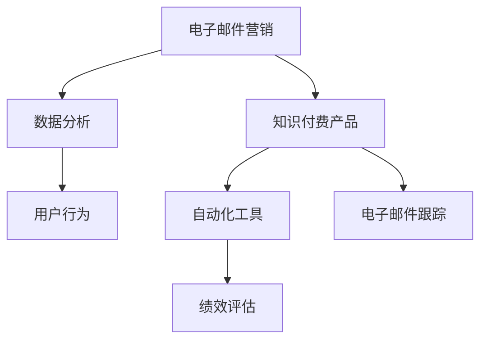

                 

# 如何利用邮件营销推广知识付费产品

> 关键词：电子邮件营销, 知识付费, 数据分析, 用户行为, 自动化工具, 电子邮件跟踪, 绩效评估

## 1. 背景介绍

### 1.1 问题由来
随着知识付费的兴起，越来越多的用户愿意为有价值的信息支付费用。然而，如何有效地推广知识付费产品，吸引用户订阅，成为了困扰许多内容创作者和营销人员的问题。传统的推广方式如社交媒体、线下活动等成本高、效果有限，且难以精准触达目标用户。相比之下，电子邮件营销因其高效、低成本、精准定位等优势，成为了推广知识付费产品的重要手段。

### 1.2 问题核心关键点
邮件营销的核心在于通过邮件与目标用户建立长期、稳定的沟通渠道，以精准、个性化、有价值的内容吸引用户，并最终促成转化。这需要综合利用数据分析、用户行为洞察、自动化工具等手段，对邮件内容、发送时间、发送频率等进行精心设计和优化，以达到最佳的推广效果。

### 1.3 问题研究意义
通过有效的邮件营销，知识付费产品可以在成本可控的情况下，精准触达目标用户，提升品牌知名度和用户黏性，进而增加订阅数量和收入。邮件营销不仅能够提升产品推广效率，还能为营销人员提供详细的用户行为数据，帮助其进行持续优化，实现更高效的用户转化。

## 2. 核心概念与联系

### 2.1 核心概念概述

为更好地理解如何利用邮件营销推广知识付费产品，本节将介绍几个密切相关的核心概念：

- 电子邮件营销(Email Marketing)：通过电子邮件向目标用户传递个性化、有价值的信息，实现品牌推广、用户转化等营销目标。
- 知识付费产品：通过在线课程、电子书、付费咨询等方式，为用户提供有价值的知识和技能，收取一定费用。
- 数据分析(Analytical)：对用户行为、邮件营销效果等数据进行收集、分析和解读，为优化营销策略提供数据支持。
- 用户行为(User Behavior)：用户在产品使用和邮件互动过程中的行为模式，如点击率、打开率、转化率等。
- 自动化工具(Automation Tools)：用于邮件营销自动化、自动化数据分析和用户行为跟踪的软件工具，如Mailchimp、HubSpot等。
- 电子邮件跟踪(Email Tracking)：通过嵌入跟踪像素等方式，实时监控邮件打开、点击等行为，评估邮件营销效果。
- 绩效评估(Performance Evaluation)：对邮件营销活动进行详细的指标评估，分析邮件内容、发送策略等对用户转化率的影响。

这些核心概念之间的逻辑关系可以通过以下Mermaid流程图来展示：



这个流程图展示了一系列概念之间的联系：

1. 电子邮件营销通过用户行为数据和自动化工具对知识付费产品进行推广。
2. 数据分析和用户行为洞察指导邮件内容的个性化设计。
3. 绩效评估持续优化邮件营销策略，提升用户转化率。

这些概念共同构成了利用邮件营销推广知识付费产品的框架，使其能够通过高效、低成本、精准的方式吸引目标用户，提升产品效果。

## 3. 核心算法原理 & 具体操作步骤
### 3.1 算法原理概述

基于邮件营销的知识付费产品推广，本质上是一个利用数据分析和用户行为洞察，设计、执行、评估邮件营销策略的过程。其核心思想是：通过收集和分析用户行为数据，设计有针对性的邮件内容，定期发送给目标用户，以提升用户对知识付费产品的兴趣和订阅意愿，从而实现订阅转化。

形式化地，假设知识付费产品的推广目标为 $T$，通过电子邮件营销策略 $S$ 发送的邮件内容为 $M$，用户对邮件的响应行为为 $R$，则推广效果 $E$ 可以表示为：

$$
E = f(S, M, R)
$$

其中 $f$ 为推广效果函数，$S$ 和 $M$ 通过数据分析和用户行为洞察进行优化，$R$ 受邮件内容、发送时间、发送频率等多种因素影响。

通过不断优化策略 $S$ 和内容 $M$，最大化推广效果 $E$，即可实现高效的知识付费产品推广。

### 3.2 算法步骤详解

基于邮件营销的知识付费产品推广一般包括以下几个关键步骤：

**Step 1: 数据收集与用户画像构建**
- 收集用户的基础信息、历史行为数据、订阅状态等，如注册时间、购买记录、浏览记录等。
- 通过数据分析工具如Google Analytics、Mixpanel等，构建用户画像，了解用户的兴趣、偏好、消费行为等。

**Step 2: 设计邮件内容**
- 根据用户画像和市场调研，设计邮件标题、正文、附件等，确保内容个性化、有价值、具有吸引力。
- 引入A/B测试，比较不同邮件内容的效果，选择最优方案。

**Step 3: 选择邮件发送时间和频率**
- 分析用户活跃时间，选择最佳的邮件发送时间。
- 根据用户行为数据，设置合适的邮件发送频率，避免过度干扰。

**Step 4: 自动化执行与跟踪**
- 使用自动化工具如Mailchimp、HubSpot等，设定邮件发送规则，自动生成和发送邮件。
- 嵌入跟踪像素，实时监控邮件的打开率、点击率等关键指标，记录用户行为数据。

**Step 5: 数据分析与优化**
- 利用数据分析工具，对邮件营销效果进行详细评估，如转化率、退订率、点击率等。
- 根据分析结果，持续优化邮件内容、发送策略等，迭代提高推广效果。

**Step 6: 绩效评估与报告生成**
- 使用绩效评估工具，生成详细的邮件营销报告，分析各关键指标的变化趋势。
- 定期进行项目回顾，总结经验教训，制定下一步优化策略。

以上是利用邮件营销推广知识付费产品的一般流程。在实际应用中，还需要针对具体产品特点和用户行为数据，对各环节进行优化设计，如改进用户画像模型、引入个性化推荐算法等，以进一步提升推广效果。

### 3.3 算法优缺点

基于邮件营销的知识付费产品推广方法具有以下优点：
1. 高效低成本：相比于传统推广方式，邮件营销成本低、效果好，能够精准触达目标用户。
2. 用户黏性强：定期发送有价值的内容，有助于提升用户对知识付费产品的信任和黏性。
3. 数据驱动优化：通过数据分析和用户行为洞察，持续优化邮件策略，实现更高的用户转化率。
4. 可控性强：邮件营销可以灵活调整内容、发送时间等参数，实现更好的用户互动。

同时，该方法也存在一定的局限性：
1. 用户行为依赖：邮件营销的效果高度依赖于用户的活跃度和响应行为，难以在用户不活跃时产生效果。
2. 用户隐私问题：大规模数据收集和处理可能涉及用户隐私，需要严格遵守相关法律法规。
3. 用户退出率高：用户可能会因厌烦或频繁打扰而选择退订，需要持续优化发送策略。
4. 难以突破技术壁垒：邮件营销需要技术支持，对技术实施能力有一定要求。

尽管存在这些局限性，但就目前而言，基于邮件营销的知识付费产品推广方法仍是最主流且有效的营销手段。未来相关研究的重点在于如何进一步提高邮件营销的个性化和自动化水平，优化用户画像模型，同时兼顾用户隐私和法律约束。

### 3.4 算法应用领域

基于邮件营销的知识付费产品推广方法，在知识付费行业中得到了广泛应用，覆盖了几乎所有类型的知识付费产品，例如：

- 在线课程：通过定期推送新课预告、学员评价、推荐视频等，提升课程的曝光率和用户转化率。
- 电子书：发布电子书摘要、用户评价、相关文章等，激发用户购买兴趣。
- 付费咨询：发送行业动态、专家解读、实用技巧等，吸引用户订阅付费咨询服务。
- 线下活动：发送活动预告、讲座录像、嘉宾评价等，提升活动的参与度和口碑。
- 社交媒体：将邮件内容发布到社交媒体平台，进一步扩大知识付费产品的影响力。

除了上述这些经典应用外，邮件营销也被创新性地应用到更多场景中，如社群运营、内容营销、客户维护等，为知识付费产品带来新的增长点。

## 4. 数学模型和公式 & 详细讲解 & 举例说明
### 4.1 数学模型构建

本节将使用数学语言对基于邮件营销的知识付费产品推广过程进行更加严格的刻画。

记知识付费产品的推广目标为 $T$，邮件内容为 $M$，邮件发送时间为 $T_s$，邮件发送频率为 $F_s$。用户对邮件的响应行为为 $R$，包括打开率 $o$、点击率 $c$、订阅率 $s$ 等。推广效果 $E$ 可以表示为：

$$
E = f(T, M, T_s, F_s, R)
$$

其中 $f$ 为推广效果函数，$M$、$T_s$、$F_s$ 通过数据分析和用户行为洞察进行优化，$R$ 受邮件内容、发送时间、发送频率等多种因素影响。

通过最大化推广效果 $E$，即可实现高效的知识付费产品推广。

### 4.2 公式推导过程

以下我们以点击率 $c$ 为例，推导邮件营销的效果计算公式。

假设用户总数为 $U$，邮件发送时间为 $t$，发送频率为 $f$，则邮件的实际发送次数为 $f \times t$。设用户对邮件的打开率、点击率、订阅率分别为 $o$、$c$、$s$，则实际点击数 $C$ 为：

$$
C = f \times t \times o \times c
$$

由于用户点击次数与实际发送次数成正比，因此点击率 $c$ 可以表示为：

$$
c = \frac{C}{f \times t}
$$

将 $C$ 代入上式，得：

$$
c = o \times \frac{C}{U}
$$

其中 $\frac{C}{U}$ 表示实际点击数占总用户数的比例，即点击率。因此，通过优化邮件内容和发送策略，最大化打开率和实际点击数，可以有效提升知识付费产品的推广效果。

### 4.3 案例分析与讲解

以下以在线课程推广为例，详细分析邮件营销的实际应用过程。

假设某在线课程平台希望通过邮件营销提升课程订阅率。平台收集了大量用户数据，包括注册时间、购买记录、浏览记录等。通过数据分析工具，构建用户画像，了解到用户对课程的兴趣主要集中在IT技能、数据科学等方面。

根据用户画像，设计邮件内容，包括课程介绍、学员评价、推荐视频等，确保内容个性化、有价值、具有吸引力。同时，引入A/B测试，比较不同邮件内容的效果，选择最优方案。

分析用户活跃时间，选择最佳的邮件发送时间，如工作日晚上7-9点。根据用户行为数据，设置合适的邮件发送频率，避免过度干扰。

使用自动化工具，设定邮件发送规则，自动生成和发送邮件。嵌入跟踪像素，实时监控邮件的打开率、点击率等关键指标，记录用户行为数据。

利用数据分析工具，对邮件营销效果进行详细评估，如点击率、订阅率、退订率等。根据分析结果，持续优化邮件内容、发送策略等，迭代提高推广效果。

## 5. 项目实践：代码实例和详细解释说明
### 5.1 开发环境搭建

在进行邮件营销实践前，我们需要准备好开发环境。以下是使用Python进行邮件营销开发的常见环境配置流程：

1. 安装Python：从官网下载并安装Python，选择3.x版本，确保稳定性。

2. 安装相关库：
```bash
pip install email-magic flask
```

3. 安装自动化工具：
```bash
pip install mailchimp API key
```

4. 搭建服务器：可以使用云服务如AWS、阿里云等，搭建邮件营销服务器。

5. 设置环境变量：在服务器上设置邮箱API Key等环境变量，确保邮件API正常工作。

完成上述步骤后，即可在搭建的服务器环境中开始邮件营销实践。

### 5.2 源代码详细实现

这里我们以邮件营销系统为例，给出完整的代码实现流程。

首先，定义邮件模板类：

```python
class EmailTemplate:
    def __init__(self, subject, body, from_email, to_email, api_key):
        self.subject = subject
        self.body = body
        self.from_email = from_email
        self.to_email = to_email
        self.api_key = api_key
```

然后，定义邮件发送函数：

```python
import requests

def send_email(template):
    api_url = "https://mailchimp.com/api/v3/messages/send"
    headers = {"Content-Type": "application/json", "Authorization": "Bearer " + template.api_key}
    data = {
        "to": template.to_email,
        "from_email": template.from_email,
        "subject": template.subject,
        "html_content": template.body,
    }
    response = requests.post(api_url, headers=headers, json=data)
    return response.status_code
```

接着，定义邮件营销系统：

```python
from flask import Flask, request

app = Flask(__name__)

@app.route('/send_email', methods=['POST'])
def send_email_handler():
    email_template = EmailTemplate(request.form['subject'], request.form['body'], 
                                  request.form['from_email'], request.form['to_email'], 
                                  request.form['api_key'])
    return str(send_email(email_template)), 200
```

最后，启动邮件营销系统：

```python
if __name__ == '__main__':
    app.run(debug=True)
```

通过Flask框架，我们定义了一个简单的邮件发送API，可以通过POST请求发送邮件。用户在提交请求时，需要提供邮件模板类的所有字段，包括主题、内容、发件人、收件人、API Key等。

### 5.3 代码解读与分析

让我们再详细解读一下关键代码的实现细节：

**EmailTemplate类**：
- `__init__`方法：初始化邮件模板，包括主题、内容、发件人、收件人和API Key等字段。
- `subject`、`body`、`from_email`、`to_email`、`api_key` 分别为邮件主题、正文、发件人、收件人和API Key。

**send_email函数**：
- 使用requests库发送邮件到Mailchimp API。
- 设置API Key和请求头，确保API请求有权限。
- 将邮件模板转换为API请求格式，发送请求。
- 返回服务器响应状态码，表示请求是否成功。

**邮件营销系统**：
- 使用Flask框架，定义了邮件发送API。
- 通过POST请求，接收用户提交的邮件模板信息。
- 将邮件模板信息转换为EmailTemplate对象，调用send_email函数发送邮件。

可以看到，通过Python和Flask框架，我们能够轻松搭建邮件营销系统，实现自动化邮件发送。开发者可以根据自己的需求，进一步优化邮件营销系统的功能，如引入用户画像模型、设置邮件发送规则等。

## 6. 实际应用场景
### 6.1 在线课程推广

在线课程平台可以通过邮件营销，定期推送新课预告、学员评价、推荐视频等，提升课程的曝光率和用户转化率。例如，某在线课程平台在每门新课发布前，向订阅用户发送邮件，内容包括新课介绍、试听视频、学员评价等。邮件标题和正文设计精美，吸引力强，提高用户点击率和转化率。同时，平台还根据用户行为数据，设置最佳的邮件发送时间和频率，避免过度打扰。

### 6.2 电子书推广

电子书出版社可以通过邮件营销，向潜在读者推广新书。例如，某出版社在每本新书发布时，向其数据库中的潜在读者发送邮件，内容包括新书简介、目录、序言等。邮件设计精美，包含购买链接，方便用户直接下单购买。同时，出版社还根据用户行为数据，设定最佳的邮件发送时间和频率，提升推广效果。

### 6.3 付费咨询推广

咨询公司可以通过邮件营销，向潜在客户推广付费咨询服务。例如，某咨询公司在推出新服务时，向其现有客户和潜在客户发送邮件，内容包括服务介绍、专家团队、成功案例等。邮件设计专业，包含预约链接，方便客户预约咨询。同时，公司还根据用户行为数据，设定最佳的邮件发送时间和频率，提升客户转化率。

### 6.4 未来应用展望

随着邮件营销技术的不断进步，未来将会有更多创新性的应用出现：

1. 个性化推荐：根据用户行为数据和邮件互动数据，个性化推荐课程、书籍、咨询等知识付费产品，提升用户满意度。
2. 自动化内容生成：使用自然语言生成技术，根据用户画像和市场调研，自动生成邮件内容，提升内容创作的效率和质量。
3. 实时数据分析：实时监控邮件营销效果，分析用户行为数据，动态调整邮件内容和发送策略，提升推广效果。
4. 多渠道整合：整合社交媒体、短信、邮件等多种渠道，实现全渠道用户触达，提升推广效果。
5. 数据驱动决策：通过数据分析和机器学习，挖掘用户行为规律，制定更加精准的营销策略，提高用户转化率。

## 7. 工具和资源推荐
### 7.1 学习资源推荐

为了帮助开发者系统掌握邮件营销的理论基础和实践技巧，这里推荐一些优质的学习资源：

1. 《邮件营销：策略与实践》系列书籍：系统介绍了邮件营销的基本概念、策略、工具和实践，是入门邮件营销的必备书籍。

2. Mailchimp、HubSpot等邮件营销平台提供的官方教程：详细讲解了邮件营销的各个环节，包括邮件设计、邮件发送、数据分析等，是动手实践的良好资源。

3. Coursera《数字营销》课程：斯坦福大学开设的在线课程，涵盖邮件营销、社交媒体、搜索引擎优化等数字营销知识，适合进阶学习。

4. 《电子邮件营销：如何打造高效的邮件营销策略》课程：Udemy平台上的一门精品课程，详细讲解了邮件营销的策略、工具和案例，是提高邮件营销能力的绝佳选择。

通过对这些资源的学习实践，相信你一定能够快速掌握邮件营销的精髓，并用于解决实际的推广问题。

### 7.2 开发工具推荐

高效的开发离不开优秀的工具支持。以下是几款用于邮件营销开发的常用工具：

1. Mailchimp、HubSpot等邮件营销平台：集成了邮件设计、自动化邮件发送、数据分析等功能，是邮件营销的必备工具。
2. Google Analytics、Mixpanel等数据分析工具：能够实时监控邮件营销效果，提供详细的用户行为数据，是优化邮件营销策略的重要手段。
3. Flask、Django等Web框架：能够快速搭建邮件营销系统，支持自动化邮件发送、用户行为跟踪等功能。
4. Python、R等编程语言：提供了强大的数据处理和分析能力，适合进行邮件营销的数据挖掘和建模。
5. API Key等API认证工具：如OAuth、JWT等，用于安全地获取邮件营销平台的API权限，确保数据安全和隐私。

合理利用这些工具，可以显著提升邮件营销的开发效率，加快创新迭代的步伐。

### 7.3 相关论文推荐

邮件营销技术的发展源于学界的持续研究。以下是几篇奠基性的相关论文，推荐阅读：

1. "Email Marketing Strategies and Techniques"：介绍了邮件营销的基本策略和技巧，适合初学者入门。

2. "Optimizing Email Marketing Campaigns with Machine Learning"：利用机器学习技术，优化邮件营销策略，提高用户转化率，适合进阶学习。

3. "Personalized Email Recommendation for E-commerce"：研究了邮件营销中的个性化推荐技术，适合对邮件营销有兴趣的读者。

4. "Analysis of Email Marketing Metrics for E-commerce Success"：介绍了邮件营销中的关键指标和数据分析方法，适合对数据分析感兴趣的读者。

这些论文代表了大规模邮件营销的研究脉络，通过学习这些前沿成果，可以帮助研究者把握学科前进方向，激发更多的创新灵感。

## 8. 总结：未来发展趋势与挑战
### 8.1 总结

本文对利用邮件营销推广知识付费产品的方法进行了全面系统的介绍。首先阐述了邮件营销和知识付费产品推广的研究背景和意义，明确了邮件营销在推广知识付费产品中的重要地位。其次，从原理到实践，详细讲解了邮件营销的数学模型和操作步骤，给出了邮件营销系统开发的完整代码实例。同时，本文还广泛探讨了邮件营销方法在多个行业领域的应用前景，展示了邮件营销范式的广泛价值。

通过本文的系统梳理，可以看到，利用邮件营销推广知识付费产品的方法在大规模邮件营销中的应用效果显著，能够在不增加太多成本的情况下，通过精准的邮件内容设计和发送策略，实现高效的知识付费产品推广。

### 8.2 未来发展趋势

展望未来，邮件营销技术将呈现以下几个发展趋势：

1. 智能化水平提升：引入机器学习和自然语言生成技术，实现邮件内容的自动生成和优化。
2. 自动化程度提高：通过自动化工具，实现邮件营销的全自动化，包括邮件设计、发送、效果监控等环节。
3. 数据驱动优化：利用数据分析工具，实时监控邮件营销效果，动态调整策略，实现持续优化。
4. 个性化推荐增强：利用用户行为数据，实现更加个性化的邮件推荐，提升用户满意度。
5. 多渠道整合：整合邮件、社交媒体、短信等多种渠道，实现全渠道用户触达，提升推广效果。
6. 多模态营销兴起：结合视频、音频等多模态内容，提升邮件营销的吸引力和效果。

这些趋势凸显了邮件营销技术的广阔前景。这些方向的探索发展，必将进一步提升邮件营销的智能化、自动化水平，为知识付费产品的推广带来新的突破。

### 8.3 面临的挑战

尽管邮件营销推广知识付费产品技术已经取得了瞩目成就，但在迈向更加智能化、普适化应用的过程中，它仍面临诸多挑战：

1. 用户行为分析难度大：用户行为数据可能包含大量噪声，难以直接用于邮件营销策略的优化。
2. 个性化推荐效果有限：个性化推荐技术依赖于数据的丰富性和多样性，对于特定领域的产品，效果可能不理想。
3. 数据安全和隐私问题：用户行为数据和邮件互动数据的收集和处理可能涉及用户隐私，需要严格遵守相关法律法规。
4. 多渠道整合复杂：不同渠道的数据格式和接口标准不一，整合难度较大。
5. 自动化工具复杂度高：自动化工具的使用需要一定的技术背景，对开发者有一定的门槛。

尽管存在这些挑战，但通过技术创新和优化，这些难题终将逐步被解决，邮件营销技术必将在知识付费产品的推广中发挥更大的作用。

### 8.4 研究展望

面对邮件营销面临的挑战，未来的研究需要在以下几个方面寻求新的突破：

1. 数据清洗和预处理：利用数据挖掘和机器学习技术，对用户行为数据进行清洗和预处理，提升数据质量。
2. 推荐算法优化：结合领域知识，优化个性化推荐算法，提高推荐效果。
3. 多渠道整合技术：开发多渠道整合技术，实现数据和功能的无缝对接，提升多渠道营销效果。
4. 自动化工具简化：开发易用的自动化工具，降低使用门槛，提升邮件营销的自动化水平。
5. 数据隐私保护：研究数据安全和隐私保护技术，确保用户数据的安全和隐私。

这些研究方向将为邮件营销技术的进一步发展和优化提供新的思路和方向。通过不断的技术创新和实践探索，邮件营销必将在知识付费产品的推广中发挥更大的作用，为人类认知智能的进化带来新的动力。

## 9. 附录：常见问题与解答

**Q1：如何设计有效的邮件内容？**

A: 设计有效的邮件内容需要考虑以下几点：
1. 标题：简洁明了，具有吸引力。
2. 正文：清晰明了，层次分明。
3. 附件：包括视频、图片、链接等，丰富内容。
4. 签名：提供联系方式，增加互动。
5. A/B测试：进行多版本测试，选择最优方案。

**Q2：邮件营销的效果如何评估？**

A: 邮件营销的效果可以通过以下指标进行评估：
1. 打开率：邮件被打开的比例，反映邮件内容的吸引力。
2. 点击率：邮件被点击的比例，反映邮件内容的价值。
3. 订阅率：邮件被订阅的比例，反映邮件内容的转化效果。
4. 退订率：邮件被退订的比例，反映邮件内容是否引起用户反感。
5. ROI：投资回报率，评估邮件营销的收益效果。

**Q3：如何选择最佳的邮件发送时间和频率？**

A: 选择最佳的邮件发送时间和频率需要考虑以下几点：
1. 用户行为数据：分析用户活跃时间，选择最佳的邮件发送时间。
2. 发送频率：根据用户行为数据，设定合适的邮件发送频率，避免过度打扰。
3. 实时监控：实时监控邮件营销效果，动态调整策略。

**Q4：如何处理用户数据隐私问题？**

A: 处理用户数据隐私问题需要考虑以下几点：
1. 数据最小化：只收集必要的数据，避免收集敏感信息。
2. 匿名化处理：对数据进行匿名化处理，保护用户隐私。
3. 合规性：遵守相关法律法规，确保数据安全和隐私保护。
4. 用户知情：明确告知用户数据收集和使用目的，取得用户同意。

这些问题的解答，帮助读者更好地理解和应用邮件营销技术，实现高效的知识付费产品推广。

---

作者：禅与计算机程序设计艺术 / Zen and the Art of Computer Programming

