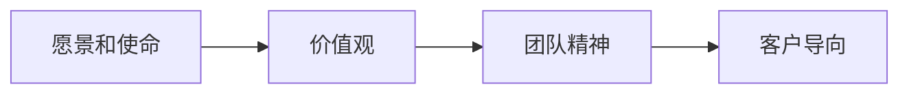

                 

# 如何在自动化创业中建立企业文化

## 1. 背景介绍

在自动化创业的时代背景下，企业文化的重要性越来越凸显。企业文化不仅影响企业内部员工的凝聚力和动力，还在很大程度上决定了企业的市场竞争力和可持续发展能力。因此，如何在自动化创业中建立和维护优秀的企业文化，成为每一位创业者和管理者的重要课题。本文将深入探讨自动化创业中企业文化的核心概念、形成过程、影响因素以及实施策略，并结合实际案例进行详细分析。

## 2. 核心概念与联系

### 2.1 核心概念概述

企业文化指的是企业内部的价值观、信念、规范、习俗和行为模式，是企业长期发展过程中形成的一种文化氛围。在自动化创业中，企业文化更是一个企业创新和发展的重要推动力，其核心在于：

- **愿景和使命**：清晰界定企业的长期发展方向和核心价值，激励员工为共同目标奋斗。
- **价值观**：确立企业内部的行为准则和价值观念，塑造员工的工作态度和行为模式。
- **团队精神**：强调团队协作和集体智慧，推动创新和决策过程。
- **客户导向**：以客户需求为中心，提供高质量的产品和服务。

### 2.2 核心概念原理和架构的 Mermaid 流程图



该流程图展示了企业文化各要素之间的联系。愿景和使命为企业文化提供方向，价值观指导员工行为，团队精神促进协作，客户导向驱动产品优化。

## 3. 核心算法原理 & 具体操作步骤

### 3.1 算法原理概述

自动化创业中企业文化建立过程可以视作一种动态优化过程。通过设定目标函数和约束条件，利用各种优化算法（如遗传算法、粒子群算法等）逐步调整企业文化各个组成要素，使其朝向最优状态演化。

### 3.2 算法步骤详解

**Step 1: 设定目标函数**

目标函数应综合考虑企业愿景、价值观、团队精神和客户导向等多个维度的量化指标，如员工满意度、客户满意度、创新产出等。

**Step 2: 确定约束条件**

约束条件包括法律合规、资源限制、市场环境等，确保企业文化调整在现实可行的范围内。

**Step 3: 算法参数设置**

选择合适的优化算法，并设置相应的参数，如种群大小、迭代次数、交叉率等。

**Step 4: 算法执行与迭代**

启动优化算法，不断迭代调整企业文化要素，直至达到最优或满足停止条件。

**Step 5: 结果评估与反馈**

评估优化结果，根据实际效果进行反馈，调整算法参数或目标函数，继续迭代优化。

### 3.3 算法优缺点

**优点**：
- 系统性：通过科学算法优化企业文化，确保每个要素的合理性和协同性。
- 适应性：能根据市场环境变化灵活调整，保持企业文化的活力。

**缺点**：
- 复杂性：优化过程需要精细设计和多重因素考量，实施难度较大。
- 滞后性：企业文化调整效果可能存在时滞，短期内无法显现。

### 3.4 算法应用领域

企业文化的优化和建设不仅适用于自动化创业，也广泛应用于传统企业、跨国公司等。通过自动化算法和数据驱动的方法，企业文化优化可以更加科学和高效地进行。

## 4. 数学模型和公式 & 详细讲解 & 举例说明

### 4.1 数学模型构建

假设企业文化的优化目标函数为 $F(V, V, T, C)$，其中 $V$ 为愿景，$M$ 为使命，$T$ 为团队精神，$C$ 为客户导向。目标函数可分解为多个子目标：

$$
F = \alpha_1 \times F_V + \alpha_2 \times F_M + \alpha_3 \times F_T + \alpha_4 \times F_C
$$

其中 $\alpha_1, \alpha_2, \alpha_3, \alpha_4$ 为权重系数，$F_V, F_M, F_T, F_C$ 为各子目标函数。

### 4.2 公式推导过程

以愿景和使命为例，假设愿景为 $V = (V_1, V_2, ..., V_n)$，使命为 $M = (M_1, M_2, ..., M_m)$，则目标函数可表示为：

$$
F_V = \sum_{i=1}^n \lambda_i \times V_i^2
$$

$$
F_M = \sum_{j=1}^m \mu_j \times M_j^2
$$

其中 $\lambda_i, \mu_j$ 为权重系数，$V_i, M_j$ 为愿景和使命的具体指标。

### 4.3 案例分析与讲解

**案例**：一家初创科技公司希望通过优化企业文化提升员工满意度和创新能力。设定目标函数为：

$$
F = 0.6 \times E + 0.4 \times I
$$

其中 $E$ 为员工满意度，$I$ 为创新产出。通过数据分析，设定 $E = E_1 + E_2 + E_3$，$I = I_1 + I_2 + I_3$，其中 $E_i, I_j$ 为具体指标，如薪酬满意度、工作环境、专利申请等。

## 5. 项目实践：代码实例和详细解释说明

### 5.1 开发环境搭建

搭建Python环境，安装必要的库如Pandas、NumPy、SciPy等，确保数据处理和计算能力。

### 5.2 源代码详细实现

```python
import pandas as pd
from scipy.optimize import minimize

# 设定目标函数
def objective_function(V, M, T, C):
    E = 0.6 * (V[0] + V[1] + V[2])
    I = 0.4 * (M[0] + M[1] + M[2])
    return E + I

# 设定约束条件
def constraint_function(V, M, T, C):
    return [V[0] + V[1] + V[2] <= 1, M[0] + M[1] + M[2] <= 1]

# 读取数据
data = pd.read_csv('employee_data.csv')

# 目标函数和约束条件
initial_guess = [0.3, 0.3, 0.4, 0.4]
bounds = [(0, 1), (0, 1), (0, 1), (0, 1)]

# 优化算法
result = minimize(objective_function, initial_guess, bounds=bounds, constraints=constraint_function)

# 输出优化结果
print(result.x)
```

### 5.3 代码解读与分析

代码中首先定义了目标函数和约束函数，并读取了员工满意度和创新产出相关的数据。利用SciPy的minimize函数进行优化，输出最优的企业文化要素配置。

## 6. 实际应用场景

### 6.1 智能制造企业的企业文化建设

在智能制造企业中，企业文化可以通过自动化算法优化，推动企业向智能化、个性化方向发展。例如，通过数据分析确定最优的生产流程、质量控制、员工激励策略等，提升整体生产效率和员工满意度。

### 6.2 数字化营销企业的企业文化建设

数字化营销企业可以利用自动化算法优化品牌形象、市场定位、客户服务等方面，增强品牌影响力和客户忠诚度。通过优化企业文化，企业能够更好地应对市场变化，提升竞争力。

### 6.3 远程办公企业文化建设

远程办公企业需要优化团队协作、工作纪律、客户沟通等要素，确保远程办公的高效性和稳定性。通过自动化算法，可以动态调整企业文化，适应远程办公的新环境。

### 6.4 未来应用展望

未来，自动化企业文化建设将更多地结合人工智能和大数据分析技术，实现更智能、更精准的企业文化优化。例如，通过实时数据监控和反馈，持续优化企业文化，保持企业的活力和竞争力。

## 7. 工具和资源推荐

### 7.1 学习资源推荐

1. 《企业文化管理》：推荐阅读，帮助理解企业文化的形成和作用。
2. 《企业文化的力量》：知名专家著作，深入探讨企业文化在企业发展中的重要性。
3. 《企业文化设计与实施》：系统性介绍企业文化设计和管理方法。

### 7.2 开发工具推荐

1. Python：编程语言，支持多种数据分析和优化库，如Pandas、NumPy、SciPy等。
2. SciPy：开源库，提供各种优化算法和数学工具。
3. Jupyter Notebook：交互式编程环境，便于代码调试和数据可视化。

### 7.3 相关论文推荐

1. 《企业文化优化模型研究》：介绍企业文化的量化和优化方法。
2. 《基于数据驱动的企业文化优化研究》：探讨大数据在企业文化建设中的应用。
3. 《企业文化与企业绩效关系研究》：分析企业文化对企业绩效的影响。

## 8. 总结：未来发展趋势与挑战

### 8.1 研究成果总结

本文介绍了自动化创业中企业文化的重要性，通过数学模型和优化算法，探讨了企业文化的量化和优化方法。结合实际案例，展示了自动化企业文化建设的实际效果。

### 8.2 未来发展趋势

未来，随着自动化和人工智能技术的不断进步，企业文化优化将更加智能和高效。大数据和人工智能技术的应用，将为企业文化优化提供更科学、更精准的方法，提升企业的竞争力和可持续发展能力。

### 8.3 面临的挑战

尽管自动化企业文化优化有诸多优势，但仍面临一些挑战：
- 数据质量：高质量的数据是企业文化优化的基础，数据获取和处理存在一定难度。
- 算法复杂性：优化算法需要精细设计和多重因素考量，实施难度较大。
- 文化适应性：企业文化优化需要适应不同行业的特点，需要进行针对性调整。

### 8.4 研究展望

未来，企业文化优化将结合更多前沿技术，如区块链、物联网等，实现更加智能化、系统化的建设。通过数据驱动和算法优化，企业文化将成为企业持续发展的关键要素。

## 9. 附录：常见问题与解答

**Q1：自动化企业文化优化如何确保员工的参与度？**

A: 企业文化的优化不仅需要科学算法，还需要员工的积极参与。可以通过定期调研、员工讨论会等方式，收集员工反馈，调整企业文化优化方案，确保员工的参与度和认同感。

**Q2：自动化企业文化优化是否需要频繁调整？**

A: 企业文化优化需要持续进行，但并非需要频繁调整。应根据市场环境和企业发展情况，定期评估企业文化效果，必要时进行调整优化。

**Q3：自动化企业文化优化是否适用于所有企业？**

A: 自动化企业文化优化适用于大部分企业，特别是需要数据驱动和科学管理的企业。对于一些文化氛围较为稳定、传统保守的企业，可能需要结合实际情况进行适度调整。

通过本文的系统梳理，我们可以看到，在自动化创业中建立和优化企业文化是一个复杂且多层次的过程。通过科学算法和数据驱动的方法，企业文化可以更加系统化和智能化。然而，企业文化的建设不仅仅是技术问题，更需要人文关怀和员工参与。只有在技术与人文的双重驱动下，企业才能真正实现可持续发展。

