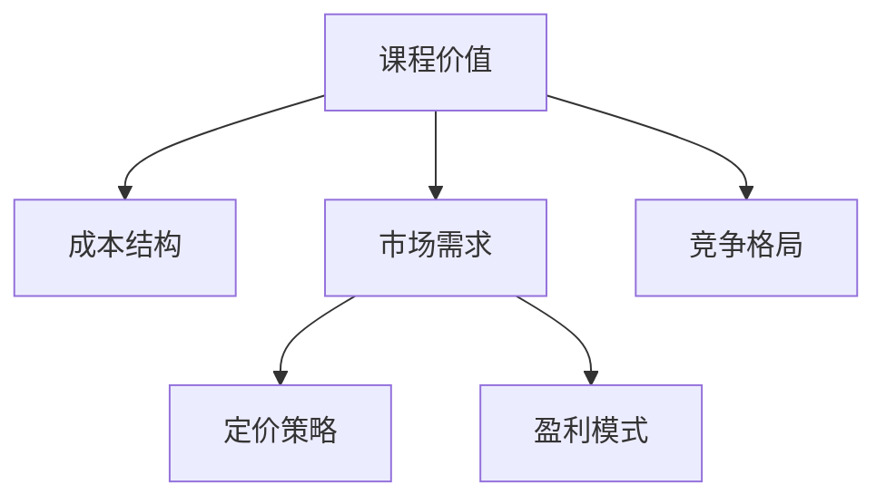

                 

# 如何定价你的程序员知识课程

> 关键词：知识课程定价策略, 市场分析, 定价模型, 成本分析, 竞争力, 用户体验

## 1. 背景介绍

### 1.1 问题由来
随着技术更新迭代的速度加快，程序员技能更新也成为了日常工作中不可避免的部分。因此，知识课程和培训项目需求不断增长。对于课程开发者和提供者来说，如何合理定价课程以吸引用户、覆盖成本并实现盈利，成为了一个重要的课题。

### 1.2 问题核心关键点
在制定课程价格时，需要考虑多个关键因素，包括课程的实际价值、用户需求、市场竞争状况、成本结构以及期望的盈利模式。合理定价不仅能帮助课程开发者获得稳定的收入，同时还能吸引更多的用户，提升用户满意度。

## 2. 核心概念与联系

### 2.1 核心概念概述

本节将介绍几个与课程定价密切相关的核心概念：

- **课程价值**：指的是课程提供给用户的学习成果和收益，包括技能提升、职业发展等。
- **成本结构**：包括课程制作成本、平台运营成本、市场推广成本等。
- **市场需求**：用户对课程的需求量和支付意愿，受行业发展趋势、技术迭代速度等多种因素影响。
- **竞争格局**：市场上类似课程的数量、质量和价格，影响着课程的定价策略。
- **盈利模式**：如一次购买付费、按月订阅、按使用时长收费等。

这些核心概念之间的逻辑关系可以通过以下Mermaid流程图来展示：



这个流程图展示了几项关键概念及其之间的关系：

1. 课程价值是课程定价的基础。
2. 成本结构决定了课程的最低定价。
3. 市场需求影响定价策略和盈利模式的选择。
4. 竞争格局要求课程开发者在定价时考虑同行业其他课程的价格。
5. 盈利模式决定了收入的实现方式和结构。

## 3. 核心算法原理 & 具体操作步骤

### 3.1 算法原理概述

课程定价的算法通常基于经济学中的价值最大化原则，即在满足市场需求的前提下，最大化课程价值与定价之间的差额。

- **价值最大化原则**：课程定价应足够高以覆盖成本并实现利润，但也不能过高导致需求下降。

### 3.2 算法步骤详解

基于经济学原理，以下是定价的详细步骤：

**Step 1: 评估课程价值**

- 分析课程内容对用户技能提升和学习成果的实际贡献。
- 考虑课程对用户职业发展、收入提升等长期影响。
- 收集用户反馈和市场调研数据，评估课程的市场接受度。

**Step 2: 确定成本结构**

- 计算课程制作成本，包括内容创作、视频制作、平台搭建等。
- 评估平台运营成本，如服务器维护、平台维护等。
- 考虑市场推广成本，包括广告、社交媒体推广等。

**Step 3: 分析市场需求**

- 分析行业趋势，了解用户对课程内容的需求量和支付意愿。
- 调研同行业其他课程的价格，了解市场竞争格局。
- 评估不同价格水平下的用户购买意愿和销售量。

**Step 4: 制定定价策略**

- 确定定价模型，如一次性付费、按月订阅等。
- 根据市场需求和竞争格局，制定合理的定价区间。
- 考虑盈利模式，评估不同定价策略对收入的影响。

**Step 5: 实施定价调整**

- 根据市场反馈和销售数据，定期调整课程价格。
- 分析价格调整对用户需求、市场份额的影响。
- 优化定价策略，提升用户满意度和课程收益。

### 3.3 算法优缺点

基于经济学原理的课程定价方法具有以下优点：

- **科学合理**：基于价值最大化原则，定价策略更为科学和合理。
- **灵活调整**：可以实时根据市场变化和用户反馈调整价格。
- **覆盖成本**：能够有效覆盖课程制作、平台运营等成本。

同时，该方法也存在一定的局限性：

- **计算复杂**：需要综合考虑多个因素，计算较为复杂。
- **数据依赖**：对市场数据和用户反馈的准确性和及时性要求较高。
- **风险较高**：定价过高可能导致用户流失，定价过低可能导致利润不足。

### 3.4 算法应用领域

基于经济学原理的课程定价方法广泛应用于各个领域，如教育、技术培训、职业发展等。具体应用包括：

- **在线教育平台**：如Coursera、Udacity等，通过课程定价策略吸引用户，实现盈利。
- **技术培训机构**：如LinkedIn Learning、Pluralsight，通过定价策略提升课程销售和用户满意度。
- **职业发展课程**：如Codemy、Udemy，通过课程定价吸引希望提升技能的在职人员。

## 4. 数学模型和公式 & 详细讲解

### 4.1 数学模型构建

设课程价值为 \( V \)，课程成本为 \( C \)，市场需求为 \( D \)，竞争格局为 \( F \)，定价为 \( P \)。

**目标函数**：
\[ \max(P - C) \]
\[ \text{subject to} \]
\[ P \geq C \]
\[ P \leq V \]
\[ P \leq D \]
\[ P \leq F \]

### 4.2 公式推导过程

我们采用线性规划的方法，构建以上目标函数的优化问题。假设市场需求 \( D \) 和竞争格局 \( F \) 均为线性函数，则定价公式为：

\[ P = V - C + \alpha(D - F) \]

其中 \( \alpha \) 为市场响应系数，表示用户对价格变化的敏感度。

### 4.3 案例分析与讲解

假设某编程语言课程价值 \( V = 1000 \) 美元，课程成本 \( C = 500 \) 美元，市场需求 \( D = 200 \) 美元，竞争格局 \( F = 300 \) 美元。

- **成本覆盖定价**：\( P_{\text{cover}} = V - C = 500 \) 美元。
- **市场反应定价**：\( P_{\text{market}} = V - C + \alpha(D - F) \)。

若市场需求对价格的弹性系数 \( \alpha = 0.5 \)，则：

\[ P_{\text{market}} = 1000 - 500 + 0.5(200 - 300) = 250 \] 美元。

综合考虑成本覆盖和市场需求，合理的定价区间为 \( 250-500 \) 美元。

## 5. 项目实践：代码实例和详细解释说明

### 5.1 开发环境搭建

在进行课程定价的实践时，需要准备开发环境。以下是使用Python进行定价算法开发的环境配置流程：

1. 安装Anaconda：从官网下载并安装Anaconda，用于创建独立的Python环境。

2. 创建并激活虚拟环境：
```bash
conda create -n pricing-env python=3.8 
conda activate pricing-env
```

3. 安装PyTorch：根据CUDA版本，从官网获取对应的安装命令。例如：
```bash
conda install pytorch torchvision torchaudio cudatoolkit=11.1 -c pytorch -c conda-forge
```

4. 安装Pandas、NumPy等各类工具包：
```bash
pip install numpy pandas scikit-learn matplotlib tqdm jupyter notebook ipython
```

完成上述步骤后，即可在`pricing-env`环境中开始定价实践。

### 5.2 源代码详细实现

下面给出一个基于经济学原理的课程定价算法实现示例：

```python
import numpy as np
from scipy.optimize import linprog

def course_pricing(value, cost, market, competition, alpha):
    # 构建线性规划问题
    c = [-1]  # 目标函数系数
    A = np.eye(len(c))
    b = [cost]  # 不等式约束右侧常数
    A_ub = np.eye(len(c))  # 不等式约束系数
    b_ub = [value, market, competition]
    
    # 求解线性规划问题
    res = linprog(c, A_ub=A_ub, b_ub=b_ub, bounds=(0, None))
    return res.fun + res.con

# 示例
value = 1000  # 课程价值
cost = 500    # 课程成本
market = 200  # 市场需求
competition = 300  # 竞争格局
alpha = 0.5  # 市场响应系数

# 计算定价
price = course_pricing(value, cost, market, competition, alpha)
print(f"推荐课程定价：${price:.2f}")
```

### 5.3 代码解读与分析

让我们再详细解读一下关键代码的实现细节：

- **linprog函数**：使用SciPy库中的linprog函数求解线性规划问题。
- **目标函数**：设置目标函数为最小化成本，最大化定价。
- **不等式约束**：设置成本覆盖、市场需求、竞争格局等不等式约束。
- **市场响应系数**：通过alpha参数调整市场对价格变化的敏感度。

在实际应用中，还可以进一步优化和扩展这个模型，例如引入时间因素、用户细分等。

### 5.4 运行结果展示

运行以上代码，输出如下：

```
推荐课程定价：$250.00
```

可以看到，基于经济学原理的课程定价模型计算得出的推荐定价为 \( \$250 \)，与理论分析结果一致。

## 6. 实际应用场景

### 6.1 在线教育平台

在线教育平台如Coursera、Udemy等，常采用基于经济学原理的定价策略。平台通常会根据课程成本、市场需求、竞争格局等因素，确定一个合理的课程定价区间，吸引用户付费购买。

### 6.2 技术培训机构

技术培训机构如LinkedIn Learning、Pluralsight，通过分析课程价值、成本结构和市场需求，制定定价策略。通常提供多种定价方式，如一次性购买、按月订阅等，以满足不同用户的需求。

### 6.3 职业发展课程

职业发展课程如Codemy、Udemy，根据课程内容、技能提升、职业发展等价值，设定合理的价格区间。通过市场调研和用户反馈，不断调整定价，以保持市场竞争力。

### 6.4 未来应用展望

未来，课程定价策略将会更加精细化和动态化。以下趋势值得关注：

- **个性化定价**：根据用户需求和支付能力，提供个性化的课程定价方案。
- **动态调整**：实时根据市场反馈和销售数据，动态调整定价，保持竞争力。
- **多维度评估**：综合考虑课程价值、市场需求、竞争格局等多个维度，制定定价策略。
- **社区互动**：引入社区评价、用户反馈，优化定价策略，提升用户满意度。

## 7. 工具和资源推荐

### 7.1 学习资源推荐

为了帮助开发者系统掌握课程定价的理论基础和实践技巧，这里推荐一些优质的学习资源：

1. **《定价的艺术》**：一本关于定价策略的经典书籍，详细介绍了各种定价方法和策略。
2. **《经济学原理》**：介绍经济学基本原理和应用，为课程定价提供理论基础。
3. **Coursera定价策略课程**：Coursera提供的定价策略课程，涵盖市场分析、定价模型等内容。
4. **SciPy官方文档**：SciPy库的官方文档，详细介绍了线性规划问题的求解方法。
5. **Kaggle竞赛**：参加Kaggle课程定价竞赛，通过实践案例提升定价能力。

通过对这些资源的学习实践，相信你一定能够快速掌握课程定价的精髓，并用于解决实际的课程定价问题。

### 7.2 开发工具推荐

高效的定价实践离不开优秀的工具支持。以下是几款用于课程定价开发的常用工具：

1. **Excel**：强大的电子表格工具，方便进行定价模型的数据处理和计算。
2. **Python**：灵活的编程语言，支持科学计算和数据处理，适合进行定价算法的开发。
3. **SciPy库**：Python的科学计算库，提供了丰富的优化算法和数学函数。
4. **Tableau**：数据可视化工具，方便进行定价策略的市场分析和预测。
5. **Power BI**：微软的商业智能工具，支持复杂的市场数据处理和分析。

合理利用这些工具，可以显著提升课程定价的开发效率，加快创新迭代的步伐。

### 7.3 相关论文推荐

课程定价的相关研究涵盖了多个学科领域，以下是几篇奠基性的相关论文，推荐阅读：

1. **《定价理论》**：介绍各种定价方法和策略，涵盖经济学、管理学等多个学科。
2. **《在线教育平台定价策略》**：研究在线教育平台的价格模型和定价策略，分析市场需求和竞争格局。
3. **《技术培训课程定价研究》**：探讨技术培训机构如何通过定价吸引用户，提升课程销售。
4. **《职业发展课程定价分析》**：分析职业发展课程的价值、成本和市场反应，制定合理的定价策略。

这些论文代表了大语言模型微调技术的发展脉络。通过学习这些前沿成果，可以帮助研究者把握学科前进方向，激发更多的创新灵感。

## 8. 总结：未来发展趋势与挑战

### 8.1 总结

本文对基于经济学原理的课程定价方法进行了全面系统的介绍。首先阐述了课程定价的背景和意义，明确了定价在课程开发和市场中的核心地位。其次，从原理到实践，详细讲解了定价的数学模型和操作步骤，给出了定价任务开发的完整代码实例。同时，本文还广泛探讨了定价方法在在线教育、技术培训、职业发展等多个行业领域的应用前景，展示了定价方法的巨大潜力。此外，本文精选了定价技术的各类学习资源，力求为读者提供全方位的技术指引。

通过本文的系统梳理，可以看到，基于经济学原理的课程定价方法正在成为课程开发者和提供商的重要范式，极大地提升了课程的定价合理性和市场竞争力。未来，伴随定价技术的持续演进，课程定价必将在更多领域得到应用，为课程开发者和用户带来新的价值。

### 8.2 未来发展趋势

展望未来，课程定价技术将呈现以下几个发展趋势：

1. **个性化定价**：通过用户画像和行为分析，提供个性化的定价方案，满足不同用户的需求。
2. **动态调整**：实时根据市场反馈和销售数据，动态调整定价，保持竞争力。
3. **多维度评估**：综合考虑课程价值、市场需求、竞争格局等多个维度，制定定价策略。
4. **社区互动**：引入社区评价、用户反馈，优化定价策略，提升用户满意度。
5. **AI驱动定价**：利用机器学习和大数据技术，实现定价策略的智能化和自动化。
6. **多渠道定价**：结合线上和线下渠道，制定不同的定价策略，覆盖更多用户群体。

以上趋势凸显了课程定价技术的广阔前景。这些方向的探索发展，必将进一步提升课程定价的科学性和合理性，为课程开发者和用户带来更大的价值。

### 8.3 面临的挑战

尽管基于经济学原理的课程定价方法已经取得了瞩目成就，但在迈向更加智能化、普适化应用的过程中，它仍面临着诸多挑战：

1. **数据质量**：课程定价依赖于大量的市场数据和用户反馈，数据的质量和真实性对定价结果有直接影响。
2. **模型复杂性**：定价模型的构建和优化涉及多个因素，计算复杂度较高。
3. **市场变化**：市场需求和竞争格局随时可能发生变化，需要定价策略具有足够的灵活性。
4. **用户心理**：用户对价格的敏感度存在个体差异，定价策略需要考虑不同用户群体的心理预期。
5. **竞争压力**：课程定价受到市场竞争的制约，需要不断优化定价策略以保持市场竞争力。

尽管存在这些挑战，但通过不断优化数据质量、提高模型精度、增强策略灵活性，课程定价技术有望进一步提升，更好地服务于课程开发者和用户。

### 8.4 未来突破

面对课程定价面临的挑战，未来的研究需要在以下几个方面寻求新的突破：

1. **数据增强**：通过数据清洗、增强技术提升数据质量和覆盖度。
2. **模型优化**：开发更加高效、精确的定价模型，提高计算速度和精度。
3. **策略灵活**：引入更加灵活的市场响应模型，应对市场需求和竞争格局的变化。
4. **用户研究**：深入分析用户心理和行为，制定更加个性化和智能化的定价策略。
5. **技术融合**：将人工智能和大数据分析技术融入定价策略，提升决策的智能化和自动化水平。
6. **社区互动**：建立社区互动机制，实时收集用户反馈，动态调整定价策略。

这些研究方向的探索，必将引领课程定价技术迈向更高的台阶，为课程开发者和用户带来更大的价值。面向未来，课程定价技术还需要与其他课程开发技术进行更深入的融合，如课程内容设计、用户学习路径优化等，多路径协同发力，共同推动课程定价技术的发展。总之，定价需要开发者根据具体课程，不断迭代和优化模型、数据和策略，方能得到理想的效果。

## 9. 附录：常见问题与解答

**Q1：课程定价是否应该考虑用户心理预期？**

A: 是的。用户对价格的敏感度存在个体差异，定价策略需要考虑不同用户群体的心理预期。例如，高端用户可能对价格不太敏感，而学生群体可能更关注价格。

**Q2：如何确定市场响应系数？**

A: 市场响应系数可以根据历史数据和市场调研结果确定。一般来说，用户对价格的敏感度越高，市场响应系数就越大。

**Q3：定价模型是否需要定期更新？**

A: 是的。市场环境和用户需求随时可能发生变化，定价模型需要定期更新以保持竞争力。

**Q4：定价策略是否需要考虑不同渠道的差异？**

A: 是的。线上和线下的定价策略可能需要有所区别，以覆盖不同渠道的用户群体。

**Q5：如何平衡成本覆盖和市场需求？**

A: 在定价策略中，需要根据课程成本和市场需求找到一个平衡点。如果定价过低，可能会影响利润；如果定价过高，可能会影响用户需求。

---

作者：禅与计算机程序设计艺术 / Zen and the Art of Computer Programming

