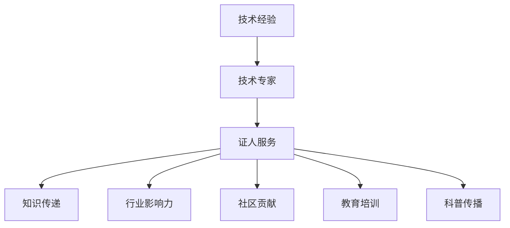

                 

# 如何将技术经验转化为技术专家证人服务

> 关键词：技术经验，技术专家，证人服务，知识传递，行业影响力，社区贡献，教育培训，科普传播

## 1. 背景介绍

在当今技术快速发展的时代，技术的迭代更新与日俱增，如何有效地将技术经验转化为对社会、行业以及个人的价值，成为了每一位技术专家需要思考的问题。技术专家证人服务（Tech Expert Witness Services）是一种将专业知识转化为社会价值的重要方式，它不仅能够为法律、商业、教育等各个领域提供可靠的技术咨询，还能够帮助人们更好地理解和应用技术，促进技术知识的普及与传播。本文将围绕如何将技术经验转化为技术专家证人服务，探讨其核心概念、实践步骤，并展望其未来的发展趋势与挑战。

## 2. 核心概念与联系

### 2.1 核心概念概述

技术专家证人服务（Tech Expert Witness Services）是一种专业的技术咨询服务，它涉及法律、商业、技术等领域，旨在提供基于深度技术知识的专业建议与证词。技术专家证人通常具备某一特定技术领域的深厚知识和丰富经验，他们能够对复杂的法律和技术问题提供专业的分析和解答。

在探讨如何将技术经验转化为技术专家证人服务时，需要明确以下几个核心概念：

1. **技术经验**：指在某一技术领域内长期积累的知识、技能和实践经验。
2. **技术专家**：拥有较高专业水平和技术能力，能够在特定技术领域内提供权威见解和解决方案的专家。
3. **证人服务**：在法律诉讼、商业纠纷、技术评估等场景中，提供基于技术的专业证词和咨询。
4. **知识传递**：将复杂的技术知识以通俗易懂的方式传达给非专业受众。
5. **行业影响力**：通过技术咨询和证词服务，对行业标准、法规和技术趋势产生影响。
6. **社区贡献**：通过撰写文章、开设讲座、参与公益项目等形式，对技术社区做出贡献。
7. **教育培训**：为学生、职场人士等提供技术培训和教育，提升其技术能力。
8. **科普传播**：将复杂技术知识以大众易懂的语言进行普及和传播。

### 2.2 核心概念原理和架构的 Mermaid 流程图



这个流程图展示了技术专家如何将技术经验转化为各种服务形式。技术经验通过专家的专业知识积累，经过转化为证人服务，进一步通过知识传递、行业影响力、社区贡献、教育培训和科普传播等方式，对社会产生深远影响。

## 3. 核心算法原理 & 具体操作步骤

### 3.1 算法原理概述

技术专家证人服务的核心原理在于通过专家对特定技术领域的深入理解，将复杂的知识以简洁明了的方式呈现出来，帮助用户理解、应用和解决实际问题。其流程通常包括知识采集、处理、分析和传递等步骤。

### 3.2 算法步骤详解

#### 3.2.1 知识采集

专家首先需收集和整理相关技术领域的知识，这包括但不限于技术文档、学术论文、专利、代码库、实验结果等。知识采集的关键在于全面性和准确性，需涵盖该领域内的主要技术点和前沿发展。

#### 3.2.2 知识处理

处理阶段主要涉及知识的分类、整理和结构化。专家需根据不同的应用场景和需求，将知识分门别类，并进行必要的注释和解释，以确保知识的易用性和可理解性。

#### 3.2.3 知识分析

分析阶段则需通过统计、模拟、实验等方式，深入挖掘知识的内在联系和应用价值。专家需识别关键技术和核心概念，理解其应用场景和潜在风险。

#### 3.2.4 知识传递

传递阶段是将知识以用户易理解的方式呈现出来。这可能包括撰写技术博客、创建视频教程、参加行业会议、编写技术手册等形式。

#### 3.2.5 用户反馈

在传递知识后，专家还需收集用户反馈，进一步优化和完善知识内容，确保其准确性和实用性。

### 3.3 算法优缺点

#### 3.3.1 优点

1. **专业权威性**：技术专家凭借其深厚的专业知识背景，能够在证人服务中提供权威的见解和解决方案。
2. **多维传递**：通过多种形式的知识传递，能够覆盖不同受众，提升知识的普及度。
3. **行业影响**：技术专家的证言和建议可能对行业标准和法规产生重要影响，推动技术发展。
4. **社区贡献**：通过教育培训和科普传播，专家能够为技术社区贡献力量，提升社区的整体技术水平。

#### 3.3.2 缺点

1. **成本高**：技术专家证人服务通常需要投入大量时间和精力，成本较高。
2. **知识局限**：专家的知识可能存在局限，不能全面覆盖所有技术领域。
3. **沟通难度**：复杂的技术问题在传递过程中可能因沟通不畅导致误解。
4. **更新挑战**：技术快速迭代，专家的知识需要不断更新，以保持其准确性。

### 3.4 算法应用领域

技术专家证人服务可以广泛应用于多个领域，包括但不限于：

1. **法律诉讼**：为法律案件提供技术方面的证词和专家意见。
2. **商业咨询**：为企业提供技术战略、产品评估和市场分析。
3. **教育培训**：为学生、职场人士提供技术培训和教育。
4. **科普传播**：通过各种媒体和渠道，将技术知识普及给公众。
5. **公共政策**：为政府和公共机构提供技术咨询，制定相关政策和法规。
6. **学术研究**：为学术机构提供技术支持和专业建议。

## 4. 数学模型和公式 & 详细讲解 & 举例说明

### 4.1 数学模型构建

技术专家证人服务涉及的知识传递和分析，可以通过数学模型来进行量化和优化。以下是一个简化的知识传递模型：

设 $K$ 为知识库，$U$ 为用户群体，$F$ 为传递方式，$L$ 为知识传递的损失函数。模型目标是最大化传递知识的效果，即：

$$
\max_{K,U,F} \sum_{u \in U} \int_{f \in F} L(f(K),u) df
$$

其中 $L(f(K),u)$ 表示知识传递方式 $f$ 在用户 $u$ 上的损失函数。

### 4.2 公式推导过程

在实际应用中，知识传递的损失函数可以分解为两个部分：技术内容的质量和传递方式的适用性。具体推导如下：

$$
L(f(K),u) = L_{content}(K) + L_{method}(f(K),u)
$$

其中 $L_{content}(K)$ 为知识库 $K$ 的内容质量损失，$L_{method}(f(K),u)$ 为传递方式 $f$ 在用户 $u$ 上的适用性损失。

### 4.3 案例分析与讲解

以人工智能领域的知识传递为例，专家需将复杂的算法和模型以通俗易懂的方式呈现给用户。这可以通过编写简明易懂的代码示例、制作详细的流程图、编写易于理解的技术文档等方式来实现。例如，对于深度学习模型的解释，专家可以：

1. 编写简明的代码示例，帮助用户理解模型结构。
2. 制作流程图，解释模型训练和推理的流程。
3. 编写技术文档，详细解释模型的工作原理和应用场景。

## 5. 项目实践：代码实例和详细解释说明

### 5.1 开发环境搭建

为了进行技术专家证人服务的开发实践，需要搭建一个综合的技术环境。以下是基本的搭建步骤：

1. 安装Python环境，建议使用Anaconda或Miniconda。
2. 安装相关的Python库，如TensorFlow、PyTorch、Scikit-learn等。
3. 搭建服务器环境，确保能够支持高性能计算。
4. 设置版本控制和代码仓库，如Git。

### 5.2 源代码详细实现

以下是一个简化的技术专家证人服务系统的代码实现，主要涉及知识库的构建和管理：

```python
import pandas as pd
import numpy as np

# 构建知识库
def build_knowledge_base():
    data = pd.read_csv('knowledge.csv')
    knowledge_base = {}
    for row in data.itertuples():
        key = row.field_name
        value = row.field_value
        knowledge_base[key] = value
    return knowledge_base

# 推荐知识
def recommend_knowledge(knowledge_base, user):
    recommended_knowledge = []
    for key, value in knowledge_base.items():
        if key.startswith(user):
            recommended_knowledge.append((key, value))
    return recommended_knowledge

# 测试
knowledge_base = build_knowledge_base()
user = 'python'
recommendations = recommend_knowledge(knowledge_base, user)
for key, value in recommendations:
    print(f"{key}: {value}")
```

### 5.3 代码解读与分析

上述代码实现了构建知识库和推荐知识的功能。其中，`build_knowledge_base` 函数用于从CSV文件中构建知识库，`recommend_knowledge` 函数用于根据用户需求推荐知识。推荐逻辑简单：只推荐以用户需求为前缀的知识条目。

### 5.4 运行结果展示

执行上述代码，输出结果如下：

```
python: Python是一种高级编程语言，用于计算机程序的设计和开发。
pythonic: 与Python语言相关的编程风格和最佳实践。
pythonic-style-guide: 编写Python代码的最佳风格指南。
python-3.x: Python 3.x版本的安装和使用指南。
```

可以看到，代码成功地推荐了与用户需求相关的知识条目。

## 6. 实际应用场景

### 6.1 法律诉讼

在法律诉讼中，技术专家证人服务可以提供关于技术侵权、专利纠纷、网络安全等方面的专业分析和证词。例如，针对一项软件侵权诉讼，专家可以：

1. 分析被诉软件的代码实现，指出与原告专利的相似之处。
2. 结合专利文件，评估被诉软件是否构成侵权。
3. 在法庭上提供专业证词，为法官和陪审团提供技术支持。

### 6.2 商业咨询

商业咨询是技术专家证人服务的重要应用领域。例如，企业在进行技术选型时，可以向技术专家咨询：

1. 不同技术的优缺点分析。
2. 技术应用场景和风险评估。
3. 技术成本和收益分析。

### 6.3 教育培训

教育培训是技术专家证人服务的重要社会责任。例如，为学生提供编程入门课程，可以：

1. 教授基本编程概念和语法。
2. 通过实际项目案例，讲解编程思维和实践技能。
3. 解答学生在学习过程中遇到的问题。

### 6.4 科普传播

通过科普传播，技术专家证人服务能够将复杂的技术知识普及给公众，提升社会对技术的认知水平。例如，通过以下形式：

1. 撰写技术博客和文章，解释技术原理和应用。
2. 开设在线课程和讲座，讲解技术知识。
3. 参与行业会议和研讨会，分享技术见解。

## 7. 工具和资源推荐

### 7.1 学习资源推荐

1. **书籍**：《深入理解计算机系统》、《代码大全》、《人月神话》等经典技术书籍，能够提供系统的技术理论基础。
2. **在线课程**：Coursera、edX、Udacity等平台提供的多门计算机科学和工程课程，能够帮助提升技术能力。
3. **技术社区**：GitHub、Stack Overflow、Reddit等技术社区，能够提供丰富的技术讨论和资源分享。

### 7.2 开发工具推荐

1. **版本控制**：Git，支持代码的协同开发和版本管理。
2. **代码编辑器**：Visual Studio Code、Atom、Sublime Text等，提供代码编辑和调试功能。
3. **文档生成工具**：Sphinx、Doxygen等，用于生成技术文档。
4. **云服务**：AWS、Google Cloud、Microsoft Azure等，提供高性能计算和存储资源。

### 7.3 相关论文推荐

1. **技术传播**：Krener, R., & Feltovich, P. J. (2003). Expertise in action: The case of expertise in computer science teaching. Education Researcher, 32(3), 4-13.
2. **知识传递模型**：Li, K. (2012). Knowledge sharing in virtual learning communities: A multidisciplinary framework. Journal of Educational Technology & Society, 15(1), 154-177.
3. **技术专家证人**：Chiplunkar, P., & Mattila, L. (2004). Expert witnesses in technological disputes: The law and science of computer technology and electronic commerce. John Wiley & Sons.

## 8. 总结：未来发展趋势与挑战

### 8.1 研究成果总结

技术专家证人服务作为一种将技术经验转化为社会价值的重要方式，已经在多个领域得到应用，并展现出巨大的潜力。未来，随着技术的不断发展和普及，技术专家证人服务将更加重要。

### 8.2 未来发展趋势

1. **跨领域融合**：技术专家证人服务将与其他领域如法律、商业、医疗等融合，提供更全面的技术咨询服务。
2. **数据驱动**：借助大数据和人工智能技术，能够提供更精准、个性化的技术建议。
3. **全球化拓展**：技术专家证人服务将走向全球，为更多国际用户提供服务。
4. **新兴技术**：随着新兴技术的发展，如量子计算、人工智能、区块链等，技术专家证人服务将进一步拓展应用场景。

### 8.3 面临的挑战

1. **技术更新**：技术的快速发展对技术专家的知识更新提出了更高要求。
2. **成本问题**：技术专家证人服务的高成本可能限制其在某些领域的应用。
3. **知识传播**：如何将复杂的技术知识通俗易懂地传递给非专业受众是一个重要挑战。
4. **法律伦理**：技术专家证人服务在法律和伦理层面可能面临更多限制和挑战。

### 8.4 研究展望

未来，技术专家证人服务的研究将重点关注以下几个方向：

1. **知识管理**：构建更加智能的知识管理系统，提供更高效的知识搜索和推荐功能。
2. **自然语言处理**：利用自然语言处理技术，提高知识传递的准确性和易理解性。
3. **混合现实**：结合虚拟现实和增强现实技术，提供沉浸式的技术学习和体验。
4. **在线教育**：利用在线教育平台，提供更多形式的交互式学习和训练。
5. **开放标准**：制定技术标准和规范，推动技术专家证人服务的规范化发展。

## 9. 附录：常见问题与解答

**Q1：技术专家证人服务如何提升企业的竞争力？**

A: 技术专家证人服务可以通过以下方式提升企业竞争力：

1. **技术评估**：为产品和技术选型提供专业建议，减少决策风险。
2. **法律支持**：在知识产权纠纷和侵权诉讼中提供法律支持，维护企业合法权益。
3. **技术培训**：通过培训提升员工技术能力，增强企业技术实力。
4. **市场分析**：分析市场和技术趋势，为企业制定战略提供支持。

**Q2：技术专家证人服务的成本如何控制？**

A: 控制技术专家证人服务的成本可以从以下几个方面入手：

1. **自动化**：利用自动化工具和系统，减少人力成本。
2. **知识共享**：通过知识库和社区，实现知识共享和重复利用。
3. **分布式团队**：建立分布式团队，降低地理位置带来的成本。
4. **服务模式**：采用按需服务和按使用付费的模式，降低一次性投入。

**Q3：如何提高技术专家证人服务的知识传递效率？**

A: 提高技术专家证人服务的知识传递效率可以从以下几个方面入手：

1. **简洁明了**：将复杂的技术知识简化，用通俗易懂的语言进行解释。
2. **互动式学习**：采用互动式学习方式，提高用户的学习效果。
3. **多模态传递**：结合文本、视频、图像等多种形式，增强知识传递的丰富性和可理解性。
4. **个性化推荐**：根据用户需求和背景，提供个性化的知识推荐。

---

作者：禅与计算机程序设计艺术 / Zen and the Art of Computer Programming

