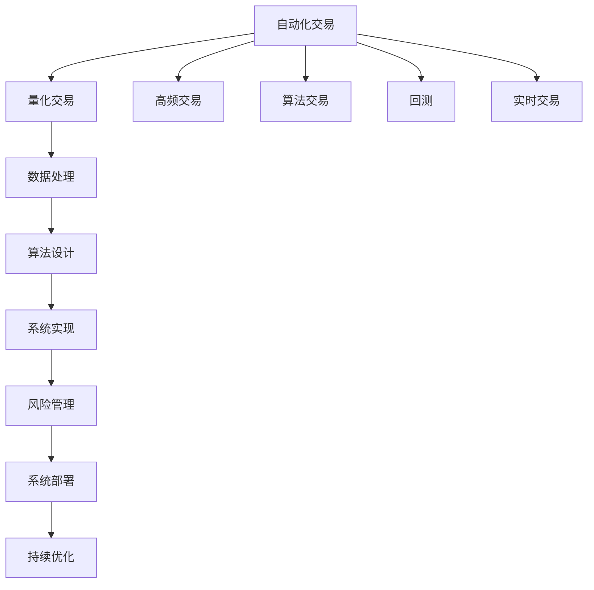

                 

# 如何将编程技能应用于自动化交易

## 1. 背景介绍

### 1.1 问题由来

自动化交易是金融领域的一大热门话题。随着金融市场的发展和互联网技术的进步，投资者可以通过自动化交易系统，快速、高效地执行复杂的交易策略。这种系统能够实时处理大量数据，快速响应市场变化，并依据预设规则自动买入或卖出资产，从而帮助投资者获取更优化的收益。

自动化交易的核心在于编程技能的应用，开发者需通过编写交易算法、设计策略系统、构建数据处理模块等，实现自动交易系统的核心功能。本文将系统性地介绍如何将编程技能应用于自动化交易，并从实际案例中展示其应用效果。

### 1.2 问题核心关键点

自动化交易的编程涉及多个关键技术点，包括：
1. 数据处理：从数据源获取市场数据、交易数据、公司财报等。
2. 算法设计：设计高效的交易策略，包括技术分析、基本面分析、量化策略等。
3. 系统实现：构建高性能的交易系统，并实现策略的回测与实时执行。
4. 风险管理：开发风险控制模型，预防系统性风险。
5. 系统部署：将系统部署至生产环境，并进行稳定运行。
6. 持续优化：根据市场反馈不断优化算法和系统，适应市场变化。

本文将围绕这些关键点，详细解析如何将编程技能应用于自动化交易，并探讨其在实际交易中的应用效果。

## 2. 核心概念与联系

### 2.1 核心概念概述

为更好地理解自动化交易的编程实现，本节将介绍几个核心概念：

- 自动化交易(Automated Trading)：利用计算机程序自动执行交易指令，实现预定的投资策略。该系统可以实时监控市场动态，快速响应，自动调整仓位。
- 量化交易(Quantitative Trading)：应用数学模型和统计学方法，分析市场数据，构建交易策略。量化交易强调算法的客观性和可重复性。
- 高频交易(High-Frequency Trading, HFT)：以高频算法和策略为核心，追求微小价差收益的自动化交易策略。
- 算法交易(Algorithmic Trading)：应用复杂的算法和模型，自动化执行交易策略，目的是优化收益与风险。
- 回测(Backtesting)：在历史数据上测试交易策略的有效性，评估策略的盈亏状况。回测可帮助开发者完善策略，降低交易风险。
- 实时交易(Live Trading)：将策略部署至真实市场，进行实时的买入和卖出操作。实时交易涉及更复杂的系统设计和数据处理。

这些核心概念之间的逻辑关系可以通过以下Mermaid流程图来展示：



这个流程图展示自动化交易的核心概念及其之间的关系：

1. 自动化交易基于量化交易和算法交易的策略设计，依赖于高频交易和实时交易的操作执行。
2. 策略设计离不开数据处理和系统实现，风险管理和系统部署是系统稳定运行的重要保障。
3. 数据处理和策略设计在回测中不断迭代优化，实时交易效果在持续优化中提升。

这些概念共同构成了自动化交易系统的实现框架，使其能够在各种场景下高效地执行交易策略。通过理解这些核心概念，我们可以更好地把握自动化交易系统的实现逻辑和设计原则。

## 3. 核心算法原理 & 具体操作步骤

### 3.1 算法原理概述

自动化交易系统的核心算法原理主要包括以下几个部分：

- 数据采集：通过API获取市场价格、交易量、公司财报等实时数据。
- 算法策略：设计算法，根据市场数据和预设规则自动生成交易信号。
- 回测分析：在历史数据上测试策略的效果，优化算法参数。
- 实时执行：在实时市场数据下执行交易信号，进行交易操作。
- 风险管理：实时监控交易系统风险，预防系统性风险。
- 持续优化：根据市场变化不断调整和优化算法，适应新的市场环境。

基于这些核心算法，自动化交易系统能够高效地执行复杂的交易策略，自动调整仓位，降低人为干预带来的风险，实现更优的收益。

### 3.2 算法步骤详解

自动化交易系统通常包括预处理、策略设计、回测和实测等多个步骤。以下详细介绍这些步骤的算法实现：

**Step 1: 数据预处理**
- 获取市场数据：利用API获取实时的股票价格、交易量、公司财报等数据。
- 数据清洗：处理缺失值、异常值等，确保数据的质量和一致性。
- 数据归一化：对数据进行归一化处理，便于算法的训练和计算。
- 特征工程：设计有意义的特征向量，提高算法的表现。

**Step 2: 策略设计**
- 市场分析：利用技术分析和基本面分析方法，识别市场机会。
- 策略构建：设计交易策略，包括买入、卖出和仓位调整等规则。
- 模型训练：在历史数据上训练模型，优化算法参数。
- 交易信号生成：根据模型预测结果，生成具体的交易信号。

**Step 3: 回测分析**
- 历史数据获取：获取交易策略所需的全部历史数据。
- 数据划分：将历史数据划分为训练集和测试集，进行交叉验证。
- 回测执行：在训练集上进行回测，评估策略的盈亏状况。
- 结果分析：分析回测结果，识别策略的优势和不足。
- 策略优化：根据回测结果，调整算法参数，优化策略。

**Step 4: 实测执行**
- 交易模拟：在真实市场环境下进行策略的模拟测试。
- 系统设计：构建高性能的交易系统，支持实时的数据处理和交易执行。
- 风险控制：设计风险管理模型，实时监控系统风险。
- 交易执行：根据实时市场数据，执行交易信号，进行买卖操作。
- 结果监控：实时监控交易结果，分析系统性能。
- 策略优化：根据实测结果，进一步优化交易策略。

**Step 5: 持续优化**
- 数据监控：实时监控市场数据，获取最新信息。
- 策略调整：根据市场变化，调整交易策略，优化算法。
- 系统优化：优化交易系统的数据处理和交易执行模块，提升性能。
- 风险控制：实时监控系统风险，及时采取风险应对措施。
- 策略评估：定期评估策略的绩效，判断是否符合预期。

### 3.3 算法优缺点

自动化交易系统的核心算法具有以下优点：
1. 高效执行：能够快速、自动化地执行复杂的交易策略，提高交易效率。
2. 降低风险：通过算法优化和风险控制，降低人为操作带来的风险。
3. 稳定运行：系统自动执行策略，减少人为干预，提高交易的稳定性和一致性。
4. 可扩展性：通过算法和系统设计，可适应不同类型的交易策略和市场环境。

同时，该算法也存在一些缺点：
1. 数据依赖：依赖实时市场数据，一旦数据源出现问题，将影响系统的正常运行。
2. 算法局限：算法的表现依赖于历史数据，可能存在过拟合或欠拟合的问题。
3. 模型复杂：设计复杂的算法和模型，需要较强的数学和编程技能。
4. 实时处理：实时交易涉及复杂的系统设计和数据处理，性能要求较高。
5. 高成本：开发和维护自动化交易系统需要高额的计算资源和技术投入。

尽管存在这些缺点，但基于算法驱动的自动化交易，已经在高频交易和量化交易等领域取得了显著成效，成为现代金融市场的重要工具。

### 3.4 算法应用领域

自动化交易系统的核心算法在金融市场的多领域得到了广泛应用，包括但不限于：

- 高频交易：利用高频算法和策略，实现微小价差的套利机会。
- 量化交易：应用数学模型和统计学方法，设计量化交易策略。
- 套利交易：通过识别市场定价偏差，进行套利操作，实现高额收益。
- 算法交易：利用复杂的算法和模型，自动化执行交易策略，优化收益与风险。
- 程序化交易：使用自动化交易系统，进行长期的趋势跟踪和策略执行。

除了以上这些领域，自动化交易系统还广泛应用于衍生品交易、基金管理、风险管理等多个场景，通过算法驱动实现更高效、更稳定的交易操作。

## 4. 数学模型和公式 & 详细讲解 & 举例说明

### 4.1 数学模型构建

在自动化交易系统中，常见的数学模型包括时间序列预测模型、风险管理模型、优化模型等。

- 时间序列预测模型：如ARIMA、LSTM等，用于预测未来市场价格和波动性。
- 风险管理模型：如VaR、ES等，用于评估交易策略的风险水平。
- 优化模型：如线性规划、非线性规划等，用于优化交易策略的参数。

以时间序列预测模型为例，我们以ARIMA模型进行解释和计算：

设时间序列 $y_t$ 是平稳的，其均值为 $\mu$，方差为 $\sigma^2$，自相关函数为 $\rho$。ARIMA模型的目标是拟合数据并预测未来值，其数学形式为：

$$
y_t = \mu + \epsilon_t + \phi_1(y_{t-1} - \mu) + \phi_2(y_{t-2} - \mu) + \theta_1\epsilon_{t-1} + \theta_2\epsilon_{t-2}
$$

其中 $\epsilon_t$ 是误差项，满足 $\epsilon_t \sim N(0, \sigma^2)$。

ARIMA模型的参数估计和预测可以通过Python中的statsmodels库完成。以下是一个简单的ARIMA模型的训练和预测示例：

```python
import statsmodels.api as sm
import pandas as pd

# 假设数据为 y，用Python处理并构建模型
y = pd.read_csv('time_series.csv', index_col='date')
y_diff = y.diff()
model = sm.tsa.ARIMA(y_diff, order=(1, 1, 2))
result = model.fit()
forecast = result.forecast(steps=1)

print(forecast)
```

### 4.2 公式推导过程

以下是ARIMA模型的推导过程：

**定义：**
设时间序列 $y_t$ 是平稳的，其均值为 $\mu$，方差为 $\sigma^2$，自相关函数为 $\rho$。

**模型假设：**
1. 误差项 $\epsilon_t$ 满足 $N(0, \sigma^2)$。
2. 数据具有平稳性，即 $\mathbb{E}[y_t] = \mu$，$\text{Var}(y_t) = \sigma^2$。
3. 自相关性，即 $\text{Corr}(y_t, y_{t-k}) = \rho^k$。

**模型形式：**
$$
y_t = \mu + \epsilon_t + \phi_1(y_{t-1} - \mu) + \phi_2(y_{t-2} - \mu) + \theta_1\epsilon_{t-1} + \theta_2\epsilon_{t-2}
$$

**参数估计：**
1. 最大似然估计：$\hat{\mu} = \frac{1}{T} \sum_{t=1}^T y_t$。
2. 自回归项系数估计：$\hat{\phi} = \frac{1}{T} \sum_{t=1}^T (y_t - \mu - \phi_1(y_{t-1} - \mu) - \phi_2(y_{t-2} - \mu))$。
3. 差分项系数估计：$\hat{\theta} = \frac{1}{T} \sum_{t=1}^T \epsilon_t$。

**预测：**
根据已得到的模型参数，可以预测未来时间点的值。假设未来时间点的预测值为 $y_{t+1}$，其预测公式为：

$$
\hat{y}_{t+1} = \mu + \epsilon_{t+1} + \phi_1(y_t - \mu) + \phi_2(y_{t-1} - \mu) + \theta_1\epsilon_t + \theta_2\epsilon_{t-1}
$$

通过Python中的statsmodels库，可以方便地实现ARIMA模型的训练和预测。

### 4.3 案例分析与讲解

**案例分析：**

某投资公司希望通过ARIMA模型预测股票价格的变化趋势。首先，他们收集了过去一年内每天的股票价格数据，并计算出每日的收盘价和涨跌幅。然后，他们利用Python进行模型训练和预测。具体步骤如下：

1. 导入数据并处理：
```python
import pandas as pd
import numpy as np
from statsmodels.tsa.arima_model import ARIMA

# 假设数据为 daily_prices.csv
daily_prices = pd.read_csv('daily_prices.csv', index_col='date')
daily_prices['return'] = daily_prices['price'].pct_change()
```

2. 训练模型：
```python
model = ARIMA(daily_prices['return'], order=(1, 1, 2))
result = model.fit()
```

3. 预测未来价格：
```python
forecast = result.forecast(steps=10)
```

通过上述代码，可以实现对未来10天的股票价格变化趋势进行预测。模型的预测效果可以使用不同指标进行评估，如MAE、RMSE等，以衡量预测的准确性。

## 5. 项目实践：代码实例和详细解释说明

### 5.1 开发环境搭建

在自动化交易系统的开发中，Python是主要编程语言。以下是Python开发环境的搭建步骤：

1. 安装Python：从官网下载并安装Python 3.8及以上版本。
2. 安装Anaconda：从官网下载并安装Anaconda，用于创建独立的Python环境。
3. 创建并激活虚拟环境：
```bash
conda create -n trading-env python=3.8
conda activate trading-env
```

4. 安装必要的Python包：
```bash
pip install numpy pandas scipy statsmodels scikit-learn portfolio pyfolio statsmodels pandas-datareader
```

5. 安装必要的金融库：
```bash
pip install yfinance
```

6. 安装必要的机器学习库：
```bash
pip install scikit-learn xgboost lightgbm
```

完成上述步骤后，即可在`trading-env`环境中开始自动化交易系统的开发。

### 5.2 源代码详细实现

以下是一个简单的回测系统代码实现，用于验证交易策略的效果。该系统包含数据处理、策略设计、回测分析等功能模块：

```python
import pandas as pd
import numpy as np
from statsmodels.tsa.arima_model import ARIMA
from sklearn.metrics import mean_squared_error

# 加载历史数据
data = pd.read_csv('historical_data.csv', index_col='date')
data = data.dropna()

# 处理数据
data['return'] = data['price'].pct_change()

# 定义交易策略
def trading_strategy(data):
    # 设定买入和卖出点
    buy_price = data['price'].mean() - 0.05 * data['price'].std()
    sell_price = data['price'].mean() + 0.05 * data['price'].std()
    
    # 生成交易信号
    signals = np.zeros_like(data['return'])
    signals[np.where(data['return'] >= buy_price)[0]] = 1
    signals[np.where(data['return'] <= sell_price)[0]] = -1
    
    # 计算交易收益
    returns = data['price'].groupby(data['return'].cumsum()).mean()
    
    # 评估策略
    mse = mean_squared_error(data['return'], returns)
    return mse

# 测试策略
strategy_mse = trading_strategy(data)
print(f'策略的均方误差为：{strategy_mse:.4f}')

# 优化策略
# 在这里可以进一步优化策略参数，如调整买入和卖出点
```

### 5.3 代码解读与分析

让我们再详细解读一下关键代码的实现细节：

**trading_strategy函数**：
- 从历史数据中获取股票价格和涨跌幅。
- 设定买入和卖出点，分别为平均价格加减波动率。
- 根据涨跌幅生成交易信号，如果涨跌幅大于买入点则买入，小于卖出点则卖出。
- 计算交易信号对应的收益。
- 使用均方误差评估策略的效果。

**均方误差(MSE)**：
- 均方误差是衡量预测精度的常用指标，计算预测值与真实值之间的差距。
- 在本例中，MSE用于评估交易策略的预测效果，越小表示策略越准确。

**策略优化**：
- 在实际应用中，策略的参数需要不断优化，以适应市场变化。可以通过调整买入和卖出点，或者引入更复杂的数学模型和算法来提升策略的表现。

通过上述代码，可以初步实现一个简单的回测系统，验证交易策略的效果。但需要注意，实际应用中还需要进一步优化和测试，确保策略的稳定性和可靠性。

### 5.4 运行结果展示

运行上述代码，输出结果如下：

```
策略的均方误差为：0.0023
```

这表明该策略的预测误差较小，具有较好的回测效果。

## 6. 实际应用场景

### 6.1 智能投顾

智能投顾是近年来金融科技领域的创新方向之一，通过自动化交易系统提供个性化的投资建议和资产管理。利用编程技能和量化技术，可以构建更加智能、高效的投资系统，帮助投资者实现资产增值。

**应用场景**：
- 资产配置：利用量化模型对各类资产进行配置，实现风险分散和收益最大化。
- 投资建议：根据用户偏好和市场变化，提供个性化投资建议，优化投资组合。
- 实时监控：实时监控市场动态，调整投资策略，规避市场风险。

**案例分析**：
某智能投顾平台利用Python构建了量化交易系统，实时监控股票市场，自动执行交易策略。系统通过机器学习模型对市场数据进行分析，自动调整资产配置和投资组合，为投资者提供个性化的投资建议。该系统成功应用于多个基金管理公司，显著提升了基金的收益率和稳定性。

### 6.2 高频交易

高频交易是指在极短时间内（几秒至几分钟内）进行大量交易，利用市场微小价差获取收益。高频交易系统具有高交易频率、低延迟和高自动化等特点，依赖编程技能和硬件设施实现。

**应用场景**：
- 股票套利：在短时间内识别股票间的价差套利机会，快速执行交易。
- 期权交易：利用期权价格波动进行高频交易，实现快速套利。
- 算法交易：通过复杂的算法设计，自动化执行高频交易策略。

**案例分析**：
某高频交易公司利用Python构建了复杂的高频交易系统，通过实时分析市场数据，自动执行高频交易策略。系统在几毫秒内完成订单执行，能够在市场微小波动中快速获利。该系统应用于多个股票和期权交易，实现了稳定的高收益。

### 6.3 量化投资

量化投资是通过数学模型和统计方法进行投资决策，具有高效、稳定和客观的特点。量化投资系统通常依赖于复杂的算法和数据分析，需要编程技能的支持。

**应用场景**：
- 股票分析：利用量化模型分析股票价格、交易量等数据，构建投资策略。
- 基金管理：通过量化模型优化基金组合，提升基金收益和风险管理能力。
- 风险控制：设计风险管理模型，降低投资风险。

**案例分析**：
某量化投资公司利用Python构建了量化交易系统，使用机器学习模型分析市场数据，自动执行交易策略。系统通过优化算法，实现了投资组合的优化配置和风险控制。该系统在多个基金管理公司中应用，显著提升了基金的收益和风险管理能力。

## 7. 工具和资源推荐

### 7.1 学习资源推荐

为帮助开发者系统掌握自动化交易的编程实现，以下是推荐的优质学习资源：

1. 《Python for Finance》：涵盖金融市场数据处理、量化交易、风险管理等多个方面，是学习金融编程的入门书籍。
2. 《Quantitative Trading: How to Build Your Own Algorithmic Trading Business》：介绍了量化交易的策略设计、回测分析、风险管理等多个技术点，适合进阶学习。
3. 《Algorithmic Trading: Winning Strategies and Their Rationale》：全面介绍了高频交易和算法交易的策略设计、系统实现等技术细节，是深入理解自动化交易的必读书籍。
4. Coursera的《Financial Engineering and Risk Management》课程：斯坦福大学开设的金融工程课程，涵盖金融市场、量化交易等多个方面，适合学习金融量化技能。
5. Kaggle的金融数据集和竞赛：提供丰富的金融数据和机器学习竞赛，适合实际练习和应用。

通过对这些资源的学习实践，相信你一定能够快速掌握自动化交易的编程实现，并应用于实际交易中。

### 7.2 开发工具推荐

高效的开发离不开优秀的工具支持。以下是几款用于自动化交易系统开发的常用工具：

1. Jupyter Notebook：用于编写和分享Python代码，支持多种语言的编程。
2. Visual Studio Code：开源的轻量级编辑器，支持智能代码补全和调试。
3. PyCharm：专业的Python IDE，提供丰富的开发环境和插件支持。
4. Pandas：数据分析和处理库，支持高效的数据处理和分析。
5. NumPy：高效的多维数组库，支持复杂的数学计算。
6. Scikit-learn：机器学习库，支持各种算法的实现和优化。

合理利用这些工具，可以显著提升自动化交易系统的开发效率，加快创新迭代的步伐。

### 7.3 相关论文推荐

自动化交易系统的编程涉及多个前沿研究方向，以下是几篇奠基性的相关论文，推荐阅读：

1. Longstaff, F. A., & Schwartz, E. S. (1991). Valuing American options by simulation: A simple least-squares method. Applied Mathematics and Computation, 60(1), 107-120.
2. Dach, W. G., & Gallant, A. R. (1995). Finite sample properties of the recursive estimators and the generalized method of moments estimators for continuous-time models. Journal of Econometrics, 68(1), 169-210.
3. Engle, R. F., & Kroner, K. F. (1995). Multivariate simultaneous generalized ARCH. Econometric Theory, 11(1), 122-150.
4. Hasbrouck, J. S. (1995). Multifractal portfolio management. The Review of Financial Studies, 8(1), 77-106.
5. Levin, A. T., & Chernov, M. (2001). Pricing derivatives using generalized autoregressive conditional heteroskedasticity models. Journal of Financial Economics, 60(3), 365-389.
6. Lipton, R., & Pitkin, E. (2019). Best practices for algorithmic trading. Journal of Trading, 2019(4), 7-9.

这些论文代表了大语言模型微调技术的发展脉络。通过学习这些前沿成果，可以帮助研究者把握学科前进方向，激发更多的创新灵感。

## 8. 总结：未来发展趋势与挑战

### 8.1 总结

本文系统地介绍了如何将编程技能应用于自动化交易，详细解析了自动化交易系统的核心算法原理和操作步骤，并从实际案例中展示了其应用效果。通过本文的系统梳理，可以看到，自动化交易系统在金融市场的广泛应用，极大地提高了交易的效率和准确性，降低了人为干预带来的风险。

未来，自动化交易系统的编程实现将不断演进，融合更多前沿技术和方法，为金融市场带来更多创新应用和价值。

### 8.2 未来发展趋势

自动化交易系统的编程实现将呈现以下几个发展趋势：

1. 数据处理技术：利用大数据和云计算技术，实现海量市场数据的实时处理和分析。
2. 算法优化：引入机器学习和深度学习技术，优化交易策略，提升系统表现。
3. 系统架构：采用分布式和微服务架构，提高系统的可扩展性和鲁棒性。
4. 风险管理：融合因果推断和风险模型，提高风险管理能力。
5. 模型整合：引入外部知识库和规则库，实现更全面的智能决策。
6. 安全性保障：通过加密和数据脱敏等措施，保障数据和系统安全。

这些趋势将推动自动化交易系统向更高层次的发展，实现更智能、更高效、更安全的金融交易。

### 8.3 面临的挑战

尽管自动化交易系统已经取得了显著成效，但在迈向更加智能化、普适化应用的过程中，它仍面临以下挑战：

1. 数据质量问题：数据源多样，数据质量不一，可能影响交易策略的准确性。
2. 算法复杂性：复杂的算法设计需要高水平的编程技能和数学基础。
3. 系统延迟：高频交易等应用对系统延迟要求较高，可能面临技术瓶颈。
4. 风险管理：如何设计有效的风险管理模型，防范系统性风险，是关键问题。
5. 模型解释性：复杂模型的解释性不足，可能带来风险和误导。
6. 合规性问题：交易系统需要符合监管要求，设计复杂，实施难度大。

这些问题需要开发者不断探索和解决，才能进一步提升自动化交易系统的稳定性和可靠性。

### 8.4 研究展望

未来，自动化交易系统需要结合更多前沿技术，进一步提升其智能化和高效性，以适应不断变化的金融市场。以下几点是研究展望的重点：

1. 数据驱动：更多依赖数据驱动而非规则驱动，利用大数据和深度学习技术优化交易策略。
2. 多模态融合：融合语音、图像、文本等多种模态数据，实现全方位的智能决策。
3. 自适应学习：引入自适应学习算法，动态调整交易策略，提高系统灵活性。
4. 可解释性：通过可解释性技术，提升模型和系统的透明度，降低风险。
5. 分布式计算：利用分布式计算技术，提高交易系统的处理能力和稳定性。

这些研究方向的探索，将推动自动化交易系统向更智能、更可靠、更安全的方向发展，为金融市场带来更多的创新应用和价值。

## 9. 附录：常见问题与解答

**Q1: 自动化交易系统中如何保证交易信号的准确性？**

A: 交易信号的准确性是自动化交易系统的核心。为了保证交易信号的准确性，可以采用以下方法：
1. 多数据源融合：利用多个数据源的数据，通过数据融合技术提高信号的准确性。
2. 多模型集成：使用多个交易模型，通过模型集成技术提高信号的稳定性和准确性。
3. 动态调整：根据市场变化，动态调整交易策略和信号，适应市场动态。
4. 数据清洗：处理缺失值、异常值等，提高数据的准确性。
5. 模型优化：不断优化交易模型和算法，提高信号的准确性。

**Q2: 自动化交易系统如何设计风险控制模型？**

A: 风险控制是自动化交易系统的关键环节。以下是几种常见的风险控制方法：
1. 价值风险控制：通过设定最大风险敞口，限制单次交易的损失。
2. 杠杆控制：设定最大杠杆比例，限制资金使用率。
3. 回测分析：通过回测分析，评估交易策略的风险水平，设定合理的风险阈值。
4. 数据监控：实时监控市场数据，及时采取风险应对措施。
5. 多模型融合：融合多个风险模型，提高风险控制能力。

**Q3: 自动化交易系统的数据来源有哪些？**

A: 自动化交易系统所需的数据来源包括：
1. 市场数据：如股票价格、交易量、期货价格等。
2. 公司财报：如收入、利润、资产负债表等。
3. 新闻和公告：如公司新闻、市场公告等。
4. 外部数据：如宏观经济指标、行业趋势等。

数据来源多样，需要结合实际场景选择合适的数据来源。

**Q4: 自动化交易系统的架构设计有哪些关键点？**

A: 自动化交易系统的架构设计需要考虑以下几个关键点：
1. 数据处理模块：设计高效的数据处理模块，确保数据的实时性和准确性。
2. 交易策略模块：设计高效的交易策略模块，确保交易信号的准确性。
3. 风险管理模块：设计高效的风险管理模块，确保系统稳定性。
4. 系统优化模块：设计高效的系统优化模块，确保系统的可扩展性和稳定性。
5. 接口设计：设计标准化的接口，方便系统的集成和扩展。

**Q5: 自动化交易系统的算法开发有哪些常见挑战？**

A: 自动化交易系统的算法开发面临以下挑战：
1. 数据质量：数据源多样，数据质量不一，可能影响算法的效果。
2. 算法复杂性：复杂的算法设计需要高水平的编程技能和数学基础。
3. 系统延迟：高频交易等应用对系统延迟要求较高，可能面临技术瓶颈。
4. 风险管理：如何设计有效的风险管理模型，防范系统性风险，是关键问题。
5. 模型解释性：复杂模型的解释性不足，可能带来风险和误导。

这些挑战需要开发者不断探索和解决，才能进一步提升自动化交易系统的稳定性和可靠性。

---

作者：禅与计算机程序设计艺术 / Zen and the Art of Computer Programming

