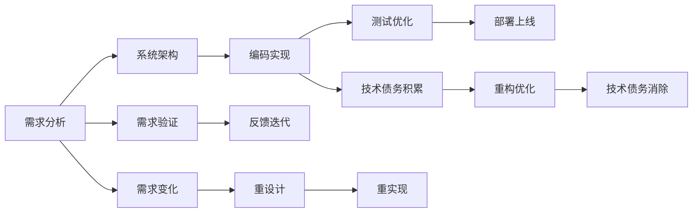
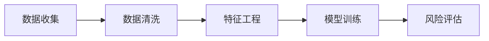
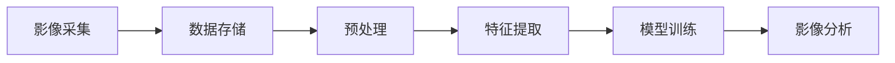
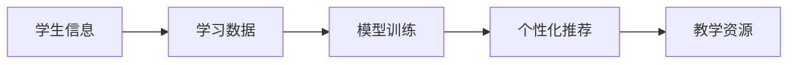

                 

# 如何将编程技能转化为咨询服务

## 1. 背景介绍

### 1.1 问题由来
随着科技的迅猛发展，软件开发已经成为企业提升竞争力的重要手段。但传统软件开发模式存在一定局限性，如开发周期长、成本高、灵活性差等问题。为应对这些挑战，软件开发咨询服务应运而生。软件开发咨询服务旨在将编程技能与业务需求紧密结合，通过系统化的方法和工具，快速构建高可用性、高扩展性、高安全性的企业级软件系统。

### 1.2 问题核心关键点
软件开发咨询服务的核心在于通过编程技能解决企业业务痛点，推动数字化转型。服务内容通常包括需求分析、系统设计、编码实现、测试优化、部署上线等全流程环节，涉及到多学科知识，如软件工程、系统架构、数据结构、算法优化等。

## 2. 核心概念与联系

### 2.1 核心概念概述

为更好地理解软件开发咨询服务的原理与流程，本节将介绍几个关键概念：

- **软件开发咨询（Software Development Consulting, SDC）**：指结合企业业务需求，通过编程技能提供软件开发全生命周期的咨询、设计、实施、优化等服务的业务模式。

- **系统架构（System Architecture）**：指定义企业信息系统整体框架的设计，包括系统分层、模块划分、接口定义、数据模型等。

- **需求分析（Requirements Analysis）**：指理解客户需求，并通过问题描述、数据模型等形式，将业务需求转化为可实现的系统需求的过程。

- **编码实现（Coding Realization）**：指通过编程语言和工具，将需求设计转化为可执行的系统代码。

- **测试优化（Testing Optimization）**：指通过自动化测试、性能调优等技术手段，确保软件系统的高可用性和稳定性。

- **部署上线（Deployment and Go-Live）**：指将系统代码部署到生产环境，并进行系统监控和运维的过程。

这些核心概念之间的关系可以用以下Mermaid流程图来表示：



这个流程图展示了从需求分析到部署上线的全过程，以及需求验证、反馈迭代、技术债务管理等环节，共同构成了软件开发咨询服务的完整流程。

## 3. 核心算法原理 & 具体操作步骤
### 3.1 算法原理概述

软件开发咨询服务的核心在于将编程技能与业务需求相结合，通过系统化的流程和方法，快速构建出高可用性、高扩展性、高安全性的企业级软件系统。其基本原理包括以下几个步骤：

1. **需求分析**：通过问题描述、业务场景模拟等方法，准确理解客户需求。
2. **系统设计**：根据需求设计系统架构，定义数据模型、模块划分、接口设计等。
3. **编码实现**：将需求设计转化为具体的系统代码。
4. **测试优化**：通过自动化测试、性能调优等手段，确保系统代码的正确性和稳定性。
5. **部署上线**：将系统代码部署到生产环境，并进行系统监控和运维。

### 3.2 算法步骤详解

具体而言，软件开发咨询服务的步骤可以详细分为以下几个阶段：

#### 需求分析阶段
1. **客户访谈**：与客户进行深入访谈，了解业务背景、目标、痛点等关键信息。
2. **需求描述**：将客户需求转换为详细的文档，包括功能需求、非功能需求、业务场景等。
3. **需求验证**：与客户共同评审需求文档，确保需求描述准确无误。

#### 系统设计阶段
1. **架构设计**：根据需求设计系统架构，定义系统组件、模块划分、数据模型等。
2. **接口设计**：定义系统组件之间的通信协议和接口规范，确保系统组件的高耦合性。
3. **技术选型**：选择合适的编程语言、框架、数据库等技术栈，确保系统的可扩展性和可维护性。

#### 编码实现阶段
1. **模块划分**：将系统划分为多个模块，每个模块独立完成特定的功能。
2. **代码编写**：根据设计文档，编写系统代码，实现系统功能。
3. **单元测试**：对模块进行单元测试，确保模块功能正确。

#### 测试优化阶段
1. **集成测试**：将各个模块集成在一起，进行集成测试，确保系统整体功能正常。
2. **性能测试**：对系统进行性能测试，发现并解决性能瓶颈。
3. **自动化测试**：引入自动化测试工具，提高测试效率和准确性。

#### 部署上线阶段
1. **环境准备**：准备生产环境，确保环境与开发环境一致。
2. **部署代码**：将系统代码部署到生产环境。
3. **系统监控**：引入监控工具，实时监控系统运行状态。
4. **运维支持**：提供系统运维支持，解决系统运行中的问题。

### 3.3 算法优缺点

软件开发咨询服务的优点包括：

1. **专业性强**：提供专业的技术咨询和解决方案，提升客户满意度。
2. **灵活度高**：根据客户需求快速调整方案，提高项目成功率。
3. **经验丰富**：具有丰富的项目经验和成功案例，能提供可靠的技术保障。

但其缺点也显而易见：

1. **成本高**：咨询费用较高，需要客户投入较多资源。
2. **周期长**：项目周期较长，需要持续投入人力和物力。
3. **依赖性强**：对咨询公司依赖性强，客户需慎重选择。

### 3.4 算法应用领域

软件开发咨询服务可以广泛应用于各行各业，如金融、医疗、教育、电商等，以下是几个典型的应用领域：

#### 金融领域
在金融领域，软件开发咨询服务可以应用于：
- **信贷评估系统**：通过数据分析和机器学习算法，快速评估客户的信用风险。
- **交易系统**：开发高效的交易系统，提升交易速度和稳定性。
- **风险管理系统**：构建风险管理平台，进行风险预测和预警。

#### 医疗领域
在医疗领域，软件开发咨询服务可以应用于：
- **电子病历系统**：开发电子病历系统，实现医疗信息数字化。
- **医学影像分析系统**：通过图像识别技术，快速分析医学影像，辅助诊断。
- **远程诊疗系统**：构建远程诊疗平台，提高医疗资源的利用效率。

#### 教育领域
在教育领域，软件开发咨询服务可以应用于：
- **在线教育平台**：开发高质量的在线教育平台，提供丰富的学习资源。
- **学生管理系统**：开发高效的学生管理系统，提升教学管理水平。
- **智能教学系统**：通过人工智能技术，实现个性化教学。

#### 电商领域
在电商领域，软件开发咨询服务可以应用于：
- **商品推荐系统**：通过机器学习算法，实现商品推荐。
- **库存管理系统**：开发高效的库存管理系统，优化库存管理。
- **客户关系管理系统**：构建客户关系管理系统，提升客户满意度。

## 4. 数学模型和公式 & 详细讲解 & 举例说明

### 4.1 数学模型构建

在本节中，我们将介绍软件开发咨询服务的数学模型构建过程。

假设客户需求为 $D$，系统设计方案为 $S$，编码实现后的系统代码为 $C$，测试优化后的系统为 $T$，部署上线后的系统为 $L$。

数学模型可以表示为：

$$
L = f(D, S, C, T)
$$

其中 $f$ 表示模型映射函数。

### 4.2 公式推导过程

根据软件开发咨询服务的流程，推导公式如下：

$$
S = g(D)
$$

$$
C = h(S)
$$

$$
T = p(C)
$$

$$
L = q(T)
$$

其中：
- $g$ 表示需求映射函数，将客户需求转换为系统设计方案。
- $h$ 表示设计映射函数，将系统设计方案转换为系统代码。
- $p$ 表示测试映射函数，将系统代码转换为测试优化后的系统。
- $q$ 表示上线映射函数，将测试优化后的系统部署上线。

### 4.3 案例分析与讲解

以一个电商平台的商品推荐系统为例，进行详细讲解。

1. **需求分析**：通过客户访谈和需求描述，明确客户需要开发一个高效的商品推荐系统。
2. **系统设计**：设计系统架构，包括推荐算法、数据库、缓存等模块。
3. **编码实现**：使用Java或Python编写推荐算法、数据库连接等代码。
4. **测试优化**：进行自动化测试，优化代码性能，确保系统稳定。
5. **部署上线**：将代码部署到生产环境，并进行系统监控和运维。

## 5. 项目实践：代码实例和详细解释说明

### 5.1 开发环境搭建

进行软件开发咨询服务，首先需要搭建开发环境。以下是具体的步骤：

1. **安装开发环境**：安装Java或Python等开发环境，并确保版本稳定。
2. **配置IDE**：选择适合自己的开发工具，如IntelliJ IDEA或PyCharm，并配置好环境变量。
3. **版本控制**：使用Git等版本控制工具，进行代码管理和版本控制。
4. **持续集成**：配置持续集成工具，如Jenkins或Travis CI，自动化测试和部署。

### 5.2 源代码详细实现

以下是使用Java编写的商品推荐系统的源代码示例：

```java
public class RecommendationSystem {
    private List<Product> products;
    private List<Recommendation> recommendations;
    
    public RecommendationSystem(List<Product> products) {
        this.products = products;
    }
    
    public void train() {
        // 训练推荐算法
    }
    
    public List<Recommendation> getRecommendations() {
        // 生成推荐列表
        return recommendations;
    }
}
```

### 5.3 代码解读与分析

在上述代码中，RecommendationSystem类是推荐系统的核心，包含产品列表和推荐列表。通过train()方法训练推荐算法，通过getRecommendations()方法生成推荐列表。

## 6. 实际应用场景

### 6.1 金融领域

在金融领域，软件开发咨询服务可以应用于信贷评估、交易系统、风险管理等场景。

#### 信贷评估系统
构建信贷评估系统，通过数据分析和机器学习算法，快速评估客户的信用风险。系统架构设计如下：



### 6.2 医疗领域

在医疗领域，软件开发咨询服务可以应用于电子病历系统、医学影像分析系统、远程诊疗系统等场景。

#### 医学影像分析系统
开发医学影像分析系统，通过图像识别技术，快速分析医学影像，辅助诊断。系统架构设计如下：



### 6.3 教育领域

在教育领域，软件开发咨询服务可以应用于在线教育平台、学生管理系统、智能教学系统等场景。

#### 智能教学系统
构建智能教学系统，通过人工智能技术，实现个性化教学。系统架构设计如下：



### 6.4 未来应用展望

未来，软件开发咨询服务将面临更多的挑战和机遇。

#### 自动化与智能化
随着自动化和智能化的发展，软件开发咨询服务将逐步实现自动化，减少人力投入，提高工作效率。

#### 云计算与大数据
利用云计算和大数据技术，软件开发咨询服务将更加灵活和高效，能够处理海量数据，提供更好的解决方案。

#### 跨领域融合
软件开发咨询服务将与其他领域进行深度融合，如人工智能、物联网、区块链等，推动跨领域技术的发展。

#### 全球化服务
软件开发咨询服务将打破地域限制，提供全球化的服务，满足不同国家和地区客户的需求。

## 7. 工具和资源推荐

### 7.1 学习资源推荐

为了帮助软件开发咨询服务的从业者系统掌握软件开发咨询服务的理论基础和实践技巧，这里推荐一些优质的学习资源：

1. **《软件开发咨询实践》**：详细介绍软件开发咨询服务的流程、方法和工具，适合初学者和从业者参考。
2. **《软件工程原理与实践》**：涵盖软件开发咨询服务的各个环节，包括需求分析、系统设计、编码实现、测试优化等。
3. **《系统架构设计》**：介绍系统架构设计的理论和实践，提供丰富的系统架构案例。
4. **《软件项目管理》**：讲解软件项目管理的方法和工具，帮助从业者掌握项目管理技能。
5. **《敏捷开发》**：介绍敏捷开发的方法论和工具，提升开发效率和项目成功率。

### 7.2 开发工具推荐

高效的工具是软件开发咨询服务的保障。以下是几款常用的开发工具：

1. **Jenkins**：持续集成工具，支持自动化测试和部署，提高工作效率。
2. **Git**：版本控制工具，支持代码管理和版本控制，保障代码质量。
3. **Docker**：容器化工具，支持应用部署和运维，提升系统稳定性。
4. **JIRA**：项目管理工具，支持需求管理、任务跟踪、进度控制等功能。
5. **IntelliJ IDEA**：Java开发工具，提供强大的代码编辑、调试、测试等功能。

### 7.3 相关论文推荐

软件开发咨询服务的发展离不开学界的持续研究。以下是几篇奠基性的相关论文，推荐阅读：

1. **《软件开发咨询：实践与案例研究》**：详细介绍了软件开发咨询服务的流程和案例，提供实际应用指导。
2. **《系统架构设计：理论与实践》**：涵盖系统架构设计的理论和实践，提供丰富的架构案例。
3. **《敏捷开发方法论》**：介绍敏捷开发的方法论和工具，提升开发效率和项目成功率。
4. **《云计算与大数据技术》**：讲解云计算和大数据技术，支持软件开发咨询服务的自动化和智能化。
5. **《人工智能在软件开发中的应用》**：介绍人工智能技术在软件开发中的应用，推动软件开发咨询服务的智能化发展。

## 8. 总结：未来发展趋势与挑战

### 8.1 总结

本文对软件开发咨询服务的原理、流程和应用进行了系统介绍。通过详细讲解需求分析、系统设计、编码实现、测试优化、部署上线等关键环节，展示了软件开发咨询服务的全流程。同时，通过实际应用场景的展示，展示了软件开发咨询服务在金融、医疗、教育、电商等领域的应用价值。

### 8.2 未来发展趋势

未来，软件开发咨询服务将呈现以下几个发展趋势：

1. **自动化与智能化**：自动化工具和智能化技术的应用，将进一步提升开发效率和工作质量。
2. **云计算与大数据**：云计算和大数据技术的发展，将使软件开发咨询服务更加灵活和高效。
3. **跨领域融合**：与其他领域如人工智能、物联网、区块链等的深度融合，将推动跨领域技术的发展。
4. **全球化服务**：打破地域限制，提供全球化的服务，满足不同国家和地区客户的需求。

### 8.3 面临的挑战

尽管软件开发咨询服务已经取得了一定成绩，但在未来发展过程中仍面临一些挑战：

1. **人才短缺**：软件开发咨询服务的从业人员需具备多方面的知识和技能，导致人才缺口较大。
2. **技术更新**：软件开发咨询服务的核心是技术，但技术更新迭代快，需不断学习新知识。
3. **客户需求变化**：客户需求变化快，需快速响应和调整方案，确保服务质量。
4. **成本压力**：咨询服务费用较高，需平衡客户需求和成本压力。
5. **安全性问题**：软件开发咨询服务需考虑系统的安全性和可靠性，避免潜在风险。

### 8.4 研究展望

为应对未来发展趋势和挑战，软件开发咨询服务需关注以下几个方面：

1. **人才培养**：加大人才培养力度，提升从业人员的专业素质和综合能力。
2. **技术创新**：关注技术前沿，不断学习新技术，推动技术创新。
3. **客户沟通**：加强与客户的沟通，了解客户需求，提供定制化解决方案。
4. **成本管理**：优化成本管理，平衡客户需求和成本压力。
5. **安全性保障**：加强系统安全性保障，避免潜在风险。

通过不断的探索和创新，软件开发咨询服务必将逐步走向成熟，为各行各业提供更优质的技术服务。

## 9. 附录：常见问题与解答

**Q1: 软件开发咨询服务如何定价？**

A: 软件开发咨询服务的定价需要考虑项目复杂度、开发周期、技术难度、人力成本等因素。通常采用固定总价、按时收费、按成果收费等多种方式，客户可以根据自身需求选择合适的方式。

**Q2: 如何进行需求分析？**

A: 需求分析是软件开发咨询服务的核心环节，通常采用以下步骤：
1. 客户访谈：与客户进行深入访谈，了解业务背景、目标、痛点等关键信息。
2. 需求描述：将客户需求转换为详细的文档，包括功能需求、非功能需求、业务场景等。
3. 需求验证：与客户共同评审需求文档，确保需求描述准确无误。

**Q3: 系统设计如何实现？**

A: 系统设计需要根据需求进行系统架构设计、模块划分、数据模型定义等。具体步骤如下：
1. 架构设计：定义系统架构，包括系统组件、模块划分、接口设计等。
2. 数据模型设计：定义数据模型，包括表结构、字段类型、索引等。
3. 接口设计：定义系统组件之间的通信协议和接口规范。

**Q4: 代码实现需要注意哪些问题？**

A: 代码实现需注意以下问题：
1. 模块划分：将系统划分为多个模块，每个模块独立完成特定的功能。
2. 代码风格：采用统一的代码风格，提高代码可读性和可维护性。
3. 代码复用：尽量复用已有代码，减少代码冗余。

**Q5: 测试优化如何实现？**

A: 测试优化需通过自动化测试、性能调优等手段，确保系统代码的正确性和稳定性。具体步骤如下：
1. 单元测试：对模块进行单元测试，确保模块功能正确。
2. 集成测试：将各个模块集成在一起，进行集成测试，确保系统整体功能正常。
3. 性能测试：对系统进行性能测试，发现并解决性能瓶颈。

通过不断的探索和创新，软件开发咨询服务必将逐步走向成熟，为各行各业提供更优质的技术服务。

