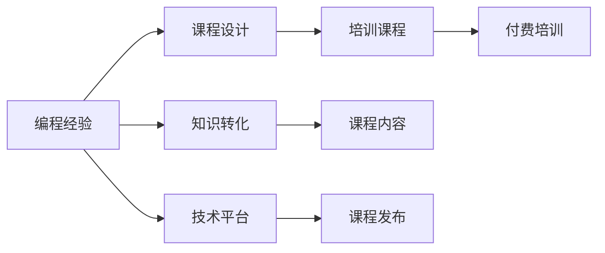

                 

## 1. 背景介绍

在IT行业的快速发展中，技术培训已成为广大技术人员成长和自我提升的重要途径。而如何将个人的编程经验和知识技能，转化为有价值的培训课程，不仅是提升自身影响力与收益的良机，更是对知识进行系统化、结构化呈现，帮助更多人加速学习和成长的过程。本文将深入探讨如何将编程经验转化为付费培训课程，涵盖背景介绍、核心概念、算法原理、具体操作步骤、数学模型、项目实践、应用场景、工具资源、总结展望与常见问题解答等各个方面，希望能为从事技术培训工作的读者提供全面的指导。

## 2. 核心概念与联系

### 2.1 核心概念概述

为了更好地理解如何将编程经验转化为培训课程，需要首先明确几个关键概念：

- **编程经验（Programming Experience）**：指通过实际项目、开发实践积累的技术知识和实践能力，包括但不限于算法设计、编码实现、系统架构、性能优化、代码审查等。

- **培训课程（Training Course）**：旨在传授特定知识与技能的教育活动，通常以系统化、结构化的课程形式呈现，包括理论讲解、实践操作、案例分析等环节。

- **付费培训（Paid Training）**：指需支付费用才能参与的培训课程，涵盖线上线下、短期长期、一对一团队等多种形式，能够提供更有保障和系统的学习路径。

- **知识转化（Knowledge Transformation）**：将个人积累的专业技能与经验，转化为可供传授与交流的知识，实现知识共享与增值。

- **技术平台（Technical Platform）**：提供培训课程开发与发布的平台，如Udemy、Coursera、网易云课堂等，有助于课程内容的展示、交流与变现。

这些概念之间的联系可以通过以下Mermaid流程图来展示：



这个流程图展示了编程经验转化为付费培训课程的关键步骤，从个人经验的积累到课程内容的设计，再到课程的发布和教学，最终实现知识和经验的商业变现。

## 3. 核心算法原理 & 具体操作步骤

### 3.1 算法原理概述

将编程经验转化为培训课程，本质上是一种知识萃取与重构的过程。这一过程涉及将实践经验抽象为理论，将个体经验转化为可系统传授的课程，再通过教学平台将课程公开发布和销售。

### 3.2 算法步骤详解

#### 第一步：分析需求与定位

- **确定目标群体**：识别潜在的学习者群体，如初学者、进阶开发者、行业专家等。
- **明确课程目标**：设定课程希望达成的具体技能或知识目标。
- **调研市场需求**：分析市场需求，了解类似课程的竞争情况。

#### 第二步：课程设计

- **梳理知识体系**：根据目标需求，整理出课程的总体知识体系框架，确定需要讲解的核心知识点。
- **编写课程大纲**：将知识体系细化为具体章节和课程大纲，设定每一节课的目标与内容。
- **设计教学方法**：选择适合的教学方法，如讲解、演示、实践、讨论等，确保知识传递的有效性。

#### 第三步：课程开发

- **收集素材与案例**：整理相关资料、项目案例、代码示例等素材，作为课程讲解与实践的支撑。
- **录制视频与讲解**：利用录制软件，将知识讲解、代码演示等内容录制为视频，制作PPT或文档。
- **测试与优化**：在初步完成课程内容后，进行内部测试与优化，确保教学内容的质量与可理解性。

#### 第四步：发布与推广

- **选择平台**：选择合适的技术平台，如Udemy、Coursera、网易云课堂等，进行课程发布。
- **设置价格与收费方式**：根据课程难度、市场定位等因素，设定课程价格，选择付费模式，如单次购买、订阅制等。
- **推广与宣传**：通过社交媒体、技术论坛、邮件列表等方式，进行课程的推广宣传，吸引目标用户。

#### 第五步：反馈与更新

- **收集用户反馈**：在课程发布后，通过平台评价、用户评论等渠道，收集用户对课程的反馈信息。
- **持续改进**：根据反馈信息，对课程内容、教学方法、视频质量等进行持续改进，不断提升课程质量。

### 3.3 算法优缺点

#### 优点：

- **系统性**：课程设计遵循一定系统性，有利于学习者循序渐进掌握知识。
- **权威性**：通过平台发布，课程获得一定权威性，更容易获得用户信任。
- **可复制性**：课程内容可复用，既可以教授新学员，也能作为内部培训材料。
- **商业化**：知识通过课程变现，有助于提升个人影响力与收益。

#### 缺点：

- **投入成本**：课程开发、录制、推广等环节需投入较多时间与资源。
- **市场竞争**：市场竞争激烈，需不断创新与优化课程内容。
- **用户需求多变**：课程需根据市场需求不断调整更新，增加了维护成本。

### 3.4 算法应用领域

编程经验转化的培训课程，适用于各类技术技能的学习与提升，包括但不限于以下领域：

- **软件开发**：如Python、Java、C++等编程语言，Web开发、移动开发、游戏开发等方向。
- **数据科学**：如数据挖掘、机器学习、大数据技术等。
- **系统架构**：如分布式系统、微服务架构、DevOps等。
- **运维与安全**：如网络安全、系统运维、云平台管理等。

这些领域覆盖了软件开发、数据科学、系统架构等多个IT核心技能，符合市场需求，具备广泛的应用前景。

## 4. 数学模型和公式 & 详细讲解 & 举例说明

### 4.1 数学模型构建

为了更好地说明如何将编程经验转化为课程，这里以简单的编程问题为例，构建一个数学模型。假设我们要教授的编程问题为一个排序算法，其核心知识点包括：

- 算法思想与原理
- 代码实现步骤
- 时间复杂度与空间复杂度分析
- 实际应用场景

### 4.2 公式推导过程

排序算法中的常见算法，如冒泡排序、快速排序、归并排序等，其时间复杂度分别如下：

- 冒泡排序：$O(n^2)$
- 快速排序：$O(n \log n)$
- 归并排序：$O(n \log n)$

时间复杂度的推导涉及算法分析与证明，是一个较为复杂的过程，需通过数学模型详细解析。

### 4.3 案例分析与讲解

通过一个具体的排序算法案例，讲解其算法思想、代码实现、时间复杂度等知识点。这里以快速排序为例：

```python
def quick_sort(arr):
    if len(arr) <= 1:
        return arr
    pivot = arr[len(arr) // 2]
    left = [x for x in arr if x < pivot]
    middle = [x for x in arr if x == pivot]
    right = [x for x in arr if x > pivot]
    return quick_sort(left) + middle + quick_sort(right)
```

解释以上代码的核心步骤与算法原理，如分治思想、基准值选取、左右分区、递归调用等，并进行复杂度分析。通过这一案例，可以系统地展示如何将复杂的编程经验转化为易于理解与掌握的课程内容。

## 5. 项目实践：代码实例和详细解释说明

### 5.1 开发环境搭建

- **选择平台**：选择适合自己的技术平台，如Udemy、Coursera、网易云课堂等。
- **创建账户**：注册并创建课程发布账户，了解平台规则与发布流程。
- **配置环境**：配置录制与编辑软件，如Adobe Premiere、Final Cut Pro、Reaper等，准备录制课程内容。

### 5.2 源代码详细实现

以下是一个Python排序算法的示例代码，并进行详细的解释说明：

```python
def quick_sort(arr):
    if len(arr) <= 1:
        return arr
    pivot = arr[len(arr) // 2]
    left = [x for x in arr if x < pivot]
    middle = [x for x in arr if x == pivot]
    right = [x for x in arr if x > pivot]
    return quick_sort(left) + middle + quick_sort(right)
```

详细解释代码的每一行，说明算法的核心思想与实现细节，如分治思想、基准值选取、左右分区、递归调用等。

### 5.3 代码解读与分析

通过解释代码的每一行，分析算法的复杂度、稳定性、适用性等关键指标，确保学员能够充分理解算法的本质与实现。

### 5.4 运行结果展示

通过展示算法的运行结果，进一步加深学员对算法的理解，如时间复杂度的实际表现、空间复杂度的控制等。

## 6. 实际应用场景

### 6.1 在线教育平台

在线教育平台如Udemy、Coursera等，提供了广泛的课程发布渠道，具备用户评价、课程推荐、付费功能等完备功能，适合发布技术培训课程。

### 6.2 公司内部培训

公司内部可以通过定制化课程，提升员工的技术能力与业务水平，增加团队的技术储备与竞争力。

### 6.3 社区交流

技术社区如Stack Overflow、GitHub、知乎等，可以通过发布技术文章、代码示例，与社区成员分享经验，建立个人影响力。

### 6.4 未来应用展望

未来随着技术的发展，在线教育平台将更加智能化、个性化，能够根据用户学习情况进行推荐与优化，提升学习效果。同时，人工智能技术也将引入课程设计与推广中，如通过聊天机器人、智能推荐等方式，提高课程覆盖与用户体验。

## 7. 工具和资源推荐

### 7.1 学习资源推荐

- **编程语言教程**：如《Python编程快速上手》、《Java核心技术》等，提供编程语言的基础知识与实践指导。
- **算法与数据结构**：如《算法导论》、《数据结构与算法分析》等，深入讲解算法设计与分析。
- **系统架构**：如《深入理解分布式系统》、《微服务架构设计》等，讲解分布式系统与微服务架构。
- **网络安全**：如《Web安全攻防》、《网络安全入门》等，介绍常见安全威胁与防护措施。

### 7.2 开发工具推荐

- **编程工具**：如Visual Studio、PyCharm、IntelliJ IDEA等，提供开发环境的搭建与管理。
- **文档编辑**：如Microsoft Word、LaTeX、Markdown等，用于编写课程文档与代码示例。
- **录制软件**：如Adobe Premiere、Final Cut Pro、Reaper等，录制视频与音频。
- **项目管理**：如Trello、JIRA等，管理课程开发进度与团队协作。

### 7.3 相关论文推荐

- **《编程语言设计》**：深入探讨编程语言的设计原理与实践技巧，如Go、Rust等。
- **《算法设计与分析》**：详细讲解经典算法的设计与分析方法，如K近邻、决策树等。
- **《分布式系统原理》**：介绍分布式系统的核心原理与设计模式，如CAP定理、数据一致性等。
- **《人工智能基础》**：讲解人工智能的原理与技术，如机器学习、深度学习等。

## 8. 总结：未来发展趋势与挑战

### 8.1 研究成果总结

本文系统介绍了如何将编程经验转化为付费培训课程，从背景、核心概念、算法原理、操作步骤、数学模型、项目实践、应用场景、工具资源、总结展望与常见问题解答等各个方面进行了详细讲解。

### 8.2 未来发展趋势

- **技术融合**：编程经验转化将与其他技术如人工智能、大数据等深度融合，推动知识更新与扩展。
- **课程内容**：课程内容将更加丰富，涵盖新技术、新工具、新应用等前沿领域。
- **教学方法**：将引入更多互动与实践环节，提升学习效果。

### 8.3 面临的挑战

- **市场竞争**：在线教育平台竞争激烈，需不断创新与优化课程内容。
- **技术门槛**：课程开发与录制需具备一定技术水平与资源投入。
- **用户需求**：需根据市场需求不断调整更新课程内容，增加维护成本。

### 8.4 研究展望

未来需进一步探索技术融合、课程设计、教学方法等关键问题，推动编程经验向付费培训课程的全面转化。

## 9. 附录：常见问题与解答

### Q1：如何确定课程目标与定位？

A：首先需要分析目标群体的学习需求与背景，明确课程希望达成的具体技能或知识目标，进行市场需求调研，从而确定课程的目标与定位。

### Q2：如何设计课程大纲？

A：梳理核心知识点，设定每一节课的目标与内容，细化成具体的课程大纲，确保课程系统性与逻辑性。

### Q3：如何选择适合的教学方法？

A：根据课程目标与学习者特点，选择适合的讲解、演示、实践、讨论等教学方法，提升学习效果。

### Q4：如何选择技术平台？

A：选择有知名度、用户基础、平台功能完备的平台，如Udemy、Coursera等，进行课程发布。

### Q5：如何持续改进课程内容？

A：通过平台评价、用户评论等渠道，收集用户反馈，根据反馈信息不断改进课程内容，保持课程质量与新鲜度。

---

作者：禅与计算机程序设计艺术 / Zen and the Art of Computer Programming

