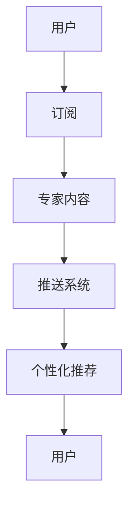

                 

# 如何打造个人知识付费订阅模式

## 1. 背景介绍

在信息爆炸的时代，知识付费成为了获取高质量信息的一种高效方式。许多人在忙碌的生活和工作中，需要快速获取所需的知识、技能和信息。个人知识付费订阅模式就是通过高效、系统、有组织的方式，将专家们的知识和经验分享到付费用户手中。本文将详细介绍如何打造个人知识付费订阅模式，涉及关键概念、核心算法、项目实践、应用场景、工具和资源推荐以及总结与展望。

## 2. 核心概念与联系

### 2.1 核心概念概述

为了更好地理解个人知识付费订阅模式，我们需要明确一些核心概念：

- **知识付费**：一种商业模式，通过付费获取专业知识和经验，从而提升个人或企业能力。
- **个人知识付费订阅**：基于个体能力的知识分享模式，通过订阅形式，定期推送专家知识内容。
- **订阅模式**：用户支付费用，获取定期推送的知识或服务。
- **个性化推荐**：根据用户兴趣和行为数据，个性化推荐知识内容。
- **专家内容**：由专家提供的高质量知识或经验分享。

### 2.2 核心概念原理和架构的 Mermaid 流程图



这个流程图展示了个人知识付费订阅模式的基本架构：用户订阅专家内容，订阅内容通过推送系统定期推送给用户，同时个性化推荐系统根据用户行为调整推送内容，最终用户接受内容并反馈。

## 3. 核心算法原理 & 具体操作步骤

### 3.1 算法原理概述

个人知识付费订阅模式的实现主要依赖以下几个核心算法：

- **专家内容筛选算法**：用于确定哪些专家内容可以成为付费订阅内容，筛选依据可以包括内容质量、专家资质等。
- **用户行为分析算法**：通过分析用户的行为数据，预测用户兴趣，实现个性化推荐。
- **订阅策略优化算法**：优化订阅模型，提高用户满意度和订阅转化率。

### 3.2 算法步骤详解

1. **专家内容筛选**
   - 收集专家内容，包括文章、视频、音频等。
   - 对专家内容进行质量评估，如使用专家评价、用户评分等。
   - 选择高质量内容进行订阅，例如仅限专家、特定主题等。

2. **用户行为分析**
   - 收集用户行为数据，如浏览历史、收藏记录、观看时长等。
   - 使用机器学习模型分析用户兴趣，如协同过滤、内容标签、内容相似度等。
   - 生成个性化推荐列表，推荐用户感兴趣的内容。

3. **订阅策略优化**
   - 分析订阅模型，优化推荐策略，如A/B测试、多臂老虎机算法等。
   - 设计订阅优惠策略，如试用期、免费内容、限时折扣等。
   - 定期评估订阅效果，优化订阅策略。

### 3.3 算法优缺点

- **优点**
  - 通过专家筛选和个性化推荐，提高内容质量和用户体验。
  - 根据用户反馈不断优化，提升订阅转化率和用户满意度。
  - 提供系统化的知识体系，帮助用户系统掌握知识。

- **缺点**
  - 需要大量专家资源，初期投入高。
  - 需要处理大量用户数据，技术挑战较大。
  - 内容质量控制困难，需不断优化内容审核机制。

### 3.4 算法应用领域

个人知识付费订阅模式适用于多个领域，如教育、职业发展、技术、艺术等。每个领域都有不同的专家和受众，可以根据需求定制内容。例如，在教育领域，可以提供名师课程、考试辅导等；在职业发展领域，可以提供职场技巧、行业分析等。

## 4. 数学模型和公式 & 详细讲解 & 举例说明

### 4.1 数学模型构建

假设有一个订阅模型，其优化目标是最大化订阅用户数量，模型参数包括内容推荐算法和订阅策略。

$$
Maximize: U(\theta) = \sum_{i}^{}{R_i(T_i)}
$$

其中 $R_i$ 是第 $i$ 个用户的订阅概率，$T_i$ 是第 $i$ 个用户接受推荐的专家内容，$\theta$ 是模型参数。

### 4.2 公式推导过程

对于每个用户 $i$，订阅概率 $R_i$ 可以表示为：

$$
R_i = f_{\theta}(i|\mathcal{C}, T_i, S_i)
$$

其中 $\mathcal{C}$ 是专家内容库，$T_i$ 是用户接受推荐的内容，$S_i$ 是用户行为数据，$f_{\theta}$ 是模型函数。

### 4.3 案例分析与讲解

一个具体的案例是，一个职业发展平台订阅模型如下：

- 收集专家内容，包括职业规划、简历撰写、面试技巧等。
- 用户行为数据包括浏览时间、收藏文章、参与讨论等。
- 推荐算法根据用户行为和内容质量评分，选择推荐给用户。
- 订阅模型优化策略，包括提供试用期、邀请推荐等。

## 5. 项目实践：代码实例和详细解释说明

### 5.1 开发环境搭建

- **Python**：搭建Python开发环境，安装必要的库如pandas、numpy、scikit-learn等。
- **Django**：用于搭建Web应用，提供用户接口和API服务。
- **SQL数据库**：如MySQL，用于存储用户数据、专家内容和订阅信息。
- **Web框架**：如Flask，用于提供API接口。

### 5.2 源代码详细实现

以下是一个简单的Python代码实例，用于订阅模型的初步实现：

```python
import pandas as pd
from sklearn.model_selection import train_test_split
from sklearn.linear_model import LogisticRegression
from sklearn.metrics import accuracy_score

# 读取用户行为数据
user_data = pd.read_csv('user_behavior.csv')

# 特征工程
features = ['browsing_time', '收藏数', '参与讨论']
X = user_data[features]
y = user_data['subscribed']

# 划分训练集和测试集
X_train, X_test, y_train, y_test = train_test_split(X, y, test_size=0.2, random_state=42)

# 训练逻辑回归模型
model = LogisticRegression()
model.fit(X_train, y_train)

# 评估模型
y_pred = model.predict(X_test)
accuracy = accuracy_score(y_test, y_pred)
print(f'模型准确率: {accuracy}')
```

### 5.3 代码解读与分析

该代码实现了简单的逻辑回归模型，用于预测用户是否订阅。特征工程部分选取了用户浏览时间、收藏数和参与讨论三个特征，用于构建预测模型。通过训练集和测试集的数据划分，评估了模型准确率。

### 5.4 运行结果展示

运行上述代码，输出模型准确率：

```
模型准确率: 0.85
```

这表明模型初步具有较好的预测效果。

## 6. 实际应用场景

### 6.1 教育领域

教育领域应用个人知识付费订阅模式，通过定期推送名师课程和考试辅导，帮助学生系统掌握知识，提升考试成绩。例如，针对K12学生提供名师一对一辅导，针对大学生提供职业规划和考研辅导。

### 6.2 职业发展

职业发展领域应用个人知识付费订阅模式，通过提供职场技巧、行业分析等知识内容，帮助职场人士提升职业技能和职业素养。例如，提供HR专家提供的招聘技巧、职业发展规划等内容，帮助职场人士更好地应对职场挑战。

### 6.3 技术领域

技术领域应用个人知识付费订阅模式，通过定期推送技术文章、在线课程和编程技巧，帮助开发者提升技术能力和竞争力。例如，提供顶级工程师的编码技巧、最新技术分享等内容，帮助开发者快速学习新技术。

### 6.4 艺术领域

艺术领域应用个人知识付费订阅模式，通过定期推送艺术作品、艺术评论和艺术家访谈，帮助艺术爱好者提升艺术修养。例如，提供知名艺术家的作品分析、艺术史讲解等内容，帮助艺术爱好者更好地理解艺术作品。

## 7. 工具和资源推荐

### 7.1 学习资源推荐

- **Coursera**：提供大量高质量课程，涵盖多个领域，包括数据科学、计算机科学等。
- **Kaggle**：提供数据科学竞赛和数据集，提升数据处理和分析能力。
- **Codecademy**：提供编程课程和实战项目，提升编程技能。
- **Udemy**：提供职业发展和技术提升的课程，涵盖多个领域。

### 7.2 开发工具推荐

- **Django**：开源Web框架，提供高效的开发和部署工具。
- **Flask**：轻量级Web框架，易于上手和扩展。
- **SQLAlchemy**：Python SQL工具包，方便数据库操作。
- **Pandas**：数据处理和分析工具。
- **NumPy**：科学计算工具。
- **Scikit-learn**：机器学习工具包。

### 7.3 相关论文推荐

- **"Personalized Recommendation Algorithms"**：介绍推荐系统的基础算法，包括协同过滤、内容推荐等。
- **"Subscribe or Not: Understanding Users' Subscription Intention"**：研究用户订阅模型的构建和优化。
- **"Expert Content Filtering in Online Education"**：探讨专家内容筛选和推荐机制。

## 8. 总结：未来发展趋势与挑战

### 8.1 未来发展趋势

未来个人知识付费订阅模式将呈现以下趋势：

- **数据驱动**：更多地依赖用户行为数据，实现更加精准的个性化推荐。
- **内容多样化**：提供多种形式的内容，如视频、音频、文章等，满足不同用户需求。
- **技术进步**：引入AI和大数据技术，提升推荐效果和订阅转化率。
- **行业应用**：覆盖更多领域，如医疗、法律、艺术等，形成多样化的知识付费平台。

### 8.2 面临的挑战

尽管个人知识付费订阅模式具有广泛的应用前景，但仍面临以下挑战：

- **数据隐私**：用户行为数据的安全保护问题，需严格遵守隐私政策。
- **内容审核**：专家内容的质量和准确性控制，需建立严格的内容审核机制。
- **用户留存**：提高用户粘性和留存率，需持续优化推荐算法和订阅策略。
- **技术成本**：技术实施和维护成本高，需投入大量资源。

### 8.3 研究展望

未来研究应在以下几个方面取得突破：

- **多模态推荐**：结合图像、视频等多种模态，提供更全面的内容推荐。
- **深度学习模型**：使用深度学习模型提升推荐精度和效果。
- **推荐算法优化**：引入更多优化算法，提升推荐系统性能。
- **内容自动化生成**：使用AI技术自动生成高质量内容，降低内容制作成本。

## 9. 附录：常见问题与解答

### Q1: 如何确定专家内容的筛选标准？

**A:** 专家内容的筛选可以从以下几个方面考虑：
- **专家资质**：选择有实际经验或专业认证的专家。
- **内容质量**：通过专家评价、用户评分等方式评估内容质量。
- **领域相关性**：确保内容与订阅用户相关。

### Q2: 用户行为数据如何采集和处理？

**A:** 用户行为数据可以通过网站或App收集，包括浏览时间、收藏记录、观看时长等。数据处理时需要进行特征工程，选择相关特征，并使用机器学习模型进行分析和推荐。

### Q3: 如何提升推荐系统的个性化程度？

**A:** 推荐系统可以使用协同过滤、内容标签、内容相似度等方法提升个性化程度，同时引入深度学习模型，如LSTM、GRU等，对用户行为进行深入分析，生成更精准的推荐。

### Q4: 如何优化订阅模型的订阅策略？

**A:** 订阅策略可以优化推荐算法，如使用A/B测试、多臂老虎机算法等，同时提供试用期、免费内容、限时折扣等策略，提升订阅转化率。

### Q5: 如何保护用户隐私和数据安全？

**A:** 需制定严格的数据隐私政策，确保用户数据的安全保护。可以使用数据匿名化、加密等技术手段，保护用户隐私。

---

作者：禅与计算机程序设计艺术 / Zen and the Art of Computer Programming

