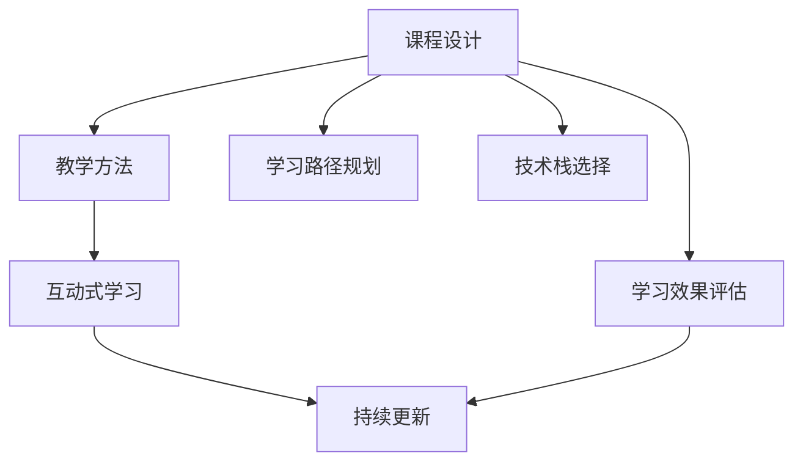

                 

# 如何打造高转化率的程序员知识课程

> 关键词：
- 程序员知识课程
- 高转化率
- 课程设计
- 教学方法
- 学习效果评估
- 课程内容优化
- 学习路径规划
- 技术栈选择
- 互动式学习
- 持续更新

## 1. 背景介绍

### 1.1 问题由来
在技术飞速发展的今天，程序员作为推动社会进步的关键力量，其知识更新速度和技能掌握程度直接影响着企业的竞争力。为了满足市场对人才的需求，在线教育平台纷纷推出程序员知识课程。然而，受限于教学资源的匮乏和学员学习效率的低下，许多课程难以达到预期的转化率，即完成课程的学员数量与课程报名人数之比。提高程序员知识课程的转化率，成为各大平台和教育机构亟待解决的难题。

### 1.2 问题核心关键点
高转化率的课程设计涉及多个方面，包括但不限于课程内容的选择、教学方法的运用、学习效果的评估、学员动机的激发、学习路径的规划等。关键点在于：
1. **目标受众定位**：明确课程面向的学员群体，制定针对性的教学方案。
2. **课程内容设计**：精选与学员职业发展密切相关的知识内容，并保证内容的先进性和实用性。
3. **教学方法创新**：引入互动式、实践导向的教学方法，提升学习体验和效果。
4. **学习效果评估**：建立科学的评估机制，及时反馈学习成果，促进学员持续学习。
5. **学习路径规划**：设计合理的学习路径，帮助学员系统掌握知识，避免盲目学习。
6. **技术栈选择**：选择主流且易于扩展的技术栈，保证课程的可操作性和可扩展性。

## 2. 核心概念与联系

### 2.1 核心概念概述

为了深入理解如何打造高转化率的程序员知识课程，我们需要先介绍几个关键概念：

- **课程设计**：指课程内容的组织、结构、目标和内容的整体规划。
- **教学方法**：包括讲解、演示、练习、互动等，旨在提升学员的学习效果。
- **学习效果评估**：通过测验、作业、项目等方式，评估学员的学习进度和成果。
- **学习路径规划**：帮助学员系统地学习知识，从浅入深，逐步提升。
- **技术栈选择**：根据课程目标和学员基础，选择合适的编程语言和技术框架。
- **互动式学习**：通过讨论、协作等形式，提升学员的参与感和学习兴趣。
- **持续更新**：保持课程内容的最新性和实用性，适应技术发展的变化。

这些概念相互关联，共同构成了一门高效转化率的程序员知识课程的基础。

### 2.2 核心概念原理和架构的 Mermaid 流程图



这个流程图展示了高转化率课程设计的核心流程：

1. **课程设计**：确定课程目标和内容，为后续的教学方法和学习效果评估提供基础。
2. **教学方法**：采用互动式学习等方法，提升学习效果。
3. **学习效果评估**：通过持续的评估机制，反馈学习成果。
4. **持续更新**：保持课程内容的前沿性和实用性。
5. **学习路径规划**：帮助学员系统学习。
6. **技术栈选择**：选择合适的技术栈，保证课程的可操作性和可扩展性。

## 3. 核心算法原理 & 具体操作步骤

### 3.1 算法原理概述

打造高转化率的程序员知识课程，本质上是一个多变量优化问题。课程设计、教学方法、学习效果评估等，都需要通过科学的方法进行优化。我们假设课程设计包含多个参数（例如课程难度、教学时长、内容深度等），目标是最大化学员的转化率，即完成课程的学员数量与课程报名人数之比。

设转化率为 $R$，课程设计参数为 $\vec{p} = (p_1, p_2, ..., p_n)$，则问题可以表示为：

$$
\maximize \ R(\vec{p})
$$

其中，$R(\vec{p})$ 表示在参数 $\vec{p}$ 下课程的转化率。

### 3.2 算法步骤详解

为了优化课程设计参数，我们提出以下步骤：

**Step 1: 需求分析**
- 调查目标学员的背景、职业发展需求和学习习惯。
- 分析市场对不同技能的需求趋势。
- 确定课程的总体目标和预期成果。

**Step 2: 内容设计**
- 根据需求分析，确定课程的核心内容和分模块。
- 引入最新技术，确保内容的先进性。
- 采用问题导向、项目驱动等方法，提升内容的实用性。

**Step 3: 教学方法选择**
- 引入互动式学习，如小组讨论、代码练习、项目实战等。
- 通过案例分析、讲师互动等形式，提升学习效果。
- 设计灵活的学习路径，满足不同学员的需求。

**Step 4: 学习效果评估**
- 设计合理的测验和作业，及时反馈学员的学习成果。
- 利用数据分析工具，评估课程的整体效果和学员的进步情况。
- 根据评估结果，调整课程设计和教学方法。

**Step 5: 持续更新**
- 定期收集学员反馈和市场需求，调整课程内容。
- 引入最新的技术和教学方法，保持课程的前沿性。
- 通过技术栈的灵活选择，确保课程的可操作性和可扩展性。

### 3.3 算法优缺点

高转化率的课程设计方法具有以下优点：
1. **提升学习效果**：通过科学的课程设计、教学方法和学习效果评估，提高学员的学习效果和转化率。
2. **适应性强**：能够根据市场需求和技术发展，灵活调整课程内容和方法。
3. **个性化学习**：通过互动式学习等方法，满足不同学员的需求和学习风格。

同时，该方法也存在一定的局限性：
1. **设计复杂**：需要深入分析需求，精心设计课程内容和教学方法。
2. **评估难度大**：学习效果的评估涉及多方面的因素，需要科学的方法和工具。
3. **资源需求高**：高质量的课程设计需要投入大量的时间和精力，成本较高。

## 4. 数学模型和公式 & 详细讲解 & 举例说明

### 4.1 数学模型构建

为了量化课程设计的优化目标，我们可以引入多目标优化模型：

$$
\maximize \ (R(\vec{p}), C(\vec{p}))
$$

其中，$R(\vec{p})$ 表示课程的转化率，$C(\vec{p})$ 表示课程的满意度。

### 4.2 公式推导过程

假设课程的转化率为 $R = \frac{N_完成}{N_报名}$，其中 $N_完成$ 表示完成课程的学员数量，$N_报名$ 表示课程的报名人数。

为了最大化转化率 $R$，我们可以引入以下优化公式：

$$
\begin{aligned}
\maximize \ R &= \frac{N_完成}{N_报名} \\
&= \frac{\sum_{i=1}^{n} N_{完成_i}}{\sum_{i=1}^{n} N_{报名_i}} \\
&= \frac{\sum_{i=1}^{n} \text{完成率}_i}{\sum_{i=1}^{n} \text{报名率}_i} 
\end{aligned}
$$

其中，$N_{完成_i}$ 表示第 $i$ 门课程完成人数，$N_{报名_i}$ 表示第 $i$ 门课程的报名人数，$\text{完成率}_i$ 表示第 $i$ 门课程的完成率，$\text{报名率}_i$ 表示第 $i$ 门课程的报名率。

### 4.3 案例分析与讲解

以在线教育平台推出的 JavaScript 全栈开发课程为例：

- **需求分析**：目标学员为中级开发者，希望系统掌握全栈开发技能，包括前后端开发、数据库管理、Web API 设计等。
- **内容设计**：课程分多个模块，包括前端开发、后端开发、数据库设计等，涵盖最新技术栈如 React、Node.js、MongoDB 等。
- **教学方法**：采用互动式学习，如项目实战、代码练习、在线讨论等，提升学习效果。
- **学习效果评估**：通过项目作业、在线测验等方式，及时反馈学员的学习成果。
- **持续更新**：定期收集学员反馈，调整课程内容和教学方法，保持内容的前沿性。

## 5. 项目实践：代码实例和详细解释说明

### 5.1 开发环境搭建

- **编程语言**：选择 Python 作为编程语言，利用 Pandas 和 NumPy 进行数据分析和处理。
- **开发框架**：使用 Django 框架，搭建课程管理平台，实现学员管理、课程发布、学习进度跟踪等功能。
- **环境配置**：安装必要的依赖库，如 Git、Docker、AWS 等，确保开发环境的稳定性。

### 5.2 源代码详细实现

以下是一个简单的 Django 课程管理平台的代码实现：

```python
# models.py
from django.db import models

class Course(models.Model):
    title = models.CharField(max_length=100)
    description = models.TextField()
    duration = models.IntegerField()
    instructor = models.CharField(max_length=100)

# views.py
from django.shortcuts import render, redirect
from .models import Course

def course_list(request):
    courses = Course.objects.all()
    return render(request, 'course_list.html', {'courses': courses})

def course_detail(request, course_id):
    course = Course.objects.get(id=course_id)
    return render(request, 'course_detail.html', {'course': course})

def course_enroll(request, course_id):
    course = Course.objects.get(id=course_id)
    # 处理学员注册逻辑
    return redirect('course_detail', course_id=course.id)
```

### 5.3 代码解读与分析

- **models.py**：定义课程模型，包括课程标题、描述、时长和讲师等信息。
- **views.py**：实现课程列表、课程详情和课程注册等功能的视图函数。
- **course_list.html**：课程列表的模板，展示所有课程的信息。
- **course_detail.html**：课程详情的模板，展示单门课程的具体信息。

## 6. 实际应用场景

### 6.1 企业内部培训

在企业内部，针对不同岗位的技术人员，可以推出定制化的编程技能培训课程。通过高转化率的课程设计，提升员工的编程能力和工作效率，增强企业的技术实力。

### 6.2 在线教育平台

在线教育平台可以提供多样化的程序员知识课程，满足不同学员的学习需求。通过科学的设计和评估，提升课程的转化率，吸引更多学员参与学习，提升平台的品牌影响力。

### 6.3 培训机构

针对中小学生和高中生，可以推出趣味性和实用性结合的编程启蒙课程。通过高转化率的课程设计，激发学生对编程的兴趣，提前掌握编程技能，为未来的职业生涯奠定基础。

### 6.4 未来应用展望

随着人工智能和大数据分析技术的发展，未来的课程设计将更加智能化和个性化。基于机器学习算法，可以动态调整课程内容和教学方法，提升学习效果和转化率。同时，虚拟现实和增强现实等技术的应用，将为学员提供更加沉浸式的学习体验。

## 7. 工具和资源推荐

### 7.1 学习资源推荐

为了帮助开发者系统掌握高转化率课程设计的理论基础和实践技巧，推荐以下学习资源：

1. **《学习与教学设计基础》**：介绍科学的学习理论，帮助理解课程设计的底层原理。
2. **Coursera《机器学习课程》**：通过实例讲解机器学习算法，理解课程设计中的优化模型。
3. **《Python 数据科学手册》**：提供丰富的数据分析工具，提升课程设计和评估的科学性。
4. **Udacity《全栈开发课程》**：展示如何设计高转化率的编程课程，提供丰富的教学案例。
5. **GitHub《教育技术》**：分享教育技术领域的最新研究和技术进展，提供前沿的课程设计思路。

### 7.2 开发工具推荐

为了高效实现课程设计和管理功能，推荐以下开发工具：

1. **Jupyter Notebook**：支持数据分析和代码实现，提供灵活的交互式环境。
2. **Python 编程语言**：功能丰富，社区活跃，支持高效的科学计算。
3. **Django 框架**：提供强大的 Web 开发能力，支持丰富的用户界面。
4. **Git 版本控制系统**：支持代码协作和版本管理，确保开发环境的安全和稳定。

### 7.3 相关论文推荐

为了深入理解高转化率课程设计的理论基础和实践技巧，推荐以下相关论文：

1. **《基于数据驱动的课程设计方法》**：介绍如何通过数据分析优化课程设计，提升转化率。
2. **《互动式学习对学习效果的影响》**：分析互动式学习对学员学习效果的影响，提供科学的教学方法。
3. **《大规模在线教育平台的课程设计优化》**：分享大规模在线教育平台的设计经验，提升课程的转化率。
4. **《机器学习在课程设计中的应用》**：探索机器学习算法在课程设计中的应用，提升课程的科学性和效率。

## 8. 总结：未来发展趋势与挑战

### 8.1 研究成果总结

通过本文的系统梳理，可以看出高转化率的程序员知识课程设计是一个涉及多个维度的综合性问题。其关键在于：
1. **科学的需求分析**：明确目标学员的需求和市场趋势，制定有针对性的教学方案。
2. **高质量的内容设计**：精选与学员职业发展密切相关的知识内容，确保内容的先进性和实用性。
3. **创新的教学方法**：引入互动式学习等方法，提升学习效果和学员的参与感。
4. **科学的评估机制**：建立合理的评估机制，及时反馈学习成果，促进学员持续学习。
5. **持续的更新和优化**：保持课程内容的最新性和实用性，适应技术发展的变化。

### 8.2 未来发展趋势

展望未来，高转化率的课程设计将呈现以下几个发展趋势：

1. **智能化和个性化**：基于机器学习算法，动态调整课程内容和教学方法，提升学习效果和转化率。
2. **多模态学习**：结合视觉、听觉等多种模态，提升学习体验和效果。
3. **在线协作学习**：通过在线讨论、协作等形式，增强学员的互动和合作。
4. **虚拟现实和增强现实**：提供更加沉浸式的学习体验，提升学习效果和转化率。
5. **大规模定制化**：根据学员的需求和反馈，提供个性化定制化的课程。

### 8.3 面临的挑战

尽管高转化率的课程设计已经取得了一定的成效，但在迈向更加智能化、普适化应用的过程中，仍然面临诸多挑战：

1. **需求分析的复杂性**：目标学员的需求和市场趋势分析难度大，需要多方面的数据支持。
2. **课程设计的复杂性**：需要精心设计课程内容和教学方法，投入大量的时间和精力。
3. **评估机制的复杂性**：建立科学的评估机制，及时反馈学习成果，需要多方面的技术和数据支持。
4. **学员的差异性**：不同学员的学习风格和需求差异较大，需要灵活调整课程设计和教学方法。

### 8.4 研究展望

未来，高转化率的课程设计研究需要在以下几个方面寻求新的突破：

1. **数据驱动的课程设计**：利用大数据和机器学习算法，动态调整课程内容和教学方法，提升学习效果和转化率。
2. **多模态学习**：结合视觉、听觉等多种模态，提升学习体验和效果。
3. **在线协作学习**：通过在线讨论、协作等形式，增强学员的互动和合作。
4. **虚拟现实和增强现实**：提供更加沉浸式的学习体验，提升学习效果和转化率。
5. **大规模定制化**：根据学员的需求和反馈，提供个性化定制化的课程。

通过不断探索和创新，相信高转化率的程序员知识课程设计将迈向更加智能化、普适化和个性化，为社会的科技发展和人才培养做出更大的贡献。

## 9. 附录：常见问题与解答

**Q1: 高转化率课程设计是否适用于所有类型的课程？**

A: 高转化率课程设计方法适用于大多数类型的课程，尤其是需要系统学习、深入理解的课程。但对于一些需要快速掌握的短期课程，可能不太适用。

**Q2: 如何评估学员的学习效果？**

A: 学员的学习效果可以通过在线测验、项目作业、学习进度跟踪等多种方式进行评估。结合数据分析工具，可以全面了解学员的学习情况，及时发现问题并进行调整。

**Q3: 如何选择适合的教学方法？**

A: 选择教学方法需要根据课程内容和学员特点进行灵活调整。例如，对于理论性较强的课程，可以采用讲解和讨论相结合的方法；对于实践性较强的课程，可以采用项目实战和代码练习等方法。

**Q4: 如何设计学习路径？**

A: 学习路径设计需要考虑学员的职业发展和需求。一般来说，从基础知识到高级技能，逐步深入，形成系统的学习路径。同时，可以根据学员的反馈和进度，灵活调整学习路径，确保学员能够系统地掌握知识。

**Q5: 如何保持课程内容的最新性？**

A: 保持课程内容的最新性需要定期收集市场需求和学员反馈，及时调整课程内容和教学方法。可以利用在线课程平台的数据分析工具，跟踪课程的受欢迎程度和学习效果，做出相应的调整。

---

作者：禅与计算机程序设计艺术 / Zen and the Art of Computer Programming

