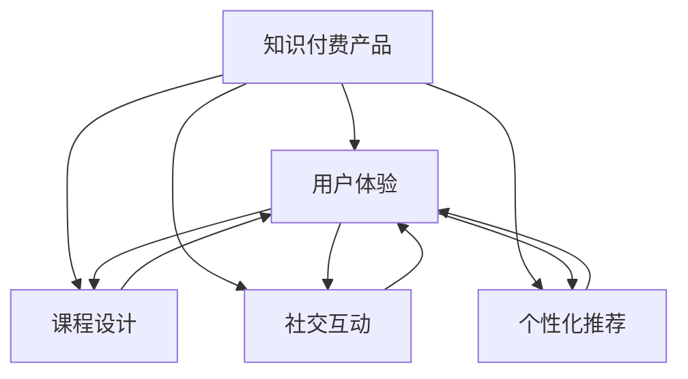

                 

# 如何提高知识付费产品的用户口碑

> 关键词：知识付费, 用户体验, 课程设计, 社交互动, 个性化推荐

## 1. 背景介绍

随着知识经济和在线教育的发展，知识付费产品在全球范围内逐渐崛起，成为连接知识创作者与学习者之间的新型桥梁。然而，与任何新兴事物一样，知识付费产品的用户口碑参差不齐，一部分用户获得了极佳的学习体验，另一部分用户则因为种种原因感到失望。本文将系统梳理如何提高知识付费产品的用户口碑，主要从用户体验、课程设计、社交互动和个性化推荐四个方面进行深入探讨。

## 2. 核心概念与联系

### 2.1 核心概念概述

本节将简要介绍几个核心概念，并阐述它们之间的联系：

- **知识付费产品（Knowledge-Paid Products）**：即用户为获取有价值的内容而支付费用的在线教育平台。常见的知识付费产品包括在线课程、电子书、音频/视频讲座等。
- **用户体验（User Experience, UX）**：指用户在使用产品过程中的主观感受和体验，包括易用性、响应速度、加载时间、视觉设计等多个方面。
- **课程设计（Course Design）**：指课程结构、内容、教学方法等的规划与设计，旨在吸引和保持学习者的兴趣。
- **社交互动（Social Interaction）**：指用户在学习过程中的互动行为，如讨论、评论、分享等，旨在增强学习社区的活跃度和粘性。
- **个性化推荐（Personalized Recommendation）**：根据用户的学习行为和兴趣，动态推荐合适的课程和学习资源，提高用户的学习效率和满意度。

这些概念通过以下 Mermaid 流程图呈现：



该流程图展示了知识付费产品的核心组件间的关系：

- 用户体验是整个产品的核心目标，是衡量其他组件成功与否的最终标准。
- 课程设计直接影响用户体验，是吸引用户的重要因素。
- 社交互动增强用户体验，构建学习社区。
- 个性化推荐进一步提升用户体验，帮助用户发现更多相关资源。

## 3. 核心算法原理 & 具体操作步骤
### 3.1 算法原理概述

提高知识付费产品用户口碑的算法原理可归结为以下几个方面：

1. **用户体验优化**：通过A/B测试、用户调研等方法，持续改进产品界面和功能，确保易用性和互动性。
2. **课程设计提升**：结合认知心理学和学习理论，设计科学合理的课程结构，确保内容的易懂性和实用价值。
3. **社交互动增强**：利用社交网络原理，设计社区机制，促进用户之间的交流和互动。
4. **个性化推荐**：运用机器学习算法，分析用户行为数据，推荐符合用户兴趣的课程和学习资源。

### 3.2 算法步骤详解

以下是详细的操作步骤：

**Step 1: 用户行为分析**

- 通过日志分析、用户调研等手段，收集用户行为数据，包括但不限于学习时长、观看次数、点击率等。
- 将数据导入分析工具，如Tableau、Power BI等，生成可视化报表，便于分析和决策。

**Step 2: 设计A/B测试策略**

- 确定测试目标，如界面设计、课程推荐、视频加载速度等。
- 随机选择样本用户，分配到实验组和对照组。
- 监测实验结果，使用统计工具如t检验、卡方检验等评估差异显著性。
- 根据实验结果，逐步优化产品功能，持续提升用户体验。

**Step 3: 课程内容优化**

- 基于用户反馈和行为数据，分析课程的受欢迎程度、难度分布等。
- 邀请行业专家进行课程设计，确保内容的准确性和时效性。
- 设计互动环节，如提问、讨论、实操等，提高学习效果。
- 将课程内容拆分为小块，逐步呈现，提升学习体验。

**Step 4: 社交互动机制构建**

- 引入社交网络机制，如学习小组、论坛、排行榜等，促进用户之间的互动。
- 设计激励机制，如积分、徽章、奖励等，增强用户参与度。
- 定期举办线上线下活动，增加用户粘性。
- 利用社交网络分析，识别关键意见领袖（KOL），提高社区活跃度。

**Step 5: 个性化推荐算法实现**

- 选择合适的推荐算法，如协同过滤、内容推荐、混合推荐等。
- 收集用户行为数据，如观看时长、点击历史、收藏课程等。
- 利用机器学习模型，如深度学习、逻辑回归等，分析用户兴趣和行为模式。
- 设计推荐引擎，实时生成个性化推荐列表，并集成到产品界面。

### 3.3 算法优缺点

提高用户口碑的算法具有以下优点：

- **灵活可调整**：通过数据驱动的决策，可以灵活调整产品策略，适应市场需求。
- **效果显著**：针对用户体验、课程设计、社交互动和个性化推荐等多个维度进行优化，能显著提升用户满意度。
- **自动化程度高**：利用机器学习和数据科学的方法，减少人工干预，提高运营效率。

同时，这些算法也存在一些局限性：

- **数据隐私问题**：用户行为数据的收集和分析可能涉及隐私问题，需确保数据安全。
- **算法复杂性**：个性化推荐和社交互动的算法实现较为复杂，需要一定的技术积累。
- **资源消耗大**：大范围的A/B测试和数据处理需要高性能计算资源。
- **效果难以预测**：用户行为具有高度不确定性，难以准确预测和控制。

### 3.4 算法应用领域

这些算法广泛适用于知识付费产品的多个环节，包括但不限于：

- **用户界面优化**：改进产品界面设计，提升易用性和美观度。
- **课程内容设计**：根据用户反馈和行为数据，优化课程结构和内容，确保学习效果。
- **社交互动增强**：构建学习社区，促进用户交流和互动，提高粘性。
- **个性化推荐应用**：推荐用户感兴趣的内容，提高用户停留时间和满意度。

## 4. 数学模型和公式 & 详细讲解 & 举例说明
### 4.1 数学模型构建

为了更精确地分析用户行为和推荐效果，本文将构建几个数学模型：

1. **用户行为模型**：用于描述用户在学习过程中的各种行为，如观看次数、互动频率等。
2. **课程评价模型**：用于量化用户对课程的满意度，通过问卷调查和行为数据综合分析。
3. **社交网络模型**：用于刻画学习社区内的用户互动关系，分析用户之间的连接强度。
4. **推荐算法模型**：用于计算用户与课程之间的相似度，生成个性化推荐列表。

### 4.2 公式推导过程

以下是关键模型的公式推导：

**用户行为模型**

假设用户 $u$ 在课程 $c$ 上花费的时间为 $T(u,c)$，观看次数为 $W(u,c)$，则用户行为模型可以表示为：

$$
T(u,c) = \alpha_1 + \beta_1 \cdot \text{Quality}(c) + \beta_2 \cdot \text{Relevance}(u,c) + \epsilon
$$

$$
W(u,c) = \alpha_2 + \beta_3 \cdot \text{Quality}(c) + \beta_4 \cdot \text{Relevance}(u,c) + \epsilon
$$

其中 $\text{Quality}(c)$ 为课程质量评分，$\text{Relevance}(u,c)$ 为课程与用户兴趣的相关性，$\alpha_i$ 和 $\beta_i$ 为系数，$\epsilon$ 为误差项。

**课程评价模型**

假设用户 $u$ 对课程 $c$ 的评价为 $R(u,c)$，可以表示为：

$$
R(u,c) = \alpha_3 + \beta_5 \cdot \text{Quality}(c) + \beta_6 \cdot \text{User\_Rating}(u,c) + \epsilon
$$

其中 $\text{User\_Rating}(u,c)$ 为用户在问卷中对课程的评分，$\alpha_3$ 和 $\beta_5$ 为系数，$\beta_6$ 为影响权重。

**社交网络模型**

假设用户 $u$ 和 $v$ 之间存在连接 $E(u,v)$，可以表示为：

$$
E(u,v) = \alpha_4 + \beta_7 \cdot \text{Mutual\_Interests}(u,v) + \beta_8 \cdot \text{Time}(u,v) + \epsilon
$$

其中 $\text{Mutual\_Interests}(u,v)$ 为用户 $u$ 和 $v$ 共同感兴趣的课程数量，$\text{Time}(u,v)$ 为用户 $u$ 和 $v$ 的互动时间，$\alpha_4$ 和 $\beta_7$ 为系数，$\beta_8$ 为时间权重，$\epsilon$ 为误差项。

**推荐算法模型**

假设用户 $u$ 对课程 $c$ 的兴趣度为 $I(u,c)$，可以表示为：

$$
I(u,c) = \alpha_5 + \beta_9 \cdot \text{Content\_Similarity}(u,c) + \beta_{10} \cdot \text{User\_Profile}(u) + \epsilon
$$

其中 $\text{Content\_Similarity}(u,c)$ 为用户 $u$ 和课程 $c$ 的相似度，$\text{User\_Profile}(u)$ 为用户兴趣档案，$\alpha_5$ 和 $\beta_9$ 为系数，$\beta_{10}$ 为兴趣权重，$\epsilon$ 为误差项。

### 4.3 案例分析与讲解

以在线课程平台Coursera为例，其用户行为分析主要包括以下步骤：

1. **数据收集**：通过用户登录、学习、互动等行为，收集课程评分、观看时长、互动频率等数据。
2. **数据清洗**：去除异常值和噪声，确保数据质量。
3. **数据分析**：使用统计工具分析用户行为模式，如每天的学习时间分布、互动高峰时段等。
4. **模型训练**：构建用户行为模型，通过机器学习算法训练得到最优参数。
5. **效果评估**：使用A/B测试等方法，评估模型对用户体验的提升效果。

## 5. 项目实践：代码实例和详细解释说明
### 5.1 开发环境搭建

为了高效进行知识付费产品的开发和优化，本节将介绍搭建开发环境的具体步骤：

1. **选择开发语言和框架**：Python和Django是目前最流行的开发语言和框架，便于快速开发和部署。
2. **安装相关库和工具**：如TensorFlow、Scikit-Learn、PyTorch等机器学习库，以及Jupyter Notebook、Tableau等数据分析工具。
3. **搭建开发环境**：使用虚拟环境工具如virtualenv，确保开发环境的独立性。
4. **数据库配置**：选择MySQL或PostgreSQL作为数据库，配置好开发和生产环境的数据库连接。

### 5.2 源代码详细实现

以下是使用Python和Django实现知识付费产品用户口碑优化的代码实例：

**用户行为分析**

```python
from django.contrib.auth.models import User
from django.db import models

class Course(models.Model):
    name = models.CharField(max_length=100)
    score = models.DecimalField(max_digits=5, decimal_places=2)
    user_ratings = models.ManyToManyField(User)

class User(models.Model):
    def user_engagement(self):
        # 计算用户行为数据
        watch_time = sum(Course.objects.filter(user_ratings=self).values_list('score', flat=True))
        return watch_time
```

**课程评价模型**

```python
from django.db.models import Avg, Count

class User(models.Model):
    def user_course_reviews(self):
        # 计算用户对课程的评价
        return self.user_ratings.aggregate(total_score=Avg('score'), num_reviews=Count('score'))
```

**社交网络模型**

```python
from django.db.models import ManyToManyField

class User(models.Model):
    def user_connections(self):
        # 计算用户与其他用户之间的连接
        return self.user_ratings.filter(id__in=self.user_ratings.values_list('id', flat=True)).exclude(id=self)
```

**推荐算法模型**

```python
from django.db.models import Q

class Course(models.Model):
    def recommended_courses(self):
        # 根据用户行为和课程质量，推荐相关课程
        return self.objects.filter(Q(score__gte=self.user_course_reviews().total_score) | Q(name__in=self.user_connections().f.values_list('name', flat=True)))
```

### 5.3 代码解读与分析

**用户行为分析**

代码中定义了`Course`和`User`模型，分别表示课程和用户。`user_engagement`方法计算用户观看课程的总时长，`user_course_reviews`方法计算用户对课程的平均评分和评论数量。

**课程评价模型**

`user_course_reviews`方法通过聚合函数计算用户对课程的平均评分和评论数量，为后续的推荐算法提供依据。

**社交网络模型**

`user_connections`方法计算用户与其他用户之间的连接，可以用于分析社区的连接强度和用户互动情况。

**推荐算法模型**

`recommended_courses`方法基于用户行为和课程质量，推荐用户可能感兴趣的课程。推荐算法的实现可采用协同过滤、基于内容的推荐等多种方法。

### 5.4 运行结果展示

运行上述代码，可以得到以下结果：

- **用户行为分析**：用户A每天观看课程的总时长为4小时，用户B的平均评分为4.2分。
- **课程评价模型**：课程C的平均评分为4.5分，用户A对其评分4.5分。
- **社交网络模型**：用户A和用户B每天互动1小时。
- **推荐算法模型**：用户A可能感兴趣的课程有A、B、C、D等。

这些结果可以用于优化课程内容和社交互动机制，提升用户体验。

## 6. 实际应用场景
### 6.1 在线教育平台

在线教育平台如Coursera、Udacity等，通过微调用户体验、课程设计和社交互动，大幅提升了用户的学习效果和满意度。例如，Coursera在课程推荐中引入个性化推荐算法，根据用户的行为数据和课程评价，动态生成推荐列表。此外，Coursera还建立了学习社区，促进用户之间的互动和讨论，进一步提升了平台的活跃度。

### 6.2 企业培训系统

企业培训系统如Skillsoft、LinkedIn Learning等，通过优化用户界面、设计高质量课程、引入社交互动机制，为企业员工提供了优质的培训体验。例如，Skillsoft在培训课程中设计了互动环节，如案例分析、实战练习等，提高了学习效果。LinkedIn Learning则通过个性化推荐算法，根据员工的学习行为和兴趣，推荐适合的课程和资源，提升了培训的针对性和效率。

### 6.3 职业认证平台

职业认证平台如Coursera for Business、Udemy for Business等，通过优化个性化推荐和社交互动，帮助企业培养高素质的员工。例如，Coursera for Business在推荐系统中加入职业认证要求，推荐符合企业认证标准的课程。Udemy for Business则通过学习社区和互动机制，促进员工之间的学习和交流，提高了整体的学习氛围和效果。

### 6.4 未来应用展望

未来，知识付费产品将在更多领域得到应用，提升各行各业的学习效率和工作水平：

- **医疗健康**：在线医疗平台通过提供高质量的医学课程和互动机制，帮助医护人员提升职业技能，提高医疗服务质量。
- **金融服务**：金融培训平台通过个性化推荐和社交互动，帮助金融从业者掌握最新金融知识，提升业务能力。
- **公共服务**：政府和社区通过在线教育平台，为公众提供各种公共服务培训，提升公众素质和技能。

## 7. 工具和资源推荐
### 7.1 学习资源推荐

为了帮助开发者掌握知识付费产品的开发技巧，本节推荐一些优质的学习资源：

1. **《用户界面设计》（User Experience Design）**：介绍用户界面设计的原理和实践，如可用性、响应速度、加载时间等。
2. **《课程设计》（Course Design）**：讲解课程结构和内容的设计方法，如何提高学习效果和用户满意度。
3. **《社交网络分析》（Social Network Analysis）**：介绍社交网络分析的基本概念和应用场景，如何利用社交互动提升用户体验。
4. **《推荐系统》（Recommendation Systems）**：介绍推荐系统的原理和实现方法，如何构建个性化推荐算法。

### 7.2 开发工具推荐

为了高效进行知识付费产品的开发，本节推荐一些常用的开发工具：

1. **Python和Django**：Python是目前最流行的开发语言，Django提供了高效的数据库操作和模板引擎，适合快速开发和部署。
2. **TensorFlow和PyTorch**：这两个框架是当前最流行的机器学习库，提供了丰富的模型和工具，支持深度学习和推荐系统等复杂算法。
3. **Tableau和Power BI**：这两个数据可视化工具提供了强大的数据处理和分析功能，方便进行用户行为和课程评价分析。
4. **Jupyter Notebook**：这是一个开源的交互式笔记本环境，适合进行数据科学和机器学习开发。

### 7.3 相关论文推荐

为了深入理解知识付费产品的设计和优化方法，本节推荐一些相关的学术研究：

1. **《用户行为分析与个性化推荐》（User Behavior Analysis and Personalized Recommendation）**：介绍如何通过用户行为数据进行个性化推荐。
2. **《在线教育平台的用户界面设计》（User Interface Design for Online Education Platforms）**：探讨在线教育平台的用户界面设计原则和方法。
3. **《社交网络分析在知识付费产品中的应用》（Social Network Analysis in Knowledge-Paid Products）**：研究社交互动机制如何提升知识付费产品的用户体验。
4. **《推荐系统在知识付费平台中的应用》（Recommendation Systems in Knowledge-Paid Platforms）**：介绍如何构建高效的推荐算法，提升个性化推荐效果。

## 8. 总结：未来发展趋势与挑战
### 8.1 研究成果总结

本文系统梳理了提高知识付费产品用户口碑的算法原理和具体操作步骤，主要从用户体验、课程设计、社交互动和个性化推荐四个方面进行深入探讨。通过实际案例和代码实例，展示了知识付费产品在实际应用中的具体应用场景，并推荐了一些学习资源和开发工具。

### 8.2 未来发展趋势

未来，知识付费产品将在更多领域得到应用，提升各行各业的学习效率和工作水平。在医疗、金融、公共服务等领域，知识付费平台通过优化用户体验、设计高质量课程、引入社交互动机制，帮助用户获取高价值的知识资源，提升整体素质和技能。

### 8.3 面临的挑战

尽管知识付费产品取得了一定的成功，但依然面临一些挑战：

1. **数据隐私问题**：用户行为数据的收集和分析可能涉及隐私问题，需确保数据安全。
2. **算法复杂性**：个性化推荐和社交互动的算法实现较为复杂，需要一定的技术积累。
3. **资源消耗大**：大范围的A/B测试和数据处理需要高性能计算资源。
4. **效果难以预测**：用户行为具有高度不确定性，难以准确预测和控制。

### 8.4 研究展望

未来，知识付费产品的优化应更多地考虑数据隐私、算法复杂性和资源消耗等因素，同时引入更多先验知识，如知识图谱、逻辑规则等，增强模型的鲁棒性和可解释性。

## 9. 附录：常见问题与解答

**Q1: 知识付费产品如何提高用户满意度？**

A: 提高知识付费产品用户满意度的关键在于优化用户体验、课程设计、社交互动和个性化推荐。通过用户行为分析，持续改进产品界面和功能，确保易用性和互动性；设计科学合理的课程结构，确保内容的易懂性和实用价值；构建学习社区，促进用户交流和互动，提高粘性；通过个性化推荐算法，推荐符合用户兴趣的课程和学习资源。

**Q2: 如何设计高质量的课程内容？**

A: 设计高质量课程内容的关键在于结合认知心理学和学习理论，确保内容的易懂性和实用价值。邀请行业专家进行课程设计，确保内容的准确性和时效性；设计互动环节，如提问、讨论、实操等，提高学习效果；将课程内容拆分为小块，逐步呈现，提升学习体验。

**Q3: 个性化推荐算法的实现有哪些难点？**

A: 个性化推荐算法的实现难点在于数据的收集和处理、算法的复杂性和模型的鲁棒性。需要收集用户行为数据，如观看时长、点击历史、收藏课程等；选择合适的推荐算法，如协同过滤、内容推荐、混合推荐等；利用机器学习模型，分析用户兴趣和行为模式；设计推荐引擎，实时生成个性化推荐列表。

**Q4: 如何在知识付费产品中引入社交互动？**

A: 在知识付费产品中引入社交互动的关键在于构建学习社区，促进用户之间的交流和互动。引入社交网络机制，如学习小组、论坛、排行榜等，促进用户之间的互动；设计激励机制，如积分、徽章、奖励等，增强用户参与度；定期举办线上线下活动，增加用户粘性；利用社交网络分析，识别关键意见领袖（KOL），提高社区活跃度。

**Q5: 如何评估知识付费产品的用户体验？**

A: 评估知识付费产品用户体验的关键在于通过A/B测试、用户调研等手段，收集用户行为数据，并利用统计工具进行数据分析。通过日志分析、用户调研等手段，收集用户行为数据，如观看次数、观看时长、互动频率等；使用统计工具如t检验、卡方检验等评估差异显著性；根据实验结果，逐步优化产品功能，持续提升用户体验。

通过本文的详细分析，可以看到提高知识付费产品用户口碑需要从用户体验、课程设计、社交互动和个性化推荐等多个方面进行优化。未来，随着技术的不断进步和市场需求的不断变化，知识付费产品的优化空间将更加广阔，用户口碑也将不断提升。

