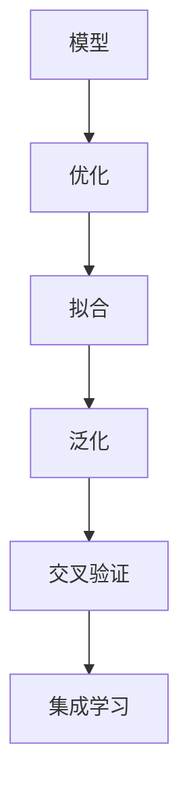

                 

## 1. 背景介绍

### 1.1 问题由来

在当前数字化时代，企业运营和决策日益复杂化，需要快速响应多变市场，整合海量数据。然而，依靠传统经验和直觉来进行管理决策，往往难以适应快速变化的环境。此时，模型思维便成为解决管理问题的有效手段。模型思维是指应用数学模型和数据分析方法，对复杂管理问题进行量化和建模，从而找到最优解决方案的过程。

### 1.2 问题核心关键点

模型思维的核心在于如何将复杂问题转化为数学模型，通过数据和算法求解，得到最优决策方案。模型思维的核心步骤包括：

- **问题抽象**：将实际管理问题抽象为数学模型。
- **数据收集**：获取与模型相关的数据，如销售数据、成本数据、生产数据等。
- **模型建立**：选择合适的数学模型，如线性规划、决策树、神经网络等。
- **数据处理**：对数据进行清洗、归一化、特征工程等预处理。
- **模型训练**：使用训练数据集对模型进行训练，优化模型参数。
- **模型评估**：使用测试数据集对模型进行评估，选择最优模型。
- **结果解释**：将模型结果转化为易于理解的建议，指导决策。

模型思维在资源优化、风险管理、运营调度等方面具有广泛应用。通过模型思维，可以系统化、定量化地分析问题，提升决策科学性和精准性。

## 2. 核心概念与联系

### 2.1 核心概念概述

为了更好地理解模型思维在管理问题中的应用，本节将介绍几个密切相关的核心概念：

- **模型（Model）**：数学或计算模型，用于描述现实问题的一种简化表示。
- **优化（Optimization）**：通过数学方法寻找问题的最优解。
- **拟合（Fitting）**：模型训练过程中，通过调整参数使模型输出与训练数据尽可能匹配。
- **泛化（Generalization）**：模型在未知数据上的表现能力，反映模型的泛化能力。
- **交叉验证（Cross-Validation）**：通过划分数据集进行多次实验，评估模型的泛化能力。
- **集成学习（Ensemble Learning）**：通过组合多个模型，提高预测准确率。

这些概念之间的逻辑关系可以通过以下Mermaid流程图来展示：



这个流程图展示了这个核心概念的逻辑关系：模型定义了问题的简化表示，优化寻找最优解，拟合调整参数以匹配数据，泛化评估模型的泛化能力，交叉验证评估模型的稳健性，集成学习组合多个模型以提高预测能力。

## 3. 核心算法原理 & 具体操作步骤

### 3.1 算法原理概述

模型思维在管理问题中的应用，主要依赖于优化算法和统计模型。常见算法包括线性规划、非线性规划、遗传算法、蒙特卡洛模拟等。统计模型包括回归模型、分类模型、聚类模型等。

模型思维的核心在于通过数学模型对管理问题进行量化，通过优化算法找到最优解，从而指导决策。模型思维的应用流程通常包括以下几个步骤：

1. 问题抽象：将管理问题转化为数学模型。
2. 数据收集：收集与模型相关的数据。
3. 模型建立：选择合适的模型，建立数学表达式。
4. 数据处理：对数据进行清洗、归一化、特征工程等预处理。
5. 模型训练：使用训练数据集对模型进行训练，优化模型参数。
6. 模型评估：使用测试数据集对模型进行评估，选择最优模型。
7. 结果解释：将模型结果转化为易于理解的建议，指导决策。

### 3.2 算法步骤详解

以线性规划模型为例，阐述模型思维在管理问题中的应用步骤：

1. **问题抽象**：假设某公司生产两种产品A和B，需要决定生产量和成本分配，以最大化利润。
2. **数据收集**：收集产品A、B的生产成本、销售价格、生产时间、销售时间等数据。
3. **模型建立**：建立线性规划模型，形式化为 $max \quad c^T x$，约束为 $Ax \leq b, x \geq 0$，其中 $c$ 为价格向量，$A$ 为约束矩阵，$b$ 为约束向量，$x$ 为生产量向量。
4. **数据处理**：对数据进行清洗、归一化、特征工程等预处理，得到模型输入。
5. **模型训练**：使用训练数据集对模型进行训练，优化模型参数。
6. **模型评估**：使用测试数据集对模型进行评估，选择最优模型。
7. **结果解释**：将模型结果转化为易于理解的建议，指导决策，如调整生产量和成本分配以最大化利润。

### 3.3 算法优缺点

模型思维在管理问题中具有以下优点：

- **系统化**：将问题转化为数学模型，通过系统化的求解过程，避免主观偏差。
- **精准性**：通过数据驱动的决策，提升决策的准确性和科学性。
- **可复制性**：模型思维可以复用在不同的场景和问题中，提高决策的普适性。

同时，模型思维也存在一些局限性：

- **数据依赖**：模型的结果高度依赖于数据的质量和完整性，数据偏差可能导致模型失真。
- **模型复杂性**：复杂模型难以理解和解释，可能带来较大的认知负担。
- **计算复杂度**：高复杂度模型需要大量计算资源，可能不适用于资源受限的场合。
- **模型鲁棒性**：模型对异常数据和噪声较为敏感，可能影响决策质量。

## 4. 数学模型和公式 & 详细讲解 & 举例说明

### 4.1 数学模型构建

在模型思维中，数学模型是问题描述的核心。以线性规划为例，线性规划模型通常由目标函数、约束条件和决策变量三部分组成。

目标函数形式为：

$$
\max \quad c^T x
$$

其中 $c$ 为价格向量，$x$ 为决策变量向量。

约束条件形式为：

$$
Ax \leq b, x \geq 0
$$

其中 $A$ 为约束矩阵，$b$ 为约束向量，$x$ 为决策变量向量。

### 4.2 公式推导过程

线性规划问题的求解通常采用单纯形法或内点法。以单纯形法为例，推导如下：

1. 将问题转化为标准型：

$$
\max \quad c^T x
$$
$$
s.t. \quad Ax \leq b
$$
$$
x \geq 0
$$

2. 将约束条件化为等式形式：

$$
Ax \leq b \Rightarrow Ax = b
$$

3. 将目标函数转化为最大最小值形式：

$$
c^T x \leq 0 \Rightarrow c^T (b - Ax) \geq 0
$$

4. 建立初始单纯形表：

| 列向量 | 基变量 | 非基变量 | 约束系数矩阵 | 约束向量 | 影子价格 |
| ------ | ------ | -------- | ------------- | -------- | --------- |
| $b$    | 1      | -1       | $A^T$         | 0        | $c$       |
| $Ax_0$ | 0      | $x_0$    | $A$           | $b$      | 0         |

其中 $x_0$ 为基变量向量，$Ax_0$ 为约束条件等式左边，$b$ 为约束条件等式右边。

5. 迭代求解：

在每一步迭代中，通过求解最小比值法，找到离开基变量的位置，加入非基变量，进行单纯形变换，直到达到最优解。

### 4.3 案例分析与讲解

以生产计划优化为例，展示线性规划模型在管理问题中的应用。

假设某公司生产两种产品A和B，需要决定生产量和成本分配，以最大化利润。已知生产成本、销售价格、生产时间、销售时间等数据如下：

- 产品A：每小时生产成本10元，销售价格50元，生产时间5小时，销售时间1小时。
- 产品B：每小时生产成本20元，销售价格100元，生产时间4小时，销售时间2小时。

公司每天有24小时的生产时间，每天的成本上限为1000元。求解最优的生产计划，以最大化利润。

问题转化为线性规划模型：

$$
\max \quad 50x_A + 100x_B
$$
$$
s.t. \quad 10x_A + 20x_B \leq 1000
$$
$$
5x_A + 4x_B \leq 24
$$
$$
x_A, x_B \geq 0
$$

建立单纯形表并进行迭代求解，得到最优解为 $x_A = 10, x_B = 0$，即每天生产产品A10小时，生产产品B0小时，每天利润为 $50 \times 10 + 100 \times 0 = 500$ 元。

## 5. 项目实践：代码实例和详细解释说明

### 5.1 开发环境搭建

在进行模型思维实践前，我们需要准备好开发环境。以下是使用Python进行PuLP库开发的环境配置流程：

1. 安装Anaconda：从官网下载并安装Anaconda，用于创建独立的Python环境。

2. 创建并激活虚拟环境：
```bash
conda create -n myenv python=3.8 
conda activate myenv
```

3. 安装PuLP库：
```bash
pip install pulp
```

4. 安装各类工具包：
```bash
pip install numpy pandas scipy sympy
```

完成上述步骤后，即可在`myenv`环境中开始模型思维实践。

### 5.2 源代码详细实现

下面我们以线性规划模型为例，给出使用PuLP库进行模型思维的PyTorch代码实现。

首先，定义模型数据：

```python
from pulp import *

# 定义变量
x = LpVariable('x', lowBound=0, cat='Continuous')

# 定义目标函数
lpObjective = LpMaximize(50*x)

# 定义约束条件
lpConstraint1 = LpConstraint(10*x + 20*0 <= 1000)
lpConstraint2 = LpConstraint(5*x + 4*0 <= 24)

# 创建模型
lpProblem = LpProblem('Production_Problem', LpMaximize)

# 添加变量和约束条件到模型
lpProblem.setObjective(lpObjective)
lpProblem.addConstraint(lpConstraint1)
lpProblem.addConstraint(lpConstraint2)

# 解决模型
lpProblem.solve()
```

然后，解析模型结果：

```python
# 获取变量值
xValue = x.value()

# 输出结果
print(f'Optimal solution: x = {xValue}, profit = {50*xValue + 100*0:.2f}')
```

以上就是使用PuLP库对线性规划模型进行求解的完整代码实现。可以看到，借助PuLP库，构建线性规划模型变得非常简单。

### 5.3 代码解读与分析

让我们再详细解读一下关键代码的实现细节：

**x变量定义**：
- 使用PuLP库的`LpVariable`函数定义变量，并指定初始值和连续性。

**目标函数定义**：
- 使用`LpMaximize`函数定义目标函数，指定优化方向。

**约束条件定义**：
- 使用`LpConstraint`函数定义约束条件，指定不等式和约束方向。

**模型创建**：
- 使用`LpProblem`函数创建模型，指定优化目标和约束条件。

**模型求解**：
- 使用`lpProblem.solve()`函数求解模型，返回最优解。

**变量值获取**：
- 使用`x.value()`函数获取变量的最优解值。

通过这些关键步骤，PuLP库使线性规划模型的求解变得简单易行。开发者可以根据具体问题调整模型定义和约束条件，以得到最优解。

当然，工业级的系统实现还需考虑更多因素，如模型的保存和部署、超参数的自动搜索、更灵活的模型定义等。但核心的求解范式基本与此类似。

## 6. 实际应用场景

### 6.1 资源优化

资源优化是模型思维在企业管理中的常见应用场景。通过对生产、库存、物流等资源的合理分配，提升企业的运营效率，降低成本。

以供应链优化为例，使用线性规划模型可以求解最优的采购、生产、库存策略，以降低总成本和运营风险。具体而言，可以建立供应链优化模型，包括供应商选择、生产计划、库存管理等环节。通过求解模型，得到最优的采购量和库存量，从而降低库存成本和缺货风险。

### 6.2 风险管理

风险管理是模型思维在企业管理中的重要应用。通过量化风险，制定应对策略，降低风险损失。

以信用风险管理为例，使用逻辑回归模型可以评估客户的信用风险，筛选高风险客户，降低坏账率。具体而言，可以收集客户的财务数据、历史交易记录等，建立逻辑回归模型，预测客户的违约概率。通过模型结果，设定信贷额度和利率，筛选高风险客户，降低坏账率。

### 6.3 运营调度

运营调度是模型思维在企业管理中的重要应用。通过优化调度，提升企业的运营效率，提高客户满意度。

以交通调度为例，使用网络流模型可以优化城市的交通流量，减少拥堵，提高交通效率。具体而言，可以建立城市交通网络模型，包括道路、交叉口、车辆等要素。通过求解模型，得到最优的交通流方案，减少拥堵，提高交通效率。

### 6.4 未来应用展望

随着模型思维技术的发展，其在企业管理中的应用将更加广泛。未来，模型思维将在以下几个方面带来新的突破：

1. **智能化决策**：通过深度学习和强化学习等技术，提升模型思维的智能化水平，实现更精准的决策。
2. **实时预测**：通过大数据和实时计算技术，实现实时预测和动态调整，提升管理效率。
3. **跨部门协同**：通过多部门协同模型，优化资源的跨部门分配，提升企业整体运营效率。
4. **动态优化**：通过动态优化算法，适应环境变化，提升模型适应性和鲁棒性。
5. **可视化分析**：通过可视化工具，将模型结果直观展示，便于决策者理解和应用。

## 7. 工具和资源推荐

### 7.1 学习资源推荐

为了帮助开发者系统掌握模型思维的理论基础和实践技巧，这里推荐一些优质的学习资源：

1. 《线性规划与优化》系列博文：由大模型技术专家撰写，深入浅出地介绍了线性规划原理、模型建立和求解方法等前沿话题。

2. 《数据驱动的决策分析》课程：斯坦福大学开设的决策分析课程，涵盖数据收集、数据处理、模型建立、结果解释等各个环节，是入门决策分析的必备资源。

3. 《模型思维》书籍：由模型思维专家所著，全面介绍了模型思维的应用方法和技巧，涵盖线性规划、回归分析、决策树等多个模型。

4. PuLP官方文档：PuLP库的官方文档，提供了完整的使用指南和案例，是学习线性规划模型求解的必备资料。

5. Scipy官方文档：Scipy库的官方文档，提供了科学计算、统计分析、优化求解等功能，是模型思维实现的常用工具。

通过对这些资源的学习实践，相信你一定能够快速掌握模型思维的精髓，并用于解决实际的企业管理问题。

### 7.2 开发工具推荐

高效的开发离不开优秀的工具支持。以下是几款用于模型思维开发的常用工具：

1. PuLP：基于Python的优化求解库，支持线性规划、整数规划等多种求解方法，是模型思维求解的基础工具。

2. Scipy：基于Python的科学计算库，提供了线性代数、微积分、优化求解等功能，是模型思维实现的常用工具。

3. Python：基于Python的高层次开发语言，易于学习和使用，广泛应用于数据分析、模型求解等领域。

4. Jupyter Notebook：基于Python的交互式编程环境，支持代码块和文本块混排，便于编写和解释模型代码。

5. Excel：微软办公软件，提供了强大的数据处理和可视化功能，便于模型结果的展示和分析。

合理利用这些工具，可以显著提升模型思维任务的开发效率，加快创新迭代的步伐。

### 7.3 相关论文推荐

模型思维技术的发展源于学界的持续研究。以下是几篇奠基性的相关论文，推荐阅读：

1. Linear Programming and Network Flows：运筹学经典教材，系统介绍了线性规划和网络流模型的建立和求解方法。

2. Machine Learning Yearning：深度学习领域的经典书籍，涉及模型训练、优化、评估等各个环节，对模型思维的应用有深入阐述。

3. Operations Research：运筹学领域权威期刊，涵盖线性规划、整数规划、网络流等各个方向的研究论文，是模型思维研究的必备文献。

通过学习这些前沿成果，可以帮助研究者把握学科前进方向，激发更多的创新灵感。

## 8. 总结：未来发展趋势与挑战

### 8.1 总结

本文对模型思维在企业管理中的应用进行了全面系统的介绍。首先阐述了模型思维的研究背景和意义，明确了模型思维在资源优化、风险管理、运营调度等方面的应用价值。其次，从原理到实践，详细讲解了线性规划模型的构建、求解和结果解释，给出了模型思维任务开发的完整代码实例。同时，本文还探讨了模型思维在企业管理中的应用前景，展示了模型思维的广泛应用潜力。此外，本文精选了模型思维技术的各类学习资源，力求为读者提供全方位的技术指引。

通过本文的系统梳理，可以看到，模型思维在企业管理中的应用价值逐步显现，可以系统化、定量化的分析复杂问题，提升决策的科学性和准确性。模型思维的深入应用，将有助于企业从传统经验驱动向数据驱动转型，提升企业的管理效率和竞争优势。

### 8.2 未来发展趋势

展望未来，模型思维在企业管理中的应用将呈现以下几个发展趋势：

1. **智能化决策**：通过深度学习和强化学习等技术，提升模型思维的智能化水平，实现更精准的决策。
2. **实时预测**：通过大数据和实时计算技术，实现实时预测和动态调整，提升管理效率。
3. **跨部门协同**：通过多部门协同模型，优化资源的跨部门分配，提升企业整体运营效率。
4. **动态优化**：通过动态优化算法，适应环境变化，提升模型适应性和鲁棒性。
5. **可视化分析**：通过可视化工具，将模型结果直观展示，便于决策者理解和应用。

以上趋势凸显了模型思维在企业管理中的广阔前景。这些方向的探索发展，将进一步提升企业管理水平，促进企业可持续发展。

### 8.3 面临的挑战

尽管模型思维技术已经取得了瞩目成就，但在迈向更加智能化、普适化应用的过程中，它仍面临诸多挑战：

1. **数据质量问题**：模型的结果高度依赖于数据的质量和完整性，数据偏差可能导致模型失真。
2. **模型复杂性**：复杂模型难以理解和解释，可能带来较大的认知负担。
3. **计算复杂度**：高复杂度模型需要大量计算资源，可能不适用于资源受限的场合。
4. **模型鲁棒性**：模型对异常数据和噪声较为敏感，可能影响决策质量。
5. **决策透明度**：模型决策过程的透明度不足，可能影响决策的可解释性和可控性。

正视模型思维面临的这些挑战，积极应对并寻求突破，将是大模型思维走向成熟的必由之路。相信随着学界和产业界的共同努力，这些挑战终将一一被克服，模型思维必将在构建安全、可靠、可解释、可控的智能系统铺平道路。

### 8.4 研究展望

面向未来，模型思维技术的研究和应用还需要在以下几个方面寻求新的突破：

1. **多模型融合**：将不同模型进行融合，提升模型的泛化能力和决策精度。
2. **模型解释性**：通过模型解释技术，提升模型的透明度和可解释性。
3. **实时数据处理**：通过实时计算技术，实现数据的实时处理和动态调整。
4. **跨领域应用**：将模型思维应用到更多领域，提升各行业的管理水平。
5. **伦理与合规**：在模型思维的应用中，引入伦理和合规约束，确保模型的公平性和安全性。

这些研究方向和技术的不断突破，将进一步推动模型思维技术的发展，提升企业管理水平，促进社会可持续发展。

## 9. 附录：常见问题与解答

**Q1：模型思维是否适用于所有企业管理问题？**

A: 模型思维适用于大部分企业管理问题，特别是那些具有明确量化指标和可操作性问题的场景。然而，对于某些高度依赖经验和直觉的问题，如领导力培养、企业文化建设等，模型思维可能难以有效应用。因此，需要根据具体问题选择适合的解决方案。

**Q2：模型思维是否需要大量的数据和计算资源？**

A: 模型思维通常需要大量的数据和计算资源，特别是在构建复杂模型时。然而，数据和计算资源并非模型思维应用的唯一限制，模型的解释性和鲁棒性也是重要考虑因素。因此，在模型构建过程中，需要综合考虑数据、计算、模型解释性和鲁棒性等多方面因素。

**Q3：如何应对数据质量问题？**

A: 数据质量问题可以通过以下方式应对：
1. 数据清洗：去除无效、重复、错误的数据。
2. 数据增强：通过数据增强技术，增加数据多样性，提高数据质量。
3. 异常检测：使用异常检测技术，识别和处理异常数据。
4. 数据预处理：对数据进行归一化、标准化等预处理，提高数据质量。

**Q4：如何提升模型解释性？**

A: 提升模型解释性可以通过以下方式：
1. 特征重要性分析：使用特征重要性分析技术，识别关键特征和特征关系。
2. 模型可视化：使用可视化工具，直观展示模型结果和决策过程。
3. 模型解释算法：使用模型解释算法，如LIME、SHAP等，提供可解释的决策路径。

**Q5：如何在决策过程中应用模型思维？**

A: 在决策过程中应用模型思维可以通过以下步骤：
1. 问题抽象：将决策问题转化为数学模型。
2. 数据收集：收集与模型相关的数据。
3. 模型建立：选择合适的模型，建立数学表达式。
4. 数据处理：对数据进行清洗、归一化、特征工程等预处理。
5. 模型训练：使用训练数据集对模型进行训练，优化模型参数。
6. 模型评估：使用测试数据集对模型进行评估，选择最优模型。
7. 结果解释：将模型结果转化为易于理解的建议，指导决策。

通过这些步骤，可以系统化、定量化地分析复杂问题，提升决策的科学性和准确性。

---

作者：禅与计算机程序设计艺术 / Zen and the Art of Computer Programming

