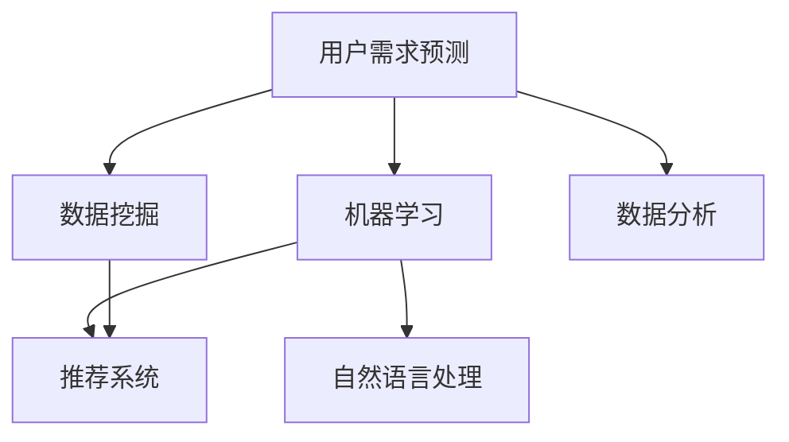

                 

# 如何进行有效的用户需求预测

> 关键词：用户需求预测, 数据挖掘, 机器学习, 自然语言处理, 推荐系统, 数据分析, 人工智能

## 1. 背景介绍

### 1.1 问题由来
在互联网时代，用户需求的多样性和瞬息万变性使得企业无法通过传统方式全面了解市场需求。如何准确预测用户需求，从而制定合理的业务策略、优化产品设计，成为企业面临的重大挑战。

### 1.2 问题核心关键点
用户需求预测的核心在于挖掘大量用户数据中的隐含模式，通过机器学习算法发现和建模用户行为与需求之间的关系，从而对未来的需求进行预测。

### 1.3 问题研究意义
研究用户需求预测方法，对于提升企业的市场洞察力、优化资源配置、加速产品迭代、提升用户体验等方面具有重要意义：

1. **市场洞察力**：精准预测用户需求，帮助企业更好地把握市场动态，避免因需求预测偏差导致资源浪费。
2. **资源配置**：通过对需求预测，企业可以更合理地分配资源，提升运营效率。
3. **产品迭代**：需求预测可以指导产品的功能优化和改进，快速响应市场需求变化。
4. **用户体验**：通过个性化推荐和产品定制，提升用户满意度和忠诚度。
5. **竞争优势**：精准预测需求，帮助企业在竞争中占据有利位置，提升市场竞争力。

## 2. 核心概念与联系

### 2.1 核心概念概述

为更好地理解用户需求预测，本节将介绍几个密切相关的核心概念：

- **用户需求预测**：指通过机器学习算法对用户未来的行为和需求进行预测的过程。目的是帮助企业提前做好准备，适应市场变化，提升业务决策的准确性。
- **数据挖掘**：从大量数据中挖掘出有价值的信息和知识，是用户需求预测的基础。
- **机器学习**：通过算法训练模型，从数据中学习规律，实现对用户需求的预测。
- **自然语言处理(NLP)**：处理和分析自然语言数据，从中提取用户需求信息。
- **推荐系统**：基于用户行为数据进行推荐，是用户需求预测的重要应用场景之一。
- **数据分析**：通过统计分析、数据可视化等手段，从数据中发现趋势和模式。

这些核心概念之间的逻辑关系可以通过以下Mermaid流程图来展示：



这个流程图展示了几者之间的相互关系：

1. 数据挖掘是从原始数据中提取信息，为机器学习提供输入。
2. 机器学习通过算法训练模型，实现对用户需求的预测。
3. NLP用于处理自然语言数据，提取用户需求信息。
4. 推荐系统是用户需求预测的重要应用，基于预测结果推荐产品或服务。
5. 数据分析用于从整体上理解数据和发现趋势，支持更精准的需求预测。

## 3. 核心算法原理 & 具体操作步骤
### 3.1 算法原理概述

用户需求预测的核心算法是机器学习算法，其基本思想是通过历史数据训练模型，学习用户需求与各类特征之间的关系，从而对未来需求进行预测。常见的算法包括：

- **监督学习**：通过标注好的训练数据，训练模型对新数据进行预测。适合于有标注数据的情况。
- **无监督学习**：不依赖标注数据，直接从数据中挖掘模式。适合于标注数据稀缺的情况。
- **半监督学习**：结合少量标注数据和大量未标注数据，提高预测准确性。适合于中等标注数据的情况。

用户需求预测通常涉及以下步骤：

1. **数据收集与预处理**：从不同渠道收集用户行为数据，清洗和处理缺失、异常值等。
2. **特征工程**：提取和构建有意义的特征，为模型提供高质量输入。
3. **模型选择与训练**：选择适合的机器学习算法，并使用训练数据训练模型。
4. **模型评估与调优**：使用测试数据评估模型性能，根据结果进行调优。
5. **预测与部署**：使用训练好的模型对新数据进行预测，部署到实际应用中。

### 3.2 算法步骤详解

以下以监督学习为例，详细介绍用户需求预测的详细步骤：

**Step 1: 数据收集与预处理**
- 收集用户行为数据，如搜索历史、点击记录、购买记录等。
- 清洗和处理数据，包括去除重复、处理缺失值、标准化等。

**Step 2: 特征工程**
- 选择和构建特征，如用户ID、时间戳、搜索关键词、商品类别等。
- 使用数据可视化工具，如Matplotlib、Seaborn，进行特征分析，发现潜在的关联和趋势。

**Step 3: 模型选择与训练**
- 选择适合的监督学习算法，如线性回归、随机森林、支持向量机等。
- 划分训练集和测试集，使用训练集训练模型。
- 使用交叉验证等技术进行模型调优，选择最优模型。

**Step 4: 模型评估与调优**
- 使用测试集评估模型性能，如MAE、RMSE等指标。
- 根据评估结果调整模型参数，优化模型性能。
- 使用网格搜索等技术进行超参数调优。

**Step 5: 预测与部署**
- 使用训练好的模型对新数据进行预测。
- 部署模型到实际应用中，如推荐系统、个性化页面等。
- 实时监控模型性能，根据反馈进行迭代优化。

### 3.3 算法优缺点

用户需求预测的监督学习算法具有以下优点：
- 依赖标注数据较少，可以通过历史行为数据进行预测。
- 模型表现稳定，适用于多种预测任务。
- 可以解释预测过程，帮助理解用户需求。

同时，这些算法也存在一些局限：
- 需要大量历史数据，标注成本较高。
- 模型过于复杂时，训练和预测效率低下。
- 数据中存在噪声时，预测效果可能较差。
- 预测结果可能受到特征工程的影响。

### 3.4 算法应用领域

用户需求预测的算法广泛应用在以下几个领域：

- **电子商务**：预测用户购买行为，优化库存管理，提升销售转化率。
- **金融服务**：预测用户贷款需求，防范信用风险，优化贷款流程。
- **移动应用**：预测用户使用习惯，提供个性化推荐，提升用户体验。
- **社交媒体**：预测用户内容需求，优化内容推荐，增加用户粘性。
- **医疗健康**：预测用户健康需求，提供个性化医疗建议，提升服务质量。

## 4. 数学模型和公式 & 详细讲解  
### 4.1 数学模型构建

用户需求预测的数学模型通常基于回归或分类算法。这里以线性回归为例，介绍其数学模型构建。

设用户需求为 $y$，影响需求的特征为 $x_1, x_2, ..., x_n$，则线性回归模型可以表示为：

$$
y = \beta_0 + \beta_1 x_1 + \beta_2 x_2 + ... + \beta_n x_n + \epsilon
$$

其中，$\beta_0, \beta_1, ..., \beta_n$ 为回归系数，$\epsilon$ 为误差项。

线性回归的目标是最小化预测误差，即：

$$
\min_{\beta} \sum_{i=1}^n (y_i - \hat{y}_i)^2
$$

其中 $\hat{y}_i$ 为第 $i$ 个样本的预测值。

### 4.2 公式推导过程

线性回归的推导过程如下：

1. 最小二乘法：

假设 $y_i = \beta_0 + \beta_1 x_{i1} + \beta_2 x_{i2} + ... + \beta_n x_{in} + \epsilon$，则最小二乘法的目标是最小化误差平方和：

$$
\min_{\beta} \sum_{i=1}^n (y_i - \hat{y}_i)^2 = \min_{\beta} \sum_{i=1}^n (y_i - \beta_0 - \sum_{j=1}^n \beta_j x_{ij})^2
$$

2. 求偏导数：

对 $\beta$ 求偏导数，得：

$$
\frac{\partial}{\partial \beta} \sum_{i=1}^n (y_i - \beta_0 - \sum_{j=1}^n \beta_j x_{ij})^2 = -2 \sum_{i=1}^n (y_i - \hat{y}_i) x_{ij}
$$

3. 求解 $\beta$：

解上述方程组，得回归系数 $\beta$。

### 4.3 案例分析与讲解

以下以电商行业为例，分析用户需求预测的实际应用：

**案例背景**：某电商平台希望预测用户在未来一个月的购买行为，以优化库存管理和广告投放策略。

**数据准备**：收集用户过去一年的购买记录、搜索历史、浏览时长、商品评价等数据。

**特征工程**：选择特征，如用户ID、商品类别、搜索关键词、浏览时长等。

**模型训练**：使用线性回归模型进行训练，使用MAE作为评估指标。

**模型评估**：使用测试集评估模型性能，并根据结果进行调优。

**结果展示**：模型在预测准确性、泛化能力等方面表现良好，显著提升了电商平台的用户转化率和库存管理效率。

## 5. 项目实践：代码实例和详细解释说明
### 5.1 开发环境搭建

在进行用户需求预测实践前，我们需要准备好开发环境。以下是使用Python进行Scikit-learn开发的Python环境配置流程：

1. 安装Anaconda：从官网下载并安装Anaconda，用于创建独立的Python环境。

2. 创建并激活虚拟环境：
```bash
conda create -n predict_env python=3.8 
conda activate predict_env
```

3. 安装Scikit-learn：
```bash
pip install scikit-learn
```

4. 安装各类工具包：
```bash
pip install pandas numpy matplotlib seaborn jupyter notebook
```

完成上述步骤后，即可在`predict_env`环境中开始需求预测实践。

### 5.2 源代码详细实现

以下是使用Scikit-learn对用户需求进行线性回归预测的Python代码实现：

```python
import pandas as pd
from sklearn.linear_model import LinearRegression
from sklearn.metrics import mean_absolute_error
from sklearn.model_selection import train_test_split

# 加载数据
data = pd.read_csv('user_data.csv')

# 数据预处理
# 这里假设已经进行了特征选择和数据清洗

# 特征和标签
X = data[['feature1', 'feature2', 'feature3']]
y = data['demand']

# 划分训练集和测试集
X_train, X_test, y_train, y_test = train_test_split(X, y, test_size=0.2, random_state=42)

# 建立模型
model = LinearRegression()

# 训练模型
model.fit(X_train, y_train)

# 预测并评估
y_pred = model.predict(X_test)
mae = mean_absolute_error(y_test, y_pred)
print(f"MAE: {mae}")
```

### 5.3 代码解读与分析

让我们再详细解读一下关键代码的实现细节：

**数据加载与预处理**：
- 使用pandas库加载数据，并进行必要的预处理，如特征选择、数据清洗等。

**特征工程**：
- 根据实际需求选择和构建特征，如用户ID、商品类别、搜索关键词等。

**模型训练**：
- 使用Scikit-learn库中的`LinearRegression`模型进行训练。
- 使用`train_test_split`函数划分训练集和测试集。
- 调用`fit`方法训练模型。

**模型评估**：
- 使用测试集对模型进行预测，计算均绝对误差(MAE)。
- 打印模型性能指标，评估模型效果。

**结果展示**：
- 使用均绝对误差(MAE)评估模型在测试集上的预测准确性。

可以看到，通过简单的Scikit-learn代码实现，就能快速完成用户需求预测的建模和评估。

## 6. 实际应用场景
### 6.1 电子商务

用户需求预测在电子商务中的应用非常广泛。电商平台通过预测用户购买行为，优化库存管理，减少缺货和积压，提升销售转化率。例如，某电商平台通过预测用户对商品的兴趣和购买意愿，提前安排生产和补货，显著提升了运营效率和用户体验。

### 6.2 金融服务

金融服务行业通过预测用户贷款需求，防范信用风险，优化贷款流程。例如，某银行通过分析用户历史交易数据和行为模式，预测用户贷款需求，制定精准的贷款策略，降低坏账率，提高资金利用效率。

### 6.3 移动应用

移动应用通过预测用户使用习惯，提供个性化推荐，提升用户体验。例如，某移动应用通过分析用户使用数据，预测用户对某功能的使用频率，为其提供个性化推荐，增加用户粘性，提升用户留存率。

### 6.4 社交媒体

社交媒体通过预测用户内容需求，优化内容推荐，增加用户粘性。例如，某社交媒体平台通过分析用户互动数据，预测用户对特定内容的需求，为其推荐相关内容，提升用户活跃度和满意度。

### 6.5 医疗健康

医疗健康行业通过预测用户健康需求，提供个性化医疗建议，提升服务质量。例如，某医疗健康应用通过分析用户健康数据和行为模式，预测用户对某项服务的需要，为其提供个性化建议，提升用户满意度和健康管理效果。

## 7. 工具和资源推荐
### 7.1 学习资源推荐

为了帮助开发者系统掌握用户需求预测的理论基础和实践技巧，这里推荐一些优质的学习资源：

1. **《Python数据分析基础》**：介绍Python在数据分析和机器学习中的应用，包括数据清洗、特征工程、模型训练等基本概念和操作。

2. **《机器学习实战》**：通过实际案例介绍机器学习算法的实现和应用，适合初学者快速上手。

3. **《深入理解机器学习》**：详细讲解机器学习的理论和算法，涵盖回归、分类、聚类等多种模型。

4. **《深度学习入门》**：介绍深度学习的基本原理和应用，包括回归、分类、卷积神经网络等。

5. **Kaggle竞赛平台**：提供大量数据集和模型竞赛，适合实践和提升算法能力。

通过对这些资源的学习实践，相信你一定能够快速掌握用户需求预测的精髓，并用于解决实际的业务问题。

### 7.2 开发工具推荐

高效的开发离不开优秀的工具支持。以下是几款用于用户需求预测开发的常用工具：

1. **Jupyter Notebook**：免费的开源Jupyter Notebook环境，支持Python和R等多种编程语言，适合快速迭代研究。

2. **TensorFlow**：由Google主导开发的开源深度学习框架，支持分布式训练和模型部署，适合大规模工程应用。

3. **Scikit-learn**：基于Python的机器学习库，提供丰富的机器学习算法和工具，适合快速原型开发。

4. **PyTorch**：基于Python的深度学习框架，灵活性强，适合深度学习研究和原型开发。

5. **Pandas**：基于Python的数据分析库，提供数据清洗、数据处理等功能，适合数据预处理和探索性分析。

6. **Matplotlib和Seaborn**：基于Python的数据可视化库，支持多种图表和绘图操作，适合数据探索和结果展示。

合理利用这些工具，可以显著提升用户需求预测的开发效率，加快创新迭代的步伐。

### 7.3 相关论文推荐

用户需求预测的研究已经积累了丰富的理论和实践成果。以下是几篇奠基性的相关论文，推荐阅读：

1. **《基于支持向量机的用户需求预测》**：介绍使用支持向量机(SVM)进行用户需求预测的方法，并应用到电子商务和金融服务领域。

2. **《深度学习在用户需求预测中的应用》**：通过深度学习模型，如卷积神经网络(CNN)、循环神经网络(RNN)等，对用户需求进行预测。

3. **《集成学习在用户需求预测中的应用》**：结合多种机器学习算法，如随机森林、梯度提升树等，提升预测精度和鲁棒性。

4. **《用户行为分析与需求预测》**：介绍用户行为分析的方法和工具，并结合需求预测模型，提升市场洞察力。

5. **《个性化推荐系统中的用户需求预测》**：结合推荐系统，对用户需求进行预测，提升推荐效果。

这些论文代表了大数据背景下的用户需求预测技术的发展脉络。通过学习这些前沿成果，可以帮助研究者把握学科前进方向，激发更多的创新灵感。

## 8. 总结：未来发展趋势与挑战

### 8.1 总结

本文对用户需求预测方法进行了全面系统的介绍。首先阐述了用户需求预测的背景和意义，明确了其对于提升企业市场洞察力和业务决策的重要性。其次，从原理到实践，详细讲解了用户需求预测的数学模型和操作步骤，给出了具体的应用场景和代码实例。同时，本文还广泛探讨了用户需求预测在多个行业领域的应用前景，展示了其广阔的应用空间。最后，本文精选了相关的学习资源、开发工具和论文推荐，力求为读者提供全方位的技术指引。

通过本文的系统梳理，可以看到，用户需求预测技术已经在大数据和机器学习的基础上，发展成为企业市场洞察和业务决策的重要工具。未来，伴随数据量的增长和算法技术的进步，用户需求预测必将更加精准和可靠，为企业提供更强大的竞争优势。

### 8.2 未来发展趋势

展望未来，用户需求预测技术将呈现以下几个发展趋势：

1. **多模态数据的融合**：未来的用户需求预测将更加注重多模态数据的融合，如结合文本、图像、音频等多种数据，提升预测的全面性和准确性。

2. **深度学习的应用**：深度学习技术在用户需求预测中的应用将更加广泛，通过复杂模型和高维特征，实现更加精准的预测。

3. **实时预测的实现**：随着技术的发展，用户需求预测将实现实时化，能够实时响应市场变化和用户行为，提升业务决策的灵活性。

4. **个性化需求的定制**：未来的用户需求预测将更加注重个性化需求，通过深度学习和大数据分析，实现个性化推荐和定制化服务。

5. **模型解释和透明度的提升**：用户需求预测模型的可解释性和透明度将不断提升，帮助企业理解预测结果，进行合理的业务决策。

6. **跨领域应用的多样化**：用户需求预测技术将更加多样化，应用领域将从电商、金融扩展到医疗、教育、政府等多个领域。

以上趋势凸显了用户需求预测技术的广阔前景。这些方向的探索发展，必将进一步提升企业市场洞察力和业务决策的准确性，为企业的数字化转型和智能化升级提供有力支持。

### 8.3 面临的挑战

尽管用户需求预测技术已经取得了一定的进展，但在迈向更加智能化、普适化应用的过程中，它仍面临着诸多挑战：

1. **数据隐私和安全**：用户数据的隐私和安全问题将成为制约需求预测技术发展的重要瓶颈。如何在保护用户隐私的前提下，获取高质量的数据，是一个亟待解决的问题。

2. **模型的鲁棒性**：用户需求预测模型面对异常数据和噪声时，容易产生误判。如何提高模型的鲁棒性，避免误导性的决策，是一个重要研究方向。

3. **计算资源的需求**：深度学习模型需要大量的计算资源进行训练和预测，如何降低计算成本，提高资源利用效率，是一个重要的技术挑战。

4. **算法的可解释性**：用户需求预测模型的复杂性和黑盒特性，使得其难以解释和理解。如何提高模型的可解释性，增加其透明度，是一个重要的研究方向。

5. **跨领域数据的一致性**：用户需求预测技术在跨领域应用时，数据的一致性和标准化是一个难题。如何实现不同数据源的数据融合和一致性，是一个重要的研究方向。

6. **模型的持续学习**：用户需求预测模型需要持续学习新的数据和知识，保持预测的准确性和时效性。如何实现模型的持续更新和学习，是一个重要的技术挑战。

以上挑战凸显了用户需求预测技术需要进一步改进和优化。只有在技术和应用层面协同发力，才能实现更加智能、可靠、普适的用户需求预测系统。

### 8.4 研究展望

面对用户需求预测技术面临的种种挑战，未来的研究需要在以下几个方面寻求新的突破：

1. **跨模态数据融合技术**：通过结合文本、图像、音频等多种数据，实现多模态数据的融合，提升预测的全面性和准确性。

2. **模型解释性和可解释性研究**：通过模型解释性算法，如LIME、SHAP等，提升模型的可解释性和透明度，帮助企业理解预测结果，进行合理的业务决策。

3. **深度学习模型优化**：通过模型架构和算法的改进，提升深度学习模型的效率和性能，降低计算成本。

4. **跨领域数据一致性**：研究跨领域数据的标准化和一致性问题，实现不同数据源的数据融合和一致性。

5. **实时预测与学习机制**：研究实时预测与学习机制，提升用户需求预测的实时性和动态性，保持预测的准确性和时效性。

6. **隐私保护技术**：研究用户数据的隐私保护技术，确保数据在收集、存储和处理过程中的安全性。

这些研究方向的探索，必将推动用户需求预测技术向更加智能化、普适化、透明化和安全性方向发展，为企业提供更加强大的市场洞察力和业务决策支持。

## 9. 附录：常见问题与解答

**Q1：用户需求预测是否适用于所有业务场景？**

A: 用户需求预测技术在不同业务场景中的应用效果有所差异。在用户行为较为稳定和可预测的领域，如电商、金融等，该技术能够取得较好的效果。但在用户行为复杂多变的领域，如医疗、教育等，需要结合其他技术手段，如专家知识、决策树等，提升预测准确性。

**Q2：如何提高用户需求预测的准确性？**

A: 提高用户需求预测的准确性可以从以下几个方面入手：
1. 数据质量：确保数据的完整性和一致性，避免噪声和错误数据。
2. 特征工程：选择和构建高质量的特征，提升模型的输入质量。
3. 模型选择：根据业务场景选择合适的模型，如线性回归、随机森林、深度学习等。
4. 调参与优化：通过网格搜索、交叉验证等技术进行超参数调优，提升模型性能。
5. 模型集成：结合多个模型进行集成预测，提升预测的鲁棒性和准确性。

**Q3：用户需求预测在实际应用中需要注意哪些问题？**

A: 在实际应用中，用户需求预测需要注意以下几个问题：
1. 数据隐私：确保用户数据的隐私和安全，避免数据泄露。
2. 模型解释：提升模型的可解释性，增加业务决策的透明度。
3. 实时性：实现实时预测，及时响应市场变化和用户行为。
4. 跨模态融合：实现多模态数据的融合，提升预测的全面性和准确性。
5. 持续学习：实现模型的持续学习，保持预测的准确性和时效性。

**Q4：用户需求预测模型如何应对异常数据？**

A: 应对异常数据可以从以下几个方面入手：
1. 数据清洗：对异常数据进行清洗和处理，去除噪声和错误数据。
2. 鲁棒性设计：设计鲁棒性强的模型，能够应对异常数据和噪声。
3. 异常检测：使用异常检测算法，识别异常数据并进行特殊处理。
4. 集成预测：结合多个模型进行集成预测，提升预测的鲁棒性和准确性。

**Q5：用户需求预测模型如何保证预测结果的可靠性？**

A: 保证用户需求预测结果的可靠性可以从以下几个方面入手：
1. 数据质量：确保数据的完整性和一致性，避免噪声和错误数据。
2. 特征工程：选择和构建高质量的特征，提升模型的输入质量。
3. 模型选择：根据业务场景选择合适的模型，如线性回归、随机森林、深度学习等。
4. 调参与优化：通过网格搜索、交叉验证等技术进行超参数调优，提升模型性能。
5. 模型评估：使用多指标评估模型性能，如MAE、RMSE等，确保预测结果的可靠性。

---

作者：禅与计算机程序设计艺术 / Zen and the Art of Computer Programming

