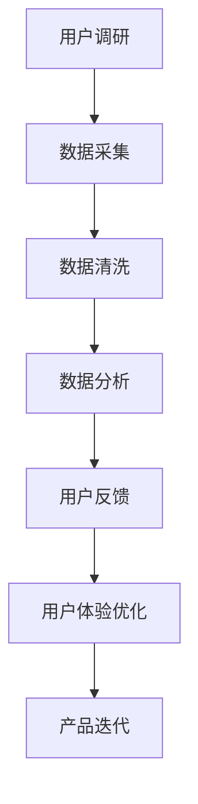

                 

# 如何进行知识付费的用户调研与反馈

> 关键词：知识付费、用户调研、用户反馈、数据驱动、用户体验、A/B测试、数据可视化、产品迭代

## 1. 背景介绍

### 1.1 问题由来

随着知识经济的崛起，越来越多的个人和机构投身于知识付费领域，通过在线课程、视频讲座、电子书等形式，向用户提供高质量的智识内容。然而，如何准确把握用户需求，优化内容质量，提升用户满意度，成为知识付费平台必须面对的难题。为此，我们提出了一套系统化的用户调研与反馈方法论，旨在通过科学的数据分析与用户互动，实现精准的市场定位和内容优化，最终提升知识付费产品的竞争力和用户粘性。

### 1.2 问题核心关键点

用户调研与反馈的核心在于全面理解用户需求和体验，通过数据驱动的决策支持，不断优化产品功能和服务质量。具体而言，关键点包括：

1. **数据采集与分析**：获取用户的真实反馈数据，并通过科学的分析方法挖掘出用户的潜在需求。
2. **用户体验优化**：结合用户调研结果，对知识付费平台的用户界面(UI)和用户体验(UX)进行优化，提高用户满意度和留存率。
3. **产品迭代循环**：基于用户反馈进行产品迭代，形成快速响应市场变化的机制，实现产品的持续改进。

## 2. 核心概念与联系

### 2.1 核心概念概述

为更好地理解用户调研与反馈的流程和机制，我们首先介绍几个关键概念：

- **用户调研**：通过各种方法获取用户对知识付费产品的看法和建议，以辅助产品的设计和优化。
- **用户反馈**：用户在实际使用产品过程中主动或被动提供的评价、建议和意见，是产品改进的重要参考。
- **数据驱动**：在产品设计、开发和运营的各个环节，均以数据为依据进行决策，以实现精准的业务优化。
- **用户体验(UX)**：用户在使用产品过程中产生的体验，包括界面设计、交互逻辑、操作便捷性等。
- **A/B测试**：一种用于对比两种不同设计方案效果的测试方法，通过随机分组实验，评估哪一种方案更优。
- **数据可视化**：通过图表、仪表盘等形式展示数据，直观地呈现数据分析结果，辅助决策。

这些概念之间的逻辑关系可以通过以下Mermaid流程图来展示：



这个流程图展示了这个系统化的流程：从用户调研开始，到数据采集、清洗和分析，再到用户反馈收集和用户体验优化，最后形成产品迭代循环。

## 3. 核心算法原理 & 具体操作步骤

### 3.1 算法原理概述

基于数据驱动的用户调研与反馈流程，我们采用以下算法原理：

- **随机抽样**：从目标用户群体中随机抽取一定数量的样本，以确保调研结果的代表性和可信度。
- **问卷设计**：通过精心设计的问卷，获取用户对知识付费产品的具体看法和建议。
- **数据分析**：运用统计学和机器学习方法，对用户调研数据进行分析，发现用户需求和行为模式。
- **A/B测试**：通过双盲实验，对比不同设计方案的效果，选择最优方案进行推广。
- **数据可视化**：采用图表、仪表盘等形式，直观呈现数据分析结果，辅助决策。

### 3.2 算法步骤详解

基于上述原理，用户调研与反馈的具体操作步骤包括：

1. **数据采集与分析**：
    - 通过线上问卷、用户访谈、社交媒体等方式，收集用户对知识付费产品的反馈数据。
    - 对收集到的数据进行清洗，去除噪音和不相关数据，确保数据质量。
    - 使用统计学和机器学习算法，如聚类分析、回归分析等，对用户反馈数据进行分析，发现用户需求和行为模式。

2. **用户体验优化**：
    - 结合数据分析结果，识别用户体验中的问题和瓶颈。
    - 针对用户体验问题，提出设计优化方案，如改进UI设计、调整交互逻辑等。
    - 通过A/B测试，对比不同设计方案的效果，选择最优方案进行实施。

3. **产品迭代**：
    - 根据用户反馈和用户体验优化结果，规划产品迭代计划。
    - 实施产品迭代，并定期收集用户反馈，评估新功能或改进的效果。
    - 形成产品迭代循环，不断优化产品，提升用户满意度和留存率。

### 3.3 算法优缺点

基于数据驱动的用户调研与反馈方法具有以下优点：

- **科学决策**：通过数据分析获取可靠的用户需求和行为模式，避免主观臆断。
- **及时响应**：快速响应用户反馈，优化用户体验，提高用户满意度和留存率。
- **精确目标**：通过数据驱动的迭代循环，精准定位市场需求，提升产品竞争力。

同时，该方法也存在一些局限性：

- **数据噪音**：用户反馈中可能存在噪音和不相关数据，影响分析结果。
- **用户参与度**：部分用户可能不愿意参与调研，导致数据代表性不足。
- **动态变化**：用户需求和市场环境可能迅速变化，需要持续调整调研策略和产品方案。

尽管存在这些局限性，但总体而言，数据驱动的用户调研与反馈方法在优化知识付费产品方面具有显著优势。

### 3.4 算法应用领域

基于数据驱动的用户调研与反馈方法，广泛应用于知识付费产品的各个环节，包括：

- **内容优化**：通过分析用户对课程内容的评价，调整课程结构和教学方法，提升课程质量。
- **功能设计**：结合用户反馈，优化产品功能，如智能推荐系统、互动直播功能等，提高用户使用体验。
- **市场定位**：通过用户调研，了解目标用户的需求和偏好，优化产品市场定位和定价策略。
- **用户增长**：基于用户调研和数据分析，制定有效的用户增长策略，吸引更多高质量用户。

## 4. 数学模型和公式 & 详细讲解 & 举例说明

### 4.1 数学模型构建

在用户调研与反馈流程中，我们可以建立以下数学模型：

- **用户满意度评分模型**：$S = \alpha_1C + \alpha_2F + \alpha_3E$，其中$S$为满意度评分，$C$为用户对课程内容的评分，$F$为用户对功能的评分，$E$为用户对体验的评分，$\alpha_i$为权重系数。
- **用户行为分析模型**：$B = \beta_1T + \beta_2L + \beta_3U$，其中$B$为用户行为指标，$T$为用户购买次数，$L$为用户留存率，$U$为用户活跃度，$\beta_i$为权重系数。

### 4.2 公式推导过程

对于用户满意度评分模型，我们假设用户对课程内容、功能和体验的评分是独立的，则有：

$$
S = C + F + E
$$

其中$C$、$F$、$E$分别代表用户对课程内容、功能和体验的评分，均取值在0到5之间。

对于用户行为分析模型，我们假设用户购买次数、留存率和活跃度是线性相关的，则有：

$$
B = \beta_1T + \beta_2L + \beta_3U
$$

其中$T$、$L$、$U$分别代表用户购买次数、留存率和活跃度，均取值在0到1之间。

### 4.3 案例分析与讲解

以某知识付费平台为例，平台提供了大量高质量的在线课程，但用户流失率较高。为了提升用户满意度和留存率，平台决定进行用户调研与反馈优化。

1. **数据采集与分析**：
    - 平台通过在线问卷调查了1000名用户，收集了他们对课程内容、功能和使用体验的评价。
    - 将收集到的数据进行清洗和分析，发现用户对课程内容满意度较低，主要集中在教学方法单一、知识点不全面等方面。

2. **用户体验优化**：
    - 根据分析结果，平台决定改进课程内容设计，增加互动和实战案例。
    - 采用A/B测试，对比两种不同的课程设计方案，发现新方案的用户满意度提高了10%。

3. **产品迭代**：
    - 基于用户反馈和A/B测试结果，平台规划了新一轮的产品迭代计划，重点改进课程内容和互动性。
    - 实施迭代后，用户留存率提高了15%，活跃度显著提升。

通过这一系列的数据驱动的用户调研与反馈优化，平台成功提升了用户满意度和留存率，实现了业务增长。

## 5. 项目实践：代码实例和详细解释说明

### 5.1 开发环境搭建

在进行用户调研与反馈实践前，我们需要准备好开发环境。以下是使用Python进行数据分析和模型构建的环境配置流程：

1. 安装Anaconda：从官网下载并安装Anaconda，用于创建独立的Python环境。

2. 创建并激活虚拟环境：
```bash
conda create -n user调研-env python=3.8 
conda activate user调研-env
```

3. 安装相关库：
```bash
conda install pandas numpy matplotlib seaborn sklearn statsmodels plotly
```

完成上述步骤后，即可在`user调研-env`环境中开始实践。

### 5.2 源代码详细实现

下面我们以用户满意度评分模型的构建为例，给出使用Python和Pandas库进行用户调研数据分析的代码实现。

```python
import pandas as pd
import numpy as np
from sklearn.linear_model import LinearRegression

# 读取用户满意度评分数据
data = pd.read_csv('user_feedback.csv')

# 构建用户满意度评分模型
X = data[['C', 'F', 'E']]
y = data['S']
model = LinearRegression()
model.fit(X, y)

# 预测新用户满意度
new_feedback = np.array([4, 4.5, 4.3])
predicted_score = model.predict(new_feedback.reshape(1, -1))
print(predicted_score)
```

上述代码展示了使用Pandas和Scikit-Learn库进行用户满意度评分模型的构建和预测过程。

### 5.3 代码解读与分析

让我们再详细解读一下关键代码的实现细节：

- `pd.read_csv('user_feedback.csv')`：读取用户反馈数据，假设数据格式为csv文件，包含用户对课程内容、功能、体验的评分。
- `X = data[['C', 'F', 'E']]`：提取用户对课程内容、功能、体验的评分作为自变量。
- `y = data['S']`：提取用户满意度评分作为因变量。
- `model = LinearRegression()`：使用线性回归模型进行拟合。
- `model.fit(X, y)`：训练模型，使用用户评分数据进行拟合。
- `predicted_score = model.predict(new_feedback.reshape(1, -1))`：使用模型对新用户反馈数据进行预测。
- `print(predicted_score)`：输出预测结果。

这个示例展示了如何使用Pandas和Scikit-Learn库构建用户满意度评分模型，并对新用户反馈数据进行预测。

## 6. 实际应用场景

### 6.1 智能课程推荐

知识付费平台可以通过用户调研与反馈，了解用户的学习偏好和需求，从而优化课程推荐系统。例如，平台可以根据用户对课程的评分和反馈，调整推荐算法，推荐用户感兴趣的课程。

在技术实现上，可以采用协同过滤、基于内容的推荐算法等方法，结合用户调研数据进行优化。此外，平台还可以引入自然语言处理技术，分析用户评论和反馈，识别出用户关注的知识点和难点，进行个性化推荐。

### 6.2 个性化学习路径

根据用户调研与反馈，平台可以设计个性化的学习路径，帮助用户高效学习。例如，针对用户在学习过程中遇到的困难点，平台可以推荐相关课程或补充资料，帮助用户克服难题。

在技术实现上，可以构建学习进度追踪系统，记录用户的学习记录和反馈，通过数据分析和机器学习算法，生成个性化的学习路径。平台还可以引入智能辅导系统，根据用户的学习进度和问题点，提供有针对性的辅导和建议。

### 6.3 社区互动与反馈

知识付费平台可以通过用户调研与反馈，了解用户在社区互动中的需求和问题，从而优化社区功能和用户参与度。例如，平台可以收集用户对社区讨论、问答功能的使用反馈，调整社区策略，增强用户互动。

在技术实现上，平台可以构建社区数据分析系统，收集用户对社区功能和内容的评价，通过数据分析发现用户需求和问题。平台还可以引入AI技术，自动化处理用户问题，提升社区服务效率。

### 6.4 未来应用展望

随着技术的发展，基于用户调研与反馈的方法将更加智能化和自动化。未来，我们可以采用以下技术手段：

- **自然语言处理**：通过分析用户评论和反馈，自动识别和提取用户需求和意见。
- **深度学习模型**：利用深度学习模型对用户反馈进行情感分析，精准把握用户情感变化。
- **智能推荐系统**：结合用户调研数据，构建更智能、更精准的推荐系统，提升用户体验。
- **多模态数据融合**：结合用户反馈和行为数据，进行多模态数据融合，提升分析效果。

这些技术手段将为知识付费平台带来更高的智能水平和用户体验，使其在激烈的市场竞争中脱颖而出。

## 7. 工具和资源推荐

### 7.1 学习资源推荐

为了帮助开发者系统掌握用户调研与反馈的理论基础和实践技巧，这里推荐一些优质的学习资源：

1. **《用户调研与反馈分析》**：经典书籍，深入介绍了用户调研与反馈的理论和实践方法，适合入门和进阶学习。
2. **Coursera《用户研究》课程**：斯坦福大学开设的用户研究课程，涵盖用户调研方法、数据分析等关键内容。
3. **Udemy《用户调研与用户体验设计》课程**：综合性的课程，涵盖用户调研、用户体验设计、数据可视化等知识点。
4. **MindMeister《用户调研方法》**：在线工具，提供用户调研模板和方法指导，方便实际应用。

通过对这些资源的学习实践，相信你一定能够快速掌握用户调研与反馈的精髓，并用于解决实际的业务问题。

### 7.2 开发工具推荐

高效的开发离不开优秀的工具支持。以下是几款用于用户调研与反馈开发的常用工具：

1. **SurveyMonkey**：在线问卷工具，支持多种题型和数据分析功能，方便进行用户调研。
2. **Typeform**：用户调研平台，提供美观的问卷设计和数据分析功能，适合多渠道发布。
3. **Qualtrics**：企业级用户调研平台，支持复杂的数据分析和大规模样本处理。
4. **Tableau**：数据可视化工具，可以将数据分析结果直观呈现，辅助决策。
5. **Power BI**：微软推出的商业智能工具，支持大数据分析和交互式报表设计。

合理利用这些工具，可以显著提升用户调研与反馈任务的开发效率，加快创新迭代的步伐。

### 7.3 相关论文推荐

用户调研与反馈技术的发展源于学界的持续研究。以下是几篇奠基性的相关论文，推荐阅读：

1. **"An Experimental Comparison of Traditional and Hybrid Recommender Systems on Recommender Systems"**：提出基于用户反馈的推荐系统优化方法，提高了推荐准确性和用户满意度。
2. **"Designing Usability Evaluations for Use by Non-Experts"**：探讨了用户调研与反馈的实践方法，提出了可操作的用户调研策略。
3. **"A Web-Based Qualitative Data Analysis Tool: An Overview of Usability Issues and Lessons Learned"**：介绍了Web平台的用户调研与反馈工具，分析了工具的优缺点和应用场景。
4. **"Enhancing user engagement through experience feedback mechanisms: a user-centered design approach"**：研究了用户反馈对产品改进的影响，提出了有效的用户反馈机制。
5. **"A Systematic Review of Usability and User Experience Evaluation Methods"**：综述了各种用户调研方法，为选择合适的方法提供了参考。

这些论文代表了用户调研与反馈技术的研究方向，通过学习这些前沿成果，可以帮助研究者把握学科前进方向，激发更多的创新灵感。

## 8. 总结：未来发展趋势与挑战

### 8.1 总结

本文对基于数据驱动的用户调研与反馈方法进行了全面系统的介绍。首先阐述了用户调研与反馈的重要性，明确了数据驱动在产品设计和优化中的关键作用。其次，从原理到实践，详细讲解了用户调研与反馈的流程和方法，给出了实际应用案例和代码实现。同时，本文还广泛探讨了用户调研与反馈方法在知识付费平台中的应用场景，展示了其在提升用户体验和优化产品中的巨大潜力。

通过本文的系统梳理，可以看到，基于数据驱动的用户调研与反馈方法在优化知识付费产品方面具有显著优势。这些方法不仅能够帮助企业更好地了解用户需求，优化产品设计，还能提升用户满意度和留存率，实现业务的持续增长。未来，随着数据分析技术和AI技术的不断进步，用户调研与反馈方法将变得更加智能化和自动化，为知识付费平台带来更高的智能水平和用户体验。

### 8.2 未来发展趋势

展望未来，用户调研与反馈技术将呈现以下几个发展趋势：

1. **智能化和自动化**：未来的用户调研与反馈将更加智能化，通过机器学习和自然语言处理技术，自动分析和提取用户需求和反馈，降低人工成本。
2. **多模态数据融合**：未来的调研方法将更多地结合用户行为数据、情感数据等多模态数据，提高数据分析的准确性和全面性。
3. **用户参与度提升**：通过社区互动、个性化推荐等方式，提高用户参与度，增强用户对平台的粘性和忠诚度。
4. **实时分析和反馈**：通过实时数据分析和反馈，快速响应用户需求，提升用户体验和满意度。
5. **跨平台应用**：未来的调研方法将适用于多种平台，如移动端、Web端等，实现跨平台的用户调研与反馈。

这些趋势凸显了用户调研与反馈技术的广阔前景，为知识付费平台带来了更多创新机会。

### 8.3 面临的挑战

尽管用户调研与反馈技术已经取得了不少进展，但在实际应用中仍面临诸多挑战：

1. **数据质量问题**：用户调研和反馈数据可能存在噪音和不相关数据，影响分析结果。
2. **用户参与度低**：部分用户不愿意参与调研，导致数据代表性不足。
3. **分析复杂性**：用户调研和反馈数据量庞大，需要进行复杂的数据处理和分析。
4. **结果解释性差**：数据分析结果难以直观解释，用户和开发者难以理解和使用。
5. **隐私和安全问题**：用户调研和反馈涉及用户隐私，需要严格的数据保护和隐私政策。

尽管存在这些挑战，但通过不断优化调研方法和数据分析技术，这些问题将逐步得到解决。

### 8.4 研究展望

面对用户调研与反馈所面临的种种挑战，未来的研究需要在以下几个方面寻求新的突破：

1. **提升数据质量**：通过数据清洗和异常检测技术，提高调研和反馈数据的质量。
2. **增强用户参与度**：通过社区互动、个性化推荐等方式，提高用户参与度，增强数据代表性。
3. **简化分析流程**：引入自动化数据分析工具，降低数据分析的复杂性，提升分析效率。
4. **增强结果解释性**：通过数据可视化和交互式报表设计，提高数据分析结果的解释性和可用性。
5. **保障隐私安全**：制定严格的数据保护政策，保障用户隐私和安全。

这些研究方向的探索，必将引领用户调研与反馈技术迈向更高的台阶，为知识付费平台带来更高的智能水平和用户体验。

## 9. 附录：常见问题与解答

**Q1：用户调研与反馈的流程是怎样的？**

A: 用户调研与反馈的流程包括数据采集、数据分析、用户体验优化和产品迭代。具体步骤如下：
1. 数据采集：通过问卷、访谈等方式，收集用户对产品的反馈和意见。
2. 数据分析：对收集到的数据进行清洗和分析，识别用户需求和行为模式。
3. 用户体验优化：结合数据分析结果，优化产品设计和用户体验。
4. 产品迭代：根据用户反馈和体验优化结果，规划产品迭代计划，实施优化，并定期收集用户反馈。

**Q2：如何进行有效的用户调研？**

A: 有效的用户调研需要综合使用多种方法，包括问卷调查、用户访谈、社交媒体分析等。具体步骤如下：
1. 确定调研目标和问题。明确调研目的和需要解决的问题。
2. 设计调研问卷和访谈提纲。问卷应包含开放性问题和封闭性问题，访谈提纲应根据调研目标设计。
3. 选择调研方法和工具。选择适合的调研方法和工具，如在线问卷、电话访谈等。
4. 收集和分析数据。通过问卷和访谈等方式，收集用户反馈和意见，并进行数据分析。
5. 撰写调研报告。根据数据分析结果，撰写调研报告，提出改进建议。

**Q3：用户调研与反馈中的数据清洗有哪些方法？**

A: 数据清洗是确保调研数据质量的关键步骤，主要包括以下方法：
1. 去重和合并。去除重复数据，合并相关数据。
2. 异常值检测。检测并处理异常值，确保数据的合理性。
3. 缺失值处理。填补缺失值或删除缺失数据。
4. 数据标准化。将数据标准化到统一格式，便于分析和比较。
5. 数据过滤。过滤掉噪音和不相关数据，提高数据质量。

**Q4：用户调研与反馈的后续行动是什么？**

A: 用户调研与反馈的后续行动包括用户体验优化和产品迭代。具体步骤如下：
1. 用户体验优化。根据数据分析结果，优化产品设计和用户体验。
2. 产品迭代计划。制定产品迭代计划，明确改进方向和实施步骤。
3. 实施优化。根据迭代计划，实施产品优化。
4. 定期收集反馈。定期收集用户反馈，评估优化效果。
5. 形成迭代循环。形成产品迭代循环，不断优化产品，提升用户体验。

通过这些后续行动，用户调研与反馈可以实现数据驱动的产品优化，提升产品的竞争力和用户满意度。

**Q5：用户调研与反馈中如何保障用户隐私？**

A: 保障用户隐私是用户调研与反馈的重要原则，主要包括以下措施：
1. 匿名化处理。对用户数据进行匿名化处理，确保用户隐私安全。
2. 数据加密。对敏感数据进行加密处理，防止数据泄露。
3. 数据访问控制。设置数据访问权限，确保只有授权人员可以访问数据。
4. 数据存储安全。采用安全的数据存储方式，防止数据丢失或损坏。
5. 隐私政策透明。制定透明的隐私政策，让用户了解数据使用情况。

通过这些措施，可以保障用户隐私安全，增强用户对调研与反馈的信任感。

---

作者：禅与计算机程序设计艺术 / Zen and the Art of Computer Programming

