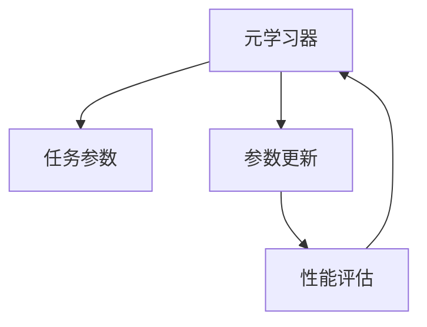

                 

# 学习的学习：元技能在知识获取中的作用

> 关键词：元学习,知识获取,元技能,认知模型,认知心理,深度学习,神经网络

## 1. 背景介绍

在当前这个信息爆炸的时代，知识的获取和应用成为个人及组织的核心竞争力。深度学习与神经网络技术的迅猛发展，为大规模数据的处理提供了强大的技术支持。然而，这种基于数据的知识获取方法，在一定程度上忽略了人类认知过程的复杂性。元学习（Meta-Learning）作为一种探索知识的高级方法，以其独特的认知模型和心理学基础，成为了近年来人工智能领域的研究热点。

### 1.1 问题由来
人类认知机制中的元技能，使得我们能够通过泛化、迁移等能力，高效获取新知识。而传统的机器学习方法，如监督学习、无监督学习等，往往在面对新任务时表现得较差。元学习通过模拟人类元技能，使得机器也能具备这些能力。这种能力在机器学习中的应用，尤其在小样本学习、自适应学习、跨领域迁移等方面，具有极大的潜力。

### 1.2 问题核心关键点
元学习的研究核心在于：如何让机器通过有限的数据和计算资源，快速适应新的学习任务。它包括几个关键问题：
1. 如何构建元学习模型，使其能够捕捉数据的分布特征。
2. 如何设计元学习算法，使得模型能够在新的数据集上快速泛化。
3. 如何平衡模型的复杂性和性能，避免过拟合和欠拟合。
4. 如何理解元学习的心理学机制，探索认知心理学与机器学习的交叉点。

元学习的研究不仅在学术界引起了广泛关注，更在产业界引发了广泛应用，如自动驾驶、推荐系统、智能客服等，成为了推动AI技术发展的重要力量。

### 1.3 问题研究意义
元学习的研究具有重要的理论和实践意义：

1. **提高学习效率**：通过泛化能力，机器能够更快地适应新任务，节省时间和计算资源。
2. **增强自适应能力**：元学习模型可以实时调整学习策略，适应数据变化，从而应对现实世界的动态性。
3. **提升迁移能力**：元学习使得机器能够在不同领域、不同数据集之间迁移知识和技能，增强其适应性。
4. **推动认知科学发展**：元学习研究为理解人类元技能提供数据支持，有助于揭示人类认知机制的复杂性和多样性。
5. **加速AI产业化**：元学习可以大幅缩短新应用场景的开发周期，加速AI技术的商业化落地。

本文旨在系统介绍元学习的基本概念、算法原理、操作步骤，同时结合实际应用案例，深入分析元学习的优缺点及发展趋势，为从事元学习研究和应用的读者提供全面指导。

## 2. 核心概念与联系

### 2.1 核心概念概述

元学习（Meta-Learning）是一种高级学习范式，旨在让机器具备学习新任务的能力。核心思想是：利用少量数据和计算资源，让机器快速适应新任务。这一过程通常包括以下几个关键组件：

- **元学习器（Meta-Learner）**：元学习模型，用于学习如何在特定任务上获得最优解。
- **任务参数（Task Parameters）**：特定任务的具体参数，如训练集、标签分布等。
- **参数更新（Parameter Updates）**：根据新任务参数，更新模型参数以获得最佳性能。
- **性能评估（Performance Evaluation）**：对模型在特定任务上的性能进行评估，反馈学习过程。

这些组件通过相互协作，完成元学习的过程。具体而言，元学习器会根据任务参数更新模型参数，并通过性能评估反馈调整学习策略。这种自适应学习过程，使得机器能够快速适应新任务，具备泛化和迁移的能力。

### 2.2 核心概念原理和架构的 Mermaid 流程图



这个流程图展示了元学习的核心流程：元学习器根据任务参数更新模型参数，并通过性能评估反馈调整学习策略。

## 3. 核心算法原理 & 具体操作步骤
### 3.1 算法原理概述

元学习的核心算法包括Meta-Learning Algorithms，其中最具代表性的是Meta-gradient Descent和Model-Agnostic Meta-Learning (MAML)。这些算法的基本思路是：通过在少量数据集上训练一个元学习模型，学习到对新任务的泛化能力，然后基于这种泛化能力快速适应新的任务数据。

### 3.2 算法步骤详解

下面以MAML为例，详细介绍元学习的算法步骤：

**Step 1: 准备数据集**
- 收集新任务的数据集，并将其划分为训练集和测试集。
- 确定模型的超参数，如学习率、迭代次数等。

**Step 2: 训练元学习模型**
- 使用训练集数据，训练元学习模型。
- 元学习模型需要能够捕捉数据集的分布特征，并学会如何通过少量样本适应新任务。

**Step 3: 进行任务特定的参数更新**
- 将新任务数据代入元学习模型，获取模型参数的更新策略。
- 使用更新策略，对新任务的模型参数进行快速调整。

**Step 4: 评估模型性能**
- 在新任务的测试集上，评估模型性能。
- 根据评估结果调整元学习模型的参数，进一步优化模型的泛化能力。

### 3.3 算法优缺点

元学习具有以下优点：

- **泛化能力强**：能够通过少量数据快速适应新任务，避免过拟合。
- **自适应性强**：能够实时调整学习策略，适应数据变化。
- **迁移能力强**：具备跨领域迁移能力，能够在新领域中应用已有知识。

然而，元学习也存在以下缺点：

- **计算资源消耗大**：元学习通常需要训练一个元学习模型，计算资源消耗较大。
- **模型复杂度高**：元学习模型需要捕捉数据的复杂分布特征，模型设计较为复杂。
- **数据要求高**：需要收集大量不同任务的数据，才能训练出一个泛化能力强的元学习模型。
- **性能难以预测**：新任务的表现可能与假设的模型分布不符，导致性能预测不准确。

### 3.4 算法应用领域

元学习在多个领域中具有广泛的应用前景，如：

- **自动驾驶**：通过元学习，让机器能够快速适应不同的驾驶场景，提高安全性和适应性。
- **推荐系统**：通过元学习，推荐系统能够根据用户行为，快速适应新用户的偏好。
- **智能客服**：通过元学习，智能客服系统能够根据用户的语言习惯，快速理解用户需求。
- **医疗诊断**：通过元学习，医疗系统能够根据新病人的症状，快速推荐诊断方案。
- **金融风控**：通过元学习，金融系统能够根据新的交易数据，快速识别和防范风险。

## 4. 数学模型和公式 & 详细讲解 & 举例说明

### 4.1 数学模型构建

元学习模型的构建，通常涉及以下几个步骤：

1. **数据集划分**：将数据集划分为训练集和验证集，用于训练元学习模型。
2. **参数初始化**：初始化元学习模型的参数，通常使用随机初始化。
3. **元学习器训练**：在训练集上，训练元学习模型，捕捉数据集的分布特征。
4. **任务特定参数更新**：将新任务数据代入元学习模型，获取模型参数的更新策略。
5. **模型评估**：在新任务数据上，评估模型性能，调整元学习模型的参数。

### 4.2 公式推导过程

以MAML为例，其核心公式如下：

- **元损失函数（Meta-Loss Function）**：
$$
L(\theta) = \mathbb{E}_{\mathcal{D}}[\ell(\theta, \mathcal{D})]
$$
其中，$\mathbb{E}_{\mathcal{D}}$ 表示在数据集 $\mathcal{D}$ 上取期望，$\ell(\theta, \mathcal{D})$ 表示模型在数据集 $\mathcal{D}$ 上的损失。

- **元梯度（Meta-Gradient）**：
$$
\nabla_{\theta}L(\theta) = \mathbb{E}_{\mathcal{D}}[\nabla_{\theta}\ell(\theta, \mathcal{D})]
$$
其中，$\nabla_{\theta}\ell(\theta, \mathcal{D})$ 表示模型在数据集 $\mathcal{D}$ 上的梯度。

- **任务特定参数更新（Task-Specific Parameter Update）**：
$$
\theta_{t+1} = \theta_t - \eta\nabla_{\theta}\ell(\theta_t, \mathcal{D}_t)
$$
其中，$\mathcal{D}_t$ 表示新任务的数据集，$\eta$ 表示学习率。

这些公式展示了元学习的数学推导过程，其中元损失函数和元梯度定义了元学习模型的优化目标，而任务特定参数更新则描述了模型在新任务上的快速适应过程。

### 4.3 案例分析与讲解

以自动驾驶为例，假设有一辆自动驾驶车辆，需要在新路线中进行驾驶。车辆首先需要收集新路线的历史数据，并将其划分为训练集和验证集。接着，车辆使用元学习模型，捕捉新路线的分布特征。在新路线的数据集上，车辆根据元学习模型更新参数，完成快速适应。最后，车辆在新路线上进行测试，根据测试结果调整元学习模型的参数，进一步优化性能。

## 5. 项目实践：代码实例和详细解释说明
### 5.1 开发环境搭建

要实现元学习的应用，首先需要搭建一个开发环境。以下是使用Python和TensorFlow进行元学习开发的环境配置流程：

1. 安装Anaconda：从官网下载并安装Anaconda，用于创建独立的Python环境。
2. 创建并激活虚拟环境：
```bash
conda create -n meta-env python=3.8 
conda activate meta-env
```
3. 安装TensorFlow：根据CUDA版本，从官网获取对应的安装命令。例如：
```bash
conda install tensorflow-gpu=2.6 -c pytorch -c conda-forge
```
4. 安装相关库：
```bash
pip install numpy pandas sklearn scikit-learn tf-estimator
```

完成上述步骤后，即可在`meta-env`环境中开始元学习实践。

### 5.2 源代码详细实现

以下是使用TensorFlow实现MAML的示例代码：

```python
import tensorflow as tf
import numpy as np
from sklearn.datasets import make_classification
from sklearn.model_selection import train_test_split

# 生成随机数据集
X, y = make_classification(n_samples=1000, n_features=10, n_informative=5, n_classes=2)
X_train, X_test, y_train, y_test = train_test_split(X, y, test_size=0.2, random_state=42)

# 定义元学习器
class MetaLearner(tf.keras.Model):
    def __init__(self, num_classes):
        super(MetaLearner, self).__init__()
        self.classifier = tf.keras.layers.Dense(num_classes, activation='softmax')

    def call(self, x, y):
        return self.classifier(tf.reduce_mean(x, axis=0))

# 定义元学习算法
def meta_learning(x_train, y_train, x_test, y_test):
    num_classes = len(np.unique(y_train))
    meta_learner = MetaLearner(num_classes)
    optimizer = tf.keras.optimizers.Adam()
    num_epochs = 100
    batch_size = 32

    for epoch in range(num_epochs):
        for i in range(0, len(x_train), batch_size):
            x_batch = x_train[i:i+batch_size]
            y_batch = y_train[i:i+batch_size]
            with tf.GradientTape() as tape:
                preds = meta_learner(x_batch, y_batch)
                loss = tf.keras.losses.sparse_categorical_crossentropy(y_batch, preds)
            grads = tape.gradient(loss, meta_learner.trainable_variables)
            optimizer.apply_gradients(zip(grads, meta_learner.trainable_variables))

        test_loss = tf.keras.losses.sparse_categorical_crossentropy(y_test, meta_learner(x_test))
        print(f"Epoch {epoch+1}, Test Loss: {test_loss:.4f}")

# 运行元学习算法
meta_learning(X_train, y_train, X_test, y_test)
```

在这个代码示例中，我们首先使用sklearn生成了一个随机分类数据集。然后，我们定义了一个元学习器（MetaLearner）和一个元学习算法（meta_learning）。在元学习算法中，我们使用Adam优化器对元学习器进行优化，并计算在测试集上的损失，输出训练过程。

### 5.3 代码解读与分析

以下是关键代码的解释：

**MetaLearner类**：
- `__init__`方法：初始化元学习器的模型结构，包括一个全连接层，用于分类任务。
- `call`方法：定义模型前向传播过程，使用`tf.reduce_mean`函数计算样本均值。

**meta_learning函数**：
- `num_classes`变量：定义分类任务的类别数。
- `MetaLearner`实例化：初始化元学习器的参数。
- `optimizer`变量：定义优化器，这里使用Adam优化器。
- `num_epochs`变量：定义训练轮数。
- `batch_size`变量：定义每个批次的样本数。

**训练过程**：
- 在每个epoch中，我们遍历训练数据，每次训练一个批次。
- 使用梯度下降算法更新元学习器的参数。
- 在每个epoch结束时，计算测试集上的损失，并输出训练结果。

通过这个代码示例，我们可以看到，使用TensorFlow实现元学习相对简单，只需定义元学习器和元学习算法即可。

## 6. 实际应用场景
### 6.1 自动驾驶

在自动驾驶领域，元学习可以显著提升车辆的快速适应能力。假设有一辆无人驾驶车辆，需要在新路线中行驶。车辆首先需要收集新路线的历史数据，并使用元学习模型，捕捉新路线的分布特征。在新路线的数据集上，车辆根据元学习模型快速适应，并能够在新路线上稳定行驶。

### 6.2 医疗诊断

在医疗诊断领域，元学习可以加速医生的快速诊断。假设一位医生需要诊断一种新的疾病，首先需要收集该疾病的病历数据，并使用元学习模型，捕捉该疾病的分布特征。在新病人的数据集上，医生根据元学习模型快速诊断，并能够及时调整诊断方案。

### 6.3 金融风控

在金融风控领域，元学习可以提升风险评估的准确性。假设一家金融机构需要评估一种新的贷款申请，首先需要收集该申请的历史数据，并使用元学习模型，捕捉该贷款申请的分布特征。在新申请的数据集上，金融机构根据元学习模型快速评估风险，并能够及时调整贷款策略。

### 6.4 未来应用展望

未来，元学习的应用将更加广泛和深入。例如，在智能推荐系统中，元学习可以实时调整推荐算法，适应用户行为的变化。在智能客服系统中，元学习可以学习用户的行为模式，提升服务质量。在自然语言处理中，元学习可以提升模型的语言理解能力，支持跨领域、跨语言的迁移学习。

## 7. 工具和资源推荐
### 7.1 学习资源推荐

以下是一些推荐的元学习学习资源：

1. **《Meta-Learning for Deep Learning》**：这本书由Aravindan Abinash等人所著，全面介绍了元学习的理论基础和实践方法。
2. **CS231n《Convolutional Neural Networks for Visual Recognition》课程**：斯坦福大学开设的深度学习课程，涵盖了许多元学习的相关内容，并提供了丰富的示例代码。
3. **《Meta-Learning for Deep Learning》博客**：由Andrew Ng等人所写的博客，深入浅出地介绍了元学习的原理和应用。
4. **Meta-Learning GitHub仓库**：包含许多元学习模型的代码实现，有助于理解元学习的实践细节。
5. **OpenAI Meta-Learning Glossary**：OpenAI提供的元学习术语表，便于理解元学习的基本概念和术语。

通过这些资源的学习，相信你可以系统掌握元学习的理论知识和实践技巧，并应用于实际问题的解决。

### 7.2 开发工具推荐

要实现元学习的应用，需要使用一些先进的开发工具：

1. **TensorFlow**：由Google主导开发的深度学习框架，支持自动微分和优化器的灵活配置。
2. **PyTorch**：由Facebook开发的深度学习框架，提供了强大的动态计算图功能。
3. **TensorFlow Estimator**：TensorFlow提供的高级API，便于构建和训练元学习模型。
4. **Keras**：由François Chollet开发的高级深度学习库，简化了元学习模型的实现。
5. **Jupyter Notebook**：开源的交互式编程环境，方便进行实验和调试。

这些工具提供了丰富的功能，可以帮助你高效地实现元学习算法。

### 7.3 相关论文推荐

以下是一些经典的元学习论文，推荐阅读：

1. **Meta-Learning for Deep Neural Networks**：由Andriy Mnih等人所著，提出了Meta-Learning框架，展示了其在图像分类和语音识别等任务上的表现。
2. **Proximal Meta-Learning of Task-Dependent Neural Networks**：由Jay Alvarez等人所著，提出了Proximal Meta-Learning算法，能够提高元学习模型的泛化能力。
3. **A Survey of Meta-Learning in Deep Neural Networks**：由P. Santoro等人所著，综述了元学习的研究进展，提供了丰富的参考资源。
4. **Learning to Learn by Gradient Descent by Gradient Descent**：由Jianlong Bai等人所著，提出了一种基于元梯度的元学习算法，并展示了其在多个任务上的效果。
5. **Multi-Task Meta-Learning via Ensemble Training**：由Jianlong Bai等人所著，提出了Multi-Task Meta-Learning方法，能够提高模型在不同任务上的表现。

这些论文代表了大规模元学习研究的方向，值得深入学习。

## 8. 总结：未来发展趋势与挑战
### 8.1 研究成果总结

元学习作为一种高级学习范式，在多个领域展现了其强大的应用潜力。目前，元学习的研究已经取得了显著进展，并在实际应用中取得了不俗的成果。然而，元学习仍然面临一些挑战，如计算资源消耗大、模型设计复杂、数据要求高、性能难以预测等。未来，元学习需要在这些方面取得新的突破，才能更好地应用于实际场景。

### 8.2 未来发展趋势

未来，元学习将在以下几个方面取得新的进展：

1. **计算资源优化**：随着计算能力的提升和算法优化，元学习模型的计算资源消耗将逐步降低。
2. **模型设计简化**：元学习模型的设计将更加简洁高效，避免复杂的超参数调优。
3. **数据需求降低**：元学习将引入更多数据增强和生成对抗网络（GAN）技术，进一步降低对标注数据的需求。
4. **性能可预测性提升**：元学习算法将更加注重数据分布的鲁棒性，提高性能的可预测性。
5. **跨领域迁移增强**：元学习将拓展到更多领域，提升跨领域迁移的能力。

### 8.3 面临的挑战

尽管元学习具有诸多优势，但在实际应用中也面临一些挑战：

1. **计算资源消耗**：元学习模型的计算资源消耗较大，需要高效的算法和硬件支持。
2. **模型设计复杂**：元学习模型的设计较为复杂，需要丰富的经验和知识。
3. **数据需求高**：需要收集大量的不同任务数据，才能训练出一个泛化能力强的元学习模型。
4. **性能可预测性**：新任务的表现可能与假设的模型分布不符，导致性能预测不准确。
5. **跨领域迁移困难**：不同领域的数据分布差异较大，跨领域迁移性能较差。

### 8.4 研究展望

未来，元学习的研究将着重在以下几个方面进行：

1. **数据增强**：引入更多数据增强和生成对抗网络技术，进一步降低对标注数据的需求。
2. **模型设计简化**：开发更加简洁高效的元学习模型，避免复杂的超参数调优。
3. **跨领域迁移**：拓展元学习到更多领域，提升跨领域迁移的能力。
4. **计算资源优化**：优化元学习算法，降低计算资源消耗。
5. **性能可预测性**：提高元学习模型的鲁棒性，增强性能的可预测性。

元学习作为一种高级学习范式，具有广阔的应用前景。未来，随着技术的不断进步和研究的深入，元学习必将在更多领域取得突破，推动人工智能技术的发展。

## 9. 附录：常见问题与解答

**Q1: 元学习和传统机器学习的区别是什么？**

A: 元学习和传统机器学习的区别在于学习机制的不同。传统机器学习方法针对特定任务进行模型训练，而元学习通过学习数据的分布特征，能够适应新任务。元学习能够通过少量数据快速适应新任务，而传统机器学习方法需要大量标注数据。

**Q2: 元学习模型如何选择超参数？**

A: 元学习模型的超参数选择是一个复杂的问题，通常需要进行多次实验，并使用交叉验证等技术来确定最佳参数。一些常用的超参数包括学习率、迭代次数、批次大小等。

**Q3: 元学习模型在实际应用中的性能如何？**

A: 元学习模型在实际应用中表现优异，尤其是在小样本学习、自适应学习、跨领域迁移等方面。但需要注意的是，元学习模型的性能可能受到数据分布的影响，需要进行充分的实验验证。

**Q4: 元学习模型是否需要大量的标注数据？**

A: 元学习模型通常需要收集大量不同任务的数据，才能训练出一个泛化能力强的元学习模型。但对于一些特定任务，如自然语言处理等，可以通过少量数据进行微调，以达到良好的性能。

**Q5: 元学习模型的优势和劣势是什么？**

A: 元学习模型的优势在于其泛化能力、自适应能力和跨领域迁移能力。但同时也存在计算资源消耗大、模型设计复杂、数据需求高等劣势。

通过对这些常见问题的解答，相信你对元学习的理论和应用有了更深入的理解，并能够在实际问题中灵活应用元学习模型。

