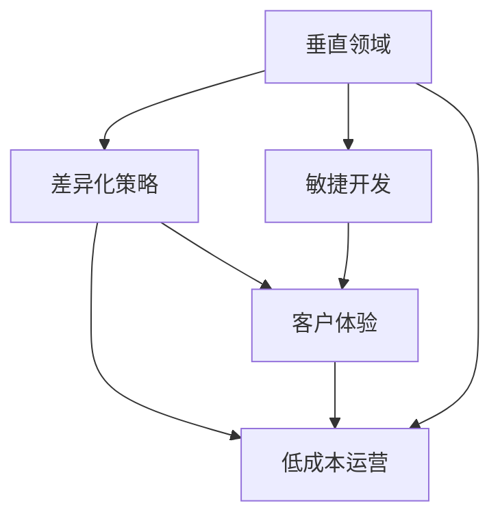

                 

# 小公司生存策略：精准服务垂直领域，满足独特价值需求

在日益激烈的市场竞争中，小公司往往面临巨大的生存压力。如何精准定位市场，提供独特价值，成为小公司生存的关键。本文将探讨小公司如何通过精准服务垂直领域，满足独特价值需求，实现可持续发展。

## 1. 背景介绍

### 1.1 市场环境分析

当前，全球经济面临诸多不确定性因素，如全球疫情、经济衰退、技术变革等。这些因素使得市场需求更加分化，小公司必须具备高度的灵活性和适应性，才能在激烈的市场竞争中脱颖而出。同时，随着消费者需求的多样化和个性化，传统大公司往往难以满足小众市场需求，为小公司提供了独特的生存和发展空间。

### 1.2 竞争格局与机会

在高度竞争的市场环境中，小公司要想生存，必须具有以下几个特征：
- **灵活性与创新性**：能够快速响应市场需求变化，不断推陈出新。
- **低成本与高效性**：通过精益管理和技术创新，降低成本，提高效率。
- **独特价值与差异化**：提供独特的服务和产品，满足特定人群的独特需求。

小公司可以通过以下方法实现这些特征：
- 专注于垂直领域：在细分市场进行深入研究，提供专业化服务。
- 创新产品与模式：基于独特的技术优势和市场需求，开发新产品和新模式。
- 重视客户体验：通过个性化服务和高效反馈，增强客户粘性。

## 2. 核心概念与联系

### 2.1 核心概念概述

- **垂直领域**：指的是细分市场或特定领域，如电子商务、金融科技、医疗健康等。小公司可以通过深入研究垂直领域，提供更加精准和专业的服务。
- **差异化策略**：指通过独特的技术、产品、服务或商业模式，与竞争对手形成区隔，满足特定市场细分的需求。
- **敏捷开发**：指通过精益开发、快速迭代等方法，快速响应市场变化，提高开发效率。
- **客户体验**：指通过提升客户的使用体验，增强客户满意度和忠诚度，从而提升品牌价值和市场竞争力。
- **低成本运营**：指通过精益管理、自动化流程等手段，降低运营成本，提高盈利能力。

这些概念之间的关系可以通过以下Mermaid流程图来展示：



### 2.2 核心概念原理和架构

**垂直领域**：
- **定义**：指的是特定行业、地区、客户群体等细分市场。
- **重要性**：垂直领域的深入研究有助于小公司发现独特需求，提供定制化服务。
- **实现**：通过市场调研、客户访谈等方式，深入了解垂直领域的需求和痛点，选择合适的目标市场。

**差异化策略**：
- **定义**：通过独特的技术、产品、服务或商业模式，与竞争对手形成区隔，满足特定市场细分的需求。
- **重要性**：差异化策略能够提高品牌认知度，吸引目标客户，提升市场竞争力。
- **实现**：基于垂直领域的研究，开发具备独特价值的产品或服务，如定制化解决方案、专属系统等。

**敏捷开发**：
- **定义**：指通过快速迭代、精益开发等方法，快速响应市场需求变化，提高开发效率。
- **重要性**：敏捷开发能够快速推出市场，快速验证产品可行性，降低市场风险。
- **实现**：采用敏捷开发框架（如Scrum、Kanban），进行快速迭代，持续收集反馈，优化产品。

**客户体验**：
- **定义**：指通过提升客户的使用体验，增强客户满意度和忠诚度，从而提升品牌价值和市场竞争力。
- **重要性**：良好的客户体验能够增强客户粘性，提升口碑效应，降低获客成本。
- **实现**：通过用户调研、产品测试等方式，了解客户需求和痛点，不断优化用户体验，提供定制化服务。

**低成本运营**：
- **定义**：通过精益管理、自动化流程等手段，降低运营成本，提高盈利能力。
- **重要性**：低成本运营能够提升企业的盈利能力，增强企业的抗风险能力。
- **实现**：采用精益管理工具（如Kaizen、PDCA），优化流程，减少浪费，提升效率。

这些核心概念相互关联，共同构成了小公司生存和发展的核心策略框架。

## 3. 核心算法原理 & 具体操作步骤

### 3.1 算法原理概述

基于垂直领域的精准服务和差异化策略，小公司可以通过以下算法原理进行操作：

- **市场细分与定位**：通过市场调研和数据分析，选择适合的目标市场。
- **需求分析与产品设计**：基于目标市场的需求，设计符合用户需求的产品或服务。
- **敏捷开发与迭代优化**：采用敏捷开发方法，快速迭代，持续优化产品。
- **客户体验与反馈收集**：通过客户调研、用户测试等方式，收集客户反馈，优化用户体验。
- **低成本运营与管理**：通过精益管理方法，降低运营成本，提高效率。

### 3.2 算法步骤详解

**市场细分与定位**：
1. **市场调研**：通过问卷调查、用户访谈等方式，了解目标市场的规模、特点、需求等。
2. **数据分析**：利用数据分析工具（如Tableau、Power BI），对市场数据进行分析，找到潜在的市场机会。
3. **目标选择**：基于市场调研和数据分析结果，选择最适合的目标市场。

**需求分析与产品设计**：
1. **需求访谈**：与潜在客户进行访谈，了解他们的需求和痛点。
2. **用户画像**：根据访谈结果，构建详细的用户画像，明确用户需求。
3. **产品设计**：基于用户画像和需求分析结果，设计符合用户需求的产品或服务。

**敏捷开发与迭代优化**：
1. **敏捷框架**：选择敏捷开发框架（如Scrum、Kanban），进行快速迭代。
2. **迭代计划**：制定每个迭代周期的目标和计划，明确开发任务和时间安排。
3. **持续优化**：在每个迭代周期结束时，收集反馈，进行产品优化和改进。

**客户体验与反馈收集**：
1. **用户调研**：通过问卷调查、用户访谈等方式，收集客户反馈。
2. **产品测试**：对产品进行内部测试和用户测试，收集用户体验数据。
3. **反馈处理**：基于收集到的反馈数据，进行产品优化和改进。

**低成本运营与管理**：
1. **流程优化**：采用精益管理工具（如Kaizen、PDCA），优化业务流程，减少浪费。
2. **自动化工具**：引入自动化工具（如IFTTT、Zapier），提升工作效率，降低人工成本。
3. **成本控制**：通过精益管理和自动化流程，降低运营成本，提高盈利能力。

### 3.3 算法优缺点

**优点**：
- **高度定制化**：通过垂直领域的深入研究和差异化策略，能够提供高度定制化的服务和产品。
- **快速响应市场变化**：采用敏捷开发方法，能够快速迭代，快速响应市场变化。
- **低成本运营**：通过精益管理和自动化流程，降低运营成本，提高盈利能力。

**缺点**：
- **市场风险**：专注于垂直领域可能面临市场风险，如市场需求变化、竞争对手进入等。
- **资源限制**：小公司资源有限，可能难以满足大规模市场需求。
- **技术壁垒**：对技术要求较高，需要具备较强的技术能力和创新能力。

### 3.4 算法应用领域

基于以上算法原理和操作步骤，小公司在多个领域都可以应用精准服务垂直领域和差异化策略，以下是几个典型应用领域：

- **电子商务**：通过深入研究特定品类或细分市场，提供定制化的电商平台或服务。
- **金融科技**：开发具备独特价值和功能的金融产品或服务，如小微企业贷款、理财咨询等。
- **医疗健康**：针对特定区域或特定群体，提供个性化医疗健康服务。
- **教育培训**：开发适合特定学生群体或特定学科的在线教育平台或资源。
- **旅游出行**：提供针对特定地区或特定主题的定制化旅游服务或产品。

## 4. 数学模型和公式 & 详细讲解

### 4.1 数学模型构建

假设小公司处于垂直领域 $F$，目标客户为 $C$，产品为 $P$，市场规模为 $M$，需求为 $D$，成本为 $C_0$，利润为 $P_0$。则数学模型可以表示为：

$$
\max_{P, C} \text{Profit} = \text{Sales} - \text{Cost} = \text{Price} \times \text{Quantity} - \text{Cost} = (P \times D) - (C_0 + C)
$$

其中，Price为产品价格，Quantity为产品销量，Cost为运营成本。

### 4.2 公式推导过程

基于上述模型，我们可以通过以下步骤推导出小公司如何在垂直领域内实现最大利润：

1. **需求分析**：通过市场调研和数据分析，确定目标客户 $C$ 的需求 $D$。
2. **产品设计**：根据需求分析结果，设计符合客户需求的产品 $P$。
3. **定价策略**：基于市场调研和产品设计结果，确定产品价格 $P$。
4. **成本控制**：通过精益管理和自动化流程，降低运营成本 $C$。
5. **销量提升**：通过营销推广、用户反馈等手段，提升产品销量 $D$。

### 4.3 案例分析与讲解

以电子商务为例，分析如何通过精准服务垂直领域和差异化策略实现最大利润：

1. **市场调研**：选择垂直领域 $F = 电子商务，C = 美妆产品，D = 年轻女性用户，P = 个性化美妆电商平台。
2. **需求分析**：通过问卷调查和用户访谈，了解用户需求 $D = \{\text{正品保障、个性化推荐、购物便利}\}$。
3. **产品设计**：设计个性化美妆电商平台 $P = \{\text{正品保障系统、个性化推荐引擎、一键下单功能}\}$。
4. **定价策略**：基于市场调研和用户需求，设定产品价格 $P = \{\text{市场平均价格 + 10\%}\}$。
5. **成本控制**：通过精益管理和自动化流程，降低运营成本 $C_0 = \{\text{仓储物流、技术开发、客户服务}\}$。
6. **销量提升**：通过社交媒体推广、用户反馈优化等手段，提升产品销量 $D$。

通过以上步骤，小公司能够在垂直领域内实现最大利润。

## 5. 项目实践：代码实例和详细解释说明

### 5.1 开发环境搭建

在开发过程中，可以使用Python、Django等技术搭建开发环境。具体步骤如下：

1. **安装Python**：从官网下载并安装Python，确保版本为3.8或以上。
2. **安装Django**：通过pip安装Django，创建项目目录。
3. **配置数据库**：配置MySQL或PostgreSQL数据库，用于存储用户数据和产品信息。
4. **创建应用**：在项目目录下创建应用，编写业务逻辑。
5. **部署环境**：使用Gunicorn和Nginx部署应用，确保应用稳定运行。

### 5.2 源代码详细实现

以下是一个简单的电子商务平台开发示例，实现用户注册、商品展示、购物车等功能：

```python
# 用户注册功能
def register(request):
    if request.method == 'POST':
        username = request.POST['username']
        password = request.POST['password']
        # 写入数据库
        # ...
    return render(request, 'register.html')

# 商品展示功能
def product_list(request):
    products = Product.objects.all()
    return render(request, 'product_list.html', {'products': products})

# 购物车功能
def cart(request):
    cart_items = CartItem.objects.filter(cart=request.session['cart_id']).all()
    return render(request, 'cart.html', {'cart_items': cart_items})
```

### 5.3 代码解读与分析

**注册功能**：
- **代码实现**：通过HTTP请求和模板渲染，实现用户注册功能。
- **功能实现**：用户提交注册信息后，系统将其保存到数据库中，生成会话ID，用于后续操作。

**商品展示功能**：
- **代码实现**：通过查询数据库，获取所有商品信息，并渲染页面展示。
- **功能实现**：用户可以浏览所有商品，选择感兴趣的商品进行购买。

**购物车功能**：
- **代码实现**：通过查询数据库，获取用户购物车中的商品信息，并渲染页面展示。
- **功能实现**：用户可以查看购物车中的商品，选择删除或结算。

### 5.4 运行结果展示

通过以上代码实现，用户可以实现注册、商品展示和购物车功能。具体运行结果如下：

1. 用户注册页面：用户可以填写注册信息，提交后进入登录页面。
2. 商品展示页面：用户可以浏览所有商品，选择感兴趣的商品加入购物车。
3. 购物车页面：用户可以查看购物车中的商品，选择删除或结算。

## 6. 实际应用场景

### 6.1 垂直领域电子商务

小公司在垂直领域电子商务中，可以针对特定品类或细分市场，提供个性化、定制化的电商解决方案。例如，针对美妆产品，开发个性化美妆电商平台，提供正品保障、个性化推荐和一键下单等功能，提升用户购物体验和满意度。

### 6.2 金融科技小微贷款

金融科技小微贷款公司，可以通过深入研究小微企业的需求，开发具备独特价值和功能的贷款产品，如无抵押贷款、小额循环贷款等。通过精准服务和差异化策略，满足小微企业的融资需求，提高贷款申请的审批效率和用户体验。

### 6.3 医疗健康在线咨询

医疗健康在线咨询平台，可以针对特定区域或特定群体，提供个性化医疗健康服务。例如，针对老年人，提供常见疾病的在线咨询和远程诊疗服务，提升老年人的健康管理水平。

### 6.4 教育培训在线学习

教育培训在线学习平台，可以针对特定学科或特定学生群体，提供个性化在线教育资源。例如，针对中小学学生，提供个性化学习路径、智能推荐和在线辅导等功能，提升学生的学习效果和兴趣。

### 6.5 旅游出行定制化旅游

旅游出行定制化旅游公司，可以针对特定地区或特定主题，提供个性化的旅游服务。例如，针对年轻人，提供个性化旅游路线、定制化活动和在线预订功能，提升旅游体验和满意度。

## 7. 工具和资源推荐

### 7.1 学习资源推荐

为帮助小公司快速掌握精准服务垂直领域和差异化策略，以下推荐一些优质的学习资源：

1. **《敏捷开发实践指南》**：介绍敏捷开发框架和最佳实践，提升开发效率。
2. **《精益创业》**：探讨精益管理方法和创业思路，帮助小公司降低成本，快速迭代。
3. **《深度学习与人工智能》**：介绍深度学习技术和应用，提升技术能力和创新能力。
4. **《用户心理学》**：分析用户行为和需求，提升用户体验和满意度。
5. **《数据分析基础》**：介绍数据分析工具和技巧，帮助小公司进行市场调研和数据分析。

### 7.2 开发工具推荐

为提升小公司开发效率和产品功能，以下推荐一些常用的开发工具：

1. **Python**：开源、灵活的编程语言，适合开发各种类型的应用。
2. **Django**：流行的Web框架，可以快速搭建电商、金融等应用。
3. **MySQL**：常用的关系型数据库，适合存储用户数据和产品信息。
4. **Redis**：高效缓存系统，提升应用性能和响应速度。
5. **Gunicorn**：Python Web应用的守护进程管理工具，确保应用稳定运行。

### 7.3 相关论文推荐

为深入理解小公司精准服务垂直领域和差异化策略，以下推荐一些相关的学术论文：

1. **《电子商务平台的用户行为分析》**：探讨电子商务平台的用户行为和需求，提出改进建议。
2. **《金融科技创新的技术基础》**：分析金融科技创新的技术基础和应用场景。
3. **《医疗健康在线咨询的实践与挑战》**：探讨医疗健康在线咨询的实践和挑战，提出改进思路。
4. **《教育培训的个性化学习路径》**：分析教育培训的个性化学习路径，提出改进建议。
5. **《旅游出行的定制化服务》**：探讨旅游出行的定制化服务，提出改进思路。

## 8. 总结：未来发展趋势与挑战

### 8.1 研究成果总结

本文通过介绍小公司如何在垂直领域提供精准服务和差异化策略，探讨了小公司生存和发展的核心策略。研究结果表明，小公司通过深入研究垂直领域，提供高度定制化的服务和产品，采用敏捷开发和精益管理方法，降低成本，提升效率，能够在激烈的市场竞争中生存和发展。

### 8.2 未来发展趋势

未来，小公司在垂直领域的发展将呈现以下趋势：

1. **智能化升级**：通过引入人工智能和机器学习技术，提升产品和服务的智能化水平。
2. **全渠道融合**：通过整合线上线下渠道，提供一体化、无缝的客户体验。
3. **数据驱动决策**：通过大数据分析，进行精准营销和用户画像分析，提升运营效率和客户满意度。
4. **生态系统构建**：通过构建生态系统，整合多方资源，提供更全面的解决方案。

### 8.3 面临的挑战

尽管小公司在垂直领域具有独特的优势，但仍面临以下挑战：

1. **市场竞争加剧**：随着市场竞争加剧，小公司需要不断创新，保持竞争力。
2. **资源限制**：小公司资源有限，需要合理分配资源，提升效率。
3. **技术门槛高**：小公司需要具备较强的技术能力和创新能力，才能在垂直领域中取得成功。
4. **客户需求变化**：市场和用户需求不断变化，小公司需要灵活调整，满足新需求。

### 8.4 研究展望

未来，小公司需要在以下几个方面进行深入研究：

1. **智能化技术应用**：深入研究人工智能和机器学习技术，提升产品和服务的智能化水平。
2. **全渠道融合技术**：研究如何整合线上线下渠道，提供无缝的客户体验。
3. **数据驱动决策技术**：研究如何通过大数据分析，进行精准营销和用户画像分析。
4. **生态系统构建技术**：研究如何构建生态系统，整合多方资源，提供全面的解决方案。

总之，小公司通过精准服务垂直领域，提供差异化服务，结合智能化技术、全渠道融合、数据驱动决策和生态系统构建，可以在激烈的市场竞争中实现可持续发展。

## 9. 附录：常见问题与解答

### 附录9.1 如何选择合适的垂直领域？

答：选择垂直领域时，需要考虑以下几个方面：
1. **市场规模**：选择市场规模较大、增长潜力大的领域。
2. **竞争格局**：选择竞争相对较小、存在市场空白的领域。
3. **客户需求**：选择有明确需求、潜在客户较多的领域。
4. **资源匹配**：选择公司自身资源匹配的领域，避免资源浪费。

### 附录9.2 如何提升用户体验？

答：提升用户体验需要从以下几个方面入手：
1. **需求分析**：通过问卷调查、用户访谈等方式，了解用户需求。
2. **界面设计**：设计简洁、易用的界面，提升用户操作体验。
3. **功能优化**：根据用户反馈，不断优化产品功能，提升用户体验。
4. **个性化服务**：提供个性化服务，提升用户满意度和忠诚度。

### 附录9.3 如何降低运营成本？

答：降低运营成本需要从以下几个方面入手：
1. **流程优化**：通过精益管理工具（如Kaizen、PDCA），优化业务流程，减少浪费。
2. **自动化工具**：引入自动化工具（如IFTTT、Zapier），提升工作效率。
3. **成本控制**：通过精益管理和自动化流程，降低运营成本。

总之，小公司通过精准服务垂直领域，提供差异化服务，结合智能化技术、全渠道融合、数据驱动决策和生态系统构建，可以在激烈的市场竞争中实现可持续发展。

---

作者：禅与计算机程序设计艺术 / Zen and the Art of Computer Programming

