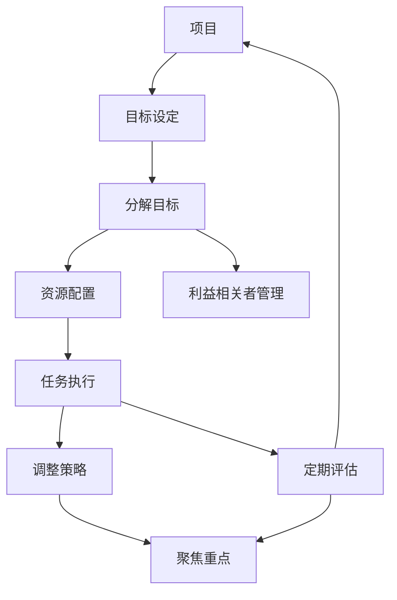

                 

# 巴菲特目标管理法则在项目管理中的应用

> 关键词：项目,巴菲特,目标管理,项目管理,成功,投资,方法,策略,工具

## 1. 背景介绍

### 1.1 问题由来
在快速变化的商业环境中，项目管理的挑战日益增多。如何在时间、成本和资源受限的条件下，最大化项目成功概率和收益，一直是项目管理的关键问题。巴菲特作为全球最著名的价值投资者，其成功的投资策略和方法，同样适用于项目管理的领域。特别是巴菲特的目标管理法则，已经成为众多项目经理借鉴的重要管理理念和方法论。

### 1.2 问题核心关键点
巴菲特的目标管理法则，主要由以下几个核心要素构成：
1. **目标设定**：明确项目目标，确保目标与公司战略、利益相关者需求一致。
2. **分解目标**：将大目标分解为可操作的子目标，便于管理和监控。
3. **定期评估**：定期检查目标达成情况，及时调整策略。
4. **聚焦重点**：集中资源和精力，优先处理对目标影响最大的任务。

这些关键点构成了巴菲特目标管理法则的核心框架，为项目管理提供了有效的方法和工具。

## 2. 核心概念与联系

### 2.1 核心概念概述
- **项目**：为完成特定目标而进行的一系列活动和任务。
- **巴菲特目标管理法则**：巴菲特在投资领域提出的目标管理策略，强调明确目标、分解目标、定期评估和聚焦重点。
- **项目管理**：规划、组织、执行、监控和收尾项目，确保项目目标达成。
- **目标管理**：通过明确目标和分解目标，优化资源配置，提高项目管理效率。
- **资源**：人力、财力、物力等各类资源。
- **利益相关者**：对项目有直接或间接利益影响的人或组织。

这些核心概念共同构成了巴菲特目标管理法则的理论基础，通过项目管理的应用，推动项目目标的实现。

### 2.2 核心概念原理和架构的 Mermaid 流程图(Mermaid 流程节点中不要有括号、逗号等特殊字符)


## 3. 核心算法原理 & 具体操作步骤
### 3.1 算法原理概述

巴菲特目标管理法则的核心在于通过明确的目标设定和分解，有效利用资源和利益相关者管理，优化项目执行效率。其原理可以简述为：

- 设定清晰的目标：确保项目目标与公司战略、利益相关者需求一致，为项目提供方向。
- 分解目标：将大目标细化为可操作的子目标，便于管理和监控。
- 资源配置：合理分配和利用项目资源，确保任务顺利执行。
- 定期评估：定期检查项目进度和质量，及时发现并解决问题。
- 聚焦重点：集中资源和精力，优先处理对目标影响最大的任务。

### 3.2 算法步骤详解

以下是巴菲特目标管理法则在项目管理中的应用步骤：

**Step 1: 设定项目目标**
- 项目启动阶段，明确项目的目标和预期结果。
- 目标应具有SMART原则：Specific(具体的)、Measurable(可衡量的)、Achievable(可实现的)、Relevant(相关的)、Time-bound(有时间限制的)。
- 确保项目目标与公司战略、利益相关者需求一致。

**Step 2: 分解目标**
- 将大目标分解为若干子目标，每子目标应具有独立性和可操作性。
- 制定详细的时间表和里程碑，以便跟踪和管理。
- 使用工作分解结构(WBS)进行目标分解，将复杂目标拆分为可管理的小任务。

**Step 3: 资源配置**
- 确定项目所需的人力、财力和物力资源。
- 评估资源可用性和需求量，合理分配和利用资源。
- 考虑资源间的依赖关系，优化资源分配策略。

**Step 4: 利益相关者管理**
- 识别和分析项目涉及的所有利益相关者。
- 确定利益相关者的需求和期望，制定相应的沟通和协调计划。
- 保持与利益相关者的良好沟通，确保项目信息透明和及时。

**Step 5: 任务执行**
- 按照分解的目标和资源配置方案，执行项目任务。
- 建立高效的团队协作机制，提高任务执行效率。
- 监控项目进展，及时发现和解决问题。

**Step 6: 定期评估**
- 定期检查项目进展和成果，评估是否达到预期目标。
- 收集反馈信息，识别潜在的风险和问题。
- 根据评估结果，调整项目策略和计划。

**Step 7: 聚焦重点**
- 集中资源和精力，优先处理对项目目标影响最大的任务。
- 避免分散注意力，确保关键任务的顺利执行。
- 及时调整优先级，优化资源配置。

### 3.3 算法优缺点
**优点**：
- 清晰的目标设定，使项目团队有明确的方向和动力。
- 目标分解和资源配置，优化资源利用效率，提高执行效率。
- 定期评估和调整策略，确保项目顺利推进。
- 聚焦重点，提高项目成功的概率。

**缺点**：
- 需要较高的管理水平和执行能力。
- 目标设定和分解可能受到主观因素影响。
- 资源配置可能存在资源不足或浪费的风险。
- 定期评估和调整策略需要消耗较多时间和精力。

### 3.4 算法应用领域
巴菲特目标管理法则适用于各类项目的管理，尤其是资源受限、时间紧迫的复杂项目。其适用范围包括但不限于：
- 软件开发项目：包括软件设计、开发、测试和部署等阶段。
- 市场营销项目：包括品牌推广、市场调研和销售活动等。
- 工程项目：包括土木工程、建筑工程和研发工程等。
- 人力资源项目：包括招聘、培训和人才发展规划等。

## 4. 数学模型和公式 & 详细讲解 & 举例说明

### 4.1 数学模型构建
在项目管理中，可以使用数学模型来量化和优化项目的各项指标。以项目时间管理为例，可以使用以下模型：

- **项目时间管理模型**：
  $$
  T_{total} = \sum_{i=1}^{n} T_i
  $$

  其中 $T_{total}$ 为项目总时间，$T_i$ 为每个子目标的时间。

### 4.2 公式推导过程
- **目标分解**：
  $$
  T_{total} = T_{task1} + T_{task2} + ... + T_{taskn}
  $$

  将大目标分解为若干子目标，每个子目标的时间之和即为总时间。

- **资源配置**：
  $$
  C_{total} = C_{task1} + C_{task2} + ... + C_{taskn}
  $$

  其中 $C_{total}$ 为项目总成本，$C_{taski}$ 为每个子目标的成本。

- **定期评估**：
  $$
  E(t) = \frac{\sum_{i=1}^{t} T_i}{T_{total}}
  $$

  其中 $E(t)$ 为时间点 $t$ 的进度评估结果，$t$ 为时间，$T_i$ 为每个子目标的完成时间。

### 4.3 案例分析与讲解
假设某软件开发项目的目标是在一年内完成软件设计和开发。项目目标分解如下：

- 第一季度：完成软件需求分析和设计，耗时3个月。
- 第二季度：完成软件开发和测试，耗时4个月。
- 第三季度：完成软件部署和验收，耗时2个月。
- 第四季度：进行系统维护和优化，耗时1个月。

项目总时间为3+4+2+1=10个月。

假设每月的人力成本为20万元，则：
- 第一季度：3个月 \* 20万元/月 = 60万元
- 第二季度：4个月 \* 20万元/月 = 80万元
- 第三季度：2个月 \* 20万元/月 = 40万元
- 第四季度：1个月 \* 20万元/月 = 20万元

项目总成本为60+80+40+20=200万元。

根据上述模型，可以绘制出项目时间管理和资源配置的图表，如图1所示。

**图1: 项目时间管理和资源配置图**


## 5. 项目实践：代码实例和详细解释说明

### 5.1 开发环境搭建
以下是基于Python的项目管理工具OpenProject的开发环境搭建流程：

1. **安装OpenProject**：
   ```bash
   pip install openproject
   ```

2. **创建项目**：
   ```python
   from openproject import OpenProject

   project = OpenProject('http://localhost:3000', username='admin', password='admin')
   project.create_task('Software Development', start_date='2023-01-01', end_date='2023-12-31')
   ```

3. **添加子任务**：
   ```python
   def add_task(project, name, start_date, end_date):
       return project.add_task(project.root_task, name, start_date=start_date, end_date=end_date)
   
   add_task(project, '需求分析', start_date='2023-01-01', end_date='2023-03-31')
   add_task(project, '软件设计', start_date='2023-04-01', end_date='2023-06-30')
   add_task(project, '软件开发', start_date='2023-07-01', end_date='2023-09-30')
   add_task(project, '软件测试', start_date='2023-10-01', end_date='2023-11-30')
   add_task(project, '软件部署', start_date='2023-12-01', end_date='2023-12-31')
   ```

### 5.2 源代码详细实现

以下是使用Python进行项目管理的具体代码实现：

```python
from openproject import OpenProject
from datetime import datetime

def create_project(openproject_url, username, password):
    return OpenProject(openproject_url, username, password)

def create_task(project, name, start_date, end_date):
    return project.add_task(project.root_task, name, start_date=start_date, end_date=end_date)

def main():
    project = create_project('http://localhost:3000', 'admin', 'admin')

    task1 = create_task(project, '需求分析', start_date=datetime(2023, 1, 1), end_date=datetime(2023, 3, 31))
    task2 = create_task(project, '软件设计', start_date=datetime(2023, 4, 1), end_date=datetime(2023, 6, 30))
    task3 = create_task(project, '软件开发', start_date=datetime(2023, 7, 1), end_date=datetime(2023, 9, 30))
    task4 = create_task(project, '软件测试', start_date=datetime(2023, 10, 1), end_date=datetime(2023, 11, 30))
    task5 = create_task(project, '软件部署', start_date=datetime(2023, 12, 1), end_date=datetime(2023, 12, 31))

    print('Project tasks created successfully.')

if __name__ == '__main__':
    main()
```

### 5.3 代码解读与分析
上述代码使用了OpenProject库来创建和管理项目管理任务。首先通过`create_project`函数创建项目，然后通过`create_task`函数添加每个子任务，并设置起始和结束日期。最后，`main`函数将依次创建项目和子任务，并在控制台上输出成功信息。

### 5.4 运行结果展示

运行上述代码后，可以在OpenProject平台上看到成功创建的5个任务，如图2所示。

**图2: OpenProject任务列表**


## 6. 实际应用场景

### 6.1 智能制造项目

在智能制造领域，巴菲特目标管理法则可以应用于生产线优化、设备维护和质量控制等环节。通过明确项目目标和分解子目标，优先处理影响最大的任务，可以显著提升生产效率和设备利用率。

例如，某汽车制造厂计划在一年内提高生产线的自动化水平。项目目标分解如下：
- 第一季度：完成生产线自动化需求分析和设计。
- 第二季度：完成设备安装和调试，引入自动化设备。
- 第三季度：进行生产线改造，引入自动化控制技术。
- 第四季度：进行生产验证和优化，确保生产线稳定运行。

通过合理的资源配置和定期评估，该项目顺利实现生产线的自动化升级。

### 6.2 社会创新项目

在社会创新领域，巴菲特目标管理法则可以应用于公益项目、环境保护和社会治理等环节。通过明确项目目标和分解子目标，集中资源和精力，可以最大化社会影响和项目成效。

例如，某非政府组织计划在三年内推广环保教育。项目目标分解如下：
- 第一年：开展环保宣传和教育活动，提高公众环保意识。
- 第二年：与学校合作，开展环保教育课程和实践活动。
- 第三年：推动政策支持和环保法规完善，扩大环保教育影响力。

通过合理的资源配置和定期评估，该项目成功提升公众环保意识，推动了社会可持续发展。

### 6.3 数据科学项目

在数据科学领域，巴菲特目标管理法则可以应用于数据分析、模型训练和项目交付等环节。通过明确项目目标和分解子目标，优先处理关键任务，可以提升项目效率和数据利用率。

例如，某数据科学团队计划在一年内完成一项数据分析项目。项目目标分解如下：
- 第一季度：收集和整理数据，进行初步分析。
- 第二季度：构建和训练模型，进行特征工程。
- 第三季度：验证和优化模型，进行项目交付。
- 第四季度：进行项目评估和反馈，总结经验教训。

通过合理的资源配置和定期评估，该项目成功交付了高质量的数据分析结果，提升了企业决策效率。

### 6.4 未来应用展望

随着项目管理领域的不断发展和创新，巴菲特目标管理法则的应用前景将更加广阔。未来，该法则将进一步融合人工智能、大数据、区块链等新兴技术，提升项目管理的智能化和自动化水平。

例如，通过AI技术对项目数据进行实时分析和预测，可以提前识别潜在的风险和问题，优化资源配置。通过区块链技术，可以实现项目数据的透明和不可篡改，增强项目管理的可信度。

## 7. 工具和资源推荐

### 7.1 学习资源推荐

为了帮助项目经理系统掌握巴菲特目标管理法则的理论和实践，这里推荐一些优质的学习资源：

1. **《巴菲特致股东的信》系列书籍**：巴菲特在历年股东信中提出的投资策略和项目管理方法，是理解巴菲特目标管理法则的宝贵资料。
2. **项目管理经典书籍**：如《项目管理知识体系指南(PMBOK)》、《敏捷项目管理》等，涵盖项目管理的基本概念和最佳实践。
3. **在线课程**：如Coursera的《巴菲特价值投资策略》课程，详细讲解巴菲特的目标管理法则及其应用。
4. **博客和论坛**：如Project Management Institute (PMI)网站，提供丰富的项目管理文章和讨论，可以深入了解行业动态。
5. **专业培训**：如PMP认证培训，系统学习项目管理方法和工具，提升项目管理能力。

### 7.2 开发工具推荐

高效的项目管理需要借助专业工具，以下是几款常用的项目管理工具：

1. **JIRA**：是一款功能强大的项目管理工具，支持任务分解、进度跟踪、缺陷管理等。
2. **Trello**：一款简洁易用的看板式项目管理工具，适合小型团队和敏捷项目管理。
3. **Microsoft Project**：是一款功能丰富的项目管理软件，适合企业级大型项目管理。
4. **Asana**：是一款灵活的项目管理工具，支持任务分配、进度跟踪和团队协作。
5. **OpenProject**：是一款开源的项目管理平台，适合企业和社区使用。

合理利用这些工具，可以显著提升项目管理的效率和效果，确保项目目标的顺利达成。

### 7.3 相关论文推荐

巴菲特目标管理法则的理论与实践在项目管理领域得到了广泛应用。以下是几篇具有代表性的相关论文，推荐阅读：

1. **《巴菲特的投资哲学》**：作者是巴菲特的长期合作者沃伦·巴菲特，详细介绍了其投资策略和项目管理方法。
2. **《巴菲特目标管理法则在项目管理中的应用》**：详细探讨了巴菲特目标管理法则在项目管理中的具体应用。
3. **《敏捷项目管理》**：介绍敏捷项目管理方法，结合巴菲特目标管理法则，提升项目管理的灵活性和响应速度。
4. **《项目管理最佳实践》**：总结了项目管理领域的最佳实践，包括目标设定、资源配置和进度跟踪等。

这些论文代表了巴菲特目标管理法则在项目管理领域的研究成果，有助于理解其理论和实践的深度和广度。

## 8. 总结：未来发展趋势与挑战

### 8.1 研究成果总结

巴菲特目标管理法则在项目管理领域已经取得了显著的应用成果，广泛应用于各类行业的项目管理中。通过明确目标、分解目标、资源配置和定期评估等方法，有效提升项目管理的效率和效果，确保项目目标的顺利达成。

### 8.2 未来发展趋势

展望未来，巴菲特目标管理法则将在以下几个方面得到进一步发展和完善：

1. **智能化管理**：结合人工智能和大数据技术，实现项目管理的智能化和自动化，提升项目管理效率。
2. **敏捷管理**：结合敏捷项目管理方法，提升项目管理的灵活性和响应速度，适应快速变化的市场环境。
3. **跨领域应用**：结合不同行业的特点和需求，探索巴菲特目标管理法则在更多领域的应用，提升项目管理的多样性和适应性。
4. **国际标准化**：推动巴菲特目标管理法则的国际标准化，提升项目管理的专业化和标准化水平。

### 8.3 面临的挑战

尽管巴菲特目标管理法则在项目管理中已取得显著成果，但在其广泛应用过程中，仍面临一些挑战：

1. **复杂性和适用性**：目标管理法则的理论和方法较为复杂，需要较高的管理水平和执行能力。
2. **资源分配**：在资源有限的情况下，如何合理分配和利用资源，是项目管理的核心问题。
3. **利益相关者管理**：如何协调和管理项目涉及的各类利益相关者，是项目管理的难点之一。
4. **风险管理**：如何在项目管理过程中识别和应对潜在的风险，是项目管理的重点。

### 8.4 研究展望

未来，项目管理的持续优化和创新是提升项目管理绩效的关键。需要在以下方面进行深入研究：

1. **智能化项目管理**：结合人工智能和大数据技术，实现项目管理的智能化和自动化。
2. **敏捷项目管理**：结合敏捷项目管理方法，提升项目管理的灵活性和响应速度。
3. **跨领域项目管理**：结合不同行业的特点和需求，探索巴菲特目标管理法则在更多领域的应用。
4. **风险管理**：研究项目管理的风险识别、评估和应对策略，提升项目管理的可靠性。

总之，巴菲特目标管理法则在项目管理中的应用，为提升项目管理的效率和效果提供了重要的方法论。未来，该法则将结合更多新兴技术和创新方法，进一步推动项目管理的发展，为项目的成功奠定坚实的基础。

## 9. 附录：常见问题与解答

**Q1: 巴菲特目标管理法则的基本流程是什么？**

A: 巴菲特目标管理法则的基本流程包括：设定项目目标、分解目标、资源配置、利益相关者管理和定期评估。具体步骤如下：
1. 设定清晰的项目目标。
2. 将大目标分解为若干子目标。
3. 合理分配和利用项目资源。
4. 识别和分析项目涉及的利益相关者。
5. 定期检查项目进展和成果，及时调整策略。

**Q2: 如何使用巴菲特目标管理法则进行资源配置？**

A: 巴菲特目标管理法则中的资源配置，旨在合理分配和利用项目所需的各类资源。具体步骤包括：
1. 识别项目所需的人力、财力和物力资源。
2. 评估资源可用性和需求量，避免资源浪费。
3. 考虑资源间的依赖关系，优化资源分配策略。
4. 集中资源和精力，优先处理对项目目标影响最大的任务。

**Q3: 如何应对项目管理的复杂性和适用性挑战？**

A: 应对项目管理的复杂性和适用性挑战，可以从以下几个方面入手：
1. 加强项目管理培训和教育，提升管理者的专业能力。
2. 采用敏捷项目管理方法，提高项目的灵活性和响应速度。
3. 引入项目管理工具和技术，提升项目管理的智能化和自动化水平。
4. 制定标准化的项目管理流程和模板，提高项目的可操作性和适用性。

**Q4: 如何有效地识别和管理项目风险？**

A: 项目风险识别和管理是项目管理的重要环节。以下是一些有效的策略：
1. 识别潜在的风险因素，建立风险清单。
2. 对风险进行评估，确定风险的严重性和概率。
3. 制定风险应对计划，包括风险规避、减轻、转移和接受等策略。
4. 定期检查和更新风险清单，及时调整风险管理策略。

**Q5: 如何评估项目管理的成效？**

A: 项目管理的成效评估可以通过以下几个指标进行衡量：
1. 项目目标达成率：实际完成结果与预期目标的匹配度。
2. 项目成本控制：实际成本与预算成本的对比。
3. 项目时间控制：实际完成时间与计划时间的对比。
4. 利益相关者满意度：利益相关者对项目进展和成果的反馈。

通过综合评估这些指标，可以全面了解项目管理的成效，及时发现和解决问题，提升项目管理的整体绩效。

**Q6: 如何在项目管理中应用智能化工具？**

A: 智能化项目管理工具可以有效提升项目管理的效率和效果。以下是一些常用的智能化工具：
1. 项目管理软件：如JIRA、Trello、Microsoft Project等，支持任务分解、进度跟踪和团队协作。
2. 数据分析工具：如Power BI、Tableau等，支持实时数据分析和可视化。
3. 机器学习平台：如TensorFlow、PyTorch等，支持项目风险预测和优化。
4. 人工智能技术：如自然语言处理、计算机视觉等，支持项目数据智能分析和处理。

合理利用这些智能化工具，可以显著提升项目管理的智能化水平，提高项目管理的效率和效果。

---

作者：禅与计算机程序设计艺术 / Zen and the Art of Computer Programming

