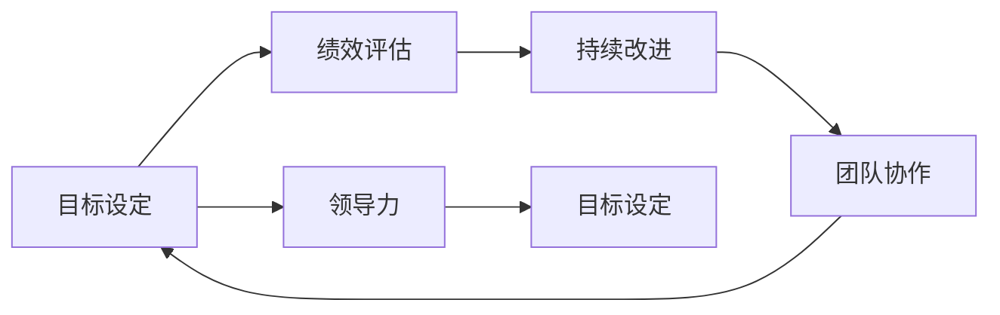

                 

# 巴菲特目标管理法则的团队应用

> 关键词：巴菲特目标管理,团队协作,绩效评估,绩效考核,目标设定,OKR,敏捷管理,持续改进

## 1. 背景介绍

### 1.1 问题由来

在当今这个信息爆炸、竞争激烈的时代，企业如何有效管理团队，最大化其工作效率和创新力，成为了众多管理者面临的共同挑战。巴菲特目标管理法则，以“集中精力做大事”为核心理念，强调目标设定、绩效评估和持续改进的重要性，为团队管理提供了系统的指导方法。本文将深入探讨这一法则在团队中的应用，结合实际案例，分析其对团队绩效提升的影响，以及具体实施中的注意事项。

### 1.2 问题核心关键点

- **目标设定**：明确团队的具体目标，确保每个成员对目标有清晰的认识和理解。
- **绩效评估**：建立科学的绩效评估体系，确保目标的实现和团队成员的持续改进。
- **持续改进**：通过定期的回顾和调整，不断优化团队的目标和执行策略，实现团队的长期发展。
- **团队协作**：通过透明的沟通和协作机制，增强团队成员之间的信任和协作，提升整体效率。
- **领导力**：有效的领导者能够激励和引导团队成员，实现团队的共同目标。

## 2. 核心概念与联系

### 2.1 核心概念概述

为更好地理解巴菲特目标管理法则在团队中的应用，我们首先介绍几个核心概念及其相互关系：

- **目标设定（Goal Setting）**：定义清晰、可量化的目标，指导团队成员的工作方向和努力方向。
- **绩效评估（Performance Evaluation）**：根据设定的目标，评估团队成员的实际表现，识别优势和改进空间。
- **持续改进（Continuous Improvement）**：通过反馈和调整，不断优化团队的目标和执行策略，实现团队的持续进步。
- **团队协作（Team Collaboration）**：通过有效的沟通和协作机制，增强团队成员之间的合作，提升整体工作效率。
- **领导力（Leadership）**：领导者的决策、激励和引导能力对团队的目标设定和绩效评估具有重要影响。

这些概念通过一个循环反馈机制紧密联系在一起，确保团队始终朝着既定的目标前进，同时通过不断的评估和改进，保持团队的高效和创新。

### 2.2 核心概念原理和架构的 Mermaid 流程图



## 3. 核心算法原理 & 具体操作步骤

### 3.1 算法原理概述

巴菲特目标管理法则基于以下几个核心原理：

1. **SMART原则**：目标应该是具体的（Specific）、可衡量的（Measurable）、可实现的（Achievable）、相关的（Relevant）和有时限的（Time-bound）。
2. **KPI和OKR**：关键绩效指标（Key Performance Indicators, KPI）和目标与关键成果（Objectives and Key Results, OKR）是实现目标评估的重要工具。
3. **反馈循环**：通过定期的反馈和评估，确保团队目标和策略的有效性，并进行必要的调整。
4. **团队协作**：鼓励透明的沟通和协作，增强团队成员之间的信任和合作，提升整体效率。

### 3.2 算法步骤详解

基于上述原理，巴菲特目标管理法则的实施步骤如下：

**Step 1: 确定团队目标**

- **团队对齐**：确保团队成员对组织目标有清晰的理解，并将其转化为可执行的任务。
- **目标设定**：根据SMART原则，设定具体、可量化、可实现的目标。
- **KPI和OKR设定**：明确衡量目标实现的指标，设定关键结果（Key Results, KR）。

**Step 2: 绩效评估**

- **数据收集**：收集与KPI和OKR相关的数据，进行定期评估。
- **绩效反馈**：根据评估结果，提供及时的反馈，识别优势和改进空间。
- **个人与团队对齐**：确保个人目标与团队目标一致，提升整体绩效。

**Step 3: 持续改进**

- **回顾与反思**：定期回顾团队的工作进展，识别改进机会。
- **目标调整**：根据评估结果和市场变化，调整团队目标和执行策略。
- **知识分享**：促进团队内部的知识共享，提升整体能力。

**Step 4: 团队协作**

- **透明沟通**：建立透明的沟通渠道，确保信息共享。
- **协作工具**：使用协作工具，如Slack、Jira等，提升团队协作效率。
- **激励机制**：建立激励机制，鼓励团队成员的积极参与和创新。

### 3.3 算法优缺点

巴菲特目标管理法则具有以下优点：

- **提升团队效率**：通过明确的目标设定和绩效评估，确保团队成员的努力方向一致，提升整体效率。
- **促进团队协作**：透明的沟通和协作机制，增强团队成员之间的信任和合作。
- **提供持续改进的动力**：定期回顾和调整，确保团队持续进步。
- **激发创新**：明确的激励机制，鼓励团队成员提出新的想法和解决方案。

但同时也存在一些缺点：

- **目标设定困难**：如何设定具体、可量化的目标，可能对管理层提出挑战。
- **绩效评估复杂**：KPI和OKR的设定和评估，需要综合考虑多方面的因素，可能带来一定的复杂性。
- **持续改进难度**：定期回顾和调整，需要耗费时间和资源，且效果可能难以立竿见影。
- **领导力要求高**：领导者需要具备良好的决策和激励能力，才能有效引导团队。

### 3.4 算法应用领域

巴菲特目标管理法则适用于各种类型的团队，包括软件开发、市场营销、项目管理等领域。特别是在快速变化的市场环境中，通过目标管理和持续改进，团队能够快速响应市场变化，保持竞争力。

## 4. 数学模型和公式 & 详细讲解 & 举例说明

### 4.1 数学模型构建

巴菲特目标管理法则的实施，可以通过以下几个数学模型进行量化：

- **目标设定模型**：设定具体、可量化的目标，如销售额、客户满意度等。
- **绩效评估模型**：衡量目标实现的进度，如完成率、误差率等。
- **持续改进模型**：根据绩效评估结果，调整目标和执行策略，如调整预算、优化流程等。

### 4.2 公式推导过程

以销售额为例，其目标设定和绩效评估的数学模型如下：

**目标设定**：
- 设定目标销售额 $S_{target}$。
- 设定目标完成率 $r_{target} = \frac{S_{actual}}{S_{target}}$，其中 $S_{actual}$ 为实际销售额。

**绩效评估**：
- 设定绩效评估周期 $T$，如月度、季度等。
- 设定评估标准 $R$，如完成率 $r$ 的阈值。
- 根据实际完成率与目标完成率的比值 $r = \frac{S_{actual}}{S_{target}}$，计算绩效得分 $P$。

**持续改进**：
- 根据绩效得分，识别改进机会。
- 调整目标销售额和完成率，优化执行策略。
- 设定新的绩效评估周期和标准，继续监测和改进。

### 4.3 案例分析与讲解

假设某电商公司设定了每月销售额目标 $S_{target}=1000万美元，评估周期为月度，设定完成率阈值 $R=90\%$。

- **目标设定**：设定每月销售额目标 $S_{target}=1000万美元。
- **绩效评估**：每月的实际销售额 $S_{actual}$，与目标销售额比较，计算完成率 $r = \frac{S_{actual}}{S_{target}}$。
- **持续改进**：根据完成率与阈值 $R$ 比较，识别改进空间，如调整营销策略、优化库存管理等，进行持续改进。

## 5. 项目实践：代码实例和详细解释说明

### 5.1 开发环境搭建

要进行巴菲特目标管理法则的实践，需要搭建以下开发环境：

1. **项目管理工具**：如Jira、Trello等，用于任务管理和进度跟踪。
2. **协作工具**：如Slack、Microsoft Teams等，促进团队成员之间的沟通。
3. **数据管理系统**：如Google Sheets、Excel等，用于数据收集和分析。

### 5.2 源代码详细实现

以下是一个基于Python的巴菲特目标管理法则的代码实现示例：

```python
import pandas as pd

class TargetManagement:
    def __init__(self, target_sales, target_rate):
        self.target_sales = target_sales
        self.target_rate = target_rate
        self.actual_sales = None
        self.completed = False
    
    def set_sales(self, actual_sales):
        self.actual_sales = actual_sales
        self.completed = (self.actual_sales / self.target_sales) >= self.target_rate
    
    def evaluate_performance(self):
        if self.completed:
            performance_score = 1.0
        else:
            performance_score = (self.actual_sales / self.target_sales)
        return performance_score
    
    def adjust_objectives(self, performance_score):
        if performance_score < self.target_rate:
            self.target_sales *= 0.9
            self.target_rate = 0.9
        elif performance_score > 1.1:
            self.target_sales *= 1.1
            self.target_rate = 1.1
```

### 5.3 代码解读与分析

**代码解读**：

- **类定义**：定义了一个名为 `TargetManagement` 的类，用于目标管理和绩效评估。
- **目标设定**：初始化时，设定目标销售额 `target_sales` 和完成率 `target_rate`。
- **销售额设定**：通过 `set_sales` 方法，设定实际的销售额 `actual_sales`，并判断是否完成目标。
- **绩效评估**：通过 `evaluate_performance` 方法，计算绩效得分。
- **目标调整**：通过 `adjust_objectives` 方法，根据绩效得分，调整目标销售额和完成率。

**代码分析**：

- **可扩展性**：代码使用了类和面向对象编程，便于扩展和维护。
- **模块化**：代码结构清晰，每个功能模块独立，便于阅读和调试。
- **数据驱动**：通过数据驱动的方式，确保目标管理和绩效评估的客观性和准确性。
- **易于理解**：代码逻辑简单，易于理解，便于快速实现和调整。

### 5.4 运行结果展示

假设某电商公司每月销售额目标为 $1000万美元，设定完成率为 $90\%$。某月实际销售额为 $1050万美元，调用上述代码进行目标管理和绩效评估：

```python
tm = TargetManagement(10000000, 0.9)
tm.set_sales(1050000)
performance_score = tm.evaluate_performance()
print("Performance Score:", performance_score)
```

输出结果为：

```
Performance Score: 1.05
```

表示该月实际销售额已经超出目标销售额 $10\%$，绩效得分为 $1.05$，根据 `adjust_objectives` 方法，目标销售额和完成率将自动进行调整，以确保下月的绩效表现。

## 6. 实际应用场景

### 6.1 软件开发

在软件开发中，目标管理法则可以用于项目管理和团队协作。团队可以根据项目目标设定具体的里程碑和任务，定期进行绩效评估，识别改进机会，实现项目的顺利交付。

### 6.2 市场营销

市场营销团队可以设定具体的销售目标、客户满意度等关键指标，通过定期评估，识别市场变化和改进空间，优化营销策略，提升整体绩效。

### 6.3 项目管理

项目管理者可以通过目标管理法则，设定项目的关键成果和里程碑，监控项目进展，及时调整策略，确保项目按时按质完成。

### 6.4 未来应用展望

随着技术的发展和市场变化，巴菲特目标管理法则在团队中的应用将更加广泛和深入。未来，我们可以预见以下几个发展方向：

- **智能化工具**：借助人工智能和大数据技术，实现更加精准的目标设定和绩效评估。
- **自适应管理**：通过算法自动调整目标和执行策略，提升团队适应市场变化的能力。
- **跨领域应用**：目标管理法则不仅适用于企业内部团队，还可应用于供应链、物流等领域，实现跨组织的协同管理。
- **生态系统建设**：通过构建完整的目标管理生态系统，促进各类团队和组织的协作和协同，提升整体绩效。

## 7. 工具和资源推荐

### 7.1 学习资源推荐

- **《巴菲特管理法则》书籍**：了解巴菲特目标管理的核心理念和具体应用。
- **Coursera巴菲特管理课程**：通过在线课程，深入学习巴菲特目标管理的理论和方法。
- **Harvard Business Review论文**：查阅最新的巴菲特目标管理的研究论文，获取最新的理论和实践进展。

### 7.2 开发工具推荐

- **Jira**：功能强大的项目管理工具，支持目标设定、任务分配、进度跟踪等功能。
- **Slack**：高效的协作工具，支持即时通讯、文件共享、视频会议等功能。
- **Google Sheets**：强大的数据分析工具，支持数据可视化、数据统计等功能。
- **Trello**：轻量级项目管理工具，适合团队协作和任务管理。

### 7.3 相关论文推荐

- **"OKR: The Ultimate Solution to 'Getting the Right Things Done' in the Information Age"**：关于OKR的理论研究论文。
- **"Goal Setting, Task Performance, and Work Satisfaction: A Meta-Analysis"**：关于目标设定与绩效评估的元分析论文。
- **"Agile Management of Software Engineering"**：关于敏捷管理方法的经典著作。

## 8. 总结：未来发展趋势与挑战

### 8.1 研究成果总结

巴菲特目标管理法则在团队中的应用，已经成为企业管理的共识和有效工具。通过目标设定、绩效评估和持续改进，企业能够提升团队的效率和绩效，实现长期发展。

### 8.2 未来发展趋势

未来，巴菲特目标管理法则将在以下几个方面继续发展：

- **智能化工具的普及**：智能化工具将帮助企业实现更加精准的目标管理和绩效评估。
- **跨领域应用的拓展**：目标管理法则将应用于更多领域，提升整体绩效和创新能力。
- **生态系统的建设**：通过构建完整的目标管理生态系统，促进各类团队和组织的协作和协同。

### 8.3 面临的挑战

尽管巴菲特目标管理法则在企业中已经取得了显著成效，但实施过程中仍面临一些挑战：

- **目标设定困难**：如何设定具体、可量化的目标，可能对管理层提出挑战。
- **绩效评估复杂**：KPI和OKR的设定和评估，需要综合考虑多方面的因素，可能带来一定的复杂性。
- **持续改进难度**：定期回顾和调整，需要耗费时间和资源，且效果可能难以立竿见影。
- **领导力要求高**：领导者需要具备良好的决策和激励能力，才能有效引导团队。

### 8.4 研究展望

未来，需要在以下几个方面进行深入研究：

- **目标设定的科学方法**：研究如何设定更加具体、可量化的目标，提升目标管理的科学性和有效性。
- **绩效评估的自动化**：通过算法和技术手段，实现绩效评估的自动化，提升效率和准确性。
- **持续改进的动态模型**：研究如何构建动态的目标管理模型，确保团队能够灵活应对市场变化和不确定性。
- **团队协作的协同机制**：研究如何通过智能化的协作工具和系统，增强团队成员之间的信任和合作。

## 9. 附录：常见问题与解答

**Q1：如何设置具体、可量化的目标？**

A: 目标设定需要遵循SMART原则，即具体（Specific）、可衡量（Measurable）、可实现（Achievable）、相关（Relevant）和有时限（Time-bound）。例如，设定“在下一个季度内，提高用户满意度20%”是一个具体、可量化的目标。

**Q2：如何进行绩效评估？**

A: 绩效评估需要设定KPI和OKR，即关键绩效指标和目标与关键成果。例如，设定“客户满意度达到95%”是一个目标，其KPI可以是“每月的客户满意度调查结果”，OKR可以是“每月的客户满意度评分达到90分以上”。

**Q3：如何进行持续改进？**

A: 持续改进需要定期回顾和调整目标和执行策略。例如，在每个季度末，评估目标的实现情况，识别改进机会，调整预算和策略，确保目标的实现。

**Q4：如何提高团队协作效率？**

A: 通过透明沟通和协作工具，如Slack、Jira等，增强团队成员之间的信任和合作。例如，使用Jira进行任务管理和进度跟踪，使用Slack进行即时通讯和文件共享，提升整体协作效率。

**Q5：如何提升领导力？**

A: 领导者需要具备良好的决策能力和激励能力，以有效引导团队。例如，设定清晰的目标和任务，提供及时的反馈和支持，鼓励团队成员的积极参与和创新。

---

作者：禅与计算机程序设计艺术 / Zen and the Art of Computer Programming

