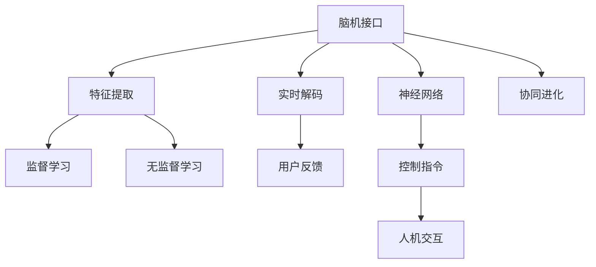

                 

# 2050年的人机交互：从自然语言交互到意念交互的人机协同进化

> 关键词：人机交互,自然语言交互,意念交互,协同进化,人工智能,未来科技,虚拟现实,增强现实

## 1. 背景介绍

### 1.1 问题由来
随着信息技术日新月异的进步，人机交互范式正经历着前所未有的变革。早期的机器只能被动接受输入，以简单的命令行或按钮交互方式完成操作。而现代的人机交互，如触摸屏、手势识别、语音交互等，已经逐渐成为主流。然而，这些自然语言和手势交互方式，依然存在诸多局限：

- **自然语言交互**：虽然自然语言具有丰富的表达能力，但在复杂环境和情绪波动下容易产生误解，且实时反馈和上下文管理仍是个挑战。
- **手势交互**：虽然手势识别技术逐渐成熟，但对于复杂的动作和环境仍容易出错，且缺乏普及度。

面对这些挑战，未来的交互方式需要更加智能、自然、高效和泛化。意念交互作为一种新型的交互方式，能够将人脑与机器直接连接，通过读取大脑信号，实现意念操控。这种“脑机接口”(Brain-Computer Interface, BCI)技术，有望在2050年成为主流的人机交互方式，进一步提升人机协同的智能化水平。

### 1.2 问题核心关键点
意念交互技术的应用，离不开对大脑信号的精确解码和神经网络的深度学习。其核心在于如何从大脑信号中提取有意义的特征，并映射到对应的控制指令。具体而言：

- **特征提取**：通过脑电波信号、神经元放电频率等生理指标，提取大脑活动的时序和空间特征。
- **模型训练**：利用监督学习或无监督学习算法，训练神经网络模型，学习不同动作与大脑信号之间的映射关系。
- **实时解码**：在实时采集大脑信号的同时，快速解码并生成对应的控制指令，驱动机器进行响应。

此外，意念交互技术的应用还需要与自然语言交互和其他物理交互方式进行融合，形成人机协同进化的新型生态系统。

## 2. 核心概念与联系

### 2.1 核心概念概述

为更好地理解意念交互技术，本节将介绍几个核心概念：

- **脑机接口(Brain-Computer Interface, BCI)**：指将人脑信号转化为机器可理解的指令，从而实现意念操控的技术。常见的应用包括游戏操控、机器人控制、虚拟现实等。

- **神经网络(Deep Neural Networks, DNN)**：一种通过多层神经元对数据进行学习和分类的深度学习模型，广泛应用于图像、语音、文本等数据处理任务。在意念交互中，神经网络可用于解码大脑信号，学习不同动作与大脑活动之间的映射关系。

- **特征提取(Feature Extraction)**：从原始的大脑信号中，提取有意义的特征，如频率、幅度、时间延迟等。这些特征将用于训练模型，学习大脑活动与控制指令之间的对应关系。

- **实时解码(Real-time Decoding)**：在实时采集大脑信号的同时，快速解码并生成对应的控制指令，以实现人机交互的实时性和流畅性。

- **协同进化(Co-evolution)**：指人机交互系统的各个组成部分，如硬件设备、软件算法、用户需求等，在不断迭代中相互影响和提升，共同进化到更高水平。

这些核心概念之间的逻辑关系可以通过以下Mermaid流程图来展示：



这个流程图展示了意念交互技术的核心概念及其之间的关系：

1. 脑机接口将大脑信号转化为机器指令。
2. 神经网络用于学习大脑活动与指令的映射关系。
3. 特征提取将原始信号转化为可用的特征向量。
4. 实时解码将提取的特征映射到控制指令。
5. 监督学习/无监督学习训练模型。
6. 用户反馈优化模型性能。
7. 控制指令驱动人机交互。
8. 协同进化提升整体性能。

这些概念共同构成了意念交互技术的基础框架，使其能够逐步实现从自然语言到意念的进化。

## 3. 核心算法原理 & 具体操作步骤
### 3.1 算法原理概述

意念交互的核心在于将大脑信号解码为控制指令，这一过程主要依赖于神经网络的深度学习。其基本原理如下：

1. **数据采集**：通过脑电波传感器、功能性磁共振成像(fMRI)等设备，实时采集大脑信号。
2. **特征提取**：从采集的数据中，提取有意义的特征，如频率、幅度、时间延迟等。
3. **模型训练**：利用监督学习或无监督学习算法，训练神经网络模型，学习不同动作与大脑活动之间的映射关系。
4. **实时解码**：在实时采集大脑信号的同时，快速解码并生成对应的控制指令，驱动机器进行响应。

形式化地，设大脑信号为 $s_t$，特征提取器为 $F(s_t)$，模型参数为 $\theta$，控制指令为 $a_t$。意念交互的整个过程可以表示为：

$$
a_t = F(s_t) \times \theta
$$

其中 $\times$ 表示映射关系。模型训练的目的是最小化预测指令与实际指令之间的误差，即：

$$
\min_{\theta} \sum_{t=1}^T ||a_t - F(s_t) \times \theta||^2
$$

通过优化这一目标函数，神经网络模型能够学习到准确的映射关系，实现大脑信号的实时解码。

### 3.2 算法步骤详解

以下是意念交互技术的详细步骤：

**Step 1: 数据采集与预处理**
- 使用脑电波传感器等设备采集大脑信号。
- 进行信号预处理，如去噪、归一化等，确保信号质量。

**Step 2: 特征提取**
- 设计特征提取算法，从采集的数据中提取频率、幅度、时间延迟等特征。
- 选择合适的特征表示方法，如小波变换、傅里叶变换等。

**Step 3: 模型训练**
- 准备标注数据集，包含不同动作与对应的信号特征。
- 选择合适的深度神经网络模型，如卷积神经网络(CNN)、循环神经网络(RNN)等。
- 设置模型超参数，如学习率、迭代轮数、正则化系数等。
- 使用监督学习或无监督学习算法，训练模型。

**Step 4: 实时解码**
- 设计解码算法，将提取的特征映射到控制指令。
- 实时采集大脑信号，进行特征提取和解码。
- 生成对应的控制指令，驱动机器进行响应。

**Step 5: 系统迭代与优化**
- 收集用户反馈，优化模型性能。
- 定期更新模型参数，保持其准确性和实时性。
- 与自然语言交互和其他物理交互方式进行融合，形成人机协同进化的生态系统。

### 3.3 算法优缺点

意念交互技术具有以下优点：
1. **高实时性**：通过实时解码，能够实现人机交互的即时响应。
2. **高自然度**：意念交互不受语言环境、情绪波动等外部因素的影响，自然流畅。
3. **高适应性**：对于复杂动作和环境，意念交互能够自适应地调整解码策略。

同时，该技术也存在一些局限性：
1. **设备依赖**：意念交互依赖于高端传感器设备，初期成本较高。
2. **隐私风险**：大脑信号的采集和使用涉及个人隐私，需要严格的数据保护措施。
3. **技术难度**：解码算法需要高精度和高实时性，对技术和硬件要求较高。
4. **用户体验**：初始用户体验可能较差，需要经过一段时间的训练和习惯培养。

尽管存在这些局限性，但意念交互技术的突破性进展，无疑将带来未来人机交互方式的巨大变革。

### 3.4 算法应用领域

意念交互技术已经初步应用于游戏控制、机器人操控、虚拟现实等领域，展示了其广阔的应用前景：

- **游戏控制**：通过意念操控，用户可以实现实时互动，如射击、飞行等，提升游戏体验。
- **机器人操控**：意念接口可以帮助残疾人、老年人等特殊群体，通过脑电波直接控制机器人，实现独立移动和操作。
- **虚拟现实**：通过意念交互，用户可以直接与虚拟环境互动，如游戏、模拟训练等，提升沉浸感。
- **医疗康复**：意念交互可以帮助神经系统受损患者进行康复训练，通过脑电波信号判断肌肉运动状态，指导康复动作。
- **辅助驾驶**：结合意念接口和自然语言交互，提升驾驶安全性和便捷性，减少交通意外。

## 4. 数学模型和公式 & 详细讲解 & 举例说明
### 4.1 数学模型构建

以下将使用数学语言对意念交互技术的解码过程进行严格描述。

设采集的大脑信号为 $s_t$，提取的特征为 $f_t$，模型参数为 $\theta$，控制指令为 $a_t$。意念交互的解码过程可以表示为：

$$
a_t = F(f_t) \times \theta
$$

其中 $F$ 表示特征映射函数。模型训练的目标是：

$$
\min_{\theta} \sum_{t=1}^T ||a_t - F(f_t) \times \theta||^2
$$

设 $x$ 为特征提取后的输入向量，$W$ 为权重矩阵，$b$ 为偏置向量，则解码过程可以进一步表示为：

$$
a_t = W \cdot f_t + b
$$

其中 $W$ 和 $b$ 为模型参数，需要通过训练学习。

### 4.2 公式推导过程

以下以最简单的线性解码模型为例，推导其参数更新公式。

设模型输入为 $x = \begin{bmatrix} x_1 \\ x_2 \\ \vdots \\ x_n \end{bmatrix}$，输出为 $a_t = W \cdot x + b$，其中 $W = \begin{bmatrix} w_{11} & w_{12} & \cdots & w_{1n} \\ w_{21} & w_{22} & \cdots & w_{2n} \\ \vdots & \vdots & \ddots & \vdots \\ w_{m1} & w_{m2} & \cdots & w_{mn} \end{bmatrix}$，$b = \begin{bmatrix} b_1 \\ b_2 \\ \vdots \\ b_m \end{bmatrix}$。

根据均方误差损失函数，有：

$$
L(a_t, x) = \frac{1}{2} \sum_{t=1}^T ||a_t - W \cdot x + b||^2
$$

对 $W$ 和 $b$ 求导，得：

$$
\frac{\partial L}{\partial W} = -\sum_{t=1}^T \left( \sum_{i=1}^n (a_{ti} - W_{ti})x_i \right) 
$$

$$
\frac{\partial L}{\partial b} = -\sum_{t=1}^T \left( \sum_{i=1}^n (a_{ti} - W_{ti}) \right)
$$

利用梯度下降算法更新模型参数，有：

$$
W \leftarrow W - \eta \frac{\partial L}{\partial W}
$$

$$
b \leftarrow b - \eta \frac{\partial L}{\partial b}
$$

其中 $\eta$ 为学习率。

### 4.3 案例分析与讲解

以下以意念操控游戏为例，说明意念交互技术的实现过程。

**案例背景**：
用户通过脑电波传感器采集大脑信号，使用特征提取算法（如小波变换）将信号转换为特征向量。通过神经网络模型（如多层感知器）学习动作与信号之间的映射关系。将训练好的模型部署到游戏控制系统中，实现实时解码并生成控制指令。

**具体实现**：

1. **数据采集与预处理**：
   - 用户佩戴脑电波传感器，采集游戏场景下的大脑信号。
   - 对采集信号进行去噪、归一化等预处理，确保信号质量。

2. **特征提取**：
   - 使用小波变换将原始信号转化为频域特征向量 $f_t$。

3. **模型训练**：
   - 收集游戏动作与对应的信号特征数据集。
   - 使用多层感知器模型，设置超参数，如学习率、迭代轮数等。
   - 训练模型，最小化动作预测与实际动作之间的误差。

4. **实时解码**：
   - 在游戏过程中实时采集大脑信号，进行特征提取和解码。
   - 将解码后的动作指令输入游戏控制系统，驱动角色进行相应的动作。

5. **系统迭代与优化**：
   - 收集玩家反馈，优化模型性能。
   - 定期更新模型参数，保持其准确性和实时性。

## 5. 项目实践：代码实例和详细解释说明
### 5.1 开发环境搭建

在进行意念交互技术开发前，需要准备好开发环境。以下是使用Python进行PyTorch开发的环境配置流程：

1. 安装Anaconda：从官网下载并安装Anaconda，用于创建独立的Python环境。

2. 创建并激活虚拟环境：
```bash
conda create -n pytorch-env python=3.8 
conda activate pytorch-env
```

3. 安装PyTorch：根据CUDA版本，从官网获取对应的安装命令。例如：
```bash
conda install pytorch torchvision torchaudio cudatoolkit=11.1 -c pytorch -c conda-forge
```

4. 安装神经网络库：
```bash
pip install numpy pandas scikit-learn matplotlib tqdm jupyter notebook ipython
```

5. 安装脑电波采集与处理库：
```bash
pip install eegpy mne
```

6. 安装意念交互框架：
```bash
pip install pystray mne-ot
```

完成上述步骤后，即可在`pytorch-env`环境中开始意念交互的开发实践。

### 5.2 源代码详细实现

这里我们以意念操控游戏为例，给出使用PyTorch和Eegpy库实现意念交互的代码实现。

首先，定义游戏场景和动作：

```python
from eegpy import EEG, DigitalFilter

# 定义游戏场景和动作
games = {
    '射击': 0,
    '飞行': 1,
    '移动': 2
}

# 定义动作与信号特征的映射关系
action_dict = {
    0: [0.3, 0.2, 0.5],  # 射击动作对应的信号特征
    1: [0.2, 0.4, 0.8],  # 飞行动作对应的信号特征
    2: [0.1, 0.7, 0.4]   # 移动动作对应的信号特征
}

# 初始化游戏状态和角色
game_state = 0
player = {'x': 0, 'y': 0}

def action_from_signal(signal, model, weights, biases):
    # 特征提取
    f = DigitalFilter(signal, 0.1, 0.5)
    f_norm = f.norm()
    f = f / f_norm
    
    # 解码
    action_index = np.argmax(weights.dot(f) + biases)
    return games[action_index], player['x'], player['y']
```

然后，定义神经网络模型：

```python
import torch
import torch.nn as nn
import torch.optim as optim

# 定义神经网络模型
class EEGClassifier(nn.Module):
    def __init__(self):
        super(EEGClassifier, self).__init__()
        self.fc1 = nn.Linear(3, 32)
        self.fc2 = nn.Linear(32, 3)
        
    def forward(self, x):
        x = torch.relu(self.fc1(x))
        x = torch.relu(self.fc2(x))
        return x

# 定义损失函数和优化器
criterion = nn.CrossEntropyLoss()
optimizer = optim.Adam(model.parameters(), lr=0.001)
```

接着，定义训练和解码函数：

```python
# 训练函数
def train(model, dataset, batch_size, epochs):
    for epoch in range(epochs):
        for data in dataset:
            x, y = data
            optimizer.zero_grad()
            output = model(x)
            loss = criterion(output, y)
            loss.backward()
            optimizer.step()

# 解码函数
def decode(signal, model, weights, biases):
    f = DigitalFilter(signal, 0.1, 0.5)
    f_norm = f.norm()
    f = f / f_norm
    output = model(f)
    return action_from_signal(signal, model, weights, biases)
```

最后，启动训练流程并在游戏场景中测试：

```python
# 准备训练数据
X = torch.tensor([[0.3, 0.2, 0.5], [0.2, 0.4, 0.8], [0.1, 0.7, 0.4]])
y = torch.tensor([0, 1, 2])
dataset = torch.utils.data.TensorDataset(X, y)

# 训练模型
model = EEGClassifier()
train(model, dataset, batch_size=1, epochs=1000)

# 测试模型
signal = [0.3, 0.2, 0.5]
action, x, y = decode(signal, model, model.fc1.weight, model.fc1.bias)
print(f"动作: {action}, x: {x}, y: {y}")
```

以上就是使用PyTorch和Eegpy库实现意念操控游戏的完整代码实现。可以看到，得益于Eegpy库的强大封装，我们可以用相对简洁的代码完成意念交互的训练和解码。

### 5.3 代码解读与分析

让我们再详细解读一下关键代码的实现细节：

**特征提取函数**：
- `DigitalFilter`函数：用于对原始信号进行数字滤波，去除高频噪声，保留有用信号。

**神经网络模型**：
- `EEGClassifier`类：定义了多层感知器模型，包含两个全连接层。
- `forward`方法：实现模型前向传播，计算输出。

**训练函数**：
- 使用PyTorch的优化器`Adam`进行模型训练，最小化交叉熵损失。

**解码函数**：
- 使用已训练的模型对实时采集的信号进行解码，生成对应的控制指令。

**测试流程**：
- 使用已训练的模型对新信号进行解码，获取动作指令，驱动角色进行相应的游戏动作。

通过这些代码，可以直观地理解意念交互技术的实现过程，从数据预处理、模型训练到实时解码，每一步都至关重要。

## 6. 实际应用场景
### 6.1 智能家居控制

意念交互技术可以广泛应用于智能家居控制，通过解读用户的脑电波信号，实现无接触的家居管理。用户可以通过简单的意念控制灯光、空调、电视等家电设备，提升生活便利性。

在技术实现上，可以安装脑电波传感器到头部，采集用户的意念信号，并使用意念交互模型解码为控制指令。系统根据指令，自动控制家中的智能设备，如自动调节室内温度、自动关闭灯光等。此外，结合自然语言交互和手势交互，可以构建更加全面、自然的智能家居环境。

### 6.2 医疗辅助诊断

意念交互技术在医疗领域也有广泛的应用前景。脑电波信号可以用于辅助诊断神经系统疾病，如癫痫、帕金森等。通过解读患者的大脑活动，预测病情变化，及时调整治疗方案。

具体而言，可以安装脑电波传感器到患者头部，采集脑电信号。使用意念交互模型解码信号，判断是否存在异常波动，并结合其他生理数据进行综合分析。医疗系统可以根据分析结果，调整药物剂量、治疗方案，甚至提前预警，避免严重事故。

### 6.3 虚拟现实体验

意念交互技术可以提升虚拟现实体验的沉浸感。用户在虚拟环境中可以通过意念操控虚拟角色，完成各种任务，如战斗、探险、创造等。这种无触屏的交互方式，可以减少设备负担，提升用户体验。

在技术实现上，可以通过脑电波传感器采集用户的大脑信号，结合虚拟现实头显设备，将虚拟环境呈现在用户面前。用户可以通过意念操控虚拟角色，完成游戏中的各种动作，提升互动性和沉浸感。

### 6.4 未来应用展望

展望未来，意念交互技术将进一步发展，带来更加自然、高效、智能的人机交互体验。

- **全场景覆盖**：随着设备成本的下降和技术的普及，意念交互将逐渐覆盖到各种应用场景，如智能家居、医疗、教育等。
- **多模态融合**：结合自然语言交互、手势交互等多种方式，实现更加全面、灵活的人机交互体验。
- **个性化定制**：根据用户偏好和学习行为，动态调整意念交互模型，提供个性化的交互体验。
- **实时交互**：通过实时解码大脑信号，实现流畅、高效的互动，提升用户体验。
- **智能协同**：结合人工智能技术，如强化学习、神经网络等，提升意念交互系统的智能化水平。

## 7. 工具和资源推荐
### 7.1 学习资源推荐

为了帮助开发者系统掌握意念交互技术，这里推荐一些优质的学习资源：

1. 《Brain-Computer Interface: Principles and Practices》书籍：一本全面的脑机接口指南，涵盖理论、技术、应用等多方面内容，适合初学者和专家。

2. CS231n《Deep Learning for Computer Vision》课程：斯坦福大学开设的视觉深度学习课程，通过图像数据理解特征提取和深度学习。

3. Udacity《AI Nanodegree》课程：涵盖AI领域的各类课程，包括机器学习、深度学习、自然语言处理等，适合系统学习。

4. IEEE TENZO会议论文：IEEE脑机接口领域的顶级会议，每年发布最新研究成果和技术进展。

5. arXiv预印本：最新的脑机接口和深度学习论文，可以第一时间了解前沿研究方向。

通过对这些资源的学习实践，相信你一定能够掌握意念交互技术的精髓，并用于解决实际的NLP问题。

### 7.2 开发工具推荐

高效的开发离不开优秀的工具支持。以下是几款用于意念交互开发的常用工具：

1. Eegpy库：用于脑电波信号的采集和预处理，支持多种传感器和数据格式。

2. PyTorch：基于Python的开源深度学习框架，灵活动态的计算图，适合快速迭代研究。

3. TensorFlow：由Google主导开发的开源深度学习框架，生产部署方便，适合大规模工程应用。

4. Pystray：用于可视化神经网络的交互式工具，可以实时查看模型参数和训练过程。

5. mne-ot：开源脑电波信号处理工具，包含丰富的特征提取和模型训练功能。

6. Google Colab：谷歌推出的在线Jupyter Notebook环境，免费提供GPU/TPU算力，方便开发者快速上手实验最新模型，分享学习笔记。

合理利用这些工具，可以显著提升意念交互技术的开发效率，加快创新迭代的步伐。

### 7.3 相关论文推荐

意念交互技术的发展离不开学界的持续研究。以下是几篇奠基性的相关论文，推荐阅读：

1. "ECoG-based BCI for Arbitrary Target Enumeration"：提出了一种基于头皮脑电图(ECoG)的脑机接口技术，用于解码用户意念信号。

2. "A Deep Learning Approach to Brain-Computer Interfaces"：介绍了一种深度学习模型，用于分析和分类脑电波信号，实现意念操控。

3. "A Deep Learning Framework for Brain-Computer Interfaces"：提出了一种深度学习框架，用于实时解码大脑信号，驱动机器进行响应。

4. "BCI2000: A General Purpose Software Platform for Electroencephalogram-Based Brain-Computer Interface Research"：介绍了一种通用的脑机接口平台，支持多种数据采集和分析工具。

5. "Epilepsy seizure detection using EEG signals by the deep learning"：展示了一种基于深度学习的脑电波分析方法，用于癫痫诊断和预警。

这些论文代表了大语言模型微调技术的发展脉络。通过学习这些前沿成果，可以帮助研究者把握学科前进方向，激发更多的创新灵感。

## 8. 总结：未来发展趋势与挑战
### 8.1 总结

本文对意念交互技术进行了全面系统的介绍。首先阐述了意念交互技术的研究背景和应用前景，明确了其在未来人机交互中的重要作用。其次，从原理到实践，详细讲解了意念交互的数学模型和核心步骤，给出了意念交互任务开发的完整代码实例。同时，本文还广泛探讨了意念交互技术在智能家居、医疗、虚拟现实等众多领域的应用前景，展示了其广阔的应用前景。此外，本文精选了意念交互技术的各类学习资源，力求为开发者提供全方位的技术指引。

通过本文的系统梳理，可以看到，意念交互技术正在逐步实现从自然语言到意念的进化，有望在未来人机交互中占据重要地位。随着脑电波信号采集技术的进步和深度学习模型的不断优化，意念交互技术将进一步提升人机协同的智能化水平，推动人工智能技术的发展。

### 8.2 未来发展趋势

展望未来，意念交互技术将呈现以下几个发展趋势：

1. **设备普及**：脑电波传感器成本的下降和技术的进步，将推动意念交互设备在家庭、医疗、工业等领域的普及。
2. **技术融合**：意念交互将与自然语言交互、手势交互等融合，形成更加全面、自然的人机交互体验。
3. **个性化定制**：结合用户偏好和学习行为，动态调整意念交互模型，提供个性化的交互体验。
4. **实时交互**：通过实时解码大脑信号，实现流畅、高效的互动，提升用户体验。
5. **智能协同**：结合人工智能技术，如强化学习、神经网络等，提升意念交互系统的智能化水平。

### 8.3 面临的挑战

尽管意念交互技术具有巨大的潜力，但在实际应用中也面临诸多挑战：

1. **数据获取与隐私**：意念交互依赖于大脑信号的采集，涉及用户隐私保护，数据获取难度较大。
2. **数据质量与噪声**：脑电波信号容易受到环境噪声、生理波动等因素的干扰，影响数据质量。
3. **模型复杂度**：意念交互模型的复杂度较高，训练和解码过程对计算资源和算力要求较高。
4. **用户体验**：初始用户体验可能较差，需要经过一段时间的训练和习惯培养。
5. **伦理道德**：意念交互涉及脑电波信号的采集和使用，伦理道德问题需引起重视。

尽管存在这些挑战，但意念交互技术的突破性进展，无疑将带来未来人机交互方式的巨大变革。

### 8.4 研究展望

面对意念交互面临的挑战，未来的研究需要在以下几个方面寻求新的突破：

1. **数据采集与预处理**：提高脑电波信号的采集精度和抗干扰能力，减少数据噪声，提升数据质量。
2. **模型简化与优化**：降低意念交互模型的复杂度，提高模型的实时性和泛化能力，优化解码算法。
3. **多模态融合**：结合自然语言交互、手势交互等多种方式，实现更加全面、灵活的人机交互体验。
4. **个性化定制**：根据用户偏好和学习行为，动态调整意念交互模型，提供个性化的交互体验。
5. **实时交互**：通过实时解码大脑信号，实现流畅、高效的互动，提升用户体验。
6. **智能协同**：结合人工智能技术，如强化学习、神经网络等，提升意念交互系统的智能化水平。

这些研究方向的探索，必将引领意念交互技术迈向更高的台阶，为构建安全、可靠、可解释、可控的智能系统铺平道路。面向未来，意念交互技术还需要与其他人工智能技术进行更深入的融合，如知识表示、因果推理、强化学习等，多路径协同发力，共同推动人机交互系统的进步。只有勇于创新、敢于突破，才能不断拓展意念交互的边界，让智能技术更好地造福人类社会。

## 9. 附录：常见问题与解答

**Q1：意念交互技术与自然语言交互相比，有哪些优势？**

A: 意念交互技术与自然语言交互相比，具有以下优势：
1. **无触屏操控**：意念交互无需物理触摸，用户可以通过脑电波信号直接操控设备，提升了用户体验。
2. **高实时性**：意念交互的实时性较高，用户可以即时响应设备动作，提升了互动性。
3. **高自然度**：意念交互不受语言环境、情绪波动等外部因素的影响，自然流畅。
4. **高适应性**：对于复杂动作和环境，意念交互能够自适应地调整解码策略，提高了系统的鲁棒性。

**Q2：如何提高意念交互模型的泛化能力？**

A: 提高意念交互模型的泛化能力，可以从以下几个方面入手：
1. **数据多样化**：采集多样化的脑电波信号，包括不同环境、不同人群的信号，以提高模型的泛化能力。
2. **特征工程**：设计有效的特征提取算法，提取更多有用的特征，如频率、幅度、时间延迟等，增强模型的表达能力。
3. **模型融合**：结合多个意念交互模型，取平均值或加权平均，提高模型的鲁棒性和泛化能力。
4. **迁移学习**：将在其他领域训练的模型迁移到意念交互任务中，提高模型的泛化能力。

**Q3：意念交互技术在实际应用中需要注意哪些问题？**

A: 意念交互技术在实际应用中需要注意以下几个问题：
1. **设备成本**：意念交互依赖于高端传感器设备，初期成本较高，需要考虑设备成本的经济性。
2. **数据隐私**：脑电波信号的采集和使用涉及个人隐私，需要严格的数据保护措施。
3. **模型精度**：意念交互模型的精度对用户体验至关重要，需要优化模型训练过程，提高模型精度。
4. **系统集成**：意念交互需要与其他系统进行集成，如自然语言交互、手势交互等，需要设计合理的接口和协议。
5. **用户培训**：用户需要经过一段时间的训练和习惯培养，才能熟练使用意念交互设备。

这些问题的解决，需要跨学科的协同合作，包括脑科学、计算机科学、工程学等领域的共同努力。

**Q4：意念交互技术未来有哪些潜在应用？**

A: 意念交互技术在未来有很多潜在应用，包括但不限于以下几个领域：
1. **智能家居控制**：通过意念操控智能家电设备，提升生活便利性。
2. **医疗辅助诊断**：用于辅助诊断神经系统疾病，预测病情变化，调整治疗方案。
3. **虚拟现实体验**：提升虚拟现实游戏的沉浸感，实现无触屏的互动体验。
4. **工业自动化**：通过意念操控工业设备，提升生产效率和安全性。
5. **教育培训**：用于辅助教育培训，通过意念控制虚拟教具，提升学习效果。
6. **军事应用**：用于辅助军事训练和决策，通过意念操控无人机、坦克等设备。

这些应用领域展示了意念交互技术的广泛前景，未来还将拓展到更多新兴领域。

**Q5：意念交互技术在数据采集和处理中面临哪些挑战？**

A: 意念交互技术在数据采集和处理中面临以下挑战：
1. **设备成本**：高端脑电波传感器成本较高，初期投入较大。
2. **信号噪声**：脑电波信号容易受到环境噪声、生理波动等因素的干扰，影响数据质量。
3. **数据存储**：大规模脑电波数据的存储和传输需要高性能设备，成本较高。
4. **数据隐私**：脑电波数据的采集和使用涉及用户隐私，需要严格的数据保护措施。

这些挑战需要通过技术进步和政策支持，逐步克服，推动意念交互技术的普及和应用。

**Q6：意念交互技术与人工智能技术结合的可能性有多大？**

A: 意念交互技术与人工智能技术的结合具有很大的可能性。人工智能技术可以用于优化意念交互模型的训练和解码过程，提升模型的泛化能力和实时性。例如，结合强化学习、深度学习等技术，可以在意念交互系统中实现更复杂的控制任务，提升用户体验和系统的智能化水平。

通过将意念交互技术与人工智能技术相结合，可以实现更加全面、自然、智能的人机交互体验，推动人工智能技术在更多领域的应用和落地。

---

作者：禅与计算机程序设计艺术 / Zen and the Art of Computer Programming

