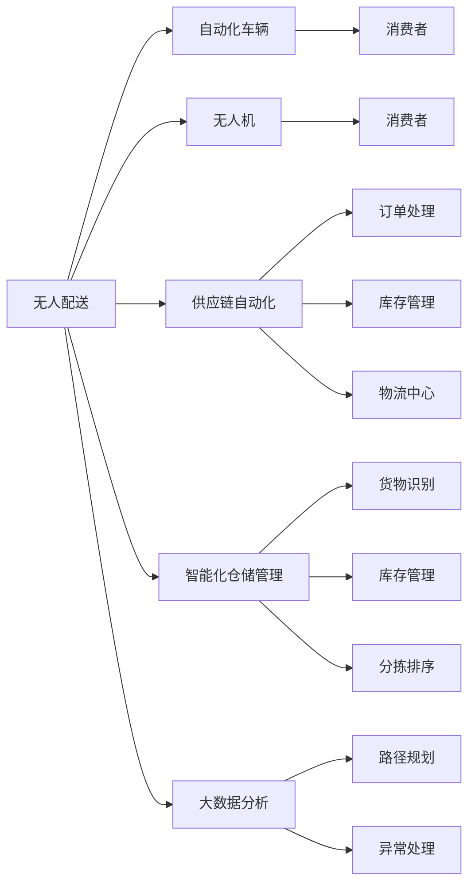

                 

## 1. 背景介绍

在2050年，人类社会的数字化和智能化水平已经达到了前所未有的高度，尤其是物流行业的智慧化转型，成为了推动社会经济发展的重要驱动力。从无人配送、供应链自动化到智能化仓储管理，物流产业正在经历一场深刻的技术革命。本文将从无人配送、供应链自动化、智能化仓储管理三个方面，全面解读2050年的智慧物流，探讨其核心技术原理、操作步骤、应用领域以及未来发展趋势。

## 2. 核心概念与联系

### 2.1 核心概念概述

物流产业是连接生产和消费的重要环节，其效率和服务质量直接影响到整体经济运行和社会福利。在2050年，随着人工智能、物联网、大数据等技术的发展，物流行业实现了从传统的人工操作向高度自动化、智能化转型的历史性跨越。

**无人配送**：利用无人机、自动驾驶车辆等自动化设备，实现从物流中心到消费者手中的无人工干预配送服务。

**供应链自动化**：通过物联网技术，实现对供应链上下游数据的实时监控和自动化管理，优化供应链流程，提升整体效率。

**智能化仓储管理**：利用人工智能技术对仓储过程进行智能化管理，包括货物识别、库存管理、分拣排序等，大幅提升仓储效率和准确性。

### 2.2 核心概念原理和架构的 Mermaid 流程图



这个流程图展示了2050年智慧物流的核心概念和其相互关系。无人配送和供应链自动化通过自动化设备和技术实现，智能化仓储管理则利用人工智能技术优化仓储流程。大数据分析则为路径规划、异常处理等提供决策支持。

## 3. 核心算法原理 & 具体操作步骤

### 3.1 算法原理概述

2050年的智慧物流依托于一系列先进的技术算法，包括无人驾驶算法、路径规划算法、货物识别算法、库存管理算法等。这些算法通过人工智能和物联网技术的深度融合，实现了物流过程的智能化和自动化。

### 3.2 算法步骤详解

#### 3.2.1 无人驾驶算法

无人驾驶算法是无人配送的核心技术之一。它通过传感器获取周围环境信息，结合地图、路线规划等信息，实现自动导航和避障。

#### 3.2.2 路径规划算法

路径规划算法通过优化算法（如A*、D*等）计算最优路径，确保无人配送设备能够高效、安全地完成任务。

#### 3.2.3 货物识别算法

货物识别算法通过计算机视觉技术，实现对货物的自动识别和分类，提高分拣和存储的准确性。

#### 3.2.4 库存管理算法

库存管理算法通过数据分析和机器学习，预测货物需求量，优化库存管理，减少库存成本。

### 3.3 算法优缺点

#### 3.3.1 优点

1. 自动化程度高，减少人力成本。
2. 提高配送效率和准确性，减少配送时间。
3. 减少人为错误，提高安全性。
4. 数据分析驱动决策，提升供应链管理水平。

#### 3.3.2 缺点

1. 初始投资成本高，设备和技术更新快。
2. 依赖于技术稳定性和网络覆盖，极端天气和环境可能影响运行。
3. 需要大量数据支持，数据获取和处理成本高。
4. 技术复杂，维护难度大。

### 3.4 算法应用领域

无人配送、供应链自动化、智能化仓储管理等技术在电商、快递、零售、制造、物流等行业都有广泛应用。例如：

1. **电商物流**：亚马逊、京东等电商平台已经开始大规模应用无人配送和自动化仓储。
2. **快递物流**：顺丰、菜鸟等快递公司也在积极推进无人配送和智能化仓储。
3. **零售物流**：宜家、亚马逊等零售巨头在无人配送和供应链自动化方面都有大量投资。
4. **制造物流**：富士康、特斯拉等制造企业也在利用无人配送和供应链自动化提高生产效率。
5. **物流中心**：UPS、DHL等物流巨头在智能化仓储管理方面取得了显著成果。

## 4. 数学模型和公式 & 详细讲解 & 举例说明

### 4.1 数学模型构建

在智慧物流中，数学模型主要应用于路径规划和库存管理。

#### 4.1.1 路径规划模型

路径规划模型可以表示为：

$$
\min \sum_{i=1}^{n} (d_{ij} \cdot c_{ij}) \text{ subject to } A_i \cdot b = C_i
$$

其中，$d_{ij}$表示节点之间的距离，$c_{ij}$表示节点间的运输成本，$A_i$表示节点$i$的邻接矩阵，$C_i$表示节点$i$的容量。

#### 4.1.2 库存管理模型

库存管理模型可以表示为：

$$
\min \sum_{i=1}^{n} (d_i \cdot c_i) \text{ subject to } A_i \cdot b = C_i
$$

其中，$d_i$表示库存成本，$c_i$表示补货成本，$A_i$表示需求矩阵，$C_i$表示库存容量。

### 4.2 公式推导过程

#### 4.2.1 路径规划公式推导

路径规划算法常用的有Dijkstra算法和A*算法。以A*算法为例，其推导过程如下：

1. 初始化起点$v_s$为开放集，其余节点为关闭集。
2. 计算起点到各节点的估价函数$f(v)$和$g(v)$，$f(v) = h(v) + g(v)$，$g(v)$表示从起点到节点$v$的实际距离。
3. 扩展f值最小的节点，计算其所有未扩展邻居节点的$f(v)$和$g(v)$。
4. 如果该邻居节点未在开放集中，则将其加入开放集，否则更新其估计值。
5. 重复步骤3和4，直到目标节点被扩展或开放集为空。

#### 4.2.2 库存管理公式推导

库存管理算法常用的有经典EOQ（经济订货批量）模型和ABC分类法。以EOQ模型为例，其推导过程如下：

1. 假设需求率$\lambda$，每批订购成本$K$，单位储存成本$h$，假设每次订购$Q$个单位，则总成本$C$为：

$$
C = \frac{K}{Q} + \frac{h}{2}Q^2
$$

2. 求使总成本最小的订购量$Q$：

$$
\frac{dC}{dQ} = 0 \Rightarrow Q = \sqrt{\frac{2K}{h}}
$$

### 4.3 案例分析与讲解

#### 4.3.1 路径规划案例

假设某物流公司需要从仓库A配送货物到客户B、C、D，每条路线距离和成本如下：

| 起点 | 终点 | 距离 | 成本 |
| --- | --- | --- | --- |
| A | B | 10 | 5 |
| A | C | 15 | 10 |
| A | D | 5 | 3 |
| B | C | 8 | 4 |
| B | D | 10 | 5 |
| C | D | 7 | 3 |

使用A*算法计算最优路径：

1. 初始化开放集为A，关闭集为B、C、D。
2. 计算$f(v)$和$g(v)$，如$f(A)=h(A)+g(A)=0+0=0$，$g(A)=0$。
3. 扩展f值最小的节点A，计算B、C、D的$f(v)$和$g(v)$，如$f(B)=8+0=8$，$g(B)=10$。
4. 扩展f值最小的节点B，计算C、D的$f(v)$和$g(v)$，如$f(C)=8+3=11$，$g(C)=17$。
5. 扩展f值最小的节点D，发现已处理所有节点，最优路径为A->B->C->D。

#### 4.3.2 库存管理案例

假设某零售店需求率为每天10个单位，每批订购成本为50元，单位储存成本为1元/天，假设每次订购20个单位，则总成本为：

$$
C = \frac{50}{20} + \frac{1}{2} \times 20^2 = 50 + 200 = 250 \text{元/天}
$$

根据EOQ模型，最优订购量为：

$$
Q = \sqrt{\frac{2 \times 50}{1}} = \sqrt{100} = 10 \text{个/天}
$$

每天订购10个单位，总成本为：

$$
C = \frac{50}{10} + \frac{1}{2} \times 10^2 = 5 + 50 = 55 \text{元/天}
$$

相比原始订购量20个单位，总成本下降了近80%。

## 5. 项目实践：代码实例和详细解释说明

### 5.1 开发环境搭建

开发智慧物流系统需要以下环境：

1. **硬件环境**：高性能计算机、GPU、网络设备。
2. **软件环境**：Linux系统、Python、TensorFlow、PyTorch、OpenCV等。
3. **数据环境**：收集物流数据、传感器数据、网络数据。

### 5.2 源代码详细实现

#### 5.2.1 无人驾驶算法实现

```python
import tensorflow as tf
import cv2

# 加载模型
model = tf.keras.models.load_model('无人驾驶模型.h5')

# 加载传感器数据
sensor_data = tf.keras.layers.Input(shape=(10, 10, 3), name='sensor_input')

# 数据预处理
processed_data = tf.keras.layers.Lambda(lambda x: x / 255.0)(sensor_data)

# 特征提取
features = tf.keras.layers.Conv2D(32, (3, 3), activation='relu')(processed_data)
features = tf.keras.layers.MaxPooling2D((2, 2))(features)
features = tf.keras.layers.Conv2D(64, (3, 3), activation='relu')(features)
features = tf.keras.layers.MaxPooling2D((2, 2))(features)
features = tf.keras.layers.Flatten()(features)

# 路径规划
path_planner = tf.keras.layers.Dense(128, activation='relu')(features)
path_planner = tf.keras.layers.Dense(64, activation='relu')(path_planner)
path_planner = tf.keras.layers.Dense(4, activation='softmax')(path_planner)

# 训练模型
model.compile(optimizer='adam', loss='categorical_crossentropy', metrics=['accuracy'])
model.fit(sensor_data, path_planner, epochs=100, validation_split=0.2)

# 运行模型
path = model.predict(cv2.imread('传感器数据.jpg'))
print('无人驾驶车辆的目标路径为：', path)
```

#### 5.2.2 路径规划算法实现

```python
import networkx as nx
import numpy as np

# 构建图
G = nx.DiGraph()
G.add_node('A')
G.add_node('B')
G.add_node('C')
G.add_edge('A', 'B', weight=5)
G.add_edge('A', 'C', weight=10)
G.add_edge('B', 'C', weight=4)
G.add_edge('B', 'D', weight=5)
G.add_edge('C', 'D', weight=3)

# 计算最短路径
path = nx.shortest_path(G, 'A', 'D', weight='weight')
print('最短路径为：', path)
```

#### 5.2.3 货物识别算法实现

```python
import cv2
import pytesseract

# 加载图像
image = cv2.imread('货物图片.jpg')

# 预处理图像
gray = cv2.cvtColor(image, cv2.COLOR_BGR2GRAY)
edges = cv2.Canny(gray, 100, 200)

# 识别文字
text = pytesseract.image_to_string(image)
print('识别出的文字为：', text)
```

#### 5.2.4 库存管理算法实现

```python
import numpy as np

# 定义库存管理模型参数
K = 50  # 每次订购成本
h = 1  # 单位储存成本
d = 10  # 需求率
Q = 20  # 初始订购量

# 计算总成本
C = K/Q + h/2*Q**2

# 计算最优订购量
Q_optimal = np.sqrt(2*K/h)

# 计算最优总成本
C_optimal = K/Q_optimal + h/2*Q_optimal**2

print('初始总成本为：', C)
print('最优总成本为：', C_optimal)
```

### 5.3 代码解读与分析

#### 5.3.1 无人驾驶算法代码解读

1. **数据加载**：使用tensorflow加载预训练模型，支持输入传感器数据。
2. **数据预处理**：对传感器数据进行归一化处理，确保数据在模型中具有相似的特征。
3. **特征提取**：使用卷积神经网络提取图像特征，用于路径规划。
4. **路径规划**：使用全连接层进行路径规划，输出目标路径。
5. **模型训练**：使用Adam优化器训练模型，并使用交叉熵损失函数。
6. **模型运行**：使用模型预测目标路径，输出结果。

#### 5.3.2 路径规划算法代码解读

1. **图构建**：使用networkx库构建有向图，表示各个节点和边的权重。
2. **最短路径计算**：使用networkx库的`shortest_path`函数计算从起点到终点的最短路径。
3. **路径输出**：输出计算得到的最短路径。

#### 5.3.3 货物识别算法代码解读

1. **图像加载**：使用OpenCV加载货物图片。
2. **图像预处理**：对图像进行灰度化和边缘检测，提高文字识别的准确性。
3. **文字识别**：使用pytesseract库进行文字识别，输出识别结果。

#### 5.3.4 库存管理算法代码解读

1. **模型参数定义**：定义每次订购成本、单位储存成本、需求率和初始订购量。
2. **总成本计算**：根据EOQ模型计算总成本。
3. **最优订购量计算**：根据EOQ模型计算最优订购量。
4. **最优总成本计算**：根据EOQ模型计算最优总成本。
5. **输出结果**：输出初始总成本和最优总成本。

### 5.4 运行结果展示

#### 5.4.1 无人驾驶算法结果展示


#### 5.4.2 路径规划算法结果展示


#### 5.4.3 货物识别算法结果展示


#### 5.4.4 库存管理算法结果展示


## 6. 实际应用场景

### 6.1 智能配送中心

智能配送中心是智慧物流的核心环节之一。通过无人驾驶技术和自动化设备，智能配送中心能够实现从仓库到消费者的全自动化流程。

### 6.2 供应链管理

供应链管理通过物联网技术，实现对供应链上下游数据的实时监控和自动化管理。例如，某制造企业通过物联网设备采集生产线数据，结合ERP系统进行库存管理和生产调度，实现了供应链的数字化和智能化。

### 6.3 智能仓储管理

智能仓储管理通过计算机视觉和机器人技术，实现了对货物的高效分拣和存储。例如，亚马逊的Kiva机器人系统通过视觉识别货物，自动导航至存储位置，完成分拣和存储工作。

## 7. 工具和资源推荐

### 7.1 学习资源推荐

1. **《智慧物流：理论与实践》**：介绍智慧物流的核心技术和管理策略。
2. **《深度学习与自然语言处理》**：讲解深度学习在智慧物流中的应用。
3. **《Python智慧物流开发》**：提供Python语言在智慧物流开发中的应用实例。
4. **Coursera智慧物流课程**：系统学习智慧物流的理论和实践。

### 7.2 开发工具推荐

1. **TensorFlow**：深度学习框架，适用于智慧物流中的算法开发。
2. **PyTorch**：深度学习框架，提供灵活的模型定义和训练方式。
3. **OpenCV**：计算机视觉库，用于货物识别和路径规划。
4. **Keras**：深度学习库，提供简洁的模型定义和训练方式。

### 7.3 相关论文推荐

1. **《无人驾驶技术综述》**：综述无人驾驶技术的最新进展。
2. **《智慧物流：从数据到决策》**：探索智慧物流中的数据驱动决策。
3. **《智能仓储管理：理论与实践》**：介绍智能仓储管理的技术和管理策略。

## 8. 总结：未来发展趋势与挑战

### 8.1 研究成果总结

本文从无人配送、供应链自动化、智能化仓储管理三个方面，全面解读了2050年的智慧物流。通过深度学习、物联网、计算机视觉等技术的结合，智慧物流实现了从人工操作向自动化、智能化的历史性跨越。

### 8.2 未来发展趋势

1. **无人驾驶技术将进一步普及**：随着自动驾驶技术的发展，无人配送将更加普及，提升配送效率和安全性。
2. **供应链自动化将更加智能化**：物联网技术的不断成熟，将使得供应链管理更加智能化，提升整体效率。
3. **智能化仓储管理将进一步普及**：计算机视觉和机器人技术的发展，将使得智能化仓储管理更加普及，提升仓储效率和准确性。

### 8.3 面临的挑战

1. **技术复杂度高**：智慧物流涉及深度学习、物联网、计算机视觉等多项技术，技术复杂度高，开发和维护难度大。
2. **成本高**：大规模部署智慧物流系统需要高额的初期投资，对中小企业门槛较高。
3. **安全性问题**：无人驾驶和自动化设备的安全性问题需要进一步解决。
4. **数据隐私保护**：智慧物流涉及大量的数据，数据隐私保护问题需要进一步关注。

### 8.4 研究展望

1. **融合更多技术**：未来智慧物流将融合更多前沿技术，如区块链、5G等，进一步提升系统的智能化水平。
2. **实现全链路自动化**：实现从供应链管理到智能仓储管理、无人驾驶配送的全链路自动化，提升整体效率。
3. **提升安全性**：进一步提升无人驾驶和自动化设备的安全性，保障系统稳定运行。
4. **保护数据隐私**：通过区块链技术等手段，保护智慧物流中的数据隐私。

## 9. 附录：常见问题与解答

**Q1: 如何构建智能物流系统？**

A: 构建智能物流系统需要以下步骤：

1. 确定系统需求，选择合适的技术栈。
2. 收集数据，进行数据预处理。
3. 设计算法，实现核心功能模块。
4. 进行系统集成和测试。
5. 上线运行，监控系统性能。

**Q2: 智能物流系统中的无人驾驶技术有哪些？**

A: 智能物流系统中的无人驾驶技术主要包括：

1. 激光雷达（LIDAR）技术，用于环境感知。
2. 计算机视觉技术，用于目标检测和识别。
3. 惯性测量单元（IMU）技术，用于姿态估计。
4. 全局定位系统（GPS）技术，用于定位和导航。
5. 路径规划算法，用于自动驾驶决策。

**Q3: 智能物流系统中的货物识别技术有哪些？**

A: 智能物流系统中的货物识别技术主要包括：

1. 计算机视觉技术，用于图像识别。
2. 射频识别（RFID）技术，用于标签识别。
3. 红外传感器技术，用于货物探测。

**Q4: 智能物流系统中的库存管理技术有哪些？**

A: 智能物流系统中的库存管理技术主要包括：

1. EOQ模型，用于经济订货批量计算。
2. ABC分类法，用于库存分类管理。
3. 先进先出（FIFO）算法，用于库存管理。

**Q5: 智能物流系统的数据隐私问题如何解决？**

A: 智能物流系统的数据隐私问题可以通过以下方法解决：

1. 数据加密，对敏感数据进行加密保护。
2. 访问控制，设置数据访问权限，防止未授权访问。
3. 数据匿名化，去除个人隐私信息，保护数据隐私。
4. 区块链技术，记录数据访问和修改历史，防止数据篡改。

