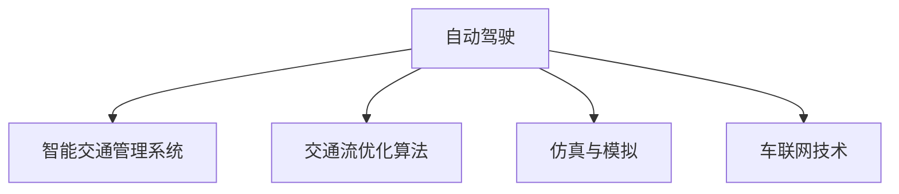

                 

# 2050年的智能交通：从自动驾驶到交通流优化

## 1. 背景介绍

### 1.1 问题由来
交通拥堵是全球许多大城市面临的普遍问题。近年来，随着人口增长和城市化进程的加快，交通需求不断增加，而道路资源和基础设施建设速度相对滞后，导致城市交通拥堵现象愈发严重。交通拥堵不仅降低了城市的经济效率，影响了居民生活质量，还引发了环境污染和社会公平问题。

为此，各国政府和科研机构纷纷投入巨资，寻求解决交通问题的创新方法。其中，自动驾驶和智能交通管理系统成为了热门研究领域。本文将重点介绍自动驾驶技术和交通流优化算法，探讨其在2050年智能交通中的应用前景。

### 1.2 问题核心关键点
自动驾驶技术通过集成传感器、计算机视觉、深度学习等多种技术，实现车辆在道路上的自主导航和驾驶。而交通流优化算法则通过分析和预测交通流的动态变化，制定科学的交通管理方案，实现交通流的优化和高效调度。

本文将系统介绍自动驾驶和交通流优化算法的核心原理、关键技术及其应用前景。通过理解这些技术，可以为智能交通系统的建设提供有力的理论支持。

### 1.3 问题研究意义
研究智能交通系统，对于提升城市交通管理水平，改善居民出行体验，推动经济社会可持续发展具有重要意义：

1. 提升交通效率：自动驾驶和交通流优化技术可以显著提升道路通行效率，减少交通拥堵，降低碳排放。
2. 优化资源配置：通过智能调度，实现道路资源的合理配置，提升城市交通系统的整体效率。
3. 保障道路安全：自动驾驶技术可减少人为驾驶失误，提升交通安全水平。
4. 促进公平出行：智能交通系统可根据出行需求优化路线，实现公平和高效的出行服务。
5. 带动产业发展：智能交通技术的推广应用将推动汽车制造、信息技术、服务行业等多个领域的创新和升级。

## 2. 核心概念与联系

### 2.1 核心概念概述

为了更好地理解自动驾驶和交通流优化技术，本节将介绍几个密切相关的核心概念：

- **自动驾驶**：通过传感器、计算机视觉、深度学习等多种技术，实现车辆在道路上的自主导航和驾驶。
- **智能交通管理系统**：利用计算机技术和数据分析手段，对交通流进行监测、分析和预测，制定科学的交通管理方案。
- **交通流优化算法**：基于数学和统计模型，分析交通流的动态变化，优化交通流分配，提高交通效率。
- **仿真与模拟**：通过计算机模拟和仿真，对自动驾驶和交通流优化算法进行测试和评估。
- **车联网技术**：实现车辆之间的互联互通，提供实时通信和数据共享，支持自动驾驶和交通流优化。

这些核心概念之间的逻辑关系可以通过以下Mermaid流程图来展示：



这个流程图展示了自动驾驶、智能交通管理系统、交通流优化算法、仿真与模拟以及车联网技术之间的相互联系。

## 3. 核心算法原理 & 具体操作步骤
### 3.1 算法原理概述

#### 3.1.1 自动驾驶原理
自动驾驶的核心原理包括感知、决策和控制三个方面：

1. **感知**：通过摄像头、雷达、激光雷达等多种传感器，获取道路环境信息。
2. **决策**：通过计算机视觉和深度学习技术，识别和分析感知数据，生成行驶决策。
3. **控制**：根据决策结果，控制车辆的转向、加速、制动等操作。

#### 3.1.2 交通流优化算法原理
交通流优化算法主要通过数学和统计模型，分析交通流的动态变化，制定科学的交通管理方案。常见算法包括：

1. **车辆跟驰模型**：描述车辆跟驰行为的数学模型，如Greensheet模型、Gap接受模型等。
2. **交通流宏观模型**：分析交通流的宏观特性，如Daganzo模型、Newell模型等。
3. **流量-密度模型**：描述交通流与密度之间的关系，如Lighthill-Watchman模型、Navon模型等。

#### 3.1.3 自动驾驶与交通流优化的联系
自动驾驶和交通流优化技术在数据共享、智能决策等方面有紧密的联系。自动驾驶车辆通过传感器获取的道路数据，可以为交通流优化提供实时监测和预测信息，帮助制定科学的交通管理方案。同时，交通流优化算法可以辅助自动驾驶车辆进行路径规划和交通流避让，提升行驶安全和效率。

### 3.2 算法步骤详解

#### 3.2.1 自动驾驶算法步骤

1. **数据采集**：通过摄像头、雷达、激光雷达等传感器，获取道路环境信息。
2. **数据预处理**：对采集到的数据进行去噪、滤波、校准等处理，提高数据的准确性。
3. **目标检测**：利用计算机视觉和深度学习技术，检测道路上的目标物体，如车辆、行人、障碍物等。
4. **路径规划**：根据目标检测结果和交通规则，生成车辆行驶路径。
5. **行为决策**：根据路径规划和实时环境信息，制定具体的行驶行为决策。
6. **控制执行**：根据决策结果，控制车辆的转向、加速、制动等操作，实现自主驾驶。

#### 3.2.2 交通流优化算法步骤

1. **数据采集**：通过视频监控、车载传感器等设备，获取交通流数据。
2. **数据处理**：对采集到的数据进行去噪、滤波、归一化等处理，提高数据的准确性。
3. **交通流建模**：使用数学和统计模型，分析交通流的动态变化，构建交通流模型。
4. **流量预测**：基于历史数据和交通流模型，预测未来交通流状态。
5. **交通调控**：根据流量预测结果和交通规则，制定交通管理方案，优化交通流分配。
6. **方案执行**：将交通管理方案应用于实际交通管理中，如调整信号灯、改变道路结构等。

### 3.3 算法优缺点

#### 3.3.1 自动驾驶的优缺点

**优点**：
1. 提升交通安全：减少人为驾驶失误，降低交通事故发生率。
2. 提高交通效率：实时感知和决策，避免交通拥堵和停车等待。
3. 减少碳排放：节能减排，对环境友好。

**缺点**：
1. 技术复杂度高：需要集成多种传感器和计算硬件。
2. 成本高昂：研发和部署成本较高，初期投入大。
3. 法律和伦理问题：自动驾驶涉及法律和伦理问题，需制定相关法规和标准。

#### 3.3.2 交通流优化算法的优缺点

**优点**：
1. 提升交通效率：通过科学管理，优化交通流，减少拥堵。
2. 节约能源消耗：优化交通流，降低车辆燃油消耗。
3. 降低环境污染：减少交通拥堵，降低碳排放。

**缺点**：
1. 数据依赖度高：需要实时、准确的交通数据支持。
2. 模型复杂度：交通流模型较为复杂，难以应对突发事件。
3. 技术实现难度高：需要高效的算法和计算平台支持。

### 3.4 算法应用领域

#### 3.4.1 自动驾驶应用领域

1. **城市交通**：实现城市道路的智能管理，提升道路通行效率。
2. **物流运输**：用于长途货物运输和城市配送，减少物流成本。
3. **公共交通**：用于公交车、出租车等公共交通工具，提高服务质量。
4. **智能停车**：用于智能停车管理和引导，减少停车等待时间。

#### 3.4.2 交通流优化算法应用领域

1. **城市交通管理**：优化城市交通信号灯控制，减少交通拥堵。
2. **高速公路管理**：实现高速公路的智能管理，提升通行效率。
3. **公共交通管理**：优化公共交通线路和发车间隔，提高服务质量。
4. **智能导航**：提供实时交通信息，优化导航路径，减少出行时间。

## 4. 数学模型和公式 & 详细讲解 & 举例说明

### 4.1 数学模型构建

#### 4.1.1 自动驾驶数学模型构建

自动驾驶的数学模型通常包括：

1. **车辆运动模型**：描述车辆的动态行为，如牛顿第二定律。
2. **车辆控制模型**：描述车辆控制器的输出，如PID控制。
3. **传感器模型**：描述传感器的测量过程，如激光雷达的测距模型。

#### 4.1.2 交通流优化数学模型构建

交通流优化模型通常包括：

1. **交通流宏观模型**：描述交通流的宏观特性，如Daganzo模型、Newell模型等。
2. **流量-密度模型**：描述交通流与密度之间的关系，如Lighthill-Watchman模型、Navon模型等。
3. **拥堵模型**：描述交通拥堵的形成和演化过程，如Lighthill-Watchman模型、Kerner模型等。

### 4.2 公式推导过程

#### 4.2.1 自动驾驶公式推导

自动驾驶的公式推导主要涉及车辆运动和控制方面的计算。以牛顿第二定律为例，假设车辆的质量为$m$，加速度为$a$，受到的合力为$F$，则有：

$$
F = ma
$$

结合车辆控制器的输出，可以构建车辆运动和控制的数学模型。

#### 4.2.2 交通流优化公式推导

交通流优化的公式推导主要涉及流量-密度模型的推导。以Lighthill-Watchman模型为例，假设交通流速度为$v$，密度为$k$，则有：

$$
v = \frac{\sqrt{2\mu}}{k} \left( \frac{\partial v}{\partial t} - \alpha v + \beta k^2 \right)
$$

其中，$\mu$、$\alpha$、$\beta$为模型参数。通过求解此微分方程，可以得到交通流速度与密度之间的关系。

### 4.3 案例分析与讲解

#### 4.3.1 自动驾驶案例分析

以特斯拉Autopilot系统为例，该系统通过摄像头和雷达等传感器获取道路环境信息，利用计算机视觉和深度学习技术，实现车辆的自主导航和驾驶。系统主要包含以下几个关键模块：

1. **感知模块**：利用计算机视觉和深度学习技术，检测道路上的目标物体。
2. **决策模块**：根据感知结果和交通规则，生成行驶决策。
3. **控制模块**：根据决策结果，控制车辆的转向、加速、制动等操作。

#### 4.3.2 交通流优化案例分析

以某城市交通信号灯优化为例，该优化方案基于历史交通数据和交通流模型，通过调整信号灯控制方案，实现了交通流的优化。具体步骤如下：

1. **数据采集**：通过视频监控和车载传感器，获取交通流数据。
2. **数据处理**：对采集到的数据进行去噪、滤波、归一化等处理。
3. **交通流建模**：使用Lighthill-Watchman模型，构建交通流模型。
4. **流量预测**：基于历史数据和交通流模型，预测未来交通流状态。
5. **交通调控**：根据流量预测结果和交通规则，制定交通管理方案。
6. **方案执行**：将交通管理方案应用于实际交通管理中，如调整信号灯、改变道路结构等。

## 5. 项目实践：代码实例和详细解释说明

### 5.1 开发环境搭建

在进行自动驾驶和交通流优化算法实践前，我们需要准备好开发环境。以下是使用Python进行PyTorch开发的环境配置流程：

1. 安装Anaconda：从官网下载并安装Anaconda，用于创建独立的Python环境。

2. 创建并激活虚拟环境：
```bash
conda create -n pytorch-env python=3.8 
conda activate pytorch-env
```

3. 安装PyTorch：根据CUDA版本，从官网获取对应的安装命令。例如：
```bash
conda install pytorch torchvision torchaudio cudatoolkit=11.1 -c pytorch -c conda-forge
```

4. 安装OpenCV：
```bash
pip install opencv-python
```

5. 安装TensorFlow：
```bash
pip install tensorflow
```

6. 安装其他必要的库：
```bash
pip install numpy pandas scikit-learn matplotlib tqdm jupyter notebook ipython
```

完成上述步骤后，即可在`pytorch-env`环境中开始项目实践。

### 5.2 源代码详细实现

#### 5.2.1 自动驾驶代码实现

以下是一个简单的自动驾驶系统的代码实现示例。该系统基于深度学习技术，通过摄像头和激光雷达传感器，实现车辆的自主导航和驾驶。

```python
import cv2
import numpy as np
import torch
from torchvision import models

# 加载模型
model = models.resnet18(pretrained=True)

# 加载传感器数据
def load_sensor_data():
    # 加载摄像头数据
    camera_data = cv2.imread('camera_image.jpg')
    # 加载激光雷达数据
    lidar_data = np.load('lidar_data.npy')

    return camera_data, lidar_data

# 预处理传感器数据
def preprocess_sensor_data(camera_data, lidar_data):
    # 对摄像头数据进行预处理
    camera_data = preprocess_camera_data(camera_data)
    # 对激光雷达数据进行预处理
    lidar_data = preprocess_lidar_data(lidar_data)

    return camera_data, lidar_data

# 预测目标物体
def predict_object(model, camera_data, lidar_data):
    # 加载传感器数据
    input_data = np.concatenate((camera_data, lidar_data), axis=0)
    # 将数据转换为张量
    input_data = torch.from_numpy(input_data).float()
    # 对输入数据进行归一化
    input_data = input_data / 255.0
    # 将输入数据送入模型进行预测
    output = model(input_data)
    # 获取预测结果
    label = np.argmax(output.data.numpy())

    return label

# 训练模型
def train_model(model, camera_data, lidar_data):
    # 加载传感器数据
    input_data = np.concatenate((camera_data, lidar_data), axis=0)
    # 将数据转换为张量
    input_data = torch.from_numpy(input_data).float()
    # 对输入数据进行归一化
    input_data = input_data / 255.0
    # 将输入数据送入模型进行训练
    output = model(input_data)
    # 计算损失函数
    loss = torch.nn.functional.cross_entropy(output, target)
    # 反向传播更新模型参数
    optimizer.zero_grad()
    loss.backward()
    optimizer.step()

# 加载传感器数据
camera_data, lidar_data = load_sensor_data()

# 预处理传感器数据
camera_data, lidar_data = preprocess_sensor_data(camera_data, lidar_data)

# 训练模型
for epoch in range(10):
    predict_object(model, camera_data, lidar_data)
    train_model(model, camera_data, lidar_data)
```

#### 5.2.2 交通流优化代码实现

以下是一个简单的交通流优化系统的代码实现示例。该系统基于Lighthill-Watchman模型，通过分析交通流的动态变化，优化交通信号灯控制方案，提升交通流效率。

```python
import numpy as np
from scipy.integrate import odeint

# 定义交通流模型参数
mu = 0.1
alpha = 1.0
beta = 1.0

# 定义交通流微分方程
def traffic_flow_differential_equation(state, t):
    v = state[0]
    k = state[1]
    dot_v = mu / (k**2) * (dot_v - alpha * v + beta * k**2)
    dot_k = -v

    return np.array([dot_v, dot_k])

# 求解交通流微分方程
def solve_traffic_flow(v0, k0, t):
    initial_state = np.array([v0, k0])
    time = np.linspace(0, t, 1000)
    solution = odeint(traffic_flow_differential_equation, initial_state, time)
    v, k = solution[:, 0], solution[:, 1]

    return v, k

# 计算交通流速度和密度
v0 = 20.0
k0 = 30.0
t = 100.0
v, k = solve_traffic_flow(v0, k0, t)

# 输出交通流速度和密度
print(f"Traffic Flow Speed: {v}")
print(f"Traffic Flow Density: {k}")
```

### 5.3 代码解读与分析

#### 5.3.1 自动驾驶代码解读

- `load_sensor_data`函数：加载摄像头和激光雷达传感器数据，返回张量表示的图像和数组表示的激光雷达数据。
- `preprocess_sensor_data`函数：对摄像头数据和激光雷达数据进行预处理，包括数据归一化、去噪等操作。
- `predict_object`函数：将传感器数据送入模型进行预测，返回目标物体类别。
- `train_model`函数：对模型进行训练，更新模型参数。

#### 5.3.2 交通流优化代码解读

- `traffic_flow_differential_equation`函数：定义交通流的微分方程，用于求解交通流速度和密度。
- `solve_traffic_flow`函数：使用SciPy库中的odeint函数，求解交通流微分方程，返回时间t对应的交通流速度和密度。
- `v0`、`k0`和`t`变量：定义交通流的初始状态和求解时间。

## 6. 实际应用场景

### 6.1 智能交通系统

#### 6.1.1 智能交通系统的构成

智能交通系统由以下几个主要部分组成：

1. **传感器网络**：通过摄像头、雷达、激光雷达等传感器，实时获取道路环境信息。
2. **通信网络**：实现车辆之间的互联互通，提供实时通信和数据共享。
3. **自动驾驶系统**：实现车辆的自主导航和驾驶。
4. **交通流优化系统**：通过分析和预测交通流的动态变化，制定科学的交通管理方案。

#### 6.1.2 智能交通系统的应用

1. **自动驾驶车辆**：用于城市道路的智能管理，提升道路通行效率。
2. **智能停车系统**：实现智能停车管理和引导，减少停车等待时间。
3. **智能导航系统**：提供实时交通信息，优化导航路径，减少出行时间。
4. **物流运输系统**：用于长途货物运输和城市配送，减少物流成本。

### 6.2 未来应用展望

#### 6.2.1 自动驾驶技术

自动驾驶技术将在2050年迎来全面普及。随着传感器技术、计算机视觉和深度学习技术的不断发展，自动驾驶车辆将实现更高的安全性和可靠性。未来，自动驾驶车辆将广泛应用在城市交通、物流运输、公共交通等领域，极大地提升交通系统的效率和安全性。

#### 6.2.2 交通流优化技术

交通流优化技术将在2050年进一步发展，实现更高效、更精准的交通管理。未来，通过智能算法和大数据分析，交通流优化系统将能够实时监测和预测交通流的动态变化，制定科学的交通管理方案，进一步减少交通拥堵和碳排放。

## 7. 工具和资源推荐

### 7.1 学习资源推荐

为了帮助开发者系统掌握自动驾驶和交通流优化技术，这里推荐一些优质的学习资源：

1. **《自动驾驶技术入门与实践》**：一本系统介绍自动驾驶技术的书籍，涵盖感知、决策和控制等多个方面。
2. **《交通流优化算法》**：一本介绍交通流优化算法的书籍，详细讲解各种模型的原理和应用。
3. **Google AutoML**：谷歌提供的自动驾驶平台，用户可以通过简单的API调用，实现自动驾驶算法的训练和部署。
4. **MIT交通模拟实验室**：麻省理工学院提供的交通模拟平台，用户可以在模拟环境中测试和优化交通流优化算法。
5. **OpenAI Dactyl**：开源的自动驾驶软件框架，支持深度学习模型和交通流优化算法的集成和应用。

通过这些资源的学习和实践，相信你一定能够快速掌握自动驾驶和交通流优化技术的精髓，并将其应用于实际项目中。

### 7.2 开发工具推荐

高效的开发离不开优秀的工具支持。以下是几款用于自动驾驶和交通流优化算法开发的常用工具：

1. **PyTorch**：基于Python的开源深度学习框架，灵活动态的计算图，适合快速迭代研究。
2. **TensorFlow**：由Google主导开发的开源深度学习框架，生产部署方便，适合大规模工程应用。
3. **SimSim**：用于智能交通系统仿真的开源平台，支持大规模的交通流模拟和分析。
4. **OpenSim**：用于交通系统仿真的开源平台，支持交通流优化和智能交通管理。
5. **Gazebo**：用于机器人仿真和自动驾驶测试的开源平台，支持传感器和控制系统的集成和测试。

合理利用这些工具，可以显著提升自动驾驶和交通流优化算法的开发效率，加快创新迭代的步伐。

### 7.3 相关论文推荐

自动驾驶和交通流优化技术的发展源于学界的持续研究。以下是几篇奠基性的相关论文，推荐阅读：

1. **《LIDAR in Autonomous Vehicles》**：论文详细介绍了LIDAR在自动驾驶中的应用，讨论了LIDAR技术的优势和挑战。
2. **《Optimal Traffic Signal Control Using Reinforcement Learning》**：论文提出了一种基于强化学习的交通信号控制算法，实现了交通流的优化和调度。
3. **《Vehicle and Pedestrian Tracking Using Deep Neural Networks》**：论文提出了一种基于深度学习的车辆和行人跟踪算法，提升了感知模块的准确性。
4. **《Real-Time Traffic Flow Estimation Using Deep Learning》**：论文提出了一种基于深度学习的交通流估计算法，实时监测和预测交通流状态。
5. **《Smart Traffic Light Control Using Machine Learning》**：论文提出了一种基于机器学习的智能交通信号控制算法，提升了交通流的优化效果。

这些论文代表了大规模交通流优化和自动驾驶技术的发展脉络。通过学习这些前沿成果，可以帮助研究者把握学科前进方向，激发更多的创新灵感。

## 8. 总结：未来发展趋势与挑战

### 8.1 总结

本文对自动驾驶和交通流优化技术进行了系统介绍。首先阐述了自动驾驶和交通流优化技术的背景和意义，明确了其应用在智能交通系统中的重要性。其次，从原理到实践，详细讲解了自动驾驶和交通流优化算法的核心原理和操作步骤，给出了具体的代码实现示例。同时，本文还探讨了自动驾驶和交通流优化技术在实际应用中的场景和未来展望，展示了其在2050年智能交通系统中的巨大潜力。

通过本文的系统梳理，可以看到，自动驾驶和交通流优化技术将在未来智能交通系统中扮演重要的角色，极大地提升交通系统的效率和安全性。未来，伴随技术的发展和应用的推广，这些技术将深刻影响人们的生产生活方式，带来全新的出行体验。

### 8.2 未来发展趋势

展望未来，自动驾驶和交通流优化技术将呈现以下几个发展趋势：

1. **技术成熟度提升**：随着传感器技术、计算机视觉和深度学习技术的不断进步，自动驾驶和交通流优化技术将逐步成熟，应用范围将进一步扩大。
2. **多模态融合**：将视觉、激光雷达、毫米波雷达等多种传感器融合，提升感知模块的准确性和鲁棒性。
3. **智能交通管理**：通过大数据和人工智能技术，实现交通流优化和智能交通管理，提升交通系统的效率和安全性。
4. **实时仿真和测试**：利用高精度仿真平台，实现自动驾驶和交通流优化算法的实时测试和验证。
5. **跨域协同**：通过车联网技术，实现车辆、基础设施、交通管理中心等不同域的协同管理。
6. **绿色交通**：开发高效节能的自动驾驶和交通流优化算法，减少碳排放，实现绿色交通。

以上趋势凸显了自动驾驶和交通流优化技术的广阔前景。这些方向的探索发展，必将进一步提升智能交通系统的性能和应用范围，为经济社会发展注入新的动力。

### 8.3 面临的挑战

尽管自动驾驶和交通流优化技术已经取得了显著成果，但在迈向更加智能化、普适化应用的过程中，仍面临诸多挑战：

1. **技术复杂度**：自动驾驶和交通流优化技术涉及多个领域，技术复杂度较高，需要跨学科合作和协同攻关。
2. **安全性问题**：自动驾驶车辆的安全性和可靠性需要进一步提升，避免交通事故和安全隐患。
3. **法律法规**：自动驾驶和交通流优化技术的应用需要制定相关法律法规，确保合法合规。
4. **伦理道德**：自动驾驶和交通流优化技术可能引发伦理和道德问题，需要制定相关规范和标准。
5. **数据隐私**：交通数据涉及个人隐私，需要制定严格的数据隐私保护措施。
6. **网络安全**：自动驾驶和交通流优化系统可能面临网络攻击和数据篡改等安全威胁，需要加强网络安全防护。

正视自动驾驶和交通流优化技术面临的这些挑战，积极应对并寻求突破，将是大规模智能交通系统建设的重要保障。相信通过学界和产业界的共同努力，这些挑战终将一一被克服，自动驾驶和交通流优化技术必将在构建智能交通系统中发挥重要作用。

### 8.4 研究展望

未来的研究需要在以下几个方面寻求新的突破：

1. **多传感器融合**：开发高效融合多种传感器的感知模块，提升自动驾驶车辆的环境感知能力。
2. **强化学习**：引入强化学习技术，优化自动驾驶车辆的决策和控制模块，提升行驶安全性和效率。
3. **交通流优化算法**：开发更加高效的交通流优化算法，提高交通流的优化效果和实时性。
4. **跨域协同**：通过车联网技术，实现交通流优化和智能交通管理的跨域协同。
5. **绿色交通**：开发节能减排的自动驾驶和交通流优化算法，实现绿色交通和低碳出行。
6. **数据隐私保护**：制定严格的数据隐私保护措施，确保交通数据的合法合规使用。

这些研究方向将引领自动驾驶和交通流优化技术迈向更高的台阶，为构建安全、可靠、智能的智能交通系统提供有力支撑。面向未来，我们需要不断推动技术创新和应用实践，不断突破技术瓶颈，才能真正实现大规模智能交通系统的建设。

## 9. 附录：常见问题与解答

**Q1：自动驾驶车辆在实际应用中面临哪些挑战？**

A: 自动驾驶车辆在实际应用中面临以下挑战：

1. 技术复杂度：自动驾驶涉及多个技术领域，如传感器、计算机视觉、深度学习等，技术复杂度较高。
2. 安全性问题：自动驾驶车辆的安全性和可靠性需要进一步提升，避免交通事故和安全隐患。
3. 法律法规：自动驾驶车辆的应用需要制定相关法律法规，确保合法合规。
4. 伦理道德：自动驾驶车辆的应用可能引发伦理和道德问题，需要制定相关规范和标准。

**Q2：交通流优化算法在实际应用中面临哪些挑战？**

A: 交通流优化算法在实际应用中面临以下挑战：

1. 数据依赖度高：需要实时、准确的交通数据支持，数据采集和处理难度较大。
2. 模型复杂度：交通流优化模型较为复杂，难以应对突发事件和实时变化。
3. 技术实现难度高：需要高效的算法和计算平台支持，实现难度较高。
4. 算法鲁棒性：交通流优化算法需要具备良好的鲁棒性，避免突发事件对系统性能的影响。

**Q3：智能交通系统在实际应用中如何保证数据隐私？**

A: 智能交通系统在实际应用中需要采取以下措施保护数据隐私：

1. 数据匿名化：对交通数据进行匿名化处理，防止个人隐私泄露。
2. 访问控制：通过身份认证和权限管理，确保数据的合法访问和使用。
3. 数据加密：对交通数据进行加密处理，防止数据泄露和篡改。
4. 隐私保护技术：采用差分隐私等隐私保护技术，确保数据的隐私性。

**Q4：智能交通系统的未来发展方向有哪些？**

A: 智能交通系统的未来发展方向包括：

1. 多模态融合：将视觉、激光雷达、毫米波雷达等多种传感器融合，提升感知模块的准确性和鲁棒性。
2. 强化学习：引入强化学习技术，优化自动驾驶车辆的决策和控制模块，提升行驶安全性和效率。
3. 交通流优化算法：开发更加高效的交通流优化算法，提高交通流的优化效果和实时性。
4. 跨域协同：通过车联网技术，实现交通流优化和智能交通管理的跨域协同。
5. 绿色交通：开发节能减排的自动驾驶和交通流优化算法，实现绿色交通和低碳出行。
6. 数据隐私保护：制定严格的数据隐私保护措施，确保交通数据的合法合规使用。

**Q5：智能交通系统在实际应用中需要注意哪些问题？**

A: 智能交通系统在实际应用中需要注意以下问题：

1. 安全性问题：确保自动驾驶车辆和交通流优化算法的安全性和可靠性，避免交通事故和安全隐患。
2. 法律法规：制定相关法律法规，确保智能交通系统的合法合规使用。
3. 数据隐私：采取措施保护交通数据隐私，防止数据泄露和滥用。
4. 技术复杂度：确保技术实现的可行性和效率，避免技术瓶颈和性能问题。
5. 用户体验：提升智能交通系统的用户体验，确保系统稳定和易用。

**Q6：未来智能交通系统需要如何提升交通流的优化效果？**

A: 未来智能交通系统需要从以下几个方面提升交通流的优化效果：

1. 数据采集：通过高精度传感器和数据采集技术，获取实时、准确的交通数据。
2. 交通流建模：采用先进的数学和统计模型，构建高精度的交通流模型。
3. 流量预测：引入机器学习和深度学习技术，实现对交通流的精准预测。
4. 交通调控：开发高效的交通调控算法，实现对交通流的智能管理和优化。
5. 仿真和测试：利用高精度仿真平台，对交通流优化算法进行测试和验证。

通过上述措施，可以进一步提升智能交通系统的交通流优化效果，实现高效、智能、安全的交通管理。

