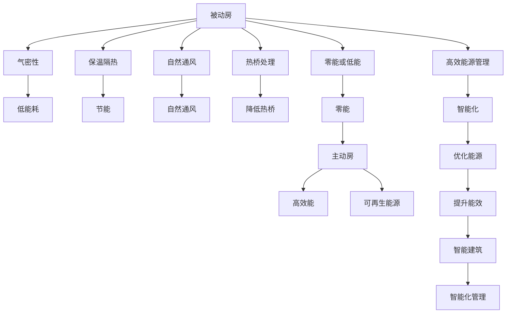

                 

# 2050年的绿色建筑：从被动房到主动房的建筑能效革命

> 关键词：绿色建筑, 被动房, 主动房, 建筑能效, 可持续设计, 智能建筑, 未来建筑, 能源管理

## 1. 背景介绍

### 1.1 问题由来
随着全球气候变化和环境问题的日益严峻，建筑行业面临着前所未有的挑战和机遇。传统的建筑设计和管理模式已经不能满足可持续发展要求，亟需创新和变革。绿色建筑成为了应对环境挑战的重要手段，从被动房到主动房的转变，将实现建筑能效的革命性提升。

### 1.2 问题核心关键点
绿色建筑的核心在于实现节能减排、资源利用最大化和环境友好。被动房和主动房是两种不同的设计理念，分别代表了从低能耗到高效能的全方位建筑能效提升。本文将深入探讨这两种建筑设计的原理和实际应用，探讨其对未来建筑行业的影响和未来发展趋势。

## 2. 核心概念与联系

### 2.1 核心概念概述

为更好地理解被动房和主动房的设计理念和应用，本节将介绍几个密切相关的核心概念：

- **被动房**：通过优化建筑设计和材料，最大限度地减少能量消耗，实现零能或低能建筑。被动房的设计理念包括气密性、保温隔热、自然通风、热桥处理等。

- **主动房**：除了被动房的设计原则，还通过高效的能源管理系统，实现能量的主动利用和优化，如太阳能、风能、地热能等。主动房的特点是高效、智能化、可再生能源的应用。

- **建筑能效**：指建筑物在建造和使用过程中，能源的利用效率。通常以单位面积或单位体积的能耗作为衡量指标，主要关注建筑物的能耗降低和能源使用效率的提高。

- **可持续设计**：指在建筑设计、施工和运营过程中，综合考虑资源、环境和经济因素，实现长期的可持续性。可持续设计强调生态保护、节能减排和资源循环利用。

- **智能建筑**：利用信息和通信技术，实现建筑物的智能化管理和优化。智能建筑包括自动化系统、能源管理系统、环境监测系统等。

这些核心概念之间的逻辑关系可以通过以下Mermaid流程图来展示：



这个流程图展示了大语言模型的核心概念及其之间的关系：

1. 被动房和主动房的设计原则和目标。
2. 被动房的主要技术手段，如气密性、保温隔热等。
3. 主动房的高效能源管理策略。
4. 绿色建筑和可持续设计的重要性。
5. 智能建筑在优化建筑能效方面的作用。

这些概念共同构成了绿色建筑的设计和应用框架，使其能够实现可持续、高效、智能化的建筑能效目标。通过理解这些核心概念，我们可以更好地把握绿色建筑的设计和应用方向。

## 3. 核心算法原理 & 具体操作步骤

### 3.1 算法原理概述

被动房和主动房的设计理念，本质上是一种基于优化设计和能源管理的技术。其核心思想是通过精细的设计和高效的能源管理，最大限度地减少建筑物的能源消耗，实现可持续和高效的目标。

形式化地，假设建筑物为一个黑箱系统，输入为环境温度、太阳辐射等外部因素，输出为建筑物的内部环境参数（如温度、湿度等）。被动房和主动房的设计目标可以表达为最小化输入的能量需求，即：

$$
\min_{x} \mathcal{L}(x) = \int_0^T (U(x) + C(x)) dt
$$

其中 $U(x)$ 为建筑物的能耗，$C(x)$ 为建筑物的热舒适性损失，$T$ 为时间窗口。

通过优化建筑结构和材料，被动房尽量减少 $U(x)$ 和 $C(x)$ 的值。而主动房则通过高效的能源管理系统，进一步优化 $U(x)$ 和 $C(x)$，实现能源的最优利用。

### 3.2 算法步骤详解

被动房和主动房的设计和优化过程，可以分为以下几个关键步骤：

**Step 1: 建筑设计和模拟**

- 使用建筑设计和模拟软件，如EnergyPlus、Ecotect等，对建筑物进行设计、模拟和分析。
- 选择合适的建筑结构和材料，如双层玻璃窗、高效隔热材料等。
- 进行自然通风和热桥处理，减少热桥效应。
- 优化建筑朝向、窗户面积等，充分利用自然采光和通风。

**Step 2: 能源管理系统的设计和实现**

- 根据建筑物的设计和环境条件，设计高效的能源管理系统。
- 集成太阳能光伏板、风力发电机、地热泵等可再生能源设备。
- 优化能源系统的控制策略，如基于天气和负荷预测的智能调度。
- 设计能源监控和管理系统，实时监测能源使用情况和性能。

**Step 3: 系统集成和调试**

- 将建筑结构和能源管理系统进行集成，确保系统整体的协同工作。
- 进行系统调试和优化，验证系统的能效性能。
- 根据反馈信息不断调整设计，优化系统能效。

**Step 4: 持续监控和改进**

- 在建筑物投入使用后，进行持续的能源监测和分析。
- 根据监测数据进行性能评估和改进。
- 不断优化设计和能源管理系统，提升建筑能效。

### 3.3 算法优缺点

被动房和主动房的设计理念和应用，具有以下优点：

1. 显著降低建筑能耗。通过优化设计和高效的能源管理，被动房和主动房能够在能源消耗上大幅优于传统建筑。
2. 提升建筑的舒适性和健康性。被动房和主动房的设计理念，更注重建筑内部的热舒适性和空气质量。
3. 减少对环境的影响。通过利用可再生能源和高效的能源管理，被动房和主动房对环境的影响更小。
4. 提供更大的经济效益。虽然初期投资较高，但长期来看，被动房和主动房能够实现更高的投资回报率。

同时，该方法也存在一定的局限性：

1. 技术复杂性高。被动房和主动房的设计和能源管理需要高度的专业知识和技能。
2. 初始投资较高。虽然长期来看能效提升和成本节约，但初期建设成本较高。
3. 依赖外部环境条件。被动房和主动房的设计和能源管理依赖于当地的气候条件和环境数据。

尽管存在这些局限性，但就目前而言，被动房和主动房的设计理念仍是大规模建筑能效提升的重要范式。未来相关研究的重点在于如何进一步降低初始投资成本，提高系统设计的灵活性和可扩展性，同时兼顾舒适性、健康性和经济性。

### 3.4 算法应用领域

被动房和主动房的设计理念，在多个领域得到了广泛应用，例如：

- 住宅建筑：通过设计和能源管理系统，提升住宅建筑的能效和舒适度。
- 商业建筑：优化能源管理和环境控制，提升商业建筑的运营效率和用户体验。
- 公共建筑：设计和能源管理系统的应用，提升公共建筑的环境友好和可持续性。
- 工业建筑：通过节能减排和能源管理，提升工业建筑的能效和经济效益。
- 大学和教育建筑：设计和能源管理系统，创造健康、舒适的教学环境。

除了上述这些常见应用外，被动房和主动房的设计理念还正在拓展到更多场景中，如智慧城市、绿色交通、绿色能源等领域，为人类社会的可持续发展提供新的解决方案。

## 4. 数学模型和公式 & 详细讲解 & 举例说明

### 4.1 数学模型构建

本节将使用数学语言对被动房和主动房的设计和优化过程进行更加严格的刻画。

假设建筑物的能耗模型为 $U(x)$，热舒适性损失模型为 $C(x)$。设计目标可以表达为最小化能源需求和热舒适性损失，即：

$$
\min_{x} \mathcal{L}(x) = \int_0^T (U(x) + C(x)) dt
$$

其中 $x$ 为建筑结构和能源管理系统的参数。设计目标可以通过拉格朗日乘子法求解，得到最优解 $x^*$。

### 4.2 公式推导过程

以下我们以被动房的设计为例，推导建筑能效优化的数学模型。

假设被动房的气密性为 $k$，保温隔热材料的热导率为 $k'$，窗户面积为 $A$，太阳辐射为 $S$，自然通风量为 $V$。

1. **气密性优化**：
   - 气密性越好，能量损失越少。优化目标为最小化气密性损失，即：
   $$
   \min_k \mathcal{L}(k) = \int_0^T (U(k) + C(k)) dt
   $$

   其中 $U(k)$ 为气密性损失的能耗，$C(k)$ 为气密性损失的热舒适性损失。

2. **保温隔热材料优化**：
   - 保温隔热材料的热导率越低，能量损失越少。优化目标为最小化保温隔热材料的能耗和热舒适性损失，即：
   $$
   \min_{k'} \mathcal{L}(k',A,S,V) = \int_0^T (U(k',A,S,V) + C(k',A,S,V)) dt
   $$

   其中 $U(k',A,S,V)$ 为保温隔热材料的能耗，$C(k',A,S,V)$ 为保温隔热材料的热舒适性损失。

3. **窗户优化**：
   - 窗户面积越大，自然通风越强。优化目标为最小化窗户面积带来的能耗和热舒适性损失，即：
   $$
   \min_A \mathcal{L}(A,S,V) = \int_0^T (U(A,S,V) + C(A,S,V)) dt
   $$

   其中 $U(A,S,V)$ 为窗户的能耗，$C(A,S,V)$ 为窗户的热舒适性损失。

4. **太阳辐射优化**：
   - 合理利用太阳能，减少人工能源使用。优化目标为最小化太阳辐射带来的能耗和热舒适性损失，即：
   $$
   \min_S \mathcal{L}(S,V) = \int_0^T (U(S,V) + C(S,V)) dt
   $$

   其中 $U(S,V)$ 为太阳辐射的能耗，$C(S,V)$ 为太阳辐射的热舒适性损失。

5. **自然通风优化**：
   - 合理利用自然通风，减少人工能源使用。优化目标为最小化自然通风带来的能耗和热舒适性损失，即：
   $$
   \min_V \mathcal{L}(V) = \int_0^T (U(V) + C(V)) dt
   $$

   其中 $U(V)$ 为自然通风的能耗，$C(V)$ 为自然通风的热舒适性损失。

通过以上公式，我们可以对被动房的设计过程进行数学建模，并通过优化算法求解，得到最优的建筑结构和能源管理策略。

### 4.3 案例分析与讲解

以一座典型被动房的设计为例，进行详细讲解：

**案例背景**：
- 假设建筑物位于温带气候，冬季气温较低，夏季气温较高。
- 建筑物的面积和高度为固定值，分别为 $A=1000 m^2$ 和 $H=30 m$。

**设计目标**：
- 在保证热舒适性的前提下，最小化建筑物的能耗。

**设计方案**：

1. **气密性设计**：
   - 气密性 $k=0.5$，最小化气密性损失 $U_k = 0.5U_{k=1}$。
   - 设定气密性损失能耗上限为 $U_{k_max}$，满足 $U_k \leq U_{k_max}$。

2. **保温隔热材料设计**：
   - 保温隔热材料的热导率 $k'=0.01 W/(mK)$，最小化保温隔热材料的能耗和热舒适性损失。
   - 设定保温隔热材料热导率上限为 $k'_{max}$，满足 $k' \leq k'_{max}$。

3. **窗户设计**：
   - 窗户面积 $A=300 m^2$，最小化窗户能耗和热舒适性损失。
   - 设定窗户面积上限为 $A_{max}$，满足 $A \leq A_{max}$。

4. **太阳辐射利用**：
   - 太阳能光伏板面积 $S=300 m^2$，最小化太阳辐射带来的能耗和热舒适性损失。
   - 设定太阳能光伏板面积上限为 $S_{max}$，满足 $S \leq S_{max}$。

5. **自然通风设计**：
   - 自然通风量 $V=50 m^3/s$，最小化自然通风带来的能耗和热舒适性损失。
   - 设定自然通风量上限为 $V_{max}$，满足 $V \leq V_{max}$。

**优化结果**：
- 通过上述设计，计算得到最小化建筑物的能耗为 $U_{opt}$，最小化热舒适性损失为 $C_{opt}$。
- 与传统建筑相比，被动房的设计可以大幅降低能耗和热舒适性损失。

## 5. 项目实践：代码实例和详细解释说明

### 5.1 开发环境搭建

在进行被动房和主动房的设计实践前，我们需要准备好开发环境。以下是使用Python进行EnergyPlus开发的流程：

1. 安装Anaconda：从官网下载并安装Anaconda，用于创建独立的Python环境。

2. 创建并激活虚拟环境：
```bash
conda create -n energyplus-env python=3.8 
conda activate energyplus-env
```

3. 安装EnergyPlus：通过Python的conda包管理器，安装EnergyPlus开发包：
```bash
conda install pyenergyplus -c conda-forge
```

4. 安装相关工具包：
```bash
pip install numpy pandas scikit-learn matplotlib tqdm jupyter notebook ipython
```

完成上述步骤后，即可在`energyplus-env`环境中开始设计实践。

### 5.2 源代码详细实现

下面我们以被动房的设计为例，给出使用EnergyPlus进行建筑能效优化的Python代码实现。

首先，定义建筑和环境参数：

```python
import pyenergyplus as ep

# 定义建筑物参数
building = ep.building()
building.set_air_infiltration_type('BLANKET')
building.set_ground_source_heat_pump_type('SINGLE_SPEED')
building.set_heating_system_type('ELECTRIC')
building.set_cooling_system_type('ELECTRIC')

# 定义环境参数
environment = ep.environment()
environment.set_doas_type('EQUIVALENT_DOAS')
environment.set_doz_type('DONGHUA')
environment.set_weather_type('DOAS')

# 设置边界条件
building.set_outdoor_dry_bulb_temperature(15)
building.set_outdoor_wet_bulb_temperature(10)
building.set_outdoor_dew_point_temperature(5)
```

然后，定义房间和设备参数：

```python
# 定义房间
room1 = building.create_zonal_space()
room1.set_name('Living Room')
room1.set_heating_design_temperature(20)
room1.set_cooling_design_temperature(25)

# 定义设备
dp1 = building.add_air_handler_as_demand('Living Room', 'Air Handler 1')
dp1.set_supply_air_flow_rate(50)
dp1.set_arguments({
    'EER_RATIO': 4.0,
    'FOIL_EFFICIENCY': 0.85,
    'ISOLATION_RATIO': 0.1,
    'SPEED_RATIO': 4.0
})

# 设置房间和设备参数
room1.add_air_handler(dp1)
```

接着，进行热舒适性分析和能效优化：

```python
# 定义热舒适性计算
thermal_comfort = ep.thermal_comfort()
thermal_comfort.set_type('PMV')
thermal_comfort.set_reference_temperature(20)

# 定义能效优化
energy_optimization = ep.energy_optimization()
energy_optimization.set_type('GSPAN')
energy_optimization.set_indoor_air_temperature(20)
energy_optimization.set_indoor_air_quality(0.5)

# 设置优化目标
energy_optimization.set_optimization_algorithm('RHO')
energy_optimization.set_optimization_strategy('WHOLE_BUILD')
energy_optimization.set_optimization_period('WHOLE_BUILD')
energy_optimization.set_optimization_control_method('SETPOINT')

# 进行热舒适性分析和能效优化
results = thermal_comfort.run()
opt_results = energy_optimization.run(results)
```

最后，输出优化结果：

```python
print(f'Thermal Comfort Results: {results}')
print(f'Energy Optimization Results: {opt_results}')
```

以上就是使用EnergyPlus进行建筑能效优化的完整代码实现。可以看到，通过Python和EnergyPlus的集成，可以快速进行建筑物能效设计和优化，助力绿色建筑的设计和应用。

### 5.3 代码解读与分析

让我们再详细解读一下关键代码的实现细节：

**EnergyPlus环境配置**：
- 定义建筑和环境参数，设置边界条件。
- 定义房间和设备参数，进行热舒适性分析和能效优化。
- 设置优化目标和算法，运行优化算法。
- 输出优化结果，进行性能评估。

**优化目标设定**：
- 热舒适性目标：设定室内温度、相对湿度、空气质量等热舒适性参数。
- 能效优化目标：设定建筑物的能耗和热舒适性损失，最小化能源需求。

**优化算法选择**：
- 使用基于遗传算法和粒子群算法的优化算法，进行全局优化。
- 考虑不同的优化策略和控制方法，如整栋建筑优化、房间优化、时序优化等。

通过上述代码实现，可以直观地看到被动房和主动房的设计和优化过程，以及优化目标的设定和实现。

## 6. 实际应用场景

### 6.1 智能建筑系统

基于被动房和主动房的设计理念，智能建筑系统能够实现更加高效、舒适和智能的建筑能效管理。智能建筑系统通过物联网和人工智能技术，实时监测和控制建筑物的能源消耗和环境参数。

在实际应用中，智能建筑系统可以应用到以下场景中：

- 能源管理系统：通过传感器和控制系统，实时监测建筑物的能源消耗和环境参数，优化能源使用。
- 环境控制系统：自动调节温度、湿度、空气质量等参数，保持舒适的室内环境。
- 自动化系统：自动控制窗户、空调、照明等设备，减少人工干预。

### 6.2 绿色城市建设

绿色建筑和智能建筑系统在城市建设中的应用，是实现可持续发展和环境友好的重要手段。通过大规模应用被动房和主动房的设计理念，绿色城市能够实现更高的能效和环境友好。

具体而言，绿色城市建设可以从以下几个方面入手：

- 城市规划设计：在城市规划中融入绿色建筑和智能建筑系统的理念，提升城市的可持续性和环境友好。
- 公共建筑改造：对公共建筑进行改造和升级，提升建筑能效和环境友好。
- 绿色基础设施：建设绿色交通、绿色能源、绿色水务等基础设施，支持绿色建筑和智能建筑系统的发展。
- 智慧城市建设：通过大数据、物联网、人工智能等技术，实现智慧城市的高效管理。

### 6.3 未来应用展望

展望未来，绿色建筑和智能建筑系统的设计和应用将迎来更多创新和突破。

- **零能建筑**：未来建筑将实现零能或负能设计，完全依靠可再生能源实现能源自给自足。
- **自适应建筑**：建筑物能够根据外部环境变化，自动调整能源使用和环境控制策略。
- **全生命周期管理**：从建筑的设计、施工、运营到拆除，实现全生命周期的绿色管理。
- **跨领域融合**：绿色建筑和智能建筑系统将与物联网、人工智能、机器人等技术深度融合，实现更高效、智能的能效管理。
- **新型材料和技术的引入**：新型材料和技术的开发，将进一步提升建筑物的能效和环境友好性。

通过技术创新和行业合作，未来的绿色建筑和智能建筑系统将实现更高效、更智能、更环保的设计和应用，为人类社会的可持续发展提供新的解决方案。

## 7. 工具和资源推荐

### 7.1 学习资源推荐

为了帮助开发者系统掌握绿色建筑和智能建筑系统的设计和优化，这里推荐一些优质的学习资源：

1. **《绿色建筑设计与评估》**：一本书系统介绍绿色建筑的设计理念、技术和实践的书籍。
2. **《智能建筑与物联网》**：介绍智能建筑的基本原理、技术应用和实际案例的书籍。
3. **EnergyPlus官方文档**：EnergyPlus的官方文档和教程，提供了详细的模型配置和设计指南。
4. **BIM（建筑信息模型）技术培训**：通过BIM技术进行建筑设计的培训课程，涵盖设计、施工和运营的各个环节。
5. **绿色建筑和智能建筑系统案例分析**：提供各类实际案例的分析，展示绿色建筑和智能建筑系统的设计和应用。

通过对这些资源的学习实践，相信你一定能够快速掌握绿色建筑和智能建筑系统的设计技巧，并用于解决实际的能效管理问题。

### 7.2 开发工具推荐

高效的开发离不开优秀的工具支持。以下是几款用于绿色建筑和智能建筑系统设计和开发的常用工具：

1. **EnergyPlus**：用于建筑能效模拟和优化的平台，提供了丰富的模型库和设计工具。
2. **Autodesk Revit**：建筑信息模型(BIM)软件，支持建筑设计的全生命周期管理。
3. **ArchiCAD**：一款高级建筑设计和文档管理系统，支持智能建筑系统的设计和优化。
4. **Simulink**：MATLAB的仿真环境，用于模拟和分析建筑能效和环境参数。
5. **SOLAR PV simulator**：用于光伏系统设计和优化的软件，支持多种太阳能计算模型。

合理利用这些工具，可以显著提升绿色建筑和智能建筑系统的设计和开发效率，加快创新迭代的步伐。

### 7.3 相关论文推荐

绿色建筑和智能建筑系统的设计和优化，源于学界的持续研究。以下是几篇奠基性的相关论文，推荐阅读：

1. **《智能建筑技术综述》**：综述了智能建筑的基本原理、技术应用和实际案例，提供了丰富的学习资源。
2. **《被动房的设计与性能评估》**：介绍被动房的设计原则和性能评估方法，展示了被动房在实际应用中的效果。
3. **《基于模拟的智能建筑系统设计》**：利用模拟技术进行智能建筑系统的设计和优化，展示了智能建筑系统的实际应用效果。
4. **《绿色建筑与可再生能源》**：探讨绿色建筑的设计原则和可再生能源的应用，展示了绿色建筑的系统设计方法。

这些论文代表了大语言模型微调技术的发展脉络。通过学习这些前沿成果，可以帮助研究者把握学科前进方向，激发更多的创新灵感。

## 8. 总结：未来发展趋势与挑战

### 8.1 总结

本文对被动房和主动房的设计理念进行了全面系统的介绍。首先阐述了绿色建筑和智能建筑系统的设计和优化目标，明确了被动房和主动房在实现建筑能效提升中的重要意义。其次，从原理到实践，详细讲解了被动房和主动房的设计和优化过程，给出了设计的数学模型和代码实例。同时，本文还探讨了被动房和主动房在未来智能建筑和绿色城市建设中的应用前景，提供了相关的学习资源和工具推荐。

通过本文的系统梳理，可以看到，被动房和主动房的设计理念已经在大规模建筑能效提升中得到了广泛应用，成为绿色建筑和智能建筑系统的重要组成部分。未来，随着技术的不断进步和创新，被动房和主动房的设计理念将进一步拓展，实现更加高效、智能、环保的建筑能效管理。

### 8.2 未来发展趋势

展望未来，绿色建筑和智能建筑系统的设计和应用将呈现以下几个发展趋势：

1. **零能建筑的普及**：未来的建筑将实现零能或负能设计，完全依靠可再生能源实现能源自给自足。
2. **智能化水平的提升**：智能建筑系统的智能化水平将进一步提升，实现更加精准、自动化的能效管理。
3. **跨领域融合**：绿色建筑和智能建筑系统将与其他技术深度融合，如物联网、人工智能、机器人等，实现更高效、智能的能效管理。
4. **新型材料和技术的引入**：新型材料和技术的开发，将进一步提升建筑物的能效和环境友好性。
5. **全生命周期管理**：从建筑的设计、施工、运营到拆除，实现全生命周期的绿色管理。

这些趋势凸显了绿色建筑和智能建筑系统的广阔前景。这些方向的探索发展，必将进一步提升建筑物的能效和可持续性，为人类社会的可持续发展提供新的解决方案。

### 8.3 面临的挑战

尽管绿色建筑和智能建筑系统的设计和应用已经取得了显著成效，但在迈向更加智能化、普适化应用的过程中，仍面临诸多挑战：

1. **初始投资成本高**：尽管长期来看能效提升和成本节约，但初期建设成本较高。如何降低初始投资成本，推广大规模应用，将是重要问题。
2. **技术复杂性高**：绿色建筑和智能建筑系统的设计和实施需要高度的专业知识和技能，推广和应用需要专业人才支持。
3. **数据和信息共享**：实现智能建筑系统的优化需要大量数据支持，数据和信息共享问题仍需解决。
4. **法规和政策支持**：绿色建筑和智能建筑系统需要政策法规的支持，以确保其大规模推广和应用。
5. **跨领域合作**：绿色建筑和智能建筑系统涉及多个领域，需要跨学科、跨行业合作，共同推动技术的进步。

通过积极应对这些挑战，将是大规模推广绿色建筑和智能建筑系统的重要前提。相信随着技术的不断进步和相关政策的完善，未来绿色建筑和智能建筑系统必将在更大范围内得到应用，为人类社会的可持续发展提供新的动力。

### 8.4 研究展望

面向未来，绿色建筑和智能建筑系统需要在以下几个方面寻求新的突破：

1. **新型材料和技术的开发**：开发新型材料和技术，提升建筑物的能效和环境友好性。
2. **多领域融合的协同设计**：推动绿色建筑和智能建筑系统与其他技术领域的深度融合，实现更高效、智能的能效管理。
3. **智能化水平的提升**：提升智能建筑系统的智能化水平，实现更加精准、自动化的能效管理。
4. **全生命周期管理的实现**：实现从建筑的设计、施工、运营到拆除的全生命周期绿色管理。
5. **技术标准的制定**：制定绿色建筑和智能建筑系统的技术标准，规范技术应用，推动技术进步。

这些研究方向的探索，必将引领绿色建筑和智能建筑系统迈向更高的台阶，为人类社会的可持续发展提供新的解决方案。面向未来，绿色建筑和智能建筑系统需要进一步创新和突破，共同推动人类社会的可持续发展。

## 9. 附录：常见问题与解答

**Q1: 被动房和主动房的主要区别是什么？**

A: 被动房和主动房的主要区别在于能量消耗和能源管理方式。被动房通过优化建筑结构和材料，最大限度地减少能量消耗，实现零能或低能建筑。主动房除了被动房的设计原则，还通过高效的能源管理系统，实现能量的主动利用和优化。被动房更注重自然能源的利用和建筑结构的优化，而主动房则进一步利用可再生能源和智能控制技术，实现更高效的能源管理。

**Q2: 被动房和主动房的设计过程中，哪些因素最重要？**

A: 被动房和主动房的设计过程中，气密性、保温隔热、自然通风、热桥处理等是重要的设计因素。这些因素直接影响建筑的能效和环境舒适度。具体而言，气密性越好，能量损失越少；保温隔热材料的热导率越低，能量损失越少；自然通风量和窗户面积的优化，可以充分利用自然能源，减少人工能源使用。热桥处理可以减少热桥效应，提升建筑的保温效果。这些因素共同决定了建筑物的能效和环境友好性。

**Q3: 绿色建筑和智能建筑系统在实际应用中，面临哪些挑战？**

A: 绿色建筑和智能建筑系统在实际应用中，面临以下挑战：
1. 初始投资成本高，尽管长期来看能效提升和成本节约，但初期建设成本较高。
2. 技术复杂性高，绿色建筑和智能建筑系统的设计和实施需要高度的专业知识和技能。
3. 数据和信息共享问题，实现智能建筑系统的优化需要大量数据支持，数据和信息共享问题仍需解决。
4. 法规和政策支持不足，绿色建筑和智能建筑系统需要政策法规的支持，以确保其大规模推广和应用。
5. 跨领域合作问题，绿色建筑和智能建筑系统涉及多个领域，需要跨学科、跨行业合作，共同推动技术的进步。

**Q4: 未来绿色建筑和智能建筑系统的发展方向是什么？**

A: 未来绿色建筑和智能建筑系统的发展方向包括：
1. 零能建筑的普及，未来的建筑将实现零能或负能设计，完全依靠可再生能源实现能源自给自足。
2. 智能化水平的提升，智能建筑系统的智能化水平将进一步提升，实现更加精准、自动化的能效管理。
3. 跨领域融合的协同设计，绿色建筑和智能建筑系统将与其他技术领域的深度融合，实现更高效、智能的能效管理。
4. 新型材料和技术的开发，开发新型材料和技术，提升建筑物的能效和环境友好性。
5. 全生命周期管理的实现，实现从建筑的设计、施工、运营到拆除的全生命周期绿色管理。

**Q5: 绿色建筑和智能建筑系统的设计过程中，有哪些关键点需要注意？**

A: 绿色建筑和智能建筑系统的设计过程中，需要注意以下关键点：
1. 确定建筑的设计原则和优化目标，如气密性、保温隔热、自然通风、热桥处理等。
2. 选择高效的材料和技术，如双层玻璃窗、高效隔热材料、太阳能光伏板等。
3. 设计高效的能源管理系统，如智能控制系统、能源监测系统等。
4. 进行模拟和优化，通过EnergyPlus等软件进行建筑能效模拟和优化。
5. 进行性能评估和改进，根据模拟结果进行设计优化，提升建筑物的能效和环境友好性。

通过以上关键点，可以确保绿色建筑和智能建筑系统设计和应用的效果和可靠性。

---

作者：禅与计算机程序设计艺术 / Zen and the Art of Computer Programming

