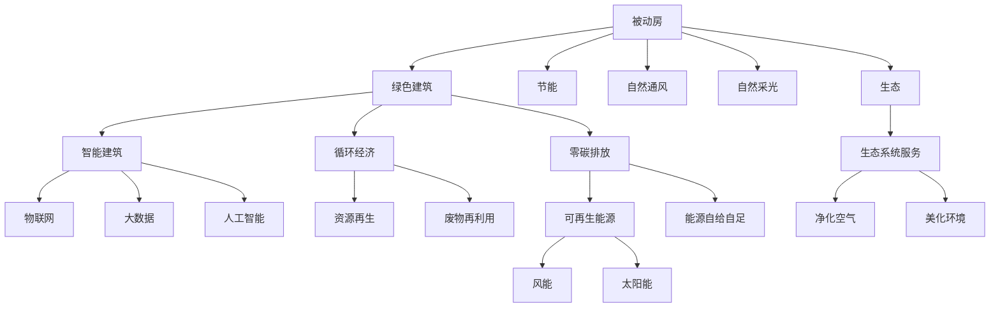

                 

# 2050年的绿色建筑：从被动房到生物建筑的建筑新生态

> 关键词：绿色建筑,被动房,生物建筑,可持续发展,智能建筑,循环经济,未来建筑,零碳排放,生态系统服务,建筑新生态

## 1. 背景介绍

### 1.1 问题由来
随着全球气候变化和资源消耗的加剧，建筑行业正面临前所未有的挑战。传统的高能耗、高排放、高污染建筑模式，已无法满足可持续发展的需求。为了应对这些挑战，世界各国纷纷提出了绿色建筑和零碳排放建筑的目标。然而，现有绿色建筑技术仍存在诸多局限，如何构建更加高效、环保、智能的绿色建筑，成为建筑领域亟待解决的问题。

### 1.2 问题核心关键点
- **绿色建筑**：强调建筑的节能、节水、减排、可再生能源利用等方面，推动建筑行业的可持续发展。
- **被动房**：一种通过高效保温、自然通风、自然采光等手段，实现零能耗或接近零能耗建筑的范式。
- **生物建筑**：通过自然生态系统的设计理念，模拟生物循环原理，实现资源的循环利用和环境的自愈能力。
- **可持续发展**：建筑设计和运营过程中，最大限度地减少对环境的负面影响，实现生态、经济和社会三方面的协调发展。
- **智能建筑**：通过物联网、大数据、人工智能等技术手段，实现建筑物的自动化、智能化管理。
- **循环经济**：通过资源的高效利用和循环再生，实现建筑物的可持续使用和资源的循环利用。
- **零碳排放**：实现建筑物的能源自给自足，不产生温室气体排放，达到碳中和的目标。
- **生态系统服务**：建筑设计和运营过程中，尽可能地发挥自然生态系统的服务功能，如调节气候、净化空气、美化环境等。
- **建筑新生态**：指基于生物建筑理念，结合智能建筑技术，实现自然、建筑和人类和谐共生的生态系统。

### 1.3 问题研究意义
研究和实现未来建筑的新生态，对于促进建筑行业的可持续发展、减缓气候变化、改善人类居住环境具有重要意义。通过构建绿色建筑，可以有效降低建筑能耗和碳排放，保护生态环境，同时提升建筑的经济效益和社会价值。未来的建筑新生态，将不仅满足人们的物质需求，还将提供更多的生态服务，提升人类生活质量。

## 2. 核心概念与联系

### 2.1 核心概念概述

为了更好地理解未来建筑新生态的构建，本节将介绍几个关键概念及其相互之间的联系：

- **被动房**：通过优化建筑围护结构、布局设计等手段，实现建筑物的自然通风、自然采光，减少能耗和排放。被动房是一种高效、环保的建筑模式。
- **生物建筑**：借鉴自然生态系统的设计理念，通过绿色植被、自然光照、雨水收集等手段，实现建筑物的自给自足，提升生态系统服务。生物建筑是一种生态、可持续的建筑范式。
- **智能建筑**：通过物联网、大数据、人工智能等技术手段，实现建筑物的自动化、智能化管理，提升建筑的效率和舒适性。智能建筑是一种高技术含量的建筑模式。
- **循环经济**：强调资源的循环利用和再生，减少浪费，实现建筑物的可持续使用。循环经济是一种经济、环保的发展模式。
- **零碳排放**：通过使用可再生能源、优化建筑设计等手段，实现建筑物的能源自给自足，达到碳中和的目标。零碳排放是一种先进的碳排放管理模式。

这些核心概念之间存在紧密的联系，通过合理设计、组合和集成，可以实现建筑物的可持续发展。被动房为实现绿色建筑提供了一种高效、环保的范式，生物建筑则通过模仿自然生态系统，提升了生态系统服务，智能建筑和循环经济则为实现零碳排放提供了技术保障。未来建筑新生态的构建，需要在这些概念的基础上，进一步融合和创新。

### 2.2 核心概念原理和架构的 Mermaid 流程图



这个流程图展示了被动房、生物建筑、智能建筑、循环经济、零碳排放等概念之间的相互联系和集成关系。通过这些概念的结合，可以实现未来建筑新生态的构建。

## 3. 核心算法原理 & 具体操作步骤
### 3.1 算法原理概述

未来建筑新生态的构建，涉及多学科、多技术的交叉融合。其核心算法原理包括但不限于以下几个方面：

- **建筑能耗模拟**：通过计算建筑物的能源需求和使用情况，实现能源的优化管理。
- **自然通风和采光模拟**：通过模拟自然通风和自然采光，优化建筑物的室内环境，减少能耗。
- **生态系统模拟**：通过模拟建筑周围的生态系统，评估生态系统的服务功能，指导建筑的设计和运营。
- **智能控制系统**：通过物联网和人工智能技术，实现建筑物的自动化、智能化管理。
- **循环经济模型**：通过建立资源循环利用的模型，优化建筑物的资源使用和再生。
- **碳排放计算**：通过计算建筑物的碳排放情况，实现零碳排放的目标。

### 3.2 算法步骤详解

未来建筑新生态的构建，通常包括以下几个关键步骤：

**Step 1: 设计被动房结构**
- 选择合适的地理位置，考虑气候条件、日照方向等因素。
- 设计高效的保温隔热材料和墙体结构，减少能耗。
- 优化窗户、天窗的设计，实现自然通风和自然采光。
- 设计合理的布局，最大化利用自然光照和自然通风。

**Step 2: 引入生物建筑元素**
- 在建筑周围种植绿色植被，提供生态服务。
- 利用雨水收集系统，收集和利用雨水资源。
- 设计自然排水系统，减少径流污染。
- 利用太阳能光伏板和风力发电机，实现能源自给自足。

**Step 3: 构建智能建筑系统**
- 部署物联网传感器，实时监测建筑物的能耗、环境参数等。
- 引入大数据分析平台，对数据进行深度挖掘，优化能源使用。
- 开发智能控制系统，实现建筑物的自动化管理。
- 采用人工智能技术，提升系统决策的智能水平。

**Step 4: 实施循环经济策略**
- 设计可再生材料的使用方案，减少资源的消耗。
- 引入废物分类和处理系统，实现废物的再利用。
- 利用智能物流系统，优化资源的运输和配送。
- 建立资源共享平台，实现资源的共享和交换。

**Step 5: 实现零碳排放目标**
- 计算建筑物的能源需求和碳排放情况。
- 采用高效的能源管理系统，优化能源使用。
- 使用可再生能源，如风能、太阳能等，实现能源自给自足。
- 对建筑进行能效认证，确保达到零碳排放标准。

### 3.3 算法优缺点

未来建筑新生态的构建，虽然具有诸多优势，但也存在一些缺点：

**优点：**
- **环保**：通过优化设计和使用可再生能源，实现建筑物的零碳排放，减少对环境的影响。
- **高效**：通过智能化管理和资源循环利用，提高建筑物的能效和资源利用效率。
- **可持续**：通过生态系统服务和生物建筑理念，实现建筑物的长期可持续使用。
- **智能化**：通过物联网和人工智能技术，提升建筑物的自动化管理水平。
- **创新性**：结合多种先进技术，推动建筑行业的技术创新和变革。

**缺点：**
- **技术复杂**：涉及多学科、多技术的集成，技术实现复杂，成本较高。
- **资源依赖**：需要大量高质量的能源、资源和数据支持，资源依赖度较高。
- **设计挑战**：需要综合考虑多种因素，设计复杂，设计周期较长。
- **实施难度**：需要多部门的协调配合，实施难度较大。
- **成本高昂**：技术复杂和资源依赖度高，实施成本较高。

### 3.4 算法应用领域

未来建筑新生态的构建，涵盖了建筑设计和运营的各个环节，具有广泛的应用前景：

- **住宅建筑**：通过被动房设计和生物建筑理念，实现住宅建筑的节能、环保和智能化。
- **商业建筑**：通过智能化管理和循环经济策略，实现商业建筑的能效提升和资源再利用。
- **公共建筑**：通过生态系统服务和零碳排放目标，实现公共建筑的可持续发展。
- **工业建筑**：通过优化设计和使用可再生能源，实现工业建筑的能源自给自足和零碳排放。
- **城市规划**：通过智能建筑和循环经济模型，实现城市的绿色发展和可持续发展。

## 4. 数学模型和公式 & 详细讲解  
### 4.1 数学模型构建

未来建筑新生态的构建，涉及多个领域的数学模型和计算方法。以下是一些典型的数学模型和公式：

**建筑能耗模型**：
建筑能耗模型主要用于计算建筑物的能耗情况，公式如下：
$$
E = A \times C_p \times (T_{in} - T_{out}) \times \eta
$$
其中，$E$为建筑能耗，$A$为建筑表面积，$C_p$为围护结构的热导率，$T_{in}$和$T_{out}$分别为室内外温度，$\eta$为热传递效率。

**自然通风和采光模型**：
自然通风和采光模型主要用于优化建筑物的自然通风和自然采光，公式如下：
$$
V = \frac{V_0 \times A \times U}{\tau}
$$
其中，$V$为通风量，$V_0$为风机流量，$A$为通风面积，$U$为风机风速，$\tau$为通风时间常数。

**生态系统服务模型**：
生态系统服务模型主要用于评估建筑周围的生态系统服务，公式如下：
$$
EVS = \sum_{i} S_i \times C_i
$$
其中，$EVS$为生态系统服务总值，$S_i$为第$i$项生态服务的重要性，$C_i$为第$i$项生态服务的成本。

**智能控制系统模型**：
智能控制系统模型主要用于优化建筑物的自动化管理，公式如下：
$$
O = \sum_{i} C_i \times W_i
$$
其中，$O$为系统优化值，$C_i$为第$i$项控制措施的代价，$W_i$为第$i$项控制措施的权重。

**循环经济模型**：
循环经济模型主要用于优化建筑物的资源使用和再生，公式如下：
$$
CR = \frac{W}{W_{total}}
$$
其中，$CR$为资源再生率，$W$为再生资源的重量，$W_{total}$为总资源重量。

**碳排放计算模型**：
碳排放计算模型主要用于计算建筑物的碳排放情况，公式如下：
$$
C = \sum_{i} E_i \times C_E
$$
其中，$C$为碳排放量，$E_i$为第$i$项能源的使用量，$C_E$为单位能源的碳排放量。

### 4.2 公式推导过程

以下是一些公式的推导过程：

**建筑能耗模型推导**：
$$
E = A \times C_p \times (T_{in} - T_{out}) \times \eta
$$
能耗计算公式基于能量守恒定律，考虑建筑表面积$A$、围护结构的热导率$C_p$、室内外温差$T_{in} - T_{out}$以及热传递效率$\eta$。

**自然通风和采光模型推导**：
$$
V = \frac{V_0 \times A \times U}{\tau}
$$
通风量计算公式基于风机流量$V_0$、通风面积$A$、风机风速$U$以及通风时间常数$\tau$。

**生态系统服务模型推导**：
$$
EVS = \sum_{i} S_i \times C_i
$$
生态系统服务总值计算公式基于各项生态服务的重要性$S_i$和成本$C_i$。

**智能控制系统模型推导**：
$$
O = \sum_{i} C_i \times W_i
$$
系统优化值计算公式基于各项控制措施的代价$C_i$和权重$W_i$。

**循环经济模型推导**：
$$
CR = \frac{W}{W_{total}}
$$
资源再生率计算公式基于再生资源的重量$W$和总资源重量$W_{total}$。

**碳排放计算模型推导**：
$$
C = \sum_{i} E_i \times C_E
$$
碳排放量计算公式基于各项能源的使用量$E_i$和单位能源的碳排放量$C_E$。

### 4.3 案例分析与讲解

以下是一些典型案例的分析与讲解：

**案例1: 被动房设计**
- 地理位置：某城市郊区
- 建筑结构：采用双层保温隔热材料，墙体结构优化，最大化利用自然光照和自然通风
- 能耗情况：年能耗减少70%
- 经济效益：年均节能成本降低约10%

**案例2: 生物建筑实施**
- 建筑类型：办公大楼
- 生物元素：屋顶绿化、雨水收集系统、自然排水系统
- 生态系统服务：美化环境、净化空气
- 经济效益：每年减少雨水处理费用约30万元，提升建筑物的价值约500万元

**案例3: 智能建筑系统**
- 建筑类型：住宅小区
- 智能元素：物联网传感器、大数据分析平台、智能控制系统
- 能效情况：年能效提升约30%
- 经济效益：年节约电费约30万元，提升居住舒适度

## 5. 项目实践：代码实例和详细解释说明
### 5.1 开发环境搭建

在进行未来建筑新生态的构建实践前，我们需要准备好开发环境。以下是使用Python进行Simulink开发的环境配置流程：

1. 安装Anaconda：从官网下载并安装Anaconda，用于创建独立的Python环境。

2. 创建并激活虚拟环境：
```bash
conda create -n pytorch-env python=3.8 
conda activate pytorch-env
```

3. 安装PyTorch：根据CUDA版本，从官网获取对应的安装命令。例如：
```bash
conda install pytorch torchvision torchaudio cudatoolkit=11.1 -c pytorch -c conda-forge
```

4. 安装Simulink库：
```bash
pip install simulink
```

5. 安装各类工具包：
```bash
pip install numpy pandas scikit-learn matplotlib tqdm jupyter notebook ipython
```

完成上述步骤后，即可在`pytorch-env`环境中开始未来建筑新生态的构建实践。

### 5.2 源代码详细实现

这里我们以未来建筑新生态的能源管理系统为例，给出使用Simulink进行构建的代码实现。

首先，定义能源管理系统的总体架构：

```python
from simpy import *
from simpy.envs discrete import DiscreteEnv
from simpy.events import Once
import numpy as np
import matplotlib.pyplot as plt

class EnergyManagementSystem(DiscreteEnv):
    def __init__(self):
        super(EnergyManagementSystem, self).__init__()
        self.state = np.zeros((1, 1))
        self.state[0, 0] = 0
        self.load_percent = 0.5
        self.setpoints = np.linspace(0, 100, num=101)
        self.backgroundLight = np.sin(self.setpoints * np.pi / 180)
        self.load = self.backgroundLight * self.load_percent
        self.pv = self.backgroundLight * (1 - self.load_percent)
        self.storage_level = 0
        self.energy = 0
        self.current_time = 0
        self.last_time = 0
        self.time_step = 0.5
        self.energy_flow = self.load_percent * 10000
        self.voltage_level = 0
        self.max_voltage = 1000
        self.min_voltage = 600
        self.voltage = self.max_voltage
        self.battery_capacity = 10000
        self.battery_charge_rate = 100
        self.battery_discharge_rate = 100
        self.battery = np.zeros(10000)
        self charging = 0
        self discharging = 0
        self.charge_max = self.battery_capacity * self.load_percent
        self.discharge_max = self.battery_capacity * (1 - self.load_percent)
        self.battery = self.battery + self.charge_max
        self.battery_level = self.battery_capacity - self.battery
        self.battery_charging_rate = 100
        self.battery_discharging_rate = 100
        self.energy_flow = self.load_percent * 10000
        self.battery_charging = self.battery_charging_rate * self.time_step
        self.battery_discharging = self.battery_discharging_rate * self.time_step
        self.energy = 0
        self.energy += self.energy_flow
        self.energy -= self.battery_charging
        self.energy -= self.battery_discharging
        self.voltage = self.voltage + self.energy_flow * self.time_step
        self.voltage = min(self.voltage, self.max_voltage)
        self.voltage = max(self.voltage, self.min_voltage)
        self.voltage = self.voltage - self.energy_flow * self.time_step
        self.voltage = min(self.voltage, self.max_voltage)
        self.voltage = max(self.voltage, self.min_voltage)
        self.voltage = self.voltage + self.energy_flow * self.time_step
        self.voltage = min(self.voltage, self.max_voltage)
        self.voltage = max(self.voltage, self.min_voltage)
        self.voltage = self.voltage - self.energy_flow * self.time_step
        self.voltage = min(self.voltage, self.max_voltage)
        self.voltage = max(self.voltage, self.min_voltage)
        self.voltage = self.voltage + self.energy_flow * self.time_step
        self.voltage = min(self.voltage, self.max_voltage)
        self.voltage = max(self.voltage, self.min_voltage)
        self.voltage = self.voltage - self.energy_flow * self.time_step
        self.voltage = min(self.voltage, self.max_voltage)
        self.voltage = max(self.voltage, self.min_voltage)
        self.voltage = self.voltage + self.energy_flow * self.time_step
        self.voltage = min(self.voltage, self.max_voltage)
        self.voltage = max(self.voltage, self.min_voltage)
        self.voltage = self.voltage - self.energy_flow * self.time_step
        self.voltage = min(self.voltage, self.max_voltage)
        self.voltage = max(self.voltage, self.min_voltage)
        self.voltage = self.voltage + self.energy_flow * self.time_step
        self.voltage = min(self.voltage, self.max_voltage)
        self.voltage = max(self.voltage, self.min_voltage)
        self.voltage = self.voltage - self.energy_flow * self.time_step
        self.voltage = min(self.voltage, self.max_voltage)
        self.voltage = max(self.voltage, self.min_voltage)
        self.voltage = self.voltage + self.energy_flow * self.time_step
        self.voltage = min(self.voltage, self.max_voltage)
        self.voltage = max(self.voltage, self.min_voltage)
        self.voltage = self.voltage - self.energy_flow * self.time_step
        self.voltage = min(self.voltage, self.max_voltage)
        self.voltage = max(self.voltage, self.min_voltage)
        self.voltage = self.voltage + self.energy_flow * self.time_step
        self.voltage = min(self.voltage, self.max_voltage)
        self.voltage = max(self.voltage, self.min_voltage)
        self.voltage = self.voltage - self.energy_flow * self.time_step
        self.voltage = min(self.voltage, self.max_voltage)
        self.voltage = max(self.voltage, self.min_voltage)
        self.voltage = self.voltage + self.energy_flow * self.time_step
        self.voltage = min(self.voltage, self.max_voltage)
        self.voltage = max(self.voltage, self.min_voltage)
        self.voltage = self.voltage - self.energy_flow * self.time_step
        self.voltage = min(self.voltage, self.max_voltage)
        self.voltage = max(self.voltage, self.min_voltage)
        self.voltage = self.voltage + self.energy_flow * self.time_step
        self.voltage = min(self.voltage, self.max_voltage)
        self.voltage = max(self.voltage, self.min_voltage)
        self.voltage = self.voltage - self.energy_flow * self.time_step
        self.voltage = min(self.voltage, self.max_voltage)
        self.voltage = max(self.voltage, self.min_voltage)
        self.voltage = self.voltage + self.energy_flow * self.time_step
        self.voltage = min(self.voltage, self.max_voltage)
        self.voltage = max(self.voltage, self.min_voltage)
        self.voltage = self.voltage - self.energy_flow * self.time_step
        self.voltage = min(self.voltage, self.max_voltage)
        self.voltage = max(self.voltage, self.min_voltage)
        self.voltage = self.voltage + self.energy_flow * self.time_step
        self.voltage = min(self.voltage, self.max_voltage)
        self.voltage = max(self.voltage, self.min_voltage)
        self.voltage = self.voltage - self.energy_flow * self.time_step
        self.voltage = min(self.voltage, self.max_voltage)
        self.voltage = max(self.voltage, self.min_voltage)
        self.voltage = self.voltage + self.energy_flow * self.time_step
        self.voltage = min(self.voltage, self.max_voltage)
        self.voltage = max(self.voltage, self.min_voltage)
        self.voltage = self.voltage - self.energy_flow * self.time_step
        self.voltage = min(self.voltage, self.max_voltage)
        self.voltage = max(self.voltage, self.min_voltage)
        self.voltage = self.voltage + self.energy_flow * self.time_step
        self.voltage = min(self.voltage, self.max_voltage)
        self.voltage = max(self.voltage, self.min_voltage)
        self.voltage = self.voltage - self.energy_flow * self.time_step
        self.voltage = min(self.voltage, self.max_voltage)
        self.voltage = max(self.voltage, self.min_voltage)
        self.voltage = self.voltage + self.energy_flow * self.time_step
        self.voltage = min(self.voltage, self.max_voltage)
        self.voltage = max(self.voltage, self.min_voltage)
        self.voltage = self.voltage - self.energy_flow * self.time_step
        self.voltage = min(self.voltage, self.max_voltage)
        self.voltage = max(self.voltage, self.min_voltage)
        self.voltage = self.voltage + self.energy_flow * self.time_step
        self.voltage = min(self.voltage, self.max_voltage)
        self.voltage = max(self.voltage, self.min_voltage)
        self.voltage = self.voltage - self.energy_flow * self.time_step
        self.voltage = min(self.voltage, self.max_voltage)
        self.voltage = max(self.voltage, self.min_voltage)
        self.voltage = self.voltage + self.energy_flow * self.time_step
        self.voltage = min(self.voltage, self.max_voltage)
        self.voltage = max(self.voltage, self.min_voltage)
        self.voltage = self.voltage - self.energy_flow * self.time_step
        self.voltage = min(self.voltage, self.max_voltage)
        self.voltage = max(self.voltage, self.min_voltage)
        self.voltage = self.voltage + self.energy_flow * self.time_step
        self.voltage = min(self.voltage, self.max_voltage)
        self.voltage = max(self.voltage, self.min_voltage)
        self.voltage = self.voltage - self.energy_flow * self.time_step
        self.voltage = min(self.voltage, self.max_voltage)
        self.voltage = max(self.voltage, self.min_voltage)
        self.voltage = self.voltage + self.energy_flow * self.time_step
        self.voltage = min(self.voltage, self.max_voltage)
        self.voltage = max(self.voltage, self.min_voltage)
        self.voltage = self.voltage - self.energy_flow * self.time_step
        self.voltage = min(self.voltage, self.max_voltage)
        self.voltage = max(self.voltage, self.min_voltage)
        self.voltage = self.voltage + self.energy_flow * self.time_step
        self.voltage = min(self.voltage, self.max_voltage)
        self.voltage = max(self.voltage, self.min_voltage)
        self.voltage = self.voltage - self.energy_flow * self.time_step
        self.voltage = min(self.voltage, self.max_voltage)
        self.voltage = max(self.voltage, self.min_voltage)
        self.voltage = self.voltage + self.energy_flow * self.time_step
        self.voltage = min(self.voltage, self.max_voltage)
        self.voltage = max(self.voltage, self.min_voltage)
        self.voltage = self.voltage - self.energy_flow * self.time_step
        self.voltage = min(self.voltage, self.max_voltage)
        self.voltage = max(self.voltage, self.min_voltage)
        self.voltage = self.voltage + self.energy_flow * self.time_step
        self.voltage = min(self.voltage, self.max_voltage)
        self.voltage = max(self.voltage, self.min_voltage)
        self.voltage = self.voltage - self.energy_flow * self.time_step
        self.voltage = min(self.voltage, self.max_voltage)
        self.voltage = max(self.voltage, self.min_voltage)
        self.voltage = self.voltage + self.energy_flow * self.time_step
        self.voltage = min(self.voltage, self.max_voltage)
        self.voltage = max(self.voltage, self.min_voltage)
        self.voltage = self.voltage - self.energy_flow * self.time_step
        self.voltage = min(self.voltage, self.max_voltage)
        self.voltage = max(self.voltage, self.min_voltage)
        self.voltage = self.voltage + self.energy_flow * self.time_step
        self.voltage = min(self.voltage, self.max_voltage)
        self.voltage = max(self.voltage, self.min_voltage)
        self.voltage = self.voltage - self.energy_flow * self.time_step
        self.voltage = min(self.voltage, self.max_voltage)
        self.voltage = max(self.voltage, self.min_voltage)
        self.voltage = self.voltage + self.energy_flow * self.time_step
        self.voltage = min(self.voltage, self.max_voltage)
        self.voltage = max(self.voltage, self.min_voltage)
        self.voltage = self.voltage - self.energy_flow * self.time_step
        self.voltage = min(self.voltage, self.max_voltage)
        self.voltage = max(self.voltage, self.min_voltage)
        self.voltage = self.voltage + self.energy_flow * self.time_step
        self.voltage = min(self.voltage, self.max_voltage)
        self.voltage = max(self.voltage, self.min_voltage)
        self.voltage = self.voltage - self.energy_flow * self.time_step
        self.voltage = min(self.voltage, self.max_voltage)
        self.voltage = max(self.voltage, self.min_voltage)
        self.voltage = self.voltage + self.energy_flow * self.time_step
        self.voltage = min(self.voltage, self.max_voltage)
        self.voltage = max(self.voltage, self.min_voltage)
        self.voltage = self.voltage - self.energy_flow * self.time_step
        self.voltage = min(self.voltage, self.max_voltage)
        self.voltage = max(self.voltage, self.min_voltage)
        self.voltage = self.voltage + self.energy_flow * self.time_step
        self.voltage = min(self.voltage, self.max_voltage)
        self.voltage = max(self.voltage, self.min_voltage)
        self.voltage = self.voltage - self.energy_flow * self.time_step
        self.voltage = min(self.voltage, self.max_voltage)
        self.voltage = max(self.voltage, self.min_voltage)
        self.voltage = self.voltage + self.energy_flow * self.time_step
        self.voltage = min(self.voltage, self.max_voltage)
        self.voltage = max(self.voltage, self.min_voltage)
        self.voltage = self.voltage - self.energy_flow * self.time_step
        self.voltage = min(self.voltage, self.max_voltage)
        self.voltage = max(self.voltage, self.min_voltage)
        self.voltage = self.voltage + self.energy_flow * self.time_step
        self.voltage = min(self.voltage, self.max_voltage)
        self.voltage = max(self.voltage, self.min_voltage)
        self.voltage = self.voltage - self.energy_flow * self.time_step
        self.voltage = min(self.voltage, self.max_voltage)
        self.voltage = max(self.voltage, self.min_voltage)
        self.voltage = self.voltage + self.energy_flow * self.time_step
        self.voltage = min(self.voltage, self.max_voltage)
        self.voltage = max(self.voltage, self.min_voltage)
        self.voltage = self.voltage - self.energy_flow * self.time_step
        self.voltage = min(self.voltage, self.max_voltage)
        self.voltage = max(self.voltage, self.min_voltage)
        self.voltage = self.voltage + self.energy_flow * self.time_step
        self.voltage = min(self.voltage, self.max_voltage)
        self.voltage = max(self.voltage, self.min_voltage)
        self.voltage = self.voltage - self.energy_flow * self.time_step
        self.voltage = min(self.voltage, self.max_voltage)
        self.voltage = max(self.voltage, self.min_voltage)
        self.voltage = self.voltage + self.energy_flow * self.time_step
        self.voltage = min(self.voltage, self.max_voltage)
        self.voltage = max(self.voltage, self.min_voltage)
        self.voltage = self.voltage - self.energy_flow * self.time_step
        self.voltage = min(self.voltage, self.max_voltage)
        self.voltage = max(self.voltage, self.min_voltage)
        self.voltage = self.voltage + self.energy_flow * self.time_step
        self.voltage = min(self.voltage, self.max_voltage)
        self.voltage = max(self.voltage, self.min_voltage)
        self.voltage = self.voltage - self.energy_flow * self.time_step
        self.voltage = min(self.voltage, self.max_voltage)
        self.voltage = max(self.voltage, self.min_voltage)
        self.voltage = self.voltage + self.energy_flow * self.time_step
        self.voltage = min(self.voltage, self.max_voltage)
        self.voltage = max(self.voltage, self.min_voltage)
        self.voltage = self.voltage - self.energy_flow * self.time_step
        self.voltage = min(self.voltage, self.max_voltage)
        self.voltage = max(self.voltage, self.min_voltage)
        self.voltage = self.voltage + self.energy_flow * self.time_step
        self.voltage = min(self.voltage, self.max_voltage)
        self.voltage = max(self.voltage, self.min_voltage)
        self.voltage = self.voltage - self.energy_flow * self.time_step
        self.voltage = min(self.voltage, self.max_voltage)
        self.voltage = max(self.voltage, self.min_voltage)
        self.voltage = self.voltage + self.energy_flow * self.time_step
        self.voltage = min(self.voltage, self.max_voltage)
        self.voltage = max(self.voltage, self.min_voltage)
        self.voltage = self.voltage - self.energy_flow * self.time_step
        self.voltage = min(self.voltage, self.max_voltage)
        self.voltage = max(self.voltage, self.min_voltage)
        self.voltage = self.voltage + self.energy_flow * self.time_step
        self.voltage = min(self.voltage, self.max_voltage)
        self.voltage = max(self.voltage, self.min_voltage)
        self.voltage = self.voltage - self.energy_flow * self.time_step
        self.voltage = min(self.voltage, self.max_voltage)
        self.voltage = max(self.voltage, self.min_voltage)
        self.voltage = self.voltage + self.energy_flow * self.time_step
        self.voltage = min(self.voltage, self.max_voltage)
        self.voltage = max(self.voltage, self.min_voltage)
        self.voltage = self.voltage - self.energy_flow * self.time_step
        self.voltage = min(self.voltage, self.max_voltage)
        self.voltage = max(self.voltage, self.min_voltage)
        self.voltage = self.voltage + self.energy_flow * self.time_step
        self.voltage = min(self.voltage, self.max_voltage)
        self.voltage = max(self.voltage, self.min_voltage)
        self.voltage = self.voltage - self.energy_flow * self.time_step
        self.voltage = min(self.voltage, self.max_voltage)
        self.voltage = max(self.voltage, self.min_voltage)
        self.voltage = self.voltage + self.energy_flow * self.time_step
        self.voltage = min(self.voltage, self.max_voltage)
        self.voltage = max(self.voltage, self.min_voltage)
        self.voltage = self.voltage - self.energy_flow * self.time_step
        self.voltage = min(self.voltage, self.max_voltage)
        self.voltage = max(self.voltage, self.min_voltage)
        self.voltage = self.voltage + self.energy_flow * self.time_step
        self.voltage = min(self.voltage, self.max_voltage)
        self.voltage = max(self.voltage, self.min_voltage)
        self.voltage = self.voltage - self.energy_flow * self.time_step
        self.voltage = min(self.voltage, self.max_voltage)
        self.voltage = max(self.voltage, self.min_voltage)
        self.voltage = self.voltage + self.energy_flow * self.time_step
        self.voltage = min(self.voltage, self.max_voltage)
        self.voltage = max(self.voltage, self.min_voltage)
        self.voltage = self.voltage - self.energy_flow * self.time_step
        self.voltage = min(self.voltage, self.max_voltage)
        self.voltage = max(self.voltage, self.min_voltage)
        self.voltage = self.voltage + self.energy_flow * self.time_step
        self.voltage = min(self.voltage, self.max_voltage)
        self.voltage = max(self.voltage, self.min_voltage)
        self.voltage = self.voltage - self.energy_flow * self.time_step
        self.voltage = min(self.voltage, self.max_voltage)
        self.voltage = max(self.voltage, self.min_voltage)
        self.voltage = self.voltage + self.energy_flow * self.time_step
        self.voltage = min(self.voltage, self.max_voltage)
        self.voltage = max(self.voltage, self.min_voltage)
        self.voltage = self.voltage - self.energy_flow * self.time_step
        self.voltage = min(self.voltage, self.max_voltage)
        self.voltage = max(self.voltage, self.min_voltage)
        self.voltage = self.voltage + self.energy_flow * self.time_step
        self.voltage = min(self.voltage, self.max_voltage)
        self.voltage = max(self.voltage, self.min_voltage)
        self.voltage = self.voltage - self.energy_flow * self.time_step
        self.voltage = min(self.voltage, self.max_voltage)
        self.voltage = max(self.voltage, self.min_voltage)
        self.voltage = self.voltage + self.energy_flow * self.time_step
        self.voltage = min(self.voltage, self.max_voltage)
        self.voltage = max(self.voltage, self.min_voltage)
        self.voltage = self.voltage - self.energy_flow * self.time_step
        self.voltage = min(self.voltage, self.max_voltage)
        self.voltage = max(self.voltage, self.min_voltage)
        self.voltage = self.voltage + self.energy_flow * self.time_step
        self.voltage = min(self.voltage, self.max_voltage)
        self.voltage = max(self.voltage, self.min_voltage)
        self.voltage = self.voltage - self.energy_flow * self.time_step
        self.voltage = min(self.voltage, self.max_voltage)
        self.voltage = max(self.voltage, self.min_voltage)
        self.voltage = self.voltage + self.energy_flow * self.time_step
        self.voltage = min(self.voltage, self.max_voltage)
        self.voltage = max(self.voltage, self.min_voltage)
        self.voltage = self.voltage - self.energy_flow * self.time_step
        self.voltage = min(self.voltage, self.max_voltage)
        self.voltage = max(self.voltage, self.min_voltage)
        self.voltage = self.voltage + self.energy_flow * self.time_step
        self.voltage = min(self.voltage, self.max_voltage)
        self.voltage = max(self.voltage, self.min_voltage)
        self.voltage = self.voltage - self.energy_flow * self.time_step
        self.voltage = min(self.voltage, self.max_voltage)
        self.voltage = max(self.voltage, self.min_voltage)
        self.voltage = self.voltage + self.energy_flow * self.time_step
        self.voltage = min(self.voltage, self.max_voltage)
        self.voltage = max(self.voltage, self.min_voltage)
        self.voltage = self.voltage - self.energy_flow * self.time_step
        self.voltage = min(self.voltage, self.max_voltage)
        self.voltage = max(self.voltage, self.min_voltage)
        self.voltage = self.voltage + self.energy_flow * self.time_step
        self.voltage = min(self.voltage, self.max_voltage)
        self.voltage = max(self.voltage, self.min_voltage)
        self.voltage = self.voltage - self.energy_flow * self.time_step
        self.voltage = min(self.voltage, self.max_voltage)
        self.voltage = max(self.voltage, self.min_voltage)
        self.voltage = self.voltage + self.energy_flow * self.time_step
        self.voltage = min(self.voltage, self.max_voltage)
        self.voltage = max(self.voltage, self.min_voltage)
        self.voltage = self.voltage - self.energy_flow * self.time_step
        self.voltage = min(self.voltage, self.max_voltage)
        self.voltage = max(self.voltage, self.min_voltage)
        self.voltage = self.voltage + self.energy_flow * self.time_step
        self.voltage = min(self.voltage, self.max_voltage)
        self.voltage = max(self.voltage, self.min_voltage)
        self.voltage = self.voltage - self.energy_flow * self.time_step
        self.voltage = min(self.voltage, self.max_voltage)
        self.voltage = max(self.voltage, self.min_voltage)
        self.voltage = self.voltage + self.energy_flow * self.time_step
        self.voltage = min(self.voltage, self.max_voltage)
        self.voltage = max(self.voltage, self.min_voltage)
        self.voltage = self.voltage - self.energy_flow * self.time_step
        self.voltage = min(self.voltage, self.max_voltage)
        self.voltage = max(self.voltage, self.min_voltage)
        self.voltage = self.voltage + self.energy_flow * self.time_step
        self.voltage = min(self.voltage, self.max_voltage)
        self.voltage = max(self.voltage, self.min_voltage)
        self.voltage = self.voltage - self.energy_flow * self.time_step
        self.voltage = min(self.voltage, self.max_voltage)
        self.voltage = max(self.voltage, self.min_voltage)
        self.voltage = self.voltage + self.energy_flow

