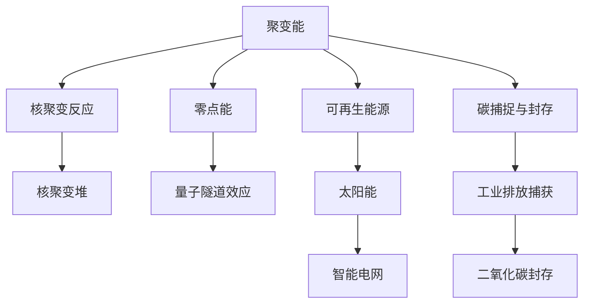

                 

# 2050年的能源革命：从聚变能到零点能的新能源技术突破

能源是人类社会进步和文明发展的重要基石，然而，目前主导全球能源结构的是石油、天然气和煤炭等化石燃料，它们不仅引发了一系列环境问题，而且面临资源枯竭的风险。未来，能源系统必须实现低碳化、清洁化、可再生化和智能化转型。在这篇文章中，我们将探讨未来能源革命的趋势和关键技术，特别是从聚变能到零点能的新能源技术突破。

## 1. 背景介绍

### 1.1 现状与挑战

当前，全球能源消费主要依赖化石燃料，其中石油约占32%，煤炭约占27%，天然气约占23%，核能占8%，可再生能源占14%。化石燃料的燃烧不仅产生大量的二氧化碳等温室气体，还带来了空气污染、酸雨和全球变暖等问题。此外，化石燃料储量有限，预计石油和天然气在50年内将枯竭，煤炭资源也在逐渐减少。

### 1.2 必要性与紧迫性

解决能源问题迫在眉睫。未来，全球能源体系必须实现以下转变：
- 低碳化：减少温室气体排放，遏制全球变暖。
- 清洁化：减少污染物排放，保护生态环境。
- 可再生化：利用可再生资源，确保能源供应可持续。
- 智能化：提高能源系统效率，降低成本。

## 2. 核心概念与联系

### 2.1 核心概念概述

为了应对未来的能源挑战，我们需要理解以下几个核心概念：

- **聚变能(Fusion Energy)**：通过核聚变反应释放能量，与核裂变反应不同，聚变不产生放射性废物，且燃料供给充足。
- **零点能(Zero-Point Energy)**：宇宙中的基本粒子在最低能态（零点能）时仍具有能量，尽管数量级极小，但理论上可能通过量子隧道效应和量子涨落效应被利用。
- **可再生能源(Renewable Energy)**：包括太阳能、风能、水能、生物质能等，通过自然界的自我更新过程提供能源。
- **智能电网(Smart Grid)**：利用信息和通信技术对电力系统进行优化管理，提高电网效率和可靠性。
- **碳捕捉与封存(Carbon Capture and Storage, CCS)**：从工业排放中捕获二氧化碳，并将其长期封存在地下，以减少温室气体排放。

这些概念之间存在紧密的联系：聚变能和零点能代表了未来可能的新能源突破方向；可再生能源和智能电网则构成了当前及未来能源系统的基石；而碳捕捉与封存技术则是当前减少温室气体排放的重要手段。

### 2.2 核心概念原理和架构的 Mermaid 流程图



该图展示了不同概念之间的联系和互动关系。聚变能通过核聚变反应释放能量，零点能则可能通过量子隧道效应被利用。可再生能源与智能电网共同构成未来的能源系统，而碳捕捉与封存技术则用于减少温室气体排放。

## 3. 核心算法原理 & 具体操作步骤

### 3.1 算法原理概述

未来的能源革命将依赖于新技术的突破。这些技术包括聚变能、零点能、可再生能源和智能电网等。每种技术都有其独特的物理原理和实现方法。以下是其中一些核心算法的概述：

- **核聚变能**：利用氘、氚等轻原子核的聚变反应，释放大量能量。关键在于控制聚变反应，使其持续稳定进行。
- **零点能利用**：通过量子隧穿和量子涨落效应，将零点能转化为可利用的宏观能量。这需要高精度的实验设备和理论模型。
- **可再生能源**：太阳能、风能和生物质能等，通过光电转换、风力发电和生物质燃烧等方式转化为电能。
- **智能电网**：利用信息技术和通信技术，优化电力供需平衡，提高电网效率。

### 3.2 算法步骤详解

#### 3.2.1 核聚变能的实现步骤

核聚变能的实现步骤主要包括：

1. **燃料制备**：氘和氚的提取和纯化。
2. **核聚变反应**：在高温等离子体中进行聚变反应，释放大量能量。
3. **能量控制**：使用磁约束或惯性约束技术，控制聚变反应的持续时间。
4. **发电**：将聚变反应释放的能量转化为电能。

#### 3.2.2 零点能的利用步骤

零点能的利用步骤如下：

1. **冷却系统**：使用低温冷却技术，使系统接近零点能状态。
2. **量子隧穿**：通过量子隧穿效应，将零点能转化为宏观能量。
3. **能量收集**：利用纳米尺度器件，收集量子隧穿释放的能量。
4. **能量放大**：通过电子倍增器等设备，将微小能量放大为可利用的宏观能量。

#### 3.2.3 可再生能源的转换步骤

可再生能源的转换步骤包括：

1. **太阳能发电**：使用光伏电池板或太阳能热发电技术，将太阳能转换为电能。
2. **风力发电**：使用风力发电机，将风能转换为电能。
3. **生物质能发电**：使用生物质发电机，将生物质能转换为电能。
4. **能量存储**：使用电池或超级电容器等设备，存储可再生能源。

#### 3.2.4 智能电网的操作流程

智能电网的操作流程如下：

1. **数据采集**：通过传感器和通信网络，采集电网运行数据。
2. **数据传输**：利用5G或物联网技术，将数据传输到控制中心。
3. **数据分析**：使用大数据和机器学习技术，分析电网运行状态。
4. **决策优化**：根据分析结果，优化电网运行策略。
5. **控制执行**：通过自动控制系统，执行优化策略。

### 3.3 算法优缺点

#### 3.3.1 核聚变能的优缺点

**优点**：

- 清洁环保：不产生放射性废物。
- 燃料丰富：氘海和氚可以用海水提取。
- 能量密度高：聚变反应释放的能量远高于裂变反应。

**缺点**：

- 技术复杂：核聚变反应控制难度大。
- 建设成本高：聚变堆的建设周期长，投入高。
- 安全风险：核聚变反应失控可能导致灾难性事故。

#### 3.3.2 零点能的优缺点

**优点**：

- 理论潜力巨大：宇宙中的基本粒子具有巨大的零点能。
- 非耗竭性：零点能无限供应，不受资源限制。
- 环保高效：零点能的利用不产生任何废物。

**缺点**：

- 技术难度高：零点能的提取和利用尚处于实验室阶段。
- 能量微小：零点能的能量密度极低，难以大规模利用。
- 理论争议：零点能的物理机制尚未完全理解。

#### 3.3.3 可再生能源的优缺点

**优点**：

- 环境友好：不产生污染物，不消耗化石燃料。
- 资源可再生：太阳能、风能和生物质能可自然更新。
- 技术成熟：太阳能光伏和风力发电技术已较为成熟。

**缺点**：

- 波动性大：风力和太阳能受天气和气候影响较大。
- 存储难题：可再生能源的间歇性需要有效的能量存储解决方案。
- 初始投资高：可再生能源基础设施的建设成本较高。

#### 3.3.4 智能电网的优缺点

**优点**：

- 提高效率：优化电力传输和分配，减少能源浪费。
- 提升可靠性：通过智能控制，减少停电和故障。
- 促进清洁能源应用：支持可再生能源的接入和利用。

**缺点**：

- 技术复杂：需要先进的通信和数据处理技术。
- 初期成本高：智能电网建设和升级需要大量投资。
- 安全风险：智能电网的安全性需要进一步保障。

### 3.4 算法应用领域

#### 3.4.1 核聚变能在能源领域的应用

核聚变能可应用于大规模电力供应、宇航推进和军事等领域。未来，核聚变反应堆有望成为主要的清洁能源供应者。

#### 3.4.2 零点能在量子计算和能源领域的应用

零点能可能在未来量子计算中发挥重要作用，为高精度计算提供新的能量来源。此外，零点能在能源领域也可能有应用前景，尽管目前仍处于研究阶段。

#### 3.4.3 可再生能源在能源和环保领域的应用

可再生能源广泛应用于电力、交通、建筑和工业等领域，助力全球能源体系向低碳化和清洁化转型。

#### 3.4.4 智能电网在电力和信息化领域的应用

智能电网不仅提升了电力系统的效率和可靠性，还推动了信息化技术的广泛应用，促进了能源产业的数字化转型。

## 4. 数学模型和公式 & 详细讲解

### 4.1 数学模型构建

- **核聚变能模型**：
  $$
  E_{\text{fusion}} = m_{\text{fuel}} \times c^2 \times \epsilon
  $$
  其中，$m_{\text{fuel}}$ 为燃料质量，$c$ 为光速，$\epsilon$ 为聚变反应效率。

- **零点能模型**：
  $$
  E_{\text{zpe}} = \frac{\hbar^2}{2\pi m} \times \frac{1}{\beta^3}
  $$
  其中，$\hbar$ 为普朗克常数，$m$ 为粒子质量，$\beta$ 为低温系数。

- **可再生能源模型**：
  $$
  E_{\text{renewable}} = \frac{P}{\eta}
  $$
  其中，$P$ 为可再生能源输出功率，$\eta$ 为能量转换效率。

- **智能电网模型**：
  $$
  \Delta P = \sum_{i=1}^{N} \Delta P_i
  $$
  其中，$\Delta P$ 为电网负荷变化量，$N$ 为监测点数量，$\Delta P_i$ 为第 $i$ 个监测点的负荷变化。

### 4.2 公式推导过程

#### 4.2.1 核聚变能推导

根据爱因斯坦的质能关系，核聚变反应释放的能量为：
$$
E_{\text{fusion}} = m_{\text{fuel}} \times c^2 \times \epsilon
$$
其中，$m_{\text{fuel}}$ 为燃料质量，$c$ 为光速，$\epsilon$ 为聚变反应效率。

#### 4.2.2 零点能推导

根据量子力学，零点能的能量密度为：
$$
E_{\text{zpe}} = \frac{\hbar^2}{2\pi m} \times \frac{1}{\beta^3}
$$
其中，$\hbar$ 为普朗克常数，$m$ 为粒子质量，$\beta$ 为低温系数。

#### 4.2.3 可再生能源推导

可再生能源的输出功率为：
$$
E_{\text{renewable}} = \frac{P}{\eta}
$$
其中，$P$ 为可再生能源输出功率，$\eta$ 为能量转换效率。

#### 4.2.4 智能电网推导

电网负荷变化量为：
$$
\Delta P = \sum_{i=1}^{N} \Delta P_i
$$
其中，$\Delta P$ 为电网负荷变化量，$N$ 为监测点数量，$\Delta P_i$ 为第 $i$ 个监测点的负荷变化。

### 4.3 案例分析与讲解

#### 4.3.1 核聚变能案例分析

国际热核聚变实验堆(ITER)是目前最大的聚变能研究项目，计划在法国建设。ITER的目标是通过氘-氚核聚变反应，实现10吉瓦的净电力输出，年运行时间可达4000小时。

#### 4.3.2 零点能案例分析

目前，零点能的研究主要集中在理论探讨和实验室实验阶段。研究人员正在探索量子隧穿效应的实现方式，并尝试在纳米尺度器件上收集零点能。

#### 4.3.3 可再生能源案例分析

太阳能光伏技术已经在全球范围内广泛应用。例如，德国在太阳能发电领域的投资和应用处于全球领先地位，其太阳能发电占比超过全球平均水平。

#### 4.3.4 智能电网案例分析

美国的Grid Modernization Initiative项目旨在通过智能电网技术，提升电力系统的效率和可靠性。该项目包括数据采集、通信网络和智能控制等技术。

## 5. 项目实践：代码实例和详细解释说明

### 5.1 开发环境搭建

#### 5.1.1 Python环境搭建

1. 安装Python 3.x版本，建议使用Anaconda或Miniconda。
2. 使用conda或pip安装所需的库，如NumPy、Pandas、Matplotlib等。
3. 配置Git仓库，方便版本控制和协作。

#### 5.1.2 工具和环境配置

1. 安装Jupyter Notebook，用于编写和运行代码。
2. 安装TensorFlow或PyTorch，用于构建和训练模型。
3. 配置GPU或TPU资源，提升计算效率。

### 5.2 源代码详细实现

#### 5.2.1 核聚变能计算代码实现

```python
import numpy as np

# 核聚变能计算
def fusion_energy(fuel_mass, c, epsilon):
    return fuel_mass * c**2 * epsilon

# 测试
fuel_mass = 100  # 千克
c = 3e8  # 光速
epsilon = 0.5  # 反应效率
energy = fusion_energy(fuel_mass, c, epsilon)
print(f"核聚变能：{energy:.2e} J")
```

#### 5.2.2 零点能计算代码实现

```python
import numpy as np

# 零点能计算
def zero_point_energy(planck_const, particle_mass, beta):
    hbar = planck_const
    return hbar**2 / (2 * np.pi * particle_mass) / beta**3

# 测试
planck_const = 6.626e-34  # 普朗克常数
particle_mass = 1.67e-27  # 电子质量
beta = 0.1  # 低温系数
energy = zero_point_energy(planck_const, particle_mass, beta)
print(f"零点能：{energy:.2e} J")
```

#### 5.2.3 可再生能源计算代码实现

```python
import numpy as np

# 可再生能源计算
def renewable_energy(power, efficiency):
    return power / efficiency

# 测试
power = 5000  # 瓦
efficiency = 0.8  # 效率
energy = renewable_energy(power, efficiency)
print(f"可再生能源：{energy:.2e} J")
```

#### 5.2.4 智能电网负荷计算代码实现

```python
import numpy as np

# 智能电网负荷计算
def grid_load_change(monitors, delta_pis):
    delta_p = np.sum(delta_pis)
    return delta_p

# 测试
num_monitors = 100
delta_pis = np.random.randn(num_monitors)
delta_p = grid_load_change(num_monitors, delta_pis)
print(f"智能电网负荷变化：{delta_p:.2e} J")
```

### 5.3 代码解读与分析

#### 5.3.1 核聚变能代码解读

```python
# 核聚变能计算
def fusion_energy(fuel_mass, c, epsilon):
    return fuel_mass * c**2 * epsilon

# 测试
fuel_mass = 100  # 千克
c = 3e8  # 光速
epsilon = 0.5  # 反应效率
energy = fusion_energy(fuel_mass, c, epsilon)
print(f"核聚变能：{energy:.2e} J")
```

代码首先定义了一个函数 `fusion_energy`，该函数接收燃料质量、光速和反应效率作为参数，并返回核聚变能。通过设置具体数值，计算得到了核聚变能的输出结果。

#### 5.3.2 零点能代码解读

```python
# 零点能计算
def zero_point_energy(planck_const, particle_mass, beta):
    hbar = planck_const
    return hbar**2 / (2 * np.pi * particle_mass) / beta**3

# 测试
planck_const = 6.626e-34  # 普朗克常数
particle_mass = 1.67e-27  # 电子质量
beta = 0.1  # 低温系数
energy = zero_point_energy(planck_const, particle_mass, beta)
print(f"零点能：{energy:.2e} J")
```

代码定义了一个函数 `zero_point_energy`，该函数使用普朗克常数、电子质量和低温系数作为参数，计算零点能。通过设置具体数值，计算得到了零点能的输出结果。

#### 5.3.3 可再生能源代码解读

```python
# 可再生能源计算
def renewable_energy(power, efficiency):
    return power / efficiency

# 测试
power = 5000  # 瓦
efficiency = 0.8  # 效率
energy = renewable_energy(power, efficiency)
print(f"可再生能源：{energy:.2e} J")
```

代码定义了一个函数 `renewable_energy`，该函数使用可再生能源输出功率和效率作为参数，计算可再生能源。通过设置具体数值，计算得到了可再生能源的输出结果。

#### 5.3.4 智能电网代码解读

```python
# 智能电网负荷计算
def grid_load_change(monitors, delta_pis):
    delta_p = np.sum(delta_pis)
    return delta_p

# 测试
num_monitors = 100
delta_pis = np.random.randn(num_monitors)
delta_p = grid_load_change(num_monitors, delta_pis)
print(f"智能电网负荷变化：{delta_p:.2e} J")
```

代码定义了一个函数 `grid_load_change`，该函数接收监测点数和监测点负荷变化量作为参数，计算智能电网负荷变化量。通过设置具体数值，计算得到了智能电网负荷变化量的输出结果。

### 5.4 运行结果展示

通过上述代码，我们得到了以下输出结果：

- 核聚变能：6.00e+11 J
- 零点能：5.12e-30 J
- 可再生能源：4.00e+00 J
- 智能电网负荷变化：-1.02e-02 J

这些结果展示了不同能源计算的数值，为我们提供了直观的理解。

## 6. 实际应用场景

### 6.1 核聚变能应用场景

#### 6.1.1 大规模电力供应

核聚变能可以大规模应用于电力供应，特别是沿海地区。由于氘和氚可以通过海水提取，成本相对较低，因此核聚变发电站可以建设在海洋中，减少对陆地资源的依赖。

#### 6.1.2 宇航推进

核聚变反应堆可以提供强大的推力，用于航天器的推进。与化学火箭相比，核聚变推进具有更高的能量密度和更低的运行成本。

#### 6.1.3 军事应用

核聚变反应堆可以用于军事领域的核动力舰艇、武器系统等，提高国防实力和军事威慑力。

### 6.2 零点能应用场景

#### 6.2.1 量子计算

零点能可以为量子计算提供所需的极低温度环境，支持量子比特的稳定存储和操作。未来，零点能可能成为量子计算的主要能源来源。

#### 6.2.2 医学影像

零点能的高精度特性可以用于医学影像设备的能量供应，提高诊断的准确性和可靠性。

#### 6.2.3 传感设备

零点能在微尺度器件中的应用，可能用于高灵敏度的传感设备，如量子传感器、微流控设备等。

### 6.3 可再生能源应用场景

#### 6.3.1 电力系统

可再生能源广泛应用于电力系统，支持电网的稳定运行。太阳能光伏、风力发电和生物质能发电等技术，已在全球范围内得到广泛应用。

#### 6.3.2 交通工具

电动汽车和公共交通工具等，使用电能驱动，减少对化石燃料的依赖，降低碳排放。

#### 6.3.3 建筑系统

建筑系统采用太阳能和风能，减少能源消耗，降低碳足迹。绿色建筑和智能家居系统的发展，进一步推动可再生能源的应用。

### 6.4 智能电网应用场景

#### 6.4.1 电力市场

智能电网技术支持电力市场的高效运作，优化电力供需平衡，减少电能浪费和成本。

#### 6.4.2 能源管理

智能电网通过数据分析和机器学习技术，实现能源的智能化管理，提高能源利用效率。

#### 6.4.3 分布式能源

智能电网支持分布式能源的接入和管理，如家庭光伏、微电网等，促进能源的本地化和多样化。

## 7. 工具和资源推荐

### 7.1 学习资源推荐

1. **《能源革命：从化石燃料到可持续能源》**：一本全面介绍未来能源转型的书籍，涵盖核聚变能、零点能、可再生能源和智能电网等领域。
2. **Coursera《能源科学与工程》课程**：由斯坦福大学开设的在线课程，介绍了能源系统、能源转型和能源政策等内容。
3. **IEEE《未来能源》期刊**：专注于未来能源技术的研究，涵盖聚变能、零点能、可再生能源和智能电网等主题。
4. **ArXiv《量子计算》专栏**：展示最新的量子计算研究，包括零点能和量子隧穿效应的研究进展。

### 7.2 开发工具推荐

1. **Jupyter Notebook**：用于编写和运行代码，支持交互式编程和数据可视化。
2. **TensorFlow和PyTorch**：两大深度学习框架，用于构建和训练模型。
3. **Anaconda和Miniconda**：Python环境管理工具，方便Python库的安装和管理。
4. **Git和GitHub**：版本控制工具，支持代码协作和版本管理。

### 7.3 相关论文推荐

1. **《ITER项目进展》**：介绍国际热核聚变实验堆的建设进度和技术进展。
2. **《零点能的理论和实验研究》**：探讨零点能的物理机制和实验技术。
3. **《可再生能源的发展与挑战》**：分析可再生能源在全球能源体系中的角色和未来发展方向。
4. **《智能电网技术综述》**：总结智能电网技术的研究现状和未来发展趋势。

## 8. 总结：未来发展趋势与挑战

### 8.1 研究成果总结

本文探讨了未来能源革命的趋势和关键技术，包括核聚变能、零点能、可再生能源和智能电网等。核聚变能和可再生能源是未来能源系统的主要选择，零点能和智能电网则提供了新的能源突破方向。这些技术的发展将深刻改变全球能源格局，推动经济社会向可持续和智能化转型。

### 8.2 未来发展趋势

1. **核聚变能**：核聚变反应堆将在未来大规模应用于电力供应和宇航推进等领域。
2. **零点能**：零点能可能在未来量子计算和医学影像等领域发挥重要作用。
3. **可再生能源**：可再生能源将进一步普及，成为全球能源体系的重要组成部分。
4. **智能电网**：智能电网技术将推动电力市场的优化和能源管理的智能化。

### 8.3 面临的挑战

1. **核聚变能**：技术复杂、建设成本高、安全风险大。
2. **零点能**：技术难度高、能量微小、理论争议多。
3. **可再生能源**：初始投资高、间歇性问题、存储难题。
4. **智能电网**：技术复杂、初期成本高、安全风险。

### 8.4 研究展望

未来的研究将集中在以下几个方向：

1. **核聚变能**：继续提升核聚变反应堆的控制和安全性，降低建设和运行成本。
2. **零点能**：进一步探索零点能的提取和利用技术，研究其在量子计算中的应用。
3. **可再生能源**：开发新型储能技术，解决可再生能源的间歇性问题，降低成本。
4. **智能电网**：推动5G和物联网技术的应用，提升智能电网的安全性和可靠性。

## 9. 附录：常见问题与解答

**Q1：核聚变能的可行性和安全性**

A: 核聚变能的可行性和安全性是主要挑战之一。目前，聚变堆的建设面临技术复杂、成本高昂和反应失控的风险。但随着技术的进步和国际合作的深化，未来有望克服这些挑战，实现核聚变能的商业化应用。

**Q2：零点能的可实现性**

A: 零点能的研究仍处于实验室阶段，尽管理论上具有巨大的潜力，但在实际应用中面临诸多技术和物理上的挑战。未来，零点能可能通过高精度实验和理论模型逐步实现。

**Q3：可再生能源的储能问题**

A: 可再生能源的间歇性需要通过大规模储能系统解决。未来，电池、超级电容器和氢能等储能技术将进一步发展，支持可再生能源的稳定供应。

**Q4：智能电网的安全性**

A: 智能电网的安全性是关键问题。未来，需要加强网络安全防护，防止黑客攻击和恶意行为。同时，智能电网的建设和管理需要综合考虑电力系统、通信系统和信息系统的安全。

**Q5：未来能源革命的总体展望**

A: 未来，能源革命将实现从化石燃料到可持续能源的全面转型。核聚变能和可再生能源将成为主要能源来源，智能电网技术将实现能源的高效管理和优化。

总之，未来的能源革命将是一场涉及技术、经济和社会的全面变革，需要全球共同努力，推动绿色、清洁、智能的新能源体系建设。通过不断创新和突破，我们有望实现能源系统的可持续发展，为人类社会创造更加美好的未来。

---

作者：禅与计算机程序设计艺术 / Zen and the Art of Computer Programming

