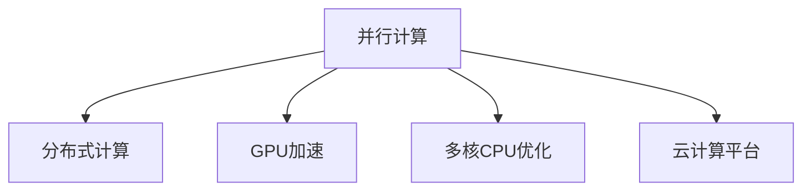

                 

# 并行计算在AI中的应用：从CPU到GPU

> 关键词：并行计算, 人工智能, 深度学习, 分布式训练, GPU加速, 多核CPU, 云计算, 高性能计算

## 1. 背景介绍

### 1.1 问题由来

并行计算在人工智能(AI)领域的应用由来已久，最初主要应用于数值计算和科学计算。然而，随着深度学习技术的兴起，大规模的神经网络模型需要处理大量的数据，计算复杂度高、耗时长，传统单核CPU难以满足需求。为了加速模型训练，并行计算技术被引入到深度学习领域，并逐渐成为推动AI技术发展的重要引擎。

近年来，随着人工智能应用的日益普及，涉及数据处理、模型训练、推理应用等诸多环节，对并行计算的需求愈发旺盛。从简单的CPU多线程并行，到复杂的GPU并行、分布式训练，并行计算技术在深度学习和AI领域得到了广泛的应用和深入的研究。

### 1.2 问题核心关键点

并行计算在AI中的应用主要集中在以下几个方面：

- **分布式训练**：使用多台机器的并行计算，加速模型训练过程。
- **GPU加速**：利用GPU的高并行处理能力，提升模型训练效率。
- **多核CPU优化**：对多核CPU进行合理调度，提高资源利用率。
- **云计算平台**：借助云平台的高性能计算资源，支持大规模AI应用。

这些关键点共同构成了并行计算在AI中的核心应用方向，也是本文将重点讨论的内容。

## 2. 核心概念与联系

### 2.1 核心概念概述

为更好地理解并行计算在AI中的应用，本节将介绍几个密切相关的核心概念：

- **并行计算(Parallel Computing)**：指同时执行多个计算任务的技术，通过将问题分解为若干子问题，分别在多个计算单元上并行处理，以提高计算效率。
- **分布式计算(Distributed Computing)**：将计算任务分布在多个计算节点上进行并行处理，实现资源的共享和协同工作。
- **GPU加速(Parallel Computing on GPU)**：利用图形处理单元(GPU)的高并行性能，加速神经网络模型的计算过程。
- **多核CPU优化(Multicore Optimization)**：对多核CPU进行并行调度，优化计算资源的分配和利用。
- **云计算平台(Cloud Computing Platform)**：通过网络资源池和虚拟化技术，为用户提供高性能的计算资源和服务。

这些核心概念之间的逻辑关系可以通过以下Mermaid流程图来展示：



这个流程图展示并行计算技术在AI中的主要应用场景：

1. 并行计算技术可以用于分布式计算，通过多台机器的协同工作，加速大规模模型训练。
2. GPU加速是并行计算在深度学习中的典型应用，利用GPU的高并行性能，大幅提升模型训练效率。
3. 多核CPU优化通过合理调度多核资源，提高计算效率。
4. 云计算平台提供大规模高性能计算资源，支持复杂的AI应用需求。

## 3. 核心算法原理 & 具体操作步骤
### 3.1 算法原理概述

并行计算在AI中的应用，主要是通过将计算任务分解为多个子任务，并在多个计算单元上并行执行，从而提高计算效率。具体来说，这个过程可以分以下几个步骤：

1. **任务分解**：将大规模的计算任务分解为若干小的子任务，通常以数据批次的划分、模型的并行划分等方式实现。
2. **并行计算**：在多个计算单元上同时执行这些子任务，可以利用CPU多线程、GPU并行、分布式计算等技术实现。
3. **结果合并**：将各计算单元的计算结果合并起来，得到最终的结果。

在AI中，并行计算的核心原理在于充分利用计算资源，减少单个计算单元的负担，提高整体计算效率。

### 3.2 算法步骤详解

并行计算在AI中的具体操作步骤如下：

**Step 1: 数据预处理**

数据预处理是并行计算的第一步。由于并行计算需要将数据切分为多个子集，所以需要确保数据具有合理的大小和顺序，以便于在多个计算节点上均匀分布。通常，数据预处理包括数据清洗、特征提取、数据划分等步骤。

**Step 2: 任务分解**

将大规模计算任务分解为多个子任务。在深度学习中，这通常包括模型参数的并行划分、数据批次的并行划分等。通过并行化计算，每个子任务可以在不同的计算单元上并行执行，从而加速模型训练过程。

**Step 3: 并行计算**

在多个计算单元上并行执行子任务。在CPU多线程并行中，通常使用多线程库（如OpenMP、MPI）来调度线程；在GPU并行中，利用CUDA、OpenCL等API来实现并行计算；在分布式计算中，使用消息传递接口（如MPI）来实现节点间的通信和同步。

**Step 4: 结果合并**

将各计算单元的计算结果合并起来，得到最终的模型参数或计算结果。在深度学习中，通常使用模型参数的梯度聚合、数据批次的合并等方式实现结果合并。

**Step 5: 后处理**

对计算结果进行后处理，包括模型评估、结果输出等步骤。在深度学习中，通常使用验证集或测试集来评估模型性能，并将结果输出到文件或数据库中。

### 3.3 算法优缺点

并行计算在AI中的应用具有以下优点：

1. **加速训练**：通过并行计算，可以显著缩短模型训练时间，提高计算效率。
2. **资源利用率高**：合理调度计算资源，避免单核CPU的资源浪费，提升计算效率。
3. **易于扩展**：通过增加计算节点，可以方便地扩展计算能力，满足大规模计算需求。

同时，并行计算也存在一些缺点：

1. **系统复杂性高**：并行计算涉及多个计算节点的协同工作，系统设计和调试复杂。
2. **通信开销大**：数据在不同节点间的传输和通信，可能成为计算瓶颈。
3. **负载均衡问题**：数据和任务在不同节点上的分配不均，可能导致某些节点负载过重。
4. **调试困难**：多节点计算过程中，故障排查和调试难度较大。

尽管存在这些局限性，但并行计算在AI中仍具有不可替代的价值，尤其是在处理大规模数据和模型时，其优势愈发明显。

### 3.4 算法应用领域

并行计算在AI中的应用非常广泛，覆盖了从模型训练到应用部署的各个环节。以下是一些典型的应用领域：

- **深度学习模型训练**：使用分布式训练和GPU加速，加速模型训练过程。
- **计算机视觉**：利用GPU并行处理图像数据，加速图像识别和分类任务。
- **自然语言处理**：通过多核CPU优化，提高文本处理和语言模型的计算效率。
- **语音识别**：利用GPU并行处理音频数据，加速语音识别和转录任务。
- **推荐系统**：通过分布式计算和GPU加速，提升推荐算法的计算效率。
- **大数据分析**：利用分布式计算和云计算平台，处理海量数据，实现数据挖掘和分析。

此外，并行计算技术还被应用于生物信息学、金融分析、气象预测等诸多领域，为科学研究和实际应用提供了强大的计算支持。

## 4. 数学模型和公式 & 详细讲解 & 举例说明
### 4.1 数学模型构建

本节将使用数学语言对并行计算在AI中的应用进行更加严格的刻画。

假设深度学习模型 $M$ 的参数为 $\theta$，训练数据集为 $D$，训练目标为最小化损失函数 $\mathcal{L}$。在并行计算中，模型的参数 $\theta$ 被分解为多个子参数组，每个子参数组在独立的计算节点上进行训练。

定义损失函数 $\mathcal{L}$ 为：

$$
\mathcal{L}(\theta) = \frac{1}{N}\sum_{i=1}^N \ell(M(x_i),y_i)
$$

其中 $\ell$ 为单个样本的损失函数，$y_i$ 为真实标签，$x_i$ 为输入样本。

### 4.2 公式推导过程

在并行计算中，模型的参数 $\theta$ 被分解为 $K$ 个子参数组 $\theta_k$，分别在 $K$ 个计算节点上进行训练。每个计算节点的损失函数为：

$$
\mathcal{L}_k(\theta_k) = \frac{1}{N}\sum_{i=1}^N \ell_k(M_k(x_i),y_i)
$$

其中 $M_k$ 为在第 $k$ 个节点上训练的子模型，$\ell_k$ 为在第 $k$ 个节点上的损失函数。

通过并行计算，各节点的损失函数可以分别计算，并行更新参数 $\theta_k$。最终的模型参数 $\hat{\theta}$ 可以通过各节点的损失函数的加权平均得到：

$$
\hat{\theta} = \frac{1}{K}\sum_{k=1}^K \theta_k
$$

在并行计算中，为了保证各节点计算的同步性，通常采用同步更新的策略。例如，在分布式计算中，使用消息传递接口（如MPI）来实现节点间的通信和同步。

### 4.3 案例分析与讲解

以深度学习模型在GPU上的并行训练为例，具体推导并行训练的过程。

假设模型 $M$ 的参数为 $\theta$，训练数据集为 $D$，训练目标为最小化损失函数 $\mathcal{L}$。在GPU并行训练中，模型的参数 $\theta$ 被分解为多个子参数组 $\theta_k$，分别在 $K$ 个GPU上进行训练。每个GPU的损失函数为：

$$
\mathcal{L}_k(\theta_k) = \frac{1}{N}\sum_{i=1}^N \ell_k(M_k(x_i),y_i)
$$

其中 $M_k$ 为在第 $k$ 个GPU上训练的子模型，$\ell_k$ 为在第 $k$ 个GPU上的损失函数。

通过并行计算，各GPU的损失函数可以分别计算，并行更新参数 $\theta_k$。最终的模型参数 $\hat{\theta}$ 可以通过各GPU的损失函数的加权平均得到：

$$
\hat{\theta} = \frac{1}{K}\sum_{k=1}^K \theta_k
$$

在并行训练中，为了保证各GPU计算的同步性，通常采用同步更新的策略。例如，在CUDA并行训练中，使用同步更新（如all-reduce）来实现节点间的通信和同步。

## 5. 项目实践：代码实例和详细解释说明
### 5.1 开发环境搭建

在进行并行计算实践前，我们需要准备好开发环境。以下是使用Python进行PyTorch开发的环境配置流程：

1. 安装Anaconda：从官网下载并安装Anaconda，用于创建独立的Python环境。

2. 创建并激活虚拟环境：
```bash
conda create -n pytorch-env python=3.8 
conda activate pytorch-env
```

3. 安装PyTorch：根据CUDA版本，从官网获取对应的安装命令。例如：
```bash
conda install pytorch torchvision torchaudio cudatoolkit=11.1 -c pytorch -c conda-forge
```

4. 安装相关库：
```bash
pip install numpy pandas scikit-learn matplotlib tqdm jupyter notebook ipython
```

5. 安装分布式训练库：
```bash
pip install torch.distributed torch.distributed.algorithms.ddp_comm_hooks
```

完成上述步骤后，即可在`pytorch-env`环境中开始并行计算实践。

### 5.2 源代码详细实现

下面我以使用CUDA并行训练深度学习模型为例，给出使用PyTorch库的代码实现。

首先，定义深度学习模型的训练函数：

```python
import torch
from torch import nn, optim
import torch.distributed as dist
import torch.distributed.algorithms.ddp_comm_hooks as comm_hooks
from torch.nn.parallel import DistributedDataParallel as DDP

class Net(nn.Module):
    def __init__(self):
        super(Net, self).__init__()
        self.fc1 = nn.Linear(784, 128)
        self.fc2 = nn.Linear(128, 10)

    def forward(self, x):
        x = self.fc1(x)
        x = torch.relu(x)
        x = self.fc2(x)
        return x

model = Net()
dist.init_process_group("nccl", rank=dist.get_rank(), world_size=dist.get_world_size())
model = DDP(model)

loss_fn = nn.CrossEntropyLoss()
optimizer = optim.SGD(model.parameters(), lr=0.01, momentum=0.9)

def train_epoch(model, data_loader, optimizer):
    model.train()
    for inputs, labels in data_loader:
        inputs, labels = inputs.to(device), labels.to(device)
        optimizer.zero_grad()
        outputs = model(inputs)
        loss = loss_fn(outputs, labels)
        loss.backward()
        optimizer.step()
```

然后，定义数据加载器：

```python
from torch.utils.data import DataLoader
import numpy as np

train_dataset = torch.utils.data.TensorDataset(train_x, train_y)
val_dataset = torch.utils.data.TensorDataset(val_x, val_y)
test_dataset = torch.utils.data.TensorDataset(test_x, test_y)

train_loader = DataLoader(train_dataset, batch_size=batch_size, shuffle=True)
val_loader = DataLoader(val_dataset, batch_size=batch_size, shuffle=False)
test_loader = DataLoader(test_dataset, batch_size=batch_size, shuffle=False)
```

最后，启动并行训练流程：

```python
if dist.get_rank() == 0:
    print("Start training...")

device = torch.device(f"cuda:{dist.get_rank()}")
model.to(device)

for epoch in range(num_epochs):
    train_loss = train_epoch(model, train_loader, optimizer)
    if dist.get_rank() == 0:
        print(f"Epoch [{epoch+1}/{num_epochs}], train loss: {train_loss:.4f}")

    # validation
    if epoch % val_interval == 0 and dist.get_rank() == 0:
        val_loss = val_epoch(model, val_loader, optimizer)
        print(f"Epoch [{epoch+1}/{num_epochs}], val loss: {val_loss:.4f}")

if dist.get_rank() == 0:
    print("Training completed.")
```

以上就是使用PyTorch进行深度学习模型并行训练的完整代码实现。可以看到，通过分布式数据并行（DDP）和CUDA并行，可以实现多GPU并行训练。

### 5.3 代码解读与分析

让我们再详细解读一下关键代码的实现细节：

**Net类定义**：
- `__init__`方法：定义神经网络模型。
- `forward`方法：定义前向传播过程。

**train_epoch函数**：
- 将输入数据和标签移动到当前节点的GPU上。
- 使用优化器更新模型参数。

**数据加载器定义**：
- 使用TensorDataset类封装训练集、验证集和测试集。
- 定义DataLoader类，方便对数据进行批量加载和处理。

**训练流程**：
- 定义训练轮数、批大小等参数。
- 启动训练循环，在每个epoch中训练模型，并在指定epoch打印训练损失。

**验证流程**：
- 在每个epoch中，验证模型在验证集上的性能。

可以看到，通过合理利用PyTorch的分布式训练和CUDA并行技术，可以方便地实现深度学习模型的并行训练。

## 6. 实际应用场景

### 6.1 深度学习模型训练

深度学习模型的训练通常需要大量的计算资源和较长的训练时间。通过并行计算，可以在多台机器上同时进行模型训练，显著缩短训练时间，提高计算效率。

例如，在计算机视觉任务中，图像数据往往非常庞大，每个图像的计算量也很大。通过分布式训练，可以将图像数据分布在多个计算节点上进行并行计算，加速模型的训练过程。同时，通过GPU加速，可以利用GPU的高并行性能，进一步提升计算效率。

### 6.2 自然语言处理

自然语言处理任务通常涉及大量的文本数据处理和模型训练。通过并行计算，可以充分利用多台机器的计算资源，加速模型的训练和推理过程。

例如，在文本分类任务中，可以使用分布式训练来并行处理大量的文本数据，加速模型的训练。同时，通过GPU加速，可以利用GPU的高并行性能，提升模型在文本分类、情感分析等任务上的计算效率。

### 6.3 推荐系统

推荐系统需要处理海量的用户行为数据和商品信息，计算复杂度高，计算资源需求大。通过并行计算，可以在多台机器上同时进行推荐算法的计算，加速推荐模型的训练和优化。

例如，在推荐系统中，可以使用分布式训练来并行处理用户行为数据和商品信息，加速推荐模型的训练。同时，通过GPU加速，可以利用GPU的高并行性能，提升推荐算法的计算效率，优化推荐结果。

### 6.4 未来应用展望

随着并行计算技术的不断发展，其在AI中的应用前景将更加广阔。未来，我们可以预见并行计算在AI中会呈现以下几个趋势：

1. **更深层次的模型并行化**：随着模型参数量的增加，单个GPU已经难以满足计算需求。未来，并行计算技术将进一步深化，支持更深层次的模型并行化，实现更加高效的模型训练和推理。

2. **更高效的分布式训练**：随着分布式训练技术的进步，未来并行计算将更加高效，支持更复杂的模型和更大的数据集，实现真正的"大规模"训练。

3. **更灵活的并行调度**：未来，并行计算将更加灵活，能够根据不同的计算任务和计算资源，自动选择最优的并行调度策略，提高计算效率。

4. **更广泛的应用场景**：未来，并行计算将覆盖更广泛的应用场景，如自动驾驶、智能制造、医疗健康等，为各个领域提供强大的计算支持。

总之，并行计算技术将在AI领域发挥越来越重要的作用，为深度学习和人工智能技术的发展提供强有力的计算支持。

## 7. 工具和资源推荐
### 7.1 学习资源推荐

为了帮助开发者系统掌握并行计算在AI中的应用，这里推荐一些优质的学习资源：

1. 《深度学习入门：基于PyTorch的理论与实现》书籍：介绍深度学习模型的构建和并行训练，系统讲解了GPU并行计算等核心内容。

2. CS224N《深度学习自然语言处理》课程：斯坦福大学开设的NLP明星课程，涵盖深度学习模型、分布式训练等核心内容，是学习并行计算的重要参考资料。

3. PyTorch官方文档：PyTorch的官方文档，提供了详细的分布式训练和GPU并行计算的介绍，是学习并行计算的重要参考资料。

4. NVIDIA CUDA文档：CUDA的官方文档，提供了详细的GPU编程和并行计算的介绍，是学习GPU并行计算的重要参考资料。

5. 《分布式深度学习：理论与实践》书籍：介绍分布式深度学习的原理和实践，系统讲解了分布式计算、深度学习模型训练等核心内容。

通过对这些资源的学习实践，相信你一定能够快速掌握并行计算在AI中的应用，并用于解决实际的AI问题。

### 7.2 开发工具推荐

高效的开发离不开优秀的工具支持。以下是几款用于并行计算开发的常用工具：

1. PyTorch：基于Python的开源深度学习框架，灵活动态的计算图，适合快速迭代研究。

2. TensorFlow：由Google主导开发的开源深度学习框架，生产部署方便，适合大规模工程应用。

3. PySpark：Apache Spark的Python接口，提供分布式计算和数据处理功能，支持大规模数据处理和分析。

4. OpenMPI：开源的消息传递接口，支持多台机器的分布式计算，适合复杂的高性能计算任务。

5. MPI4PY：Python库，提供MPI接口的封装，支持多台机器的分布式计算，适合复杂的高性能计算任务。

合理利用这些工具，可以显著提升并行计算的开发效率，加快创新迭代的步伐。

### 7.3 相关论文推荐

并行计算在AI中的应用源于学界的持续研究。以下是几篇奠基性的相关论文，推荐阅读：

1. Data Parallelism and Communication in Distributed Deep Learning (ICML 2015)：介绍深度学习中的分布式训练技术，分析了数据并行和模型并行的方法。

2. Distributed Training of Deep Neural Networks (JMLR 2016)：分析了深度学习中的分布式训练方法，讨论了不同的分布式训练策略。

3. Caffe: An Open Deep Learning Framework (JMLR 2014)：介绍Caffe框架的设计和实现，提供了丰富的分布式训练功能。

4. PyTorch Distributed Training (PyTorch 1.4)：PyTorch官方文档，提供了详细的分布式训练和GPU并行计算的介绍，是学习并行计算的重要参考资料。

5. TensorFlow Distributed Training (TensorFlow 2.0)：TensorFlow官方文档，提供了详细的分布式训练和GPU并行计算的介绍，是学习并行计算的重要参考资料。

这些论文代表了大规模并行计算技术的发展脉络，为并行计算在AI中的应用提供了理论支撑。通过学习这些前沿成果，可以帮助研究者把握学科前进方向，激发更多的创新灵感。

## 8. 总结：未来发展趋势与挑战

### 8.1 研究成果总结

本文对并行计算在AI中的应用进行了全面系统的介绍。首先阐述了并行计算在AI中的研究背景和重要意义，明确了并行计算在深度学习和AI领域的重要作用。其次，从原理到实践，详细讲解了并行计算的数学原理和关键步骤，给出了并行计算任务开发的完整代码实例。同时，本文还广泛探讨了并行计算在深度学习中的多个应用领域，展示了其强大的计算能力。

通过本文的系统梳理，可以看到，并行计算技术在深度学习和AI中的应用日益广泛，成为推动AI技术发展的重要引擎。其在分布式训练、GPU加速、多核CPU优化等方面的优势，为深度学习模型的训练和推理提供了强有力的计算支持。

### 8.2 未来发展趋势

展望未来，并行计算在AI中的应用将呈现以下几个发展趋势：

1. **更深层次的模型并行化**：随着模型参数量的增加，单个GPU已经难以满足计算需求。未来，并行计算技术将进一步深化，支持更深层次的模型并行化，实现更加高效的模型训练和推理。

2. **更高效的分布式训练**：随着分布式训练技术的进步，未来并行计算将更加高效，支持更复杂的模型和更大的数据集，实现真正的"大规模"训练。

3. **更灵活的并行调度**：未来，并行计算将更加灵活，能够根据不同的计算任务和计算资源，自动选择最优的并行调度策略，提高计算效率。

4. **更广泛的应用场景**：未来，并行计算将覆盖更广泛的应用场景，如自动驾驶、智能制造、医疗健康等，为各个领域提供强大的计算支持。

以上趋势凸显了并行计算在AI中的广阔前景。这些方向的探索发展，必将进一步提升深度学习模型的性能和应用范围，为人工智能技术的发展提供强有力的计算支持。

### 8.3 面临的挑战

尽管并行计算在AI中已经取得了显著进展，但在迈向更加智能化、普适化应用的过程中，它仍面临诸多挑战：

1. **系统复杂性高**：并行计算涉及多个计算节点的协同工作，系统设计和调试复杂。

2. **通信开销大**：数据在不同节点间的传输和通信，可能成为计算瓶颈。

3. **负载均衡问题**：数据和任务在不同节点上的分配不均，可能导致某些节点负载过重。

4. **调试困难**：多节点计算过程中，故障排查和调试难度较大。

尽管存在这些挑战，但并行计算在AI中仍具有不可替代的价值，尤其是在处理大规模数据和模型时，其优势愈发明显。

### 8.4 研究展望

面对并行计算面临的这些挑战，未来的研究需要在以下几个方面寻求新的突破：

1. **优化数据通信**：研究更高效的数据传输和通信协议，减少通信开销，提高并行计算的效率。

2. **分布式训练优化**：研究更高效的分布式训练算法，支持更复杂的模型和更大的数据集，实现真正的"大规模"训练。

3. **模型并行优化**：研究更深层次的模型并行化技术，支持更大规模的深度学习模型，提高计算效率。

4. **系统优化**：研究更灵活的并行调度策略，优化系统资源利用率，提高并行计算的效率。

5. **跨平台并行计算**：研究跨平台并行计算技术，实现异构系统之间的协同工作，提高并行计算的灵活性。

6. **云计算支持**：研究云计算平台下的并行计算优化技术，提供更加灵活、高效、易用的计算资源。

这些研究方向的探索，必将引领并行计算技术迈向更高的台阶，为人工智能技术的发展提供强有力的计算支持。相信随着学界和产业界的共同努力，这些挑战终将一一被克服，并行计算技术必将在构建人机协同的智能时代中扮演越来越重要的角色。

## 9. 附录：常见问题与解答

**Q1：并行计算对模型的训练效果有何影响？**

A: 并行计算对模型的训练效果有显著提升。通过多台机器同时进行计算，可以显著缩短模型训练时间，提高计算效率。同时，通过分布式训练，可以在更短的时间内获得更优的模型效果。

**Q2：并行计算对模型的性能和稳定性有何影响？**

A: 并行计算对模型的性能和稳定性有一定的影响。由于多个计算节点同时进行计算，可能会存在计算精度不一致、负载不均衡等问题。为了保证模型的稳定性和精度，需要进行合理的计算资源分配和负载均衡优化。

**Q3：并行计算是否适用于所有的深度学习模型？**

A: 并行计算适用于大多数深度学习模型，但不适合某些对精度要求极高的模型。对于精度要求极高的模型，可能需要采用其他计算方法，如高精度浮点数计算等。

**Q4：并行计算在实际应用中需要注意哪些问题？**

A: 在实际应用中，并行计算需要注意以下几点：

1. 数据传输和通信：数据在不同节点间的传输和通信，可能成为计算瓶颈。需要优化数据传输和通信协议，提高传输效率。

2. 负载均衡：数据和任务在不同节点上的分配不均，可能导致某些节点负载过重。需要合理分配计算任务，优化负载均衡。

3. 故障处理：多节点计算过程中，故障排查和调试难度较大。需要建立完善的故障处理机制，确保计算系统的稳定性和可靠性。

4. 计算资源管理：合理管理计算资源，避免资源浪费，提高资源利用率。

这些问题的解决，需要开发者具备丰富的计算经验和系统设计能力，才能实现高效、稳定的并行计算。

**Q5：并行计算在实际应用中如何实现？**

A: 并行计算在实际应用中可以通过以下步骤实现：

1. 数据预处理：将数据切分为多个子集，分配到不同的计算节点上。

2. 任务分解：将计算任务分解为多个子任务，分配到不同的计算节点上进行并行计算。

3. 并行计算：在多个计算节点上同时执行子任务，利用CUDA等GPU并行技术或MPI等分布式计算技术进行并行计算。

4. 结果合并：将各计算节点的计算结果合并起来，得到最终的结果。

5. 后处理：对计算结果进行后处理，包括模型评估、结果输出等步骤。

通过以上步骤，可以实现高效、稳定的并行计算，提高深度学习模型的训练和推理效率。

---

作者：禅与计算机程序设计艺术 / Zen and the Art of Computer Programming

