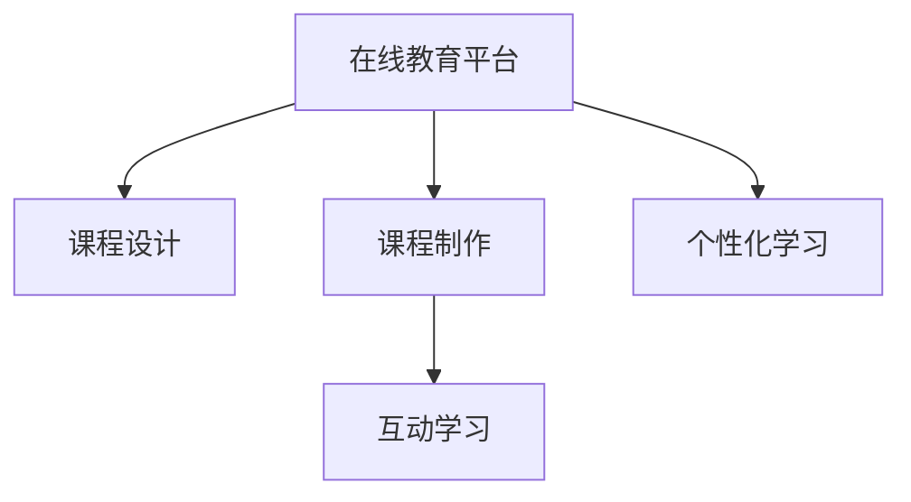

                 

# 开发个人品牌在线课堂：扩大知识传播范围

> 关键词：在线教育,个人品牌,知识传播,课程设计,平台搭建,市场营销

## 1. 背景介绍

### 1.1 问题由来
随着互联网的普及和技术的进步，在线教育成为一种快速、便捷、高效的学习方式，为学习者提供了前所未有的学习自由度和资源丰富度。个人品牌在线课堂作为在线教育的一种新形式，通过打造有独特个人风格的课程，在知识传播、技能培训、兴趣培养等方面发挥着越来越重要的作用。

在线教育的蓬勃发展，为个人品牌建设提供了新的平台和机遇。通过开设在线课程，个人不仅可以将自身的知识和经验传递给更多学习者，还能在专业领域内树立权威形象，拓展职业机会。然而，成功的个人品牌在线课堂并非易事，需要精心设计和运营，才能吸引更多的学习者和流量，实现知识传播的广泛和深度。

### 1.2 问题核心关键点
构建成功的个人品牌在线课堂，涉及课程设计、平台搭建、市场营销等多个方面。核心关键点包括：
- **课程设计**：确保课程内容高质量、结构合理、受众覆盖广泛。
- **平台搭建**：选择合适的在线教学平台，并进行定制化优化。
- **市场营销**：制定有效的市场推广策略，吸引潜在学习者。
- **用户体验**：优化课程学习体验，提高用户黏性。

本文聚焦于课程设计和平台搭建，详细讲解如何通过合理的课程设计，并利用先进技术搭建个人品牌在线课堂，进而扩大知识传播范围。

## 2. 核心概念与联系

### 2.1 核心概念概述

为更好地理解在线课程开发和平台搭建的过程，本节将介绍几个密切相关的核心概念：

- **在线教育平台**：提供教育内容和互动学习的平台，常见的包括Coursera、edX、Udacity等。
- **课程设计**：从学习目标、课程结构、教学方法、评估方式等角度进行系统规划和设计，以实现高效知识传播。
- **课程制作**：将课程设计转化为具体的教学资源，如视频、音频、PPT、习题等，提供给学习者。
- **互动学习**：通过论坛、讨论、测试等方式，促进学习者之间的互动交流，提升学习效果。
- **个性化学习**：根据学习者的特点和需求，定制个性化的学习路径和资源，增强学习体验。

这些核心概念之间的逻辑关系可以通过以下Mermaid流程图来展示：



这个流程图展示在线教育平台的各个关键组件及其之间的关系：

1. 在线教育平台是课程设计和制作的基础设施，为学习者提供学习环境和资源。
2. 课程设计决定了课程的结构和内容，是知识传播的核心。
3. 课程制作将课程设计转化为具体的教学资源，为学习者提供可操作的学习材料。
4. 互动学习促进学习者之间的交流和协作，增强学习效果。
5. 个性化学习根据学习者的需求，提供定制化的学习体验。

这些概念共同构成了在线教育的框架，使得知识传播更为高效、有针对性，同时也为个人品牌在线课堂的搭建提供了理论基础。

## 3. 核心算法原理 & 具体操作步骤
### 3.1 算法原理概述

个人品牌在线课堂的开发，本质上是一个系统工程，涉及多种技术的综合应用。其核心思想是：通过精心设计的课程，利用先进的在线教育平台技术，将知识以高效、可互动的方式传播给学习者。

在线课程的开发流程大致包括以下几个步骤：

1. 确定课程目标和内容。
2. 设计课程结构和教学方法。
3. 制作课程教学资源。
4. 搭建在线平台并集成课程。
5. 进行市场推广和用户互动。

具体到技术层面，以下几部分内容将详细介绍每一步的具体操作：

### 3.2 算法步骤详解

**Step 1: 确定课程目标和内容**

- **目标设定**：明确课程旨在解决什么问题，培养哪些技能，达到什么学习成果。
- **内容规划**：基于目标，规划课程大纲，选择教材和参考资料，确保内容的全面性和深度。

**Step 2: 设计课程结构和教学方法**

- **课程结构设计**：将课程内容划分为模块、章节、子节，明确每个部分的学习目标和知识点。
- **教学方法设计**：根据课程特点和学习者需求，选择适合的教学方法，如讲授、讨论、实验、案例分析等。

**Step 3: 制作课程教学资源**

- **视频制作**：录制课程讲解视频，确保内容清晰、表达准确、富有吸引力。
- **音频制作**：录制课程音频，供无法观看视频的学习者使用。
- **文档制作**：制作PPT、Word文档等文本资源，提供额外的学习支持。
- **习题和作业**：设计与课程内容相关的习题和作业，用于巩固学习成果。

**Step 4: 搭建在线平台并集成课程**

- **平台选择**：选择合适的在线教育平台，如Udemy、Teachable、Thinkific等。
- **平台配置**：根据课程需求，进行平台配置和定制化优化，如课程页面设计、购买流程、评分系统等。
- **课程集成**：将制作好的教学资源上传到平台，配置课程参数，完成课程发布。

**Step 5: 进行市场推广和用户互动**

- **市场推广**：利用社交媒体、SEO优化、付费广告等方式，提升课程的曝光率和吸引力。
- **用户互动**：通过论坛、问答、评论等形式，促进学习者之间的互动，增强课程的参与度和学习效果。

### 3.3 算法优缺点

在线课程开发和平台搭建方法具有以下优点：

- **灵活性高**：课程设计和平台配置可以根据需要灵活调整，适应不同的学习者需求。
- **传播广泛**：在线教育打破了地域和时间限制，可以覆盖全球受众，实现知识传播的最大化。
- **学习方便**：学习者可以根据自己的时间安排和节奏进行学习，提高学习效率。

同时，该方法也存在一些局限性：

- **技术门槛**：需要一定的技术知识和操作技能，特别是平台配置和课程制作。
- **课程质量控制**：课程设计和教学资源的制作需要精心策划，课程质量易受人为因素影响。
- **学习者自主性要求高**：在线学习需要高度的自律和自我管理能力，学习效果受学习者自身因素影响较大。

尽管存在这些局限性，但就目前而言，在线课程开发和平台搭建是实现大规模知识传播的重要手段。未来相关研究的重点在于如何进一步降低技术门槛，提高课程质量，同时增强学习者的自主性和互动性，以提升整体学习效果。

### 3.4 算法应用领域

个人品牌在线课程的开发和平台搭建方法，已经在多个领域得到了广泛应用，例如：

- **职业培训**：通过传授特定行业的专业知识和技能，帮助学习者提升职业竞争力。
- **学术研究**：为学生和研究人员提供高质量的学术资源，促进知识传播和创新。
- **兴趣培养**：提供多样化的兴趣课程，丰富学习者的生活，促进全面发展。
- **科普教育**：通过科学普及课程，提高公众科学素养，推动社会进步。
- **技能提升**：为职场人士提供实用的技能培训，提升工作效率和生活质量。

除了上述这些常见应用外，个人品牌在线课程还被创新性地应用到更多场景中，如健康教育、环境保护、艺术创作等，为不同领域的学习者提供新的学习方式和资源。随着在线教育的不断发展和普及，相信个人品牌在线课程将在更多领域发挥重要作用，为知识传播带来新的动力。

## 4. 数学模型和公式 & 详细讲解 & 举例说明
### 4.1 数学模型构建

在线课程开发和平台搭建过程中，涉及到多种数学模型和算法，以下将详细介绍几个关键模型的构建：

- **回归模型**：用于预测学习者的学习成绩，选择课程难度和内容。
- **聚类算法**：对学习者进行分组，实现个性化推荐和互动。
- **协同过滤算法**：推荐相似的学习者相关课程，提高学习效率。

### 4.2 公式推导过程

以下我们以回归模型为例，推导线性回归模型的基本公式及其应用。

假设课程的学习成绩为 $y$，影响因素包括课程难度 $x_1$、学习者基础 $x_2$、学习投入时间 $x_3$。则线性回归模型为：

$$
y = \beta_0 + \beta_1 x_1 + \beta_2 x_2 + \beta_3 x_3 + \epsilon
$$

其中 $\beta$ 为回归系数，$\epsilon$ 为误差项。通过对学习者数据进行最小二乘法求解，可以得到最优的回归系数估计值。

在实际应用中，回归模型可以用于预测不同课程的难度和学习者可能达到的成绩，帮助课程设计和平台优化。例如，根据历史数据，可以通过回归模型预测某课程难度对学习者成绩的影响，从而调整课程内容或推荐相关课程。

### 4.3 案例分析与讲解

以下通过一个具体的在线课程开发案例，展示回归模型在课程设计和平台优化中的应用。

假设我们开发一门Python编程在线课程，旨在帮助初学者掌握Python基础和进阶技能。根据以往的学习者数据，我们收集了课程难度 $x_1$、学习者基础 $x_2$、学习投入时间 $x_3$ 和考试成绩 $y$ 的数据，并对它们之间的关系进行回归分析。

使用线性回归模型，我们得到了以下结果：

$$
y = 0.5x_1 - 0.2x_2 + 0.8x_3 + \epsilon
$$

根据回归结果，我们发现：

- 课程难度 $x_1$ 对考试成绩 $y$ 的影响最大，难度越大，学习者的成绩越差。
- 学习者基础 $x_2$ 对考试成绩的影响较小，但基础较弱的学习者成绩更易下降。
- 学习投入时间 $x_3$ 对考试成绩的影响较大，但投入时间过长也不一定带来更高的成绩。

根据这些分析结果，我们可以在课程设计和平台优化中进行以下改进：

- 在课程设计中，增加难度较低的入门课程，帮助学习者打好基础。
- 提供个性化的学习建议，针对学习者基础进行推荐，减少基础薄弱学习者的挫败感。
- 优化学习路径和进度，合理分配学习投入时间，避免时间浪费和过度劳累。

## 5. 项目实践：代码实例和详细解释说明
### 5.1 开发环境搭建

在进行在线课程开发和平台搭建前，我们需要准备好开发环境。以下是使用Python进行Django开发的环境配置流程：

1. 安装Python：从官网下载并安装Python，确保版本在3.6及以上。
2. 安装Pip：从官网下载并安装Pip，用于Python包管理。
3. 安装Django：使用Pip安装Django框架，具体命令为 `pip install django`。
4. 安装需要的第三方库：安装如Pillow、requests、numpy等常用的Python库。

完成上述步骤后，即可在开发环境中进行在线课程开发和平台搭建。

### 5.2 源代码详细实现

以下是使用Django开发一个简单的在线课程平台的代码实现：

首先，定义一个Django项目和应用：

```python
django-admin startproject my_course_platform
cd my_course_platform
python manage.py startapp course_app
```

在项目中定义一个简单的模型，如`Course`模型，用于存储课程信息：

```python
# models.py
from django.db import models

class Course(models.Model):
    title = models.CharField(max_length=255)
    description = models.TextField()
    video_url = models.URLField()
    audio_url = models.URLField()
    document_url = models.URLField()
    difficulty = models.CharField(max_length=10)
    requirement = models.CharField(max_length=255)
    created_at = models.DateTimeField(auto_now_add=True)
```

接着，定义一个简单的表单，用于课程发布和修改：

```python
# forms.py
from django import forms
from .models import Course

class CourseForm(forms.ModelForm):
    class Meta:
        model = Course
        fields = ['title', 'description', 'video_url', 'audio_url', 'document_url', 'difficulty', 'requirement']
```

然后，定义一个简单的视图函数，用于课程展示和修改：

```python
# views.py
from django.shortcuts import render, redirect
from .models import Course
from .forms import CourseForm

def course_list(request):
    courses = Course.objects.all()
    return render(request, 'course_list.html', {'courses': courses})

def course_create(request):
    if request.method == 'POST':
        form = CourseForm(request.POST)
        if form.is_valid():
            course = form.save()
            return redirect('course_list')
    else:
        form = CourseForm()
    return render(request, 'course_create.html', {'form': form})

def course_edit(request, pk):
    course = get_object_or_404(Course, pk=pk)
    if request.method == 'POST':
        form = CourseForm(request.POST, instance=course)
        if form.is_valid():
            form.save()
            return redirect('course_list')
    else:
        form = CourseForm(instance=course)
    return render(request, 'course_edit.html', {'form': form})
```

最后，在`urls.py`中定义路由：

```python
# urls.py
from django.urls import path
from . import views

urlpatterns = [
    path('courses/', views.course_list, name='course_list'),
    path('courses/create/', views.course_create, name='course_create'),
    path('courses/<int:pk>/edit/', views.course_edit, name='course_edit'),
]
```

以上代码实现了一个基本的在线课程管理功能，包括课程列表展示、课程创建和修改。开发者可以根据自己的需求，进一步扩展功能和优化界面。

### 5.3 代码解读与分析

让我们再详细解读一下关键代码的实现细节：

**models.py**：
- 定义了一个`Course`模型，包含课程的标题、描述、视频链接、音频链接、难度等级、学习要求、创建时间等字段。

**forms.py**：
- 定义了一个`CourseForm`表单，用于封装课程数据，便于视图函数处理。

**views.py**：
- 定义了三个视图函数：`course_list`用于展示课程列表，`course_create`用于创建课程，`course_edit`用于修改课程。
- 使用`redirect`和`get_object_or_404`等技术，简化了路由和数据处理逻辑。

**urls.py**：
- 定义了课程列表、课程创建和课程修改的路由，对应视图函数的URL名称。

通过上述代码实现，可以看到Django框架提供了丰富的功能和灵活的扩展性，使得在线课程平台的开发变得更加便捷。开发者可以基于此模板，进一步开发更多的功能和特性，如用户认证、学习进度追踪、互动讨论等。

## 6. 实际应用场景
### 6.1 智能客服系统

基于Django的在线课程平台，可以应用于智能客服系统的构建。传统客服往往需要配备大量人力，高峰期响应缓慢，且一致性和专业性难以保证。而使用在线课程平台，可以7x24小时不间断服务，快速响应客户咨询，用课程内容解答各类常见问题。

在技术实现上，可以建立客户互动模块，允许客户在线咨询课程问题，并提供解答视频、音频、文档等教学资源。同时，可以提供在线课程推荐、学习进度追踪等功能，提升客户满意度和体验。

### 6.2 金融舆情监测

金融机构需要实时监测市场舆论动向，以便及时应对负面信息传播，规避金融风险。传统的人工监测方式成本高、效率低，难以应对网络时代海量信息爆发的挑战。基于Django的在线课程平台，可以实时抓取网络舆情，提供在线课程和实时分析，帮助金融机构快速应对市场变化。

在实际应用中，可以通过爬虫技术实时抓取网络舆情数据，利用自然语言处理技术进行情感分析和主题分类，进而触发相应课程推荐和预警。如此构建的金融舆情监测系统，能大幅提升信息分析和决策效率，帮助金融机构及时调整策略，应对市场波动。

### 6.3 个性化推荐系统

当前的推荐系统往往只依赖用户的历史行为数据进行物品推荐，无法深入理解用户的真实兴趣偏好。基于Django的在线课程平台，可以更好地挖掘用户行为背后的语义信息，从而提供更精准、多样的推荐内容。

在实践中，可以收集用户浏览、点击、评论、分享等行为数据，提取和课程交互的物品标题、描述、标签等文本内容。将文本内容作为模型输入，用户的后续行为（如是否点击、购买等）作为监督信号，在此基础上微调预训练语言模型。微调后的模型能够从文本内容中准确把握用户的兴趣点。在生成推荐列表时，先用课程的标题、描述等作为输入，由模型预测用户的兴趣匹配度，再结合其他特征综合排序，便可以得到个性化程度更高的推荐结果。

### 6.4 未来应用展望

随着在线教育平台的不断发展和优化，其在更多领域的应用前景将更加广阔。

在智慧医疗领域，基于在线课程平台的教育工具，可以辅助医生进行病例学习、病理分析等，提升医生的医疗水平。在教育领域，可以通过在线课程平台进行远程教学，实现优质教育资源的共享和普及。在企业培训领域，在线课程平台可以为企业提供定制化的技能培训和职业发展课程，提高员工专业水平和职业素质。

此外，在文娱传媒、科学研究、社会治理等众多领域，基于Django的在线课程平台也将不断涌现，为各行各业提供新的学习工具和资源。相信随着技术的不断进步和应用场景的拓展，在线课程平台必将在更多领域发挥重要作用，为知识的传播和应用带来新的突破。

## 7. 工具和资源推荐
### 7.1 学习资源推荐

为了帮助开发者系统掌握在线课程开发和平台搭建的理论基础和实践技巧，这里推荐一些优质的学习资源：

1. Django官方文档：Django框架的官方文档，详细介绍了Django的各个组件和使用方法，是学习Django的重要参考。

2. Django教程：Django的官方教程，提供了丰富的实战案例和练习，帮助开发者快速上手Django开发。

3. Django Girl：Django开发女性入门教程，讲解了Django开发的基础知识和实践技巧，适合新手入门。

4. Python Web开发实战教程：详细介绍了Django、Flask、Tornado等Web框架的使用，涵盖前端后端全栈开发。

5. Django Rest Framework：Django的RESTful Web服务框架，提供了强大的API开发能力，适合开发在线课程的API接口。

6. Django + TensorFlow：结合Django和TensorFlow，开发在线课程平台的实战教程，帮助开发者掌握机器学习在课程开发中的应用。

通过学习这些资源，相信你一定能够快速掌握Django在线课程开发的核心知识和技能，并用于解决实际的开发问题。

### 7.2 开发工具推荐

高效的开发离不开优秀的工具支持。以下是几款用于Django开发常用的工具：

1. PyCharm：一款功能强大的Python IDE，提供了丰富的Django开发工具和插件，适合开发者进行Web开发。

2. VS Code：一款轻量级的代码编辑器，支持Django开发和调试，提供丰富的插件和扩展。

3. Postman：一款API测试工具，可以帮助开发者测试在线课程平台的API接口，确保接口稳定可靠。

4. Git：版本控制系统，方便开发者进行代码管理和版本控制，支持远程协作开发。

5. Docker：容器化技术，可以将Django应用打包成容器，方便部署和管理。

6. Ansible：自动化配置管理工具，可以快速搭建和部署Django开发环境。

合理利用这些工具，可以显著提升Django在线课程开发的效率，加快创新迭代的步伐。

### 7.3 相关论文推荐

Django在线课程平台的开发，涉及Web开发、自然语言处理、API接口等多个领域。以下是几篇奠基性的相关论文，推荐阅读：

1. Django Web Development with Python：介绍Django框架的开发和使用，涵盖Django基础、高级开发技巧。

2. A Survey on Recommendation Systems：综述推荐系统的最新研究进展，涵盖协同过滤、基于内容的推荐等方法。

3. Sentiment Analysis using Deep Learning：介绍基于深度学习的情感分析方法，应用于舆情监测和用户互动。

4. Natural Language Processing with PyTorch：介绍使用PyTorch进行自然语言处理的实践技巧，涵盖文本分类、情感分析等任务。

5. Online Learning with Django REST Framework：介绍使用Django REST Framework开发在线课程API接口的实战案例。

这些论文代表了大语言模型微调技术的发展脉络。通过学习这些前沿成果，可以帮助研究者把握学科前进方向，激发更多的创新灵感。

## 8. 总结：未来发展趋势与挑战
### 8.1 总结

本文对Django在线课程平台开发方法进行了全面系统的介绍。首先阐述了在线课程开发和平台搭建的研究背景和意义，明确了在线课程对知识传播的重要性。其次，从原理到实践，详细讲解了Django在线课程开发的过程，给出了详细的代码实现。同时，本文还广泛探讨了在线课程平台在多个领域的应用前景，展示了在线课程平台的巨大潜力。此外，本文精选了Django在线课程开发的相关学习资源，力求为开发者提供全方位的技术指引。

通过本文的系统梳理，可以看到，Django在线课程平台开发技术已经成为在线教育的重要组成部分，极大地拓展了知识传播的边界，为学习者提供了便捷高效的学习方式。未来，伴随在线教育的不断发展和优化，在线课程平台必将在更多领域发挥重要作用，为知识的传播和应用带来新的突破。

### 8.2 未来发展趋势

展望未来，Django在线课程平台开发技术将呈现以下几个发展趋势：

1. 平台功能丰富化。在线课程平台的功能将不断丰富，涵盖学习管理、互动交流、作业评估、成绩追踪等多个方面。

2. 个性化学习深化。利用机器学习和自然语言处理技术，实现更加个性化的学习推荐和互动。

3. 移动端支持增强。开发移动端应用程序，提供随时随地学习的便利，进一步扩大课程受众。

4. 实时互动优化。通过实时互动技术，提升学习体验，促进学习者之间的交流和合作。

5. 多语言支持普及。支持多语言课程内容，为全球学习者提供更加广泛的学习资源。

6. 虚拟现实和增强现实应用。利用VR和AR技术，提供沉浸式学习体验，增强学习效果。

以上趋势凸显了Django在线课程平台技术的广阔前景。这些方向的探索发展，必将进一步提升在线课程平台的功能和用户体验，实现知识传播的最大化。

### 8.3 面临的挑战

尽管Django在线课程平台开发技术已经取得了瞩目成就，但在迈向更加智能化、普适化应用的过程中，仍面临着诸多挑战：

1. 平台技术门槛。在线课程平台开发需要一定的技术知识和操作技能，特别是平台配置和课程制作。对于初学者而言，门槛较高，需要提供更多的技术支持和文档。

2. 课程质量控制。在线课程的质量受人为因素影响较大，如何通过技术手段提高课程制作的专业性和质量，是平台发展的重要课题。

3. 学习者自主性要求高。在线学习需要高度的自律和自我管理能力，如何通过平台设计和功能优化，激发学习者的积极性和参与度，是平台运营的关键。

4. 数据安全问题。在线课程平台涉及大量的用户数据和课程内容，如何保护用户隐私和数据安全，防止数据泄露和恶意攻击，是平台必须面对的重大挑战。

5. 市场竞争激烈。在线教育市场竞争激烈，如何通过差异化定位和特色功能，吸引和留住学习者，是平台运营的重要策略。

6. 技术更新迅速。在线课程平台需要不断更新和优化，以跟上技术发展的步伐，保持平台的竞争力和用户黏性。

正视在线课程平台面临的这些挑战，积极应对并寻求突破，将是在线课程平台走向成熟的重要保证。相信随着学界和产业界的共同努力，这些挑战终将一一被克服，Django在线课程平台必将在构建智能教育体系中扮演越来越重要的角色。

### 8.4 研究展望

面对Django在线课程平台所面临的种种挑战，未来的研究需要在以下几个方面寻求新的突破：

1. 开发更加智能化和自动化的人机交互技术，提升学习体验。

2. 引入更多的学习分析技术，提供个性化的学习建议和资源推荐。

3. 利用多模态数据融合技术，提升课程内容的深度和广度。

4. 探索跨平台和跨设备的学习体验，实现无缝衔接。

5. 加强数据安全和隐私保护，提升平台的可靠性和可信度。

6. 结合最新的自然语言处理和机器学习技术，提升课程质量和学习效果。

这些研究方向的探索，必将引领Django在线课程平台技术迈向更高的台阶，为知识的传播和应用带来新的突破。面向未来，Django在线课程平台需要与其他人工智能技术进行更深入的融合，如知识表示、因果推理、强化学习等，多路径协同发力，共同推动智能教育的进步。

## 9. 附录：常见问题与解答
**Q1：开发在线课程平台时，如何选择适当的技术栈？**

A: 选择技术栈需要综合考虑平台需求、团队技能、市场定位等多个因素。常见的技术栈包括Django、Flask、Tornado等。

- **Django**：功能丰富，易上手，适合初学者。
- **Flask**：轻量级，灵活性高，适合中小型项目。
- **Tornado**：高并发，适合处理大量用户请求。

可以根据项目需求和技术水平进行选择，也可以在不同的技术栈之间进行切换和整合。

**Q2：在线课程平台如何保证学习资源的版权和质量？**

A: 保证学习资源的版权和质量需要建立完善的内容审核机制和版权保护措施。

- **内容审核**：引入专业的审核人员和算法，对课程内容进行审核，确保内容科学、准确、无版权问题。
- **版权保护**：对课程内容进行版权登记和保护，防止侵权和盗用。
- **用户反馈**：鼓励学习者对课程内容进行评价和反馈，及时发现和修正问题。

通过这些措施，可以有效提升在线课程平台的学习资源质量和版权保护水平。

**Q3：在线课程平台如何进行有效的市场推广？**

A: 在线课程平台的市场推广需要综合运用多种策略，提升曝光率和吸引力。

- **社交媒体推广**：利用社交平台进行课程推广，增加曝光率。
- **SEO优化**：优化课程网页的搜索引擎排名，吸引更多搜索用户。
- **付费广告**：在相关网站和平台上进行付费广告投放，提升广告效果。
- **合作推广**：与知名机构和平台进行合作推广，利用已有流量和资源。

通过多种渠道和策略的组合，可以提升在线课程平台的知名度和用户量。

**Q4：在线课程平台如何实现个性化推荐？**

A: 个性化推荐需要综合运用机器学习和自然语言处理技术。

- **数据采集**：收集学习者的行为数据，如浏览记录、点击记录、作业成绩等。
- **特征提取**：提取学习者的兴趣和行为特征，如阅读偏好、学习时间、反馈评价等。
- **推荐算法**：使用协同过滤、基于内容的推荐算法，生成个性化的推荐结果。
- **反馈优化**：根据学习者的反馈，不断优化推荐算法和模型，提升推荐效果。

通过这些步骤，可以实现更加精准和高效的个性化推荐，提升学习者的学习体验和满意度。

**Q5：在线课程平台如何进行用户互动和反馈？**

A: 用户互动和反馈是提升在线课程平台质量的重要手段。

- **讨论区**：在课程页面中设置讨论区，学习者可以在此进行交流和讨论。
- **问答系统**：引入问答系统，学习者可以向讲师提问，获得及时回复。
- **评价系统**：设置课程评价系统，学习者可以对课程进行评分和评价，反馈学习体验。
- **在线客服**：设置在线客服功能，学习者可以通过客服获取帮助和支持。

通过这些功能，可以增强学习者之间的互动和反馈，提升课程质量和用户体验。

---

作者：禅与计算机程序设计艺术 / Zen and the Art of Computer Programming

