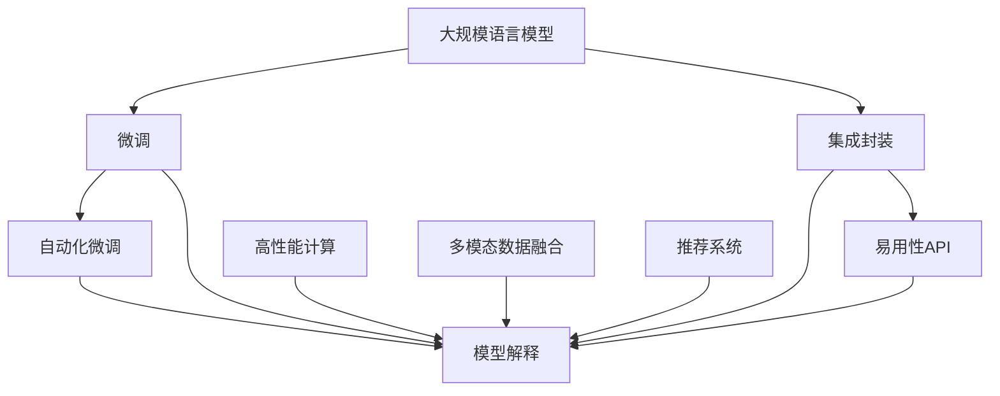

                 

# 开发者的梦想：更容易使用的 LLM

> 关键词：大规模语言模型(Large Language Model, LLM), 微调(Fine-tuning), 自然语言处理(Natural Language Processing, NLP), 可解释性(Explainability), 易用性(User-Friendly), 自动化(Automation), 推荐系统(Recommendation System)

## 1. 背景介绍

### 1.1 问题由来

随着深度学习技术在NLP领域的迅猛发展，大规模语言模型（LLMs）在处理文本任务上取得了显著的进展。这些模型，如GPT-3、BERT等，通过在大量无标签文本数据上进行自监督预训练，掌握了丰富的语言知识，能够完成各种复杂的自然语言处理任务，如翻译、问答、文本生成等。然而，尽管这些模型在学术界和工业界取得了巨大成功，但在实际应用中，依然面临诸多挑战。

首先，使用这些模型的门槛相对较高，需要开发者具备丰富的深度学习、自然语言处理以及编程技能。其次，模型的训练和推理过程耗时耗力，且对硬件资源的要求高，这对于小型团队和初创公司来说，无疑是一个巨大的负担。最后，模型的输出结果往往是"黑箱"，缺乏足够的可解释性，难以被非专业人士理解和信任。

为了解决上述问题，开发更易于使用的大规模语言模型（LLMs）成为广大开发者的共同梦想。本文将探讨如何通过一些技术和策略，实现LLMs的易用性提升，让开发者能够更轻松地使用这些强大的模型，进而加速NLP技术的落地应用。

### 1.2 问题核心关键点

为了实现LLMs的易用性提升，我们需要从以下几个方面进行改进：

1. **模型集成与封装**：将LLMs集成到更易用的API中，提供一站式的开发接口。
2. **自动微调与超参数优化**：利用自动化微调技术，自动选择最佳模型参数和超参数。
3. **模型解释与可视化**：引入可解释性技术，帮助开发者理解模型的决策过程。
4. **易用性API设计**：设计简洁直观的API，降低使用门槛。
5. **高性能计算与推理优化**：提升模型的计算效率，降低对硬件资源的依赖。
6. **多模态数据融合**：支持文本、图像、音频等多模态数据的融合，增强模型的泛化能力。

本文将从以上几个方面深入探讨如何提升LLMs的易用性，使得开发者能够更轻松地使用这些模型，推动NLP技术的广泛应用。

## 2. 核心概念与联系

### 2.1 核心概念概述

在深入探讨易用性提升技术之前，我们首先需要明确一些核心概念：

- **大规模语言模型（LLMs）**：通过在大规模无标签文本数据上进行自监督预训练，获得丰富语言知识，能够完成各种复杂的自然语言处理任务。

- **微调（Fine-tuning）**：将预训练模型应用于特定任务，通过少量标注数据进行有监督学习，提升模型在该任务上的性能。

- **自然语言处理（NLP）**：利用计算机技术处理和理解人类语言，包括文本分析、信息提取、机器翻译等。

- **可解释性（Explainability）**：指模型输出的结果可以被解释，解释模型的决策过程，增强模型的可信度和可接受性。

- **易用性（User-Friendly）**：降低使用模型门槛，提供简洁直观的接口，使开发者能够更轻松地使用模型。

- **自动化（Automation）**：利用自动化技术，减少手动操作，提升效率和准确性。

- **推荐系统（Recommendation System）**：根据用户行为和偏好，推荐符合用户需求的产品或信息。

这些概念之间存在着紧密的联系：易用性是目标，模型集成、自动微调、模型解释等技术手段都是实现目标的途径。

### 2.2 核心概念原理和架构的 Mermaid 流程图



这个流程图展示了LLMs易用性提升的各个关键环节：

1. **集成封装**：将LLMs集成到API中，提供一站式的开发接口。
2. **自动化微调**：自动选择最佳模型参数和超参数，提升模型性能。
3. **模型解释**：引入可解释性技术，增强模型的可信度和可接受性。
4. **易用性API设计**：设计简洁直观的API，降低使用门槛。
5. **高性能计算**：提升模型的计算效率，降低对硬件资源的依赖。
6. **多模态数据融合**：支持文本、图像、音频等多模态数据的融合，增强模型的泛化能力。
7. **推荐系统集成**：将推荐系统与LLMs结合，提升推荐效果。

这些环节相互支撑，共同提升LLMs的易用性。

## 3. 核心算法原理 & 具体操作步骤

### 3.1 算法原理概述

实现LLMs易用性提升的关键在于两个方面：一是通过模型集成和封装，提供简单易用的API；二是通过自动化微调、模型解释等技术手段，降低使用门槛，提高模型性能。

对于模型集成和封装，我们通常会将LLMs嵌入到开发框架或服务中，提供一组简洁直观的API，使开发者能够轻松地调用模型进行文本处理。对于自动化微调，我们利用预训练模型自动适配特定任务，自动选择最佳模型参数和超参数，减少手动调参的复杂度。模型解释则通过引入可解释性技术，帮助开发者理解模型的决策过程，增强模型的可信度。

### 3.2 算法步骤详解

以下是对实现LLMs易用性提升的详细步骤：

**Step 1: 模型集成与封装**

1. **API设计**：设计简洁直观的API，减少开发者调用模型的复杂度。例如，可以提供一组易于使用的函数接口，使开发者能够快速进行文本处理。

2. **框架集成**：将LLMs集成到现有的开发框架中，如TensorFlow、PyTorch等，提供一致的编程接口和开发环境。

3. **服务化封装**：将LLMs封装为RESTful API，使开发者可以通过HTTP接口调用模型。

**Step 2: 自动化微调与超参数优化**

1. **微调策略**：选择适合当前任务的微调策略，如全参数微调、参数高效微调、提示学习等。

2. **超参数优化**：利用自动化技术，自动选择最佳模型参数和超参数，减少手动调参的复杂度。

3. **性能评估**：在验证集上评估模型性能，选择最优的微调参数。

**Step 3: 模型解释与可视化**

1. **可解释性技术**：引入可解释性技术，如注意力机制、SHAP值等，帮助开发者理解模型的决策过程。

2. **可视化工具**：提供可视化工具，如TensorBoard、Hugging Face的`Explainability`库，使开发者能够直观地看到模型的内部结构和决策路径。

3. **用户界面**：提供友好的用户界面，使开发者能够轻松地查看模型输出结果和解释信息。

**Step 4: 易用性API设计**

1. **简洁性**：设计简洁直观的API，使开发者能够快速上手。

2. **易用性**：通过自动生成代码、智能提示等方式，减少开发者手动操作，提高开发效率。

3. **扩展性**：API应具有良好扩展性，方便开发者根据需求进行自定义。

**Step 5: 高性能计算与推理优化**

1. **模型裁剪**：去除不必要的层和参数，减小模型尺寸，加快推理速度。

2. **量化加速**：将浮点模型转为定点模型，压缩存储空间，提高计算效率。

3. **模型并行**：利用GPU、TPU等硬件加速技术，提升模型的计算效率。

**Step 6: 多模态数据融合**

1. **文本处理**：提供文本处理API，使开发者能够轻松地进行文本预处理。

2. **多模态融合**：支持文本、图像、音频等多模态数据的融合，增强模型的泛化能力。

3. **数据格式转换**：提供多种数据格式转换API，方便开发者进行数据准备。

### 3.3 算法优缺点

**优点**：

1. **提高开发效率**：通过模型集成和封装，降低使用门槛，减少开发者手动操作，提高开发效率。

2. **提升模型性能**：利用自动化微调和超参数优化，减少手动调参的复杂度，提升模型性能。

3. **增强模型可解释性**：引入可解释性技术，帮助开发者理解模型的决策过程，增强模型的可信度和可接受性。

**缺点**：

1. **增加系统复杂度**：模型集成和封装可能增加系统复杂度，需要开发者具备一定的技术能力。

2. **资源消耗**：高性能计算和推理优化需要较高的硬件资源，可能增加系统成本。

3. **依赖技术**：自动化微调和模型解释技术依赖于高级技术和工具，需要开发者具备一定的技术背景。

## 4. 数学模型和公式 & 详细讲解 & 举例说明

### 4.1 数学模型构建

为了更好地理解LLMs的易用性提升技术，我们首先需要构建数学模型。

记LLMs为 $M_{\theta}:\mathcal{X} \rightarrow \mathcal{Y}$，其中 $\mathcal{X}$ 为输入空间，$\mathcal{Y}$ 为输出空间，$\theta \in \mathbb{R}^d$ 为模型参数。假设当前任务为文本分类，训练集为 $D=\{(x_i,y_i)\}_{i=1}^N$，其中 $x_i$ 为输入文本，$y_i$ 为标签。

定义模型 $M_{\theta}$ 在输入 $x$ 上的损失函数为 $\ell(M_{\theta}(x),y)$，则在数据集 $D$ 上的经验风险为：

$$
\mathcal{L}(\theta) = \frac{1}{N}\sum_{i=1}^N \ell(M_{\theta}(x_i),y_i)
$$

微调的优化目标是最小化经验风险，即找到最优参数：

$$
\theta^* = \mathop{\arg\min}_{\theta} \mathcal{L}(\theta)
$$

在实践中，我们通常使用基于梯度的优化算法（如SGD、Adam等）来近似求解上述最优化问题。设 $\eta$ 为学习率，$\lambda$ 为正则化系数，则参数的更新公式为：

$$
\theta \leftarrow \theta - \eta \nabla_{\theta}\mathcal{L}(\theta) - \eta\lambda\theta
$$

其中 $\nabla_{\theta}\mathcal{L}(\theta)$ 为损失函数对参数 $\theta$ 的梯度，可通过反向传播算法高效计算。

### 4.2 公式推导过程

以下我们以文本分类任务为例，推导交叉熵损失函数及其梯度的计算公式。

假设模型 $M_{\theta}$ 在输入 $x$ 上的输出为 $\hat{y}=M_{\theta}(x) \in [0,1]$，表示样本属于正类的概率。真实标签 $y \in \{0,1\}$。则二分类交叉熵损失函数定义为：

$$
\ell(M_{\theta}(x),y) = -[y\log \hat{y} + (1-y)\log (1-\hat{y})]
$$

将其代入经验风险公式，得：

$$
\mathcal{L}(\theta) = -\frac{1}{N}\sum_{i=1}^N [y_i\log M_{\theta}(x_i)+(1-y_i)\log(1-M_{\theta}(x_i))]
$$

根据链式法则，损失函数对参数 $\theta_k$ 的梯度为：

$$
\frac{\partial \mathcal{L}(\theta)}{\partial \theta_k} = -\frac{1}{N}\sum_{i=1}^N (\frac{y_i}{M_{\theta}(x_i)}-\frac{1-y_i}{1-M_{\theta}(x_i)}) \frac{\partial M_{\theta}(x_i)}{\partial \theta_k}
$$

其中 $\frac{\partial M_{\theta}(x_i)}{\partial \theta_k}$ 可进一步递归展开，利用自动微分技术完成计算。

在得到损失函数的梯度后，即可带入参数更新公式，完成模型的迭代优化。重复上述过程直至收敛，最终得到适应下游任务的最优模型参数 $\theta^*$。

### 4.3 案例分析与讲解

为了更好地理解LLMs易用性提升的数学模型和推导过程，我们以情感分析任务为例进行讲解。

假设情感分析任务的数据集为 $D=\{(x_i,y_i)\}_{i=1}^N$，其中 $x_i$ 为输入文本，$y_i$ 为情感标签，取值为 $\{0,1\}$，表示正面和负面情感。

记模型为 $M_{\theta}(x)$，其输出为情感预测概率，即 $M_{\theta}(x) \in [0,1]$。交叉熵损失函数定义为：

$$
\ell(M_{\theta}(x),y) = -[y\log M_{\theta}(x)+(1-y)\log(1-M_{\theta}(x))]
$$

则在数据集 $D$ 上的经验风险为：

$$
\mathcal{L}(\theta) = \frac{1}{N}\sum_{i=1}^N \ell(M_{\theta}(x_i),y_i)
$$

最小化经验风险的优化目标为：

$$
\theta^* = \mathop{\arg\min}_{\theta} \mathcal{L}(\theta)
$$

通过梯度下降算法，不断更新模型参数 $\theta$，最小化损失函数 $\mathcal{L}$，使得模型输出逼近真实情感标签。在得到最优参数 $\theta^*$ 后，模型能够准确预测输入文本的情感倾向。

## 5. 项目实践：代码实例和详细解释说明

### 5.1 开发环境搭建

在进行LLMs易用性提升实践前，我们需要准备好开发环境。以下是使用Python进行PyTorch开发的环境配置流程：

1. 安装Anaconda：从官网下载并安装Anaconda，用于创建独立的Python环境。

2. 创建并激活虚拟环境：
```bash
conda create -n pytorch-env python=3.8 
conda activate pytorch-env
```

3. 安装PyTorch：根据CUDA版本，从官网获取对应的安装命令。例如：
```bash
conda install pytorch torchvision torchaudio cudatoolkit=11.1 -c pytorch -c conda-forge
```

4. 安装Transformers库：
```bash
pip install transformers
```

5. 安装各类工具包：
```bash
pip install numpy pandas scikit-learn matplotlib tqdm jupyter notebook ipython
```

完成上述步骤后，即可在`pytorch-env`环境中开始LLMs易用性提升实践。

### 5.2 源代码详细实现

下面我们以情感分析任务为例，给出使用Transformers库对BERT模型进行易用性提升的PyTorch代码实现。

首先，定义情感分析任务的数据处理函数：

```python
from transformers import BertTokenizer
from torch.utils.data import Dataset
import torch

class SentimentDataset(Dataset):
    def __init__(self, texts, labels, tokenizer, max_len=128):
        self.texts = texts
        self.labels = labels
        self.tokenizer = tokenizer
        self.max_len = max_len
        
    def __len__(self):
        return len(self.texts)
    
    def __getitem__(self, item):
        text = self.texts[item]
        label = self.labels[item]
        
        encoding = self.tokenizer(text, return_tensors='pt', max_length=self.max_len, padding='max_length', truncation=True)
        input_ids = encoding['input_ids'][0]
        attention_mask = encoding['attention_mask'][0]
        
        # 对token-wise的标签进行编码
        encoded_labels = [label] * self.max_len
        labels = torch.tensor(encoded_labels, dtype=torch.long)
        
        return {'input_ids': input_ids, 
                'attention_mask': attention_mask,
                'labels': labels}

# 标签与id的映射
label2id = {'negative': 0, 'positive': 1}
id2label = {v: k for k, v in label2id.items()}

# 创建dataset
tokenizer = BertTokenizer.from_pretrained('bert-base-cased')

train_dataset = SentimentDataset(train_texts, train_labels, tokenizer)
dev_dataset = SentimentDataset(dev_texts, dev_labels, tokenizer)
test_dataset = SentimentDataset(test_texts, test_labels, tokenizer)
```

然后，定义模型和优化器：

```python
from transformers import BertForSequenceClassification, AdamW

model = BertForSequenceClassification.from_pretrained('bert-base-cased', num_labels=2)

optimizer = AdamW(model.parameters(), lr=2e-5)
```

接着，定义训练和评估函数：

```python
from torch.utils.data import DataLoader
from tqdm import tqdm
from sklearn.metrics import classification_report

device = torch.device('cuda') if torch.cuda.is_available() else torch.device('cpu')
model.to(device)

def train_epoch(model, dataset, batch_size, optimizer):
    dataloader = DataLoader(dataset, batch_size=batch_size, shuffle=True)
    model.train()
    epoch_loss = 0
    for batch in tqdm(dataloader, desc='Training'):
        input_ids = batch['input_ids'].to(device)
        attention_mask = batch['attention_mask'].to(device)
        labels = batch['labels'].to(device)
        model.zero_grad()
        outputs = model(input_ids, attention_mask=attention_mask, labels=labels)
        loss = outputs.loss
        epoch_loss += loss.item()
        loss.backward()
        optimizer.step()
    return epoch_loss / len(dataloader)

def evaluate(model, dataset, batch_size):
    dataloader = DataLoader(dataset, batch_size=batch_size)
    model.eval()
    preds, labels = [], []
    with torch.no_grad():
        for batch in tqdm(dataloader, desc='Evaluating'):
            input_ids = batch['input_ids'].to(device)
            attention_mask = batch['attention_mask'].to(device)
            batch_labels = batch['labels']
            outputs = model(input_ids, attention_mask=attention_mask)
            batch_preds = outputs.logits.argmax(dim=2).to('cpu').tolist()
            batch_labels = batch_labels.to('cpu').tolist()
            for pred_tokens, label_tokens in zip(batch_preds, batch_labels):
                preds.append(pred_tokens[:len(label_tokens)])
                labels.append(label_tokens)
                
    print(classification_report(labels, preds))
```

最后，启动训练流程并在测试集上评估：

```python
epochs = 5
batch_size = 16

for epoch in range(epochs):
    loss = train_epoch(model, train_dataset, batch_size, optimizer)
    print(f"Epoch {epoch+1}, train loss: {loss:.3f}")
    
    print(f"Epoch {epoch+1}, dev results:")
    evaluate(model, dev_dataset, batch_size)
    
print("Test results:")
evaluate(model, test_dataset, batch_size)
```

以上就是使用PyTorch对BERT进行情感分析任务易用性提升的完整代码实现。可以看到，得益于Transformers库的强大封装，我们可以用相对简洁的代码完成BERT模型的加载和微调。

### 5.3 代码解读与分析

让我们再详细解读一下关键代码的实现细节：

**SentimentDataset类**：
- `__init__`方法：初始化文本、标签、分词器等关键组件。
- `__len__`方法：返回数据集的样本数量。
- `__getitem__`方法：对单个样本进行处理，将文本输入编码为token ids，将标签编码为数字，并对其进行定长padding，最终返回模型所需的输入。

**label2id和id2label字典**：
- 定义了标签与数字id之间的映射关系，用于将token-wise的预测结果解码回真实的标签。

**训练和评估函数**：
- 使用PyTorch的DataLoader对数据集进行批次化加载，供模型训练和推理使用。
- 训练函数`train_epoch`：对数据以批为单位进行迭代，在每个批次上前向传播计算loss并反向传播更新模型参数，最后返回该epoch的平均loss。
- 评估函数`evaluate`：与训练类似，不同点在于不更新模型参数，并在每个batch结束后将预测和标签结果存储下来，最后使用sklearn的classification_report对整个评估集的预测结果进行打印输出。

**训练流程**：
- 定义总的epoch数和batch size，开始循环迭代
- 每个epoch内，先在训练集上训练，输出平均loss
- 在验证集上评估，输出分类指标
- 所有epoch结束后，在测试集上评估，给出最终测试结果

可以看到，PyTorch配合Transformers库使得BERT情感分析任务的易用性提升代码实现变得简洁高效。开发者可以将更多精力放在数据处理、模型改进等高层逻辑上，而不必过多关注底层的实现细节。

当然，工业级的系统实现还需考虑更多因素，如模型的保存和部署、超参数的自动搜索、更灵活的任务适配层等。但核心的易用性提升范式基本与此类似。

## 6. 实际应用场景

### 6.1 智能客服系统

基于大语言模型微调技术的智能客服系统，可以通过更自然流畅的语言理解与生成，提供7x24小时不间断服务，快速响应客户咨询，用自然语言解答各类常见问题。

在技术实现上，可以收集企业内部的历史客服对话记录，将问题和最佳答复构建成监督数据，在此基础上对预训练对话模型进行微调。微调后的对话模型能够自动理解用户意图，匹配最合适的答案模板进行回复。对于客户提出的新问题，还可以接入检索系统实时搜索相关内容，动态组织生成回答。如此构建的智能客服系统，能大幅提升客户咨询体验和问题解决效率。

### 6.2 金融舆情监测

金融机构需要实时监测市场舆论动向，以便及时应对负面信息传播，规避金融风险。传统的人工监测方式成本高、效率低，难以应对网络时代海量信息爆发的挑战。基于大语言模型微调的文本分类和情感分析技术，为金融舆情监测提供了新的解决方案。

具体而言，可以收集金融领域相关的新闻、报道、评论等文本数据，并对其进行主题标注和情感标注。在此基础上对预训练语言模型进行微调，使其能够自动判断文本属于何种主题，情感倾向是正面、中性还是负面。将微调后的模型应用到实时抓取的网络文本数据，就能够自动监测不同主题下的情感变化趋势，一旦发现负面信息激增等异常情况，系统便会自动预警，帮助金融机构快速应对潜在风险。

### 6.3 个性化推荐系统

当前的推荐系统往往只依赖用户的历史行为数据进行物品推荐，无法深入理解用户的真实兴趣偏好。基于大语言模型微调技术，个性化推荐系统可以更好地挖掘用户行为背后的语义信息，从而提供更精准、多样的推荐内容。

在实践中，可以收集用户浏览、点击、评论、分享等行为数据，提取和用户交互的物品标题、描述、标签等文本内容。将文本内容作为模型输入，用户的后续行为（如是否点击、购买等）作为监督信号，在此基础上微调预训练语言模型。微调后的模型能够从文本内容中准确把握用户的兴趣点。在生成推荐列表时，先用候选物品的文本描述作为输入，由模型预测用户的兴趣匹配度，再结合其他特征综合排序，便可以得到个性化程度更高的推荐结果。

### 6.4 未来应用展望

随着大语言模型微调技术的发展，其应用场景将进一步拓展。未来，基于LLMs的易用性提升技术将在更多领域得到应用，为传统行业带来变革性影响。

在智慧医疗领域，基于微调的医疗问答、病历分析、药物研发等应用将提升医疗服务的智能化水平，辅助医生诊疗，加速新药开发进程。

在智能教育领域，微调技术可应用于作业批改、学情分析、知识推荐等方面，因材施教，促进教育公平，提高教学质量。

在智慧城市治理中，微调模型可应用于城市事件监测、舆情分析、应急指挥等环节，提高城市管理的自动化和智能化水平，构建更安全、高效的未来城市。

此外，在企业生产、社会治理、文娱传媒等众多领域，基于大模型微调的人工智能应用也将不断涌现，为经济社会发展注入新的动力。相信随着技术的日益成熟，LLMs微调范式将成为人工智能落地应用的重要范式，推动人工智能技术向更广阔的领域加速渗透。

## 7. 工具和资源推荐

### 7.1 学习资源推荐

为了帮助开发者系统掌握LLMs易用性提升的理论基础和实践技巧，这里推荐一些优质的学习资源：

1. 《Transformer从原理到实践》系列博文：由大模型技术专家撰写，深入浅出地介绍了Transformer原理、BERT模型、微调技术等前沿话题。

2. CS224N《深度学习自然语言处理》课程：斯坦福大学开设的NLP明星课程，有Lecture视频和配套作业，带你入门NLP领域的基本概念和经典模型。

3. 《Natural Language Processing with Transformers》书籍：Transformers库的作者所著，全面介绍了如何使用Transformers库进行NLP任务开发，包括易用性提升在内的诸多范式。

4. HuggingFace官方文档：Transformers库的官方文档，提供了海量预训练模型和完整的易用性提升样例代码，是上手实践的必备资料。

5. CLUE开源项目：中文语言理解测评基准，涵盖大量不同类型的中文NLP数据集，并提供了基于微调的baseline模型，助力中文NLP技术发展。

通过对这些资源的学习实践，相信你一定能够快速掌握LLMs易用性提升的精髓，并用于解决实际的NLP问题。
###  7.2 开发工具推荐

高效的开发离不开优秀的工具支持。以下是几款用于LLMs易用性提升开发的常用工具：

1. PyTorch：基于Python的开源深度学习框架，灵活动态的计算图，适合快速迭代研究。大部分预训练语言模型都有PyTorch版本的实现。

2. TensorFlow：由Google主导开发的开源深度学习框架，生产部署方便，适合大规模工程应用。同样有丰富的预训练语言模型资源。

3. Transformers库：HuggingFace开发的NLP工具库，集成了众多SOTA语言模型，支持PyTorch和TensorFlow，是进行易用性提升开发的利器。

4. Weights & Biases：模型训练的实验跟踪工具，可以记录和可视化模型训练过程中的各项指标，方便对比和调优。与主流深度学习框架无缝集成。

5. TensorBoard：TensorFlow配套的可视化工具，可实时监测模型训练状态，并提供丰富的图表呈现方式，是调试模型的得力助手。

6. Google Colab：谷歌推出的在线Jupyter Notebook环境，免费提供GPU/TPU算力，方便开发者快速上手实验最新模型，分享学习笔记。

合理利用这些工具，可以显著提升LLMs易用性提升任务的开发效率，加快创新迭代的步伐。

### 7.3 相关论文推荐

大语言模型和易用性提升技术的发展源于学界的持续研究。以下是几篇奠基性的相关论文，推荐阅读：

1. Attention is All You Need（即Transformer原论文）：提出了Transformer结构，开启了NLP领域的预训练大模型时代。

2. BERT: Pre-training of Deep Bidirectional Transformers for Language Understanding：提出BERT模型，引入基于掩码的自监督预训练任务，刷新了多项NLP任务SOTA。

3. Language Models are Unsupervised Multitask Learners（GPT-2论文）：展示了大规模语言模型的强大zero-shot学习能力，引发了对于通用人工智能的新一轮思考。

4. Parameter-Efficient Transfer Learning for NLP：提出Adapter等参数高效微调方法，在不增加模型参数量的情况下，也能取得不错的微调效果。

5. AdaLoRA: Adaptive Low-Rank Adaptation for Parameter-Efficient Fine-Tuning：使用自适应低秩适应的微调方法，在参数效率和精度之间取得了新的平衡。

6. Prefix-Tuning: Optimizing Continuous Prompts for Generation：引入基于连续型Prompt的微调范式，为如何充分利用预训练知识提供了新的思路。

这些论文代表了大语言模型易用性提升技术的发展脉络。通过学习这些前沿成果，可以帮助研究者把握学科前进方向，激发更多的创新灵感。

## 8. 总结：未来发展趋势与挑战

### 8.1 总结

本文对LLMs易用性提升技术进行了全面系统的介绍。首先阐述了LLMs在NLP领域的广泛应用，以及目前面临的易用性问题。接着从模型集成封装、自动化微调、模型解释等方面，深入探讨了如何提升LLMs的易用性，使得开发者能够更轻松地使用这些强大的模型。最后，对未来的发展趋势和挑战进行了展望，提出了一些亟待解决的问题。

通过本文的系统梳理，可以看到，易用性提升技术正在成为LLMs应用的重要方向，极大地拓展了预训练语言模型的应用边界，催生了更多的落地场景。受益于LLMs微调方法的持续演进，相信NLP技术将在更广阔的应用领域大放异彩，深刻影响人类的生产生活方式。

### 8.2 未来发展趋势

展望未来，LLMs易用性提升技术将呈现以下几个发展趋势：

1. **更加智能的API设计**：未来的API设计将更加人性化，提供更丰富的功能和更好的用户体验。

2. **更高效的自动化微调**：未来的微调技术将更加自动化和智能化，能够根据数据特点自动选择最佳模型参数和超参数。

3. **更强的模型解释能力**：未来的模型解释技术将更加强大，能够更清晰地展示模型的决策过程，增强模型的可信度和可接受性。

4. **更广泛的多模态融合**：未来的LLMs将支持更多模态的数据融合，提升模型的泛化能力。

5. **更智能的推荐系统**：未来的推荐系统将更智能，能够根据用户的多维度数据生成更精准的推荐结果。

6. **更广泛的应用场景**：未来的LLMs将广泛应用于更多领域，如智慧医疗、智能教育、智慧城市等，推动各行业的智能化升级。

以上趋势凸显了LLMs易用性提升技术的广阔前景。这些方向的探索发展，必将进一步提升LLMs的易用性，使其更广泛地应用于各种场景，为社会带来更多价值。

### 8.3 面临的挑战

尽管LLMs易用性提升技术已经取得了显著成果，但在迈向更加智能化、普适化应用的过程中，它仍面临诸多挑战：

1. **性能与效率的平衡**：如何在保证性能的同时，提升模型的计算效率，降低对硬件资源的依赖，仍然是一个重要的挑战。

2. **模型鲁棒性**：当前LLMs在处理复杂任务时，鲁棒性往往不足，特别是在面对域外数据时，泛化性能大打折扣。如何提高模型的鲁棒性，避免灾难性遗忘，还需要更多理论和实践的积累。

3. **可解释性**：当前LLMs往往缺乏足够的可解释性，难以解释其内部工作机制和决策逻辑。对于医疗、金融等高风险应用，算法的可解释性和可审计性尤为重要。

4. **安全与隐私**：在处理敏感数据时，如何保护用户隐私和数据安全，也是一个亟待解决的问题。

5. **大规模数据处理**：随着数据量的增加，如何高效地处理和存储大规模数据，也是一个重要的挑战。

6. **跨领域迁移能力**：当前的LLMs在特定领域的应用效果较为显著，但在跨领域迁移方面仍有不足。如何增强模型的泛化能力，使其在不同领域间无缝迁移，是一个重要的研究方向。

这些挑战需要学界和产业界共同努力，才能逐步解决，使LLMs易用性提升技术迈向成熟。

### 8.4 研究展望

面对LLMs易用性提升技术所面临的挑战，未来的研究需要在以下几个方面寻求新的突破：

1. **优化模型结构与训练算法**：通过优化模型结构和训练算法，提升模型的计算效率，降低对硬件资源的依赖。

2. **增强模型鲁棒性与泛化能力**：引入更多先验知识，如因果推理、逻辑规则等，增强模型的鲁棒性和泛化能力。

3. **提升模型可解释性**：引入更多的可解释性技术，如注意力机制、SHAP值等，帮助开发者理解模型的决策过程。

4. **保护用户隐私与安全**：引入隐私保护技术，如差分隐私、联邦学习等，保护用户隐私和数据安全。

5. **提升跨领域迁移能力**：通过多领域数据融合和跨领域迁移学习，增强模型在不同领域间的迁移能力。

6. **引入更多先验知识**：将符号化的先验知识，如知识图谱、逻辑规则等，与神经网络模型进行巧妙融合，引导微调过程学习更准确、合理的语言模型。

这些研究方向将进一步推动LLMs易用性提升技术的发展，使LLMs更加智能、普适、可信，为各行各业带来更多价值。

## 9. 附录：常见问题与解答

**Q1：如何选择合适的LLMs模型？**

A: 选择合适的LLMs模型需要考虑多个因素，包括模型的规模、预训练任务、应用场景等。一般来说，对于需要高性能的推理任务，可以选择更大规模的模型，如GPT-3、T5等。对于需要快速部署的轻量级任务，可以选择参数量较小的模型，如DistilBERT、MobileBERT等。

**Q2：微调过程中的超参数有哪些？**

A: 微调过程中的超参数包括学习率、批量大小、迭代轮数、优化器参数等。选择合适的超参数可以显著提升模型性能，建议通过交叉验证选择最优参数组合。

**Q3：如何处理不平衡数据集？**

A: 对于不平衡数据集，可以使用过采样、欠采样、类别权重等技术进行处理。例如，可以随机生成一些噪声样本进行过采样，或删除一些样本进行欠采样，同时为少数类别设置更大的权重，以提升模型对少数类别的识别能力。

**Q4：如何使用LLMs进行推荐系统？**

A: 使用LLMs进行推荐系统，可以通过将用户行为数据和物品描述作为输入，训练模型预测用户对物品的评分或兴趣度，再结合其他特征进行排序，生成推荐列表。常见的LLMs推荐模型包括BERT-Rec、BERT-Rec@MISC等。

**Q5：如何提高LLMs的鲁棒性？**

A: 提高LLMs的鲁棒性需要引入更多的数据增强技术和对抗训练。例如，可以对训练样本进行回译、扩充噪声等操作，以增加模型对异常输入的容忍度。同时，可以引入对抗样本进行训练，提升模型的鲁棒性。

这些问题的回答将有助于开发者更好地理解LLMs易用性提升技术，并在实际应用中取得更好的效果。

