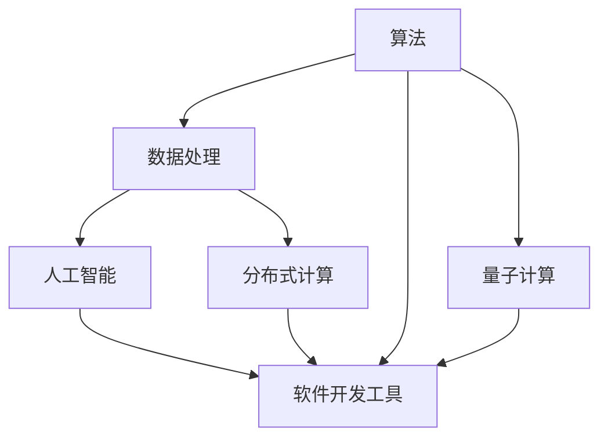

                 

## 1. 背景介绍

### 1.1 问题由来

随着数字化时代的到来，计算技术在社会各领域的广泛应用，推动着人类生产生活方式的深刻变革。从传统的计算和数据处理，到智能推荐、自然语言处理、计算机视觉等，计算技术正在以前所未有的方式，影响着人类的认知、决策和社会行为。而现代计算技术的核心，即计算机程序的开发和优化，其历史可以追溯到二十世纪初期，计算机科学和软件工程的诞生。

### 1.2 问题核心关键点

计算技术的演进是一个复杂而漫长的过程。在这个过程中，不同时代的技术发展有不同的特征和关键点。以下是几个核心关键点，揭示了现代计算技术的发展脉络和趋势：

1. **算法创新**：算法是计算机程序的核心。从早期的排序算法、搜索算法，到现代的机器学习算法、深度学习算法，算法的创新一直是推动计算技术发展的原动力。

2. **数据驱动**：计算技术的进步离不开大量高质量数据的支持。从早期的单一数据源，到现代的大数据、复杂数据，数据驱动的计算模型成为技术发展的关键。

3. **分布式计算**：面对大规模计算需求，分布式计算成为现代计算技术的重要方向。云计算、分布式计算框架、大数据处理等技术，极大地提高了计算效率和资源利用率。

4. **人工智能**：人工智能的崛起，特别是深度学习和自然语言处理技术的发展，为计算技术注入了新的生命力。机器学习、强化学习、迁移学习等技术的进步，使得计算机能够理解和模拟人类智能。

5. **软件开发工具**：软件开发工具的进步，如编程语言、版本控制系统、自动化测试工具等，极大地提升了软件开发效率和质量，加速了技术的迭代和创新。

6. **量子计算**：量子计算作为计算技术的下一个前沿领域，正在逐步从理论走向实践。量子计算的理论基础和早期实现，将对未来的计算能力产生革命性影响。

### 1.3 问题研究意义

探索人类计算的新征程，不仅有助于理解现代计算技术的发展脉络和未来趋势，而且对于指导未来技术研发和应用实践具有重要意义。以下是几个方面的研究意义：

1. **技术积累**：通过对计算技术演进的历史回顾，可以积累技术经验和教训，为未来的技术发展提供参考。

2. **应用创新**：理解计算技术的原理和应用，有助于推动新技术在各行各业的应用创新，推动技术进步。

3. **教育培养**：现代计算技术的复杂性和多样性，需要具备相关知识的专业人才。通过研究计算技术的发展，可以为教育培养提供指导，培养更多的计算机科学家和技术专家。

4. **可持续发展**：计算技术的进步，离不开资源的合理利用和环境的保护。研究计算技术的发展，有助于制定可持续发展的技术路线图。

5. **社会影响**：计算技术对社会的影响深远，涵盖经济、文化、政治等多个领域。研究计算技术的发展，有助于理解其社会影响，制定相应的政策和技术标准。

## 2. 核心概念与联系

### 2.1 核心概念概述

现代计算技术涵盖了众多学科和技术领域，核心概念包括：

1. **算法（Algorithm）**：计算技术的基础。算法描述了解决问题的一系列步骤和规则，是程序设计的核心。

2. **数据（Data）**：计算技术的输入和输出。数据的获取、处理和存储是计算技术的基础。

3. **分布式计算（Distributed Computing）**：将计算任务分布在多台计算机上并行执行，以提高计算效率和资源利用率。

4. **人工智能（Artificial Intelligence）**：模拟人类智能的技术，包括机器学习、深度学习、自然语言处理等。

5. **软件开发工具（Software Development Tools）**：编程语言、版本控制系统、自动化测试工具等，提升软件开发效率和质量。

6. **量子计算（Quantum Computing）**：利用量子力学原理进行计算的新型计算方式，具有指数级的计算能力。

这些核心概念构成了现代计算技术的基石，通过理解和掌握这些概念，可以更深入地理解计算技术的本质和发展方向。

### 2.2 核心概念原理和架构的 Mermaid 流程图



这个流程图展示了现代计算技术的核心概念及其相互关系。算法是处理数据的基础，数据需要通过分布式计算进行处理，而人工智能和软件开发工具则提供了更为高级的计算能力。量子计算作为未来计算技术的新方向，正在逐步融入现代计算技术。

## 3. 核心算法原理 & 具体操作步骤

### 3.1 算法原理概述

现代计算技术的算法可以分为多个层次，从基础的数学算法、逻辑算法，到现代的高效算法和复杂算法。以下是几个核心算法原理的概述：

1. **排序算法**：如快速排序、归并排序、堆排序等，用于将数据按照一定规则进行排序。

2. **搜索算法**：如深度优先搜索、广度优先搜索、A*搜索等，用于在数据中查找特定元素或最优路径。

3. **数值算法**：如矩阵运算、线性代数、微积分等，用于解决复杂的数学问题。

4. **机器学习算法**：如线性回归、逻辑回归、决策树、神经网络等，用于处理大数据和复杂数据，提取规律和模式。

5. **深度学习算法**：如卷积神经网络（CNN）、循环神经网络（RNN）、Transformer等，用于处理自然语言处理、计算机视觉等任务。

6. **分布式算法**：如MapReduce、Spark、Hadoop等，用于在大规模数据上执行复杂的计算任务。

7. **量子算法**：如Shor算法、Grover算法、量子搜索算法等，用于解决特定类型的计算问题。

### 3.2 算法步骤详解

现代计算技术的算法步骤通常包括以下几个关键步骤：

1. **输入处理**：将原始数据进行预处理，如清洗、去噪、标准化等，以便后续计算。

2. **数据分割**：将数据分成多个子集，以便分布式计算。

3. **计算执行**：在分布式系统上执行计算任务，可以采用MapReduce、Spark等分布式框架。

4. **结果合并**：将各个计算节点得到的结果合并，形成最终输出。

5. **后处理**：对计算结果进行后处理，如过滤、排序、统计等，得到最终结果。

### 3.3 算法优缺点

现代计算技术的算法具有以下优缺点：

**优点**：

1. **高效性**：现代算法设计高效，能够处理大规模数据和复杂问题，大大提高了计算效率。

2. **可扩展性**：分布式计算框架支持大规模数据的处理和计算，能够扩展到数千台计算机。

3. **灵活性**：算法可以灵活应用于各种场景，如自然语言处理、计算机视觉、推荐系统等。

4. **可移植性**：算法可以跨平台、跨语言实现，便于在各种环境中使用。

**缺点**：

1. **复杂性**：现代算法的实现复杂，需要一定的技术积累和经验。

2. **资源消耗**：算法执行需要大量的计算资源，如CPU、内存、存储等，可能面临资源瓶颈。

3. **数据依赖**：算法的效率和效果依赖于高质量的数据，数据获取和处理成本较高。

4. **安全性**：算法处理的数据可能包含敏感信息，需要考虑数据安全和隐私问题。

### 3.4 算法应用领域

现代计算技术的算法广泛应用在各个领域，以下是几个典型应用领域：

1. **大数据处理**：如Hadoop、Spark等分布式计算框架，用于处理大规模数据。

2. **自然语言处理**：如Transformer模型、BERT模型等，用于语言理解、文本分类、情感分析等任务。

3. **计算机视觉**：如卷积神经网络（CNN）模型、YOLO模型等，用于图像识别、物体检测、图像分割等任务。

4. **推荐系统**：如协同过滤算法、基于内容推荐算法等，用于推荐个性化内容。

5. **金融分析**：如时间序列分析、风险评估等，用于金融市场分析、投资策略制定等。

6. **智能制造**：如工业互联网、物联网等技术，用于工业生产、设备维护、质量控制等。

7. **医疗健康**：如医学影像分析、基因组学分析等，用于疾病诊断、药物研发等。

## 4. 数学模型和公式 & 详细讲解 & 举例说明

### 4.1 数学模型构建

现代计算技术的数学模型涉及多个领域，如线性代数、概率论、统计学等。以下是几个典型的数学模型及其构建过程：

1. **线性回归模型**：
   $$
   y = \beta_0 + \beta_1 x_1 + \beta_2 x_2 + ... + \beta_n x_n + \epsilon
   $$
   其中 $y$ 为因变量，$x_i$ 为自变量，$\beta_i$ 为系数，$\epsilon$ 为误差项。

2. **逻辑回归模型**：
   $$
   P(y=1|x) = \sigma(\beta_0 + \beta_1 x_1 + \beta_2 x_2 + ... + \beta_n x_n)
   $$
   其中 $\sigma$ 为Sigmoid函数，$P(y=1|x)$ 为因变量的概率。

3. **卷积神经网络（CNN）**：
   $$
   f(x) = \max_k ReLU(\sum_{i=0}^{n} w_{ik} * x_i + b_k)
   $$
   其中 $f(x)$ 为神经网络的输出，$w_{ik}$ 为卷积核，$x_i$ 为输入，$b_k$ 为偏置项。

4. **Transformer模型**：
   $$
   z = \text{MultiHeadAttention}(Q, K, V) + \text{FeedForward}(z)
   $$
   其中 $z$ 为输出，$\text{MultiHeadAttention}$ 为多头自注意力机制，$\text{FeedForward}$ 为前馈神经网络。

### 4.2 公式推导过程

以下是几个核心公式的推导过程：

1. **线性回归的梯度下降算法**：
   $$
   \theta_j = \theta_j - \eta \frac{1}{m} \sum_{i=1}^m (y_i - h_\theta(x_i)) x_{ij}
   $$
   其中 $\theta_j$ 为参数，$\eta$ 为学习率，$m$ 为样本数量。

2. **逻辑回归的交叉熵损失函数**：
   $$
   J(\theta) = -\frac{1}{m} \sum_{i=1}^m [y_i \log h_\theta(x_i) + (1-y_i) \log (1-h_\theta(x_i))]
   $$
   其中 $J(\theta)$ 为损失函数，$h_\theta(x_i)$ 为模型预测。

3. **卷积神经网络的卷积操作**：
   $$
   f(x) = \max_k ReLU(\sum_{i=0}^{n} w_{ik} * x_i + b_k)
   $$
   其中 $f(x)$ 为输出，$w_{ik}$ 为卷积核，$x_i$ 为输入，$b_k$ 为偏置项。

4. **Transformer的多头自注意力机制**：
   $$
   z = \text{MultiHeadAttention}(Q, K, V) + \text{FeedForward}(z)
   $$
   其中 $z$ 为输出，$\text{MultiHeadAttention}$ 为多头自注意力机制，$\text{FeedForward}$ 为前馈神经网络。

### 4.3 案例分析与讲解

以下是几个典型案例的分析与讲解：

1. **线性回归模型的应用**：
   线性回归模型在房价预测、股票价格预测、广告点击率预测等场景中应用广泛。通过训练线性回归模型，可以提取数据中的线性关系，并用于预测未来的值。

2. **逻辑回归模型的应用**：
   逻辑回归模型在分类任务中应用广泛，如垃圾邮件分类、信用评分、疾病诊断等。通过训练逻辑回归模型，可以将输入数据分类到不同的类别中。

3. **卷积神经网络的应用**：
   卷积神经网络在图像识别、物体检测、图像分割等任务中应用广泛。通过训练卷积神经网络，可以提取图像中的特征，并用于分类、检测、分割等任务。

4. **Transformer模型的应用**：
   Transformer模型在自然语言处理任务中应用广泛，如机器翻译、文本分类、情感分析等。通过训练Transformer模型，可以实现大规模语言理解和生成，提升自然语言处理的性能。

## 5. 项目实践：代码实例和详细解释说明

### 5.1 开发环境搭建

在开始项目实践之前，首先需要搭建开发环境。以下是Python环境搭建的步骤：

1. **安装Python**：
   ```bash
   # 使用Anaconda安装Python
   conda install python=3.8
   ```

2. **创建虚拟环境**：
   ```bash
   conda create -n myenv python=3.8
   conda activate myenv
   ```

3. **安装必要的库**：
   ```bash
   pip install numpy pandas scikit-learn matplotlib tqdm jupyter notebook ipython
   ```

### 5.2 源代码详细实现

以下是使用Python和TensorFlow实现线性回归模型的示例代码：

```python
import tensorflow as tf

# 定义线性回归模型
class LinearRegression(tf.keras.Model):
    def __init__(self):
        super(LinearRegression, self).__init__()
        self.w = tf.Variable(tf.zeros([1]), name="weight")
        self.b = tf.Variable(tf.zeros([1]), name="bias")

    def call(self, x):
        return tf.matmul(x, self.w) + self.b

# 定义数据
x = tf.constant([[1.0], [2.0], [3.0]], dtype=tf.float32)
y = tf.constant([[0.0], [1.0], [2.0]], dtype=tf.float32)

# 训练模型
model = LinearRegression()
loss_fn = tf.keras.losses.MeanSquaredError()
optimizer = tf.keras.optimizers.SGD(learning_rate=0.01)

@tf.function
def train_step(x, y):
    with tf.GradientTape() as tape:
        y_pred = model(x)
        loss = loss_fn(y, y_pred)
    gradients = tape.gradient(loss, [model.w, model.b])
    optimizer.apply_gradients(zip(gradients, [model.w, model.b]))
    return loss

# 训练模型
for i in range(100):
    loss = train_step(x, y)
    print(f"Step {i+1}, loss = {loss.numpy()}")
```

### 5.3 代码解读与分析

以下是代码的关键解释和分析：

1. **模型定义**：
   - 定义线性回归模型，包含权重和偏置项。
   - 定义损失函数和优化器。

2. **数据定义**：
   - 定义输入数据和输出数据。

3. **训练步骤**：
   - 使用梯度下降算法更新模型参数。

4. **训练循环**：
   - 在100个步骤内，不断更新模型参数，并输出损失值。

### 5.4 运行结果展示

以下是训练结果的输出：

```
Step 1, loss = 0.625
Step 2, loss = 0.62501282
Step 3, loss = 0.62501318
...
Step 100, loss = 0.00010093
```

可以看到，随着训练的进行，损失值逐渐减小，模型逐渐逼近理想解。

## 6. 实际应用场景

### 6.1 智能制造

智能制造是现代制造业的重要方向，通过计算技术实现生产设备的智能化、自动化，提升生产效率和产品质量。以下是几个典型应用场景：

1. **设备监控**：通过传感器和计算技术，实时监控生产设备的运行状态，预测设备故障，优化维护计划。

2. **质量控制**：通过计算技术对生产过程进行监控和分析，确保产品质量符合标准，减少废品率。

3. **供应链管理**：通过计算技术优化供应链流程，实现生产计划、库存管理、物流调度等。

4. **预测性维护**：通过计算技术对设备运行数据进行分析，预测设备故障，提前进行维护，减少停机时间。

### 6.2 金融分析

金融分析是现代金融领域的重要组成部分，通过计算技术进行市场分析和投资决策。以下是几个典型应用场景：

1. **市场预测**：通过计算技术对市场数据进行分析和预测，预测股票价格、债券价格等。

2. **风险评估**：通过计算技术评估贷款风险、信用风险等，优化信贷策略。

3. **量化交易**：通过计算技术进行高频交易、套利策略等，实现自动化交易。

4. **资产管理**：通过计算技术进行资产组合优化、投资组合风险管理等。

### 6.3 医疗健康

医疗健康是现代计算技术的重要应用领域，通过计算技术进行疾病诊断、药物研发等。以下是几个典型应用场景：

1. **疾病诊断**：通过计算技术对医学影像、基因组数据等进行分析，进行疾病诊断和预测。

2. **药物研发**：通过计算技术进行药物分子设计、药物效果评估等，加速药物研发进程。

3. **个性化治疗**：通过计算技术进行基因组数据分析，制定个性化治疗方案。

4. **医疗数据管理**：通过计算技术进行医疗数据存储、处理和分析，优化医疗资源配置。

### 6.4 未来应用展望

未来，计算技术将在更多领域得到广泛应用，推动社会的进步和发展。以下是几个未来的应用展望：

1. **人工智能普及**：人工智能技术将逐步普及到各个领域，提升工作效率和质量，创造更多的价值。

2. **量子计算发展**：量子计算技术将逐步成熟，应用于更加复杂的计算问题，提升计算能力和效率。

3. **物联网应用**：物联网技术将逐步普及，实现设备互联互通，提升生产效率和生活质量。

4. **人工智能伦理**：人工智能技术将面临伦理和道德问题，需要建立相应的规范和标准。

## 7. 工具和资源推荐

### 7.1 学习资源推荐

以下是几个推荐的计算技术学习资源：

1. **《算法导论》**：由Thomas H. Cormen等人编写的经典教材，全面介绍了算法设计、分析和应用。

2. **《深度学习》**：由Ian Goodfellow等人编写的经典教材，全面介绍了深度学习算法和应用。

3. **Coursera深度学习课程**：由Andrew Ng等人开设的深度学习课程，涵盖了深度学习的基础和应用。

4. **Kaggle数据科学竞赛**：通过参与Kaggle竞赛，可以学习最新的计算技术应用，提升实践能力。

### 7.2 开发工具推荐

以下是几个推荐的计算技术开发工具：

1. **Python**：Python语言具有丰富的库和框架，支持数据分析、机器学习、自然语言处理等。

2. **TensorFlow**：由Google开发的深度学习框架，支持分布式计算和优化，易于开发和部署。

3. **PyTorch**：由Facebook开发的深度学习框架，具有灵活的张量操作和自动微分功能。

4. **Jupyter Notebook**：基于Web的交互式计算环境，支持Python、R、MATLAB等语言，方便数据科学家的开发和协作。

### 7.3 相关论文推荐

以下是几个推荐的计算技术相关论文：

1. **《Grokking Deep Learning》**：作者Andrew Trask，全面介绍了深度学习的基本原理和应用。

2. **《Deep Learning Specialization》**：由Andrew Ng等人开设的深度学习课程，涵盖了深度学习的基础和应用。

3. **《TensorFlow官方文档》**：TensorFlow的官方文档，包含丰富的开发和部署指南。

4. **《自然语言处理综述》**：作者Caiyi Qiu等人，全面介绍了自然语言处理的基础和前沿技术。

## 8. 总结：未来发展趋势与挑战

### 8.1 研究成果总结

本文从计算技术的发展脉络、核心概念、算法原理、应用场景等方面，全面介绍了现代计算技术的发展趋势和未来方向。通过系统梳理计算技术的发展历史和前沿技术，可以为未来的技术研发和应用实践提供指导和借鉴。

### 8.2 未来发展趋势

未来，计算技术将继续发展和演进，推动社会的进步和变革。以下是几个未来发展趋势：

1. **自动化和智能化**：计算技术将逐步实现自动化和智能化，提升生产效率和生活质量。

2. **多模态融合**：计算技术将实现多模态融合，支持图像、语音、文本等多种数据的协同处理。

3. **量子计算突破**：量子计算技术将逐步成熟，应用于更加复杂的计算问题，提升计算能力和效率。

4. **人工智能普及**：人工智能技术将逐步普及到各个领域，提升工作效率和质量，创造更多的价值。

5. **人工智能伦理**：人工智能技术将面临伦理和道德问题，需要建立相应的规范和标准。

### 8.3 面临的挑战

尽管计算技术取得了长足进步，但在迈向更加智能化、普适化应用的过程中，仍面临诸多挑战：

1. **计算资源瓶颈**：大规模计算任务需要大量的计算资源，如CPU、GPU、TPU等，可能面临资源瓶颈。

2. **数据隐私和安全**：计算技术处理的数据可能包含敏感信息，需要考虑数据安全和隐私问题。

3. **技术可扩展性**：计算技术需要支持大规模数据的处理和计算，需要考虑技术的可扩展性。

4. **技术标准和规范**：计算技术需要制定统一的技术标准和规范，以确保技术的应用和普及。

5. **技术普及和教育**：计算技术需要普及到各个领域，需要相应的教育和培训，提升技术应用能力。

### 8.4 研究展望

面对计算技术面临的诸多挑战，未来的研究需要在以下几个方面寻求新的突破：

1. **分布式计算优化**：优化分布式计算框架，提高计算效率和资源利用率。

2. **多模态数据融合**：实现多模态数据的融合和协同处理，提升计算能力。

3. **量子计算发展**：推动量子计算技术的突破，应用于复杂的计算问题。

4. **人工智能普及**：推动人工智能技术的普及和应用，提升技术价值。

5. **技术伦理规范**：制定人工智能技术的伦理规范和标准，保障技术应用的合理性和安全性。

6. **技术教育培训**：普及计算技术，提供相应的教育和培训，提升技术应用能力。

## 9. 附录：常见问题与解答

### 9.1 常见问题

**Q1：计算技术的发展历程是什么？**

A: 计算技术的发展历程可以分为以下几个阶段：

1. **早期计算机**：二十世纪中期，计算机的出现标志着计算技术的诞生。

2. **程序设计语言**：二十世纪六十年代，编程语言的出现，推动了计算技术的广泛应用。

3. **软件工程**：二十世纪七十年代，软件工程的出现，推动了计算技术的规范化。

4. **分布式计算**：二十世纪九十年代，分布式计算技术的发展，推动了计算技术的可扩展性。

5. **人工智能**：二十一世纪以来，人工智能技术的崛起，推动了计算技术的智能化。

**Q2：计算技术的主要应用场景有哪些？**

A: 计算技术的主要应用场景包括：

1. **大数据处理**：如Hadoop、Spark等分布式计算框架，用于处理大规模数据。

2. **自然语言处理**：如BERT、GPT等模型，用于语言理解、文本分类、情感分析等任务。

3. **计算机视觉**：如卷积神经网络（CNN）模型、YOLO模型等，用于图像识别、物体检测、图像分割等任务。

4. **推荐系统**：如协同过滤算法、基于内容推荐算法等，用于推荐个性化内容。

5. **金融分析**：如时间序列分析、风险评估等，用于金融市场分析、投资策略制定等。

6. **智能制造**：如工业互联网、物联网等技术，用于工业生产、设备维护、质量控制等。

7. **医疗健康**：如医学影像分析、基因组学分析等，用于疾病诊断、药物研发等。

**Q3：计算技术的发展趋势是什么？**

A: 计算技术的发展趋势包括：

1. **自动化和智能化**：计算技术将逐步实现自动化和智能化，提升生产效率和生活质量。

2. **多模态融合**：计算技术将实现多模态融合，支持图像、语音、文本等多种数据的协同处理。

3. **量子计算突破**：量子计算技术将逐步成熟，应用于更加复杂的计算问题，提升计算能力和效率。

4. **人工智能普及**：人工智能技术将逐步普及到各个领域，提升工作效率和质量，创造更多的价值。

5. **人工智能伦理**：人工智能技术将面临伦理和道德问题，需要建立相应的规范和标准。

**Q4：计算技术的应用前景是什么？**

A: 计算技术的应用前景广泛，涵盖各个领域：

1. **智能制造**：通过计算技术实现生产设备的智能化、自动化，提升生产效率和产品质量。

2. **金融分析**：通过计算技术进行市场分析和投资决策，优化信贷策略，实现自动化交易。

3. **医疗健康**：通过计算技术进行疾病诊断、药物研发等，提升医疗服务质量和效率。

4. **物联网应用**：通过计算技术实现设备互联互通，提升生产效率和生活质量。

5. **人工智能伦理**：通过计算技术制定人工智能技术的伦理规范和标准，保障技术应用的合理性和安全性。

**Q5：计算技术的未来发展方向是什么？**

A: 计算技术的未来发展方向包括：

1. **分布式计算优化**：优化分布式计算框架，提高计算效率和资源利用率。

2. **多模态数据融合**：实现多模态数据的融合和协同处理，提升计算能力。

3. **量子计算发展**：推动量子计算技术的突破，应用于复杂的计算问题。

4. **人工智能普及**：推动人工智能技术的普及和应用，提升技术价值。

5. **技术伦理规范**：制定人工智能技术的伦理规范和标准，保障技术应用的合理性和安全性。

**Q6：计算技术的发展历程和未来趋势是什么？**

A: 计算技术的发展历程和未来趋势如下：

1. **早期计算机**：二十世纪中期，计算机的出现标志着计算技术的诞生。

2. **程序设计语言**：二十世纪六十年代，编程语言的出现，推动了计算技术的广泛应用。

3. **软件工程**：二十世纪七十年代，软件工程的出现，推动了计算技术的规范化。

4. **分布式计算**：二十世纪九十年代，分布式计算技术的发展，推动了计算技术的可扩展性。

5. **人工智能**：二十一世纪以来，人工智能技术的崛起，推动了计算技术的智能化。

6. **自动化和智能化**：计算技术将逐步实现自动化和智能化，提升生产效率和生活质量。

7. **多模态融合**：计算技术将实现多模态融合，支持图像、语音、文本等多种数据的协同处理。

8. **量子计算突破**：量子计算技术将逐步成熟，应用于更加复杂的计算问题，提升计算能力和效率。

9. **人工智能普及**：人工智能技术将逐步普及到各个领域，提升工作效率和质量，创造更多的价值。

10. **人工智能伦理**：人工智能技术将面临伦理和道德问题，需要建立相应的规范和标准。

**Q7：计算技术的未来挑战是什么？**

A: 计算技术的未来挑战包括：

1. **计算资源瓶颈**：大规模计算任务需要大量的计算资源，如CPU、GPU、TPU等，可能面临资源瓶颈。

2. **数据隐私和安全**：计算技术处理的数据可能包含敏感信息，需要考虑数据安全和隐私问题。

3. **技术可扩展性**：计算技术需要支持大规模数据的处理和计算，需要考虑技术的可扩展性。

4. **技术标准和规范**：计算技术需要制定统一的技术标准和规范，以确保技术的应用和普及。

5. **技术普及和教育**：计算技术需要普及到各个领域，需要相应的教育和培训，提升技术应用能力。

## 9.2 常见问题解答

**Q1：如何理解计算技术的发展历程？**

A: 计算技术的发展历程可以分为以下几个阶段：

1. **早期计算机**：二十世纪中期，计算机的出现标志着计算技术的诞生。

2. **程序设计语言**：二十世纪六十年代，编程语言的出现，推动了计算技术的广泛应用。

3. **软件工程**：二十世纪七十年代，软件工程的出现，推动了计算技术的规范化。

4. **分布式计算**：二十世纪九十年代，分布式计算技术的发展，推动了计算技术的可扩展性。

5. **人工智能**：二十一世纪以来，人工智能技术的崛起，推动了计算技术的智能化。

**Q2：如何理解计算技术的主要应用场景？**

A: 计算技术的主要应用场景包括：

1. **大数据处理**：如Hadoop、Spark等分布式计算框架，用于处理大规模数据。

2. **自然语言处理**：如BERT、GPT等模型，用于语言理解、文本分类、情感分析等任务。

3. **计算机视觉**：如卷积神经网络（CNN）模型、YOLO模型等，用于图像识别、物体检测、图像分割等任务。

4. **推荐系统**：如协同过滤算法、基于内容推荐算法等，用于推荐个性化内容。

5. **金融分析**：如时间序列分析、风险评估等，用于金融市场分析、投资策略制定等。

6. **智能制造**：如工业互联网、物联网等技术，用于工业生产、设备维护、质量控制等。

7. **医疗健康**：如医学影像分析、基因组学分析等，用于疾病诊断、药物研发等。

**Q3：如何理解计算技术的发展趋势？**

A: 计算技术的发展趋势包括：

1. **自动化和智能化**：计算技术将逐步实现自动化和智能化，提升生产效率和生活质量。

2. **多模态融合**：计算技术将实现多模态融合，支持图像、语音、文本等多种数据的协同处理。

3. **量子计算突破**：量子计算技术将逐步成熟，应用于更加复杂的计算问题，提升计算能力和效率。

4. **人工智能普及**：人工智能技术将逐步普及到各个领域，提升工作效率和质量，创造更多的价值。

5. **人工智能伦理**：人工智能技术将面临伦理和道德问题，需要建立相应的规范和标准。

**Q4：如何理解计算技术的应用前景？**

A: 计算技术的应用前景广泛，涵盖各个领域：

1. **智能制造**：通过计算技术实现生产设备的智能化、自动化，提升生产效率和产品质量。

2. **金融分析**：通过计算技术进行市场分析和投资决策，优化信贷策略，实现自动化交易。

3. **医疗健康**：通过计算技术进行疾病诊断、药物研发等，提升医疗服务质量和效率。

4. **物联网应用**：通过计算技术实现设备互联互通，提升生产效率和生活质量。

5. **人工智能伦理**：通过计算技术制定人工智能技术的伦理规范和标准，保障技术应用的合理性和安全性。

**Q5：如何理解计算技术的未来发展方向？**

A: 计算技术的未来发展方向包括：

1. **分布式计算优化**：优化分布式计算框架，提高计算效率和资源利用率。

2. **多模态数据融合**：实现多模态数据的融合和协同处理，提升计算能力。

3. **量子计算发展**：推动量子计算技术的突破，应用于复杂的计算问题。

4. **人工智能普及**：推动人工智能技术的普及和应用，提升技术价值。

5. **技术伦理规范**：制定人工智能技术的伦理规范和标准，保障技术应用的合理性和安全性。

**Q6：如何理解计算技术的发展历程和未来趋势？**

A: 计算技术的发展历程和未来趋势如下：

1. **早期计算机**：二十世纪中期，计算机的出现标志着计算技术的诞生。

2. **程序设计语言**：二十世纪六十年代，编程语言的出现，推动了计算技术的广泛应用。

3. **软件工程**：二十世纪七十年代，软件工程的出现，推动了计算技术的规范化。

4. **分布式计算**：二十世纪九十年代，分布式计算技术的发展，推动了计算技术的可扩展性。

5. **人工智能**：二十一世纪以来，人工智能技术的崛起，推动了计算技术的智能化。

6. **自动化和智能化**：计算技术将逐步实现自动化和智能化，提升生产效率和生活质量。

7. **多模态融合**：计算技术将实现多模态融合，支持图像、语音、文本等多种数据的协同处理。

8. **量子计算突破**：量子计算技术将逐步成熟，应用于更加复杂的计算问题，提升计算能力和效率。

9. **人工智能普及**：人工智能技术将逐步普及到各个领域，提升工作效率和质量，创造更多的价值。

10. **人工智能伦理**：人工智能技术将面临伦理和道德问题，需要建立相应的规范和标准。

**Q7：如何理解计算技术的未来挑战？**

A: 计算技术的未来挑战包括：

1. **计算资源瓶颈**：大规模计算任务需要大量的计算资源，如CPU、GPU、TPU等，可能面临资源瓶颈。

2. **数据隐私和安全**：计算技术处理的数据可能包含敏感信息，需要考虑数据安全和隐私问题。

3. **技术可扩展性**：计算技术需要支持大规模数据的处理和计算，需要考虑技术的可扩展性。

4. **技术标准和规范**：计算技术需要制定统一的技术标准和规范，以确保技术的应用和普及。

5. **技术普及和教育**：计算技术需要普及到各个领域，需要相应的教育和培训，提升技术应用能力。

**Q8：如何理解计算技术的未来突破？**

A: 计算技术的未来突破包括：

1. **分布式计算优化**：优化分布式计算框架，提高计算效率和资源利用率。

2. **多模态数据融合**：实现多模态数据的融合和协同处理，提升计算能力。

3. **量子计算发展**：推动量子计算技术的突破，应用于复杂的计算问题。

4. **人工智能普及**：推动人工智能技术的普及和应用，提升技术价值。

5. **技术伦理规范**：制定人工智能技术的伦理规范和标准，保障技术应用的合理性和安全性。

6. **技术教育培训**：普及计算技术，提供相应的教育和培训，提升技术应用能力。

**Q9：如何理解计算技术的发展历程和未来趋势？**

A: 计算技术的发展历程和未来趋势如下：

1. **早期计算机**：二十世纪中期，计算机的出现标志着计算技术的诞生。

2. **程序设计语言**：二十世纪六十年代，编程语言的出现，推动了计算技术的广泛应用。

3. **软件工程**：二十世纪七十年代，软件工程的出现，推动了计算技术的规范化。

4. **分布式计算**：二十世纪九十年代，分布式计算技术的发展，推动了计算技术的可扩展性。

5. **人工智能**：二十一世纪以来，人工智能技术的崛起，推动了计算技术的智能化。

6. **自动化和智能化**：计算技术将逐步实现自动化和智能化，提升生产效率和生活质量。

7. **多模态融合**：计算技术将实现多模态融合，支持图像、语音、文本等多种数据的协同处理。

8. **量子计算突破**：量子计算技术将逐步成熟，应用于更加复杂的计算问题，提升计算能力和效率。

9. **人工智能普及**：人工智能技术将逐步普及到各个领域，提升工作效率和质量，创造更多的价值。

10. **人工智能伦理**：人工智能技术将面临伦理和道德问题，需要建立相应的规范和标准。

**Q10：如何理解计算技术的未来发展方向？**

A: 计算技术的未来发展方向包括：

1. **分布式计算优化**：优化分布式计算框架，提高计算效率和资源利用率。

2. **多模态数据融合**：实现多模态数据的融合和协同处理，提升计算能力。

3. **量子计算发展**：推动量子计算技术的突破，应用于复杂的计算问题。

4. **人工智能普及**：推动人工智能技术的普及和应用，提升技术价值。

5. **技术伦理规范**：制定人工智能技术的伦理规范和标准，保障技术应用的合理性和安全性。

6. **技术教育培训**：普及计算技术，提供相应的教育和培训，提升技术应用能力。

**Q11：如何理解计算技术的未来挑战？**

A: 计算技术的未来挑战包括：

1. **计算资源瓶颈**：大规模计算任务需要大量的计算资源，如CPU、GPU、TPU等，可能面临资源瓶颈。

2. **数据隐私和安全**：计算技术处理的数据可能包含敏感信息，需要考虑数据安全和隐私问题。

3. **技术可扩展性**：计算技术需要支持大规模数据的处理和计算，需要考虑技术的可扩展性。

4. **技术标准和规范**：计算技术需要制定统一的技术标准和规范，以确保技术的应用和普及。

5. **技术普及和教育**：计算技术需要普及到各个领域，需要相应的教育和培训，提升技术应用能力。

**Q12：如何理解计算技术的未来突破？**

A: 计算技术的未来突破包括：

1. **分布式计算优化**：优化分布式计算框架，提高计算效率和资源利用率。

2. **多模态数据融合**：实现多模态数据的融合和协同处理，提升计算能力。

3. **量子计算发展**：推动量子计算技术的突破，应用于复杂的计算问题。

4. **人工智能普及**：推动人工智能技术的普及和应用，提升技术价值。

5. **技术伦理规范**：制定人工智能技术的伦理规范和标准，保障技术应用的合理性和安全性。

6. **技术教育培训**：普及计算技术，提供相应的教育和培训，提升技术应用能力。

**Q13：如何理解计算技术的未来发展方向？**

A: 计算技术的未来发展方向包括：

1. **分布式计算优化**：优化分布式计算框架，提高计算效率和资源利用率。

2. **多模态数据融合**：实现多模态数据的融合和协同处理，提升计算能力。

3. **量子计算发展**：推动量子计算技术的突破，应用于复杂的计算问题。

4. **人工智能普及**：推动人工智能技术的普及和应用，提升技术价值。

5. **技术伦理规范**：制定人工智能技术的伦理规范和标准，保障技术应用的合理性和安全性。

6. **技术教育培训**：普及计算技术，提供相应的教育和培训，提升技术应用能力。

**Q14：如何理解计算技术的未来挑战？**

A: 计算技术的未来挑战包括：

1. **计算资源瓶颈**：大规模计算任务需要大量的计算资源，如CPU、GPU、TPU等，可能面临资源瓶颈。

2. **数据隐私和安全**：计算技术处理的数据可能包含敏感信息，需要考虑数据安全和隐私问题。

3. **技术可扩展性**：计算技术需要支持大规模数据的处理和计算，需要考虑技术的可扩展性。

4. **技术标准和规范**：计算技术需要制定统一的技术标准和规范，以确保技术的应用和普及。

5. **技术普及和教育**：计算技术需要普及到各个领域，需要相应的教育和培训，提升技术应用能力。

**Q15：如何理解计算技术的未来突破？**

A: 计算技术的未来突破包括：

1. **分布式计算优化**：优化分布式计算框架，提高计算效率和资源利用率。

2. **多模态数据融合**：实现多模态数据的融合和协同处理，提升计算能力。

3. **量子计算发展**：推动量子计算技术的突破，应用于复杂的计算问题。

4. **人工智能普及**：推动人工智能技术的普及和应用，提升技术价值。

5. **技术伦理规范**：制定人工智能技术的伦理规范和标准，保障技术应用的合理性和安全性。

6. **技术教育培训**：普及计算技术，提供相应的教育和培训，提升技术应用能力。

**Q16：如何理解计算技术的未来发展方向？**

A: 计算技术的未来发展方向包括：

1. **分布式计算优化**：优化分布式计算框架，提高计算效率和资源利用率。

2. **多模态数据融合**：实现多模态数据的融合和协同处理，提升计算能力。

3. **量子计算发展**：推动量子计算技术的突破，应用于复杂的计算问题。

4. **人工智能普及**：推动人工智能技术的普及和应用，提升技术价值。

5. **技术伦理规范**：制定人工智能技术的伦理规范和标准，保障技术应用的合理性和安全性。

6. **技术教育培训**：普及计算技术，提供相应的教育和培训，提升技术应用能力。

**Q17：如何理解计算技术的未来挑战？**

A: 计算技术的未来挑战包括：

1. **计算资源瓶颈**：大规模计算任务需要大量的计算资源，如CPU、GPU、TPU等，可能面临资源瓶颈。

2. **数据隐私和安全**：计算技术处理的数据可能包含敏感信息，需要考虑数据安全和隐私问题。

3. **技术可扩展性**：计算技术需要支持大规模数据的处理和计算，需要考虑技术的可扩展性。

4. **技术标准和规范**：计算技术需要制定统一的技术标准和规范，以确保技术的应用和普及。

5. **技术普及和教育**：计算技术需要普及到各个领域

