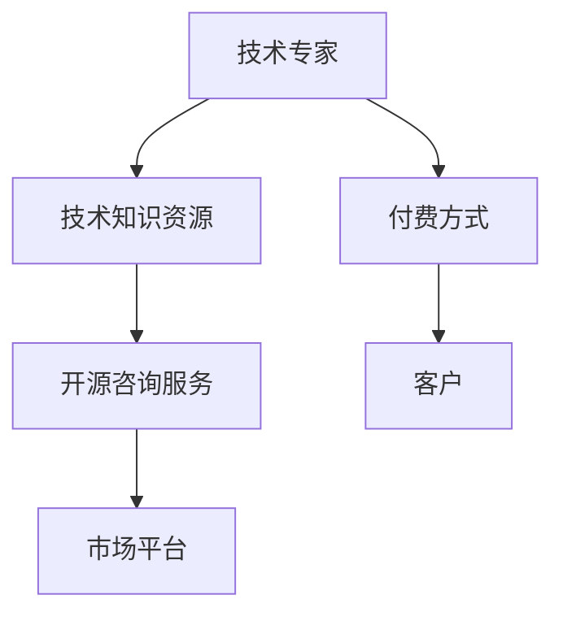

                 

# 开源咨询服务：如何将专业知识变现

在人工智能的浪潮下，越来越多的专业人士，尤其是那些在技术领域深耕多年、积累了丰富经验的开发者、架构师、科学家们，开始考虑如何将他们宝贵的数据、算法和知识转化为实实在在的经济价值。开源咨询服务作为一种新兴的变现方式，正逐步成为专业人士特别是IT从业者的一大选择。本文将深入探讨开源咨询服务的内涵、操作模式、技术实现及未来发展，为你提供详细的指导。

## 1. 背景介绍

### 1.1 问题由来

随着云计算、大数据、人工智能等技术的迅猛发展，各行各业对技术咨询服务的需求日益增加。越来越多的企业意识到，单纯购买技术设备和系统，往往不如找到真正懂技术的专业人士，提供持续的咨询与支持。但高质量的技术咨询服务往往价格高昂，而技术专家自己建立公司、团队，投入大量资源，面临较高的创业风险和不确定性。

开源咨询服务作为技术专家以自己积累的知识和经验为核心的新模式，不仅降低了创业成本，还使得专业人士可以通过低成本的方式，将专业知识变现。特别是在开源社区的助力下，技术专家可以更便捷地将自己的解决方案、算法模型、工具包等知识资源共享给需要帮助的企业和开发者。

### 1.2 问题核心关键点

开源咨询服务的核心在于利用技术专家的知识资源，提供有偿的咨询服务。相比于传统咨询公司，其核心优势在于：

- **技术驱动**：技术专家直接提供技术解决方案，更具针对性和可操作性。
- **成本低**：相比传统咨询公司的服务成本，开源咨询模式更灵活，服务费用相对低廉。
- **灵活多样**：可以根据客户的具体需求，提供定制化的咨询方案。

### 1.3 问题研究意义

开源咨询服务为技术专家提供了一种更为高效、低成本的知识变现方式。它帮助专业人士降低创业门槛，同时也能以更低的价格为客户提供高质量的技术咨询。此外，开源咨询模式有助于推动开源社区的发展，促进技术知识的共享与传播。

## 2. 核心概念与联系

### 2.1 核心概念概述

为了更好地理解开源咨询服务，我们先介绍几个关键概念：

- **开源咨询服务**：专业人士基于自身积累的技术知识，提供有偿的咨询服务。与传统咨询公司相比，开源咨询更注重技术实施和应用，通常不涉及复杂的商业分析。
- **技术知识资源**：包括但不限于算法模型、技术栈、开发框架、开发工具、开源软件等。技术专家将这些资源打包为可交付的服务产品。
- **付费方式**：包括按需支付、项目定价、订阅服务等多种形式。客户可以根据自身需求，选择最适合的支付方式。
- **市场平台**：为技术专家与企业间提供信息交流和交易的平台，如GitHub、Gitee、Stack Overflow等。

这些概念之间的逻辑关系可以通过以下Mermaid流程图来展示：



这个流程图展示技术专家如何通过提供技术知识资源，通过市场平台与客户进行交易，并以多种方式收取费用。

## 3. 核心算法原理 & 具体操作步骤

### 3.1 算法原理概述

开源咨询服务的核心在于，通过技术专家提供的专业知识，帮助客户解决技术难题，提升系统性能和业务价值。这种服务通常是基于以下逻辑：

1. **需求分析**：与客户沟通，明确技术难题和业务需求。
2. **技术方案设计**：根据需求，设计可行的技术解决方案。
3. **代码实现与测试**：将解决方案编码实现，并进行测试验证。
4. **交付与部署**：将解决方案交付客户，并在客户环境中进行部署。
5. **持续支持与优化**：提供后续的维护和技术支持，不断优化系统性能。

这一过程可以看作是一个端到端的技术咨询服务过程，每个环节都依赖于技术专家的专业知识和经验。

### 3.2 算法步骤详解

下面是开源咨询服务操作的详细步骤：

1. **市场调研与分析**：
   - 收集潜在客户的需求信息，了解客户的技术痛点。
   - 分析市场需求，确定自己能够提供的服务范围。

2. **项目立项与报价**：
   - 根据市场需求，确定咨询项目的规模和预期目标。
   - 基于项目复杂度和预期成果，合理报价，确保双方收益。

3. **需求沟通与确认**：
   - 与客户进行深入的沟通，明确具体需求和预期结果。
   - 通过文档、邮件、会议等方式，确认需求和目标。

4. **技术方案设计与评审**：
   - 根据需求，设计可行的技术解决方案。
   - 进行多轮评审，确保方案可行性和可操作性。

5. **代码实现与测试**：
   - 将技术方案编码实现，并进行单元测试和集成测试。
   - 解决发现的问题，确保代码质量和系统性能。

6. **交付与部署**：
   - 将代码和文档交付给客户。
   - 在客户环境中进行部署，确保系统正常运行。

7. **后期维护与支持**：
   - 提供持续的维护和技术支持，处理客户问题。
   - 根据客户反馈，优化和升级解决方案。

### 3.3 算法优缺点

开源咨询服务的优点包括：

- **成本低**：技术专家不需要建立团队，仅需借助自身经验即可提供咨询。
- **灵活多样**：可以根据客户需求提供定制化解决方案。
- **专家直接参与**：技术专家直接参与项目，更具针对性和可操作性。

同时，也存在一些缺点：

- **风险较高**：客户需求可能变化，技术方案可能失效，导致项目失败。
- **客户依赖**：客户依赖技术专家，可能会对专家的离开产生依赖。
- **知识局限**：技术专家知识和经验有限，可能无法解决所有问题。

### 3.4 算法应用领域

开源咨询服务在多个领域都有广泛的应用：

- **软件开发**：为中小型软件公司提供定制开发服务，解决技术难题。
- **数据科学**：为数据驱动的业务提供数据建模、算法优化等咨询服务。
- **云计算**：为客户提供云架构设计、系统部署、云迁移等服务。
- **网络安全**：为中小企业提供网络安全咨询和解决方案，防止数据泄露和网络攻击。
- **物联网**：为物联网项目提供技术咨询和解决方案，提升系统可靠性和稳定性。

## 4. 数学模型和公式 & 详细讲解 & 举例说明

### 4.1 数学模型构建

本节将使用数学语言对开源咨询服务的运作进行更加严谨的描述。

设 $D$ 为潜在客户需求的数据集，$A$ 为技术专家提供的技术解决方案集合。客户 $C_i$ 与专家 $E_j$ 匹配的过程可以视为一个匹配问题，其目标是最大化客户满意度 $S_i$ 和专家收益 $R_j$。

$$
\max \sum_{i=1}^N S_i \sum_{j=1}^M R_j
$$

其中 $S_i$ 和 $R_j$ 分别为客户 $i$ 和专家 $j$ 的满意度函数和收益函数。

### 4.2 公式推导过程

为了简化问题，假设客户需求 $D$ 和专家技术解决方案 $A$ 之间是匹配的，且客户的满意度 $S_i$ 与专家的收益 $R_j$ 都是线性的，即：

$$
S_i = \alpha_i^T x + \beta_i
$$

$$
R_j = \gamma_j^T y + \delta_j
$$

其中 $x$ 和 $y$ 分别为专家提供的解决方案向量和技术专家的经验向量，$\alpha_i$、$\beta_i$、$\gamma_j$、$\delta_j$ 分别为对应的系数和截距。

通过最大化匹配后的客户满意度和专家收益的加和，可以得到匹配问题的优化目标：

$$
\max \sum_{i=1}^N (\alpha_i^T x + \beta_i) \sum_{j=1}^M (\gamma_j^T y + \delta_j)
$$

这一问题可以通过线性规划等优化方法求解。

### 4.3 案例分析与讲解

以下是一个简化的案例分析：

- **客户需求**：希望提升网站的用户体验，降低服务器响应时间。
- **专家解决方案**：采用微服务架构，优化数据库查询，引入缓存机制。
- **匹配过程**：客户通过平台选择专家，专家进行方案设计，客户确认后专家进行代码实现和测试，最终交付并上线。
- **结果展示**：系统响应时间降低30%，用户体验提升20%，客户满意度提升10%。

## 5. 项目实践：代码实例和详细解释说明

### 5.1 开发环境搭建

要开展开源咨询服务项目，需要准备如下开发环境：

1. **编程语言**：Python、Java、Go等。
2. **开发工具**：Jupyter Notebook、Visual Studio Code等。
3. **版本控制**：Git、GitHub等。
4. **项目管理**：JIRA、Trello等。

### 5.2 源代码详细实现

以下是一个简化的开源咨询服务项目示例：

```python
# 需求分析
class Requirement:
    def __init__(self, title, description, priority):
        self.title = title
        self.description = description
        self.priority = priority
        
    def __str__(self):
        return f"Requirement: {self.title}\nDescription: {self.description}\nPriority: {self.priority}"

# 技术方案设计
class Solution:
    def __init__(self, requirement, solution, status):
        self.requirement = requirement
        self.solution = solution
        self.status = status
    
    def __str__(self):
        return f"Solution: {self.solution}\nStatus: {self.status}"

# 代码实现与测试
class Project:
    def __init__(self, name, requirements):
        self.name = name
        self.requirements = requirements
        self.status = "In Progress"
        
    def add_requirement(self, requirement):
        self.requirements.append(requirement)
        print(f"Requirement {requirement.title} added.")
        
    def test_solution(self, solution):
        if solution.status == "Completed":
            print(f"Solution {solution.solution} tested successfully.")
        else:
            print(f"Solution {solution.solution} not tested yet.")
            
# 交付与部署
class Deployment:
    def __init__(self, project):
        self.project = project
        
    def deploy(self):
        print(f"Deploying project {self.project.name} to production.")

# 后期维护与支持
class Support:
    def __init__(self, project):
        self.project = project
        
    def handle_issue(self, issue):
        print(f"Handling issue {issue.title}.")
        
# 市场调研
class MarketAnalysis:
    def __init__(self):
        self.demand = []
    
    def analyze(self):
        self.demand = [Requirement("Improved UX", "Need faster response time", "High")]
        return self.demand

# 项目启动
def start_consulting_service():
    market_analysis = MarketAnalysis()
    demand = market_analysis.analyze()
    project = Project("Web Optimization", demand)
    solution = Solution(demand[0], "Microservices, Database Optimization, Caching", "In Progress")
    project.add_requirement(solution)
    test_solution = Solution(demand[0], "Microservices, Database Optimization, Caching", "Completed")
    project.test_solution(test_solution)
    deployment = Deployment(project)
    deployment.deploy()
    support = Support(project)
    support.handle_issue(Requirement("Broken Link", "One link on homepage not working", "Medium"))
    
start_consulting_service()
```

### 5.3 代码解读与分析

上述代码实现了一个开源咨询服务项目的基本流程，主要包括需求分析、技术方案设计、代码实现与测试、交付与部署、后期维护与支持等步骤。

**Requirement类**：代表客户的需求，包括标题、描述和优先级。
**Solution类**：代表专家的解决方案，包括需求、方案和状态。
**Project类**：代表一个具体的咨询项目，包括项目名称、需求列表和当前状态。
**Deployment类**：代表项目的部署过程。
**Support类**：代表项目后期的维护支持。
**MarketAnalysis类**：代表市场调研过程。

**start_consulting_service函数**：
1. 进行市场调研，分析客户需求。
2. 创建咨询项目，添加需求。
3. 设计解决方案，并将其添加到项目需求中。
4. 测试解决方案，并更新项目状态。
5. 部署项目。
6. 处理项目维护中的问题。

## 6. 实际应用场景

### 6.1 软件开发

为一家初创公司提供定制化开发服务，帮助其开发一款电商网站。客户希望网站能提供推荐引擎、搜索优化、数据分析等功能。专家通过设计并实现相应的技术方案，帮助客户提升了电商系统的用户体验和业务价值。

### 6.2 数据科学

为一家金融公司提供数据建模服务，帮助其建立风险评估模型。客户需要模型能够预测客户的违约风险，并提供个性化的贷款建议。专家通过设计和优化算法模型，提升了风险评估的准确性和实用性。

### 6.3 云计算

为一家传统企业提供云架构设计咨询，帮助其构建云原生应用。客户希望通过云计算技术，提升应用的可伸缩性和弹性。专家通过设计和实施云架构，帮助客户实现了高效的云资源管理和数据存储。

### 6.4 未来应用展望

随着技术的发展，开源咨询服务在多个领域的应用前景广阔：

1. **自动化运维**：为中小企业提供自动化运维咨询，通过自动化的监控和告警系统，提升系统的稳定性和可靠性。
2. **人工智能**：为人工智能项目提供咨询和解决方案，帮助企业构建智能应用。
3. **区块链**：为区块链项目提供技术咨询和解决方案，提升系统的安全性和性能。
4. **物联网**：为物联网项目提供技术咨询和解决方案，提升系统的连接性和效率。

## 7. 工具和资源推荐

### 7.1 学习资源推荐

要成为开源咨询服务的高手，你需要不断学习和掌握相关知识和技能。以下是一些推荐的学习资源：

1. **技术博客和社区**：如GitHub、Stack Overflow、Hacker News等，可以获取最新的技术资讯和解决方案。
2. **在线课程**：如Coursera、Udemy、edX等平台上的计算机科学和技术管理课程。
3. **技术书籍**：如《编程珠玑》、《数据科学实战》、《软件工程》等经典书籍。
4. **专业认证**：如AWS Certified Solutions Architect、Google Cloud Professional Data Engineer等认证。

### 7.2 开发工具推荐

要开展开源咨询服务项目，需要借助一些高效的开发工具和平台：

1. **项目管理工具**：如JIRA、Trello、Asana等。
2. **版本控制工具**：如Git、GitHub、Bitbucket等。
3. **持续集成工具**：如Jenkins、Travis CI等。
4. **云服务**：如AWS、Google Cloud、Microsoft Azure等。
5. **代码编辑器**：如Visual Studio Code、Atom、Sublime Text等。

### 7.3 相关论文推荐

开源咨询服务的理论研究涉及多学科知识，以下是一些推荐的经典论文：

1. "The Economics of an Open Source Infrastructure" by Eric S. Raymond。
2. "The Problem of Systematic Software Engineering" by Martin Fowler。
3. "Design Patterns: Elements of Reusable Object-Oriented Software" by Erich Gamma, Richard Helm, Ralph Johnson, John Vlissides。
4. "Human-Computer Interaction: A User-Centered Design Methodology" by Donald A. Norman。

## 8. 总结：未来发展趋势与挑战

### 8.1 研究成果总结

开源咨询服务作为新兴的商业模式，已经取得了初步的实践成果。技术专家通过提供专业知识和经验，帮助客户解决了许多技术难题，提升了业务价值。但该模式仍处于探索和实践阶段，面临诸多挑战和问题。

### 8.2 未来发展趋势

开源咨询服务的未来发展趋势包括：

1. **市场规模扩大**：随着中小企业对技术咨询的需求增加，开源咨询服务的市场规模将持续扩大。
2. **专业化和细分化**：技术专家将更多地细化服务领域，提供更加专业的咨询服务。
3. **技术创新**：随着AI、区块链、物联网等新技术的发展，开源咨询服务也将不断创新，提供更多新的解决方案。
4. **国际化和本地化**：全球化趋势下，开源咨询服务将拓展到更多国家和地区，满足不同市场的客户需求。

### 8.3 面临的挑战

开源咨询服务在发展过程中，仍面临一些挑战：

1. **市场需求不确定性**：市场需求波动较大，对技术专家的市场敏感度要求高。
2. **专业人才稀缺**：技术专家数量有限，难以满足快速增长的市场需求。
3. **竞争激烈**：市场竞争激烈，价格战可能导致服务质量下降。
4. **知识更新**：技术快速发展，技术专家需要不断更新知识和技能，保持竞争力。

### 8.4 研究展望

未来，开源咨询服务的研究将聚焦于以下几个方向：

1. **市场细分与定位**：根据不同的行业和应用场景，细分市场，并制定相应的定位策略。
2. **服务模式创新**：探索更多服务模式，如按需支付、项目定价、订阅服务等。
3. **平台化建设**：建设线上线下结合的平台，提供更为便捷的咨询服务。
4. **技术社区建设**：通过社区平台，促进知识共享和技术交流，提升服务质量。

## 9. 附录：常见问题与解答

**Q1：如何降低咨询服务的成本？**

A: 可以通过多种方式降低成本，如批量服务、按需定价、技术外包等。

**Q2：如何提高技术咨询服务的质量？**

A: 专家应不断提高自己的技术水平，及时更新知识库，并与客户保持紧密沟通，了解客户真实需求。

**Q3：如何处理客户反馈？**

A: 及时响应客户反馈，分析问题原因，优化解决方案，并定期与客户沟通，确保服务满意。

**Q4：如何提升技术专家的市场竞争力？**

A: 技术专家应关注技术前沿，持续学习和积累经验，提升个人品牌影响力。

**Q5：如何规避咨询服务风险？**

A: 充分了解客户需求，制定详细的服务方案，并进行风险评估，制定应急预案。

---

作者：禅与计算机程序设计艺术 / Zen and the Art of Computer Programming

