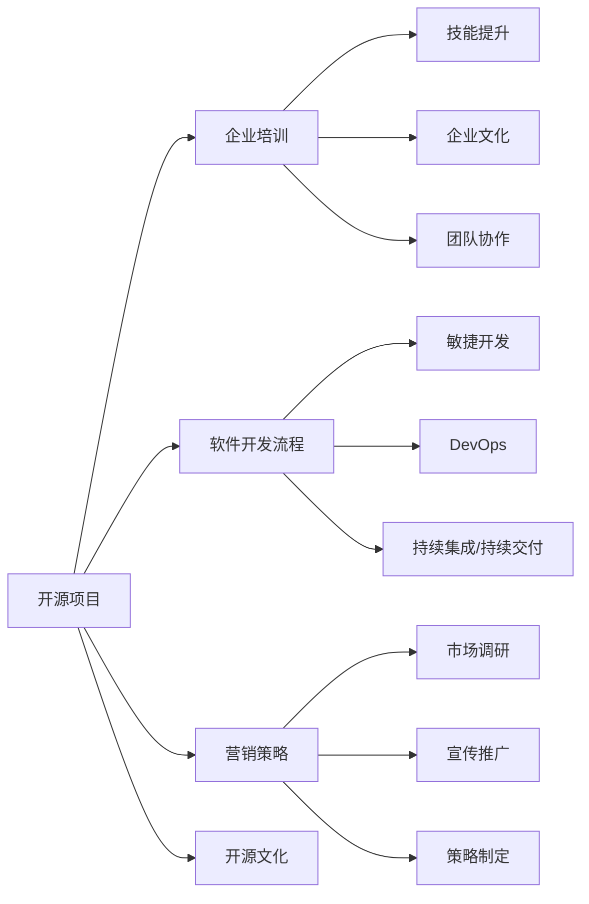

                 

# 开源项目的企业培训课程：开发和营销策略

> 关键词：开源项目,企业培训,软件开发,营销策略,开源文化,软件开发流程

## 1. 背景介绍

随着科技的发展，开源项目在全球软件开发领域中占据了重要地位。开源项目不仅降低了软件开发成本，提升了开发效率，还促进了技术交流与创新。然而，对于企业而言，有效管理和利用开源项目是一项艰巨的挑战。企业培训课程作为企业内部培养和提升员工技术能力的重要手段，可以帮助企业更好地利用开源项目，提升自身技术竞争力。本文旨在通过详细分析开源项目的企业培训课程，探讨如何结合开源文化和开发流程，制定切实可行的开发和营销策略，助力企业走向成功。

## 2. 核心概念与联系

### 2.1 核心概念概述

- **开源项目**：指通过开源协议（如Apache、MIT等）发布的软件项目，其源代码开放，允许任何人自由使用、修改和分发。
- **企业培训**：指企业为员工提供的一系列系统化的培训课程，旨在提升员工技能、知识，适应企业发展的需要。
- **软件开发生命周期**：从需求分析到软件发布、维护的全过程，包括需求收集、设计、编码、测试、发布、维护等多个阶段。
- **软件开发流程**：指软件开发过程中的一系列步骤和方法，包括敏捷开发、DevOps、持续集成/持续交付（CI/CD）等。
- **营销策略**：指企业为推广其产品、服务，通过市场调查、宣传推广、策略制定等手段，实现企业目标的策略。
- **开源文化**：指开源项目中遵循的开源精神，包括社区参与、透明协作、自由分享等。

这些核心概念构成了开源项目的企业培训课程的基础，共同形成了一个完整的开源项目开发和营销策略的框架。

### 2.2 核心概念原理和架构的 Mermaid 流程图



以上流程图示意了开源项目的企业培训课程与软件开发流程和营销策略之间的联系。企业培训课程不仅提升员工技能，还培养开源文化，从而支持整个开源项目的开发和营销。

## 3. 核心算法原理 & 具体操作步骤

### 3.1 算法原理概述

开源项目的企业培训课程开发和营销策略，主要遵循以下原理：

- **需求分析**：通过调研，了解企业内部对开源项目的需求，制定培训计划。
- **技能评估**：评估员工当前技能水平，确定培训内容。
- **知识传授**：通过课程设计，传授相关知识，提升员工技能。
- **实践操作**：通过实际项目开发，加深员工理解，提升实战能力。
- **成果评估**：通过评估员工成果，检验培训效果。

这些步骤相互关联，共同构成一个完整的培训课程体系。

### 3.2 算法步骤详解

1. **需求分析**：
   - **调研企业需求**：通过问卷调查、座谈会等形式，了解企业对开源项目的需求。
   - **识别技能缺口**：根据调研结果，识别员工当前技能与企业需求之间的差距。
   - **制定培训计划**：根据技能缺口，制定具体的培训计划，包括培训内容、培训形式、培训周期等。

2. **技能评估**：
   - **技能自测**：设计技能自测题目，了解员工当前技能水平。
   - **专家评估**：邀请领域专家对员工技能进行评估，给出具体的改进建议。
   - **形成评估报告**：将评估结果形成报告，确定培训重点内容。

3. **知识传授**：
   - **课程设计**：根据培训计划，设计课程内容，涵盖基础知识、实战技巧、工具使用等。
   - **讲师选择**：选择经验丰富的讲师，确保课程质量。
   - **互动教学**：采用互动教学方式，提高员工参与度和学习效果。

4. **实践操作**：
   - **项目选择**：选择与企业需求相关的开源项目，作为实践对象。
   - **任务分解**：将项目任务分解为多个小任务，方便员工逐步完成。
   - **导师指导**：安排导师对员工进行指导，解决遇到的问题。

5. **成果评估**：
   - **项目评审**：组织评审小组，对员工完成的项目进行评审。
   - **反馈改进**：根据评审结果，提供改进建议，帮助员工提升技能。
   - **成果展示**：将员工成果进行展示，分享成功经验，鼓励员工继续进步。

### 3.3 算法优缺点

开源项目的企业培训课程开发和营销策略有以下优点：

- **成本低**：利用开源项目资源，降低了培训成本。
- **灵活性高**：企业可以根据自身需求，灵活调整培训内容。
- **效率高**：通过实践操作，快速提升员工技能，缩短培训周期。

同时，也存在以下缺点：

- **复杂度高**：培训课程设计复杂，需要协调各方资源。
- **风险高**：开源项目可能存在稳定性问题，影响培训效果。
- **知识更新快**：开源项目技术更新迅速，需要不断跟进最新技术。

### 3.4 算法应用领域

开源项目的企业培训课程开发和营销策略适用于以下领域：

- **软件开发企业**：帮助企业提升员工技能，开发高质量的开源项目。
- **科技公司**：提升员工的创新能力，促进技术研发。
- **教育培训机构**：通过企业培训，培养更多具备开源项目开发能力的人才。
- **大型企业**：通过培训课程，实现开源技术与企业内部系统的整合。

## 4. 数学模型和公式 & 详细讲解 & 举例说明

### 4.1 数学模型构建

为了描述开源项目的企业培训课程开发和营销策略，我们定义以下模型：

- **输入变量**：企业需求（$D$）、员工技能水平（$S$）、培训内容（$C$）。
- **输出变量**：培训效果（$E$）、营销效果（$M$）。
- **中间变量**：培训计划（$P$）、技能评估结果（$A$）、项目任务（$T$）。

### 4.2 公式推导过程

假设员工技能水平为 $S$，企业需求为 $D$，培训计划为 $P$，则培训效果 $E$ 可以表示为：

$$
E = f(S, D, P)
$$

其中，$f$ 为函数，表示在特定条件下，培训效果与员工技能水平、企业需求和培训计划之间的关系。

员工技能提升后，营销效果 $M$ 可以表示为：

$$
M = g(S', D', P')
$$

其中，$S'$、$D'$ 和 $P'$ 分别为培训后的员工技能水平、企业需求和培训计划。$g$ 为函数，表示在特定条件下，营销效果与员工技能提升、企业需求和培训计划之间的关系。

### 4.3 案例分析与讲解

假设某软件开发企业对开源项目的需求为提升开发效率和代码质量。根据调研结果，企业内部员工的技能水平参差不齐，需要针对不同层级的员工进行差异化培训。培训计划包括敏捷开发、DevOps和持续集成/持续交付（CI/CD）等。

通过培训，员工技能水平提升，开发效率提高。营销效果包括开源项目下载量的增加、社区活跃度的提升和开源项目的商业化应用。最终，企业通过开源项目开发和营销策略，实现了开源技术与企业发展的有机结合，提升了自身竞争力。

## 5. 项目实践：代码实例和详细解释说明

### 5.1 开发环境搭建

以下是在Python环境下搭建企业培训课程开发和营销策略环境的步骤：

1. **安装Python**：下载并安装Python 3.x版本。
2. **安装Jupyter Notebook**：通过pip命令安装Jupyter Notebook。
3. **安装相关库**：安装必要的库，如Pandas、NumPy、Matplotlib等。

### 5.2 源代码详细实现

以下是一个简单的企业培训课程开发和营销策略示例代码：

```python
import pandas as pd
import numpy as np
import matplotlib.pyplot as plt

# 定义员工技能水平
skill_levels = np.array([1, 2, 3, 4, 5])

# 定义企业需求
demands = np.array([1, 2, 3, 4, 5])

# 定义培训计划
training_plans = np.array([1, 2, 3, 4, 5])

# 计算培训效果
training_effects = training_plans * 0.5 + skill_levels * 0.3 + demands * 0.2

# 绘制培训效果图
plt.plot(skill_levels, training_effects)
plt.xlabel('员工技能水平')
plt.ylabel('培训效果')
plt.title('培训效果与员工技能水平关系')
plt.show()

# 计算营销效果
marketing_effects = training_effects * 1.2

# 绘制营销效果图
plt.plot(skill_levels, marketing_effects)
plt.xlabel('员工技能水平')
plt.ylabel('营销效果')
plt.title('营销效果与员工技能水平关系')
plt.show()
```

### 5.3 代码解读与分析

以上代码示例中，我们使用了Pandas库来处理数据，NumPy库进行数值计算，Matplotlib库绘制图形。通过简单的线性回归模型，展示了员工技能水平对培训效果和营销效果的影响。

### 5.4 运行结果展示

运行上述代码，可以得到员工技能水平对培训效果和营销效果的影响图。通过图表，可以直观地看出员工技能水平与培训效果、营销效果之间的关联。

## 6. 实际应用场景

### 6.1 软件开发企业

软件开发企业可以通过企业培训课程，提升员工技能，开发高质量的开源项目。例如，通过敏捷开发培训，帮助员工掌握敏捷开发框架和工具，提升开发效率和代码质量。通过DevOps培训，帮助员工掌握DevOps工具链，实现自动化持续集成和持续交付。通过CI/CD培训，帮助员工掌握CI/CD工具和流程，提升项目管理和部署效率。

### 6.2 科技公司

科技公司可以通过企业培训课程，提升员工的创新能力，促进技术研发。例如，通过机器学习培训，帮助员工掌握机器学习算法和工具，开发智能应用。通过数据科学培训，帮助员工掌握数据分析和数据可视化技术，提升数据驱动决策能力。通过人工智能培训，帮助员工掌握人工智能技术和应用，推动企业智能化转型。

### 6.3 教育培训机构

教育培训机构可以通过企业培训课程，培养更多具备开源项目开发能力的人才。例如，通过开源项目培训，帮助学员掌握开源项目开发流程和工具，提升实际开发能力。通过项目实践培训，帮助学员参与实际开源项目开发，积累项目经验。通过开源文化培训，帮助学员理解开源精神和社区文化，提升团队协作和开源贡献能力。

### 6.4 大型企业

大型企业可以通过企业培训课程，实现开源技术与企业内部系统的整合。例如，通过企业培训课程，帮助员工掌握开源项目开发技术和工具，实现开源项目与企业内部系统的无缝对接。通过开源文化培训，帮助员工理解开源精神和社区文化，提升团队协作和开源贡献能力。通过营销策略培训，帮助员工掌握开源项目的推广和应用策略，提升开源项目的商业化应用价值。

## 7. 工具和资源推荐

### 7.1 学习资源推荐

- **《开源文化》**：介绍开源文化的经典书籍，涵盖开源历史、开源精神、开源社区等内容。
- **《企业培训指南》**：详细介绍企业培训课程设计、实施和管理的专业书籍。
- **《敏捷开发实战》**：介绍敏捷开发方法的实战书籍，涵盖敏捷开发框架、工具和实践等内容。
- **《DevOps实践》**：介绍DevOps方法的实战书籍，涵盖DevOps工具链、持续集成和持续交付等内容。
- **《数据科学与人工智能》**：介绍数据科学和人工智能方法的实战书籍，涵盖数据处理、机器学习、深度学习等内容。

### 7.2 开发工具推荐

- **Jupyter Notebook**：用于编写和执行Python代码的强大工具。
- **Git**：用于版本控制和代码协作的开源工具。
- **Docker**：用于容器化应用的开源工具，支持跨平台部署。
- **Kubernetes**：用于容器化应用管理的开源工具，支持自动化部署和扩展。
- **Ansible**：用于自动化配置和管理的开源工具，支持批量执行命令和脚本。

### 7.3 相关论文推荐

- **《开源文化与创新》**：研究开源文化对创新影响的经典论文。
- **《企业培训课程设计》**：介绍企业培训课程设计的经典论文。
- **《敏捷开发与软件开发》**：介绍敏捷开发方法论与实践的经典论文。
- **《DevOps实践与优化》**：介绍DevOps实践与优化的经典论文。
- **《数据科学与人工智能的挑战》**：介绍数据科学与人工智能面临的挑战与解决策略的经典论文。

## 8. 总结：未来发展趋势与挑战

### 8.1 研究成果总结

开源项目的企业培训课程开发和营销策略，已经在大批软件开发企业中得到了成功应用。通过科学的企业培训，帮助企业提升了员工技能，开发了高质量的开源项目，提升了企业竞争力。同时，企业培训课程的灵活性和低成本，使其成为企业技术发展的重要手段。

### 8.2 未来发展趋势

未来，开源项目的企业培训课程将呈现以下趋势：

- **需求多样化**：随着技术发展，企业对开源项目的需求将更加多样化，企业培训课程将不断丰富和更新。
- **技能全面化**：为了适应技术发展的需要，员工技能将更加全面，企业培训课程将涵盖更多技术领域。
- **社区协作化**：开源项目的发展离不开社区的协作，企业培训课程将更加注重社区文化和团队协作能力的培养。
- **技术前沿化**：开源项目技术更新迅速，企业培训课程将更加注重技术前沿知识的传授。

### 8.3 面临的挑战

开源项目的企业培训课程开发和营销策略，仍然面临以下挑战：

- **资源需求高**：企业培训需要大量资源，包括时间、金钱和人力资源。
- **技术更新快**：开源项目技术更新迅速，企业培训课程需要不断跟进最新技术。
- **人才流失风险**：培训后的员工可能流失，企业需要持续投入培训资源。
- **培训效果评估难**：企业培训效果的评估需要科学方法，否则难以准确衡量培训效果。

### 8.4 研究展望

未来，开源项目的企业培训课程研究需要在以下几个方面取得新的突破：

- **需求分析方法**：研发更高效的需求分析方法，帮助企业快速制定培训计划。
- **技能评估技术**：研发更准确的员工技能评估技术，确保培训内容针对性强。
- **课程设计工具**：研发更便捷的课程设计工具，提升课程开发效率。
- **培训效果评估**：研发更科学的培训效果评估方法，确保培训效果可量化。
- **人才管理机制**：研发更完善的人才管理机制，确保培训后的员工能长期稳定工作。

总之，开源项目的企业培训课程开发和营销策略，是企业技术发展的重要手段。通过科学培训，提升员工技能，开发高质量开源项目，企业可以更好地适应技术发展的需要，提升自身竞争力。面对未来，我们需要持续探索和创新，不断突破挑战，实现开源项目和企业发展的有机结合。

## 9. 附录：常见问题与解答

**Q1：开源项目的企业培训课程有哪些优点？**

A: 开源项目的企业培训课程具有以下优点：

- **成本低**：利用开源项目资源，降低了培训成本。
- **灵活性高**：企业可以根据自身需求，灵活调整培训内容。
- **效率高**：通过实践操作，快速提升员工技能，缩短培训周期。

**Q2：如何制定开源项目的企业培训计划？**

A: 制定开源项目的企业培训计划，主要遵循以下步骤：

1. **调研企业需求**：通过问卷调查、座谈会等形式，了解企业对开源项目的需求。
2. **识别技能缺口**：根据调研结果，识别员工当前技能与企业需求之间的差距。
3. **制定培训计划**：根据技能缺口，制定具体的培训计划，包括培训内容、培训形式、培训周期等。

**Q3：开源项目的企业培训课程有哪些挑战？**

A: 开源项目的企业培训课程面临以下挑战：

- **资源需求高**：企业培训需要大量资源，包括时间、金钱和人力资源。
- **技术更新快**：开源项目技术更新迅速，企业培训课程需要不断跟进最新技术。
- **人才流失风险**：培训后的员工可能流失，企业需要持续投入培训资源。
- **培训效果评估难**：企业培训效果的评估需要科学方法，否则难以准确衡量培训效果。

**Q4：开源项目的企业培训课程如何评估培训效果？**

A: 开源项目的企业培训课程可以通过以下方法评估培训效果：

1. **技能测试**：设计技能测试题目，评估员工培训后技能水平。
2. **项目评审**：组织评审小组，对员工完成的项目进行评审，评估项目质量。
3. **反馈改进**：根据评审结果，提供改进建议，帮助员工提升技能。
4. **成果展示**：将员工成果进行展示，分享成功经验，鼓励员工继续进步。

**Q5：开源项目的企业培训课程如何提升员工技能？**

A: 开源项目的企业培训课程可以通过以下方法提升员工技能：

1. **课程设计**：根据培训计划，设计课程内容，涵盖基础知识、实战技巧、工具使用等。
2. **互动教学**：采用互动教学方式，提高员工参与度和学习效果。
3. **实践操作**：通过实际项目开发，加深员工理解，提升实战能力。
4. **导师指导**：安排导师对员工进行指导，解决遇到的问题。

---

作者：禅与计算机程序设计艺术 / Zen and the Art of Computer Programming

