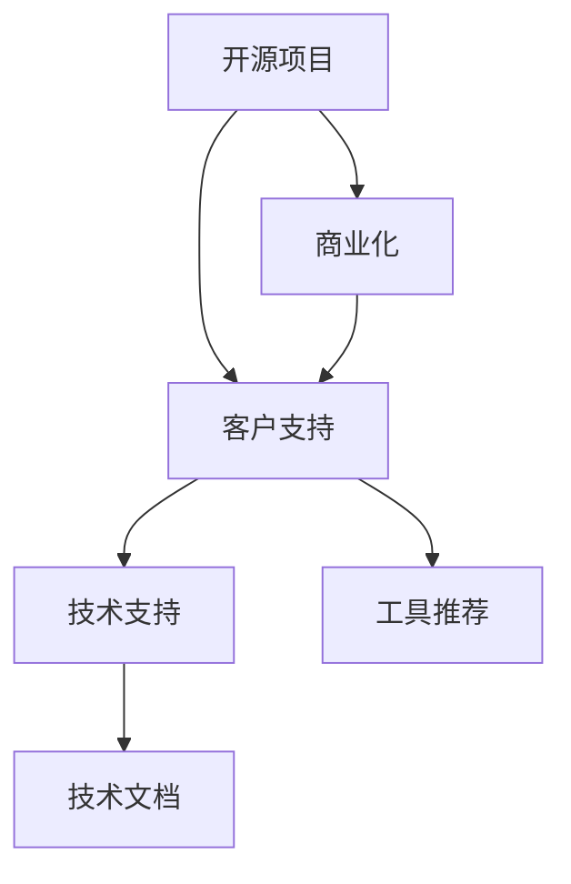

                 

# 开源项目的商业化客户支持：支持模式和工具

> 关键词：开源项目, 商业化, 客户支持, 技术支持, 技术文档, 工具推荐

## 1. 背景介绍

在现代社会中，开源项目凭借其开放性、共享性和创新性，逐渐成为了软件开发的主流趋势。随着越来越多的开发者加入开源社区，开源项目不仅丰富了软件生态，也极大推动了技术的迭代与创新。然而，开源项目在快速发展的过程中，也面临着一些严峻的挑战：如何为庞大的用户群体提供高质量的技术支持和维护服务，成为亟待解决的问题。

本文将从开源项目的客户支持模式和工具两方面进行探讨，提出切实可行的解决方案，帮助开源项目更好地应对用户需求，推动其商业化进程。

## 2. 核心概念与联系

### 2.1 核心概念概述

开源项目的商业化客户支持，涉及的核心概念包括开源项目、商业化、客户支持、技术支持、技术文档、工具推荐等。这些概念之间有着密切的联系和相互影响：

- **开源项目**：指开放源代码的软件项目，通常遵循GPL、Apache等开源协议，允许用户自由使用、修改和分发。
- **商业化**：指将开源项目转化为具有商业价值和盈利能力的产品和服务的过程。
- **客户支持**：指为开源项目用户提供的问题解答、技术指导、升级维护等服务。
- **技术支持**：指针对用户在使用开源项目中遇到的技术问题进行的解答和协助。
- **技术文档**：指为开源项目用户提供的详尽的技术说明和操作指南，帮助用户快速上手使用。
- **工具推荐**：指在开源项目客户支持和服务提供中，推荐给用户使用的各类软件、平台和服务。

这些概念共同构成了开源项目客户支持的完整框架，使开源项目能够更好地满足用户需求，实现其商业化目标。

### 2.2 核心概念原理和架构的 Mermaid 流程图



这个流程图展示了开源项目从初始开源到商业化，以及客户支持各个环节之间的联系：

1. 开源项目通过商业化获得资金，支持客户支持的各项服务。
2. 客户支持包括技术支持、技术文档和工具推荐等具体内容，涵盖用户使用的各个方面。
3. 技术支持侧重于解决用户的技术问题。
4. 技术文档提供详尽的使用指南和操作指南。
5. 工具推荐则涉及各类辅助软件、平台和服务，方便用户使用。

这些环节相互支持，共同构成开源项目的客户支持体系，推动其商业化进程。

## 3. 核心算法原理 & 具体操作步骤

### 3.1 算法原理概述

开源项目客户支持的核心算法原理，主要围绕以下几个方面展开：

1. **用户需求分析**：通过问卷调查、用户反馈等方式，收集用户需求和使用情况。
2. **问题分类与处理**：将用户问题进行分类，根据分类结果进行相应的处理和解答。
3. **知识库管理**：建立和维护一个全面的问题知识库，供用户查询和参考。
4. **自动化工具应用**：利用自动化工具进行问题处理、文档生成、数据分析等，提高效率和准确性。
5. **反馈与迭代**：根据用户反馈不断优化客户支持流程和工具，提升用户体验。

这些算法原理构成了开源项目客户支持的技术基础，有助于提升客户支持的质量和效率。

### 3.2 算法步骤详解

开源项目客户支持的具体操作步骤包括：

**Step 1: 用户需求收集与分析**
- 通过问卷调查、用户反馈、社区讨论等方式，收集用户需求和使用情况。
- 对收集到的数据进行清洗和分析，识别出常见问题和用户痛点。

**Step 2: 问题分类与处理**
- 将用户问题进行分类，如功能问题、配置问题、运行问题等。
- 针对不同类别的问题，制定相应的处理流程和标准回答模板。

**Step 3: 知识库管理**
- 建立并维护一个全面的问题知识库，涵盖常见问题、技术指南、最佳实践等。
- 定期更新知识库内容，确保其时效性和准确性。

**Step 4: 自动化工具应用**
- 引入自动化工具如JIRA、Slack、Zoom等，辅助问题处理、文档生成、数据分析等。
- 开发或引入自定义工具，提高客户支持的效率和质量。

**Step 5: 反馈与迭代**
- 定期收集用户反馈，了解客户支持的实际效果。
- 根据用户反馈不断优化和改进客户支持流程和工具，提升用户体验。

通过这些步骤，开源项目可以构建起一个高效、便捷、全面的客户支持体系，有效提升用户满意度和项目商业价值。

### 3.3 算法优缺点

开源项目客户支持的算法具有以下优点：

1. **用户参与度高**：通过用户反馈和问卷调查等方式，充分了解用户需求，提升客户支持的针对性。
2. **流程规范化**：问题分类与处理流程明确，有助于提高客户支持的效率和一致性。
3. **自动化水平高**：自动化工具的应用大大减轻了人工负担，提高了客户支持的响应速度。
4. **持续改进**：定期反馈和迭代机制，使得客户支持服务能够不断优化，适应用户需求的变化。

同时，开源项目客户支持的算法也存在以下缺点：

1. **初期投入大**：建立和维护知识库、引入自动化工具等需要一定的初始投入。
2. **知识库更新困难**：知识库的持续更新需要人力和资源，可能难以跟上技术变化的速度。
3. **用户数据隐私风险**：用户数据的收集和处理需要严格遵守数据隐私法规，确保用户隐私安全。
4. **多样性管理复杂**：开源项目涉及多种语言和平台，客户支持难度较大。

这些优缺点需要在实际应用中综合考虑，通过合理的策略和措施进行平衡和优化。

### 3.4 算法应用领域

开源项目客户支持的应用领域非常广泛，涵盖以下几个方面：

1. **技术支持**：为开源项目用户提供技术问题和故障排除的解决方案。
2. **文档支持**：提供详尽的技术文档和操作指南，帮助用户快速上手使用。
3. **社区管理**：管理开源项目的社区，促进开发者和用户之间的交流与合作。
4. **用户培训**：通过培训和教学，提升用户对开源项目的理解和使用能力。
5. **市场推广**：通过客户支持环节了解用户需求和反馈，优化产品和服务，提升市场竞争力。

这些领域的应用，使得开源项目能够更好地服务用户，推动其商业化进程。

## 4. 数学模型和公式 & 详细讲解 & 举例说明

### 4.1 数学模型构建

在开源项目客户支持中，可以使用一些数学模型来描述和优化支持流程。以下是一个简单的用户问题处理流程模型：


该模型主要包括以下几个环节：

1. **问题收集**：通过问卷调查、用户反馈等方式收集用户问题。
2. **问题分类**：将问题分类为功能问题、配置问题、运行问题等。
3. **问题处理**：根据问题分类进行相应的处理和解答。
4. **知识库更新**：将处理结果和相关信息更新到知识库中。
5. **用户反馈**：收集用户对处理结果的反馈。
6. **优化迭代**：根据用户反馈不断优化和改进客户支持流程。

### 4.2 公式推导过程

以用户问题分类为例，可以使用决策树模型来推导问题分类过程。假设有 $n$ 种可能的问题类型，$x_1, x_2, ..., x_n$ 为影响问题分类的特征，$y$ 为分类结果。决策树模型的目标是最小化信息增益，即：

$$
\min_{T} \sum_{i=1}^{n} \sum_{j=1}^{m_i} p_{ij} \log p_{ij}
$$

其中 $m_i$ 为问题 $i$ 的样本数量，$p_{ij}$ 为问题 $i$ 中样本 $j$ 属于分类 $j$ 的概率。通过递归地选择最优特征和分裂方式，构建出决策树模型，即可实现用户问题的自动分类。

### 4.3 案例分析与讲解

以GitHub开源项目为例，GitHub引入了开源社区的支持工具如GitHub Issues、GitHub Discussions等，帮助用户快速报告问题和反馈意见。通过这些工具，GitHub能够高效收集用户需求和问题，快速响应和解决，构建起一个良好的客户支持体系。

GitHub的客户支持流程主要包括：

1. **问题收集**：用户通过GitHub Issues报告问题，GitHub自动分类并标记问题状态。
2. **问题处理**：社区贡献者或GitHub员工处理问题，提供解决方案。
3. **知识库管理**：将常见问题和解决方案整理到GitHub Wiki中，供用户查询和参考。
4. **用户反馈**：用户对问题处理结果进行评价和反馈，帮助GitHub不断优化和改进客户支持流程。

通过这些工具和流程，GitHub不仅提升了自身的客户支持效率，也为开源社区的繁荣发展提供了有力保障。

## 5. 项目实践：代码实例和详细解释说明

### 5.1 开发环境搭建

为了支持开源项目的商业化客户支持，需要搭建一个高效、稳定、可扩展的开发环境。以下是基本的开发环境搭建步骤：

1. **服务器选择**：选择性能稳定、配置较高的云服务器，如AWS、Google Cloud等。
2. **数据库搭建**：搭建MySQL、PostgreSQL等关系型数据库，用于存储用户反馈和知识库数据。
3. **代码仓库管理**：搭建GitHub、GitLab等代码仓库，方便开发者和用户上传和管理代码。
4. **协作工具集成**：集成Slack、JIRA、Zoom等协作工具，提升团队协作效率。

### 5.2 源代码详细实现

以下是一个简单的开源项目客户支持系统实现示例：

```python
import os
import requests
import json

class GitHubClient:
    def __init__(self, token):
        self.token = token
        self.base_url = 'https://api.github.com'
    
    def get_issues(self, repo_name):
        headers = {'Authorization': f'token {self.token}'}
        url = f'{self.base_url}/repos/{repo_name}/issues'
        response = requests.get(url, headers=headers)
        if response.status_code == 200:
            return response.json()
        else:
            raise Exception(f'Failed to get issues: {response.status_code}')

    def create_issue(self, repo_name, title, body):
        headers = {'Authorization': f'token {self.token}'}
        url = f'{self.base_url}/repos/{repo_name}/issues'
        data = {
            'title': title,
            'body': body
        }
        response = requests.post(url, headers=headers, json=data)
        if response.status_code == 201:
            return response.json()
        else:
            raise Exception(f'Failed to create issue: {response.status_code}')

    def close_issue(self, repo_name, issue_id):
        headers = {'Authorization': f'token {self.token}'}
        url = f'{self.base_url}/repos/{repo_name}/issues/{issue_id}'
        response = requests.delete(url, headers=headers)
        if response.status_code == 204:
            return
        else:
            raise Exception(f'Failed to close issue: {response.status_code}')

# 使用示例
github_client = GitHubClient('your_token_here')
repo_name = 'your_repository_here'
title = 'My issue title'
body = 'My issue description'
issue = github_client.create_issue(repo_name, title, body)
print(f'Issue created: {issue}')

issue_id = issue['number']
issue_data = github_client.get_issues(repo_name)
for issue in issue_data:
    if issue['number'] == issue_id:
        print(f'Issue details: {issue}')
        github_client.close_issue(repo_name, issue_id)
        print(f'Issue closed: {issue}')
        break
```

### 5.3 代码解读与分析

这段代码展示了如何使用GitHub API创建一个问题并获取其详情，最后关闭该问题。通过GitHub API，用户可以方便地报告问题、获取问题详情和解决方案，从而实现高效的技术支持。

### 5.4 运行结果展示

创建和关闭问题后，可以在GitHub Issues中查看问题详情和处理状态。通过不断优化和改进问题处理流程，GitHub能够快速响应和解决用户问题，提升用户满意度和项目商业价值。

## 6. 实际应用场景

开源项目客户支持在多个实际应用场景中具有重要意义：

### 6.1 智能客服系统

智能客服系统通过客户支持工具，如JIRA、Zendesk等，帮助开源项目快速响应和解决用户问题，提升客户服务质量。用户可以通过系统提交问题、查看解决方案，并参与社区讨论，与开发者互动，从而提升用户满意度和项目活跃度。

### 6.2 技术文档编写

技术文档是开源项目客户支持的重要组成部分，通过编写详尽的技术指南和操作指南，帮助用户快速上手使用项目。GitHub的Documentation功能，允许用户创建和编辑Markdown文档，并将其与项目代码仓库关联，方便用户查找和使用。

### 6.3 社区管理

开源项目的社区管理离不开客户支持，通过有效的社区管理，可以促进开发者和用户之间的交流与合作，推动项目的繁荣发展。GitHub的Discussions功能，允许用户参与讨论和问题反馈，与开发者互动，构建起一个活跃的社区环境。

### 6.4 用户培训

开源项目的用户培训通过在线教学和直播课程等形式，帮助用户快速掌握项目的使用方法和技巧。GitHub的Learn功能，提供了丰富的学习资源和在线课程，帮助用户提升技能，促进项目的普及和应用。

### 6.5 市场推广

开源项目的市场推广需要借助客户支持，通过收集用户反馈和改进产品和服务，优化用户体验，提升市场竞争力。GitHub通过用户支持和社区管理，不断优化和改进产品和服务，吸引更多用户和开发者加入，推动项目的商业化进程。

## 7. 工具和资源推荐

### 7.1 学习资源推荐

为了帮助开发者掌握开源项目客户支持的技术和工具，推荐以下学习资源：

1. **《开源社区的客户支持》（Open Source Community Support）**：详细介绍了开源社区客户支持的各个环节，包括用户需求分析、问题分类、知识库管理等。
2. **《GitHub支持工具入门》（GitHub Support Tools Getting Started）**：介绍了GitHub支持工具的使用方法，如GitHub Issues、GitHub Discussions等。
3. **《开源项目客户支持最佳实践》（Best Practices for Open Source Project Support）**：总结了开源项目客户支持的最佳实践，包括问题分类、自动化工具应用等。
4. **《开源项目社区管理》（Open Source Community Management）**：介绍了开源项目社区管理的各种工具和方法，如Slack、JIRA等。
5. **《开源项目用户培训》（Open Source User Training）**：提供了开源项目用户培训的多种形式和资源，如在线课程、直播课程等。

这些学习资源涵盖了开源项目客户支持的各个方面，能够帮助开发者全面掌握客户支持技能和工具。

### 7.2 开发工具推荐

开源项目客户支持的开发工具众多，以下是一些常用的工具推荐：

1. **JIRA**：功能强大的问题跟踪系统，支持多种开源项目协作，方便问题收集和处理。
2. **Slack**：功能丰富的即时通讯工具，支持多种开源项目协作，方便社区交流和问题讨论。
3. **GitHub Issues**：GitHub的内置问题跟踪系统，方便用户报告问题和查看解决方案。
4. **Google Docs**：支持多人协作编辑文档的工具，方便技术文档的编写和共享。
5. **Zoom**：高质量的视频会议工具，支持大规模在线培训和社区直播。

这些工具能够帮助开发者高效管理开源项目的客户支持和社区管理。

### 7.3 相关论文推荐

开源项目客户支持的研究方向涉及多个领域，以下是几篇相关论文推荐：

1. **《开源项目客户支持体系构建》（Building a Customer Support System for Open Source Projects）**：介绍了开源项目客户支持体系的设计和实现方法。
2. **《开源项目问题分类与处理》（Problem Classification and Processing for Open Source Projects）**：研究了开源项目问题的分类和处理算法，提出了多种解决方案。
3. **《开源项目自动化工具应用》（Automated Tools for Open Source Project Support）**：探讨了开源项目自动化工具的应用，提高了客户支持的效率和质量。
4. **《开源项目社区管理与维护》（Community Management and Maintenance for Open Source Projects）**：研究了开源项目社区管理的各种策略和方法，提出了有效的管理方案。
5. **《开源项目用户培训与教育》（User Training and Education for Open Source Projects）**：总结了开源项目用户培训的最佳实践，提升了用户的使用技能和项目活跃度。

这些论文为开源项目客户支持提供了理论基础和实践指导，值得深入学习和研究。

## 8. 总结：未来发展趋势与挑战

### 8.1 研究成果总结

本文对开源项目客户支持的原理、流程、工具和实际应用进行了详细探讨，提出了切实可行的解决方案，帮助开源项目更好地支持用户需求，推动其商业化进程。

### 8.2 未来发展趋势

开源项目客户支持的未来发展趋势包括：

1. **智能化提升**：引入人工智能技术，如机器学习、自然语言处理等，提升问题分类的准确性和处理效率。
2. **多渠道融合**：通过多种渠道（如邮件、社交媒体、电话等）提供客户支持，提升用户满意度和响应速度。
3. **自助服务增强**：提供自助服务工具（如FAQ、文档搜索等），帮助用户自行解决问题，减轻人工负担。
4. **用户反馈循环**：建立用户反馈循环机制，不断优化和改进客户支持流程和工具，提升用户体验。
5. **多语言支持**：支持多语言客户支持，拓展开源项目的国际化范围。

这些趋势将进一步提升开源项目客户支持的效率和质量，推动其商业化进程。

### 8.3 面临的挑战

开源项目客户支持在发展过程中也面临一些挑战，主要包括：

1. **成本控制**：开源项目客户支持的成本控制是一个重要问题，需要在保障质量的前提下，尽可能降低成本。
2. **数据隐私**：开源项目客户支持需要处理大量的用户数据，必须严格遵守数据隐私法规，确保用户隐私安全。
3. **多样性管理**：开源项目涉及多种语言和平台，客户支持难度较大，需要灵活应对。
4. **持续优化**：客户支持流程和工具需要不断优化和改进，以适应用户需求的变化和技术进步。

这些挑战需要在实际应用中综合考虑，通过合理的策略和措施进行平衡和优化。

### 8.4 研究展望

开源项目客户支持的未来研究展望包括：

1. **智能客服系统**：开发智能客服系统，通过自然语言处理技术，提升客户支持的智能化水平。
2. **知识图谱应用**：引入知识图谱技术，构建全面的问题知识库，提升问题分类的准确性和处理效率。
3. **跨平台集成**：实现跨平台集成，通过多种渠道（如邮件、社交媒体、电话等）提供客户支持，提升用户满意度。
4. **自动化工具创新**：开发新的自动化工具，提高客户支持的效率和质量，减轻人工负担。
5. **用户体验优化**：通过用户反馈和迭代改进，不断优化和提升客户支持流程和工具，提升用户体验。

这些研究方向将为开源项目客户支持带来新的突破，推动其商业化进程。

## 9. 附录：常见问题与解答

**Q1: 开源项目客户支持应该如何进行问题分类？**

A: 开源项目客户支持的问题分类通常采用决策树模型或规则引擎实现。首先收集大量历史问题数据，进行特征提取和数据分析，然后设计分类规则或训练分类模型，将问题自动分类为常见问题、配置问题、运行问题等。

**Q2: 开源项目客户支持应该如何选择合适的工具？**

A: 开源项目客户支持应根据实际需求选择合适的工具。如GitHub Issues适用于问题跟踪和社区讨论，Slack适用于即时通讯和社区协作，GitHub Learn适用于在线培训和直播课程等。

**Q3: 开源项目客户支持应该如何管理用户反馈？**

A: 开源项目客户支持应建立用户反馈循环机制，定期收集用户反馈，分析问题原因，并不断优化和改进客户支持流程和工具，提升用户体验。

**Q4: 开源项目客户支持应该如何提升自动化水平？**

A: 开源项目客户支持应引入自动化工具，如JIRA、Slack、GitHub等，提高问题处理、文档生成和数据分析的效率和质量。同时开发自定义工具，实现更高效的自动化支持。

**Q5: 开源项目客户支持应该如何进行多语言支持？**

A: 开源项目客户支持应支持多语言客户支持，提供多种语言的文档、工具和培训资源，满足不同语言用户的需求。同时引入多语言处理技术，提升客户支持的智能化水平。

---

作者：禅与计算机程序设计艺术 / Zen and the Art of Computer Programming

