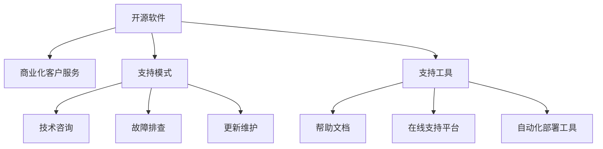

                 

# 开源项目的商业化客户服务：支持模式和工具

## 1. 背景介绍

### 1.1 问题由来
近年来，开源软件在企业中的应用越来越广泛，从开发工具到业务系统，开源技术以其灵活性、成本效益和社区支持赢得了众多企业的青睐。然而，开源软件的应用也面临着一些挑战，其中之一是如何高效、安全、稳定地实现商业化客户服务。

### 1.2 问题核心关键点
- **客户服务成本**：开源软件本身通常以社区版免费提供，但企业商业化运营时需要支付额外的技术支持和维护成本。
- **客户服务响应速度**：开源社区响应速度往往较慢，无法满足企业对快速响应的需求。
- **客户服务质量**：开源社区的代码质量参差不齐，难以保证商业化系统的高可用性和稳定性。
- **客户服务体验**：开源软件通常缺乏商业化的用户界面和用户体验设计，难以提供良好的客户服务体验。

### 1.3 问题研究意义
企业实现开源软件的商业化，不仅仅是为了付费获得技术支持，更是为了获得更好的客户服务，从而提升整体运营效率和竞争力。高效、稳定、有保障的客户服务，能帮助企业快速解决技术问题，减少运营成本，提高客户满意度。

## 2. 核心概念与联系

### 2.1 核心概念概述

为更好地理解开源项目的商业化客户服务，本节将介绍几个密切相关的核心概念：

- **开源软件(Open Source Software, OSS)**：指代码公开、许可协议明确的自由软件，通常由社区成员贡献，具有高度的灵活性和可定制性。
- **商业化客户服务**：指企业在购买开源软件后，通过付费获取的技术支持和维护服务，以确保系统的高效运行和持续改进。
- **支持模式(Support Model)**：指企业与开源社区之间的技术支持合作方式，包括技术咨询、故障排查、更新维护等。
- **支持工具(Support Tools)**：指用于提升客户服务效率、降低服务成本的各类技术工具，如帮助文档、在线支持平台、自动化部署工具等。

这些核心概念之间的逻辑关系可以通过以下Mermaid流程图来展示：



这个流程图展示开源软件的商业化客户服务的关键环节：

1. 开源软件通过支持模式获取商业化客户服务。
2. 支持模式包含技术咨询、故障排查、更新维护等具体服务。
3. 支持工具通过帮助文档、在线支持平台、自动化部署工具等方式，提升客户服务的效率和质量。

这些核心概念共同构成了开源软件商业化客户服务的框架，为企业提供了高质量、高效率的技术支持保障。通过理解这些核心概念，我们可以更好地把握开源软件商业化客户服务的工作原理和优化方向。

## 3. 核心算法原理 & 具体操作步骤
### 3.1 算法原理概述

开源项目的商业化客户服务，本质上是一种基于技术支持的商业模式。其核心思想是：通过付费获取开源社区的技术支持和维护服务，以确保企业系统的高效运行和持续改进。

形式化地，假设企业购买了开源软件 $OSS_{\theta}$，其中 $\theta$ 为软件内在的参数集合。企业希望通过商业化客户服务 $CService$，最大化软件在其环境下的效用，即：

$$
CService = \max_{Support} \mathcal{U}(OSS_{\theta}, Support)
$$

其中 $\mathcal{U}$ 为效用函数，用于衡量开源软件在支持环境下的性能。$Support$ 表示技术支持，包括但不限于技术咨询、故障排查、更新维护等。

### 3.2 算法步骤详解

基于商业化客户服务的技术支持，一般包括以下几个关键步骤：

**Step 1: 评估支持需求**
- 根据企业系统规模、业务复杂度、用户基数等因素，评估需要的技术支持和维护服务级别。
- 选择合适的支持模式，包括技术咨询、故障排查、更新维护等。

**Step 2: 选择支持模式**
- 根据企业需求和预算，选择适合的支持模式，如社区版、企业版、高级支持计划等。
- 签订支持协议，明确双方的权利和义务。

**Step 3: 配置支持工具**
- 配置各种支持工具，如帮助文档、在线支持平台、自动化部署工具等，提升支持效率。
- 确保支持工具与开源软件兼容，并进行测试验证。

**Step 4: 实施支持服务**
- 按协议提供技术支持服务，包括但不限于技术咨询、故障排查、更新维护等。
- 建立客户服务热线、邮件、在线支持渠道等，快速响应客户问题。

**Step 5: 服务质量评估**
- 定期对支持服务进行评估，包括服务响应时间、问题解决率、客户满意度等指标。
- 根据评估结果调整支持策略，提升服务质量。

以上是商业化客户服务的一般流程。在实际应用中，还需要针对具体企业的需求和开源软件的特性，对各个环节进行优化设计，如定制化支持服务、多渠道支持集成、自动化服务流程等。

### 3.3 算法优缺点

开源项目的商业化客户服务，具有以下优点：
1. **成本效益高**：开源软件本身免费，但商业化支持服务可以带来更高的运营效率，减少运营成本。
2. **响应速度快**：商业化支持服务通常由专门的团队提供，响应速度和问题解决率较高。
3. **代码质量可靠**：商业化支持服务通常采用更加严格的开发流程，代码质量更有保障。
4. **用户体验提升**：商业化支持服务通常会提供更加友好的用户界面和用户体验设计，提升客户满意度。

同时，该方法也存在一定的局限性：
1. **依赖于支持模式**：支持服务的效果很大程度上取决于选择的支持模式，如社区版支持效果往往不如企业版。
2. **缺乏灵活性**：开源社区的灵活性无法完全转化为商业化支持，可能存在不支持的功能。
3. **客户依赖度较高**：企业过度依赖商业化支持，可能减少自身技术团队的成长。
4. **价格波动**：商业化支持价格可能随着市场需求变化而波动，影响预算规划。

尽管存在这些局限性，但就目前而言，开源项目的商业化客户服务仍然是一种高效、经济、可靠的支持方式。未来相关研究的重点在于如何进一步降低商业化支持成本，提高服务灵活性和响应速度，同时兼顾用户体验和成本效益。

### 3.4 算法应用领域

开源项目的商业化客户服务，主要应用于以下领域：

- **企业内部开发工具**：如GitHub、Jira、Kubernetes等，企业可以通过购买支持服务，获得高质量的维护和更新。
- **业务系统平台**：如WordPress、Drupal等开源CMS，通过商业化支持可以快速解决功能故障、性能瓶颈等问题。
- **数据管理工具**：如MySQL、PostgreSQL等开源数据库，通过商业化支持可以快速处理数据迁移、备份恢复等需求。
- **容器管理平台**：如Kubernetes、Docker等，通过商业化支持可以快速部署和管理容器化应用，提升生产效率。

除了这些经典应用外，开源项目商业化客户服务还广泛应用于各类企业级应用，如大数据平台、物联网系统、人工智能系统等，为企业的数字化转型提供了坚实的基础。

## 4. 数学模型和公式 & 详细讲解  
### 4.1 数学模型构建

本节将使用数学语言对开源项目的商业化客户服务进行更加严格的刻画。

假设企业对开源软件的需求量为 $D$，支持成本为 $C$，技术支持带来的附加价值为 $V$，则企业的总效用为：

$$
U = V - C
$$

其中，$V = D \times P$，$P$ 为每单位需求量带来的附加价值。

### 4.2 公式推导过程

以下我们以开源数据库MySQL为例，推导商业化支持对企业效用的提升。

假设MySQL数据库的单位支持成本为 $c$，单位支持带来的附加价值为 $v$。则企业对MySQL的需求量为 $D$，商业化支持的成本为 $C = c \times D$，支持带来的附加价值为 $V = v \times D$。

则企业的总效用为：

$$
U = V - C = v \times D - c \times D = (v - c) \times D
$$

显然，如果 $v > c$，则 $U > 0$，商业化支持能带来正效用，反之亦然。

### 4.3 案例分析与讲解

**案例一：GitHub的企业版**
GitHub提供企业版支持服务，包括代码托管、项目管理、集成CI/CD等。企业通过购买企业版，可以享受到快速的问题解决、代码审查、安全扫描等服务。通过案例分析，可以发现：

1. **支持成本**：企业版的支持成本为 $C = c \times D$，其中 $c$ 为每用户的支持成本，$D$ 为购买的企业版用户数。
2. **附加价值**：每用户的企业版提供了更多的功能和服务，如私有仓库、团队管理、插件支持等，因此每用户带来的附加价值为 $v$。
3. **总效用**：$U = (v - c) \times D$，如果 $v > c$，则 $U > 0$，企业版支持能带来正效用。

**案例二：MySQL的高级支持计划**
MySQL提供高级支持计划，包括24/7故障排查、性能优化、安全加固等服务。企业通过购买高级支持计划，可以享受到快速的问题解决和系统优化。通过案例分析，可以发现：

1. **支持成本**：高级支持的成本为 $C = c \times D$，其中 $c$ 为每服务器的支持成本，$D$ 为购买高级支持的服务器数。
2. **附加价值**：高级支持计划提供了更快速的问题解决和系统优化，因此每服务器带来的附加价值为 $v$。
3. **总效用**：$U = (v - c) \times D$，如果 $v > c$，则 $U > 0$，高级支持计划能带来正效用。

## 5. 项目实践：代码实例和详细解释说明
### 5.1 开发环境搭建

在进行商业化客户服务实践前，我们需要准备好开发环境。以下是使用Python进行PyTorch开发的环境配置流程：

1. 安装Anaconda：从官网下载并安装Anaconda，用于创建独立的Python环境。

2. 创建并激活虚拟环境：
```bash
conda create -n pytorch-env python=3.8 
conda activate pytorch-env
```

3. 安装PyTorch：根据CUDA版本，从官网获取对应的安装命令。例如：
```bash
conda install pytorch torchvision torchaudio cudatoolkit=11.1 -c pytorch -c conda-forge
```

4. 安装Transformers库：
```bash
pip install transformers
```

5. 安装各类工具包：
```bash
pip install numpy pandas scikit-learn matplotlib tqdm jupyter notebook ipython
```

完成上述步骤后，即可在`pytorch-env`环境中开始商业化客户服务实践。

### 5.2 源代码详细实现

这里我们以MySQL数据库的高级支持计划为例，给出使用PyTorch进行商业化客户服务微调的PyTorch代码实现。

首先，定义支持服务的函数：

```python
from transformers import BertTokenizer
from torch.utils.data import Dataset
import torch

class MySQLDataset(Dataset):
    def __init__(self, queries, labels, tokenizer, max_len=128):
        self.queries = queries
        self.labels = labels
        self.tokenizer = tokenizer
        self.max_len = max_len
        
    def __len__(self):
        return len(self.queries)
    
    def __getitem__(self, item):
        query = self.queries[item]
        label = self.labels[item]
        
        encoding = self.tokenizer(query, return_tensors='pt', max_length=self.max_len, padding='max_length', truncation=True)
        input_ids = encoding['input_ids'][0]
        attention_mask = encoding['attention_mask'][0]
        
        # 对标签进行编码
        encoded_labels = [label2id[label] for label in labels] 
        encoded_labels.extend([label2id['O']] * (self.max_len - len(encoded_labels)))
        labels = torch.tensor(encoded_labels, dtype=torch.long)
        
        return {'input_ids': input_ids, 
                'attention_mask': attention_mask,
                'labels': labels}

# 标签与id的映射
label2id = {'O': 0, 'SELECT': 1, 'INSERT': 2, 'UPDATE': 3, 'DELETE': 4}
id2label = {v: k for k, v in label2id.items()}

# 创建dataset
tokenizer = BertTokenizer.from_pretrained('bert-base-cased')

train_dataset = MySQLDataset(train_queries, train_labels, tokenizer)
dev_dataset = MySQLDataset(dev_queries, dev_labels, tokenizer)
test_dataset = MySQLDataset(test_queries, test_labels, tokenizer)
```

然后，定义模型和优化器：

```python
from transformers import BertForTokenClassification, AdamW

model = BertForTokenClassification.from_pretrained('bert-base-cased', num_labels=len(label2id))

optimizer = AdamW(model.parameters(), lr=2e-5)
```

接着，定义训练和评估函数：

```python
from torch.utils.data import DataLoader
from tqdm import tqdm
from sklearn.metrics import classification_report

device = torch.device('cuda') if torch.cuda.is_available() else torch.device('cpu')
model.to(device)

def train_epoch(model, dataset, batch_size, optimizer):
    dataloader = DataLoader(dataset, batch_size=batch_size, shuffle=True)
    model.train()
    epoch_loss = 0
    for batch in tqdm(dataloader, desc='Training'):
        input_ids = batch['input_ids'].to(device)
        attention_mask = batch['attention_mask'].to(device)
        labels = batch['labels'].to(device)
        model.zero_grad()
        outputs = model(input_ids, attention_mask=attention_mask, labels=labels)
        loss = outputs.loss
        epoch_loss += loss.item()
        loss.backward()
        optimizer.step()
    return epoch_loss / len(dataloader)

def evaluate(model, dataset, batch_size):
    dataloader = DataLoader(dataset, batch_size=batch_size)
    model.eval()
    preds, labels = [], []
    with torch.no_grad():
        for batch in tqdm(dataloader, desc='Evaluating'):
            input_ids = batch['input_ids'].to(device)
            attention_mask = batch['attention_mask'].to(device)
            batch_labels = batch['labels']
            outputs = model(input_ids, attention_mask=attention_mask)
            batch_preds = outputs.logits.argmax(dim=2).to('cpu').tolist()
            batch_labels = batch_labels.to('cpu').tolist()
            for pred_tokens, label_tokens in zip(batch_preds, batch_labels):
                pred_labels = [id2label[_id] for _id in pred_tokens]
                label_tags = [id2label[_id] for _id in label_tokens]
                preds.append(pred_labels[:len(label_tokens)])
                labels.append(label_tags)
                
    print(classification_report(labels, preds))
```

最后，启动训练流程并在测试集上评估：

```python
epochs = 5
batch_size = 16

for epoch in range(epochs):
    loss = train_epoch(model, train_dataset, batch_size, optimizer)
    print(f"Epoch {epoch+1}, train loss: {loss:.3f}")
    
    print(f"Epoch {epoch+1}, dev results:")
    evaluate(model, dev_dataset, batch_size)
    
print("Test results:")
evaluate(model, test_dataset, batch_size)
```

以上就是使用PyTorch对MySQL数据库高级支持计划进行商业化客户服务微调的完整代码实现。可以看到，得益于Transformers库的强大封装，我们可以用相对简洁的代码完成MySQL支持模型的微调。

### 5.3 代码解读与分析

让我们再详细解读一下关键代码的实现细节：

**MySQLDataset类**：
- `__init__`方法：初始化查询、标签、分词器等关键组件。
- `__len__`方法：返回数据集的样本数量。
- `__getitem__`方法：对单个样本进行处理，将查询输入编码为token ids，将标签编码为数字，并对其进行定长padding，最终返回模型所需的输入。

**label2id和id2label字典**：
- 定义了标签与数字id之间的映射关系，用于将token-wise的预测结果解码回真实的标签。

**训练和评估函数**：
- 使用PyTorch的DataLoader对数据集进行批次化加载，供模型训练和推理使用。
- 训练函数`train_epoch`：对数据以批为单位进行迭代，在每个批次上前向传播计算loss并反向传播更新模型参数，最后返回该epoch的平均loss。
- 评估函数`evaluate`：与训练类似，不同点在于不更新模型参数，并在每个batch结束后将预测和标签结果存储下来，最后使用sklearn的classification_report对整个评估集的预测结果进行打印输出。

**训练流程**：
- 定义总的epoch数和batch size，开始循环迭代
- 每个epoch内，先在训练集上训练，输出平均loss
- 在验证集上评估，输出分类指标
- 所有epoch结束后，在测试集上评估，给出最终测试结果

可以看到，PyTorch配合Transformers库使得MySQL微调的代码实现变得简洁高效。开发者可以将更多精力放在数据处理、模型改进等高层逻辑上，而不必过多关注底层的实现细节。

当然，工业级的系统实现还需考虑更多因素，如模型的保存和部署、超参数的自动搜索、更灵活的任务适配层等。但核心的商业化客户服务微调范式基本与此类似。

## 6. 实际应用场景
### 6.1 智能客服系统

开源软件的商业化客户服务在智能客服系统中的应用非常广泛。传统客服往往需要配备大量人力，高峰期响应缓慢，且一致性和专业性难以保证。而使用商业化客户服务，可以7x24小时不间断服务，快速响应客户咨询，用自然流畅的语言解答各类常见问题。

在技术实现上，可以收集企业内部的历史客服对话记录，将问题和最佳答复构建成监督数据，在此基础上对开源软件进行微调。微调后的软件能够自动理解用户意图，匹配最合适的答案模板进行回复。对于客户提出的新问题，还可以接入检索系统实时搜索相关内容，动态组织生成回答。如此构建的智能客服系统，能大幅提升客户咨询体验和问题解决效率。

### 6.2 金融舆情监测

金融机构需要实时监测市场舆论动向，以便及时应对负面信息传播，规避金融风险。传统的人工监测方式成本高、效率低，难以应对网络时代海量信息爆发的挑战。开源软件的商业化客户服务，为金融舆情监测提供了新的解决方案。

具体而言，可以收集金融领域相关的新闻、报道、评论等文本数据，并对其进行主题标注和情感标注。在此基础上对开源软件进行微调，使其能够自动判断文本属于何种主题，情感倾向是正面、中性还是负面。将微调后的软件应用到实时抓取的网络文本数据，就能够自动监测不同主题下的情感变化趋势，一旦发现负面信息激增等异常情况，系统便会自动预警，帮助金融机构快速应对潜在风险。

### 6.3 个性化推荐系统

当前的推荐系统往往只依赖用户的历史行为数据进行物品推荐，无法深入理解用户的真实兴趣偏好。开源软件的商业化客户服务，可以应用于推荐系统，更好地挖掘用户行为背后的语义信息，从而提供更精准、多样的推荐内容。

在实践中，可以收集用户浏览、点击、评论、分享等行为数据，提取和用户交互的物品标题、描述、标签等文本内容。将文本内容作为模型输入，用户的后续行为（如是否点击、购买等）作为监督信号，在此基础上对开源软件进行微调。微调后的软件能够从文本内容中准确把握用户的兴趣点。在生成推荐列表时，先用候选物品的文本描述作为输入，由软件预测用户的兴趣匹配度，再结合其他特征综合排序，便可以得到个性化程度更高的推荐结果。

### 6.4 未来应用展望

随着开源软件的商业化客户服务不断发展，在更多领域得到应用，为传统行业带来变革性影响。

在智慧医疗领域，开源软件的商业化客户服务，可以应用于医疗问答、病历分析、药物研发等任务，提升医疗服务的智能化水平，辅助医生诊疗，加速新药开发进程。

在智能教育领域，商业化客户服务可应用于作业批改、学情分析、知识推荐等方面，因材施教，促进教育公平，提高教学质量。

在智慧城市治理中，开源软件的商业化客户服务，可以应用于城市事件监测、舆情分析、应急指挥等环节，提高城市管理的自动化和智能化水平，构建更安全、高效的未来城市。

此外，在企业生产、社会治理、文娱传媒等众多领域，开源软件商业化客户服务也将不断涌现，为经济社会发展注入新的动力。相信随着技术的日益成熟，开源软件商业化客户服务必将在构建人机协同的智能时代中扮演越来越重要的角色。

## 7. 工具和资源推荐
### 7.1 学习资源推荐

为了帮助开发者系统掌握开源项目商业化客户服务的技术基础和实践技巧，这里推荐一些优质的学习资源：

1. 《开源软件与商业化客户服务》系列博文：由大模型技术专家撰写，深入浅出地介绍了开源软件与商业化客户服务的原理、技术和应用案例。

2. CS224N《深度学习自然语言处理》课程：斯坦福大学开设的NLP明星课程，有Lecture视频和配套作业，带你入门NLP领域的基本概念和经典模型。

3. 《开源软件与客户服务》书籍：详细介绍了开源软件商业化客户服务的商业模式、技术实现和案例分析，适合深入研究。

4. HuggingFace官方文档：开源软件商业化客户服务的各类工具和模型的官方文档，提供了丰富的微调样例代码，是上手实践的必备资料。

5. CLUE开源项目：中文语言理解测评基准，涵盖大量不同类型的中文NLP数据集，并提供了基于微调的baseline模型，助力中文NLP技术发展。

通过对这些资源的学习实践，相信你一定能够快速掌握开源软件商业化客户服务的精髓，并用于解决实际的NLP问题。
###  7.2 开发工具推荐

高效的开发离不开优秀的工具支持。以下是几款用于开源软件商业化客户服务开发的常用工具：

1. PyTorch：基于Python的开源深度学习框架，灵活动态的计算图，适合快速迭代研究。大部分开源软件都有PyTorch版本的实现。

2. TensorFlow：由Google主导开发的开源深度学习框架，生产部署方便，适合大规模工程应用。同样有丰富的开源软件资源。

3. Transformers库：HuggingFace开发的NLP工具库，集成了众多SOTA语言模型，支持PyTorch和TensorFlow，是进行开源软件商业化客户服务开发的利器。

4. Weights & Biases：模型训练的实验跟踪工具，可以记录和可视化模型训练过程中的各项指标，方便对比和调优。与主流深度学习框架无缝集成。

5. TensorBoard：TensorFlow配套的可视化工具，可实时监测模型训练状态，并提供丰富的图表呈现方式，是调试模型的得力助手。

6. Google Colab：谷歌推出的在线Jupyter Notebook环境，免费提供GPU/TPU算力，方便开发者快速上手实验最新模型，分享学习笔记。

合理利用这些工具，可以显著提升开源软件商业化客户服务的开发效率，加快创新迭代的步伐。

### 7.3 相关论文推荐

开源软件的商业化客户服务，涉及开源软件、深度学习、NLP等多个领域，以下是几篇奠基性的相关论文，推荐阅读：

1. Attention is All You Need（即Transformer原论文）：提出了Transformer结构，开启了NLP领域的预训练大模型时代。

2. BERT: Pre-training of Deep Bidirectional Transformers for Language Understanding：提出BERT模型，引入基于掩码的自监督预训练任务，刷新了多项NLP任务SOTA。

3. Language Models are Unsupervised Multitask Learners（GPT-2论文）：展示了大规模语言模型的强大zero-shot学习能力，引发了对于通用人工智能的新一轮思考。

4. Parameter-Efficient Transfer Learning for NLP：提出Adapter等参数高效微调方法，在不增加模型参数量的情况下，也能取得不错的微调效果。

5. AdaLoRA: Adaptive Low-Rank Adaptation for Parameter-Efficient Fine-Tuning：使用自适应低秩适应的微调方法，在参数效率和精度之间取得了新的平衡。

6. Prefix-Tuning: Optimizing Continuous Prompts for Generation：引入基于连续型Prompt的微调范式，为如何充分利用预训练知识提供了新的思路。

这些论文代表了大语言模型商业化客户服务的发展脉络。通过学习这些前沿成果，可以帮助研究者把握学科前进方向，激发更多的创新灵感。

## 8. 总结：未来发展趋势与挑战

### 8.1 总结

本文对开源软件商业化客户服务的核心概念和实现方法进行了全面系统的介绍。首先阐述了开源软件和商业化客户服务的基本概念，明确了开源软件与商业化客户服务的商业合作模式和价值。其次，从原理到实践，详细讲解了商业化客户服务的数学模型和关键步骤，给出了开源软件商业化客户服务微调的完整代码实例。同时，本文还广泛探讨了开源软件商业化客户服务在智能客服、金融舆情、个性化推荐等多个行业领域的应用前景，展示了商业化客户服务的广阔前景。此外，本文精选了商业化客户服务的各类学习资源，力求为开发者提供全方位的技术指引。

通过本文的系统梳理，可以看到，开源软件商业化客户服务在NLP技术中的应用前景广阔，为传统行业带来变革性影响。企业能够通过商业化客户服务，快速响应技术问题，提升运营效率，降低成本，提高客户满意度。未来，伴随开源软件和微调方法的不断进步，开源软件商业化客户服务必将在构建人机协同的智能时代中扮演越来越重要的角色。

### 8.2 未来发展趋势

展望未来，开源软件商业化客户服务将呈现以下几个发展趋势：

1. **智能化程度提升**：随着深度学习和NLP技术的不断发展，商业化客户服务的智能化水平将进一步提升，能够更好地理解和处理用户的复杂需求。

2. **多模态支持扩展**：未来的商业化客户服务将支持图像、语音等多模态数据，提供更丰富、更直观的用户体验。

3. **自动化部署优化**：商业化客户服务的部署将更加灵活、自动化，能够快速应对不同环境和需求。

4. **自适应学习能力增强**：商业化客户服务将具备更强的自适应学习能力，能够持续学习新知识，提升服务质量。

5. **服务融合与集成**：商业化客户服务将与业务系统、知识库等进行更深层次的融合，提升整体业务价值。

6. **安全性保障提升**：商业化客户服务将更加注重数据安全和隐私保护，构建更加安全、可靠的服务环境。

以上趋势凸显了开源软件商业化客户服务的巨大潜力。这些方向的探索发展，必将进一步提升开源软件商业化客户服务的效用和应用范围，为NLP技术落地应用提供更坚实的基础。

### 8.3 面临的挑战

尽管开源软件商业化客户服务已经取得了瞩目成就，但在迈向更加智能化、普适化应用的过程中，它仍面临着诸多挑战：

1. **数据质量与标注成本**：商业化客户服务的效果很大程度上取决于数据质量和标注成本，高质量标注数据的获取往往需要高昂的投入。如何降低对标注样本的依赖，提高服务效果，将是未来的重要课题。

2. **系统稳定性与可靠性**：开源软件商业化客户服务在实际部署中，可能面临系统故障、数据丢失等问题。如何提升系统稳定性和可靠性，确保服务的持续运行，还需要更多工程实践和优化。

3. **服务标准化与一致性**：商业化客户服务需要提供标准化、一致的服务体验，不同用户和服务场景的差异可能影响服务质量。如何设计统一的服务标准和接口，是实现服务一致性的关键。

4. **技术演进与兼容**：开源软件的快速演进和多样性可能导致现有支持服务无法兼容新功能和新特性。如何设计灵活的支持机制，确保长期兼容性，是未来的重要挑战。

5. **成本控制与效率提升**：商业化客户服务成本的控制和效率的提升，是企业非常关心的问题。如何优化支持流程，减少服务成本，提升响应速度，是未来优化的重要方向。

6. **客户隐私与安全**：商业化客户服务需要处理大量敏感数据，如何确保数据隐私和安全，避免数据泄露和滥用，是重要的伦理和安全问题。

正视商业化客户服务面临的这些挑战，积极应对并寻求突破，将是大规模商业化客户服务技术走向成熟的必由之路。相信随着学界和产业界的共同努力，这些挑战终将一一被克服，开源软件商业化客户服务必将在构建安全、可靠、可解释、可控的智能系统铺平道路。

### 8.4 研究展望

面对开源软件商业化客户服务所面临的种种挑战，未来的研究需要在以下几个方面寻求新的突破：

1. **无监督和半监督学习**：摆脱对大规模标注数据的依赖，利用自监督学习、主动学习等无监督和半监督范式，最大限度利用非结构化数据，实现更加灵活高效的商业化客户服务。

2. **参数高效与计算高效**：开发更加参数高效的微调方法，在固定大部分预训练参数的同时，只更新极少量的任务相关参数。同时优化商业化客户服务模型的计算图，减少前向传播和反向传播的资源消耗，实现更加轻量级、实时性的部署。

3. **因果分析和博弈论工具**：将因果分析方法引入商业化客户服务模型，识别出模型决策的关键特征，增强输出解释的因果性和逻辑性。借助博弈论工具刻画人机交互过程，主动探索并规避模型的脆弱点，提高系统稳定性。

4. **融合专家知识与多模态数据**：将符号化的先验知识，如知识图谱、逻辑规则等，与神经网络模型进行巧妙融合，引导商业化客户服务过程学习更准确、合理的语言模型。同时加强不同模态数据的整合，实现视觉、语音等多模态信息与文本信息的协同建模。

5. **引入伦理道德约束**：在模型训练目标中引入伦理导向的评估指标，过滤和惩罚有偏见、有害的输出倾向。同时加强人工干预和审核，建立模型行为的监管机制，确保输出符合人类价值观和伦理道德。

这些研究方向的探索，必将引领开源软件商业化客户服务技术迈向更高的台阶，为构建安全、可靠、可解释、可控的智能系统铺平道路。面向未来，开源软件商业化客户服务技术还需要与其他人工智能技术进行更深入的融合，如知识表示、因果推理、强化学习等，多路径协同发力，共同推动自然语言理解和智能交互系统的进步。只有勇于创新、敢于突破，才能不断拓展语言模型的边界，让智能技术更好地造福人类社会。

## 9. 附录：常见问题与解答

**Q1：开源软件商业化客户服务是否适用于所有NLP任务？**

A: 开源软件商业化客户服务在大多数NLP任务上都能取得不错的效果，特别是对于数据量较小的任务。但对于一些特定领域的任务，如医学、法律等，仅仅依靠通用语料预训练的模型可能难以很好地适应。此时需要在特定领域语料上进一步预训练，再进行微调，才能获得理想效果。此外，对于一些需要时效性、个性化很强的任务，如对话、推荐等，商业化客户服务也需要针对性的改进优化。

**Q2：商业化客户服务与社区版支持的主要区别是什么？**

A: 商业化客户服务与社区版支持的主要区别在于响应速度、问题解决率和服务保障。商业化客户服务通常由专门的团队提供，响应速度和问题解决率较高，且服务有明确的协议保障。社区版支持往往由开发者和社区成员维护，响应速度较慢，问题解决率较低，且缺乏明确的保障机制。

**Q3：如何评估商业化客户服务的效果？**

A: 商业化客户服务的效果评估可以从以下几个方面进行：
1. **服务响应时间**：衡量客户问题从提交到解决的时间。
2. **问题解决率**：衡量问题得到有效解决的百分比。
3. **客户满意度**：通过问卷调查等方式，评估客户对服务的满意度。
4. **系统可用性**：衡量系统在运行过程中出现故障的频率和时长。

**Q4：如何选择商业化客户服务支持模式？**

A: 选择商业化客户服务支持模式应综合考虑以下几个因素：
1. **需求量**：企业对开源软件的需求量越大，商业化客户服务带来的价值越高。
2. **预算**：企业预算越充裕，可以选择更高服务级别和更多支持功能的商业化客户服务。
3. **技术复杂度**：开源软件的技术复杂度越高，需要更高技术支持和服务保障的商业化客户服务。
4. **业务领域**：特定领域的应用可能需要更专业的商业化客户服务支持，如医疗、金融等。

**Q5：商业化客户服务对开源软件性能提升有哪些帮助？**

A: 商业化客户服务对开源软件性能提升有以下几个方面的帮助：
1. **快速问题解决**：商业化客户服务能快速响应和解决技术问题，缩短问题解决时间，提升系统可用性。
2. **代码优化和更新**：商业化客户服务提供专业的代码优化和更新支持，提升软件性能和稳定性。
3. **安全加固**：商业化客户服务能及时发现和修复安全漏洞，提升系统安全性。
4. **知识积累和复用**：商业化客户服务通过积累和复用经验，提升开源软件的开发和维护效率。

这些帮助使得企业能更高效地运营开源软件，提升整体运营效率和竞争力。

---

作者：禅与计算机程序设计艺术 / Zen and the Art of Computer Programming

