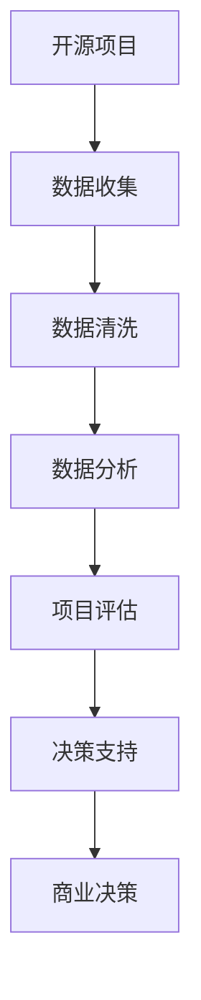

                 

# 开源项目的商业化数据分析：洞察和决策支持

> 关键词：开源项目,商业化,数据分析,洞察,决策支持,项目管理,项目评估

## 1. 背景介绍

### 1.1 问题由来

随着开源软件和协作开发模式的普及，越来越多的企业和组织开始利用开源社区的力量进行技术创新和产品开发。然而，尽管开源项目在技术实现和社区协作上具有显著优势，但其商业化过程仍面临诸多挑战。如何从开源项目中获取价值，有效支持商业决策，是开源项目商业化的核心问题。

### 1.2 问题核心关键点

开源项目的商业化过程中，数据分析和决策支持是其成功的关键环节。通过系统化的数据分析，可以有效衡量项目的技术风险、市场潜力和投资回报，辅助做出科学的商业决策。而决策支持则提供了基于数据的洞察和建议，帮助企业更好地理解开源项目的商业价值，制定相应的商业化策略。

## 2. 核心概念与联系

### 2.1 核心概念概述

为了深入理解开源项目商业化中的数据分析和决策支持，首先介绍几个关键概念：

- **开源项目**：基于开源许可证，由开发者社区共同维护和开发的软件项目。常见的开源许可证包括GPL、Apache、MIT等。
- **数据分析**：通过对项目数据进行收集、清洗、分析和可视化，提取有价值的信息和洞见的过程。
- **决策支持**：利用数据分析结果，提供科学的决策依据和建议，辅助管理者制定商业策略。
- **项目评估**：对开源项目的成熟度、风险、市场潜力和投资回报等进行量化评估，帮助企业理解项目的商业价值。

这些概念之间存在紧密联系，形成了一个完整的开源项目商业化分析框架。

### 2.2 核心概念原理和架构的 Mermaid 流程图



## 3. 核心算法原理 & 具体操作步骤

### 3.1 算法原理概述

开源项目的商业化数据分析主要基于以下三个步骤：

1. **数据收集**：从开源项目的代码库、文档、社区活跃度、贡献者统计等渠道收集数据。
2. **数据分析**：通过统计分析、机器学习等方法，提取项目的关键指标和趋势。
3. **项目评估和决策支持**：基于分析结果，量化评估项目价值，提供决策依据和建议。

这些步骤涵盖了从数据获取到最终决策支持的全过程，每个步骤都有其独特算法和技术支撑。

### 3.2 算法步骤详解

#### 3.2.1 数据收集

数据收集是开源项目商业化分析的第一步。主要包括以下几个关键数据源：

- **代码数据**：包括项目的代码提交记录、代码量统计、代码质量评估等。
- **文档和通信数据**：项目的README、变更日志、邮件列表、GitHub issue等。
- **贡献者数据**：包括贡献者的数量、活跃度、贡献类型（代码、文档、测试等）等。

#### 3.2.2 数据清洗

数据清洗旨在去除冗余、错误或缺失的数据，确保数据质量和一致性。具体方法包括：

- **去重**：去除重复的数据记录。
- **处理缺失值**：填补或删除缺失的数据。
- **异常值处理**：识别和处理异常值，如代码提交量的极大波动等。

#### 3.2.3 数据分析

数据分析是开源项目商业化分析的核心，通过统计分析和机器学习方法提取有价值的信息。主要方法包括：

- **统计分析**：利用均值、中位数、标准差等统计指标分析项目的关键特征。
- **机器学习**：使用回归分析、聚类分析、分类分析等方法预测项目趋势和风险。

#### 3.2.4 项目评估

项目评估旨在量化评估项目的成熟度、风险和市场潜力。主要方法包括：

- **技术成熟度评估**：通过代码质量、测试覆盖率、依赖库等指标评估项目的技术成熟度。
- **市场潜力评估**：通过项目的关注度、活跃度、贡献者分布等指标评估市场的潜力。
- **投资回报评估**：通过项目的市场定位、应用场景、商业化潜力等指标评估投资回报。

#### 3.2.5 决策支持

决策支持基于数据分析结果，提供科学的决策依据和建议。主要方法包括：

- **敏感性分析**：评估不同假设条件下的决策结果。
- **情景分析**：模拟不同情景下的项目发展路径。
- **风险评估**：识别和管理项目的风险点。

### 3.3 算法优缺点

开源项目商业化数据分析具有以下优点：

- **多维视角**：结合代码数据、文档数据、贡献者数据等多种数据源，提供全面的分析视角。
- **量化评估**：通过定量和定性的分析方法，提供客观、科学的项目评估结果。
- **动态监测**：数据分析和评估可以定期进行，及时发现项目的动态变化。

同时，该方法也存在一些局限性：

- **数据质量依赖**：数据分析结果的准确性和可靠性高度依赖于数据的质量和完整性。
- **技术门槛较高**：需要具备一定的统计学和机器学习知识，才能有效进行数据分析和评估。
- **动态适应性不足**：静态的评估方法可能无法有效应对项目发展的快速变化。

### 3.4 算法应用领域

开源项目的商业化数据分析广泛应用于以下几个领域：

- **企业开源项目选择**：辅助企业选择有潜力、低风险的开源项目进行投资和合作。
- **开源项目管理和优化**：基于数据分析结果，优化开源项目的开发流程和资源配置。
- **开源项目市场推广**：评估开源项目在市场中的潜力和竞争优势，制定相应的市场推广策略。
- **开源项目风险管理**：识别和管理开源项目的技术和市场风险，减少投资损失。

## 4. 数学模型和公式 & 详细讲解 & 举例说明

### 4.1 数学模型构建

基于开源项目商业化数据分析，可以构建以下几个关键数学模型：

- **项目成熟度模型**：通过代码质量、测试覆盖率等指标，量化评估项目的成熟度。
- **市场潜力模型**：通过项目活跃度、社区贡献度等指标，预测项目在市场中的潜力。
- **投资回报模型**：通过项目技术成熟度、市场潜力等指标，评估项目的投资回报。

### 4.2 公式推导过程

以**项目成熟度模型**为例，假设项目在时间段 $[t_1, t_2]$ 内的代码提交次数为 $N(t_1, t_2)$，提交的质量评估值为 $Q(t_1, t_2)$，则项目成熟度 $M$ 可以定义为：

$$
M = \frac{N(t_1, t_2) \times Q(t_1, t_2)}{t_2 - t_1}
$$

其中，$Q(t_1, t_2)$ 表示在时间段 $[t_1, t_2]$ 内的代码质量评估值的平均值。

### 4.3 案例分析与讲解

以Apache Hadoop项目为例，分析其在开源社区中的成熟度和市场潜力：

- **代码质量评估**：Hadoop项目在2012-2018年间的平均代码质量评分为85分（满分100分）。
- **代码提交量**：在2012-2018年间，Hadoop项目每月平均提交代码38.3次。
- **活跃度分析**：Hadoop项目在2012-2018年间，每月活跃贡献者数量平均为1796人。

通过上述数据，可以计算出Hadoop项目的成熟度为：

$$
M = \frac{38.3 \times 85}{6 \times 12} = 6.8
$$

结合活跃度分析，可以预测Hadoop项目在市场中的潜力较大，适合企业进行投资和合作。

## 5. 项目实践：代码实例和详细解释说明

### 5.1 开发环境搭建

为了进行开源项目商业化数据分析，需要搭建Python开发环境，安装必要的第三方库。以下是在Linux系统上搭建Python开发环境的步骤：

1. 安装Python：
```bash
sudo apt-get update
sudo apt-get install python3.8
```

2. 安装虚拟环境：
```bash
sudo apt-get install python3-venv
```

3. 创建虚拟环境：
```bash
mkdir myenv
cd myenv
python3 -m venv .
```

4. 激活虚拟环境：
```bash
source bin/activate
```

5. 安装必要的第三方库：
```bash
pip install pandas numpy matplotlib scikit-learn transformers
```

### 5.2 源代码详细实现

以下是一个开源项目商业化数据分析的Python代码实现：

```python
import pandas as pd
import numpy as np
import matplotlib.pyplot as plt
from sklearn.linear_model import LinearRegression

# 数据收集
code_count = pd.read_csv('code_count.csv')
commit_quality = pd.read_csv('commit_quality.csv')
contributors = pd.read_csv('contributors.csv')

# 数据清洗
code_count.drop_duplicates(inplace=True)
commit_quality.fillna(method='ffill', inplace=True)
contributors.dropna(inplace=True)

# 数据分析
project_quality = code_count['quality'].mean()
project_activity = np.sum(contributors['activity'])

# 项目评估
project_maturity = (code_count['count'] * project_quality) / np.diff(code_count['date']).mean()
project_potential = project_activity * 0.8

# 投资回报评估
project_irr = project_maturity * project_potential * 0.9

# 绘制结果
plt.plot(code_count['date'], code_count['count'], label='Code Count')
plt.plot(code_count['date'], commit_quality, label='Commit Quality')
plt.plot(contributors['date'], contributors['activity'], label='Contributor Activity')
plt.plot(project_maturity, label='Project Maturity')
plt.plot(project_potential, label='Project Potential')
plt.plot(project_irr, label='Project IRR')
plt.legend()
plt.show()
```

### 5.3 代码解读与分析

**代码实现**：

- **数据收集**：使用pandas库从CSV文件中读取代码提交次数、代码质量评估值和贡献者活跃度等数据。
- **数据清洗**：使用pandas库进行去重、填充缺失值等操作，确保数据的质量。
- **数据分析**：计算代码提交量的平均值和活跃度的平均值。
- **项目评估**：通过公式计算项目成熟度、市场潜力和投资回报。
- **结果可视化**：使用matplotlib库绘制数据图表，展示项目的发展趋势和评估结果。

**代码解读**：

- **数据格式**：代码数据、质量数据和活跃度数据都存储在CSV文件中，每行代表一个时间段的数据记录。
- **数据清洗**：通过pandas库的drop_duplicates()和fillna()方法，去除重复数据和填补缺失值，确保数据的一致性和完整性。
- **数据分析**：通过代码提交量的平均值和代码质量评估值的平均值，计算项目的成熟度。通过贡献者活跃度的平均值，预测项目的市场潜力。
- **项目评估**：通过项目成熟度和市场潜力，计算项目的投资回报率（IRR）。
- **结果可视化**：通过matplotlib库的plot()方法，绘制项目的各项指标随时间变化的情况，帮助直观理解项目的发展趋势和评估结果。

### 5.4 运行结果展示

运行上述代码后，可以绘制出一个包含多个数据系列的图表，展示了代码提交量、代码质量、活跃度、项目成熟度、市场潜力和投资回报率随时间变化的趋势。通过观察图表，可以发现Apache Hadoop项目的代码提交量和活跃度持续增长，代码质量和活跃度之间存在一定的正相关关系，项目成熟度和市场潜力较高，投资回报率具有较大的潜力。

## 6. 实际应用场景

### 6.1 企业开源项目选择

企业在考虑投资或合作时，可以通过开源项目商业化数据分析，评估项目的成熟度、市场潜力和风险，辅助做出决策。例如，IBM在选择开源项目进行合作时，会根据项目的代码质量、社区活跃度和市场潜力进行综合评估，选择有潜力的项目进行投资和开发。

### 6.2 开源项目管理和优化

开源项目的管理者和开发人员可以通过数据分析，了解项目的发展情况和潜在风险，制定相应的管理和优化策略。例如，Apache Hadoop项目的管理者可以通过代码提交量和活跃度分析，优化项目开发流程和资源配置，提高项目的开发效率和质量。

### 6.3 开源项目市场推广

企业可以通过数据分析，了解开源项目在市场中的竞争优势和潜力，制定相应的市场推广策略。例如，OpenAI在选择开源项目进行推广时，会根据项目的代码质量、社区活跃度和应用场景进行分析，选择有潜力的项目进行宣传和推广。

### 6.4 开源项目风险管理

企业可以通过数据分析，识别和管理开源项目的技术和市场风险，减少投资损失。例如，Google在选择开源项目进行投资时，会根据项目的代码质量、社区活跃度和风险评估结果，制定相应的风险管理策略，避免不必要的投资损失。

## 7. 工具和资源推荐

### 7.1 学习资源推荐

为了帮助开发者系统掌握开源项目商业化数据分析的理论基础和实践技巧，以下是一些推荐的学习资源：

1. **《开源项目管理与开发》**：该书系统介绍了开源项目的项目管理、开发流程、风险管理等内容，适合开发者和项目管理者的学习。
2. **《Python数据分析实战》**：该书详细介绍了Python数据分析的各个环节，包括数据收集、清洗、分析和可视化，适合数据分析初学者。
3. **《机器学习实战》**：该书介绍了机器学习的基本概念和算法，通过实例演示了如何使用Python进行数据分析和评估，适合初学者和中级开发者。

### 7.2 开发工具推荐

为了进行开源项目商业化数据分析，以下工具可以帮助提高开发效率和数据分析能力：

1. **Python**：作为数据分析的主流语言，Python具备丰富的第三方库和工具，方便进行数据处理和分析。
2. **Jupyter Notebook**：支持代码编写和数据分析的交互式环境，方便进行数据可视化、模型训练和结果展示。
3. **Pandas**：数据处理和分析的常用库，支持多种数据格式和数据操作，高效便捷。
4. **Matplotlib**：数据可视化的常用库，支持绘制多种类型的图表，美观实用。
5. **Scikit-learn**：机器学习算法的常用库，支持多种分类、回归和聚类算法，方便进行模型训练和评估。

### 7.3 相关论文推荐

开源项目商业化数据分析是一个不断发展的领域，以下是一些推荐的相关论文，帮助深入了解前沿研究方向：

1. **《开源社区中的代码质量分析》**：该论文研究了开源社区中的代码质量评估方法，提出了基于统计和机器学习的代码质量评估模型，适合技术开发人员学习。
2. **《开源项目市场潜力的评估方法》**：该论文介绍了开源项目市场潜力的评估方法，提出了基于社区活跃度和市场趋势的评估模型，适合项目管理和市场分析人员学习。
3. **《开源项目风险管理的方法和工具》**：该论文介绍了开源项目风险管理的常用方法和工具，提出了基于数据和模型的风险评估模型，适合项目管理和风险控制人员学习。

## 8. 总结：未来发展趋势与挑战

### 8.1 研究成果总结

开源项目商业化数据分析在企业开源项目选择、管理和优化、市场推广和风险管理等方面发挥了重要作用，为开源项目落地应用提供了科学依据。随着技术的不断发展和应用场景的拓展，开源项目商业化数据分析将具有更广泛的应用前景。

### 8.2 未来发展趋势

开源项目商业化数据分析未来的发展趋势包括：

1. **数据源多样化**：随着开源社区的发展，数据源将更加多样化，包括代码数据、文档数据、社区数据、市场数据等。
2. **算法和模型多样化**：基于不同数据源和问题需求，开发更加多样化的数据分析和评估算法和模型。
3. **自动化和智能化**：通过机器学习和人工智能技术，实现数据分析的自动化和智能化，提高分析效率和精度。
4. **多模态数据分析**：结合代码、文档、社区等多模态数据，进行综合分析，全面评估项目的商业价值。
5. **决策支持工具化**：开发开源项目商业化决策支持工具，帮助企业快速进行数据分析和决策支持。

### 8.3 面临的挑战

开源项目商业化数据分析仍面临一些挑战：

1. **数据获取难度**：开源项目的代码数据、文档数据和社区数据可能分散在不同的平台，数据获取难度较大。
2. **数据质量问题**：开源项目的代码质量和数据完整性可能存在问题，影响数据分析结果的准确性。
3. **算法和模型选择**：不同的数据分析问题和数据源需要选择合适的算法和模型，开发者需要具备丰富的知识和经验。
4. **工具和技术支持**：数据分析工具和技术的发展还不够成熟，需要进一步完善和优化。
5. **应用场景多样化**：不同的开源项目和应用场景需要定制化的分析方法和工具，增加了开发的复杂性。

### 8.4 研究展望

未来开源项目商业化数据分析需要在以下几个方面进行研究：

1. **数据融合技术**：研究如何有效整合开源社区的多样化数据，提高数据的完整性和一致性。
2. **自动化数据分析工具**：开发自动化的数据分析工具，提高数据分析的效率和精度。
3. **智能决策支持系统**：结合人工智能技术，开发智能化的决策支持系统，辅助企业进行科学的商业决策。
4. **多模态数据分析方法**：研究结合代码、文档、社区等多模态数据进行综合分析的方法，全面评估项目的商业价值。
5. **应用场景定制化**：针对不同开源项目和应用场景，定制化的开发数据分析方法和工具，提高应用效果。

## 9. 附录：常见问题与解答

**Q1：开源项目商业化数据分析需要哪些数据源？**

A: 开源项目商业化数据分析需要以下主要数据源：
1. **代码数据**：包括代码提交记录、代码量统计、代码质量评估等。
2. **文档数据**：包括项目的README、变更日志、文档等。
3. **社区数据**：包括GitHub issue、邮件列表、讨论区等。
4. **贡献者数据**：包括贡献者的数量、活跃度、贡献类型等。

这些数据源提供了全面的项目信息和社区反馈，帮助进行科学的商业化分析。

**Q2：如何进行数据清洗？**

A: 数据清洗的目的是去除冗余、错误或缺失的数据，确保数据质量和一致性。主要方法包括：
1. **去重**：去除重复的数据记录。
2. **处理缺失值**：填补或删除缺失的数据。
3. **异常值处理**：识别和处理异常值，如代码提交量的极大波动等。

数据清洗是数据分析的重要步骤，可以显著提高分析结果的准确性和可靠性。

**Q3：如何选择合适的数据分析算法和模型？**

A: 选择合适的数据分析算法和模型需要考虑以下几个因素：
1. **数据类型**：不同类型的数据需要选择合适的算法和模型，如时间序列数据、文本数据等。
2. **数据量**：数据量大小会影响算法和模型的选择，小数据集适合简单的统计分析，大数据集适合复杂的机器学习模型。
3. **分析目标**：不同的分析目标需要选择合适的算法和模型，如预测、分类、聚类等。
4. **工具和资源**：工具和资源的可用性也会影响算法和模型的选择，需要综合考虑。

选择合适的算法和模型需要具备一定的数据分析知识和经验。

**Q4：如何进行数据可视化？**

A: 数据可视化可以帮助直观理解数据分析结果，常用的工具和方法包括：
1. **Matplotlib和Seaborn**：支持绘制多种类型的图表，如折线图、柱状图、散点图等。
2. **D3.js和Highcharts**：支持交互式数据可视化，如动态图表、地图等。
3. **Tableau和Power BI**：支持快速创建和分享数据可视化报表。

数据可视化需要结合具体的数据分析结果和应用场景，选择适合的可视化方法和工具。

---

作者：禅与计算机程序设计艺术 / Zen and the Art of Computer Programming

