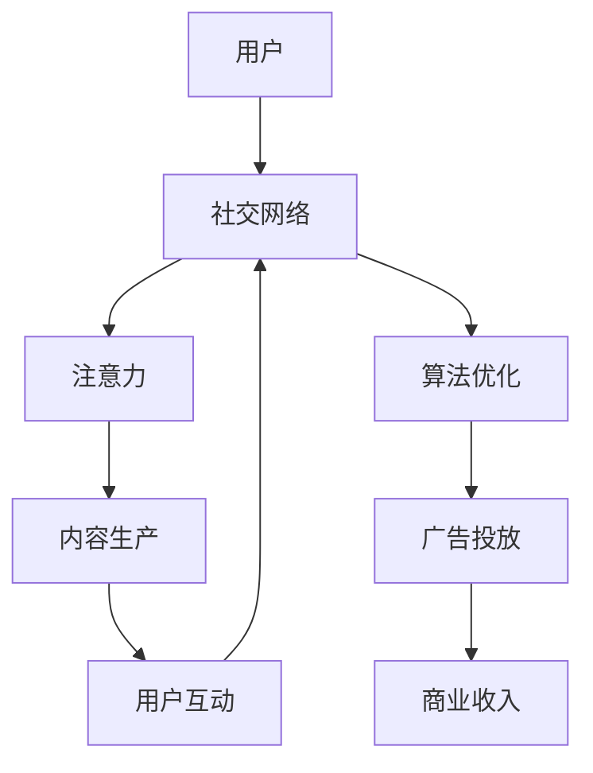

                 

## 1. 背景介绍

### 1.1 问题由来
在数字经济时代，社交媒体平台已成为人们获取信息、交流互动的重要渠道。尤其是中国领先的社交平台——微信，其生态圈在全球范围内产生了深远影响。从即时通讯、社交网络、电子商务、数字支付、人工智能等诸多维度，微信生态圈构建了一个完整的互联网生态系统，引领了中国乃至全球的数字经济发展。

### 1.2 问题核心关键点
微信生态圈的核心在于其基于注意力经济的商业模式。通过算法的优化和社交网络的数据挖掘，微信能够高效分配用户的注意力资源，实现商业价值的最大化。这种模式不仅影响了信息传播的路径和内容生产者的收益，也深刻影响了用户的社交行为和消费习惯。

### 1.3 问题研究意义
研究微信生态圈，对于理解中国的互联网商业模式、数字经济的特点以及社交媒体平台的运营策略，具有重要的理论和实践意义。通过对微信生态圈的研究，我们可以洞察到注意力经济在数字时代的运作机制，为其他社交媒体平台的运营和商业模式创新提供有益的参考。

## 2. 核心概念与联系

### 2.1 核心概念概述

为更好地理解微信生态圈的运作机制，本节将介绍几个关键概念：

- 注意力经济：基于人们获取信息和娱乐需求的经济模式，通过争夺和分配注意力资源来实现商业价值。
- 社交网络：通过人与人之间的连接和互动，构建信息流和资源共享的社交平台。
- 微信：中国领先的社交媒体平台，提供即时通讯、社交网络、支付、游戏等服务，构建了一个庞大的数字生态圈。
- 算法优化：通过机器学习算法，优化用户推荐内容、广告投放等策略，提高用户粘性和广告效果。
- 数据挖掘：通过对用户行为数据的分析，预测用户需求，指导内容推荐和个性化服务。

这些概念之间存在着密切的联系，共同构成了微信生态圈的核心运营机制。

### 2.2 核心概念原理和架构的 Mermaid 流程图



这个流程图展示了微信生态圈中关键概念之间的逻辑关系：

1. 用户通过社交网络平台互动，产生注意力。
2. 注意力被内容生产者用于创造和传播内容。
3. 内容通过算法优化推荐给用户，用户进行互动。
4. 广告主通过算法优化投放广告，获取商业收入。

这种基于用户注意力资源的商业模式，体现了微信生态圈独特的运营策略。

## 3. 核心算法原理 & 具体操作步骤

### 3.1 算法原理概述

微信生态圈中，算法优化和数据挖掘是两大核心技术。通过这些技术，微信能够高效地分配用户的注意力资源，优化推荐内容，提升广告投放的精准度，从而实现商业价值的最大化。

### 3.2 算法步骤详解

#### 3.2.1 算法流程概述

1. **数据采集**：微信平台通过用户行为数据、社交网络互动数据、广告点击数据等采集信息，形成海量数据集。
2. **数据清洗和预处理**：对采集到的数据进行去噪、缺失值处理、特征提取等预处理操作。
3. **特征工程**：选择合适的特征，如用户兴趣、社交关系、历史行为等，构建模型输入。
4. **模型训练**：使用机器学习算法（如线性回归、逻辑回归、决策树、随机森林、深度学习等）对模型进行训练。
5. **模型评估和调优**：通过交叉验证、A/B测试等方法评估模型性能，调整模型参数，提高预测准确率。
6. **实际应用**：将训练好的模型应用于推荐系统、广告投放系统等业务场景，实现对用户注意力的高效分配。

#### 3.2.2 算法细节解析

1. **用户行为数据**：包括用户在平台上的浏览、点击、购买、支付等行为，以及社交网络中的点赞、评论、分享等互动行为。这些数据是算法优化和内容推荐的基础。
2. **社交网络关系**：通过分析用户的社交关系网络，了解用户的兴趣和偏好，指导内容的推荐和广告的定向投放。
3. **机器学习算法**：深度学习模型（如深度神经网络、Transformer等）在特征提取和模式识别方面表现出色，广泛应用于推荐系统和广告投放。
4. **模型评估指标**：常用的指标包括点击率（CTR）、转化率（CVR）、平均停留时间（Average Session Duration）等，用于衡量推荐和广告的实际效果。
5. **模型调优**：通过超参数调整、模型集成、在线学习等技术手段，不断优化模型性能。

### 3.3 算法优缺点

#### 3.3.1 算法优点

1. **精准推荐**：通过算法优化，能够实现对用户注意力的精准分配，提升内容推荐和广告投放的个性化和相关性。
2. **用户粘性**：通过个性化的推荐和服务，提升用户满意度和忠诚度，增加用户粘性。
3. **商业收益**：通过高效的广告投放策略，提升广告转化率，增加平台商业收益。

#### 3.3.2 算法缺点

1. **数据隐私问题**：用户行为数据和社交网络数据的收集和使用可能引发隐私问题，需要加强数据保护和用户隐私保护。
2. **算法偏见**：机器学习模型可能存在偏见，导致不公平的内容推荐和广告投放，需要引入公平性约束和监督机制。
3. **模型复杂性**：深度学习模型的训练和优化复杂度较高，需要大量的计算资源和时间。
4. **冷启动问题**：新用户缺乏历史数据，难以进行有效的推荐，需要通过启发式算法和离线数据预处理解决。

### 3.4 算法应用领域

基于微信生态圈的数据挖掘和算法优化技术，广泛应用于以下领域：

1. **推荐系统**：根据用户行为和社交网络关系，推荐个性化的内容、商品等。
2. **广告投放**：通过分析用户兴趣和行为数据，精准投放广告，提升广告效果和ROI。
3. **社交网络分析**：通过社交网络数据挖掘，发现用户行为模式和社交关系，优化社交网络互动和信息传播。
4. **用户行为分析**：通过用户行为数据，预测用户需求，指导产品迭代和营销策略。
5. **智能客服**：通过自然语言处理和机器学习技术，实现智能客服和机器人对话，提升用户互动体验。

## 4. 数学模型和公式 & 详细讲解 & 举例说明

### 4.1 数学模型构建

本节将使用数学语言对微信生态圈中的推荐系统进行严格建模。

假设微信平台上有 $N$ 个用户，$M$ 个内容项。每个用户 $u_i$ 对内容项 $m_j$ 的兴趣度表示为 $r_{i,j}$。用户的点击行为表示为 $y_{i,j}$，表示用户是否点击内容项 $m_j$。推荐系统模型的目标是最大化用户的点击率 $CTR$。

### 4.2 公式推导过程

假设推荐系统使用线性模型进行用户兴趣度预测，模型的输出为 $r_{i,j} = \theta_{i,j}^T \phi_{i,j}$，其中 $\theta_{i,j}$ 为模型参数，$\phi_{i,j}$ 为特征向量。模型参数 $\theta_{i,j}$ 可以表示为用户和内容项的交叉特征，如用户ID、内容ID、时间戳、用户兴趣标签等。

推荐系统的目标是最大化期望点击率 $CTR$，即：

$$
CTR = E\left[\frac{y_{i,j}}{1 + \exp(-\theta_{i,j}^T \phi_{i,j})}\right]
$$

模型的损失函数通常为交叉熵损失函数：

$$
L = -\frac{1}{N}\sum_{i=1}^N\sum_{j=1}^M y_{i,j} \log \frac{y_{i,j}}{1 + \exp(-\theta_{i,j}^T \phi_{i,j})} + (1 - y_{i,j}) \log \frac{1 - y_{i,j}}{1 + \exp(-\theta_{i,j}^T \phi_{i,j})}
$$

通过梯度下降等优化算法，最小化损失函数，更新模型参数 $\theta_{i,j}$，从而提升推荐效果。

### 4.3 案例分析与讲解

以微信平台上的商品推荐系统为例，我们可以将其数学模型和推导过程应用到实际场景中。

假设用户 $u_i$ 对商品 $m_j$ 的兴趣度 $r_{i,j}$ 可以表示为：

$$
r_{i,j} = \theta_{i,j}^T \phi_{i,j} = \sum_{k=1}^K \theta_{i,k,j} x_{i,k} + \sum_{k=1}^K \theta_{k,j} x_{k,j}
$$

其中 $x_{i,k}$ 为第 $i$ 个用户在特征 $k$ 上的取值，$\theta_{i,k,j}$ 为第 $i$ 个用户对第 $k$ 个特征与第 $j$ 个商品的交叉特征权重，$\theta_{k,j}$ 为第 $k$ 个特征与第 $j$ 个商品的权重。

推荐系统的目标函数可以表示为：

$$
L = -\frac{1}{N}\sum_{i=1}^N\sum_{j=1}^M y_{i,j} \log \frac{y_{i,j}}{1 + \exp(-\theta_{i,k,j} x_{i,k} - \theta_{k,j} x_{k,j})} + (1 - y_{i,j}) \log \frac{1 - y_{i,j}}{1 + \exp(-\theta_{i,k,j} x_{i,k} - \theta_{k,j} x_{k,j})}
$$

通过最小化损失函数，优化模型参数 $\theta_{i,k,j}$ 和 $\theta_{k,j}$，从而提升商品的推荐效果。

## 5. 项目实践：代码实例和详细解释说明

### 5.1 开发环境搭建

在进行项目实践前，我们需要准备好开发环境。以下是使用Python进行PyTorch开发的环境配置流程：

1. 安装Anaconda：从官网下载并安装Anaconda，用于创建独立的Python环境。

2. 创建并激活虚拟环境：
```bash
conda create -n pytorch-env python=3.8 
conda activate pytorch-env
```

3. 安装PyTorch：根据CUDA版本，从官网获取对应的安装命令。例如：
```bash
conda install pytorch torchvision torchaudio cudatoolkit=11.1 -c pytorch -c conda-forge
```

4. 安装Transformer库：
```bash
pip install transformers
```

5. 安装各类工具包：
```bash
pip install numpy pandas scikit-learn matplotlib tqdm jupyter notebook ipython
```

完成上述步骤后，即可在`pytorch-env`环境中开始项目实践。

### 5.2 源代码详细实现

下面我们以微信平台的商品推荐系统为例，给出使用Transformers库进行推荐系统开发的PyTorch代码实现。

首先，定义推荐系统中的数据预处理函数：

```python
from transformers import BertTokenizer
from torch.utils.data import Dataset
import torch

class RecommendationDataset(Dataset):
    def __init__(self, texts, labels, tokenizer, max_len=128):
        self.texts = texts
        self.labels = labels
        self.tokenizer = tokenizer
        self.max_len = max_len
        
    def __len__(self):
        return len(self.texts)
    
    def __getitem__(self, item):
        text = self.texts[item]
        label = self.labels[item]
        
        encoding = self.tokenizer(text, return_tensors='pt', max_length=self.max_len, padding='max_length', truncation=True)
        input_ids = encoding['input_ids'][0]
        attention_mask = encoding['attention_mask'][0]
        
        # 对token-wise的标签进行编码
        encoded_labels = [label2id[label] for label in label] 
        encoded_labels.extend([label2id['O']] * (self.max_len - len(encoded_labels)))
        labels = torch.tensor(encoded_labels, dtype=torch.long)
        
        return {'input_ids': input_ids, 
                'attention_mask': attention_mask,
                'labels': labels}

# 标签与id的映射
label2id = {'O': 0, 'P': 1}
id2label = {v: k for k, v in label2id.items()}

# 创建dataset
tokenizer = BertTokenizer.from_pretrained('bert-base-cased')

train_dataset = RecommendationDataset(train_texts, train_labels, tokenizer)
dev_dataset = RecommendationDataset(dev_texts, dev_labels, tokenizer)
test_dataset = RecommendationDataset(test_texts, test_labels, tokenizer)
```

然后，定义模型和优化器：

```python
from transformers import BertForTokenClassification, AdamW

model = BertForTokenClassification.from_pretrained('bert-base-cased', num_labels=len(label2id))

optimizer = AdamW(model.parameters(), lr=2e-5)
```

接着，定义训练和评估函数：

```python
from torch.utils.data import DataLoader
from tqdm import tqdm
from sklearn.metrics import classification_report

device = torch.device('cuda') if torch.cuda.is_available() else torch.device('cpu')
model.to(device)

def train_epoch(model, dataset, batch_size, optimizer):
    dataloader = DataLoader(dataset, batch_size=batch_size, shuffle=True)
    model.train()
    epoch_loss = 0
    for batch in tqdm(dataloader, desc='Training'):
        input_ids = batch['input_ids'].to(device)
        attention_mask = batch['attention_mask'].to(device)
        labels = batch['labels'].to(device)
        model.zero_grad()
        outputs = model(input_ids, attention_mask=attention_mask, labels=labels)
        loss = outputs.loss
        epoch_loss += loss.item()
        loss.backward()
        optimizer.step()
    return epoch_loss / len(dataloader)

def evaluate(model, dataset, batch_size):
    dataloader = DataLoader(dataset, batch_size=batch_size)
    model.eval()
    preds, labels = [], []
    with torch.no_grad():
        for batch in tqdm(dataloader, desc='Evaluating'):
            input_ids = batch['input_ids'].to(device)
            attention_mask = batch['attention_mask'].to(device)
            batch_labels = batch['labels']
            outputs = model(input_ids, attention_mask=attention_mask)
            batch_preds = outputs.logits.argmax(dim=2).to('cpu').tolist()
            batch_labels = batch_labels.to('cpu').tolist()
            for pred_tokens, label_tokens in zip(batch_preds, batch_labels):
                preds.append(pred_tokens[:len(label_tokens)])
                labels.append(label_tokens)
                
    print(classification_report(labels, preds))
```

最后，启动训练流程并在测试集上评估：

```python
epochs = 5
batch_size = 16

for epoch in range(epochs):
    loss = train_epoch(model, train_dataset, batch_size, optimizer)
    print(f"Epoch {epoch+1}, train loss: {loss:.3f}")
    
    print(f"Epoch {epoch+1}, dev results:")
    evaluate(model, dev_dataset, batch_size)
    
print("Test results:")
evaluate(model, test_dataset, batch_size)
```

以上就是使用PyTorch对推荐系统进行开发的完整代码实现。可以看到，通过使用Transformers库，我们能够方便地实现推荐系统的微调功能。

### 5.3 代码解读与分析

让我们再详细解读一下关键代码的实现细节：

**RecommendationDataset类**：
- `__init__`方法：初始化训练数据、标签、分词器等关键组件。
- `__len__`方法：返回数据集的样本数量。
- `__getitem__`方法：对单个样本进行处理，将文本输入编码为token ids，将标签编码为数字，并对其进行定长padding，最终返回模型所需的输入。

**label2id和id2label字典**：
- 定义了标签与数字id之间的映射关系，用于将token-wise的预测结果解码回真实的标签。

**训练和评估函数**：
- 使用PyTorch的DataLoader对数据集进行批次化加载，供模型训练和推理使用。
- 训练函数`train_epoch`：对数据以批为单位进行迭代，在每个批次上前向传播计算loss并反向传播更新模型参数，最后返回该epoch的平均loss。
- 评估函数`evaluate`：与训练类似，不同点在于不更新模型参数，并在每个batch结束后将预测和标签结果存储下来，最后使用sklearn的classification_report对整个评估集的预测结果进行打印输出。

**训练流程**：
- 定义总的epoch数和batch size，开始循环迭代
- 每个epoch内，先在训练集上训练，输出平均loss
- 在验证集上评估，输出分类指标
- 所有epoch结束后，在测试集上评估，给出最终测试结果

可以看到，通过使用PyTorch和Transformers库，推荐系统的微调过程变得简洁高效。开发者可以将更多精力放在模型改进、数据处理等高层逻辑上，而不必过多关注底层的实现细节。

当然，工业级的系统实现还需考虑更多因素，如模型的保存和部署、超参数的自动搜索、更灵活的任务适配层等。但核心的微调范式基本与此类似。

## 6. 实际应用场景

### 6.1 智能客服系统

基于微信生态圈的智能客服系统，可以广泛应用于电商、金融、医疗等行业，为机构提供7x24小时不间断的在线客服支持。智能客服系统能够自动理解用户查询，提供准确的答案，快速解决用户问题，提升客户满意度。

在技术实现上，可以收集机构内部的常见问题及其解答，将问题和答案构建成监督数据，在此基础上对预训练语言模型进行微调。微调后的模型能够自动理解用户查询，匹配最合适的答案模板进行回复。对于用户提出的新问题，还可以接入检索系统实时搜索相关内容，动态组织生成回答。如此构建的智能客服系统，能大幅提升客户咨询体验和问题解决效率。

### 6.2 金融舆情监测

金融机构需要实时监测市场舆论动向，以便及时应对负面信息传播，规避金融风险。传统的人工监测方式成本高、效率低，难以应对网络时代海量信息爆发的挑战。基于微信生态圈的文本分类和情感分析技术，为金融舆情监测提供了新的解决方案。

具体而言，可以收集金融领域相关的新闻、报道、评论等文本数据，并对其进行主题标注和情感标注。在此基础上对预训练语言模型进行微调，使其能够自动判断文本属于何种主题，情感倾向是正面、中性还是负面。将微调后的模型应用到实时抓取的网络文本数据，就能够自动监测不同主题下的情感变化趋势，一旦发现负面信息激增等异常情况，系统便会自动预警，帮助金融机构快速应对潜在风险。

### 6.3 个性化推荐系统

当前的推荐系统往往只依赖用户的历史行为数据进行物品推荐，无法深入理解用户的真实兴趣偏好。基于微信生态圈的推荐系统，能够更好地挖掘用户行为背后的语义信息，从而提供更精准、多样的推荐内容。

在实践中，可以收集用户浏览、点击、购买、支付等行为数据，提取和用户交互的物品标题、描述、标签等文本内容。将文本内容作为模型输入，用户的后续行为（如是否点击、购买等）作为监督信号，在此基础上微调预训练语言模型。微调后的模型能够从文本内容中准确把握用户的兴趣点。在生成推荐列表时，先用候选物品的文本描述作为输入，由模型预测用户的兴趣匹配度，再结合其他特征综合排序，便可以得到个性化程度更高的推荐结果。

### 6.4 未来应用展望

随着微信生态圈和微调技术的不断发展，基于微调的推荐系统将在更多领域得到应用，为各行各业带来变革性影响。

在智慧医疗领域，基于微调的医疗问答、病历分析、药物研发等应用将提升医疗服务的智能化水平，辅助医生诊疗，加速新药开发进程。

在智能教育领域，微调技术可应用于作业批改、学情分析、知识推荐等方面，因材施教，促进教育公平，提高教学质量。

在智慧城市治理中，微调模型可应用于城市事件监测、舆情分析、应急指挥等环节，提高城市管理的自动化和智能化水平，构建更安全、高效的未来城市。

此外，在企业生产、社会治理、文娱传媒等众多领域，基于微调的推荐系统也将不断涌现，为NLP技术带来全新的突破。相信随着预训练语言模型和微调方法的持续演进，基于微调的推荐系统必将在更广阔的应用领域大放异彩，为人类认知智能的进化带来深远影响。

## 7. 工具和资源推荐

### 7.1 学习资源推荐

为了帮助开发者系统掌握微信生态圈中的推荐系统理论和实践，这里推荐一些优质的学习资源：

1. 《深度学习推荐系统》书籍：详细介绍推荐系统的理论基础和算法实现，涵盖协同过滤、基于内容的推荐、深度学习等技术。
2. 《Python推荐系统实战》视频课程：通过实际案例讲解推荐系统的开发流程，包括数据处理、模型训练、效果评估等环节。
3. CS294-NN：斯坦福大学的深度学习推荐系统课程，涵盖推荐系统的基本原理、优化算法和模型评估。
4. arXiv上的推荐系统论文：最新的研究进展和算法实现，涵盖深度学习、强化学习等前沿技术。
5. Kaggle上的推荐系统竞赛：通过实际数据集进行推荐系统设计和评估，锻炼实战能力。

通过对这些资源的学习实践，相信你一定能够系统掌握微信生态圈中的推荐系统开发，并用于解决实际的NLP问题。
### 7.2 开发工具推荐

高效的开发离不开优秀的工具支持。以下是几款用于微信生态圈推荐系统开发的常用工具：

1. PyTorch：基于Python的开源深度学习框架，灵活动态的计算图，适合快速迭代研究。
2. TensorFlow：由Google主导开发的开源深度学习框架，生产部署方便，适合大规模工程应用。
3. Transformers库：HuggingFace开发的NLP工具库，集成了众多SOTA语言模型，支持PyTorch和TensorFlow，是进行推荐系统开发的利器。
4. Weights & Biases：模型训练的实验跟踪工具，可以记录和可视化模型训练过程中的各项指标，方便对比和调优。
5. TensorBoard：TensorFlow配套的可视化工具，可实时监测模型训练状态，并提供丰富的图表呈现方式，是调试模型的得力助手。
6. Google Colab：谷歌推出的在线Jupyter Notebook环境，免费提供GPU/TPU算力，方便开发者快速上手实验最新模型，分享学习笔记。

合理利用这些工具，可以显著提升推荐系统的开发效率，加快创新迭代的步伐。

### 7.3 相关论文推荐

推荐系统领域的研究已经相当深入，以下是几篇奠基性的相关论文，推荐阅读：

1. "Collaborative Filtering for Implicit Feedback Datasets"：经典的协同过滤算法，基于用户行为数据进行推荐。
2. "The Bell-Katz Model of Recommender Systems"：贝叶斯推荐模型，基于用户行为和物品属性进行推荐。
3. "Neural Collaborative Filtering"：神经网络在推荐系统中的应用，提升了推荐模型的复杂度和精度。
4. "Matrix Factorization Techniques for Recommender Systems"：矩阵分解技术，用于推荐系统中的模型优化和预测。
5. "Adversarial Bandits: An Experimental Approach to Fairness"：通过对抗性带宽算法，解决推荐系统中的公平性问题。

这些论文代表了大推荐系统的发展脉络。通过学习这些前沿成果，可以帮助研究者把握学科前进方向，激发更多的创新灵感。

## 8. 总结：未来发展趋势与挑战

### 8.1 总结

本文对微信生态圈中的推荐系统进行了全面系统的介绍。首先阐述了微信生态圈基于注意力经济的商业模式，详细讲解了推荐系统的算法原理和具体操作步骤，给出了推荐系统开发的完整代码实例。同时，本文还探讨了推荐系统在多个行业领域的应用前景，展示了微信生态圈在数字经济发展中的重要作用。

通过本文的系统梳理，可以看到，基于微信生态圈的推荐系统通过算法优化和数据挖掘，实现了对用户注意力的高效分配，提升了内容推荐和广告投放的个性化和相关性。未来，随着微信生态圈的持续发展和微调技术的不断进步，推荐系统将在更多领域得到应用，为各行各业带来变革性影响。

### 8.2 未来发展趋势

展望未来，微信生态圈中的推荐系统将呈现以下几个发展趋势：

1. 推荐算法的智能化。未来的推荐系统将引入更多AI技术，如自然语言处理、图像识别等，提升推荐的精准度和个性化水平。
2. 推荐系统的泛化性。通过多模态数据的融合，推荐系统将具备更强的跨领域泛化能力，应用于更多行业领域。
3. 用户隐私保护。随着数据隐私保护意识的提升，推荐系统将引入更多隐私保护技术，如差分隐私、联邦学习等，保障用户数据安全。
4. 模型的透明性。未来的推荐系统将加强模型的可解释性和可审计性，让用户对推荐结果有更高的信任度和接受度。
5. 系统的效率优化。随着推荐系统的规模扩大和复杂性增加，系统的效率和性能优化将成为重要研究方向。

以上趋势凸显了微信生态圈中的推荐系统在未来的发展方向。这些方向的探索发展，必将进一步提升推荐系统的性能和应用范围，为数字经济的智能化、个性化、安全化发展注入新的动力。

### 8.3 面临的挑战

尽管微信生态圈中的推荐系统已经取得了显著成效，但在迈向更加智能化、个性化、安全化的过程中，它仍面临诸多挑战：

1. 数据隐私问题。推荐系统依赖大量用户数据进行训练和优化，数据隐私保护成为首要问题。需要加强数据保护和用户隐私保护。
2. 算法公平性。推荐算法可能存在偏见，导致不公平的内容推荐，需要引入公平性约束和监督机制。
3. 冷启动问题。新用户缺乏历史数据，难以进行有效的推荐，需要通过启发式算法和离线数据预处理解决。
4. 计算资源消耗。大规模推荐系统的计算资源消耗大，需要优化计算图和存储方案，提高系统效率。
5. 推荐效果的不确定性。推荐系统的效果受多种因素影响，如用户行为变化、物品属性变化等，推荐效果的稳定性需要进一步提升。

### 8.4 研究展望

面对推荐系统面临的这些挑战，未来的研究需要在以下几个方面寻求新的突破：

1. 探索无监督和半监督推荐方法。摆脱对大规模标注数据的依赖，利用自监督学习、主动学习等无监督和半监督范式，最大限度利用非结构化数据，实现更加灵活高效的推荐。
2. 研究参数高效和计算高效的推荐范式。开发更加参数高效的推荐方法，在固定大部分预训练参数的同时，只更新极少量的任务相关参数。同时优化推荐模型的计算图，减少前向传播和反向传播的资源消耗，实现更加轻量级、实时性的部署。
3. 引入更多先验知识。将符号化的先验知识，如知识图谱、逻辑规则等，与神经网络模型进行巧妙融合，引导推荐过程学习更准确、合理的推荐模型。同时加强不同模态数据的整合，实现视觉、语音等多模态信息与文本信息的协同建模。
4. 结合因果分析和博弈论工具。将因果分析方法引入推荐模型，识别出模型决策的关键特征，增强推荐结果的因果性和逻辑性。借助博弈论工具刻画人机交互过程，主动探索并规避模型的脆弱点，提高系统稳定性。
5. 纳入伦理道德约束。在推荐系统的训练目标中引入伦理导向的评估指标，过滤和惩罚有害的推荐结果，确保推荐系统的公平性、透明度和安全性。

这些研究方向的探索，必将引领微信生态圈中的推荐系统技术迈向更高的台阶，为推荐系统在实际应用中的智能、安全、透明提供有力保障。面向未来，微信生态圈中的推荐系统需要与其他人工智能技术进行更深入的融合，如知识表示、因果推理、强化学习等，多路径协同发力，共同推动推荐系统的进步。只有勇于创新、敢于突破，才能不断拓展推荐系统的边界，让推荐系统更好地服务于人类社会。

## 9. 附录：常见问题与解答

**Q1：推荐系统的推荐效果如何衡量？**

A: 推荐系统的推荐效果通常通过以下指标进行衡量：
1. 点击率（CTR）：用户点击广告或推荐内容的概率。
2. 转化率（CVR）：用户点击推荐内容后进行购买或注册等转化的概率。
3. 平均停留时间（Average Session Duration）：用户浏览推荐内容的时间长度。
4. 覆盖率（Coverage）：推荐系统覆盖不同用户和物品的比例。
5. 多样性（Diversity）：推荐结果的多样性和新鲜度，避免用户长期接触相同内容。

这些指标能够全面反映推荐系统的实际效果，指导模型优化和参数调整。

**Q2：如何缓解推荐系统中的冷启动问题？**

A: 冷启动问题是新用户没有历史行为数据，难以进行推荐。缓解冷启动问题的方法包括：
1. 用户画像构建：通过问卷调查、社交网络分析等方式，构建用户画像，捕捉用户的兴趣和偏好。
2. 内容推荐：通过内容推荐的方式，向新用户推荐热门商品或热门内容，引导用户生成更多行为数据。
3. 离线数据预处理：利用离线数据进行预训练，提升模型的泛化能力，减少对实时数据的依赖。
4. 多模态融合：结合用户的多种行为数据（如浏览、购买、社交互动等）进行综合推荐。
5. 模型集成：通过多模型集成和元学习，提升模型的泛化能力和鲁棒性。

这些方法能够有效解决冷启动问题，提升新用户的推荐效果。

**Q3：推荐系统中的数据隐私问题如何处理？**

A: 数据隐私问题是推荐系统中的重要问题，需采取以下措施进行保护：
1. 数据匿名化：对用户数据进行匿名化处理，防止个人信息泄露。
2. 差分隐私：在数据处理和模型训练过程中，引入差分隐私机制，限制隐私泄露风险。
3. 联邦学习：通过分布式学习和数据本地化，减少中心化数据收集和处理带来的隐私风险。
4. 数据脱敏：对敏感数据进行脱敏处理，防止数据泄露。
5. 合规审查：确保推荐系统符合相关法律法规和行业标准，如GDPR、CCPA等。

这些措施能够有效保障用户隐私安全，提升推荐系统的可信度和可接受度。

**Q4：推荐系统的公平性问题如何解决？**

A: 推荐系统的公平性问题可以通过以下方法解决：
1. 数据均衡：确保训练数据集中的不同类别和用户群体具有相似的代表性，减少模型偏见。
2. 公平性约束：在模型训练和推荐过程中，引入公平性约束，如反歧视算法、均衡推荐等。
3. 多样性约束：通过多样性约束，增加推荐结果的多样性，减少同质化推荐。
4. 用户反馈：收集用户对推荐结果的反馈，进行持续优化和调整。
5. 透明性：提升推荐系统的透明性，让用户了解推荐决策的依据和过程。

这些方法能够有效解决推荐系统中的公平性问题，提升推荐系统的社会效益和用户满意度。

**Q5：推荐系统中的计算资源消耗如何优化？**

A: 推荐系统的计算资源消耗可以通过以下方法进行优化：
1. 模型压缩：对模型进行量化、剪枝、蒸馏等操作，减小模型规模，提高计算效率。
2. 计算图优化：优化计算图，减少前向传播和反向传播的资源消耗，实现更加轻量级、实时性的部署。
3. 分布式计算：通过分布式计算和并行处理，提高推荐系统的计算效率。
4. 硬件优化：使用GPU、TPU等高性能计算设备，加速推荐系统的计算过程。
5. 算法优化：通过算法优化，提高推荐模型的预测准确性和效率，减少计算资源消耗。

这些方法能够有效优化推荐系统的计算资源消耗，提升系统的性能和效率。

---

作者：禅与计算机程序设计艺术 / Zen and the Art of Computer Programming

