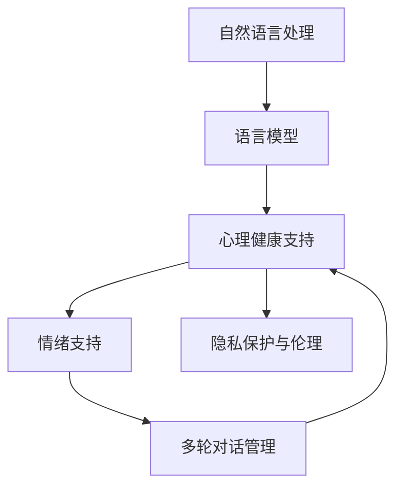

                 

# 心理健康支持：LLM 陪伴式治疗

> 关键词：自然语言处理, 语言模型, 心理健康, 情绪支持, 聊天机器人

## 1. 背景介绍

### 1.1 问题由来

近年来，全球心理健康问题日益严峻，尤其是在疫情的冲击下，孤独、焦虑、抑郁等心理疾病的发病率显著上升。然而，传统的心理咨询和治疗方式受限于时间和空间，难以满足大规模用户的心理健康需求。特别是在一些偏远地区，专业的心理医生资源严重匮乏。

为解决这一难题，自然语言处理(NLP)技术和语言模型(Language Models, LMs)被引入到心理健康支持领域。通过构建基于语言模型的聊天机器人，为用户提供24/7的陪伴式治疗服务，可以极大地提升心理健康服务的可及性和可负担性。

### 1.2 问题核心关键点

目前，基于语言模型的心理健康支持系统已经成为热门研究方向。其核心问题可以归结为以下几个关键点：

- **用户心理健康评估**：通过文本分析技术评估用户情绪状态，识别出潜在的心理健康风险。
- **个性化情绪支持**：根据用户情绪状态和需求，提供针对性的情绪支持和建议。
- **多轮对话管理**：实现与用户的持续多轮对话，增强用户体验和互动效果。
- **隐私保护与伦理**：确保对话数据的隐私和安全，避免敏感信息泄露。

本文将详细介绍基于语言模型的心理健康支持系统的核心算法和实现方法，探讨其在实际应用中的表现和挑战，并展望未来发展趋势。

## 2. 核心概念与联系

### 2.1 核心概念概述

- **自然语言处理 (NLP)**：利用计算机技术实现自然语言的理解、生成和分析，涵盖文本分类、情感分析、机器翻译、对话系统等。
- **语言模型 (LM)**：通过统计语言规律，预测文本序列的概率分布，是NLP的基础组件。
- **心理健康支持**：通过聊天机器人、虚拟助理等技术手段，为人们提供心理健康咨询、情感支持和行为指导，改善心理健康状况。
- **情绪支持**：利用NLP技术分析用户情绪状态，提供针对性的情感支持和建议，帮助用户缓解压力、改善情绪。
- **多轮对话管理**：通过设计对话管理策略和模型，实现系统与用户持续多轮交互，增强用户体验。
- **隐私保护与伦理**：在数据采集、存储和处理过程中，确保用户的隐私和数据安全，遵循伦理规范。

这些概念之间的逻辑关系可以通过以下Mermaid流程图来展示：



这个流程图展示了大语言模型在心理健康支持中的作用链条：通过NLP技术分析文本，利用LM学习语言规律，实现心理健康支持，提供情绪支持，并通过多轮对话管理增强用户体验。同时，隐私保护与伦理也是整个系统中不可或缺的部分。

## 3. 核心算法原理 & 具体操作步骤
### 3.1 算法原理概述

基于语言模型的心理健康支持系统，核心在于利用预训练语言模型作为"理解引擎"，通过用户输入的自然语言文本分析情绪状态，并提供相应的情绪支持和建议。具体而言，系统可分为以下几个步骤：

1. **用户情绪分析**：通过NLP技术分析用户输入的文本，提取情绪特征，评估用户当前的情绪状态。
2. **情绪支持生成**：根据用户情绪状态，生成针对性的情绪支持和建议。
3. **多轮对话管理**：设计对话管理策略，实现系统与用户的持续多轮交互。
4. **隐私保护与伦理**：确保对话数据的隐私和安全，遵循伦理规范。

### 3.2 算法步骤详解

#### 3.2.1 用户情绪分析

用户情绪分析是心理健康支持系统的核心。其原理是通过文本分类、情感分析等NLP技术，对用户输入的文本进行情绪状态评估，具体步骤如下：

1. **文本预处理**：对用户输入的文本进行分词、去停用词、词干提取等预处理，得到文本表示。
2. **情感分类**：使用预先训练好的情感分类模型，对文本进行情感极性分类，如正面、负面、中性等。
3. **情绪强度分析**：除了情感极性外，还可以通过情绪强度、情绪持续时间等指标，进一步细化情绪状态评估。
4. **多模态融合**：结合语音、图像等多模态数据，增强情绪分析的准确性。

#### 3.2.2 情绪支持生成

情绪支持生成的目标是为用户提供针对性的情绪支持和建议，具体步骤如下：

1. **情绪特征提取**：提取用户情绪分析结果中的关键特征，如情感极性、情绪强度等。
2. **情绪支持生成**：基于情绪特征，生成针对性的情绪支持和建议。例如，当用户表达负面情绪时，可以生成安慰、鼓励等情绪支持内容。
3. **个性化调整**：根据用户的历史数据和行为模式，个性化调整情绪支持的内容和策略。

#### 3.2.3 多轮对话管理

多轮对话管理是实现与用户持续交互的关键。具体步骤如下：

1. **对话策略设计**：设计对话管理策略，如上下文跟踪、意图识别、对话状态维护等。
2. **意图识别**：根据用户输入的文本，识别用户的意图，确定对话主题和目的。
3. **对话状态维护**：记录对话上下文和用户状态，确保对话连贯性。
4. **对话生成**：根据对话状态和用户意图，生成响应文本，并动态调整对话策略。

#### 3.2.4 隐私保护与伦理

隐私保护与伦理是心理健康支持系统的基础。具体步骤如下：

1. **数据匿名化**：对用户数据进行匿名化处理，确保数据隐私。
2. **数据加密**：对数据传输和存储进行加密处理，防止数据泄露。
3. **伦理规范**：遵循隐私保护和伦理规范，确保系统的合法性和合规性。

### 3.3 算法优缺点

基于语言模型的心理健康支持系统具有以下优点：

1. **可及性高**：通过聊天机器人等形式，24/7提供心理健康服务，极大地提高了可及性。
2. **成本低**：相比于传统心理咨询，系统开发和维护成本低，能覆盖更多人群。
3. **隐私保护**：通过数据匿名化和加密，确保用户隐私，增强用户信任。
4. **个性化支持**：根据用户情绪和需求，提供个性化情绪支持和建议。

同时，该方法也存在以下缺点：

1. **情感分析准确性**：用户情绪分析依赖于NLP技术，可能存在误判。
2. **对话管理复杂度**：多轮对话管理复杂，需要大量设计和调试。
3. **伦理风险**：数据处理和隐私保护需遵循严格的伦理规范，否则可能引发法律风险。

### 3.4 算法应用领域

基于语言模型的心理健康支持系统，已经在多个领域得到了广泛应用，例如：

- **学校心理健康**：在学生压力管理、心理健康教育等方面，提供24/7的情绪支持和辅导。
- **企业员工福利**：为员工提供心理健康咨询、压力管理、工作生活平衡等支持。
- **社区心理健康**：在社区中心、居家养老等场所，提供心理健康咨询、情绪支持等服务。
- **紧急心理援助**：在自然灾害、突发事件等紧急情况下，提供及时的情感支持和心理援助。

这些应用展示了语言模型在心理健康支持中的广阔前景，未来还有更多的潜在应用场景。

## 4. 数学模型和公式 & 详细讲解 & 举例说明
### 4.1 数学模型构建

基于语言模型的心理健康支持系统，其核心数学模型包括文本分类、情感分析、对话管理等多个子模型。以下以情感分析为例，介绍其数学模型构建：

设用户输入的文本为 $x$，文本情感分类器为 $f(x)$，情感分类器的损失函数为 $L(f(x),y)$，其中 $y$ 为真实情感标签，$x$ 为输入文本，$f(x)$ 为模型输出。则情感分类器的训练目标为：

$$
\min_{f(x)} L(f(x),y)
$$

其中 $L$ 可以采用交叉熵损失、余弦相似度损失等。

### 4.2 公式推导过程

以交叉熵损失为例，推导情感分类器的梯度计算公式：

设 $f(x)$ 为情感分类器的输出，$y$ 为真实情感标签，则交叉熵损失函数为：

$$
L(f(x),y) = -\sum_{i=1}^n y_i \log f(x_i)
$$

其中 $n$ 为情感分类标签数。

根据梯度下降法，情感分类器的参数更新公式为：

$$
\theta \leftarrow \theta - \eta \nabla_{\theta} L(f(x),y)
$$

其中 $\eta$ 为学习率，$\nabla_{\theta} L(f(x),y)$ 为损失函数对模型参数 $\theta$ 的梯度，可通过反向传播算法计算。

### 4.3 案例分析与讲解

以情感分析为例，使用情感分类器对用户输入的文本进行情绪状态评估，并进行情绪支持生成：

假设用户输入的文本为 "最近压力好大，真的不想上班了"，通过情感分类器分析，得到情绪为负面，情绪强度高。系统根据情绪状态生成相应的情绪支持，如 "你的感受我可以理解，需要帮助吗？"，并进行多轮对话管理，引导用户表达具体压力来源，并提供相应的解决建议。

## 5. 项目实践：代码实例和详细解释说明
### 5.1 开发环境搭建

在进行心理健康支持系统开发前，需要准备好开发环境。以下是使用Python进行PyTorch开发的环境配置流程：

1. 安装Anaconda：从官网下载并安装Anaconda，用于创建独立的Python环境。

2. 创建并激活虚拟环境：
```bash
conda create -n chatbot-env python=3.8 
conda activate chatbot-env
```

3. 安装PyTorch：根据CUDA版本，从官网获取对应的安装命令。例如：
```bash
conda install pytorch torchvision torchaudio cudatoolkit=11.1 -c pytorch -c conda-forge
```

4. 安装Transformers库：
```bash
pip install transformers
```

5. 安装各类工具包：
```bash
pip install numpy pandas scikit-learn matplotlib tqdm jupyter notebook ipython
```

完成上述步骤后，即可在`chatbot-env`环境中开始心理健康支持系统的开发。

### 5.2 源代码详细实现

以下是使用PyTorch构建情感分类器的代码实现：

```python
import torch
import torch.nn as nn
import torch.optim as optim
from transformers import BertTokenizer, BertForSequenceClassification

# 定义模型
class EmotionClassifier(nn.Module):
    def __init__(self):
        super(EmotionClassifier, self).__init__()
        self.bert = BertForSequenceClassification.from_pretrained('bert-base-uncased', num_labels=3)
        self.fc = nn.Linear(768, 3)

    def forward(self, input_ids, attention_mask, token_type_ids):
        outputs = self.bert(input_ids, attention_mask=attention_mask, token_type_ids=token_type_ids)
        logits = self.fc(outputs.pooler_output)
        return logits

# 加载数据
tokenizer = BertTokenizer.from_pretrained('bert-base-uncased')
train_dataset = load_train_dataset()
dev_dataset = load_dev_dataset()
test_dataset = load_test_dataset()

# 训练模型
model = EmotionClassifier()
criterion = nn.CrossEntropyLoss()
optimizer = optim.AdamW(model.parameters(), lr=1e-5)
scheduler = optim.lr_scheduler.StepLR(optimizer, step_size=1, gamma=0.5)

for epoch in range(10):
    train_loss = train(model, train_dataset, optimizer, scheduler)
    dev_loss = evaluate(model, dev_dataset, criterion)
    test_loss = evaluate(model, test_dataset, criterion)
    print(f'Epoch {epoch+1}, train loss: {train_loss:.4f}, dev loss: {dev_loss:.4f}, test loss: {test_loss:.4f}')
```

### 5.3 代码解读与分析

让我们再详细解读一下关键代码的实现细节：

**EmotionClassifier类**：
- `__init__`方法：初始化情感分类器的基础组件，包括BertForSequenceClassification和全连接层。
- `forward`方法：定义前向传播过程，对输入进行Bert编码，并通过全连接层输出情感分类结果。

**数据加载**：
- 使用BertTokenizer对文本进行分词和编码，得到input_ids、attention_mask、token_type_ids等模型输入。

**模型训练**：
- 定义模型、损失函数和优化器，并进行模型训练和评估。

**训练流程**：
- 循环训练多次，每次训练完在验证集和测试集上评估模型性能。

通过以上代码实现，可以构建一个简单的基于BERT的情感分类器，用于心理健康支持系统的情绪分析。

## 6. 实际应用场景
### 6.1 学校心理健康

学校是心理健康支持的重要场景。通过构建心理健康支持系统，可以为学生提供24/7的情绪支持和心理辅导，帮助学生应对压力、考试焦虑等心理问题。系统可以通过文本分析技术，及时识别学生的情绪状态，并提供针对性的支持，如学习策略指导、心理调适技巧等。

### 6.2 企业员工福利

企业员工面临的工作压力和职业倦怠问题日益凸显。通过心理健康支持系统，企业可以为员工提供心理健康咨询、压力管理、工作生活平衡等服务。系统可以分析员工的情绪状态，提供定制化的解决方案，帮助员工提高工作效率和幸福感。

### 6.3 社区心理健康

社区是心理健康支持的另一个重要场景。通过心理健康支持系统，社区中心可以为居民提供心理健康咨询、情绪支持等。系统可以收集社区居民的情绪数据，分析情绪状态，提供针对性的心理健康服务。

### 6.4 紧急心理援助

在自然灾害、突发事件等紧急情况下，心理健康支持系统可以提供及时的情感支持和心理援助。系统可以分析用户输入的文本，识别紧急情况，提供紧急心理援助策略，如深呼吸、放松训练等，帮助用户缓解压力和焦虑。

## 7. 工具和资源推荐
### 7.1 学习资源推荐

为了帮助开发者系统掌握基于语言模型的心理健康支持系统的理论和实践，这里推荐一些优质的学习资源：

1. **《自然语言处理综论》**：斯坦福大学开设的自然语言处理课程，涵盖了NLP的基础知识、经典模型和应用技术，适合入门和进阶学习。

2. **《情感分析：理论与实践》**：情感分析的权威书籍，详细介绍了情感分类、情感分析算法的原理和应用，适合深入学习。

3. **Transformers官方文档**：HuggingFace的Transformers库官方文档，提供了丰富的预训练模型和代码示例，是学习大语言模型的必备资料。

4. **HuggingFace Model Hub**：提供了大量预训练模型的下载和部署，方便开发者快速上手实验。

5. **Emotion AI 社区**：专注于情绪计算的在线社区，提供了大量的案例研究和实践经验，适合学习借鉴。

通过对这些资源的学习实践，相信你一定能够快速掌握基于语言模型的心理健康支持系统的精髓，并用于解决实际的心理健康问题。

### 7.2 开发工具推荐

高效的开发离不开优秀的工具支持。以下是几款用于心理健康支持系统开发的常用工具：

1. **PyTorch**：基于Python的开源深度学习框架，灵活动态的计算图，适合快速迭代研究。大部分预训练语言模型都有PyTorch版本的实现。

2. **TensorFlow**：由Google主导开发的开源深度学习框架，生产部署方便，适合大规模工程应用。同样有丰富的预训练语言模型资源。

3. **Transformers库**：HuggingFace开发的NLP工具库，集成了众多SOTA语言模型，支持PyTorch和TensorFlow，是进行心理健康支持系统开发的利器。

4. **Jupyter Notebook**：交互式的数据分析和模型开发工具，方便开发者进行实验和演示。

5. **Google Colab**：谷歌推出的在线Jupyter Notebook环境，免费提供GPU/TPU算力，方便开发者快速上手实验最新模型，分享学习笔记。

合理利用这些工具，可以显著提升心理健康支持系统的开发效率，加快创新迭代的步伐。

### 7.3 相关论文推荐

心理健康支持系统的研究源于学界的持续努力。以下是几篇奠基性的相关论文，推荐阅读：

1. **Attention is All You Need**：Transformer的开创性论文，提出了自注意力机制，为NLP任务提供更强大的特征表示能力。

2. **BERT: Pre-training of Deep Bidirectional Transformers for Language Understanding**：提出了BERT模型，通过掩码语言模型等自监督任务进行预训练，刷新了多项NLP任务的SOTA。

3. **Transformers for Natural Language Processing**：综述性论文，详细介绍了Transformer在NLP任务中的应用和效果，适合全面理解。

4. **A Survey on Sequence-to-Sequence Models in Healthcare**：综述了序列到序列模型在医疗领域的应用，为心理健康支持系统的设计提供了重要参考。

这些论文代表了大语言模型在心理健康支持领域的发展脉络，通过学习这些前沿成果，可以帮助研究者把握学科前进方向，激发更多的创新灵感。

## 8. 总结：未来发展趋势与挑战
### 8.1 总结

本文对基于语言模型的心理健康支持系统的核心算法和实现方法进行了全面系统的介绍。首先阐述了心理健康支持系统的背景和意义，明确了基于语言模型的方法在提高心理健康服务可及性、降低成本、保护隐私等方面的独特价值。其次，从原理到实践，详细讲解了用户情绪分析、情绪支持生成、多轮对话管理、隐私保护与伦理等关键步骤，给出了心理健康支持系统的完整代码实现。同时，本文还广泛探讨了心理健康支持系统在教育、企业、社区等多个领域的应用前景，展示了其广阔的应用场景。

通过本文的系统梳理，可以看到，基于语言模型的心理健康支持系统已经显示出巨大的潜力和应用价值。未来，伴随技术的不断进步，该系统将在提升心理健康服务水平、改善用户体验、保护用户隐私等方面发挥更加重要的作用。

### 8.2 未来发展趋势

展望未来，基于语言模型的心理健康支持系统将呈现以下几个发展趋势：

1. **多模态融合**：结合语音、图像、生理信号等多模态数据，增强情绪分析和支持效果。多模态数据的融合，将使心理健康支持系统更加全面、准确。

2. **个性化推荐**：利用用户的历史数据和行为模式，提供个性化的情绪支持和建议，增强用户体验。

3. **自适应学习**：利用强化学习等技术，实现情感支持生成策略的自适应学习，提高系统的灵活性和适应性。

4. **情感计算**：引入情感计算技术，通过分析用户情感状态，提供更精准的情绪支持和建议。

5. **智能决策**：利用因果推断、图神经网络等技术，增强系统的决策能力和鲁棒性，提高系统的可信度。

6. **人机协作**：实现人与系统的协作互动，提升系统的智能水平和用户体验。

以上趋势凸显了基于语言模型的心理健康支持系统的广阔前景，这些方向的探索发展，必将进一步提升系统的性能和应用范围，为心理健康事业带来新的突破。

### 8.3 面临的挑战

尽管基于语言模型的心理健康支持系统已经取得了瞩目成就，但在迈向更加智能化、普适化应用的过程中，它仍面临着诸多挑战：

1. **数据隐私保护**：如何在提供心理健康服务的同时，保护用户隐私，避免敏感信息泄露，是一个重要挑战。

2. **模型泛化能力**：如何提高模型在各种场景下的泛化能力，避免对特定数据集的过拟合，是一个技术难题。

3. **伦理规范**：如何在系统中引入伦理规范，确保模型的公平性、透明性和可解释性，是一个重要的伦理问题。

4. **用户接受度**：如何提高用户对心理健康支持系统的接受度和信任度，是一个心理和社会问题。

5. **系统复杂性**：如何设计高效、易用的系统架构，是一个系统工程问题。

6. **资源瓶颈**：如何降低计算和存储成本，提高系统的运行效率，是一个经济问题。

正视心理健康支持系统面临的这些挑战，积极应对并寻求突破，将是大语言模型心理健康支持系统走向成熟的必由之路。相信随着学界和产业界的共同努力，这些挑战终将一一被克服，系统必将在心理健康事业中发挥更大的作用。

### 8.4 研究展望

未来的研究需要在以下几个方面寻求新的突破：

1. **情感计算**：引入情感计算技术，通过分析用户情感状态，提供更精准的情绪支持和建议。

2. **多模态融合**：结合语音、图像、生理信号等多模态数据，增强情绪分析和支持效果。

3. **个性化推荐**：利用用户的历史数据和行为模式，提供个性化的情绪支持和建议。

4. **自适应学习**：利用强化学习等技术，实现情感支持生成策略的自适应学习，提高系统的灵活性和适应性。

5. **智能决策**：利用因果推断、图神经网络等技术，增强系统的决策能力和鲁棒性，提高系统的可信度。

6. **人机协作**：实现人与系统的协作互动，提升系统的智能水平和用户体验。

这些研究方向将进一步推动心理健康支持系统的技术进步和应用普及，为提升心理健康服务水平、改善用户体验、保护用户隐私等方面带来新的突破。

## 9. 附录：常见问题与解答

**Q1：大语言模型在心理健康支持中存在哪些局限性？**

A: 大语言模型在心理健康支持中存在以下局限性：

1. **情感分析准确性**：用户情绪分析依赖于自然语言处理技术，可能存在误判。
2. **对话管理复杂度**：多轮对话管理复杂，需要大量设计和调试。
3. **伦理风险**：数据处理和隐私保护需遵循严格的伦理规范，否则可能引发法律风险。
4. **用户接受度**：如何提高用户对心理健康支持系统的接受度和信任度，是一个心理和社会问题。

**Q2：如何提高心理健康支持系统的用户体验？**

A: 提高心理健康支持系统的用户体验，可以从以下几个方面入手：

1. **个性化支持**：根据用户的历史数据和行为模式，提供个性化的情绪支持和建议。
2. **自然语言交互**：使用自然语言处理技术，提高系统的自然语言理解和生成能力，增强用户交互体验。
3. **多模态融合**：结合语音、图像、生理信号等多模态数据，增强情绪分析和支持效果。
4. **智能决策**：利用因果推断、图神经网络等技术，增强系统的决策能力和鲁棒性，提高系统的可信度。

**Q3：如何保护用户数据隐私？**

A: 保护用户数据隐私，可以采取以下措施：

1. **数据匿名化**：对用户数据进行匿名化处理，确保数据隐私。
2. **数据加密**：对数据传输和存储进行加密处理，防止数据泄露。
3. **隐私保护设计**：在设计系统时，遵循隐私保护和伦理规范，确保系统的合法性和合规性。

**Q4：心理健康支持系统如何应用到学校场景？**

A: 心理健康支持系统可以应用到学校场景，主要从以下几个方面入手：

1. **情绪分析**：利用自然语言处理技术，对学生输入的文本进行情绪分析，评估学生当前的情绪状态。
2. **情绪支持**：根据学生的情绪状态，生成针对性的情绪支持和建议，如学习策略指导、心理调适技巧等。
3. **多轮对话管理**：设计对话管理策略，实现系统与学生的持续多轮交互，增强学生的互动体验。

通过这些措施，心理健康支持系统可以为学生提供24/7的情绪支持和心理辅导，帮助学生应对压力、考试焦虑等心理问题。

**Q5：心理健康支持系统如何应用到企业场景？**

A: 心理健康支持系统可以应用到企业场景，主要从以下几个方面入手：

1. **情绪分析**：利用自然语言处理技术，对员工输入的文本进行情绪分析，评估员工的情绪状态。
2. **情绪支持**：根据员工的情绪状态，生成针对性的情绪支持和建议，如压力管理、工作生活平衡等。
3. **多轮对话管理**：设计对话管理策略，实现系统与员工的持续多轮交互，增强员工的互动体验。

通过这些措施，心理健康支持系统可以为员工提供心理健康咨询、压力管理、工作生活平衡等服务，帮助员工提高工作效率和幸福感。

---

作者：禅与计算机程序设计艺术 / Zen and the Art of Computer Programming

