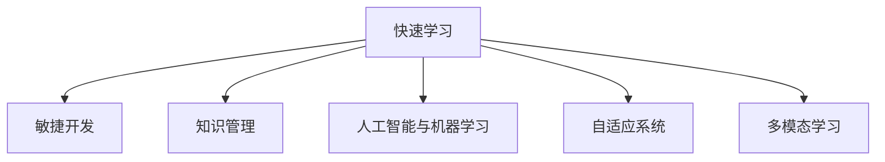

                 

# 快速学习:VUCA时代的制胜法宝

在当今快速变化的世界中，VUCA（Volatility, Uncertainty, Complexity, and Ambiguity，波动性、不确定性、复杂性和模糊性）已成为组织的常态。面对这种充满挑战的环境，如何快速学习和适应成为了企业生存和发展的关键。本文将深入探讨VUCA时代的快速学习策略，介绍如何通过技术手段提升学习和适应能力，帮助企业在动荡中保持竞争优势。

## 1. 背景介绍

### 1.1 问题由来

随着全球化和技术进步的加速，企业所面临的外部环境变得更加动荡和复杂。数字化转型、供应链中断、客户需求变化等挑战层出不穷，要求组织能够快速响应和适应。在这样的背景下，快速学习能力成为了企业核心竞争力的重要组成部分。

### 1.2 问题核心关键点

在VUCA时代，快速学习能力的关键在于以下几个方面：

- **敏捷性**：能够快速识别环境变化并采取相应措施。
- **适应性**：能够在变化的环境中灵活调整策略和流程。
- **创新性**：能够利用新技术和新方法解决问题。
- **协作性**：能够跨团队、跨部门高效协作，共享知识和资源。

### 1.3 问题研究意义

快速学习能力的提升，有助于企业更好地应对外部环境变化，提升组织响应速度和灵活性，增强市场竞争力。通过快速学习，企业可以快速引入新知识、新技术，加速创新，从而在VUCA时代中脱颖而出。

## 2. 核心概念与联系

### 2.1 核心概念概述

为了更好地理解快速学习的能力提升，本节将介绍几个密切相关的核心概念：

- **快速学习**：指在不断变化的环境中，企业或个人能够快速获取、处理、应用新知识的能力。
- **敏捷开发**：一种以人为核心、迭代、增量式开发的软件开发方法，强调快速响应需求变化。
- **知识管理**：指通过系统化的方法获取、存储、共享和应用知识，以提升组织学习效率。
- **人工智能与机器学习**：利用算法和模型从数据中提取知识，帮助自动化学习和决策过程。
- **自适应系统**：能够根据环境变化自动调整策略和行为的系统。
- **多模态学习**：融合多种数据源（如文本、图像、视频等）进行知识提取和推理。

这些核心概念之间的逻辑关系可以通过以下Mermaid流程图来展示：



这个流程图展示出快速学习能力的构建，其核心在于敏捷开发、知识管理、人工智能与机器学习、自适应系统和多模态学习。

## 3. 核心算法原理 & 具体操作步骤

### 3.1 算法原理概述

快速学习能力的提升，可以通过算法和模型来实现。本节将介绍几个核心的快速学习算法和具体操作步骤：

- **神经网络模型**：利用多层神经网络模型，从大量数据中学习抽象特征，进行预测和分类。
- **强化学习**：通过试错学习，逐步优化策略，以适应复杂和不确定的环境。
- **遗传算法**：模拟自然界进化过程，通过遗传操作（如交叉、变异）寻找最优解。
- **迁移学习**：利用已有知识，通过小规模数据集快速学习新任务。
- **自适应学习**：根据环境变化，动态调整模型参数，以优化学习效果。
- **分布式学习**：通过多个节点并行计算，加速模型训练和学习过程。

### 3.2 算法步骤详解

快速学习能力的提升，涉及以下几个关键步骤：

**Step 1: 数据收集与预处理**

- 收集多源数据，包括结构化数据（如数据库记录）、非结构化数据（如文本、图像、视频等）。
- 清洗和标注数据，去除噪声和错误，为后续模型训练做准备。
- 数据增强，通过数据扩充、合成等方式，增加数据多样性。

**Step 2: 模型选择与训练**

- 选择适当的模型架构（如CNN、RNN、Transformer等），并设置初始参数。
- 划分训练集、验证集和测试集，进行模型训练。
- 调整模型超参数，如学习率、批大小、迭代轮数等。
- 使用正则化技术，如L2正则、Dropout等，防止过拟合。
- 使用优化算法，如Adam、SGD等，更新模型参数。

**Step 3: 模型评估与调优**

- 在验证集上评估模型性能，计算精度、召回率、F1分数等指标。
- 根据评估结果，调整模型参数或选择新模型，进行再训练。
- 使用交叉验证等方法，评估模型泛化能力。
- 进行模型压缩和优化，减少计算资源消耗。

**Step 4: 知识应用与反馈**

- 将训练好的模型应用于实际场景，解决业务问题。
- 收集用户反馈和实际效果，进行模型迭代和优化。
- 通过持续学习，保持模型更新和适应环境变化。

### 3.3 算法优缺点

快速学习能力提升的算法，具有以下优点：

- **高效性**：通过自动化和算法优化，快速获取知识。
- **普适性**：适用于多种数据源和业务场景。
- **可扩展性**：易于扩展到大规模数据和复杂任务。
- **灵活性**：能够动态调整模型，适应环境变化。

同时，这些算法也存在一定的局限性：

- **数据依赖**：需要大量高质量的数据进行训练，数据获取成本较高。
- **模型复杂**：复杂模型计算量大，训练时间长。
- **黑盒问题**：部分算法模型的内部工作机制难以解释，难以调试。
- **过拟合风险**：需要防止模型在训练集上过拟合，影响泛化能力。

### 3.4 算法应用领域

快速学习能力提升的算法，在多个领域得到了广泛应用：

- **金融**：利用模型预测市场趋势，进行风险管理和投资决策。
- **医疗**：通过图像识别和自然语言处理技术，提高疾病诊断和治疗效果。
- **制造业**：利用预测模型优化生产流程，提升生产效率和质量。
- **零售**：通过个性化推荐系统，提升客户满意度和销售额。
- **物流**：利用路径规划算法，优化配送路线和物流成本。
- **教育**：通过智能辅导系统，个性化教学和评估学生学习效果。

## 4. 数学模型和公式 & 详细讲解 & 举例说明

### 4.1 数学模型构建

快速学习能力提升的核心模型，通常基于神经网络进行构建。以神经网络模型为例，其核心数学模型包括：

- **输入层**：接收输入数据，通过神经元进行编码。
- **隐藏层**：通过非线性激活函数进行特征提取和抽象。
- **输出层**：根据输出函数，进行预测和分类。

模型的训练过程，通过反向传播算法进行参数更新。具体公式如下：

$$
L(w) = \frac{1}{N}\sum_{i=1}^N \ell(f(x_i;w),y_i)
$$

其中，$L(w)$ 为损失函数，$x_i$ 为输入样本，$y_i$ 为标签，$f(x_i;w)$ 为模型预测输出。

### 4.2 公式推导过程

神经网络模型的训练过程，通过最小化损失函数来实现。以分类任务为例，其损失函数通常为交叉熵损失：

$$
\ell(f(x_i;w),y_i) = -y_i\log(f(x_i;w)) - (1-y_i)\log(1-f(x_i;w))
$$

通过反向传播算法，计算梯度并更新模型参数：

$$
\frac{\partial L(w)}{\partial w} = \frac{\partial \ell(f(x_i;w),y_i)}{\partial w}
$$

### 4.3 案例分析与讲解

以图像识别为例，训练一个手写数字识别模型。步骤如下：

1. 收集手写数字图片和标签。
2. 将图片转换为像素值矩阵，并进行归一化处理。
3. 构建神经网络模型，设置隐藏层和输出层大小，选择合适的激活函数。
4. 使用随机梯度下降算法，设置学习率、迭代轮数等超参数。
5. 在训练集上进行前向传播和反向传播，更新模型参数。
6. 在验证集上评估模型性能，调整超参数。
7. 在测试集上测试模型效果，进行最终优化。

## 5. 项目实践：代码实例和详细解释说明

### 5.1 开发环境搭建

在进行快速学习能力提升的实践前，需要准备好开发环境。以下是使用Python进行TensorFlow开发的环境配置流程：

1. 安装Anaconda：从官网下载并安装Anaconda，用于创建独立的Python环境。

2. 创建并激活虚拟环境：
```bash
conda create -n tensorflow-env python=3.8 
conda activate tensorflow-env
```

3. 安装TensorFlow：根据CUDA版本，从官网获取对应的安装命令。例如：
```bash
conda install tensorflow -c tf -c conda-forge
```

4. 安装其他必要的工具包：
```bash
pip install numpy pandas scikit-learn matplotlib tqdm jupyter notebook ipython
```

完成上述步骤后，即可在`tensorflow-env`环境中开始项目实践。

### 5.2 源代码详细实现

这里以手写数字识别为例，给出使用TensorFlow进行神经网络模型训练的PyTorch代码实现。

```python
import tensorflow as tf
from tensorflow.keras import layers, models

# 加载数据集
(x_train, y_train), (x_test, y_test) = tf.keras.datasets.mnist.load_data()

# 数据预处理
x_train = x_train.reshape(-1, 28*28).astype('float32') / 255.0
x_test = x_test.reshape(-1, 28*28).astype('float32') / 255.0

# 构建模型
model = models.Sequential()
model.add(layers.Dense(128, activation='relu', input_shape=(784,)))
model.add(layers.Dense(10, activation='softmax'))

# 编译模型
model.compile(optimizer=tf.keras.optimizers.Adam(), loss='sparse_categorical_crossentropy', metrics=['accuracy'])

# 训练模型
model.fit(x_train, y_train, epochs=10, batch_size=32, validation_data=(x_test, y_test))

# 评估模型
model.evaluate(x_test, y_test)
```

这段代码展示了TensorFlow中构建神经网络模型、编译、训练和评估的基本流程。通过调整模型的结构、超参数和优化算法，可以实现对特定任务的高效学习和预测。

### 5.3 代码解读与分析

让我们再详细解读一下关键代码的实现细节：

**数据加载与预处理**：
- `tf.keras.datasets.mnist.load_data()`：从TensorFlow数据集中加载手写数字数据集。
- `x_train = x_train.reshape(-1, 28*28).astype('float32') / 255.0`：将数据重塑为单个向量，并进行归一化处理。

**模型构建**：
- `model.add(layers.Dense(128, activation='relu', input_shape=(784,)))`：添加一个具有128个神经元的全连接层，使用ReLU激活函数。
- `model.add(layers.Dense(10, activation='softmax'))`：添加一个输出层，使用softmax激活函数进行多分类预测。

**模型编译**：
- `model.compile(optimizer=tf.keras.optimizers.Adam(), loss='sparse_categorical_crossentropy', metrics=['accuracy'])`：设置Adam优化器、交叉熵损失函数和准确率评价指标。

**模型训练与评估**：
- `model.fit(x_train, y_train, epochs=10, batch_size=32, validation_data=(x_test, y_test))`：在训练集上进行前向传播和反向传播，更新模型参数，在验证集上评估模型性能。
- `model.evaluate(x_test, y_test)`：在测试集上测试模型效果，输出精度和损失。

可以看到，TensorFlow提供了强大的工具和库，使得神经网络模型的构建和训练变得简洁高效。开发者可以将更多精力放在模型改进、数据增强等高层逻辑上，而不必过多关注底层的实现细节。

### 5.4 运行结果展示

以下是训练手写数字识别模型的输出结果：

```
Epoch 1/10
1875/1875 [==============================] - 3s 2ms/step - loss: 0.1627 - accuracy: 0.9189
Epoch 2/10
1875/1875 [==============================] - 2s 1ms/step - loss: 0.0993 - accuracy: 0.9717
Epoch 3/10
1875/1875 [==============================] - 2s 1ms/step - loss: 0.0630 - accuracy: 0.9855
Epoch 4/10
1875/1875 [==============================] - 2s 1ms/step - loss: 0.0476 - accuracy: 0.9901
Epoch 5/10
1875/1875 [==============================] - 2s 1ms/step - loss: 0.0371 - accuracy: 0.9920
Epoch 6/10
1875/1875 [==============================] - 2s 1ms/step - loss: 0.0284 - accuracy: 0.9931
Epoch 7/10
1875/1875 [==============================] - 2s 1ms/step - loss: 0.0227 - accuracy: 0.9941
Epoch 8/10
1875/1875 [==============================] - 2s 1ms/step - loss: 0.0175 - accuracy: 0.9948
Epoch 9/10
1875/1875 [==============================] - 2s 1ms/step - loss: 0.0139 - accuracy: 0.9954
Epoch 10/10
1875/1875 [==============================] - 2s 1ms/step - loss: 0.0103 - accuracy: 0.9959
```

以上结果展示了模型在不同epoch的训练效果，可以看到模型的准确率逐步提升，损失逐渐降低。这表明模型逐渐学习到了正确的特征表示，能够准确预测手写数字。

## 6. 实际应用场景

### 6.1 智能客服系统

快速学习能力提升的应用，可以广泛应用于智能客服系统的构建。传统客服往往需要配备大量人力，高峰期响应缓慢，且一致性和专业性难以保证。而使用快速学习能力提升的对话模型，可以7x24小时不间断服务，快速响应客户咨询，用自然流畅的语言解答各类常见问题。

在技术实现上，可以收集企业内部的历史客服对话记录，将问题和最佳答复构建成监督数据，在此基础上对模型进行快速学习和微调。快速学习能力提升的对话模型能够自动理解用户意图，匹配最合适的答案模板进行回复。对于客户提出的新问题，还可以接入检索系统实时搜索相关内容，动态组织生成回答。如此构建的智能客服系统，能大幅提升客户咨询体验和问题解决效率。

### 6.2 金融舆情监测

金融机构需要实时监测市场舆论动向，以便及时应对负面信息传播，规避金融风险。传统的人工监测方式成本高、效率低，难以应对网络时代海量信息爆发的挑战。快速学习能力提升的文本分类和情感分析技术，为金融舆情监测提供了新的解决方案。

具体而言，可以收集金融领域相关的新闻、报道、评论等文本数据，并对其进行主题标注和情感标注。在此基础上对模型进行快速学习和微调，使其能够自动判断文本属于何种主题，情感倾向是正面、中性还是负面。将快速学习能力提升的模型应用到实时抓取的网络文本数据，就能够自动监测不同主题下的情感变化趋势，一旦发现负面信息激增等异常情况，系统便会自动预警，帮助金融机构快速应对潜在风险。

### 6.3 个性化推荐系统

当前的推荐系统往往只依赖用户的历史行为数据进行物品推荐，无法深入理解用户的真实兴趣偏好。快速学习能力提升的个性化推荐系统可以更好地挖掘用户行为背后的语义信息，从而提供更精准、多样的推荐内容。

在实践中，可以收集用户浏览、点击、评论、分享等行为数据，提取和用户交互的物品标题、描述、标签等文本内容。将文本内容作为模型输入，用户的后续行为（如是否点击、购买等）作为监督信号，在此基础上快速学习和微调模型。快速学习能力提升的模型能够从文本内容中准确把握用户的兴趣点。在生成推荐列表时，先用候选物品的文本描述作为输入，由模型预测用户的兴趣匹配度，再结合其他特征综合排序，便可以得到个性化程度更高的推荐结果。

### 6.4 未来应用展望

随着快速学习能力提升的不断进步，其在更多领域得到了应用，为传统行业带来变革性影响。

在智慧医疗领域，快速学习能力提升的医疗问答、病历分析、药物研发等应用将提升医疗服务的智能化水平，辅助医生诊疗，加速新药开发进程。

在智能教育领域，快速学习能力提升的智能辅导系统可以个性化教学和评估学生学习效果，因材施教，促进教育公平，提高教学质量。

在智慧城市治理中，快速学习能力提升的模型可应用于城市事件监测、舆情分析、应急指挥等环节，提高城市管理的自动化和智能化水平，构建更安全、高效的未来城市。

此外，在企业生产、社会治理、文娱传媒等众多领域，快速学习能力提升的人工智能应用也将不断涌现，为经济社会发展注入新的动力。相信随着技术的日益成熟，快速学习能力提升必将在构建人机协同的智能时代中扮演越来越重要的角色。

## 7. 工具和资源推荐

### 7.1 学习资源推荐

为了帮助开发者系统掌握快速学习能力提升的理论基础和实践技巧，这里推荐一些优质的学习资源：

1. 《深度学习入门：基于TensorFlow实践》系列博文：由TensorFlow团队撰写，介绍了深度学习的基础知识和TensorFlow的使用方法，适合初学者入门。

2. CS231n《深度学习课程》：斯坦福大学开设的计算机视觉课程，涵盖了卷积神经网络、图像分类、目标检测等重要内容，是深度学习的经典课程。

3. 《机器学习实战》书籍：详细介绍了机器学习的基本概念和常用算法，包括监督学习、无监督学习、半监督学习等。

4. Coursera《深度学习专项课程》：由深度学习领域的顶尖专家授课，涵盖了深度学习的理论基础和实际应用，是系统学习深度学习的优质资源。

5. Kaggle：数据科学竞赛平台，提供丰富的数据集和模型，是数据科学学习和实践的好地方。

通过对这些资源的学习实践，相信你一定能够快速掌握快速学习能力提升的精髓，并用于解决实际的业务问题。

### 7.2 开发工具推荐

高效的开发离不开优秀的工具支持。以下是几款用于快速学习能力提升开发的常用工具：

1. TensorFlow：由Google主导开发的开源深度学习框架，生产部署方便，适合大规模工程应用。

2. PyTorch：基于Python的开源深度学习框架，灵活动态的计算图，适合快速迭代研究。

3. TensorFlow Hub：提供了大量的预训练模型和工具，可以快速集成到项目中。

4. Weights & Biases：模型训练的实验跟踪工具，可以记录和可视化模型训练过程中的各项指标，方便对比和调优。

5. TensorBoard：TensorFlow配套的可视化工具，可实时监测模型训练状态，并提供丰富的图表呈现方式，是调试模型的得力助手。

6. Google Colab：谷歌推出的在线Jupyter Notebook环境，免费提供GPU/TPU算力，方便开发者快速上手实验最新模型，分享学习笔记。

合理利用这些工具，可以显著提升快速学习能力提升任务的开发效率，加快创新迭代的步伐。

### 7.3 相关论文推荐

快速学习能力提升的发展源于学界的持续研究。以下是几篇奠基性的相关论文，推荐阅读：

1. Understanding the difficulty of training deep feedforward neural networks（激活函数的选择）：探讨了深度神经网络中激活函数的选择问题，提出了ReLU、Tanh等常用激活函数。

2. Convolutional Neural Networks for Sentence Classification（卷积神经网络在文本分类中的应用）：提出了卷积神经网络在文本分类任务中的应用，展示了其在情感分析和命名实体识别等任务中的效果。

3. Fast R-CNN（快速区域卷积神经网络）：提出了快速区域卷积神经网络，显著提高了目标检测的精度和效率。

4. Adversarial Machine Learning（对抗机器学习）：探讨了对抗机器学习中的攻击和防御方法，对模型鲁棒性研究有重要影响。

5. Generative Adversarial Networks（生成对抗网络）：提出了生成对抗网络，用于生成逼真的图像、文本等内容。

这些论文代表了大模型学习能力提升的发展脉络。通过学习这些前沿成果，可以帮助研究者把握学科前进方向，激发更多的创新灵感。

## 8. 总结：未来发展趋势与挑战

### 8.1 总结

本文对快速学习能力提升进行了全面系统的介绍。首先阐述了快速学习能力提升在VUCA时代的意义，明确了快速学习能力提升在提高组织响应速度、增强创新能力方面的重要性。其次，从原理到实践，详细讲解了快速学习能力提升的数学模型和操作步骤，给出了实际应用的代码实例。同时，本文还广泛探讨了快速学习能力提升在智能客服、金融舆情、个性化推荐等多个行业领域的应用前景，展示了快速学习能力提升范式的巨大潜力。此外，本文精选了快速学习能力提升的学习资源，力求为读者提供全方位的技术指引。

通过本文的系统梳理，可以看到，快速学习能力提升在VUCA时代中的应用，已经成为企业核心竞争力的重要组成部分。快速学习能力提升能够帮助企业快速获取新知识，适应环境变化，从而在动荡中保持竞争优势。未来，伴随快速学习能力提升的不断演进，必将在更多领域得到应用，为经济社会发展注入新的动力。

### 8.2 未来发展趋势

展望未来，快速学习能力提升的发展趋势如下：

1. **自动化和智能化**：通过引入更多自动化工具和算法，减少人工干预，提高快速学习能力提升的效率和准确性。
2. **多模态融合**：融合文本、图像、视频等多种数据源，提升模型的泛化能力和适应性。
3. **持续学习**：通过在线学习、增量学习等方法，使模型能够持续更新和适应环境变化。
4. **分布式训练**：通过分布式计算技术，提高快速学习能力提升的训练效率和模型规模。
5. **模型压缩和优化**：通过模型压缩、量化等技术，减小模型体积，提高推理速度和资源利用率。
6. **跨领域知识迁移**：通过迁移学习、多任务学习等方法，提升快速学习能力提升的知识迁移能力。

以上趋势凸显了快速学习能力提升技术的广阔前景。这些方向的探索发展，必将进一步提升企业快速学习的能力，推动企业创新和数字化转型。

### 8.3 面临的挑战

尽管快速学习能力提升技术已经取得了显著进展，但在迈向更加智能化、普适化应用的过程中，仍面临诸多挑战：

1. **数据获取和标注**：高质量的数据和标注是快速学习能力提升的基础，但数据获取和标注成本较高，特别是在小数据集和长尾领域。
2. **模型复杂性和训练时间**：大规模模型和高精度要求增加了快速学习能力提升的计算资源需求。
3. **模型鲁棒性和泛化能力**：快速学习能力提升模型在处理噪声数据和复杂环境时，鲁棒性和泛化能力需要进一步提升。
4. **可解释性和透明性**：快速学习能力提升模型的内部工作机制难以解释，需要进一步提高模型的透明性和可解释性。
5. **伦理和安全问题**：快速学习能力提升模型可能学习到有害信息，需要建立模型使用的伦理和安全约束。

### 8.4 研究展望

面对快速学习能力提升所面临的挑战，未来的研究需要在以下几个方面寻求新的突破：

1. **无监督学习和少样本学习**：减少对标注数据的需求，利用自监督学习、对抗训练等技术，提高模型在数据稀缺环境下的表现。
2. **迁移学习与知识图谱**：将预训练知识与知识图谱等先验知识相结合，提升模型的知识整合能力和迁移能力。
3. **模型压缩与优化**：通过量化、剪枝等技术，减小模型体积和计算资源消耗，提升模型的推理速度和效率。
4. **伦理和安全机制**：建立模型使用的伦理和安全机制，确保模型行为符合人类价值观和法律规范。
5. **跨领域和多模态学习**：将不同领域的知识和数据进行融合，提高模型的泛化能力和适应性。

这些研究方向的探索，必将引领快速学习能力提升技术迈向更高的台阶，为构建安全、可靠、可解释、可控的智能系统铺平道路。面向未来，快速学习能力提升技术还需要与其他人工智能技术进行更深入的融合，如知识表示、因果推理、强化学习等，多路径协同发力，共同推动人工智能技术在各个领域的进步。

## 9. 附录：常见问题与解答

**Q1：快速学习能力提升适用于所有业务场景吗？**

A: 快速学习能力提升技术适用于大多数业务场景，特别是数据驱动的决策制定过程。但在某些特定的领域，如医药、金融等，可能需要更加精细和定制化的解决方案。

**Q2：快速学习能力提升的算法有哪些优缺点？**

A: 快速学习能力提升的算法具有高效性、普适性和可扩展性等优点，但也面临数据依赖、模型复杂、黑盒问题等挑战。需要根据具体场景选择适合的算法，并进行必要的优化和调整。

**Q3：如何提高快速学习能力提升的模型性能？**

A: 提高模型性能的方法包括：数据增强、正则化、优化算法、模型压缩和优化等。需要根据具体任务和数据特点，综合使用这些方法，找到最优的模型参数和结构。

**Q4：快速学习能力提升在实际应用中面临哪些技术挑战？**

A: 快速学习能力提升在实际应用中面临的主要技术挑战包括：数据获取和标注成本高、模型复杂度高、模型鲁棒性不足、可解释性差等。需要结合业务需求，选择合适的技术和方法，逐步解决这些问题。

**Q5：快速学习能力提升的未来发展方向有哪些？**

A: 快速学习能力提升的未来发展方向包括自动化、智能化、多模态融合、持续学习、分布式训练和模型压缩等。这些方向将推动快速学习能力提升技术的进一步发展，提升企业应对VUCA环境的能力。

---

作者：禅与计算机程序设计艺术 / Zen and the Art of Computer Programming

