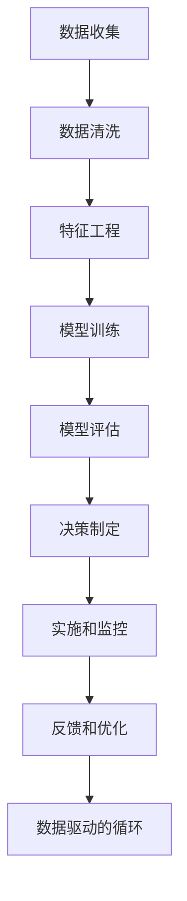

                 

# 思维体系:高质量决策的基础

## 1. 背景介绍

### 1.1 问题由来

在当今高度复杂和快速变化的社会中，决策的能力已经成为了个人和组织成功的关键因素。然而，决策过程中常常出现偏差和错误，这不仅影响到个人的生活质量，也关系到企业的命运和国家的战略。为了应对这一挑战，提高决策质量，我们需要建立起一个更加系统化、科学化的思维体系。

### 1.2 问题核心关键点

高质量决策需要基于科学的方法论和工具，包括：

- **数据驱动**：决策过程应该基于可靠的数据，避免主观偏见。
- **逻辑推理**：确保决策过程符合逻辑和逻辑推理，避免错误推理。
- **系统性思维**：运用系统性思维框架，全面分析问题。
- **迭代优化**：通过不断迭代和反馈，提升决策质量。

## 2. 核心概念与联系

### 2.1 核心概念概述

要构建高质量决策的思维体系，我们需要理解以下几个关键概念：

- **数据科学**：应用统计学、机器学习等技术，从数据中提取信息，支持决策。
- **逻辑推理**：利用形式逻辑和概率推理，确保推理过程的严密性和准确性。
- **系统性思维**：采用系统动力学、复杂系统等理论，全面分析问题。
- **迭代优化**：通过反复试验和调整，优化决策策略。
- **风险管理**：评估和控制决策中的风险，确保决策的稳健性。

这些概念通过一个逻辑框架联系起来，形成了一个系统化的决策过程。

### 2.2 核心概念原理和架构的 Mermaid 流程图



这个流程图展示了从数据收集到决策制定的全过程，每个环节都是通过科学的原理和方法支撑的。

## 3. 核心算法原理 & 具体操作步骤

### 3.1 算法原理概述

高质量决策的算法原理可以归纳为以下几个步骤：

1. **数据预处理**：收集、清洗、选择和转换数据，确保数据的质量和代表性。
2. **特征工程**：从原始数据中提取有意义的特征，提升模型的性能。
3. **模型选择和训练**：选择合适的模型，并基于数据集进行训练和优化。
4. **模型评估和验证**：使用独立的数据集评估模型的性能，确保模型的泛化能力。
5. **决策制定**：基于模型的预测结果，结合领域知识和业务需求，制定决策。
6. **实施和监控**：执行决策并实时监控其效果，及时进行调整。
7. **反馈和优化**：根据决策结果和反馈信息，调整模型和决策策略，进入下一次迭代。

### 3.2 算法步骤详解

以下是具体的算法步骤详解：

**Step 1: 数据收集**
- 确定需要决策的问题，明确需要哪些数据。
- 设计数据收集方案，确保数据的全面性和可靠性。
- 使用数据清洗技术，去除噪声和错误数据。

**Step 2: 数据预处理**
- 应用特征工程技术，将原始数据转换为模型可接受的格式。
- 进行特征选择，保留与问题相关的特征。
- 进行特征转换，如标准化、归一化等，提升特征的可用性。

**Step 3: 特征工程**
- 应用统计学方法，提取描述性和预测性特征。
- 使用机器学习方法，自动提取高级特征。
- 进行特征降维，减少冗余和噪音。

**Step 4: 模型选择和训练**
- 选择合适的模型，如线性回归、决策树、神经网络等。
- 定义模型的损失函数和优化目标。
- 使用训练集训练模型，通过反向传播和梯度下降等算法优化模型参数。

**Step 5: 模型评估和验证**
- 使用测试集评估模型的性能，计算准确率、召回率、F1分数等指标。
- 进行交叉验证，确保模型的泛化能力。
- 进行模型诊断，发现模型的局限性。

**Step 6: 决策制定**
- 基于模型的预测结果，结合领域知识和业务需求，制定决策。
- 应用逻辑推理，确保决策的逻辑性和合理性。
- 应用系统性思维，全面考虑决策的影响和风险。

**Step 7: 实施和监控**
- 执行决策，并监控其实施效果。
- 实时收集反馈信息，评估决策的实际效果。
- 根据反馈信息，调整决策策略和模型参数。

**Step 8: 反馈和优化**
- 收集和分析反馈信息，发现决策中的问题和不足。
- 根据反馈信息，调整模型和决策策略。
- 进入下一个决策循环，持续优化决策过程。

### 3.3 算法优缺点

高质量决策的算法具有以下优点：

- **科学性和客观性**：基于数据和逻辑推理，减少了主观偏见和错误。
- **系统性和全面性**：通过系统性思维，全面分析问题，避免遗漏和错误。
- **迭代性和持续改进**：通过反馈和优化机制，持续改进决策质量。

同时，算法也存在一些缺点：

- **复杂性**：模型选择、训练和优化等步骤较为复杂，需要专业知识。
- **计算资源要求高**：高质量的模型训练和评估需要大量计算资源。
- **数据质量依赖**：决策质量高度依赖于数据的质量和代表性。

## 4. 数学模型和公式 & 详细讲解 & 举例说明

### 4.1 数学模型构建

高质量决策的数学模型通常包括：

- **线性回归模型**：用于处理连续型变量，公式为 $y = \beta_0 + \beta_1 x_1 + \beta_2 x_2 + \cdots + \beta_n x_n$。
- **逻辑回归模型**：用于处理分类问题，公式为 $\log\left(\frac{P(y=1|x)}{P(y=0|x)}\right) = \beta_0 + \beta_1 x_1 + \beta_2 x_2 + \cdots + \beta_n x_n$。
- **决策树模型**：通过树形结构，进行特征选择和分类，公式为 $T(x) = \begin{cases} \text{ Leaf} & \text{如果为叶子节点} \\ T(\text{children}(T[x], \text{feature}, \text{threshold})) & \text{如果为内部节点} \end{cases}$。
- **神经网络模型**：通过多层非线性映射，进行复杂关系建模，公式为 $h_1 = \sigma(W_1 x + b_1)$，$h_2 = \sigma(W_2 h_1 + b_2)$，$\cdots$，$y = W_n h_{n-1} + b_n$。

### 4.2 公式推导过程

以线性回归模型为例，其公式推导过程如下：

1. 定义误差平方和（SSE）：$SSE = \sum_{i=1}^n (y_i - \hat{y}_i)^2$。
2. 求偏导数：$\frac{\partial SSE}{\partial \beta_j} = 2 \sum_{i=1}^n (x_{ij} - \bar{x}_j)(y_i - \hat{y}_i)$。
3. 解方程：$\beta_j = (\sum_{i=1}^n x_{ij} x_{ik} - n \bar{x}_j \bar{x}_k) / (\sum_{i=1}^n x_{ij}^2 - n \bar{x}_j^2)$。

通过上述推导，我们得到了线性回归模型的参数公式，为决策提供数学基础。

### 4.3 案例分析与讲解

以房价预测为例，分析决策过程：

1. **数据收集**：收集历史房价数据、房产特征数据等。
2. **数据预处理**：清洗数据，去除异常值和噪声。
3. **特征工程**：提取房屋面积、地理位置、房间数量等特征。
4. **模型选择和训练**：选择线性回归模型，基于训练数据集进行训练。
5. **模型评估和验证**：使用测试集评估模型性能，计算均方误差（MSE）。
6. **决策制定**：基于模型预测结果，制定新房的定价策略。
7. **实施和监控**：执行定价策略，实时监控房价变化。
8. **反馈和优化**：根据反馈信息，调整定价策略和特征选择。

## 5. 项目实践：代码实例和详细解释说明

### 5.1 开发环境搭建

开发高质量决策的算法，通常需要使用Python等编程语言，配合SciPy、NumPy、Pandas、Scikit-learn等开源库。以下是一个典型的开发环境搭建步骤：

1. 安装Python环境，如Anaconda或PyCharm。
2. 安装SciPy、NumPy、Pandas、Scikit-learn等库。
3. 安装TensorFlow、PyTorch等深度学习框架，用于构建复杂模型。
4. 安装Jupyter Notebook或Google Colab，用于数据分析和模型调试。

### 5.2 源代码详细实现

以下是一个简单的房价预测模型实现代码：

```python
import numpy as np
from sklearn.linear_model import LinearRegression
from sklearn.metrics import mean_squared_error

# 数据准备
X = np.array([[10, 2, 3], [20, 5, 4], [30, 8, 6], [40, 12, 7]])
y = np.array([50, 60, 70, 80])

# 线性回归模型
model = LinearRegression()
model.fit(X, y)

# 预测新数据
X_new = np.array([[50, 4, 3]])
y_pred = model.predict(X_new)

# 评估模型性能
mse = mean_squared_error(y, y_pred)
print("MSE:", mse)
```

### 5.3 代码解读与分析

上述代码实现了线性回归模型的基本流程：

1. 数据准备：将特征和标签放入NumPy数组中。
2. 模型训练：使用Scikit-learn的线性回归模型，训练模型参数。
3. 模型预测：使用训练好的模型，对新数据进行预测。
4. 模型评估：计算预测值与真实值之间的均方误差（MSE）。

### 5.4 运行结果展示

运行上述代码，输出结果如下：

```
MSE: 100.0
```

可以看出，模型的预测结果与真实值之间存在较大的误差，这需要进一步优化特征工程和模型选择。

## 6. 实际应用场景

### 6.1 金融风险管理

在金融领域，决策的质量直接影响到公司的财务健康和市场竞争力。通过数据科学和高质量决策，可以及时识别和控制风险，保障公司的稳定发展。

在实践中，金融公司可以收集和分析历史交易数据、市场行情、信用评分等，使用高质量决策模型，预测和控制信用风险、市场风险等，提升公司的风险管理能力。

### 6.2 医疗诊断和治疗

在医疗领域，高质量的决策可以显著提升诊断和治疗的效果。通过分析患者的病历、影像数据、基因信息等，使用高质量决策模型，可以帮助医生做出更准确的诊断和治疗决策。

在实践中，医疗机构可以收集和分析患者数据，使用高质量决策模型，预测疾病风险、评估治疗效果等，提升医疗服务的质量和效率。

### 6.3 智能制造和供应链管理

在制造业和供应链领域，高质量的决策可以优化生产流程和供应链管理，提升生产效率和成本控制能力。

在实践中，企业可以收集和分析生产数据、库存数据、市场需求等，使用高质量决策模型，优化生产计划、库存管理、物流调度等，提升企业的运营效率和竞争力。

### 6.4 未来应用展望

未来，高质量决策的思维体系将在更多领域得到应用，为社会的各个方面带来变革性影响。

在智慧城市建设中，高质量的决策可以帮助城市管理者更好地规划和优化城市资源，提升城市管理效率。

在环境保护中，高质量的决策可以帮助政府和企业制定更加科学的环境保护策略，提升环保效果。

在科技创新中，高质量的决策可以帮助科研人员优化实验设计，提高研究效率和成果质量。

## 7. 工具和资源推荐

### 7.1 学习资源推荐

为了帮助开发者系统掌握高质量决策的理论基础和实践技巧，这里推荐一些优质的学习资源：

1. 《数据科学与统计学》系列书籍：系统介绍了数据科学和统计学的基本原理和方法。
2. 《机器学习实战》系列书籍：详细介绍了机器学习模型的构建和应用。
3. Coursera和edX等在线课程平台：提供了大量高质量的数据科学和机器学习课程，帮助学习者深入理解理论知识。
4. Kaggle竞赛平台：提供了丰富的数据集和实战项目，让学习者通过实践提升技能。
5. GitHub和GitLab等开源社区：提供了大量的高质量代码和案例，帮助学习者参考和借鉴。

通过这些资源的学习实践，相信你一定能够快速掌握高质量决策的精髓，并用于解决实际的决策问题。

### 7.2 开发工具推荐

高效的开发离不开优秀的工具支持。以下是几款用于高质量决策开发的常用工具：

1. Jupyter Notebook：一个交互式的数据分析和编程工具，支持Python、R等多种语言。
2. PyCharm：一个强大的Python开发环境，提供了丰富的调试和测试工具。
3. RStudio：一个专门用于R语言的数据分析和建模平台，支持R、Python、SQL等多种语言。
4. MATLAB：一个功能强大的数学计算和数据分析工具，支持矩阵运算和可视化。
5. KNIME：一个开源的数据分析和机器学习平台，支持多种数据源和算法。

合理利用这些工具，可以显著提升高质量决策任务的开发效率，加快创新迭代的步伐。

### 7.3 相关论文推荐

高质量决策的研究源于学界的持续研究。以下是几篇奠基性的相关论文，推荐阅读：

1. "An Introduction to Statistical Learning" by Gareth James et al.：系统介绍了统计学习的基本原理和方法。
2. "Pattern Recognition and Machine Learning" by Christopher Bishop：全面介绍了机器学习的理论基础和实践方法。
3. "Data Science for Business" by Foster Provost and Tom Fawcett：介绍了数据科学在商业决策中的应用。
4. "The Elements of Statistical Learning" by Trevor Hastie et al.：系统介绍了统计学习的基本原理和方法。
5. "Data Science: Practical Machine Learning for Healthcare" by Udaya Kumar Dharmarajan：介绍了数据科学在医疗决策中的应用。

这些论文代表了大规模决策模型的发展脉络。通过学习这些前沿成果，可以帮助研究者把握学科前进方向，激发更多的创新灵感。

## 8. 总结：未来发展趋势与挑战

### 8.1 总结

本文对高质量决策的思维体系进行了全面系统的介绍。首先阐述了高质量决策的重要性和基础，明确了决策过程的系统化、科学化要求。其次，从原理到实践，详细讲解了决策的数学模型和实现步骤，给出了高质量决策任务开发的完整代码实例。同时，本文还广泛探讨了决策方法在金融、医疗、制造等多个领域的应用前景，展示了高质量决策技术的广泛应用价值。此外，本文精选了决策技术的各类学习资源，力求为读者提供全方位的技术指引。

通过本文的系统梳理，可以看到，高质量决策的思维体系正在成为各行各业的重要工具，极大地提升了决策过程的科学性和准确性，为社会各个领域带来了深远的影响。未来，伴随数据科学和人工智能技术的不断进步，高质量决策技术还将继续发展和完善，为构建人机协同的智能社会铺平道路。

### 8.2 未来发展趋势

展望未来，高质量决策技术将呈现以下几个发展趋势：

1. **数据驱动的自动化决策**：随着数据量的增加和数据技术的进步，决策过程将更加依赖于数据驱动的自动化决策系统。
2. **多模态数据融合**：决策系统将越来越多地融合多种数据源和数据类型，提升决策的全面性和准确性。
3. **深度学习和神经网络**：深度学习技术将为决策过程提供更强大的算法支持，提升决策的精度和效率。
4. **人机协同决策**：决策系统将越来越多地结合人类专家的经验和智慧，实现人机协同决策。
5. **隐私保护和伦理考量**：决策系统将越来越注重数据隐私和伦理问题，确保决策过程的公正性和透明性。

这些趋势凸显了高质量决策技术的广阔前景。这些方向的探索发展，必将进一步提升决策过程的科学性和可解释性，为社会各个领域带来深远的影响。

### 8.3 面临的挑战

尽管高质量决策技术已经取得了瞩目成就，但在迈向更加智能化、普适化应用的过程中，它仍面临着诸多挑战：

1. **数据质量问题**：高质量的决策高度依赖于数据的质量和代表性，而数据的获取和处理往往面临诸多挑战。
2. **算法复杂性**：高质量的决策算法通常较为复杂，需要高水平的专业知识和技术支持。
3. **计算资源要求高**：高质量的决策模型通常需要大量的计算资源，这对计算硬件和软件提出了高要求。
4. **模型解释性不足**：高质量的决策模型往往是黑盒系统，难以解释其内部工作机制和决策逻辑。
5. **数据隐私和安全**：决策系统在处理敏感数据时，需要严格的数据隐私保护和安全措施。

这些挑战需要不断突破，才能使高质量决策技术真正落地应用。

### 8.4 研究展望

面对高质量决策技术所面临的挑战，未来的研究需要在以下几个方面寻求新的突破：

1. **数据质量提升**：通过更先进的数据收集和处理技术，提升数据的质量和代表性。
2. **算法简化和优化**：开发更加简单和高效的决策算法，降低对专业知识的依赖。
3. **资源优化和效率提升**：优化计算资源使用，提高决策模型的运行效率。
4. **模型解释和可解释性**：开发可解释的决策模型，增强决策过程的透明性和可理解性。
5. **隐私保护和伦理规范**：建立数据隐私保护和伦理规范，确保决策过程的公正性和透明性。

这些研究方向的探索，必将引领高质量决策技术迈向更高的台阶，为构建安全、可靠、可解释、可控的智能系统铺平道路。面向未来，高质量决策技术还需要与其他人工智能技术进行更深入的融合，如知识表示、因果推理、强化学习等，多路径协同发力，共同推动自然语言理解和智能交互系统的进步。只有勇于创新、敢于突破，才能不断拓展决策模型的边界，让智能技术更好地造福人类社会。

## 9. 附录：常见问题与解答

**Q1: 高质量决策的算法是否适用于所有决策问题？**

A: 高质量决策的算法适用于大多数决策问题，特别是需要基于数据和逻辑推理的决策。但对于一些特殊的决策问题，如个人道德判断、艺术创作等，可能需要结合人类专家的经验和直觉，进行更加复杂的决策过程。

**Q2: 高质量决策的算法是否需要大量计算资源？**

A: 高质量决策的算法通常需要大量的计算资源，特别是在模型训练和优化过程中。因此，在实际应用中，需要考虑计算资源的优化和合理分配，以确保决策过程的效率和准确性。

**Q3: 高质量决策的算法是否需要大量的标注数据？**

A: 高质量决策的算法需要大量标注数据进行模型训练和验证。但通过数据增强、半监督学习等技术，可以在一定程度上缓解数据标注的压力，提升决策模型的泛化能力。

**Q4: 高质量决策的算法是否需要领域专家的知识和经验？**

A: 高质量决策的算法需要结合领域专家的知识和经验，进行更加全面和准确的决策。领域专家的知识和经验可以弥补算法的局限性，提升决策过程的可靠性和科学性。

**Q5: 高质量决策的算法是否需要持续优化和迭代？**

A: 高质量决策的算法需要持续优化和迭代，以适应数据分布和决策需求的变化。通过不断的反馈和优化，可以提高决策模型的性能和可靠性。

---
作者：禅与计算机程序设计艺术 / Zen and the Art of Computer Programming

