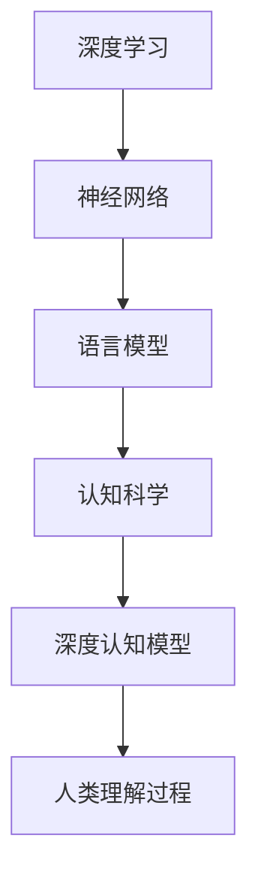

                 

# 思维的地图：认知科学如何解析人类理解过程

> 关键词：认知科学,理解过程,神经网络,语言模型,深度学习,认知心理学

## 1. 背景介绍

### 1.1 问题由来
人类思维是一个复杂而神秘的过程，理解它的机制一直是心理学和神经科学的核心问题之一。随着认知科学和神经科学研究的深入，以及计算机科学的迅速发展，科学家开始尝试利用计算模型来解析人类的思维机制，并取得了一系列重要的成果。其中，神经网络和深度学习模型为模拟人类理解过程提供了强有力的工具。

近年来，随着深度学习技术的发展，尤其是自然语言处理(NLP)领域的突破，基于深度学习模型的语言模型逐渐成为解析人类理解过程的重要手段。这些模型通过大量文本数据的预训练，学习到了丰富的语言知识和语义表示，能够模拟人类对自然语言的理解和生成。

### 1.2 问题核心关键点
本文将从认知科学的视角，探讨深度学习模型如何模拟人类理解过程。重点介绍以下核心问题：
- 深度学习模型如何模拟人类语言理解？
- 认知科学如何解析人类语言理解的机制？
- 深度学习在解析人类思维过程中的优势和局限？
- 未来研究如何进一步提升认知模型的解析能力？

## 2. 核心概念与联系

### 2.1 核心概念概述

为了更好地理解深度学习模型如何模拟人类理解过程，本节将介绍几个密切相关的核心概念：

- 深度学习(Deep Learning)：一种基于多层神经网络的机器学习方法，通过逐层抽象和特征学习，实现对复杂模式的建模。
- 神经网络(Neural Networks)：一种模仿人脑神经元结构和功能的网络结构，通过反向传播算法进行训练，学习数据中隐含的规律。
- 语言模型(Language Model)：一种能够预测文本序列概率的模型，通过学习大量文本数据，学习到语言的统计规律和语义表示。
- 认知科学(Cognitive Science)：一门跨学科研究人类认知机制的科学，旨在揭示人类思维、感知、记忆等心理过程的生理和心理机制。
- 深度认知模型(Deep Cognitive Model)：一种利用深度学习模型来模拟人类认知过程的技术，将深度学习与认知科学相结合，通过计算模型来理解人类思维的机制。

这些核心概念之间的逻辑关系可以通过以下Mermaid流程图来展示：



这个流程图展示了深度学习模型如何通过神经网络学习语言的统计规律和语义表示，再利用认知科学解析人类思维机制，最终模拟人类理解过程。

## 3. 核心算法原理 & 具体操作步骤
### 3.1 算法原理概述

深度学习模型通过多层神经网络来学习数据的复杂特征，进而模拟人类对自然语言的理解。以下是深度学习模型解析人类理解过程的详细原理：

1. **层级抽象**：深度学习模型通过逐层抽象，从原始输入数据中提取高级特征，逐步模拟人类从感知到理解的过程。每一层神经网络都能够学习到更高抽象级别的特征，最终生成对文本的高级语义表示。

2. **反向传播算法**：深度学习模型通过反向传播算法进行训练，不断调整神经元间的连接权重，使模型能够更好地拟合训练数据。反向传播算法通过计算损失函数对每个参数的梯度，更新参数以最小化损失函数，从而提升模型的预测能力。

3. **预训练**：在大规模语料上进行预训练，深度学习模型能够学习到语言的统计规律和语义表示。预训练使得模型在未标记的数据上也能具备较强的泛化能力。

4. **微调(Fine-Tuning)**：在特定任务上对预训练模型进行微调，使其能够适应具体的下游任务。微调通过有监督学习，优化模型在特定任务上的性能。

5. **注意力机制(Attention Mechanism)**：注意力机制使得模型能够动态地关注输入序列中的关键部分，提升对长文本的理解能力。通过计算注意力权重，模型能够自适应地调整不同位置信息的权重，增强对复杂文本的理解。

### 3.2 算法步骤详解

以下将详细介绍深度学习模型解析人类理解过程的具体操作步骤：

**Step 1: 准备数据集**
- 收集大规模的无标签文本数据，如维基百科、新闻、社交媒体等，用于训练语言模型。
- 准备下游任务的数据集，如问答、文本分类、机器翻译等，用于微调语言模型。

**Step 2: 构建模型架构**
- 设计深度学习模型的网络结构，包括输入层、隐藏层和输出层。隐藏层可以设计为多层神经网络，每一层负责学习不同抽象级别的特征。
- 添加注意力机制，使得模型能够动态地关注输入序列中的关键部分。

**Step 3: 训练预训练模型**
- 使用反向传播算法在大规模语料上进行预训练，学习语言的统计规律和语义表示。
- 定期评估预训练模型的性能，防止过拟合。

**Step 4: 微调模型**
- 选择下游任务的数据集，对预训练模型进行微调。
- 添加任务适配层，如线性分类器、解码器等，适应特定的下游任务。
- 设定合适的超参数，如学习率、批大小、迭代轮数等。

**Step 5: 评估模型**
- 使用测试集评估微调后模型的性能，对比微调前后的精度提升。
- 集成微调后的模型到实际的应用系统中，进行推理预测。

### 3.3 算法优缺点

深度学习模型解析人类理解过程具有以下优点：
1. 强大的表达能力：多层神经网络能够学习到复杂的特征表示，模拟人类对语言的理解过程。
2. 可扩展性：深度学习模型可以并行计算，适用于大规模数据集和复杂任务的建模。
3. 自动特征提取：无需手动设计特征，深度学习模型能够自动学习数据的高级特征。

同时，深度学习模型也存在一些局限：
1. 数据依赖：深度学习模型的表现高度依赖于数据的质量和数量，难以处理小样本数据。
2. 黑盒特性：深度学习模型通常缺乏可解释性，难以理解其内部的工作机制。
3. 训练复杂度：深度学习模型的训练过程复杂，需要大量的计算资源和时间。
4. 过拟合风险：深度学习模型容易过拟合，需要采取正则化等措施。

尽管存在这些局限，但深度学习模型在解析人类理解过程方面已取得显著进展，成为认知科学和人工智能的重要工具。未来研究将进一步探索如何提升模型的泛化能力、可解释性和训练效率。

### 3.4 算法应用领域

深度学习模型在解析人类理解过程方面，已成功应用于以下领域：

1. 自然语言处理(NLP)：如文本分类、命名实体识别、机器翻译等。通过预训练和微调，深度学习模型能够理解并生成自然语言。
2. 语音识别：通过预训练和微调，深度学习模型能够解析语音信号，进行自动语音识别。
3. 计算机视觉：通过预训练和微调，深度学习模型能够解析图像和视频数据，进行图像分类、目标检测等任务。
4. 情感分析：通过预训练和微调，深度学习模型能够理解文本中的情感倾向，进行情感分析。
5. 问答系统：通过预训练和微调，深度学习模型能够理解和生成问答对话，模拟人类与机器的自然交互。

## 4. 数学模型和公式 & 详细讲解  
### 4.1 数学模型构建

本节将使用数学语言对深度学习模型解析人类理解过程进行更加严格的刻画。

记深度学习模型为 $M_{\theta}(x)$，其中 $\theta$ 为模型参数，$x$ 为输入序列。假设预训练数据集为 $D=\{(x_i, y_i)\}_{i=1}^N$，其中 $x_i$ 为输入序列，$y_i$ 为标签。定义模型 $M_{\theta}$ 在输入 $x$ 上的损失函数为 $\ell(M_{\theta}(x),y)$，则在数据集 $D$ 上的经验风险为：

$$
\mathcal{L}(\theta) = \frac{1}{N} \sum_{i=1}^N \ell(M_{\theta}(x_i),y_i)
$$

深度学习模型的训练目标是最小化经验风险，即找到最优参数：

$$
\theta^* = \mathop{\arg\min}_{\theta} \mathcal{L}(\theta)
$$

在实践中，我们通常使用基于梯度的优化算法（如SGD、Adam等）来近似求解上述最优化问题。设 $\eta$ 为学习率，$\lambda$ 为正则化系数，则参数的更新公式为：

$$
\theta \leftarrow \theta - \eta \nabla_{\theta}\mathcal{L}(\theta) - \eta\lambda\theta
$$

其中 $\nabla_{\theta}\mathcal{L}(\theta)$ 为损失函数对参数 $\theta$ 的梯度，可通过反向传播算法高效计算。

### 4.2 公式推导过程

以下我们以文本分类任务为例，推导深度学习模型的损失函数及其梯度的计算公式。

假设模型 $M_{\theta}$ 在输入 $x$ 上的输出为 $\hat{y}=M_{\theta}(x) \in \{0,1\}^C$，表示样本属于 $C$ 个类别之一的概率。真实标签 $y \in \{0,1\}^C$。则二分类交叉熵损失函数定义为：

$$
\ell(M_{\theta}(x),y) = -\sum_{i=1}^C y_i \log M_{\theta}(x_i)
$$

将其代入经验风险公式，得：

$$
\mathcal{L}(\theta) = -\frac{1}{N}\sum_{i=1}^N \sum_{j=1}^C y_{ij} \log M_{\theta}(x_i,j)
$$

根据链式法则，损失函数对参数 $\theta_k$ 的梯度为：

$$
\frac{\partial \mathcal{L}(\theta)}{\partial \theta_k} = -\frac{1}{N}\sum_{i=1}^N \sum_{j=1}^C \frac{y_{ij}}{M_{\theta}(x_i,j)} \frac{\partial M_{\theta}(x_i,j)}{\partial \theta_k}
$$

其中 $\frac{\partial M_{\theta}(x_i,j)}{\partial \theta_k}$ 可进一步递归展开，利用自动微分技术完成计算。

在得到损失函数的梯度后，即可带入参数更新公式，完成模型的迭代优化。重复上述过程直至收敛，最终得到适应下游任务的最优模型参数 $\theta^*$。

## 5. 项目实践：代码实例和详细解释说明
### 5.1 开发环境搭建

在进行深度学习模型解析人类理解过程的实践前，我们需要准备好开发环境。以下是使用Python进行TensorFlow开发的环境配置流程：

1. 安装Anaconda：从官网下载并安装Anaconda，用于创建独立的Python环境。

2. 创建并激活虚拟环境：
```bash
conda create -n tensorflow-env python=3.8 
conda activate tensorflow-env
```

3. 安装TensorFlow：根据CUDA版本，从官网获取对应的安装命令。例如：
```bash
pip install tensorflow
```

4. 安装各类工具包：
```bash
pip install numpy pandas scikit-learn matplotlib tqdm jupyter notebook ipython
```

完成上述步骤后，即可在`tensorflow-env`环境中开始深度学习模型的实践。

### 5.2 源代码详细实现

这里我们以文本分类任务为例，给出使用TensorFlow构建和训练深度学习模型的PyTorch代码实现。

首先，定义文本分类任务的数据处理函数：

```python
import tensorflow as tf
from tensorflow.keras.preprocessing.text import Tokenizer
from tensorflow.keras.preprocessing.sequence import pad_sequences

class TextClassificationDataset(tf.keras.utils.Sequence):
    def __init__(self, texts, labels, tokenizer, max_len=128):
        self.texts = texts
        self.labels = labels
        self.tokenizer = tokenizer
        self.max_len = max_len
        
    def __len__(self):
        return len(self.texts)
    
    def __getitem__(self, item):
        text = self.texts[item]
        label = self.labels[item]
        
        encoding = self.tokenizer(text, truncation=True)
        x = pad_sequences(encoding['input_ids'], maxlen=self.max_len, padding='post')
        y = tf.keras.utils.to_categorical(label)
        
        return x, y

# 构建Tokenizers
tokenizer = Tokenizer(char_level=True)
tokenizer.fit_on_texts(train_texts)

# 创建dataset
train_dataset = TextClassificationDataset(train_texts, train_labels, tokenizer)
dev_dataset = TextClassificationDataset(dev_texts, dev_labels, tokenizer)
test_dataset = TextClassificationDataset(test_texts, test_labels, tokenizer)
```

然后，定义模型和优化器：

```python
from tensorflow.keras.models import Sequential
from tensorflow.keras.layers import Dense, Bidirectional, Embedding
from tensorflow.keras.optimizers import AdamW

model = Sequential([
    Embedding(input_dim=len(tokenizer.word_index)+1, output_dim=64, input_length=max_len),
    Bidirectional(Dense(64, activation='relu')),
    Dense(32, activation='relu'),
    Dense(len(tag2id), activation='softmax')
])

optimizer = AdamW(model.parameters(), lr=2e-5)
```

接着，定义训练和评估函数：

```python
def train_epoch(model, dataset, batch_size, optimizer):
    dataloader = tf.data.Dataset.from_tensor_slices(dataset)
    dataloader = dataloader.shuffle(1000).batch(batch_size)
    model.train()
    epoch_loss = 0
    for batch in tqdm(dataloader, desc='Training'):
        inputs, labels = batch
        with tf.GradientTape() as tape:
            predictions = model(inputs)
            loss = tf.keras.losses.sparse_categorical_crossentropy(labels, predictions)
        gradients = tape.gradient(loss, model.trainable_variables)
        optimizer.apply_gradients(zip(gradients, model.trainable_variables))
        epoch_loss += loss.numpy()
    return epoch_loss / len(dataloader)

def evaluate(model, dataset, batch_size):
    dataloader = tf.data.Dataset.from_tensor_slices(dataset)
    dataloader = dataloader.shuffle(1000).batch(batch_size)
    model.eval()
    preds, labels = [], []
    with tf.no_grad():
        for batch in tqdm(dataloader, desc='Evaluating'):
            inputs, labels = batch
            predictions = model(inputs)
            batch_preds = predictions.numpy().argmax(axis=-1)
            batch_labels = labels.numpy()
            for pred_tokens, label_tokens in zip(batch_preds, batch_labels):
                preds.append(pred_tokens)
                labels.append(label_tokens)
                
    print(classification_report(labels, preds))
```

最后，启动训练流程并在测试集上评估：

```python
epochs = 5
batch_size = 16

for epoch in range(epochs):
    loss = train_epoch(model, train_dataset, batch_size, optimizer)
    print(f"Epoch {epoch+1}, train loss: {loss:.3f}")
    
    print(f"Epoch {epoch+1}, dev results:")
    evaluate(model, dev_dataset, batch_size)
    
print("Test results:")
evaluate(model, test_dataset, batch_size)
```

以上就是使用TensorFlow对文本分类任务进行深度学习模型解析人类理解过程的完整代码实现。可以看到，TensorFlow提供了一套完整的构建、训练和评估深度学习模型的框架，使得模型的开发和优化过程变得简洁高效。

### 5.3 代码解读与分析

让我们再详细解读一下关键代码的实现细节：

**TextClassificationDataset类**：
- `__init__`方法：初始化文本、标签、分词器等关键组件。
- `__len__`方法：返回数据集的样本数量。
- `__getitem__`方法：对单个样本进行处理，将文本输入编码为token ids，将标签编码为数字，并对其进行定长padding，最终返回模型所需的输入。

**模型定义**：
- 使用TensorFlow的Sequential模型定义深度学习模型，包含嵌入层、双向LSTM层和全连接层。
- 嵌入层将文本转换为向量表示，双向LSTM层学习上下文信息，全连接层进行分类。

**训练和评估函数**：
- 使用TensorFlow的DataLoader对数据集进行批次化加载，供模型训练和推理使用。
- 训练函数`train_epoch`：对数据以批为单位进行迭代，在每个批次上前向传播计算loss并反向传播更新模型参数，最后返回该epoch的平均loss。
- 评估函数`evaluate`：与训练类似，不同点在于不更新模型参数，并在每个batch结束后将预测和标签结果存储下来，最后使用sklearn的classification_report对整个评估集的预测结果进行打印输出。

**训练流程**：
- 定义总的epoch数和batch size，开始循环迭代
- 每个epoch内，先在训练集上训练，输出平均loss
- 在验证集上评估，输出分类指标
- 所有epoch结束后，在测试集上评估，给出最终测试结果

可以看到，TensorFlow提供了一套完整的构建、训练和评估深度学习模型的框架，使得模型的开发和优化过程变得简洁高效。开发者可以将更多精力放在数据处理、模型改进等高层逻辑上，而不必过多关注底层的实现细节。

当然，工业级的系统实现还需考虑更多因素，如模型的保存和部署、超参数的自动搜索、更灵活的任务适配层等。但核心的深度学习范式基本与此类似。

## 6. 实际应用场景
### 6.1 智能客服系统

深度学习模型在智能客服系统的构建中具有重要应用。传统的客服系统需要配备大量人力，高峰期响应缓慢，且一致性和专业性难以保证。而使用深度学习模型解析人类理解过程，可以构建出更智能、更高效的智能客服系统。

在技术实现上，可以收集企业内部的历史客服对话记录，将问题和最佳答复构建成监督数据，在此基础上对深度学习模型进行训练。训练后的模型能够自动理解用户意图，匹配最合适的答案模板进行回复。对于客户提出的新问题，还可以接入检索系统实时搜索相关内容，动态组织生成回答。如此构建的智能客服系统，能大幅提升客户咨询体验和问题解决效率。

### 6.2 金融舆情监测

深度学习模型在金融舆情监测中具有重要应用。金融机构需要实时监测市场舆论动向，以便及时应对负面信息传播，规避金融风险。传统的舆情监测方式成本高、效率低，难以应对网络时代海量信息爆发的挑战。通过深度学习模型解析人类理解过程，可以构建出更智能、更高效的金融舆情监测系统。

具体而言，可以收集金融领域相关的新闻、报道、评论等文本数据，并对其进行主题标注和情感标注。在此基础上对深度学习模型进行微调，使其能够自动判断文本属于何种主题，情感倾向是正面、中性还是负面。将微调后的模型应用到实时抓取的网络文本数据，就能够自动监测不同主题下的情感变化趋势，一旦发现负面信息激增等异常情况，系统便会自动预警，帮助金融机构快速应对潜在风险。

### 6.3 个性化推荐系统

深度学习模型在个性化推荐系统中具有重要应用。当前的推荐系统往往只依赖用户的历史行为数据进行物品推荐，无法深入理解用户的真实兴趣偏好。通过深度学习模型解析人类理解过程，可以构建出更智能、更个性化的推荐系统。

在实践中，可以收集用户浏览、点击、评论、分享等行为数据，提取和用户交互的物品标题、描述、标签等文本内容。将文本内容作为模型输入，用户的后续行为（如是否点击、购买等）作为监督信号，在此基础上对深度学习模型进行训练。训练后的模型能够从文本内容中准确把握用户的兴趣点。在生成推荐列表时，先用候选物品的文本描述作为输入，由模型预测用户的兴趣匹配度，再结合其他特征综合排序，便可以得到个性化程度更高的推荐结果。

### 6.4 未来应用展望

随着深度学习技术的发展，深度学习模型解析人类理解过程的应用场景将更加广泛。以下是一些可能的未来应用方向：

1. 智能医疗诊断：通过深度学习模型解析人类理解过程，构建智能医疗诊断系统，辅助医生进行疾病诊断和治疗方案推荐。
2. 情感计算：通过深度学习模型解析人类理解过程，构建情感计算系统，分析用户情感状态，进行情感预测和干预。
3. 智能合约：通过深度学习模型解析人类理解过程，构建智能合约系统，自动生成合同条款和执行逻辑，提高合同管理效率。
4. 虚拟现实：通过深度学习模型解析人类理解过程，构建虚拟现实系统，提供沉浸式的用户体验和交互能力。
5. 工业自动化：通过深度学习模型解析人类理解过程，构建智能控制系统，进行故障诊断和异常预警，提高工业生产效率。

## 7. 工具和资源推荐
### 7.1 学习资源推荐

为了帮助开发者系统掌握深度学习模型解析人类理解过程的理论基础和实践技巧，这里推荐一些优质的学习资源：

1. 《Deep Learning》书籍：深度学习领域的经典教材，涵盖了深度学习模型的构建、训练和优化等内容。
2. 《Neural Networks and Deep Learning》博客：深度学习领域的开源教材，提供大量的代码实现和实践案例。
3. CS231n《深度学习与计算机视觉》课程：斯坦福大学开设的计算机视觉课程，提供深度学习在计算机视觉中的应用。
4. Coursera《深度学习专项课程》：由深度学习领域的知名专家讲授，涵盖深度学习的基础理论和实践应用。
5. Arxiv.org：深度学习领域的顶级学术期刊，可以获取最新的研究成果和前沿动态。

通过对这些资源的学习实践，相信你一定能够快速掌握深度学习模型解析人类理解过程的精髓，并用于解决实际的认知科学问题。

### 7.2 开发工具推荐

高效的开发离不开优秀的工具支持。以下是几款用于深度学习模型解析人类理解过程开发的常用工具：

1. TensorFlow：由Google主导开发的开源深度学习框架，生产部署方便，适合大规模工程应用。
2. PyTorch：基于Python的开源深度学习框架，灵活动态的计算图，适合快速迭代研究。
3. Keras：基于TensorFlow和Theano的高层API，提供简洁的构建和训练模型接口。
4. Jupyter Notebook：交互式Python开发环境，支持代码编写、数据处理和可视化分析。
5. TensorBoard：TensorFlow配套的可视化工具，可实时监测模型训练状态，并提供丰富的图表呈现方式。

合理利用这些工具，可以显著提升深度学习模型解析人类理解过程的开发效率，加快创新迭代的步伐。

### 7.3 相关论文推荐

深度学习模型解析人类理解过程的研究源于学界的持续研究。以下是几篇奠基性的相关论文，推荐阅读：

1. "Deep Learning" by Ian Goodfellow, Yoshua Bengio, Aaron Courville（《深度学习》书籍）
2. "Convolutional Neural Networks for Visual Recognition" by Alex Krizhevsky, Ilya Sutskever, and Geoffrey Hinton（AlexNet论文）
3. "Learning Phrase Representations using RNN Encoder–Decoder for Statistical Machine Translation" by Ilya Sutskever, Oriol Vinyals, and Quoc V. Le（Seq2Seq论文）
4. "Attention Is All You Need" by Ashish Vaswani, Noam Shazeer, Niki Parmar, Jakob Uszkoreit, Llion Jones, Aidan N. Gomez, Lukasz Kaiser, and Illia Polosukhin（Transformer论文）
5. "BERT: Pre-training of Deep Bidirectional Transformers for Language Understanding" by Jacob Devlin, Ming-Wei Chang, Kenton Lee, and Kristina Toutanova（BERT论文）

这些论文代表了大模型解析人类理解过程的发展脉络。通过学习这些前沿成果，可以帮助研究者把握学科前进方向，激发更多的创新灵感。

## 8. 总结：未来发展趋势与挑战

### 8.1 研究成果总结

深度学习模型解析人类理解过程的研究已经取得了显著进展，主要体现在以下几个方面：

1. 深度学习模型通过多层神经网络逐层抽象，模拟人类对自然语言的理解过程。
2. 反向传播算法使得模型能够通过数据自适应地调整参数，学习复杂的特征表示。
3. 预训练技术使得模型在未标记的数据上也能具备较强的泛化能力。
4. 微调技术使得模型能够适应具体的下游任务，提升模型性能。

### 8.2 未来发展趋势

展望未来，深度学习模型解析人类理解过程将呈现以下几个发展趋势：

1. 模型规模持续增大。随着算力成本的下降和数据规模的扩张，深度学习模型的参数量还将持续增长。超大模型能够学习更加丰富、复杂的语言表示。
2. 模型结构更加灵活。未来的深度学习模型将具备更强的自适应能力，能够动态调整网络结构和参数，提升模型的泛化能力和适应性。
3. 跨模态学习兴起。深度学习模型将不仅仅局限于文本数据的解析，而是能够融合视觉、听觉等多模态数据，提升模型的感知能力。
4. 增强模型可解释性。未来的深度学习模型将更注重可解释性，通过引入因果分析和博弈论工具，提升模型的决策透明度和可信度。
5. 引入更多先验知识。深度学习模型将更加注重与外部知识库、规则库等专家知识的结合，提升模型的理解能力和应用范围。

### 8.3 面临的挑战

尽管深度学习模型解析人类理解过程已经取得显著进展，但仍面临诸多挑战：

1. 数据依赖。深度学习模型高度依赖于数据的质量和数量，难以处理小样本数据和长尾领域。
2. 黑盒特性。深度学习模型通常缺乏可解释性，难以理解其内部的工作机制，导致应用场景中难以进行解释和调试。
3. 过拟合风险。深度学习模型容易过拟合，需要采取正则化等措施，保证模型的泛化能力。
4. 资源消耗。深度学习模型的训练和推理过程需要大量的计算资源和时间，难以在资源受限的环境中应用。
5. 安全性和伦理问题。深度学习模型可能学习到有害信息和偏见，造成误导性输出，影响应用安全性。

### 8.4 研究展望

面向未来，深度学习模型解析人类理解过程的研究方向在于：

1. 探索无监督和半监督学习范式。摆脱对大规模标注数据的依赖，利用自监督学习、主动学习等无监督和半监督范式，最大限度利用非结构化数据。
2. 研究参数高效和计算高效的微调方法。开发更加参数高效的微调方法，在固定大部分预训练参数的同时，只更新极少量的任务相关参数。同时优化模型的计算图，减少前向传播和反向传播的资源消耗，实现更加轻量级、实时性的部署。
3. 引入因果推断和对比学习思想。通过引入因果推断和对比学习思想，增强深度学习模型的因果关系学习和泛化能力，学习更加普适、鲁棒的语言表示。
4. 融合更多先验知识。将符号化的先验知识，如知识图谱、逻辑规则等，与神经网络模型进行巧妙融合，引导深度学习模型学习更准确、合理的语言模型。同时加强不同模态数据的整合，实现视觉、语音等多模态信息与文本信息的协同建模。
5. 建立模型伦理约束。在深度学习模型的训练目标中引入伦理导向的评估指标，过滤和惩罚有害的输出倾向，确保模型的安全性。

这些研究方向将引领深度学习模型解析人类理解过程迈向更高的台阶，为构建安全、可靠、可解释、可控的智能系统铺平道路。面向未来，深度学习模型解析人类理解过程的研究还需要与其他人工智能技术进行更深入的融合，如知识表示、因果推理、强化学习等，多路径协同发力，共同推动自然语言理解和智能交互系统的进步。只有勇于创新、敢于突破，才能不断拓展语言模型的边界，让智能技术更好地造福人类社会。

## 9. 附录：常见问题与解答

**Q1：深度学习模型如何模拟人类语言理解？**

A: 深度学习模型通过多层神经网络逐层抽象，学习语言的统计规律和语义表示，从而模拟人类对自然语言的理解过程。每一层神经网络都能够学习到更高抽象级别的特征，最终生成对文本的高级语义表示。

**Q2：深度学习模型在解析人类理解过程中有哪些优势？**

A: 深度学习模型具有强大的表达能力和自适应能力，能够学习复杂的特征表示，模拟人类对语言的理解过程。此外，深度学习模型还能够融合多模态数据，提升模型的感知能力和理解能力。

**Q3：深度学习模型在解析人类理解过程中有哪些局限？**

A: 深度学习模型高度依赖于数据的质量和数量，难以处理小样本数据和长尾领域。此外，深度学习模型通常缺乏可解释性，难以理解其内部的工作机制，导致应用场景中难以进行解释和调试。

**Q4：深度学习模型如何提升模型的泛化能力？**

A: 深度学习模型可以通过正则化、Dropout、Early Stopping等方法防止过拟合，提升模型的泛化能力。此外，还可以通过数据增强、对抗训练等方法提升模型的鲁棒性和泛化能力。

**Q5：深度学习模型如何提升模型的可解释性？**

A: 深度学习模型可以通过引入因果分析和博弈论工具，提升模型的决策透明度和可信度，增强模型的可解释性。此外，还可以通过模型压缩、稀疏化存储等方法，简化模型结构，提升模型的可解释性。

**Q6：深度学习模型在解析人类理解过程中有哪些应用场景？**

A: 深度学习模型在解析人类理解过程中，已成功应用于自然语言处理、语音识别、计算机视觉、情感分析、问答系统等多个领域，展示了其强大的应用能力。

---

作者：禅与计算机程序设计艺术 / Zen and the Art of Computer Programming

