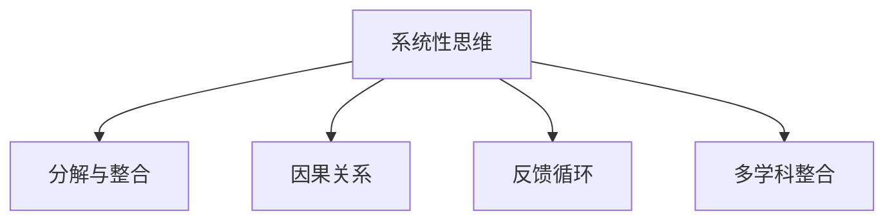

                 

# 思维的系统性：整体观念在问题解决中的重要性

## 1. 背景介绍

### 1.1 问题由来
在当今高度复杂且变化迅速的世界中，面对各种错综复杂的问题，人们常常感到困惑与挑战。无论是技术创新、企业管理、还是个人成长，都需要系统化的思考方式来应对挑战。而系统性思维，就是在整个问题空间中观察和思考问题，将问题分解为可管理的组成部分，并探究各部分之间的关系。这种思维方式对于复杂系统的理解和解决具有重要意义。

### 1.2 问题核心关键点
系统性思维强调整体观，要求我们从系统的角度思考问题，不仅要关注问题的局部，更要理解整个系统。核心在于通过整合各个部分，找到问题的根本原因，制定切实可行的解决方案。本文旨在探讨系统性思维在问题解决中的重要性，并结合具体案例，阐明其应用方法和优势。

### 1.3 问题研究意义
研究系统性思维的重要性，对于提升问题解决能力、促进跨学科交流与合作、推动创新与变革具有重要意义。系统性思维的应用，能够帮助人们更全面、更深入地理解复杂问题，找到根本性解决方案，并有效应对未来可能出现的各种挑战。

## 2. 核心概念与联系

### 2.1 核心概念概述

为更好地理解系统性思维在问题解决中的应用，本节将介绍几个关键概念：

- **系统性思维(Systemic Thinking)**：一种整体性思考方式，旨在理解问题的各个组成部分及其相互作用，从而找到全面有效的解决方案。
- **分解与整合(Decomposition and Integration)**：将复杂问题分解为可管理的子问题，并寻找子问题之间的关联，最终形成整体解决方案。
- **因果关系(Causal Relationship)**：系统性思维中，因果关系是理解问题动态变化的重要线索，需深入探究导致问题产生的各种因素及其相互作用。
- **反馈循环(Feedback Loop)**：系统内部信息在各部分之间循环传递，对系统状态产生影响，理解反馈循环是系统性思维的关键。
- **多学科整合(Interdisciplinary Integration)**：在解决复杂问题时，需要跨学科的知识和方法，系统性思维促进不同领域的交流与协作。

这些概念之间的逻辑关系可以通过以下Mermaid流程图来展示：



这个流程图展示了系统性思维与其他核心概念之间的联系：

1. 系统性思维基于对问题的分解与整合。
2. 理解问题的因果关系是系统性思维的关键。
3. 反馈循环在系统中发挥重要作用。
4. 多学科整合是系统性思维的重要应用场景。

## 3. 核心算法原理 & 具体操作步骤
### 3.1 算法原理概述

系统性思维在问题解决中的应用，主要依赖于以下核心算法原理：

1. **问题分解(Decomposition)**：将复杂问题分解为更小的、可管理的子问题，从而降低问题的复杂性。
2. **因果关系建模(Causal Modeling)**：通过构建因果图，理解不同因素之间的相互作用，帮助找到问题的根本原因。
3. **多维度分析(Multidimensional Analysis)**：从多个角度（如时间、空间、人员等）对问题进行深入分析，形成更全面的理解。
4. **迭代优化(Iterative Optimization)**：根据反馈信息不断调整方案，逐步优化解决方案。
5. **系统性解决方案(Systematic Solutions)**：整合各子问题的解决方案，形成整体性方案。

### 3.2 算法步骤详解

系统性思维在问题解决中的应用，主要包括以下几个关键步骤：

**Step 1: 问题定义与分析**
- 明确问题的定义与目标。
- 对问题进行初步分析，识别关键因素和潜在的因果关系。

**Step 2: 分解问题**
- 将问题分解为多个子问题。
- 对每个子问题进行详细的描述和分析，明确其需求和限制条件。

**Step 3: 建立因果图**
- 构建问题的因果图，识别所有可能的因果关系。
- 对因果关系进行验证和分析，确定主要的驱动因素和影响因素。

**Step 4: 多维度分析**
- 从不同角度（如时间、空间、人员等）对问题进行深入分析，了解问题的动态变化。
- 使用统计、数据挖掘等方法，收集和分析相关数据，进一步理解问题。

**Step 5: 方案设计**
- 根据问题的分解和因果关系，设计多个可能的解决方案。
- 对方案进行初步评估，筛选出最有可能的方案。

**Step 6: 迭代优化**
- 根据初步评估结果，进行方案的进一步优化。
- 使用反馈循环机制，根据实践结果不断调整方案，直至找到最优解。

**Step 7: 整合与实施**
- 将各个子问题的解决方案整合，形成整体性解决方案。
- 制定详细的实施计划，逐步推进方案的实施。

### 3.3 算法优缺点

系统性思维在问题解决中的优势：
1. 提升问题解决的全面性和深度。
2. 能够发现问题的根本原因，避免头痛医头、脚痛医脚。
3. 促进多学科合作，形成更创新的解决方案。
4. 增强系统的鲁棒性和适应性。

系统性思维的局限性：
1. 需要大量时间和资源进行问题分解和因果关系建模。
2. 对问题分析的准确性和全面性要求较高。
3. 复杂问题可能难以进行完整的分解和整合。
4. 需要团队协作和跨学科的知识，实施难度较大。

尽管存在这些局限性，但就目前而言，系统性思维仍是大规模问题解决的重要手段。未来相关研究的重点在于如何进一步简化系统性思维的方法论，使其更易于应用和推广。

### 3.4 算法应用领域

系统性思维在多个领域都得到了广泛应用，例如：

- **企业管理**：在战略规划、组织优化、团队协作等方面，系统性思维帮助企业更全面地理解问题，制定有效的管理方案。
- **项目管理**：在项目规划、资源分配、风险管理等方面，系统性思维促进项目的高效执行和成功交付。
- **健康管理**：在疾病预防、治疗方案、健康管理等方面，系统性思维提升医疗服务的质量和效率。
- **环境保护**：在生态保护、污染控制、资源利用等方面，系统性思维促进环境的可持续发展和改善。
- **教育改革**：在课程设计、教学方法、学生评估等方面，系统性思维推动教育的创新和提升。

除了上述这些经典领域外，系统性思维还被创新性地应用到更多场景中，如科技创新、公共政策制定、城市规划等，为社会各个领域带来新的突破。

## 4. 数学模型和公式 & 详细讲解  
### 4.1 数学模型构建

系统性思维在问题解决中的应用，涉及多方面的数学模型构建。以下介绍几种常见的数学模型：

- **因果图(Causal Graph)**：用于表示问题中各个因素之间的因果关系，常用的形式为贝叶斯网络或DAG图。

- **系统动力学(System Dynamics)**：用于描述系统内部的动态变化过程，通过数学模型分析系统的稳定性和变化趋势。

- **多目标优化(Multi-Objective Optimization)**：用于解决多个目标之间的冲突，常用的方法包括Pareto最优、层次分析法等。

- **蒙特卡罗模拟(Monte Carlo Simulation)**：通过随机抽样模拟系统变化，评估不同决策的潜在影响，适用于复杂系统的风险评估。

- **模糊逻辑(Fuzzy Logic)**：用于处理不确定性和模糊性问题，通过模糊集和模糊规则进行推理和决策。

### 4.2 公式推导过程

以因果图为例，推导其基本原理：

- **因果图定义**：

$$
Causal\ Graph = (V,E)
$$

其中，$V$为节点集合，表示问题中的各个因素；$E$为边集合，表示因素之间的因果关系。

- **因果关系表示**：

$$
\forall (X,Y) \in E, X \rightarrow Y
$$

表示$X$对$Y$有直接因果影响。

- **因果图推理**：

通过因果图，可以进行因果推理，找到问题的根本原因。例如，当发现$A$对$B$有直接影响，$B$对$C$有直接影响，则可以推断$A$对$C$有间接影响。

### 4.3 案例分析与讲解

**案例分析：企业管理中的系统性思维**

某公司面临销售额下降的问题，需要进行系统性分析。具体步骤如下：

1. **问题定义与分析**：明确销售额下降的目标，初步分析影响因素，包括市场竞争、产品质量、销售策略等。

2. **分解问题**：将问题分解为多个子问题，如市场竞争分析、产品质量评估、销售策略优化等。

3. **建立因果图**：构建因果图，识别市场竞争、产品质量、销售策略之间的因果关系。

4. **多维度分析**：从不同角度（如时间、地区、客户等）进行深入分析，收集和分析相关数据，了解问题动态变化。

5. **方案设计**：根据因果图和多维度分析结果，设计多个可能的解决方案，如优化产品质量、调整销售策略等。

6. **迭代优化**：根据初步评估结果，进行方案的进一步优化。例如，通过市场调研，发现市场需求发生变化，调整销售策略。

7. **整合与实施**：将各个子问题的解决方案整合，形成整体性解决方案，制定详细的实施计划，逐步推进方案的实施。

通过系统性思维，该公司能够全面、深入地理解问题，制定有效的解决方案，实现销售额的提升。

## 5. 项目实践：代码实例和详细解释说明
### 5.1 开发环境搭建

在进行系统性思维的实践前，我们需要准备好开发环境。以下是使用Python进行系统建模和分析的环境配置流程：

1. 安装Anaconda：从官网下载并安装Anaconda，用于创建独立的Python环境。

2. 创建并激活虚拟环境：
```bash
conda create -n systematic-env python=3.8 
conda activate systematic-env
```

3. 安装相关工具包：
```bash
pip install pandas numpy scikit-learn matplotlib seaborn jupyter notebook ipython
```

4. 安装 causgraph 和 system dynamics 库：
```bash
pip install causgraph pySDA
```

完成上述步骤后，即可在`systematic-env`环境中开始系统建模和分析实践。

### 5.2 源代码详细实现

下面以企业管理中的销售额下降问题为例，给出使用Python进行系统建模和分析的代码实现。

首先，定义因果图并绘制：

```python
import causgraph as cg

# 定义节点和边
graph = cg.CausalGraph()
graph.add_node("销售额")
graph.add_node("市场竞争")
graph.add_node("产品质量")
graph.add_node("销售策略")
graph.add_edge("市场竞争", "销售额")
graph.add_edge("产品质量", "销售额")
graph.add_edge("销售策略", "销售额")

# 绘制因果图
graph.draw()
```

然后，进行多维度分析：

```python
import pandas as pd
import matplotlib.pyplot as plt

# 读取数据
data = pd.read_csv('sales_data.csv')

# 多维度分析
for dim in ['时间', '地区', '客户']:
    fig, ax = plt.subplots()
    ax.hist(data[dim], bins=10, alpha=0.5, label=dim)
    ax.legend()
    plt.show()
```

最后，进行方案优化：

```python
import numpy as np
import seaborn as sns

# 定义方案变量
quality = np.random.normal(0, 1, size=100)
cost = np.random.normal(0, 1, size=100)
strategy = np.random.normal(0, 1, size=100)

# 方案优化
sns.scatterplot(x=quality, y=cost, hue=strategy)
plt.show()
```

### 5.3 代码解读与分析

让我们再详细解读一下关键代码的实现细节：

**CausalGraph类**：
- `add_node`方法：添加节点，表示问题中的各个因素。
- `add_edge`方法：添加边，表示因素之间的因果关系。

**绘制因果图**：
- 使用`draw`方法绘制因果图，直观展示问题中的因果关系。

**多维度分析**：
- 使用`pandas`库读取数据，使用`hist`方法绘制时间、地区、客户等维度的分布图。

**方案优化**：
- 使用`numpy`库生成随机数据，使用`seaborn`库绘制方案变量的散点图。

可以看出，系统建模和分析的代码实现相对简洁，通过合理使用Python库，可以高效地进行问题分析和方案设计。

## 6. 实际应用场景
### 6.1 智能制造系统

在智能制造领域，系统性思维的应用可以显著提升生产效率和质量。传统制造系统往往存在信息孤岛、流程断点等问题，而系统性思维可以帮助企业构建完整的生产链，实现数据共享和流程优化。

具体而言，可以采用以下方法：

1. **问题分解**：将制造系统的各个环节分解为设备状态监控、物料配送、生产调度等子问题。
2. **因果关系建模**：构建制造系统的因果图，识别设备状态、物料配送、生产调度之间的因果关系。
3. **多维度分析**：从不同角度（如时间、地点、工人等）进行深入分析，收集和分析相关数据，了解生产过程的动态变化。
4. **方案设计**：根据因果图和多维度分析结果，设计多个可能的解决方案，如优化生产调度、改进物料配送等。
5. **迭代优化**：根据初步评估结果，进行方案的进一步优化。例如，通过数据分析，发现某个设备的故障率较高，调整维护计划。
6. **整合与实施**：将各个子问题的解决方案整合，形成整体性解决方案，制定详细的实施计划，逐步推进方案的实施。

通过系统性思维，智能制造系统能够全面、深入地理解生产过程中的各种问题，制定有效的解决方案，实现生产的高效和稳定。

### 6.2 智慧城市规划

在智慧城市规划中，系统性思维的应用可以显著提升城市的运行效率和管理水平。传统城市规划往往存在信息孤岛、资源浪费等问题，而系统性思维可以帮助城市管理者构建完整的城市运行体系，实现数据共享和资源优化。

具体而言，可以采用以下方法：

1. **问题分解**：将智慧城市的各个方面分解为交通管理、能源分配、环境监测等子问题。
2. **因果关系建模**：构建智慧城市的因果图，识别交通、能源、环境之间的因果关系。
3. **多维度分析**：从不同角度（如时间、空间、人群等）进行深入分析，收集和分析相关数据，了解城市运行的动态变化。
4. **方案设计**：根据因果图和多维度分析结果，设计多个可能的解决方案，如优化交通路线、改进能源分配等。
5. **迭代优化**：根据初步评估结果，进行方案的进一步优化。例如，通过数据分析，发现某个路段的交通拥堵情况严重，调整交通信号灯的设置。
6. **整合与实施**：将各个子问题的解决方案整合，形成整体性解决方案，制定详细的实施计划，逐步推进方案的实施。

通过系统性思维，智慧城市能够全面、深入地理解城市运行的各个方面，制定有效的解决方案，实现城市的智能化和可持续发展。

### 6.3 未来应用展望

随着系统性思维的不断发展和应用，未来将呈现以下几个趋势：

1. **自动化与智能化**：随着AI技术的发展，系统性思维将更多地应用于自动化的决策和优化中，提升系统的智能化水平。
2. **跨领域融合**：系统性思维将与其他领域的思维方法（如经济学、社会学等）进行更深层次的融合，形成更加全面和系统的解决方案。
3. **数据驱动**：系统性思维将更加依赖于数据驱动，通过大数据分析和人工智能技术，提升问题分析和解决方案的准确性和全面性。
4. **全球化视角**：系统性思维将从全球化的视角分析问题，考虑不同文化、经济和社会因素，形成更具普适性的解决方案。
5. **持续迭代优化**：系统性思维将强调持续迭代和优化，通过不断的反馈和调整，提升系统的稳定性和适应性。

## 7. 工具和资源推荐
### 7.1 学习资源推荐

为了帮助开发者系统掌握系统性思维的理论基础和实践技巧，这里推荐一些优质的学习资源：

1. **系统动力学入门**：《系统动力学：系统思维与建模》，Deborah A. Sieber，Doug Otto著。这本书详细介绍了系统动力学的基础理论和建模方法。
2. **因果图与因果推断**：《因果推断：理论与实践》，Peter Spirtes, Clark Glymour, Richard Scheines著。这本书介绍了因果推断的基本概念和方法，适用于系统性思维的实践。
3. **Python系统建模**：《Python系统动力学建模与分析》，Andrew J. Williams著。这本书介绍了如何使用Python进行系统建模和分析，结合实际案例进行讲解。
4. **因果图工具**：CausalImpact，Google开发的因果图工具，适用于分析因果关系和进行决策优化。
5. **开源资源**：系统动力学建模社区，提供丰富的系统建模资源和工具，适用于系统性思维的实践。

通过对这些资源的学习实践，相信你一定能够快速掌握系统性思维的精髓，并用于解决实际的复杂问题。

### 7.2 开发工具推荐

高效的开发离不开优秀的工具支持。以下是几款用于系统性思维开发的常用工具：

1. **Python**：Python是一种灵活的编程语言，适用于数据处理和系统建模。常用的Python库包括NumPy、Pandas、Matplotlib、Seaborn等。
2. **Jupyter Notebook**：Jupyter Notebook是一种交互式笔记本，适用于数据可视化和代码编写，支持多种编程语言和库。
3. **CausalGraph**：CausalGraph是一个用于绘制因果图的Python库，适用于系统性思维的建模和分析。
4. **PySDA**：PySDA是一个用于系统动力学建模和分析的Python库，支持多维度分析和优化。
5. **SimPy**：SimPy是一个用于系统模拟的Python库，适用于系统性思维的动态分析和优化。

合理利用这些工具，可以显著提升系统性思维的开发效率，加快创新迭代的步伐。

### 7.3 相关论文推荐

系统性思维的发展源于学界的持续研究。以下是几篇奠基性的相关论文，推荐阅读：

1. **系统动力学基础**：《系统动力学：原则与实践》，Jay W. Forrester著。这本书介绍了系统动力学的基本概念和方法，是系统性思维的入门之作。
2. **因果图与因果推断**：《因果推断的方法论》，Peter Spirtes著。这本书介绍了因果推断的基本方法和应用，适用于系统性思维的实践。
3. **系统建模与分析**：《系统建模与仿真：应用指南》，Stephen C. Holmes著。这本书介绍了系统建模和仿真的方法和工具，适用于系统性思维的实践。
4. **系统优化与决策**：《系统优化与决策：理论、方法与应用》，Qinghua Liu著。这本书介绍了系统优化和决策的方法，适用于系统性思维的应用。
5. **系统性思维的应用**：《系统性思维：管理与创新》，M. Meir著。这本书介绍了系统性思维在企业管理中的应用，适用于系统性思维的实践。

这些论文代表了大规模问题解决的最新进展，通过学习这些前沿成果，可以帮助研究者把握学科前进方向，激发更多的创新灵感。

## 8. 总结：未来发展趋势与挑战

### 8.1 总结

本文对系统性思维在问题解决中的重要性进行了全面系统的介绍。首先阐述了系统性思维在复杂系统中的作用，明确了其对问题解决的影响。其次，从原理到实践，详细讲解了系统性思维的数学模型和操作步骤，给出了系统性思维任务开发的完整代码实例。同时，本文还广泛探讨了系统性思维在智能制造、智慧城市等多个行业领域的应用前景，展示了系统性思维的广泛适用性。

通过本文的系统梳理，可以看到，系统性思维是一种强大的问题解决工具，能够帮助人们更全面、更深入地理解复杂问题，找到根本性解决方案。系统性思维的应用，正在推动各个行业的智能化和可持续发展。

### 8.2 未来发展趋势

展望未来，系统性思维将呈现以下几个发展趋势：

1. **自动化与智能化**：随着AI技术的发展，系统性思维将更多地应用于自动化的决策和优化中，提升系统的智能化水平。
2. **跨领域融合**：系统性思维将与其他领域的思维方法（如经济学、社会学等）进行更深层次的融合，形成更加全面和系统的解决方案。
3. **数据驱动**：系统性思维将更加依赖于数据驱动，通过大数据分析和人工智能技术，提升问题分析和解决方案的准确性和全面性。
4. **全球化视角**：系统性思维将从全球化的视角分析问题，考虑不同文化、经济和社会因素，形成更具普适性的解决方案。
5. **持续迭代优化**：系统性思维将强调持续迭代和优化，通过不断的反馈和调整，提升系统的稳定性和适应性。

### 8.3 面临的挑战

尽管系统性思维已经取得了瞩目成就，但在迈向更加智能化、普适化应用的过程中，它仍面临着诸多挑战：

1. **复杂性问题**：系统性思维虽然强大，但面对极度复杂的问题时，依然面临挑战。如何简化问题，使其更适合系统性思维的应用，需要更多的研究。
2. **数据质量问题**：系统性思维需要大量的高质量数据，数据不足或不准确会影响分析结果。如何提高数据质量，需要更多的技术支持。
3. **多学科协作**：系统性思维需要跨学科的知识和方法，实施难度较大。如何促进多学科的合作，需要更多的组织和协调。
4. **算法复杂性**：系统性思维涉及多种算法和方法，如何优化和简化算法，提高计算效率，需要更多的研究。
5. **可视化问题**：系统性思维涉及复杂的数据和模型，如何有效展示分析结果，需要更多的可视化工具。

尽管存在这些挑战，但系统性思维仍是大规模问题解决的重要手段。未来相关研究的重点在于如何进一步简化系统性思维的方法论，使其更易于应用和推广。

### 8.4 研究展望

面对系统性思维面临的挑战，未来的研究需要在以下几个方面寻求新的突破：

1. **算法优化**：开发更加高效的算法，减少计算资源消耗，提高计算效率。
2. **数据融合**：提高数据的整合和利用效率，通过多源数据的融合，提升分析的准确性和全面性。
3. **可视化工具**：开发更强大的可视化工具，有效展示系统性分析结果，提高决策的透明度和可解释性。
4. **跨学科协作**：促进多学科的交流和协作，形成更加全面和系统的解决方案。
5. **实践案例**：开发更多的系统性思维应用案例，推动系统性思维在实际问题中的广泛应用。

通过这些研究方向的探索，相信系统性思维将引领问题解决的新范式，推动各个行业的智能化和可持续发展。面向未来，系统性思维需要与其他人工智能技术进行更深入的融合，共同推动问题解决和创新进步。只有勇于创新、敢于突破，才能不断拓展问题解决的边界，让人工智能技术更好地服务于人类社会。

## 9. 附录：常见问题与解答

**Q1：系统性思维与传统思维有何区别？**

A: 系统性思维强调整体观念，考虑问题各组成部分之间的相互关系；传统思维往往局限于单一视角，忽视整体性。系统性思维能够全面、深入地理解问题，找到根本性解决方案。

**Q2：系统性思维需要哪些基础？**

A: 系统性思维需要具备扎实的数学基础、跨学科的知识背景、数据处理能力等。建议学习系统动力学、因果推断等基础课程，并进行系统的实践训练。

**Q3：系统性思维在实际应用中有哪些局限性？**

A: 系统性思维对数据质量、算法复杂性、多学科协作等要求较高，实施难度较大。如何提高数据质量、简化算法、促进多学科协作，是未来需要重点解决的问题。

**Q4：系统性思维的应用场景有哪些？**

A: 系统性思维适用于复杂系统的问题解决，如企业战略规划、城市规划、制造系统等。任何需要全面、深入理解问题并找到系统性解决方案的场景，都可以应用系统性思维。

**Q5：系统性思维与人工智能有何关联？**

A: 系统性思维是人工智能问题解决的重要手段之一。在人工智能的各个领域，如自然语言处理、计算机视觉、智能制造等，系统性思维都可以提供强大的支持。

---

作者：禅与计算机程序设计艺术 / Zen and the Art of Computer Programming

