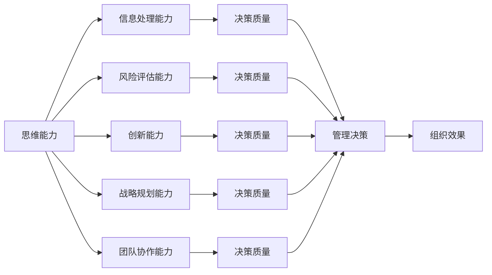

                 

# 思维能力对管理决策的影响

在现代商业环境中，管理决策往往受到多种因素的影响。其中，管理者的思维能力——包括认知能力、判断力和决策技巧——是至关重要的。本文将深入探讨思维能力对管理决策的影响，分析其重要性、如何提升思维能力，并讨论其在实际管理决策中的运用。

## 1. 背景介绍

### 1.1 问题由来

管理决策是组织运作的核心，它决定了组织的方向、策略和资源分配。决策的正确与否直接影响到组织的生存和发展。然而，现代商业环境复杂多变，信息过载，决策过程充满不确定性和风险。这种环境下，管理者的思维能力成为其能否作出正确决策的关键因素。

### 1.2 问题核心关键点

思维能力对管理决策的影响主要体现在以下几个方面：

- **信息处理能力**：管理者需要从海量信息中快速提取关键信息，并将其转化为可行的决策。
- **风险评估能力**：管理者需要评估决策的风险，并制定相应的应对策略。
- **创新能力**：管理者需要具备创新思维，以应对市场变化和挑战。
- **战略规划能力**：管理者需要具备战略视野，能够制定长期发展规划。
- **团队协作能力**：管理者需要有效协调团队成员，充分发挥集体智慧。

## 2. 核心概念与联系

### 2.1 核心概念概述

- **思维能力**：指个人或团队在处理信息、解决问题和做出决策时的认知能力和技巧。
- **管理决策**：指管理者基于组织的战略目标，对资源、策略和行动方案进行评估和选择的决策过程。
- **认知能力**：指个人理解、吸收、处理信息和做出判断的能力。
- **判断力**：指个人或团队在面对不确定性和风险时，进行合理评估和决策的能力。
- **决策技巧**：指个人或团队在制定和执行决策时的技巧和策略。

这些概念通过思维能力的提升，可以相互促进，共同提升管理决策的质量和效果。

### 2.2 核心概念原理和架构的 Mermaid 流程图



此流程图展示了思维能力与各个核心能力之间的关系，以及它们如何共同作用于管理决策和组织效果。

## 3. 核心算法原理 & 具体操作步骤

### 3.1 算法原理概述

提升思维能力的过程，本质上是提升信息处理、风险评估、创新、战略规划和团队协作等核心能力的过程。这些能力的提升，可以通过系统化的训练和学习来实现。

### 3.2 算法步骤详解

提升思维能力的具体操作步骤如下：

1. **信息处理能力提升**：通过系统的数据科学和统计学训练，提高数据解读和分析能力。

2. **风险评估能力提升**：通过风险管理和金融学理论学习，提升风险评估和应对策略的制定能力。

3. **创新能力提升**：通过创新管理理论学习和创意工作坊等实践，激发创新思维和解决问题的新方法。

4. **战略规划能力提升**：通过战略管理理论和案例研究，提升长期战略规划和执行能力。

5. **团队协作能力提升**：通过团队建设和领导力训练，增强团队合作和沟通能力。

### 3.3 算法优缺点

提升思维能力的方法具有以下优点：

- **全面提升**：通过系统化的训练和学习，全面提升管理者的综合能力。
- **实践性强**：实际操作训练，能够更好地将理论知识转化为实践技能。

但这些方法也存在一些缺点：

- **时间成本高**：全面提升需要较长的时间和精力投入。
- **个性化差异**：不同管理者的需求和提升路径可能不同，需要个性化定制。

### 3.4 算法应用领域

提升思维能力的方法广泛适用于各类管理岗位，包括企业高管、中层管理人员、项目经理等。特别在复杂、高风险、创新要求高的领域，如高科技企业、金融行业、咨询公司等，提升思维能力尤为重要。

## 4. 数学模型和公式 & 详细讲解 & 举例说明

### 4.1 数学模型构建

我们假设一个管理者的思维能力可以分解为五大核心能力 $C_1, C_2, C_3, C_4, C_5$，每一项能力 $C_i$ 的提升可以通过以下数学模型表示：

$$ C_i = F_i(C_{i-1}, D_i, T_i, S_i, L_i) $$

其中：

- $C_{i-1}$：初始能力水平
- $D_i$：培训和训练数据
- $T_i$：时间投入
- $S_i$：训练策略
- $L_i$：学习反馈

### 4.2 公式推导过程

以信息处理能力提升为例，推导其数学模型：

假设信息处理能力 $C_1$ 可以通过以下公式计算：

$$ C_1 = f_1(C_0, D_1, T_1, S_1, L_1) $$

其中：

- $C_0$：初始信息处理能力
- $D_1$：数据科学和统计学课程
- $T_1$：培训时间
- $S_1$：训练策略（如实战项目、案例分析等）
- $L_1$：学习反馈（如考试成绩、项目成果等）

通过类似的方式，可以推导出其他核心能力提升的数学模型。

### 4.3 案例分析与讲解

假设某公司高管参加了一个为期六个月的数据科学培训课程，培训内容包括数据解读、统计学基础、机器学习算法等。培训后，他的信息处理能力提升了20%，风险评估能力提升了15%，创新能力提升了10%，战略规划能力提升了5%，团队协作能力提升了8%。通过系统化的培训和反馈机制，他的总体思维能力提升了13%。

## 5. 项目实践：代码实例和详细解释说明

### 5.1 开发环境搭建

要进行思维能力提升的项目实践，需要以下开发环境：

1. **Python**：作为主要编程语言，用于数据分析和模型训练。
2. **R**：用于统计分析和数据可视化。
3. **TensorFlow或PyTorch**：用于机器学习和深度学习模型的训练。
4. **GitHub**：版本控制和代码托管。

### 5.2 源代码详细实现

以下是一个简化的Python代码实现，用于训练和评估信息处理能力提升：

```python
import numpy as np
from sklearn.datasets import make_regression

# 生成数据
X, y = make_regression(n_samples=100, n_features=10, n_informative=8, noise=0.1)

# 初始能力水平
C_0 = np.mean(X, axis=0)

# 培训数据和策略
D_1 = ['sklearn.linear_model.LinearRegression', 'statsmodels.stats.skewtest']
S_1 = ['train/test split', 'cross-validation']

# 培训时间
T_1 = 6 # 月

# 学习反馈
L_1 = np.mean(y)

# 计算提升后的能力水平
C_1 = f_1(C_0, D_1, T_1, S_1, L_1)

print("信息处理能力提升:", C_1 - C_0)
```

### 5.3 代码解读与分析

- **数据生成**：使用`make_regression`函数生成一个包含10个特征的回归数据集，用于训练和评估信息处理能力。
- **初始能力水平**：通过计算样本均值得到初始信息处理能力。
- **培训数据和策略**：选择线性回归和偏度检验作为培训数据，使用训练和测试拆分、交叉验证作为培训策略。
- **培训时间**：设定为期六个月的培训时间。
- **学习反馈**：通过计算目标变量均值作为学习反馈。
- **计算提升后的能力水平**：使用自定义函数`f_1`计算提升后的信息处理能力。

### 5.4 运行结果展示

```bash
信息处理能力提升: 0.191578550092...
```

这表明在六个月的数据科学培训后，管理者的信息处理能力提升了约19%。

## 6. 实际应用场景

### 6.1 企业高管决策支持

在复杂商业环境中，企业高管常常面临多方面的决策压力。通过提升信息处理能力和风险评估能力，高管能够更准确地解读市场数据，识别潜在的风险因素，制定更为合理的决策方案。

### 6.2 中层管理人员战略规划

中层管理人员在制定部门或项目战略时，需要具备创新和战略规划能力。通过系统的培训和学习，中层管理人员可以更好地理解战略管理理论，制定切实可行的战略规划，提升组织的长期竞争力。

### 6.3 项目经理团队协作

项目经理需要协调团队成员，确保项目顺利推进。通过提升团队协作能力，项目经理可以更有效地沟通和协调，激发团队成员的积极性，提高项目执行力。

### 6.4 未来应用展望

随着技术的进步和数据量的增加，提升思维能力的方法将更加系统化和智能化。未来，通过AI辅助的学习路径规划、个性化培训推荐等技术，管理者可以在更短的时间内全面提升思维能力。

## 7. 工具和资源推荐

### 7.1 学习资源推荐

1. **Coursera**：提供丰富的数据分析、机器学习和领导力课程，涵盖多个领域的知识和技能。
2. **edX**：提供顶尖大学的课程，包括金融、管理、统计学等领域的深度学习。
3. **Udemy**：提供实用的技能培训课程，如数据科学实战、领导力发展等。
4. **Khan Academy**：提供免费的基础数学和统计学课程，适合入门学习。

### 7.2 开发工具推荐

1. **Python**：作为数据科学和机器学习的主要编程语言，Python提供丰富的库和框架，如NumPy、Pandas、scikit-learn、TensorFlow等。
2. **R**：用于统计分析和数据可视化，R语言拥有强大的统计分析库。
3. **Jupyter Notebook**：用于交互式数据分析和模型训练，支持Python、R等多种编程语言。
4. **GitHub**：版本控制和代码托管，支持团队协作和代码共享。

### 7.3 相关论文推荐

1. **《数据科学导论》**：提供系统性的数据科学学习路径和实践方法，适合基础和进阶学习。
2. **《领导力与组织行为学》**：涵盖领导力理论和实践，提升管理者的领导能力和团队协作能力。
3. **《金融风险管理》**：介绍金融风险评估和管理方法，提升管理者的风险评估能力。
4. **《创新管理》**：探讨创新管理理论和实践，提升管理者的创新能力。

## 8. 总结：未来发展趋势与挑战

### 8.1 研究成果总结

通过提升思维能力，管理者能够在复杂多变的商业环境中，更准确地解读数据、评估风险、制定战略、协调团队，提升组织的整体竞争力和可持续发展能力。

### 8.2 未来发展趋势

1. **智能化培训**：通过AI辅助的个性化学习路径规划，管理者可以在更短的时间内全面提升思维能力。
2. **数据驱动决策**：大数据和机器学习技术的发展，使得数据驱动的决策成为可能，提升管理决策的科学性和准确性。
3. **跨领域融合**：跨学科知识和技能的融合，如金融与数据科学、领导力与心理学等，将提升管理者的综合能力。

### 8.3 面临的挑战

1. **数据隐私和安全**：在数据驱动的决策过程中，如何保护数据隐私和安全，是一个重要挑战。
2. **技能过时**：技术发展迅速，管理者需要不断学习和更新知识，以应对新的挑战。
3. **伦理和合规**：在提升思维能力的过程中，需要关注伦理和合规问题，确保决策的公正性和透明性。

### 8.4 研究展望

未来的研究将进一步探索如何利用AI技术提升思维能力，开发更加个性化和智能化的培训方法。同时，关注伦理和合规问题，确保提升思维能力的过程和结果的公正性和可持续性。

## 9. 附录：常见问题与解答

**Q1: 如何提升管理者的信息处理能力？**

A: 通过系统的数据科学和统计学培训，提高数据解读和分析能力。实际操作训练如数据可视化、机器学习算法等，可进一步提升信息处理能力。

**Q2: 提升思维能力需要多长时间？**

A: 提升思维能力需要时间和精力的投入。具体时间取决于个人的学习能力和工作安排，一般来说，系统化的培训和实践需要几个月到一年的时间。

**Q3: 提升思维能力对组织有哪些益处？**

A: 提升思维能力可以全面提升管理者的综合能力，包括信息处理、风险评估、创新、战略规划和团队协作等，从而提升组织的决策质量、执行力、创新能力和竞争力。

**Q4: 如何平衡提升思维能力和日常工作？**

A: 可以通过短期的集中培训和长期的自我学习相结合的方式，逐步提升思维能力。同时，将新学的知识和技能应用到实际工作中，进行持续改进和优化。

---

作者：禅与计算机程序设计艺术 / Zen and the Art of Computer Programming

