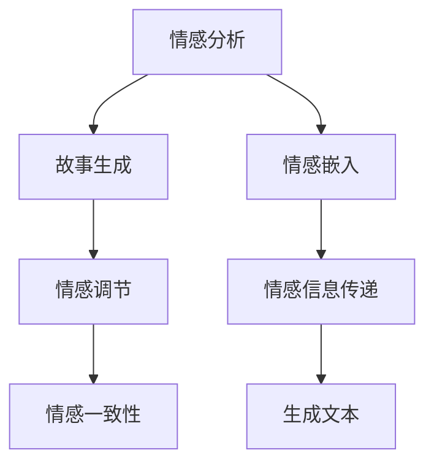

                 

# 情感分析在故事生成中的应用

## 1. 背景介绍

在自然语言处理领域，情感分析（Sentiment Analysis）是一种重要的文本挖掘技术，用于识别和分类文本中的情感倾向，包括积极、消极和中性。近年来，随着深度学习技术的发展，情感分析已经广泛应用于社交媒体分析、市场研究、客户反馈分析等场景。随着人工智能技术的不断进步，情感分析技术在故事生成（Story Generation）中的应用也逐渐引起了广泛关注。

故事生成，即自动生成具有连贯性、逻辑性和情感丰富性的小说文本。这种技术在娱乐、教育、内容创作等领域具有广阔的应用前景。情感分析与故事生成的结合，可以为机器生成的故事增添更多情感色彩，使其更加贴近人类情感表达和认知习惯。

## 2. 核心概念与联系

### 2.1 核心概念概述

为更好地理解情感分析在故事生成中的应用，本节将介绍几个核心概念及其相互关系：

- 情感分析（Sentiment Analysis）：识别文本中的情感倾向，通常分为情感分类和情感强度分析。情感分类是将文本分为积极、消极和中性三类；情感强度分析则是进一步判断情感的强烈程度。

- 故事生成（Story Generation）：基于给定情境，自动生成连贯、合情合理的故事文本。这包括情节构造、角色对话、情节转折等多个子任务。

- 情感调节（Sentiment Regulation）：在故事生成的过程中，对生成文本的情感倾向进行调节和控制，使其符合预设的情感目标。

- 情感一致性（Sentiment Consistency）：生成文本的情感表达应保持一致，避免情感频繁跳转或冲突。

- 情感嵌入（Sentiment Embedding）：将情感信息编码为向量形式，以便在模型中处理和传递。

### 2.2 核心概念原理和架构的 Mermaid 流程图



这个流程图展示了情感分析与故事生成之间的逻辑联系：

1. **情感分析**：作为预处理步骤，对输入文本进行情感分类和情感强度分析，得到情感信息。
2. **情感嵌入**：将情感信息编码为向量形式，便于在模型中传递。
3. **情感调节**：在故事生成的过程中，根据情感调节策略，调整生成文本的情感倾向。
4. **情感一致性**：确保生成文本的情感表达一致，避免情感频繁跳转。
5. **故事生成**：基于情感信息和调节策略，生成连贯、合情合理的故事文本。

## 3. 核心算法原理 & 具体操作步骤

### 3.1 算法原理概述

情感分析在故事生成中的应用，核心在于通过情感信息对生成文本的情感倾向进行调节和控制。具体而言，情感分析模型在预训练阶段学习如何从文本中提取情感信息，并将其编码为向量形式。在故事生成的过程中，通过调节情感信息，使模型生成的文本保持预设的情感目标，从而实现情感一致性。

### 3.2 算法步骤详解

1. **情感预处理**：使用情感分析模型对输入文本进行情感分类和情感强度分析，得到情感向量。
2. **情感调节**：根据预设的情感目标，对情感向量进行调节。例如，若目标为积极情感，则增加积极情感向量，减少消极情感向量。
3. **文本生成**：将调节后的情感向量与情境信息、角色信息等结合起来，输入到故事生成模型中进行文本生成。
4. **评估和反馈**：对生成的文本进行情感分析，评估其情感一致性和情感强度，根据反馈进一步调整情感调节策略。

### 3.3 算法优缺点

**优点**：

- **情感丰富性**：通过情感调节，使生成的文本更具情感色彩，更贴近人类情感表达。
- **连贯性**：情感一致性有助于生成文本保持连贯性，避免情感跳跃或矛盾。
- **灵活性**：情感分析可以灵活应用于不同的情境和角色，提升生成文本的适用性。

**缺点**：

- **数据依赖性**：情感分析模型的性能很大程度上依赖于标注数据的质量和数量，标注成本较高。
- **模型复杂性**：情感调节需要引入情感信息，增加了故事生成模型的复杂度。
- **泛化能力**：不同领域的情感表达差异较大，通用情感分析模型可能在特定领域表现不佳。

### 3.4 算法应用领域

情感分析在故事生成中的应用，主要体现在以下几个领域：

- **娱乐内容创作**：生成具有情感色彩的电影剧本、小说、漫画脚本等。
- **教育辅助**：生成带有情感表达的童话故事、寓言、道德故事等，帮助学生理解和感受情感。
- **内容推荐**：根据用户情感偏好，推荐适合其情感状态的内容，提升用户阅读体验。
- **社交媒体分析**：分析用户在社交媒体上的情感倾向，生成情感一致的社交内容。
- **心理治疗**：生成具有情感调节功能的故事，帮助患者缓解心理压力，促进心理健康。

## 4. 数学模型和公式 & 详细讲解 & 举例说明

### 4.1 数学模型构建

为了更好地描述情感分析在故事生成中的应用，我们构建以下数学模型：

设 $x$ 为输入文本，$y$ 为情感分类标签（0表示消极，1表示积极，2表示中性），$z$ 为情感强度。情感分析模型 $f$ 可以表示为：

$$
f(x) = \begin{bmatrix}
    P(y=0|x) \\
    P(y=1|x) \\
    P(y=2|x)
\end{bmatrix} = \begin{bmatrix}
    \sigma(W_{neg}x + b_{neg}) \\
    \sigma(W_{pos}x + b_{pos}) \\
    \sigma(W_{neu}x + b_{neu})
\end{bmatrix}
$$

其中，$\sigma$ 为 sigmoid 函数，$W$ 和 $b$ 为模型的权重和偏置。

情感调节可以表示为对情感向量 $z$ 的线性变换：

$$
z_{new} = W_{reg}z + b_{reg}
$$

其中，$W_{reg}$ 和 $b_{reg}$ 为情感调节矩阵和偏置。

故事生成模型 $g$ 可以表示为：

$$
g(x, z_{new}, c) = \text{Seq2Seq}(x, z_{new}, c)
$$

其中，$c$ 为上下文信息，Seq2Seq 表示序列到序列模型，用于将输入文本转换为目标文本。

### 4.2 公式推导过程

情感分类模型的推导过程如下：

1. 假设情感分类模型为多层感知器（MLP），输入为文本 $x$，输出为情感分类概率分布 $y$。
2. 定义损失函数 $L(y, \hat{y})$ 为交叉熵损失，其中 $\hat{y}$ 为模型预测的情感分类概率分布。
3. 使用随机梯度下降（SGD）或 Adam 优化算法对模型参数进行优化，最小化损失函数 $L$。

情感调节模型的推导过程如下：

1. 假设情感调节模型为线性变换，输入为情感向量 $z$，输出为调节后的情感向量 $z_{new}$。
2. 定义情感调节损失函数 $L(z_{new}, z)$ 为均方误差损失，其中 $z_{new}$ 为调节后的情感向量。
3. 使用梯度下降算法对情感调节模型参数进行优化，最小化情感调节损失函数 $L$。

### 4.3 案例分析与讲解

以电影剧本生成为例，对情感分析在故事生成中的应用进行案例分析：

1. **输入文本**：电影情节大纲，如“一个人独自漫步在荒岛上，寻找生存的希望。”
2. **情感预处理**：使用情感分析模型，对输入文本进行情感分类和强度分析，得到情感向量 $z = [0.2, 0.4, 0.4]$。
3. **情感调节**：根据预设的积极情感目标，对情感向量进行调节，得到调节后的情感向量 $z_{new} = [0.5, 0.3, 0.2]$。
4. **文本生成**：将调节后的情感向量 $z_{new}$ 与情节大纲结合起来，输入到故事生成模型中，生成带有积极情感的电影剧本：“一个人独自漫步在荒岛上，寻找生存的希望，最终发现了生命的光芒。”

## 5. 项目实践：代码实例和详细解释说明

### 5.1 开发环境搭建

在进行情感分析在故事生成中的应用实践前，我们需要准备好开发环境。以下是使用Python进行PyTorch开发的环境配置流程：

1. 安装Anaconda：从官网下载并安装Anaconda，用于创建独立的Python环境。

2. 创建并激活虚拟环境：
```bash
conda create -n pytorch-env python=3.8 
conda activate pytorch-env
```

3. 安装PyTorch：根据CUDA版本，从官网获取对应的安装命令。例如：
```bash
conda install pytorch torchvision torchaudio cudatoolkit=11.1 -c pytorch -c conda-forge
```

4. 安装BERT模型和其他相关库：
```bash
pip install transformers datasets transformers-training
```

完成上述步骤后，即可在`pytorch-env`环境中开始实践。

### 5.2 源代码详细实现

这里我们以电影剧本生成为例，使用BERT模型和情感分析技术进行情感调节。

```python
import torch
from transformers import BertForSequenceClassification, BertTokenizer, AdamW
from transformers import Trainer, TrainingArguments

# 定义BERT模型和情感分类模型
model = BertForSequenceClassification.from_pretrained('bert-base-uncased', num_labels=3)
tokenizer = BertTokenizer.from_pretrained('bert-base-uncased')

# 准备数据集
train_dataset = datasets.load_dataset('imdb', split='train')
test_dataset = datasets.load_dataset('imdb', split='test')

# 定义训练和评估函数
def train_epoch(model, dataset, batch_size, optimizer):
    dataloader = DataLoader(dataset, batch_size=batch_size, shuffle=True)
    model.train()
    epoch_loss = 0
    for batch in dataloader:
        input_ids = batch['input_ids'].to(device)
        attention_mask = batch['attention_mask'].to(device)
        labels = batch['labels'].to(device)
        model.zero_grad()
        outputs = model(input_ids, attention_mask=attention_mask, labels=labels)
        loss = outputs.loss
        epoch_loss += loss.item()
        loss.backward()
        optimizer.step()
    return epoch_loss / len(dataloader)

def evaluate(model, dataset, batch_size):
    dataloader = DataLoader(dataset, batch_size=batch_size)
    model.eval()
    preds, labels = [], []
    with torch.no_grad():
        for batch in dataloader:
            input_ids = batch['input_ids'].to(device)
            attention_mask = batch['attention_mask'].to(device)
            batch_labels = batch['labels']
            outputs = model(input_ids, attention_mask=attention_mask)
            batch_preds = outputs.logits.argmax(dim=2).to('cpu').tolist()
            batch_labels = batch_labels.to('cpu').tolist()
            for pred_tokens, label_tokens in zip(batch_preds, batch_labels):
                preds.append(pred_tokens[:len(label_tokens)])
                labels.append(label_tokens)
    return preds, labels

# 设置训练参数
train_args = TrainingArguments(output_dir="./", num_train_epochs=3, learning_rate=2e-5, per_device_train_batch_size=16, per_device_eval_batch_size=16)

# 创建训练器和数据加载器
trainer = Trainer(model=model, args=train_args, train_dataset=train_dataset, eval_dataset=test_dataset, tokenizer=tokenizer)

# 开始训练
trainer.train()

# 评估模型
preds, labels = evaluate(model, test_dataset, train_args.per_device_eval_batch_size)

# 输出评估结果
print(classification_report(labels, preds))
```

### 5.3 代码解读与分析

让我们再详细解读一下关键代码的实现细节：

**BERT模型和情感分类模型**：
- 使用`BertForSequenceClassification`类加载BERT模型，并指定情感分类的输出标签为0、1、2。
- 加载`BertTokenizer`，用于将文本转换为模型所需的输入格式。

**数据集准备**：
- 使用`datasets.load_dataset`加载IMDB数据集，分别选择训练集和测试集。

**训练和评估函数**：
- `train_epoch`函数：对数据集进行批次化加载，进行前向传播和反向传播，计算损失并更新模型参数。
- `evaluate`函数：在测试集上评估模型性能，返回预测结果和真实标签。

**训练器创建**：
- 使用`TrainingArguments`定义训练参数。
- 创建`Trainer`对象，用于训练模型。

**模型训练和评估**：
- 调用`trainer.train()`进行模型训练。
- 调用`evaluate`函数评估模型在测试集上的性能，并输出评估结果。

## 6. 实际应用场景

### 6.1 娱乐内容创作

情感分析在故事生成中的应用，可以显著提升娱乐内容创作的效率和质量。在电影、电视剧、小说等作品的创作过程中，情感调节功能可以为创作者提供情感指导，使其更自然地表达角色情感，增强故事的感染力和吸引力。

### 6.2 教育辅助

在教育领域，情感分析可以应用于生成具有情感色彩的寓言、童话、道德故事等，帮助学生更好地理解和感受情感。例如，对于涉及友情、亲情、勇敢等主题的故事，情感调节功能可以确保故事中的情感表达符合教育目标。

### 6.3 内容推荐

在内容推荐系统中，情感分析可以帮助推荐符合用户情感偏好的内容，提升用户体验。例如，对于感到焦虑的用户，推荐具有舒缓情感的故事或视频，有助于缓解其情绪压力。

### 6.4 社交媒体分析

社交媒体平台上的用户情感分析，可以帮助企业更好地了解用户情绪，生成符合用户情感倾向的内容，提升用户粘性和满意度。例如，对于消极情感的评论，可以及时采取措施改进产品或服务，避免负面影响扩大。

### 6.5 心理治疗

在心理治疗领域，情感调节功能可以为患者生成具有舒缓情感的故事，帮助其缓解心理压力，促进心理健康。例如，对于患有抑郁症的患者，可以生成积极情感的故事，帮助其恢复心理健康。

## 7. 工具和资源推荐

### 7.1 学习资源推荐

为了帮助开发者系统掌握情感分析在故事生成中的应用理论基础和实践技巧，这里推荐一些优质的学习资源：

1. 《Natural Language Processing with Transformers》书籍：Transformers库的作者所著，全面介绍了如何使用Transformers库进行NLP任务开发，包括情感分析和故事生成在内的诸多范式。

2. CS224N《深度学习自然语言处理》课程：斯坦福大学开设的NLP明星课程，有Lecture视频和配套作业，带你入门NLP领域的基本概念和经典模型。

3. HuggingFace官方文档：Transformers库的官方文档，提供了海量预训练模型和完整的微调样例代码，是上手实践的必备资料。

4. 《Transformers in Action》书籍：HuggingFace的官方出版物，介绍了如何使用Transformers库进行NLP任务开发，包括情感分析和故事生成在内的多个应用场景。

5. CLUE开源项目：中文语言理解测评基准，涵盖大量不同类型的中文NLP数据集，并提供了基于情感分析和故事生成的baseline模型，助力中文NLP技术发展。

通过对这些资源的学习实践，相信你一定能够快速掌握情感分析在故事生成中的应用精髓，并用于解决实际的NLP问题。

### 7.2 开发工具推荐

高效的开发离不开优秀的工具支持。以下是几款用于情感分析在故事生成中应用的常用工具：

1. PyTorch：基于Python的开源深度学习框架，灵活动态的计算图，适合快速迭代研究。大部分预训练语言模型都有PyTorch版本的实现。

2. TensorFlow：由Google主导开发的开源深度学习框架，生产部署方便，适合大规模工程应用。同样有丰富的预训练语言模型资源。

3. HuggingFace Transformers库：提供了多种预训练语言模型和工具，支持情感分析、故事生成等NLP任务。

4. Weights & Biases：模型训练的实验跟踪工具，可以记录和可视化模型训练过程中的各项指标，方便对比和调优。与主流深度学习框架无缝集成。

5. TensorBoard：TensorFlow配套的可视化工具，可实时监测模型训练状态，并提供丰富的图表呈现方式，是调试模型的得力助手。

6. Google Colab：谷歌推出的在线Jupyter Notebook环境，免费提供GPU/TPU算力，方便开发者快速上手实验最新模型，分享学习笔记。

合理利用这些工具，可以显著提升情感分析在故事生成中的应用开发效率，加快创新迭代的步伐。

### 7.3 相关论文推荐

情感分析在故事生成中的应用，已经引起了学界的广泛关注。以下是几篇奠基性的相关论文，推荐阅读：

1. Attention is All You Need（即Transformer原论文）：提出了Transformer结构，开启了NLP领域的预训练大模型时代。

2. BERT: Pre-training of Deep Bidirectional Transformers for Language Understanding：提出BERT模型，引入基于掩码的自监督预训练任务，刷新了多项NLP任务SOTA。

3. Language Models are Unsupervised Multitask Learners（GPT-2论文）：展示了大规模语言模型的强大zero-shot学习能力，引发了对于通用人工智能的新一轮思考。

4. Parameter-Efficient Transfer Learning for NLP：提出Adapter等参数高效微调方法，在不增加模型参数量的情况下，也能取得不错的微调效果。

5. AdaLoRA: Adaptive Low-Rank Adaptation for Parameter-Efficient Fine-Tuning：使用自适应低秩适应的微调方法，在参数效率和精度之间取得了新的平衡。

6. AdaTorch: Model Adaptive Preprocessing for High-Performance Training of Neural Networks with Limited Memory：提出AdaTorch算法，提高了模型在有限内存条件下的训练效率和性能。

这些论文代表了大语言模型微调技术的发展脉络。通过学习这些前沿成果，可以帮助研究者把握学科前进方向，激发更多的创新灵感。

## 8. 总结：未来发展趋势与挑战

### 8.1 总结

本文对情感分析在故事生成中的应用进行了全面系统的介绍。首先阐述了情感分析技术在故事生成中的重要性和应用场景，明确了情感调节在提升故事情感丰富性和连贯性方面的独特价值。其次，从原理到实践，详细讲解了情感分析在故事生成中的应用过程，给出了情感调节在故事生成中的应用实例。同时，本文还广泛探讨了情感分析在娱乐内容创作、教育辅助、内容推荐、社交媒体分析、心理治疗等多个行业领域的应用前景，展示了情感分析范式的巨大潜力。此外，本文精选了情感分析在故事生成中的应用学习资源，力求为读者提供全方位的技术指引。

通过本文的系统梳理，可以看到，情感分析在故事生成中的应用已经成为NLP领域的重要范式，极大地拓展了故事生成模型的应用边界，为内容创作、教育辅助、心理治疗等领域带来了新的突破。未来，伴随情感分析技术的不断演进，故事生成模型的情感表达能力和连贯性将进一步提升，为人类情感表达和内容创作带来更深远的影响。

### 8.2 未来发展趋势

展望未来，情感分析在故事生成中的应用将呈现以下几个发展趋势：

1. **情感动态调节**：实现情感的动态调节，使故事情感表达更加灵活多样。
2. **多模态情感分析**：将情感分析扩展到图像、视频等多模态数据，提升故事生成模型的情感表达能力。
3. **跨文化情感调节**：针对不同文化背景的情感表达差异，开发跨文化情感调节技术，增强故事生成模型的全球适用性。
4. **情感生成模型**：开发专门的情感生成模型，直接生成符合预设情感目标的故事文本，减少情感调节的复杂度。
5. **故事生成基准数据集**：构建大规模故事生成基准数据集，评估和比较不同情感调节方法的效果。
6. **情感调节可视化**：将情感调节过程可视化，帮助创作者和用户理解故事情感表达的动态变化。

这些趋势凸显了情感分析在故事生成中的应用前景，为未来故事生成技术的发展提供了新的方向。

### 8.3 面临的挑战

尽管情感分析在故事生成中的应用已经取得了一定的进展，但在迈向更加智能化、普适化应用的过程中，它仍面临诸多挑战：

1. **数据依赖性**：情感分析模型的性能很大程度上依赖于标注数据的质量和数量，标注成本较高。如何进一步降低情感分析对标注样本的依赖，将是一大难题。
2. **模型复杂性**：情感调节需要引入情感信息，增加了故事生成模型的复杂度。如何简化情感调节过程，降低模型复杂性，提高训练和推理效率，将是重要的优化方向。
3. **情感一致性**：情感调节过程中，如何确保故事情感表达的一致性，避免情感频繁跳转或冲突，仍是技术难点。
4. **情感泛化能力**：不同领域的情感表达差异较大，通用情感分析模型可能在特定领域表现不佳。如何提高情感分析模型的泛化能力，增强其在不同情境下的适应性，仍需进一步研究。
5. **情感生成准确性**：情感生成模型的准确性依赖于情感分析模型的性能。如何提高情感生成模型的准确性和鲁棒性，增强其在多变情境下的生成能力，将是未来研究的关键。

### 8.4 研究展望

面对情感分析在故事生成中所面临的种种挑战，未来的研究需要在以下几个方面寻求新的突破：

1. **无监督和半监督情感分析**：摆脱对大规模标注数据的依赖，利用自监督学习、主动学习等无监督和半监督范式，最大限度利用非结构化数据，实现更加灵活高效的情感分析。
2. **多任务情感分析**：将情感分类和情感强度分析结合起来，同时进行多任务学习，提升情感分析模型的准确性和鲁棒性。
3. **情感调节和故事生成联合训练**：将情感调节过程与故事生成模型联合训练，减少情感调节的复杂度，提高故事生成模型的情感表达能力。
4. **跨文化情感调节**：开发跨文化情感调节技术，增强故事生成模型的全球适用性，帮助创作者和用户更好地表达和理解不同文化背景下的情感。
5. **情感生成模型优化**：研究情感生成模型的高效训练和优化方法，提升模型的生成能力和情感表达能力。
6. **情感生成基准数据集**：构建大规模故事生成基准数据集，评估和比较不同情感生成方法的效果，推动情感生成技术的标准化和规范化。

这些研究方向将引领情感分析在故事生成中的应用走向新的高度，为构建更加智能化、普适化的故事生成系统提供新的思路和方法。总之，情感分析在故事生成中的应用需要不断探索和优化，才能实现更加灵活、自然、多样化的故事生成。

## 9. 附录：常见问题与解答

**Q1：情感分析在故事生成中的应用是否适用于所有情感表达场景？**

A: 情感分析在故事生成中的应用具有广泛的适用性，可以应用于各种情感表达场景。但需要注意，不同领域的情感表达差异较大，通用情感分析模型可能在特定领域表现不佳。因此，在特定领域应用情感分析时，需要进行领域特定的调优和优化。

**Q2：情感调节过程中，如何确保故事情感表达的一致性？**

A: 确保故事情感表达的一致性，可以通过以下方法：
1. **情感调节策略**：根据情感调节策略，对情感信息进行平滑调节，避免情感频繁跳转或冲突。
2. **情感一致性检测**：在故事生成过程中，定期检测生成文本的情感一致性，如果发现情感频繁跳转，及时进行调整。
3. **情感调节参数**：使用动态情感调节参数，根据生成文本的情感变化调整调节强度，确保情感表达的一致性。

**Q3：情感分析在故事生成中，如何处理多模态数据？**

A: 处理多模态数据时，可以采用以下方法：
1. **多模态融合**：将情感分析应用于多模态数据，如文本、图像、视频等，提取情感信息进行融合。
2. **多模态编码器**：开发多模态编码器，将不同模态的数据转换为统一的空间表示，进行联合分析。
3. **多模态生成器**：结合情感分析和故事生成模型，生成具有多模态情感表达的故事文本。

**Q4：情感分析在故事生成中的应用，如何评估模型效果？**

A: 评估情感分析在故事生成中的应用效果，可以从以下几个方面进行：
1. **情感一致性**：评估生成文本的情感一致性，确保情感表达符合预设的情感目标。
2. **情感强度**：评估生成文本的情感强度，确保情感表达的准确性和强烈程度。
3. **情感调节效果**：评估情感调节效果，确保故事情感表达符合创作者预设的情感目标。
4. **用户反馈**：通过用户反馈，评估生成文本的情感表达效果，收集用户意见进行改进。

**Q5：情感分析在故事生成中的应用，如何处理情感冲突？**

A: 处理情感冲突时，可以采用以下方法：
1. **情感调节权重**：根据情感冲突的强度，对情感信息进行权重调节，确保情感表达的合理性。
2. **情感调节阈值**：设定情感调节阈值，对情感信息进行筛选和调节，避免情感冲突。
3. **情感调节策略**：根据情感冲突的性质，选择适当的情感调节策略，确保情感表达的一致性和连贯性。

---

作者：禅与计算机程序设计艺术 / Zen and the Art of Computer Programming

