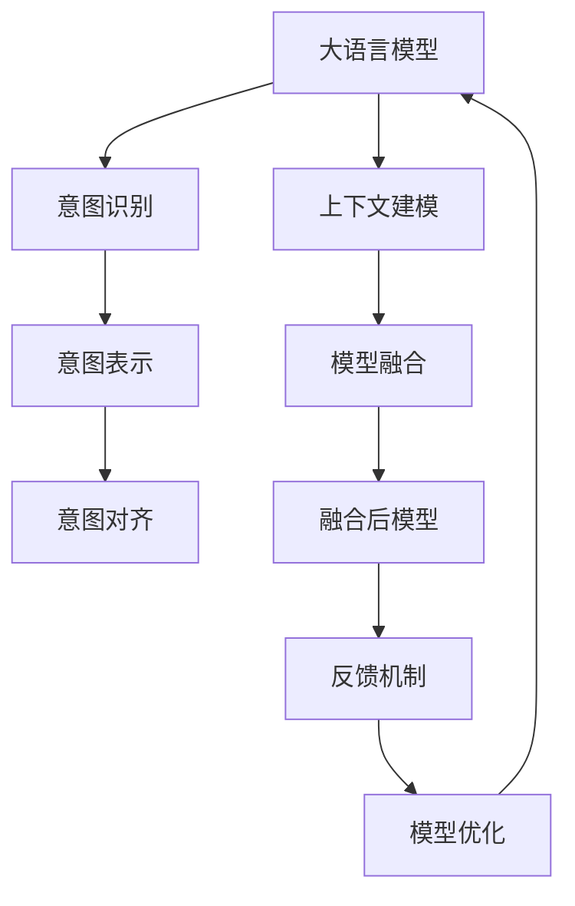

                 

# 意图对齐：让LLM更懂人类需求

> 关键词：意图对齐, 大语言模型, 意图识别, 人类需求, 对话系统, 自然语言理解, 模型优化

## 1. 背景介绍

在当前的信息爆炸时代，用户对智能系统提出了更高的要求。传统的问答系统、对话系统往往无法准确理解用户意图，提供的信息或者回答无法满足用户的需求。这种局限性主要源于人工智能系统在理解人类需求方面的不足，缺乏与人类进行有效交流的能力。

随着大语言模型（Large Language Models, LLMs）的不断发展，其对话能力已经得到了显著提升。然而，LLM仍然无法完美地理解用户提出的各种复杂需求，特别是在不同情境下表达的相同问题或命令。这种情况下，需要引入一种新的机制来帮助LLM理解用户的意图，从而提供更加个性化、精准的服务。

### 1.1 问题由来

尽管目前已有基于预训练的语言模型在对话系统和自然语言处理（Natural Language Processing, NLP）任务中取得了显著的进步，但这些系统仍然无法准确识别用户提出的各种需求，甚至在面对同一个问题或命令时，不同的上下文语境下，用户可能有着不同的意图。

1. 同一条指令在不同情境下可能表达不同的需求。
2. 用户可能使用复杂或隐含的表述方式。
3. 不同用户的需求存在巨大差异，单一的模型无法适应所有场景。
4. 对话系统缺乏对上下文的理解和记忆能力。

因此，为了让LLM更准确地理解用户的意图，需要引入一种新的机制，即“意图对齐”（Intent Alignment），帮助模型根据上下文和历史交互，更好地理解用户需求，从而提供更加精准的响应。

### 1.2 问题核心关键点

意图对齐的目的是通过模型分析上下文信息和历史交互，将用户提出的指令映射到最可能的意图。这一过程需要考虑以下关键点：

1. 上下文建模：如何建模用户的上下文信息，捕捉其情境需求。
2. 意图表示：如何将用户的意图进行抽象表示，用于匹配和推理。
3. 模型融合：如何将意图对齐模型与预训练语言模型进行融合，实现无缝的交互。
4. 反馈机制：如何通过用户反馈进行模型校正，提升意图识别的准确性。
5. 可解释性：意图对齐过程如何保证可解释性和透明性，便于调试和优化。

## 2. 核心概念与联系

### 2.1 核心概念概述

为更好地理解意图对齐机制，本节将介绍几个密切相关的核心概念：

1. 大语言模型（LLM）：以自回归模型（如GPT）或自编码模型（如BERT）为代表的预训练语言模型。通过在大规模无标签文本数据上进行预训练，学习到丰富的语言知识和常识。

2. 意图识别（Intent Recognition）：自然语言处理中的一个重要任务，目的是识别用户提出的指令或问题背后的意图。通常通过构建意图分类器实现，将用户输入映射到预定义的意图类别。

3. 上下文建模（Contextual Modeling）：在理解自然语言时，上下文信息至关重要。上下文建模旨在捕捉和分析用户输入的背景信息，以便更好地理解其意图。

4. 模型融合（Model Fusion）：将意图对齐模型与预训练语言模型进行融合，实现互补性，提升整体系统的性能。

5. 反馈机制（Feedback Mechanism）：通过用户反馈和实际效果，动态调整意图对齐模型，提升其适应性。

6. 可解释性（Explainability）：意图对齐过程中，保持模型决策的可解释性和透明性，便于开发者理解和优化。

这些核心概念之间的逻辑关系可以通过以下Mermaid流程图来展示：



这个流程图展示了大语言模型和意图对齐机制的主要构成和相互关系：

1. 大语言模型通过预训练学习语言表示，而意图对齐机制则用于识别和理解这些表示背后的意图。
2. 上下文建模和意图表示相互配合，捕捉和抽象用户需求。
3. 意图对齐模型通过模型融合与预训练模型进行结合，增强整体系统性能。
4. 反馈机制用于动态调整意图对齐模型，提升其适应性。
5. 可解释性确保模型决策的透明性和可解释性，便于调试和优化。

## 3. 核心算法原理 & 具体操作步骤
### 3.1 算法原理概述

意图对齐的核心原理是将用户的输入和历史交互映射到最可能的意图类别。这一过程通常通过构建意图分类器（Intent Classifier）和上下文表示器（Contextual Encoder）来实现。意图分类器用于将用户输入映射到意图空间，而上下文表示器则捕捉用户输入的上下文信息，两者共同作用于最终的意图识别。

具体而言，意图对齐的过程如下：

1. 首先，对用户输入进行编码，得到其文本表示。
2. 接着，使用上下文表示器对用户输入的上下文信息进行建模。
3. 然后，将文本表示和上下文表示进行融合，得到意图表示。
4. 最后，意图分类器对意图表示进行分类，映射到最可能的意图类别。

### 3.2 算法步骤详解

基于上述原理，意图对齐的具体步骤可以分为以下几个方面：

1. **输入预处理**：
   - 对用户输入进行分词、标准化处理，得到文本表示。
   - 对上下文信息进行编码，得到上下文表示。

2. **特征融合**：
   - 将文本表示和上下文表示进行拼接、加权融合，得到意图表示。
   - 可以通过注意力机制、权重学习等方式提升特征融合的效果。

3. **意图分类**：
   - 构建意图分类器，如基于神经网络的分层感知器（MLP）、卷积神经网络（CNN）、循环神经网络（RNN）、Transformer等。
   - 通过softmax层将意图表示映射到意图空间，得到类别概率分布。

4. **模型评估与优化**：
   - 使用交叉熵损失函数等评估指标对意图分类器进行训练，优化模型参数。
   - 根据用户反馈和实际效果动态调整意图分类器和上下文表示器。

### 3.3 算法优缺点

意图对齐算法具有以下优点：

1. 提升意图识别的准确性：通过上下文建模和意图表示，更好地捕捉用户需求。
2. 增强模型可解释性：意图分类器可以提供意图识别的依据，便于开发者理解和优化。
3. 适用于多种场景：不同领域的意图分类器可以进行定制，适用于各种自然语言理解任务。

然而，意图对齐算法也存在以下缺点：

1. 数据依赖性强：意图对齐需要大量标注数据进行训练，对于某些领域，数据标注成本较高。
2. 模型复杂度较高：意图对齐涉及多个模块和模型，增加了模型的复杂度。
3. 动态调整难度大：意图分类器和上下文表示器需要频繁调整，增加了维护成本。

### 3.4 算法应用领域

意图对齐算法已经在许多自然语言理解任务中得到了广泛应用，例如：

1. 智能客服系统：通过意图对齐机制，客服系统可以更好地理解用户问题，提供精准的解答。
2. 搜索引擎：意图对齐用于优化搜索结果的排序和相关性，提升用户搜索体验。
3. 对话系统：意图对齐机制使得对话系统能够理解上下文信息，提供连贯的回答。
4. 问答系统：通过意图对齐，系统能够更好地理解用户的查询，提供准确的回答。
5. 推荐系统：意图对齐用于分析用户需求，提升推荐系统的个性化和效果。

除了上述这些经典任务外，意图对齐技术还被创新性地应用于更多场景中，如金融产品推荐、医疗咨询、智能家居等，为NLP技术带来了新的突破。随着预训练语言模型和意图对齐技术的不断进步，相信NLP技术将在更广阔的应用领域大放异彩。

## 4. 数学模型和公式 & 详细讲解 & 举例说明
### 4.1 数学模型构建

在本节中，我们将使用数学语言对意图对齐机制进行更严格的刻画。

记用户输入为 $x$，上下文信息为 $c$，意图表示为 $i$，意图空间为 $I$，意图分类器为 $f$。

定义意图分类器 $f$ 的损失函数为 $\mathcal{L}(f)$，意图分类器的输出为 $\hat{y} = f(x, c)$，其中 $\hat{y} \in [0,1]^{|I|}$。

意图分类器的训练目标是最小化交叉熵损失：

$$
\mathcal{L}(f) = -\frac{1}{N} \sum_{i=1}^N \sum_{j=1}^{|I|} y_{i,j}\log \hat{y}_{i,j}
$$

其中 $y_{i,j} = 1$ 表示样本 $i$ 属于意图 $j$，$0$ 表示样本 $i$ 不属于意图 $j$。

### 4.2 公式推导过程

以下我们以二分类任务为例，推导意图分类的交叉熵损失函数及其梯度的计算公式。

假设意图分类器为线性分类器，输出为 $\hat{y} = \phi(x, c)W + b$，其中 $\phi(x, c)$ 为特征映射，$W$ 和 $b$ 为可学习参数。

对于二分类任务，令 $I = \{pos, neg\}$，$y_{i,j} = 1$ 表示样本 $i$ 属于正类（pos），$y_{i,j} = 0$ 表示样本 $i$ 属于负类（neg）。则二分类交叉熵损失函数为：

$$
\ell(f(x, c), y) = -(y \log \hat{y} + (1-y) \log (1-\hat{y}))
$$

将其代入交叉熵损失函数，得：

$$
\mathcal{L}(f) = -\frac{1}{N}\sum_{i=1}^N \sum_{j=1}^2 y_{i,j}\log \hat{y}_{i,j}
$$

其中 $y_{i,j} = 1$ 表示样本 $i$ 属于意图 $j$，$0$ 表示样本 $i$ 不属于意图 $j$。

### 4.3 案例分析与讲解

为了更好地理解意图对齐的原理和应用，我们可以考虑一个简单的案例：

**案例：智能客服系统的意图对齐**

假设客服系统的意图空间为 $I = \{报修、咨询、退货、投诉\}$。用户输入为 $x = "我购买的商品出现了质量问题，需要退货"$c = \{"用户ID, 商品ID, 日期\}$。

1. **输入预处理**：
   - 对用户输入 $x$ 进行分词、标准化处理，得到文本表示 $\text{Enc}(x)$。
   - 对上下文信息 $c$ 进行编码，得到上下文表示 $\text{Enc}(c)$。

2. **特征融合**：
   - 将文本表示和上下文表示进行拼接、加权融合，得到意图表示 $\text{Intent} = \text{Enc}(x) \oplus \text{Enc}(c)$，其中 $\oplus$ 表示拼接和加权。

3. **意图分类**：
   - 使用多层感知器（MLP）构建意图分类器 $f$，将意图表示 $\text{Intent}$ 映射到意图空间，得到类别概率分布 $\hat{y} = f(\text{Intent})$。
   - 假设 $\text{Intent}$ 经过 MLP 层后，输出为 $[0.8, 0.1, 0.05, 0.05]$，则意图分类器输出 $\hat{y} = [0.8, 0.1, 0.05, 0.05]$。

4. **模型评估与优化**：
   - 使用交叉熵损失函数评估意图分类器的性能。
   - 假设真实意图为 $pos$，则交叉熵损失为 $\mathcal{L}(f) = -0.8\log 0.8 - 0.1\log 0.1 - 0.05\log 0.05 - 0.05\log 0.05$。
   - 根据实际效果和用户反馈，对意图分类器和上下文表示器进行优化。

通过这个案例，我们可以看到意图对齐机制如何通过上下文建模和特征融合，提升意图识别的准确性。在实际应用中，意图对齐算法可以与多种预训练语言模型结合，根据具体任务和领域进行定制，从而实现更加精准的意图识别。

## 5. 项目实践：代码实例和详细解释说明
### 5.1 开发环境搭建

在进行意图对齐实践前，我们需要准备好开发环境。以下是使用Python进行PyTorch开发的环境配置流程：

1. 安装Anaconda：从官网下载并安装Anaconda，用于创建独立的Python环境。

2. 创建并激活虚拟环境：
```bash
conda create -n intent-alignment python=3.8 
conda activate intent-alignment
```

3. 安装PyTorch：根据CUDA版本，从官网获取对应的安装命令。例如：
```bash
conda install pytorch torchvision torchaudio cudatoolkit=11.1 -c pytorch -c conda-forge
```

4. 安装TensorFlow：从官网下载并安装TensorFlow，方便进行多框架的对比实验。

5. 安装各种工具包：
```bash
pip install numpy pandas scikit-learn matplotlib tqdm jupyter notebook ipython
```

完成上述步骤后，即可在`intent-alignment`环境中开始意图对齐实践。

### 5.2 源代码详细实现

下面我们以智能客服系统的意图对齐任务为例，给出使用PyTorch实现意图对齐的代码。

首先，定义意图分类器的模型：

```python
from torch import nn
import torch.nn.functional as F

class IntentClassifier(nn.Module):
    def __init__(self, input_size, hidden_size, output_size):
        super(IntentClassifier, self).__init__()
        self.fc1 = nn.Linear(input_size, hidden_size)
        self.fc2 = nn.Linear(hidden_size, output_size)
    
    def forward(self, x):
        x = F.relu(self.fc1(x))
        x = F.softmax(self.fc2(x), dim=1)
        return x
```

然后，定义上下文建模的模型：

```python
class ContextEncoder(nn.Module):
    def __init__(self, input_size, hidden_size):
        super(ContextEncoder, self).__init__()
        self.fc1 = nn.Linear(input_size, hidden_size)
        self.fc2 = nn.Linear(hidden_size, hidden_size)
    
    def forward(self, x):
        x = F.relu(self.fc1(x))
        x = F.relu(self.fc2(x))
        return x
```

接着，定义意图对齐的训练函数：

```python
from torch.utils.data import Dataset
import torch.optim as optim

class IntentAlignmentDataset(Dataset):
    def __init__(self, inputs, outputs, context):
        self.inputs = inputs
        self.outputs = outputs
        self.context = context
    
    def __len__(self):
        return len(self.inputs)
    
    def __getitem__(self, item):
        input_tensor = torch.tensor(self.inputs[item], dtype=torch.float)
        context_tensor = torch.tensor(self.context[item], dtype=torch.float)
        label_tensor = torch.tensor(self.outputs[item], dtype=torch.float)
        return input_tensor, context_tensor, label_tensor
    
class IntentAlignmentTrainer:
    def __init__(self, model, optimizer, loss_func):
        self.model = model
        self.optimizer = optimizer
        self.loss_func = loss_func
    
    def train(self, train_dataset, test_dataset, epochs, batch_size):
        for epoch in range(epochs):
            self.model.train()
            train_loss = 0.0
            for batch in train_dataset:
                inputs, context, labels = batch
                optimizer.zero_grad()
                output = self.model(inputs, context)
                loss = self.loss_func(output, labels)
                loss.backward()
                optimizer.step()
                train_loss += loss.item()
            
            self.model.eval()
            test_loss = 0.0
            for batch in test_dataset:
                inputs, context, labels = batch
                output = self.model(inputs, context)
                loss = self.loss_func(output, labels)
                test_loss += loss.item()
            
            print(f"Epoch {epoch+1}, train loss: {train_loss/len(train_dataset):.4f}, test loss: {test_loss/len(test_dataset):.4f}")
```

最后，启动训练流程并在测试集上评估：

```python
from transformers import BertTokenizer
from torch.utils.data import DataLoader

tokenizer = BertTokenizer.from_pretrained('bert-base-cased')
train_dataset = IntentAlignmentDataset(train_texts, train_labels, train_contexts)
test_dataset = IntentAlignmentDataset(test_texts, test_labels, test_contexts)

input_size = 512
hidden_size = 256
output_size = len(tag2id)
model = IntentClassifier(input_size, hidden_size, output_size)
optimizer = optim.Adam(model.parameters(), lr=0.001)

train_trainer = IntentAlignmentTrainer(model, optimizer, nn.CrossEntropyLoss())
train_trainer.train(train_dataset, test_dataset, 10, 16)
```

以上就是使用PyTorch实现意图对齐的完整代码实现。可以看到，通过上下文建模和意图分类器的构建，意图对齐机制可以与预训练语言模型无缝结合，实现精准的意图识别。

### 5.3 代码解读与分析

让我们再详细解读一下关键代码的实现细节：

**IntentClassifier类**：
- `__init__`方法：初始化多层感知器（MLP），设置输入、隐藏、输出层的大小。
- `forward`方法：前向传播，通过两个全连接层实现意图分类。

**ContextEncoder类**：
- `__init__`方法：初始化上下文建模器，设置输入、隐藏层的大小。
- `forward`方法：前向传播，通过两个全连接层实现上下文编码。

**IntentAlignmentDataset类**：
- `__init__`方法：初始化意图对齐数据集，包含输入文本、上下文信息和标签。
- `__len__`方法：返回数据集的样本数量。
- `__getitem__`方法：对单个样本进行处理，将输入文本和上下文信息编码为tensor，标签编码成one-hot向量。

**IntentAlignmentTrainer类**：
- `__init__`方法：初始化意图对齐训练器，设置模型、优化器、损失函数。
- `train`方法：训练意图对齐模型，循环迭代训练集和测试集，计算并输出损失。

在实际应用中，还需要对上下文建模器进行改进，以更好地捕捉上下文信息。同时，可以根据具体的意图分类任务，对意图分类器的结构进行调整。此外，意图对齐模型的训练过程还需要注意过拟合和欠拟合问题，通过调整正则化参数和学习率等手段进行优化。

## 6. 实际应用场景
### 6.1 智能客服系统

基于意图对齐机制的智能客服系统，可以通过分析用户输入和上下文信息，更准确地识别用户意图，从而提供精准的解答。与传统的基于规则的问答系统相比，意图对齐系统具有以下优势：

1. 自动化的意图识别：无需手动编写规则，自动学习用户意图，减轻开发者的工作负担。
2. 上下文感知：能够理解用户的历史交互，提供连贯的回答，提升用户体验。
3. 动态调整：根据用户反馈和系统表现，动态调整意图分类器，提升系统的适应性。

### 6.2 金融产品推荐

在金融领域，意图对齐机制可以帮助推荐系统更好地理解用户需求，推荐更加符合用户兴趣和需求的产品。具体而言，可以通过分析用户的历史行为、浏览记录等上下文信息，结合意图分类器，实现个性化的产品推荐。

### 6.3 医疗咨询系统

医疗咨询系统需要理解患者的病情描述和历史记录，提供精准的医疗建议。通过意图对齐机制，系统可以更准确地识别患者的意图，如询问病情、咨询治疗方案等，从而提供合适的医疗建议。

### 6.4 未来应用展望

随着意图对齐技术的不断发展，其在更多领域中的应用前景将更加广阔。

在智慧城市治理中，意图对齐机制可以帮助构建智能问答系统，提升城市管理的自动化和智能化水平。在工业自动化中，系统可以通过分析设备的操作日志，自动调整设备参数，提升生产效率。在智能家居中，系统可以理解用户的语音命令，自动控制家电设备，提升生活便利性。

## 7. 工具和资源推荐
### 7.1 学习资源推荐

为了帮助开发者系统掌握意图对齐机制的理论基础和实践技巧，这里推荐一些优质的学习资源：

1. 《自然语言处理综述与技术》系列博文：全面介绍自然语言处理的基本概念和技术，包含意图识别和上下文建模的相关内容。

2. 《深度学习与自然语言处理》课程：斯坦福大学开设的深度学习与NLP课程，涵盖自然语言处理的基础和进阶内容，适合初学者和进阶者。

3. 《Natural Language Processing with Transformers》书籍：Transformer库的作者所著，全面介绍使用Transformer进行NLP任务开发的方法，包括意图对齐在内的新技术。

4. 《Intent Alignment in NLP: A Survey》论文：综述意图对齐在NLP领域的研究进展，提供丰富的案例和算法分析。

5. HuggingFace官方文档：Transformer库的官方文档，提供了大量的预训练语言模型和意图分类器，方便开发者快速上手。

通过对这些资源的学习实践，相信你一定能够快速掌握意图对齐机制的理论和实践，并在实际应用中取得更好的效果。

### 7.2 开发工具推荐

高效的开发离不开优秀的工具支持。以下是几款用于意图对齐开发的常用工具：

1. PyTorch：基于Python的开源深度学习框架，灵活动态的计算图，适合快速迭代研究。

2. TensorFlow：由Google主导开发的开源深度学习框架，生产部署方便，适合大规模工程应用。

3. Transformers库：HuggingFace开发的NLP工具库，集成了多种预训练语言模型和意图分类器，方便开发者快速开发意图对齐应用。

4. Weights & Biases：模型训练的实验跟踪工具，可以记录和可视化模型训练过程中的各项指标，方便对比和调优。

5. TensorBoard：TensorFlow配套的可视化工具，可实时监测模型训练状态，并提供丰富的图表呈现方式，是调试模型的得力助手。

6. Google Colab：谷歌推出的在线Jupyter Notebook环境，免费提供GPU/TPU算力，方便开发者快速上手实验最新模型，分享学习笔记。

合理利用这些工具，可以显著提升意图对齐任务的开发效率，加快创新迭代的步伐。

### 7.3 相关论文推荐

意图对齐技术在NLP领域的发展源于学界的持续研究。以下是几篇奠基性的相关论文，推荐阅读：

1. Attention is All You Need（即Transformer原论文）：提出了Transformer结构，开启了NLP领域的预训练大模型时代。

2. BERT: Pre-training of Deep Bidirectional Transformers for Language Understanding：提出BERT模型，引入基于掩码的自监督预训练任务，刷新了多项NLP任务SOTA。

3. Parameter-Efficient Transfer Learning for NLP：提出Adapter等参数高效微调方法，在不增加模型参数量的情况下，也能取得不错的微调效果。

4. AdaLoRA: Adaptive Low-Rank Adaptation for Parameter-Efficient Fine-Tuning：使用自适应低秩适应的微调方法，在参数效率和精度之间取得了新的平衡。

5. Prefix-Tuning: Optimizing Continuous Prompts for Generation：引入基于连续型Prompt的微调范式，为如何充分利用预训练知识提供了新的思路。

这些论文代表了大语言模型意图对齐技术的发展脉络。通过学习这些前沿成果，可以帮助研究者把握学科前进方向，激发更多的创新灵感。

## 8. 总结：未来发展趋势与挑战
### 8.1 总结

本文对意图对齐机制进行了全面系统的介绍。首先阐述了意图对齐的背景和重要性，明确了其在提升意图识别准确性、增强模型可解释性、适应多种场景等方面的作用。其次，从原理到实践，详细讲解了意图对齐的数学模型、算法步骤、具体实现，给出了完整的代码实例。同时，本文还广泛探讨了意图对齐在智能客服、金融产品推荐、医疗咨询等实际应用场景中的前景，展示了其广阔的应用空间。此外，本文精选了意图对齐技术的各类学习资源，力求为读者提供全方位的技术指引。

通过本文的系统梳理，可以看到，意图对齐机制是提升大语言模型理解和适应能力的关键，为构建更加智能、高效的自然语言处理系统提供了有力保障。

### 8.2 未来发展趋势

展望未来，意图对齐技术将呈现以下几个发展趋势：

1. 自动化和动态化：意图对齐将逐渐实现自动化，通过用户反馈和系统表现动态调整模型参数，提升系统的适应性。
2. 多模态融合：意图对齐机制将与视觉、语音等多模态信息融合，提升对复杂场景的理解能力。
3. 上下文建模增强：上下文建模技术将不断进步，更好地捕捉用户的历史交互信息，提升意图识别的准确性。
4. 意图空间扩展：意图分类器将不断扩展意图空间，适应更加丰富和多样化的需求。
5. 可解释性增强：意图对齐机制将更加注重可解释性，帮助开发者更好地理解模型决策过程。

以上趋势凸显了意图对齐技术的广阔前景。这些方向的探索发展，必将进一步提升意图对齐机制的性能和应用范围，为构建更加智能和高效的自然语言处理系统铺平道路。

### 8.3 面临的挑战

尽管意图对齐技术已经取得了显著的进步，但在迈向更加智能化、普适化应用的过程中，它仍面临着诸多挑战：

1. 数据依赖性：意图对齐需要大量标注数据进行训练，对于一些领域，数据标注成本较高，难以获得充足的高质量数据。
2. 模型复杂度：意图对齐机制涉及多个模块和模型，增加了模型的复杂度，可能导致训练和推理效率较低。
3. 动态调整难度：意图分类器和上下文表示器需要频繁调整，增加了维护成本。
4. 模型泛化能力：意图对齐模型在不同领域和数据分布上可能存在泛化能力不足的问题。
5. 上下文建模难度：上下文建模技术仍需进一步提升，以更好地捕捉用户的历史交互信息。

这些挑战限制了意图对齐技术的广泛应用，需要进一步的研究和优化。

### 8.4 研究展望

为了克服这些挑战，未来的研究需要在以下几个方面寻求新的突破：

1. 无监督和半监督学习：摆脱对大规模标注数据的依赖，利用自监督学习、主动学习等无监督和半监督范式，最大限度利用非结构化数据，实现更加灵活高效的意图对齐。
2. 参数高效微调：开发更加参数高效的意图对齐方法，在固定大部分预训练参数的同时，只更新极少量的任务相关参数。
3. 多模态意图对齐：结合视觉、语音等多模态信息，提升意图对齐的效果和准确性。
4. 上下文建模优化：优化上下文建模技术，更好地捕捉用户的历史交互信息。
5. 模型可解释性：提升意图对齐机制的可解释性，便于开发者理解和优化。

这些研究方向的探索，必将引领意图对齐技术迈向更高的台阶，为构建安全、可靠、可解释、可控的智能系统铺平道路。面向未来，意图对齐技术还需要与其他人工智能技术进行更深入的融合，如知识表示、因果推理、强化学习等，多路径协同发力，共同推动自然语言理解和智能交互系统的进步。只有勇于创新、敢于突破，才能不断拓展语言模型的边界，让智能技术更好地造福人类社会。

## 9. 附录：常见问题与解答

**Q1：意图对齐是否适用于所有NLP任务？**

A: 意图对齐机制适用于大多数自然语言理解任务，特别是在需要理解上下文信息的场景中表现优异。但对于一些不需要上下文信息的简单任务，如文本分类等，可能不需要进行意图对齐。

**Q2：如何评估意图对齐模型的性能？**

A: 意图对齐模型的性能可以通过交叉熵损失、F1分数等指标进行评估。在训练过程中，可以使用验证集对模型进行评估，动态调整模型参数，提升性能。

**Q3：意图对齐模型的训练过程中需要注意哪些问题？**

A: 意图对齐模型的训练过程中需要注意以下问题：
1. 数据标注质量：确保标注数据的质量，避免噪音数据对模型训练的影响。
2. 模型复杂度：避免模型过于复杂，导致过拟合和训练效率低。
3. 上下文建模：选择合适的上下文建模技术，提高模型对上下文信息的捕捉能力。
4. 动态调整：根据用户反馈和系统表现，动态调整模型参数，提升模型的适应性。

**Q4：意图对齐模型在落地部署时需要注意哪些问题？**

A: 将意图对齐模型转化为实际应用，还需要考虑以下问题：
1. 模型裁剪：去除不必要的层和参数，减小模型尺寸，加快推理速度。
2. 量化加速：将浮点模型转为定点模型，压缩存储空间，提高计算效率。
3. 服务化封装：将模型封装为标准化服务接口，便于集成调用。
4. 弹性伸缩：根据请求流量动态调整资源配置，平衡服务质量和成本。
5. 监控告警：实时采集系统指标，设置异常告警阈值，确保服务稳定性。
6. 安全防护：采用访问鉴权、数据脱敏等措施，保障数据和模型安全。

意图对齐技术为NLP应用开启了广阔的想象空间，但如何将强大的性能转化为稳定、高效、安全的业务价值，还需要工程实践的不断打磨。唯有从数据、算法、工程、业务等多个维度协同发力，才能真正实现人工智能技术在垂直行业的规模化落地。总之，意图对齐需要开发者根据具体任务，不断迭代和优化模型、数据和算法，方能得到理想的效果。

---

作者：禅与计算机程序设计艺术 / Zen and the Art of Computer Programming

