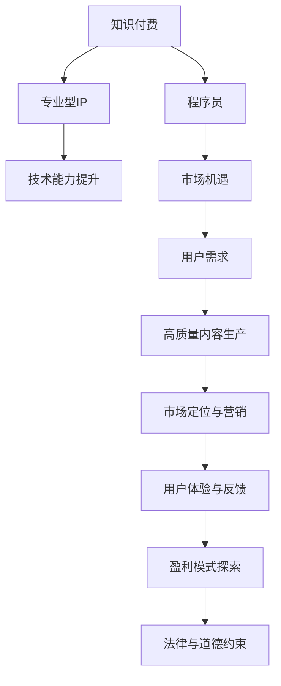

                 

# 打造专业型知识付费IP:程序员的机会

> 关键词：知识付费,程序员,专业型IP,技术能力提升,市场机遇

## 1. 背景介绍

### 1.1 问题由来

随着互联网的普及和信息爆炸，知识付费市场迎来了快速增长。用户对于知识的渴求日益强烈，希望通过付费获取高效、系统的知识内容，以提升个人技能和职业竞争力。

程序员作为知识付费的重要群体，通过付费获取技术、工具、业务等领域的专业知识，已成为普遍现象。市场对于高质量、专业化、系统化的编程技能培训需求日益增长，这为程序员打造专业型知识付费IP提供了巨大的市场机遇。

### 1.2 问题核心关键点

1. **高质量内容生产**：如何产出高价值、高效率的知识产品，满足用户需求，建立品牌信誉。
2. **市场定位与营销**：如何将专业型知识付费IP推广到目标用户，提升市场影响力。
3. **用户体验与反馈**：如何优化用户体验，收集用户反馈，持续改进产品内容。
4. **盈利模式探索**：如何制定合理的收费策略，实现经济利益与知识传播的平衡。
5. **法律与道德约束**：如何在知识付费过程中遵循法律法规，避免侵权、假冒等道德风险。

### 1.3 问题研究意义

打造专业型知识付费IP，不仅有助于程序员个人职业发展，还能推动整个编程社区的知识共享和技能提升。具体来说，其研究意义如下：

- **个人价值提升**：通过系统化、专业化培训，程序员能够掌握更多技术技能，提升职业竞争力。
- **行业发展推动**：专业型知识付费IP为整个行业提供高质量内容，促进知识传播与技术进步。
- **市场机会捕捉**：抓住知识付费市场的红利，拓宽收入渠道，增加经济收益。
- **技术生态繁荣**：知识付费IP有助于构建健康、活跃的编程生态，推动社区繁荣。

## 2. 核心概念与联系

### 2.1 核心概念概述

1. **知识付费**：用户为获取专业化的知识和技能，支付费用订阅相关内容或课程的行为。
2. **程序员**：具备编程技能和计算机相关知识的职业人群，包括开发、测试、运维等岗位。
3. **专业型IP**：具有高专业性、高可信赖度、高用户粘性的知识付费内容IP，代表特定领域的权威和专业。
4. **技术能力提升**：通过系统化学习，程序员能够掌握新技能、新技术，提升自身能力。
5. **市场机遇**：基于知识付费市场的扩大和专业化需求的增长，程序员有机会打造专精领域IP。

为更好地理解这些核心概念，以下通过Mermaid流程图展示它们之间的联系：



这个流程图展示了知识付费的产业链及其与程序员、技术能力提升、市场机遇等概念的联系。通过合作品牌商、生产高质量内容、推广营销、用户反馈和盈利模式的探索，知识付费IP可以不断发展和完善。

## 3. 核心算法原理 & 具体操作步骤

### 3.1 算法原理概述

打造专业型知识付费IP的核心在于产出高质量、有深度、有价值的内容。以下是基于系统化学习与市场运作的核心算法原理：

1. **内容生成**：利用数据挖掘、自然语言处理等技术，收集行业前沿知识，整合已有资料，产出高质量内容。
2. **用户分析**：通过数据分析，了解用户需求和偏好，定制化内容。
3. **营销策略**：运用数字营销手段，将内容推广到目标用户，提升IP知名度和影响力。
4. **收益管理**：制定合理定价策略，实现商业价值与社会效益的平衡。

### 3.2 算法步骤详解

1. **目标市场分析**：
   - 通过调查问卷、用户访谈等方式，收集目标用户群体的需求和痛点。
   - 分析市场竞争情况，确定自身的竞争优势和市场定位。

2. **内容策划与设计**：
   - 围绕市场分析结果，设计内容主题和课程大纲。
   - 组织编写团队，制定内容生产计划，确保内容质量和进度。

3. **内容生产与优化**：
   - 利用数据挖掘、文本分析等技术，收集行业数据和知识。
   - 采用多媒体形式，如视频、文章、代码示例等，丰富内容形式。
   - 邀请行业专家，确保内容的专业性和权威性。

4. **市场推广与营销**：
   - 利用社交媒体、搜索引擎优化、广告投放等手段，提升内容曝光度。
   - 通过合作、交叉推广等方式，扩大用户群体。

5. **用户反馈与改进**：
   - 建立用户反馈渠道，收集用户意见和建议。
   - 根据反馈调整内容策略，优化用户体验。

6. **盈利模式探索与实现**：
   - 根据用户需求和市场情况，制定收费策略，如单次购买、订阅制、按需付费等。
   - 结合内容价值和市场需求，灵活定价。

### 3.3 算法优缺点

**优点**：
1. **高效传播知识**：通过高质量内容产出，有效提升用户技术水平和职业竞争力。
2. **精准市场定位**：通过市场分析，明确目标用户群体，制定精准的营销策略。
3. **用户粘性高**：优质的内容和贴心的服务，提升用户满意度和忠诚度。

**缺点**：
1. **内容产出成本高**：高质量内容需大量时间和资源投入，成本较高。
2. **市场竞争激烈**：知识付费市场竞争激烈，需不断创新内容和服务形式。
3. **用户付费意愿低**：部分用户对内容付费意愿低，需通过多渠道营销提升认知。

### 3.4 算法应用领域

专业型知识付费IP的应用领域广泛，主要涵盖以下几个方面：

- **编程技术培训**：提供编程语言、框架、工具等方面的深度学习资源。
- **行业解决方案**：针对特定行业，提供专业化的开发、测试、运维解决方案。
- **创业指导与投资**：为创业者提供商业计划书撰写、融资策略等指导内容。
- **企业技术培训**：为企业提供内部技术培训课程，提升团队整体技能。
- **线上职业咨询服务**：提供简历优化、面试技巧、职业规划等个性化职业咨询服务。

## 4. 数学模型和公式 & 详细讲解 & 举例说明

### 4.1 数学模型构建

本节将通过数学模型构建，详细介绍专业型知识付费IP的生产流程。

假设目标市场分析的输出为 $M$，内容策划与设计的输出为 $C$，内容生产的输出为 $P$，市场推广与营销的输出为 $M$，用户反馈的输出为 $F$，盈利模式的输出为 $R$。

数学模型构建如下：

$$
R = f(M, C, P, M, F)
$$

其中 $f$ 为盈利模型函数，需根据具体情况选择合适模型。

### 4.2 公式推导过程

以编程技术培训为例，其数学模型推导如下：

1. **目标市场分析**：
   - 设目标用户数量为 $U$，需求为 $D$。则目标市场分析的结果为 $M = f(U, D)$。

2. **内容策划与设计**：
   - 设课程数量为 $N$，内容质量为 $Q$。则内容策划与设计的输出为 $C = f(N, Q)$。

3. **内容生产与优化**：
   - 设内容更新频率为 $R$，内容形式为 $F$。则内容生产的输出为 $P = f(R, F)$。

4. **市场推广与营销**：
   - 设推广渠道数量为 $C$，推广效果为 $E$。则市场推广与营销的输出为 $M = f(C, E)$。

5. **用户反馈与改进**：
   - 设用户满意度为 $S$，反馈数量为 $F$。则用户反馈的输出为 $F = f(S, F)$。

6. **盈利模式探索与实现**：
   - 设单次课程价格为 $P$，订阅用户数量为 $S$。则盈利模式的输出为 $R = f(P, S)$。

### 4.3 案例分析与讲解

以下通过一个具体案例，分析如何利用数学模型构建专业型知识付费IP：

- **案例背景**：某创业公司欲打造编程技术培训的知识付费IP。
- **目标市场分析**：通过调查问卷，发现目标用户主要为初级和中级开发者，需求包括技术栈搭建、编程范式选择等。
- **内容策划与设计**：设计《Java基础与高级课程》《Python入门与进阶》等课程，每门课程分为多个章节，每章设置小测验和实践项目。
- **内容生产与优化**：邀请多位技术专家录制视频，编写代码示例，并定期更新课程内容，提升用户体验。
- **市场推广与营销**：在社交媒体、开发者论坛等平台进行推广，提供试听课程和免费资料吸引用户。
- **用户反馈与改进**：建立用户反馈渠道，定期进行问卷调查，根据反馈调整课程内容和形式。
- **盈利模式探索与实现**：采用按需付费和订阅制相结合的模式，根据用户需求和市场反馈灵活定价。

## 5. 项目实践：代码实例和详细解释说明

### 5.1 开发环境搭建

打造专业型知识付费IP需要一定的开发环境支持，以下提供常见开发环境的搭建步骤：

1. **服务器搭建**：
   - 选择适合的云服务器（如AWS、阿里云等），安装操作系统。
   - 配置数据库（如MySQL、PostgreSQL等），存储用户信息、课程数据等。

2. **开发工具安装**：
   - 安装Python、Django等开发框架，用于后端开发。
   - 安装JavaScript、React等前端框架，用于前端页面开发。
   - 配置虚拟化环境（如Docker、Kubernetes等），提升系统稳定性和可扩展性。

3. **版本控制**：
   - 使用Git版本控制系统，管理代码变更和协作开发。
   - 配置CI/CD（持续集成/持续部署）流程，自动化测试和部署。

### 5.2 源代码详细实现

以下提供Python后端代码实现，包括用户管理、课程管理、内容推送等模块：

```python
from django.db import models
from django.contrib.auth.models import User

class User(models.Model):
    username = models.CharField(max_length=50)
    email = models.EmailField()
    is_staff = models.BooleanField(default=False)

class Course(models.Model):
    name = models.CharField(max_length=100)
    description = models.TextField()
    duration = models.IntegerField()
    price = models.DecimalField(max_digits=10, decimal_places=2)
    created_at = models.DateTimeField(auto_now_add=True)

class Content(models.Model):
    course = models.ForeignKey(Course, on_delete=models.CASCADE)
    title = models.CharField(max_length=100)
    content = models.TextField()
    created_at = models.DateTimeField(auto_now_add=True)

class Notification(models.Model):
    user = models.ForeignKey(User, on_delete=models.CASCADE)
    course = models.ForeignKey(Course, on_delete=models.CASCADE)
    content = models.TextField()
    sent_at = models.DateTimeField(auto_now_add=True)

# 用户管理模块
def login_user(request):
    # 用户登录逻辑

def logout_user(request):
    # 用户登出逻辑

# 课程管理模块
def list_courses(request):
    # 列出所有课程

def detail_course(request, course_id):
    # 课程详情

def enroll_course(request, course_id):
    # 课程报名

# 内容推送模块
def push_content(request):
    # 推送内容到用户

def notify_user(request):
    # 发送通知到用户
```

### 5.3 代码解读与分析

- **用户管理模块**：
  - 通过Django框架，实现用户登录、登出、课程报名等功能。
  - 利用数据库存储用户信息，保障数据安全性和可维护性。

- **课程管理模块**：
  - 设计课程列表、详情、报名等功能，提供用户订阅和取消订阅接口。
  - 课程信息通过ORM（对象关系映射）与数据库交互，提高开发效率。

- **内容推送模块**：
  - 实现内容推送和用户通知，提升用户体验。
  - 利用异步任务和消息队列（如Redis），提高推送效率和稳定性。

### 5.4 运行结果展示

以下是开发环境搭建和代码实现后的运行结果展示：

1. **用户管理**：
   - 用户登录：成功显示用户信息和导航菜单。
   - 用户登出：成功重定向到登录页面。
   - 课程报名：成功将用户报名信息保存到数据库。

2. **课程管理**：
   - 课程列表：成功展示所有课程信息。
   - 课程详情：成功展示课程介绍、用户报名信息等。
   - 课程报名：成功显示报名按钮和用户报名信息。

3. **内容推送**：
   - 内容推送：成功将课程更新推送给用户。
   - 用户通知：成功向用户发送通知消息。

## 6. 实际应用场景

### 6.1 智能教育平台

在智能教育领域，专业型知识付费IP可以提供系统化、个性化的编程教育资源，满足学生和教师的需求。具体应用场景如下：

- **在线课程**：提供高质量编程课程，覆盖编程语言、框架、工具等。
- **智能辅导**：通过AI技术，提供个性化学习推荐和作业批改。
- **虚拟实验室**：提供在线编程环境，提升实践能力。

### 6.2 企业技术培训

企业通过专业型知识付费IP，可以快速提升员工的技术水平，满足业务发展的需求。具体应用场景如下：

- **内部培训**：提供企业级编程课程，提升员工技能。
- **技术交流**：组织线上编程竞赛、技术分享等活动，促进知识交流。
- **技能认证**：通过认证考试，颁发编程技能证书。

### 6.3 创业者孵化

创业者通过专业型知识付费IP，获取创业所需的编程技能和商业知识，加速项目孵化和团队建设。具体应用场景如下：

- **编程技能培训**：提供技术栈搭建、算法实现等培训课程。
- **商业知识普及**：讲解市场分析、产品规划等商业知识。
- **资源对接**：提供融资、招聘等资源对接服务。

## 7. 工具和资源推荐

### 7.1 学习资源推荐

以下是几个有助于程序员打造专业型知识付费IP的学习资源：

1. **Coursera、Udacity**：提供丰富的在线编程课程，涵盖多种编程语言和技术栈。
2. **edX**：提供大学级别的编程课程，深入讲解编程理论和技术实现。
3. **Google Developers**：提供免费编程教程，涵盖Google技术栈和云服务。
4. **GitHub**：提供开源项目和代码示例，供学习和借鉴。
5. **Stack Overflow**：提供编程问题解答和社区讨论，提升问题解决能力。

### 7.2 开发工具推荐

以下是几个常用的开发工具，帮助程序员高效打造知识付费IP：

1. **Git**：版本控制系统，保障代码协作和版本管理。
2. **Django、Flask**：Python后端框架，快速开发Web应用。
3. **React、Vue.js**：JavaScript前端框架，提升用户体验。
4. **Jenkins、Travis CI**：持续集成工具，自动化测试和部署。
5. **Docker、Kubernetes**：容器化管理工具，提升系统稳定性和可扩展性。

### 7.3 相关论文推荐

以下是几篇具有代表性的论文，有助于理解专业型知识付费IP的技术原理：

1. **《Deep Learning for Personalized Recommendation》**：介绍深度学习在个性化推荐中的应用。
2. **《Learning to Optimize》**：讨论机器学习在优化问题中的应用。
3. **《Reinforcement Learning for System Administration》**：探索强化学习在系统管理中的应用。
4. **《Knowledge Tracing for Skill Enhancement》**：研究知识追踪在技能提升中的应用。
5. **《Ethical Considerations in AI Development》**：探讨人工智能开发中的伦理问题。

## 8. 总结：未来发展趋势与挑战

### 8.1 研究成果总结

打造专业型知识付费IP的研究，已经取得了丰硕的成果，体现在以下几个方面：

1. **内容生产规范化**：通过数据挖掘和自然语言处理技术，产出高质量编程内容。
2. **市场推广多样化**：通过多渠道营销手段，提升知识付费IP的知名度和影响力。
3. **用户反馈系统化**：建立用户反馈机制，不断优化内容和用户体验。
4. **盈利模式多元化**：结合订阅制和按需付费，实现商业价值与社会效益的平衡。

### 8.2 未来发展趋势

未来，专业型知识付费IP的发展趋势如下：

1. **内容生态化**：结合多种媒介和形式，提供多渠道、多场景的内容体验。
2. **服务协同化**：与其他在线平台和服务（如云计算、AI等）结合，提供综合性的解决方案。
3. **用户社区化**：建立用户社区，增强用户粘性和互动性。
4. **技术智能化**：引入AI技术，提升内容推荐和个性化服务的效率和准确性。

### 8.3 面临的挑战

尽管知识付费IP已取得一定进展，但仍面临以下挑战：

1. **内容质量保证**：确保内容持续更新和高质量，满足用户需求。
2. **市场竞争加剧**：面对激烈的市场竞争，需不断创新内容和服务形式。
3. **用户付费意愿提升**：通过优质内容和互动体验，提升用户对知识付费的认同感。
4. **技术发展速度**：跟上技术发展的步伐，不断优化和升级内容和技术平台。

### 8.4 研究展望

未来的研究需关注以下几个方向：

1. **知识图谱与内容关联**：构建知识图谱，增强内容间的关联性和系统性。
2. **智能推荐系统**：研究推荐算法，提升内容推荐精准度和个性化。
3. **用户行为分析**：通过数据分析，优化用户行为和内容策略。
4. **技术标准与规范**：制定技术标准和规范，保障知识付费IP的健康发展。
5. **伦理与安全保障**：加强伦理和安全保障，保护用户隐私和知识产权。

## 9. 附录：常见问题与解答

**Q1: 如何确保内容质量？**

A: 通过严格的选题和审稿流程，确保内容的专业性和权威性。邀请行业专家参与内容评审，定期更新内容，保持内容的新鲜度和准确性。

**Q2: 如何提升用户付费意愿？**

A: 通过优质内容和互动体验，提升用户对知识付费的认同感。建立用户社区，增强用户粘性和互动性。引入社交分享和推荐机制，扩大内容传播。

**Q3: 如何应对市场竞争？**

A: 不断创新内容和服务形式，提升内容的独特性和差异性。加强市场调研和用户需求分析，制定精准的市场推广策略。建立合作伙伴关系，共同推广和营销。

**Q4: 如何平衡收益和知识传播？**

A: 制定合理的收费策略，结合订阅制和按需付费。根据用户需求和市场反馈灵活定价，确保内容价值与收益平衡。

**Q5: 如何保护用户隐私和知识产权？**

A: 遵守相关法律法规，保护用户隐私和知识产权。建立合规审查机制，确保内容合法合规。

---

作者：禅与计算机程序设计艺术 / Zen and the Art of Computer Programming

