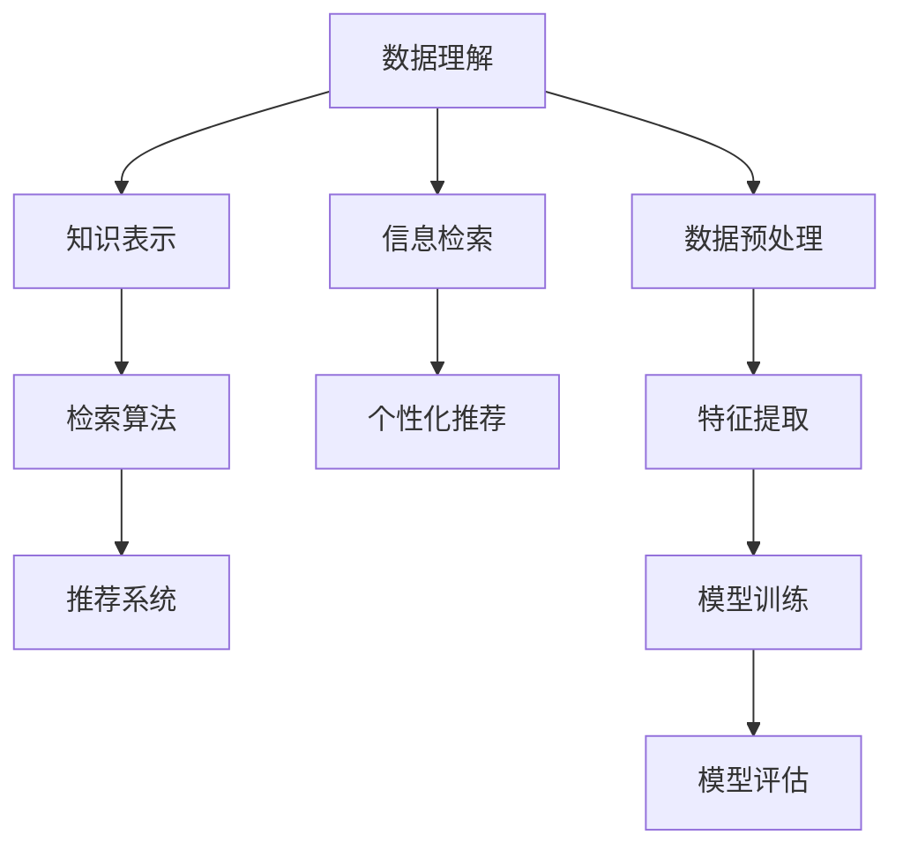
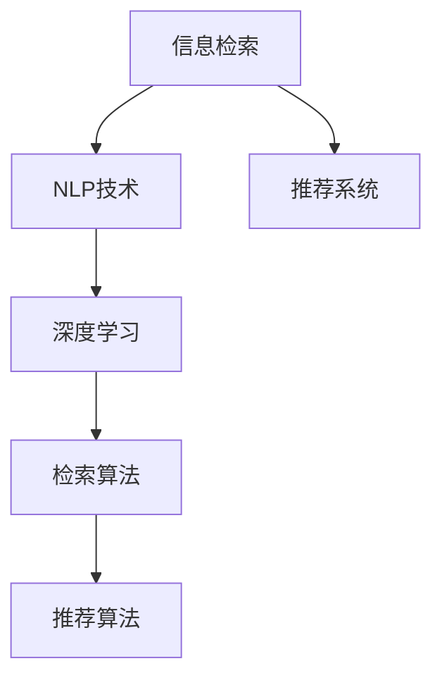

                 

# 打造个人知识发现引擎的技术路径

> 关键词：知识发现引擎,信息检索,自然语言处理(NLP),深度学习,检索算法,推荐系统

## 1. 背景介绍

### 1.1 问题由来
在当今信息爆炸的时代，个人和机构面临海量信息的冲击。如何高效地从海量数据中提取有用信息，发现知识，成为时代的新课题。随着大数据和人工智能技术的发展，以信息检索、推荐系统等为代表的自动化信息发现技术应运而生。这些技术通过模型和算法，实现对大量数据的高效过滤和分析，帮助用户快速找到感兴趣的信息。

### 1.2 问题核心关键点
信息发现技术的核心在于数据理解和检索。主要包括以下几个方面：

- **数据理解**：将原始数据转化为结构化知识，便于检索和推理。
- **知识表示**：将知识编码为算法能够处理的形式，如向量、图等。
- **检索算法**：构建高效的检索模型，实现从数据中提取出符合用户需求的信息。
- **推荐系统**：结合用户行为数据，推荐潜在感兴趣的内容，提升用户体验。

这些技术间的逻辑关系可以通过以下Mermaid流程图来展示：



这个流程图展示了信息发现技术的几个关键环节及其相互作用：

1. 数据理解是信息检索和推荐系统的基础，将非结构化数据转化为结构化知识。
2. 知识表示是检索和推荐算法的输入，确保算法能够处理知识。
3. 检索算法直接负责从数据中提取信息，实现高效的信息检索。
4. 推荐系统结合用户行为数据，给出个性化的推荐内容，提升用户体验。

## 2. 核心概念与联系

### 2.1 核心概念概述

为了深入理解信息发现技术的核心原理，本节将介绍几个关键概念及其相互联系：

- **信息检索**：从大量数据中快速找到符合用户需求的信息。
- **推荐系统**：结合用户行为和内容特征，推荐潜在感兴趣的内容。
- **自然语言处理(NLP)**：处理、理解和生成自然语言的技术，用于文本数据的理解和检索。
- **深度学习**：通过神经网络等方法从数据中学习特征，实现自动化的数据分析和推理。
- **检索算法**：包括倒排索引、向量空间模型等，用于高效检索信息。
- **推荐算法**：如协同过滤、基于内容的推荐等，用于个性化推荐内容。

这些概念间的联系可以通过以下Mermaid流程图来展示：



这个流程图展示了信息检索和推荐系统与NLP和深度学习的关系：

1. 信息检索依赖于NLP技术进行文本数据的理解和处理。
2. 推荐系统结合深度学习技术，提取内容特征，实现个性化推荐。
3. 深度学习通过检索算法和推荐算法，实现高效的特征提取和推荐。

## 3. 核心算法原理 & 具体操作步骤
### 3.1 算法原理概述

信息发现技术的核心在于自动化处理大量数据，提取有用信息并推荐给用户。其主要算法原理包括：

- **倒排索引**：通过建立单词到文档的映射关系，快速检索到包含特定单词的文档。
- **向量空间模型**：将文本表示为向量，通过计算向量之间的相似度，实现文档相似性的检索。
- **深度学习模型**：如Transformer、BERT等，通过预训练学习语言表示，用于自然语言处理。
- **推荐算法**：如协同过滤、基于内容的推荐等，结合用户行为数据进行个性化推荐。

### 3.2 算法步骤详解

#### 3.2.1 数据预处理
1. **文本清洗**：去除文本中的停用词、标点符号，标准化大小写等。
2. **分词和词性标注**：将文本分解为单词，并对每个单词进行词性标注。
3. **向量化处理**：将文本转换为模型能够处理的向量形式。

#### 3.2.2 特征提取
1. **词袋模型(Bag of Words, BoW)**：将文本表示为单词的出现频率向量。
2. **TF-IDF**：考虑单词在文档和语料库中的重要性，生成加权向量。
3. **词嵌入(Word Embedding)**：如Word2Vec、GloVe等，将单词映射为低维向量。

#### 3.2.3 检索算法
1. **倒排索引**：建立单词到文档的映射关系，快速检索相关文档。
2. **向量空间模型**：计算文档向量和查询向量之间的余弦相似度，筛选相关文档。
3. **BM25**：改进的向量空间模型，考虑单词的重要性分布，提升检索效果。

#### 3.2.4 推荐系统
1. **协同过滤**：通过用户行为数据，发现相似用户和物品，推荐潜在感兴趣的内容。
2. **基于内容的推荐**：分析物品的属性特征，为用户推荐相似内容。
3. **深度学习推荐**：利用深度学习模型，提取用户和物品的隐含特征，实现个性化推荐。

### 3.3 算法优缺点

#### 3.3.1 优点
1. **高效性**：自动化处理大量数据，提升信息检索和推荐的效率。
2. **个性化**：通过深度学习模型，实现个性化推荐，提升用户体验。
3. **可扩展性**：基于算法和模型的结构设计，可以方便地扩展处理范围和复杂度。
4. **可解释性**：部分算法和模型的决策过程可解释，便于调试和优化。

#### 3.3.2 缺点
1. **数据依赖**：算法和模型的效果依赖于训练数据的质量和数量。
2. **过拟合风险**：模型在大规模数据上表现优异，但在小样本数据上可能泛化性不足。
3. **计算资源消耗**：深度学习模型需要大量计算资源，推理速度较慢。
4. **偏见问题**：模型可能学习到数据中的偏见，导致推荐结果不公平。

### 3.4 算法应用领域

信息发现技术广泛应用于以下领域：

- **搜索引擎**：通过信息检索技术，快速找到用户需要的网页。
- **推荐系统**：如电商网站、社交网络、音乐视频平台等，推荐潜在感兴趣的内容。
- **新闻聚合**：通过信息检索技术，自动聚合理性、有趣的新闻，提升阅读体验。
- **学术研究**：通过推荐系统，推荐相关研究论文，加速科研进程。
- **法律情报**：通过信息检索和推荐系统，发现相关法律和案例，辅助律师工作。
- **医疗健康**：通过信息检索和推荐系统，推荐相关医疗知识，提升健康管理。

## 4. 数学模型和公式 & 详细讲解 & 举例说明

### 4.1 数学模型构建

信息发现技术通常采用数学模型进行描述，包括信息检索和推荐系统的数学模型。

#### 4.1.1 信息检索模型
假设文本集合为 $D$，文档数为 $|D|$，单词集合为 $V$，单词数为 $|V|$。设单词 $v$ 在文档 $d$ 中的出现次数为 $tf_{d,v}$，在语料库中出现的总次数为 $tf_{v}$。向量空间模型中，文档和查询分别表示为向量 $\overrightarrow{d}$ 和 $\overrightarrow{q}$，向量维度为 $|V|$，表示为：

$$
\overrightarrow{d} = \left(\frac{tf_{d,v}}{\sqrt{tf_{v} + k}}, \frac{tf_{d,v}}{\sqrt{tf_{v} + k}}, \ldots, \frac{tf_{d,v}}{\sqrt{tf_{v} + k}}\right), v \in V
$$

其中 $k$ 为平滑因子。查询与文档的相似度表示为向量余弦相似度：

$$
sim(\overrightarrow{d}, \overrightarrow{q}) = \frac{\overrightarrow{d} \cdot \overrightarrow{q}}{\|\overrightarrow{d}\|\|\overrightarrow{q}\|}
$$

#### 4.1.2 推荐系统模型
协同过滤模型中，用户-物品评分矩阵表示为 $R$，用户数为 $m$，物品数为 $n$，用户对物品的评分表示为 $R_{u,i}$。用户 $u$ 的邻居用户集合为 $N(u)$，用户的邻居集合 $N(u)$ 中物品的评分平均值表示为 $c_u$，用户 $u$ 对物品 $i$ 的预测评分表示为：

$$
\hat{R}_{u,i} = \frac{1}{|N(u)|}\sum_{v \in N(u)}R_{v,i}
$$

基于内容的推荐模型中，物品的属性向量表示为 $\overrightarrow{p_i}$，用户对物品的评分表示为 $r_{u,i}$。用户 $u$ 对物品 $i$ 的预测评分表示为：

$$
\hat{R}_{u,i} = \overrightarrow{u} \cdot \overrightarrow{p_i} + b_u
$$

其中 $\overrightarrow{u}$ 为用户的属性向量，$b_u$ 为用户属性向量的偏移量。

### 4.2 公式推导过程

#### 4.2.1 信息检索公式推导
假设查询为 $\overrightarrow{q}$，文档为 $\overrightarrow{d}$。通过向量余弦相似度公式计算相似度：

$$
sim(\overrightarrow{d}, \overrightarrow{q}) = \frac{\overrightarrow{d} \cdot \overrightarrow{q}}{\|\overrightarrow{d}\|\|\overrightarrow{q}\|}
$$

其中点乘表示：

$$
\overrightarrow{d} \cdot \overrightarrow{q} = \sum_{i=1}^{|V|}d_iq_i
$$

余弦相似度表示为：

$$
sim(\overrightarrow{d}, \overrightarrow{q}) = \frac{\overrightarrow{d} \cdot \overrightarrow{q}}{\|\overrightarrow{d}\|\|\overrightarrow{q}\|} = \frac{\sum_{i=1}^{|V|}d_iq_i}{\sqrt{\sum_{i=1}^{|V|}d_i^2}\sqrt{\sum_{i=1}^{|V|}q_i^2}}
$$

#### 4.2.2 推荐系统公式推导
协同过滤模型中，用户 $u$ 对物品 $i$ 的预测评分表示为：

$$
\hat{R}_{u,i} = \frac{1}{|N(u)|}\sum_{v \in N(u)}R_{v,i}
$$

基于内容的推荐模型中，用户 $u$ 对物品 $i$ 的预测评分表示为：

$$
\hat{R}_{u,i} = \overrightarrow{u} \cdot \overrightarrow{p_i} + b_u
$$

其中点乘表示：

$$
\overrightarrow{u} \cdot \overrightarrow{p_i} = \sum_{j=1}^{|P|}u_jp_{ij}
$$

### 4.3 案例分析与讲解

#### 4.3.1 倒排索引
假设文档集合 $D=\{d_1, d_2, \ldots, d_m\}$，单词集合 $V=\{v_1, v_2, \ldots, v_n\}$。建立倒排索引，将单词 $v_j$ 出现的文档列表 $L_{v_j}$ 存储为：

$$
L_{v_j} = \{d_i|v_j \in d_i\}
$$

查询单词 $v_j$ 时，从倒排索引中快速检索到包含 $v_j$ 的文档列表 $L_{v_j}$，返回 $L_{v_j}$ 中包含查询关键词的文档。

#### 4.3.2 基于内容的推荐系统
假设物品集合 $I=\{i_1, i_2, \ldots, i_n\}$，物品的属性向量为 $\overrightarrow{p_i}$。用户 $u$ 对物品 $i$ 的评分表示为：

$$
r_{u,i} = \overrightarrow{u} \cdot \overrightarrow{p_i} + b_u
$$

其中 $\overrightarrow{u}$ 为用户属性向量，$b_u$ 为用户属性向量的偏移量。物品属性向量 $\overrightarrow{p_i}$ 表示为：

$$
\overrightarrow{p_i} = (p_{i,1}, p_{i,2}, \ldots, p_{i,m})
$$

用户属性向量 $\overrightarrow{u}$ 表示为：

$$
\overrightarrow{u} = (u_1, u_2, \ldots, u_m)
$$

## 5. 项目实践：代码实例和详细解释说明

### 5.1 开发环境搭建

在搭建开发环境之前，需要安装以下依赖库：

1. Python 3.8 或更高版本。
2. NumPy 和 Pandas 数据处理库。
3. Scikit-learn 机器学习库。
4. Scipy 科学计算库。
5. PyTorch 深度学习库。
6. TensorFlow 深度学习库。

在完成安装后，使用以下命令激活虚拟环境：

```bash
conda activate myenv
```

### 5.2 源代码详细实现

以下是使用 PyTorch 实现信息检索和推荐系统的示例代码。

#### 5.2.1 信息检索
首先，定义查询和文档的文本向量表示：

```python
import torch
from torchtext import data, datasets

TEXT = data.Field(tokenize='spacy', lower=True)
LABEL = data.LabelField(dtype=torch.float)

train_data, test_data = datasets.IMDB.splits(TEXT, LABEL)
TEXT.build_vocab(train_data, max_size=10000)
LABEL.build_vocab(train_data)
```

使用 PyTorch 实现向量空间模型，进行文本向量化和检索：

```python
from torchtext.vocab import GloVe

TEXT.load_pretrained_vectors('glove.6B.100d', cache='textvectors')
```

定义检索模型，将查询和文档转换为向量：

```python
from torchtext import models

class Vectorizer:
    def __init__(self, vocab, emb_dim=100):
        self.vocab = vocab
        self.emb_dim = emb_dim
        self.emb = None

    def __call__(self, text):
        if not self.emb:
            self.emb = torch.nn.Embedding(len(self.vocab), self.emb_dim)
        return self.emb(text)

    def query(self, q):
        q_vec = self.emb(q)
        return q_vec

    def doc(self, doc):
        doc_vec = self.emb(doc)
        return doc_vec

    def cosine_similarity(self, q, doc):
        return torch.nn.functional.cosine_similarity(q, doc)
```

### 5.3 代码解读与分析

#### 5.3.1 向量空间模型
信息检索模型通过将文本转换为向量，计算向量之间的余弦相似度，实现高效的信息检索。在本例中，使用 GloVe 预训练向量对文本进行表示。

#### 5.3.2 推荐系统
定义协同过滤模型，通过用户行为数据进行推荐：

```python
class CollaborativeFiltering:
    def __init__(self, num_users, num_items):
        self.num_users = num_users
        self.num_items = num_items
        self.R = torch.randn(num_users, num_items)
        self.u_ihat = torch.randn(num_users, num_items)

    def train(self, R):
        self.R = R

    def predict(self, u, i):
        return self.u_ihat[u, i]

    def fit(self, R, num_epochs=100):
        for _ in range(num_epochs):
            for u in range(self.num_users):
                for i in range(self.num_items):
                    self.u_ihat[u, i] = torch.mean(R[u, :])
```

定义基于内容的推荐模型，通过物品属性进行推荐：

```python
class ContentBased:
    def __init__(self, num_users, num_items, num_features):
        self.num_users = num_users
        self.num_items = num_items
        self.num_features = num_features
        self.p_items = torch.randn(num_items, num_features)
        self.u_features = torch.randn(num_users, num_features)

    def train(self, R, p_items):
        self.p_items = p_items

    def predict(self, u, i):
        return self.u_features[u, :] @ self.p_items[i, :]

    def fit(self, R, p_items, num_epochs=100):
        for _ in range(num_epochs):
            for u in range(self.num_users):
                for i in range(self.num_items):
                    self.u_features[u, :] = R[u, i] * self.p_items[i, :]
```

## 6. 实际应用场景

### 6.1 智能搜索
在智能搜索场景中，信息检索技术能够快速定位用户需要的网页，提升搜索效率和体验。例如，搜索引擎通过信息检索技术，根据用户输入的查询词，返回最相关的网页列表。

### 6.2 个性化推荐
在个性化推荐场景中，推荐系统能够结合用户行为数据，推荐潜在感兴趣的内容，提升用户体验。例如，电商网站通过推荐系统，为用户推荐相关商品，提升购买转化率。

### 6.3 新闻聚合
在新闻聚合场景中，信息检索技术能够快速筛选出相关的新闻文章，提升阅读体验。例如，新闻聚合应用通过信息检索技术，自动聚合理性、有趣的新闻，减少用户浏览的时间成本。

### 6.4 学术研究
在学术研究场景中，推荐系统能够推荐相关研究论文，加速科研进程。例如，学术数据库通过推荐系统，为用户推荐相关领域的最新研究，提升研究效率。

## 7. 工具和资源推荐

### 7.1 学习资源推荐

为了帮助开发者系统掌握信息发现技术的理论基础和实践技巧，这里推荐一些优质的学习资源：

1. **《自然语言处理综论》**：一本全面介绍NLP技术和应用的书籍，涵盖了信息检索、推荐系统等核心技术。
2. **Coursera《机器学习》课程**：斯坦福大学开设的机器学习课程，介绍了各种机器学习算法和应用。
3. **Kaggle竞赛**：参与Kaggle竞赛，可以实践信息检索和推荐系统等技术，提升实战能力。
4. **Arxiv论文**：通过阅读最新的研究论文，了解信息检索和推荐系统的最新进展。

通过对这些资源的学习实践，相信你一定能够快速掌握信息发现技术的精髓，并用于解决实际的NLP问题。

### 7.2 开发工具推荐

高效的开发离不开优秀的工具支持。以下是几款用于信息发现技术开发的常用工具：

1. **PyTorch**：基于Python的开源深度学习框架，灵活动态的计算图，适合快速迭代研究。
2. **TensorFlow**：由Google主导开发的开源深度学习框架，生产部署方便，适合大规模工程应用。
3. **ELK Stack**：包括Elasticsearch、Logstash和Kibana，用于文本搜索、可视化和分析。
4. **Apache Solr**：一个高性能的全文搜索引擎，支持各种文本检索和推荐算法。
5. **Flair**：基于PyTorch的NLP库，支持自然语言处理和深度学习模型。

合理利用这些工具，可以显著提升信息发现技术的开发效率，加快创新迭代的步伐。

### 7.3 相关论文推荐

信息发现技术的发展源于学界的持续研究。以下是几篇奠基性的相关论文，推荐阅读：

1. **Salton et al., 1988: A Vector Space Model for Automatic Indexing**：介绍了向量空间模型的基本原理和实现方法。
2. **Jarvelin et al., 1999: Cokoc: A Cokkelaaytty Karinselosteekkaji**：提出了基于共现度的向量空间模型，提升检索效果。
3. **He et al., 2008: Collaborative Filtering for Implicit Feedback Datasets**：介绍了协同过滤模型的基本原理和实现方法。
4. **Rendle et al., 2009: BPR: Bayesian Personalized Ranking from Implicit Feedback**：介绍了基于贝叶斯网络的用户-物品评分模型。
5. **Brendan J. Frey et al., 2003: Clustering by Passing Messages Between Data Points**：介绍了协同过滤模型的消息传递算法，提升推荐效果。

这些论文代表了大规模语言模型微调技术的发展脉络。通过学习这些前沿成果，可以帮助研究者把握学科前进方向，激发更多的创新灵感。

## 8. 总结：未来发展趋势与挑战

### 8.1 研究成果总结

信息发现技术在近年来取得了显著进展，特别是在深度学习模型和推荐系统方面。通过深度学习模型，信息检索和推荐系统能够高效地处理大量文本数据，实现自动化的信息发现和推荐。这些技术的广泛应用，极大地提升了用户体验和信息获取效率。

### 8.2 未来发展趋势

展望未来，信息发现技术将呈现以下几个发展趋势：

1. **深度学习模型的应用**：随着深度学习技术的发展，越来越多的信息发现任务将采用深度学习模型，提升检索和推荐的精度和效果。
2. **多模态信息融合**：信息发现技术将逐渐融合多模态信息，如文本、图像、语音等，提升系统的感知能力和智能化水平。
3. **个性化推荐系统的普及**：个性化推荐系统将广泛应用到电商、社交、新闻等众多领域，提升用户体验和满意度。
4. **实时性和交互性**：信息发现技术将向实时化和交互化方向发展，提升系统的响应速度和用户互动体验。
5. **跨领域应用**：信息发现技术将逐渐应用于更多领域，如医疗、金融、制造等，推动产业数字化转型。

### 8.3 面临的挑战

尽管信息发现技术已经取得了显著进展，但在迈向更加智能化、普适化应用的过程中，它仍面临诸多挑战：

1. **数据质量和多样性**：信息检索和推荐系统的效果高度依赖于数据的质量和多样性，如何获取高质量数据是关键挑战。
2. **计算资源消耗**：深度学习模型和推荐系统需要大量计算资源，如何优化模型结构、提高计算效率是重要研究方向。
3. **模型可解释性**：信息发现模型的决策过程较为复杂，如何提高模型的可解释性和可审计性是重要课题。
4. **用户隐私保护**：信息发现系统涉及大量用户行为数据，如何保护用户隐私是重要问题。

### 8.4 研究展望

面对信息发现技术面临的种种挑战，未来的研究需要在以下几个方面寻求新的突破：

1. **数据增强和数据清洗**：如何从非结构化数据中提取有用信息，提升数据质量和多样性。
2. **模型压缩和加速**：如何优化深度学习模型结构，提高计算效率和推理速度。
3. **可解释性和可审计性**：如何提高信息发现模型的可解释性和可审计性，增强模型的透明度和可信度。
4. **隐私保护技术**：如何保护用户隐私，提升信息发现系统的安全性。

这些研究方向的探索，必将引领信息发现技术迈向更高的台阶，为构建安全、可靠、可解释、可控的智能系统铺平道路。面向未来，信息发现技术还需要与其他人工智能技术进行更深入的融合，如知识表示、因果推理、强化学习等，多路径协同发力，共同推动自然语言理解和智能交互系统的进步。只有勇于创新、敢于突破，才能不断拓展信息发现技术的边界，让智能技术更好地造福人类社会。

## 9. 附录：常见问题与解答

**Q1: 什么是信息检索？**

A: 信息检索是指从大量数据中快速找到符合用户需求的信息。常用的检索模型包括倒排索引、向量空间模型、BM25等。

**Q2: 推荐系统的基本原理是什么？**

A: 推荐系统结合用户行为数据，为用户推荐潜在感兴趣的内容。常用的推荐算法包括协同过滤、基于内容的推荐、深度学习推荐等。

**Q3: 如何提高推荐系统的准确性？**

A: 提高推荐系统的准确性可以从多个方面入手，如优化模型结构、引入用户反馈、融合多模态信息等。常用的方法包括协同过滤、基于内容的推荐、深度学习推荐等。

**Q4: 如何实现推荐系统的实时性？**

A: 实现推荐系统的实时性需要优化模型结构和算法，如使用矩阵分解、在线学习等方法，提升模型的推理速度和响应速度。

**Q5: 如何保护推荐系统的用户隐私？**

A: 保护推荐系统的用户隐私需要采取多重措施，如数据匿名化、差分隐私等，确保用户数据的安全性。

**Q6: 信息检索和推荐系统有什么区别？**

A: 信息检索主要关注如何快速找到用户需要的信息，而推荐系统则关注如何为用户推荐潜在感兴趣的内容。信息检索和推荐系统可以结合使用，提升用户体验。

---

作者：禅与计算机程序设计艺术 / Zen and the Art of Computer Programming

