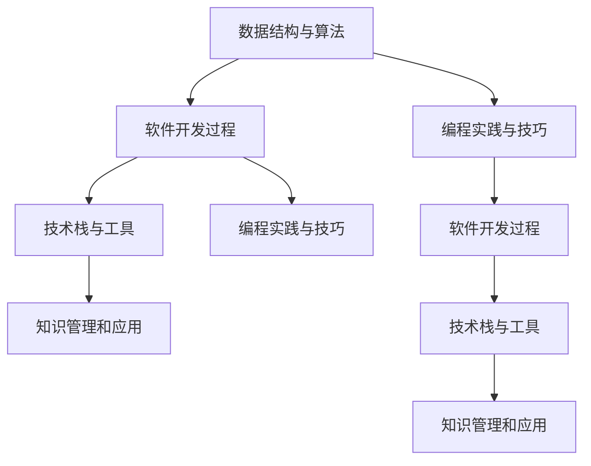

                 

# 打造个人知识库：程序员的核心竞争力

> 关键词：知识库构建,个人知识管理,数据结构与算法,软件开发过程,技术栈与工具,编程实践与技巧

## 1. 背景介绍

在当今信息技术日新月异的时代，技术更迭速度迅猛，对程序员的专业技能和知识储备提出了更高的要求。随着数据量、复杂度不断提升，如何系统化、高效化地组织和应用知识，成为了每位程序员必须面对的核心问题。个人知识库的构建，正是应对这一挑战的有效手段。

### 1.1 知识库构建的重要性
个人知识库不仅帮助程序员梳理、整理和扩展自身的知识体系，还能大大提升其工作效率和创新能力。具体而言，知识库可以：
- **整合知识点**：将零散的知识汇集成系统化、结构化的框架。
- **提升应用效率**：快速查找和应用已有知识，减少重复劳动。
- **推动持续学习**：定期回顾和更新知识库，不断提升个人技术水平。
- **促进知识共享**：作为团队协作的平台，促进经验传承和知识交流。

### 1.2 知识库构建面临的挑战
尽管知识库构建对个人发展有巨大益处，但在实际操作中仍面临一些挑战：
- **知识分散**：各种平台和工具上的知识碎片化，难以统一管理。
- **知识过载**：互联网上信息量爆炸，筛选出高质量知识不易。
- **更新困难**：知识和技能日新月异，需要持续跟进和更新。
- **知识应用**：如何将零散的知识点转化为实际能力，是知识库构建的难点。

## 2. 核心概念与联系

### 2.1 核心概念概述

构建个人知识库，需要理解以下核心概念：

- **数据结构与算法**：构建知识库的基础，帮助整理和组织知识点。
- **软件开发过程**：敏捷开发、持续集成、测试驱动开发等，提升知识应用效率。
- **技术栈与工具**：选择合适的编程语言、框架、IDE、版本控制工具等，确保知识库构建的流畅性。
- **编程实践与技巧**：编码规范、代码审查、代码重构等，提升代码质量和可维护性。
- **知识管理和应用**：整理知识点、设计知识库架构、应用知识等，确保知识库的有效性。

这些概念相互联系，共同构成了个人知识库的构建框架。

### 2.2 核心概念原理和架构的 Mermaid 流程图



这个流程图展示了数据结构与算法、软件开发过程、技术栈与工具、编程实践与技巧、知识管理和应用五个核心概念的相互关系。每个概念不仅与其他概念有联系，还通过不同的路径，影响着知识库的构建和使用。

## 3. 核心算法原理 & 具体操作步骤
### 3.1 算法原理概述

构建个人知识库的过程，可以类比为数据科学中的“数据清洗”和“知识工程”。

数据清洗：
- **数据采集**：从不同平台和工具中采集知识片段，包括代码、文档、教程、论文等。
- **数据清洗**：过滤掉无用或重复的数据，提取有效信息。
- **数据整合**：将清洗后的数据整合到一个统一的框架中。

知识工程：
- **知识表示**：选择合适的数据结构，如知识图谱、图数据库、关系型数据库等，表示和存储知识。
- **知识关联**：通过分类、标签、索引等手段，建立知识点之间的关联。
- **知识检索**：设计高效的查询和检索算法，快速定位和检索知识。

### 3.2 算法步骤详解

个人知识库的构建可以分为以下几个关键步骤：

**Step 1: 数据采集与预处理**
- **数据来源**：代码库（如GitHub）、技术博客、论坛社区、技术文档等。
- **数据提取**：使用爬虫或API等方式，批量抓取数据。
- **数据清洗**：过滤掉垃圾信息，如广告、无关链接等，提取有价值的知识片段。
- **数据标准化**：将采集到的知识片段进行统一格式处理，便于后续整合。

**Step 2: 知识表示与存储**
- **选择合适的数据结构**：根据知识类型选择合适的表示方式，如JSON、XML、RDF等。
- **建立知识图谱**：通过实体、关系、属性等，构建知识图谱，帮助理解知识之间的联系。
- **存储知识**：选择合适的数据库或知识库，如Neo4j、Elasticsearch等，存储知识图谱。

**Step 3: 知识关联与检索**
- **知识点分类与标签**：对知识进行分类和标签处理，便于检索和浏览。
- **知识关联设计**：通过链接、标签、分类等手段，建立知识点之间的关联。
- **知识检索系统**：设计高效的检索算法，如倒排索引、向量空间模型等，快速定位知识。

**Step 4: 知识应用与更新**
- **知识应用**：在实际开发过程中，利用知识库辅助代码编写、问题解决等。
- **持续更新**：定期回顾和更新知识库，添加新知识、修正错误信息等。
- **知识分享**：将知识库作为团队协作工具，促进知识共享和经验传承。

### 3.3 算法优缺点

构建个人知识库的方法，具有以下优点：
- **系统化管理**：将所有知识点系统化地组织起来，便于查找和应用。
- **提高效率**：通过快速检索和应用已有知识，大幅提升开发效率。
- **促进学习**：通过持续更新和回顾知识库，不断提升个人技术水平。
- **知识共享**：作为团队协作工具，促进经验传承和知识交流。

同时，这种方法也存在一些缺点：
- **初始投入大**：数据采集和预处理需要大量时间和精力。
- **依赖工具和平台**：需要选择合适的数据采集、存储和检索工具，增加了维护成本。
- **知识更新困难**：新知识不断涌现，需要定期更新和维护知识库。

### 3.4 算法应用领域

个人知识库的构建方法，适用于各种软件开发场景：
- **敏捷开发**：通过知识库辅助敏捷开发，提升团队协作效率。
- **持续集成**：知识库存储和检索开发过程中的代码片段、测试结果等，优化持续集成流程。
- **代码审查**：利用知识库中的最佳实践和代码规范，提升代码审查质量。
- **技术栈迁移**：通过知识库了解新技术栈的优缺点，规划技术栈迁移路径。
- **知识管理**：作为组织知识管理的平台，促进企业知识传承和创新。

## 4. 数学模型和公式 & 详细讲解 & 举例说明

### 4.1 数学模型构建

构建个人知识库的数学模型，可以视为一个有向图$G(V, E)$，其中$V$表示知识节点，$E$表示知识之间的关联关系。知识库的构建过程，可以抽象为从数据源中抽取节点和边，并构建出整个知识图谱的过程。

### 4.2 公式推导过程

假设知识库中的知识节点为$v_i$，节点之间的关联关系为$e_{ij}$。知识图谱构建过程可以表示为：

$$
\begin{aligned}
&\text{Node Generation} && v_i \leftarrow \text{Data Extraction}(\text{Data Source}) \\
&\text{Edge Generation} && e_{ij} \leftarrow \text{Edge Extraction}(v_i, v_j) \\
&\text{Graph Construction} && G(V, E) \leftarrow \text{Merge}(\{v_i\}, \{e_{ij}\})
\end{aligned}
$$

其中，Node Generation表示从数据源中抽取知识节点，Edge Generation表示抽取节点之间的关联关系，Graph Construction表示将抽取的节点和边合并成知识图谱。

### 4.3 案例分析与讲解

以构建一个面向Java开发的个人知识库为例：

**Step 1: 数据采集与预处理**
- **数据来源**：GitHub、Stack Overflow、Java开发博客等。
- **数据提取**：使用GitHub API和Web爬虫，抓取代码片段、文档、评论等。
- **数据清洗**：过滤掉无用的代码片段和重复信息，提取有价值的代码示例、API文档、技术文章等。
- **数据标准化**：将代码片段转换为统一格式，如Markdown或HTML。

**Step 2: 知识表示与存储**
- **知识分类**：将代码分为类、接口、方法、数据结构等类别。
- **知识标签**：为每个代码片段打上标签，如Java8、并发、性能优化等。
- **存储知识**：使用Elasticsearch构建索引，存储知识片段和标签。

**Step 3: 知识关联与检索**
- **知识点分类与标签**：对每个代码片段进行分类和标签处理，建立索引。
- **知识关联设计**：将同一类别的代码片段链接在一起，形成知识网络。
- **知识检索系统**：设计倒排索引算法，快速定位到包含特定API或技术问题的代码片段。

**Step 4: 知识应用与更新**
- **知识应用**：在编写代码时，使用知识库辅助查找已有代码片段、API文档等。
- **持续更新**：定期回顾和更新知识库，添加新代码片段、技术文章等。
- **知识分享**：将知识库作为团队协作工具，促进代码审查和知识共享。

## 5. 项目实践：代码实例和详细解释说明

### 5.1 开发环境搭建

以下是使用Python和Elasticsearch构建个人知识库的开发环境搭建流程：

1. **安装Python和Elasticsearch**：
```bash
conda install python=3.8
conda install elasticsearch=7.13.1
```

2. **安装必要的Python库**：
```bash
pip install requests beautifulsoup4 elasticsearch-dsl elasticsearch
```

3. **配置Elasticsearch**：
```bash
cd elasticsearch
./bin/elasticsearch
```

### 5.2 源代码详细实现

以下是使用Python和Elasticsearch构建Java开发知识库的代码实现：

**数据采集与预处理**

```python
import requests
from bs4 import BeautifulSoup
import elasticsearch

# 初始化Elasticsearch连接
es = elasticsearch.Elasticsearch()

# 数据采集函数
def fetch_data(url):
    response = requests.get(url)
    soup = BeautifulSoup(response.text, 'html.parser')
    # 提取代码片段
    code_blocks = soup.find_all('pre')
    for block in code_blocks:
        es.index(index='java_code', doc_type='doc', body={'code': block.text})
```

**知识表示与存储**

```python
# 查询知识库中的Java代码片段
res = es.search(index='java_code', body={'query': {'match': {'text': 'java 8'}}})
for hit in res['hits']['hits']:
    print(hit['_source']['code'])
```

**知识关联与检索**

```python
# 查询包含特定API的代码片段
res = es.search(index='java_code', body={'query': {'match': {'fields': ['code']}}})
for hit in res['hits']['hits']:
    print(hit['_source']['code'])
```

**知识应用与更新**

```python
# 更新知识库中的代码片段
doc = {'code': 'public void test() {...}\npublic static void main(String[] args) {...}\n'}
es.index(index='java_code', doc_type='doc', id='1', body=doc)
```

### 5.3 代码解读与分析

通过以上代码，我们可以清晰地看到构建个人知识库的流程：

1. **数据采集与预处理**：使用Python爬虫从GitHub、Stack Overflow等平台抓取代码片段，并进行标准化处理，存入Elasticsearch中。
2. **知识表示与存储**：通过Elasticsearch，为每个代码片段建立索引，实现高效存储和检索。
3. **知识关联与检索**：设计倒排索引算法，快速定位到包含特定API或技术问题的代码片段。
4. **知识应用与更新**：在编写代码时，使用Elasticsearch辅助查找已有代码片段，同时定期更新知识库。

## 6. 实际应用场景

个人知识库的构建方法，已在多种软件开发场景中得到广泛应用：

### 6.1 敏捷开发

在敏捷开发中，知识库作为团队协作平台，帮助团队成员快速定位和复用已有代码片段、技术文章等，提升开发效率和质量。团队可以在知识库中分享最佳实践和经验，促进知识传承和创新。

### 6.2 持续集成

知识库存储和检索开发过程中的代码片段、测试结果等，优化持续集成流程。团队可以预先将常用代码片段和测试脚本存储在知识库中，快速启动和集成，提升集成效率。

### 6.3 代码审查

利用知识库中的最佳实践和代码规范，提升代码审查质量。团队成员可以在知识库中查找已有代码片段和相关技术文章，辅助代码审查，避免重复劳动。

### 6.4 技术栈迁移

通过知识库了解新技术栈的优缺点，规划技术栈迁移路径。团队可以在知识库中查找新技术栈的相关文档和代码示例，评估其适用性，制定迁移计划。

### 6.5 知识管理

作为组织知识管理的平台，促进企业知识传承和创新。知识库存储和检索企业内部的技术文档、开发经验等，提升企业知识管理效率和效果。

## 7. 工具和资源推荐

### 7.1 学习资源推荐

为帮助开发者系统掌握构建个人知识库的方法，这里推荐一些优质的学习资源：

1. **《构建个人知识库》系列博文**：由知识管理专家撰写，介绍构建个人知识库的思路、工具和实践技巧。
2. **Coursera《数据科学与机器学习》课程**：涵盖数据采集、数据清洗、数据存储和数据检索等知识库构建的基础内容。
3. **《数据科学与深度学习》书籍**：详细讲解数据科学和深度学习的相关知识，帮助开发者理解数据管理和处理技术。
4. **Elasticsearch官方文档**：Elasticsearch的官方文档，提供详细的API和示例代码，帮助开发者快速上手构建知识库。
5. **Kibana官方文档**：Kibana的官方文档，提供数据可视化和查询工具的使用方法，帮助开发者分析和管理知识库数据。

通过对这些资源的学习实践，相信你一定能够快速掌握构建个人知识库的方法，并用于解决实际的开发问题。

### 7.2 开发工具推荐

高效的开发离不开优秀的工具支持。以下是几款用于构建个人知识库的常用工具：

1. **Python**：作为数据分析和处理的主要语言，Python拥有丰富的库和框架，如requests、beautifulsoup4、elasticsearch-dsl等，非常适合构建知识库。
2. **Elasticsearch**：高性能的分布式搜索引擎，支持大规模数据存储和高效检索，非常适合构建知识库。
3. **Kibana**：基于Elasticsearch的可视化工具，提供丰富的图表和仪表盘，帮助开发者分析和管理知识库数据。
4. **JIRA**：项目管理工具，支持任务分配、代码审查和知识共享等功能，非常适合团队协作。
5. **GitHub**：代码托管平台，支持版本控制和代码审查，非常适合代码片段的存储和共享。

合理利用这些工具，可以显著提升构建个人知识库的效率和效果。

### 7.3 相关论文推荐

构建个人知识库的研究，源于学界的持续研究。以下是几篇奠基性的相关论文，推荐阅读：

1. **《知识库构建：原理与实践》**：介绍知识库构建的基本概念和实践方法，适合初学者入门。
2. **《面向对象知识库构建》**：探讨面向对象技术在知识库构建中的应用，适合有一定基础的技术人员。
3. **《数据挖掘与知识发现》**：介绍数据挖掘和知识发现技术在知识库构建中的应用，适合高级技术人员的深入学习。
4. **《知识图谱构建与应用》**：详细讲解知识图谱的构建方法，适合对知识图谱感兴趣的技术人员。
5. **《人工智能与知识工程》**：探讨人工智能技术在知识库构建中的应用，适合对AI技术有兴趣的技术人员。

这些论文代表了大语言模型微调技术的发展脉络。通过学习这些前沿成果，可以帮助研究者把握学科前进方向，激发更多的创新灵感。

## 8. 总结：未来发展趋势与挑战

### 8.1 总结

本文对构建个人知识库的方法进行了全面系统的介绍。首先阐述了知识库构建的重要性，明确了知识库构建在软件开发中的关键作用。其次，从原理到实践，详细讲解了知识库构建的数学模型和具体操作步骤，给出了知识库构建的完整代码实例。同时，本文还广泛探讨了知识库在敏捷开发、持续集成、代码审查等多个场景中的应用前景，展示了知识库构建的巨大潜力。此外，本文精选了知识库构建的学习资源，力求为读者提供全方位的技术指引。

通过本文的系统梳理，可以看到，构建个人知识库的方法在软件开发中具有广泛的应用价值。知识库的构建不仅能够系统化地管理知识，还能大幅提升开发效率和学习效果。未来，随着大数据、人工智能等技术的发展，知识库构建将更加自动化和智能化，为软件开发带来更多便利。

### 8.2 未来发展趋势

展望未来，知识库构建将呈现以下几个发展趋势：

1. **自动化构建**：利用大数据和人工智能技术，自动化采集、清洗和构建知识库，降低人工干预成本。
2. **知识图谱与知识网络**：通过知识图谱技术，建立更复杂、更丰富的知识关联，提升知识检索的准确性。
3. **知识推荐系统**：利用推荐算法，为开发者推荐最相关的知识片段和技术文章，提升知识库的使用效果。
4. **跨平台协作**：通过知识库系统，实现跨平台、跨团队的知识共享和协作，提升团队工作效率。
5. **知识库标准化**：制定和推广知识库构建的标准和规范，提升知识库的可复用性和兼容性。

以上趋势凸显了知识库构建技术的发展方向。这些方向的探索发展，将进一步提升知识库的智能化水平，为软件开发带来更多便利。

### 8.3 面临的挑战

尽管知识库构建技术已经取得了一定进展，但在迈向更加智能化、普适化应用的过程中，它仍面临诸多挑战：

1. **数据质量问题**：数据采集和清洗过程中，可能会遇到数据不完整、数据噪音等问题，影响知识库的准确性。
2. **知识更新困难**：新知识不断涌现，知识库的更新和维护需要持续投入，增加了维护成本。
3. **知识库标准化**：不同团队、不同领域的知识库，可能存在格式、标准不一致的问题，影响知识库的可复用性和兼容性。
4. **知识库使用效果**：知识库的设计和构建，需要根据实际需求进行优化，否则可能难以发挥应有的作用。
5. **跨平台协作**：知识库系统需要在不同平台和工具之间实现无缝对接，增加了系统复杂度。

正视知识库构建面临的这些挑战，积极应对并寻求突破，将是大语言模型微调技术迈向成熟的必由之路。相信随着学界和产业界的共同努力，这些挑战终将一一被克服，知识库构建必将在构建人机协同的智能时代中扮演越来越重要的角色。

### 8.4 研究展望

面对知识库构建所面临的挑战，未来的研究需要在以下几个方面寻求新的突破：

1. **自动构建与维护**：开发自动化的知识库构建工具，利用机器学习算法，自动从海量数据中抽取和整理知识，降低人工干预成本。
2. **知识图谱融合**：将知识图谱技术与自然语言处理、机器学习等技术融合，构建更加复杂、多模态的知识库系统。
3. **知识推荐算法**：结合推荐系统技术，设计高效的推荐算法，提升知识库的使用效果。
4. **跨平台协作**：实现知识库系统在不同平台和工具之间的无缝对接，提升团队协作效率。
5. **知识库标准化**：制定和推广知识库构建的标准和规范，提升知识库的可复用性和兼容性。

这些研究方向将推动知识库构建技术的不断演进，为软件开发带来更多便利和创新。未来，知识库构建技术将更加自动化、智能化，成为软件开发中不可或缺的工具。

## 9. 附录：常见问题与解答

**Q1: 如何选择合适的数据源？**

A: 数据源的选择应根据实际需求，涵盖与开发相关的各类平台和工具。常见的数据源包括代码库（如GitHub）、技术博客、论坛社区、技术文档等。选择的关键在于数据源的可靠性、丰富度和更新频率。

**Q2: 如何进行数据清洗？**

A: 数据清洗的目的是过滤掉无用或重复的信息，提取有价值的知识片段。具体步骤包括：
1. 去除无关链接和广告信息。
2. 去除重复信息，保留唯一性。
3. 提取有价值的代码片段、技术文章等。

**Q3: 如何设计高效的知识检索算法？**

A: 高效的知识检索算法是知识库构建的关键。常见的方法包括倒排索引、向量空间模型、TF-IDF等。通过这些方法，可以快速定位和检索知识库中的信息。

**Q4: 如何设计知识库的架构？**

A: 知识库的架构设计应根据实际需求，涵盖分类、标签、索引、关联等关键要素。常见的架构设计方法包括：
1. 将知识点分为不同类别，如代码、文档、博客等。
2. 为每个知识点打上标签，如Java、Spring、Git等。
3. 建立知识点之间的关联关系，如父子分类、标签聚合等。

**Q5: 如何更新和维护知识库？**

A: 知识库的更新和维护需要持续投入，确保知识库的时效性和准确性。具体方法包括：
1. 定期回顾和更新知识库，添加新知识和修复错误信息。
2. 引入自动化的知识库构建工具，降低人工干预成本。
3. 建立知识库的审计和监控机制，确保知识库的质量和可靠性。

---

作者：禅与计算机程序设计艺术 / Zen and the Art of Computer Programming

