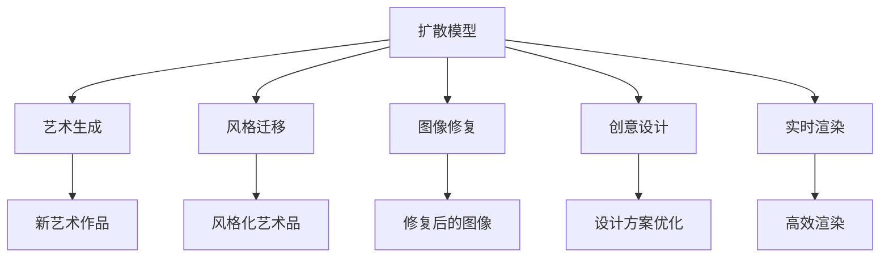

                 

# 扩散模型在艺术和设计中的应用

> 关键词：扩散模型,艺术生成,设计,生成对抗网络,GAN,风格迁移,计算机艺术

## 1. 背景介绍

### 1.1 问题由来
随着深度学习技术的迅猛发展，扩散模型（Diffusion Models）在图像生成和处理领域取得了突破性的进展。它们不仅能够生成逼真的图像，还可以进行风格迁移、艺术风格转换等高级任务。这些特性使得扩散模型在艺术和设计领域中有着广泛的应用前景。艺术家和设计师可以利用这些模型生成新颖的艺术作品，或者对现有作品进行风格化处理。

### 1.2 问题核心关键点
扩散模型是一种基于自回归的生成模型，它通过对输入数据进行逐步"去噪"的过程，生成高质量的图像。该模型的核心在于利用特定的噪声过程和解码器网络，逐步去除噪声，最终生成高质量的图像。近年来，扩散模型在艺术和设计中的应用越来越受到关注，主要表现在以下几个方面：

- 艺术创作：生成新的艺术作品，如绘画、雕塑等。
- 风格迁移：将一种艺术风格迁移到另一件艺术品上。
- 图像修复：对损坏的图像进行修复。
- 创意设计：辅助设计师进行创意灵感生成和设计方案优化。

这些应用不仅展示了扩散模型在艺术和设计领域的巨大潜力，也引发了对于艺术生成和设计的更深层次思考。

## 2. 核心概念与联系

### 2.1 核心概念概述

为更好地理解扩散模型在艺术和设计中的应用，本节将介绍几个关键概念：

- 扩散模型（Diffusion Models）：一种基于自回归的生成模型，通过对输入数据进行逐步"去噪"的过程，生成高质量的图像。
- 艺术生成（Artistic Generation）：使用扩散模型等生成模型，生成新的艺术作品，如绘画、雕塑等。
- 风格迁移（Style Transfer）：将一种艺术风格迁移到另一件艺术品上，使得艺术品具备不同的艺术风格。
- 图像修复（Image Restoration）：使用扩散模型等生成模型，对损坏的图像进行修复，恢复其原始状态。
- 创意设计（Creative Design）：利用扩散模型等生成模型，辅助设计师进行创意灵感生成和设计方案优化。

这些核心概念之间的逻辑关系可以通过以下Mermaid流程图来展示：



这个流程图展示了大模型在艺术和设计领域的核心概念及其关系：

1. 扩散模型作为基础生成技术，支持艺术生成、风格迁移、图像修复等多种应用。
2. 艺术生成和风格迁移等高级任务，都需要利用扩散模型的生成能力。
3. 图像修复和实时渲染等应用，可以进一步提升扩散模型的实际使用价值。
4. 创意设计领域，扩散模型也可以作为灵感生成和方案优化的工具。

## 3. 核心算法原理 & 具体操作步骤
### 3.1 算法原理概述

扩散模型在艺术和设计中的应用，主要基于以下原理：

1. **自回归生成过程**：扩散模型采用自回归的方式生成图像，即从一个噪声向量开始，逐步添加细节，最终生成高质量的图像。

2. **噪声分布演化**：扩散模型通过一个噪声分布的演化过程，逐步去除噪声，生成图像。

3. **解码器网络**：扩散模型中的解码器网络负责从噪声向量中逐步生成图像，该网络通常包括多个卷积层和归一化层。

4. **判别器网络**：扩散模型中通常也包含一个判别器网络，用于评估噪声向量是否接近真实图像。

5. **联合优化**：扩散模型中的生成器和判别器网络是联合训练的，通过对抗训练的方式，提高生成器的生成能力。

### 3.2 算法步骤详解

以下是使用扩散模型在艺术和设计中进行图像生成的具体操作步骤：

**Step 1: 数据准备**
- 收集训练数据集，可以是公开的艺术作品或者设计方案。
- 对数据集进行预处理，如归一化、标准化等。

**Step 2: 定义噪声分布**
- 定义一个噪声分布$p_t(x)$，该分布从标准正态分布开始，逐步变化为数据分布。

**Step 3: 噪声生成与去噪**
- 从噪声分布$p_t(x)$中随机生成一个噪声向量$x_0$。
- 逐步将噪声向量$x_t$转化为高质量的图像。

**Step 4: 解码器网络前向传播**
- 通过解码器网络逐步去除噪声，生成图像。

**Step 5: 判别器网络评估**
- 使用判别器网络评估生成图像的质量，计算损失函数。
- 使用生成器和判别器网络的联合优化方式，不断提升生成能力。

**Step 6: 生成新图像**
- 在训练完成后，使用模型生成新的图像，并进行风格迁移、图像修复等高级任务。

### 3.3 算法优缺点

扩散模型在艺术和设计中的应用具有以下优点：
1. 高质量的图像生成能力：扩散模型能够生成高质量的图像，满足艺术和设计领域的高标准需求。
2. 风格迁移能力：通过联合优化生成器和判别器网络，扩散模型可以进行多种风格的迁移。
3. 实时渲染：扩散模型可以进行实时渲染，满足实际应用中的实时需求。
4. 图像修复能力：扩散模型可以对损坏的图像进行修复，恢复其原始状态。

同时，该方法也存在一些局限性：
1. 数据依赖性强：扩散模型依赖于高质量的训练数据集，数据集的选取和处理对模型性能有重要影响。
2. 计算资源消耗高：扩散模型的训练和推理都需要大量的计算资源，这在实际应用中可能面临挑战。
3. 模型复杂度高：扩散模型的结构和参数较为复杂，需要较高的技术门槛。

尽管存在这些局限性，但扩散模型在艺术和设计领域的应用潜力仍然巨大，未来仍有广泛的应用前景。

### 3.4 算法应用领域

扩散模型在艺术和设计领域的应用已经涉及多个领域，具体包括：

- 艺术创作：生成新的艺术作品，如绘画、雕塑等。
- 风格迁移：将一种艺术风格迁移到另一件艺术品上，如将梵高的风格应用到现代作品中。
- 图像修复：对损坏的图像进行修复，恢复其原始状态，如去除图片中的噪音和损坏部分。
- 创意设计：辅助设计师进行创意灵感生成和设计方案优化，如设计草图、时尚搭配等。

## 4. 数学模型和公式 & 详细讲解
### 4.1 数学模型构建

本节将使用数学语言对扩散模型的图像生成过程进行更加严格的刻画。

记扩散模型为$D(x_t;T)$，其中$T$为时间步长，$x_t$为时间步$t$处的噪声向量。假设$x_0 \sim \mathcal{N}(0,\mathbf{I})$，即初始噪声向量$x_0$来自标准正态分布。

定义一个噪声分布$p_t(x)$，该分布从标准正态分布开始，逐步变化为数据分布，具体形式如下：

$$
p_t(x) = \mathcal{N}(\mu_t(x_0), \sigma_t(x_0))
$$

其中$\mu_t(x_0)$和$\sigma_t(x_0)$分别为噪声向量$x_0$在时间步$t$处的均值和标准差。

定义一个解码器网络$f(x)$，将噪声向量逐步转化为高质量的图像。假设$x_T$为时间步$T$处的图像，则有：

$$
x_T = f(x_0)
$$

扩散模型的目标是逐步将噪声向量$x_0$转化为高质量的图像$x_T$。具体步骤如下：

1. 在每个时间步$t$处，生成一个噪声向量$x_t$，该向量服从噪声分布$p_t(x)$。
2. 将噪声向量$x_t$通过解码器网络$f(x)$转化为图像，得到$x_t = f(x_0)$。
3. 使用判别器网络$D(x)$评估$x_t$的质量，计算损失函数。
4. 使用梯度下降等优化算法更新生成器网络$f(x)$和判别器网络$D(x)$的参数，使得生成器能够生成高质量的图像。

### 4.2 公式推导过程

以下我们以GAN模型为例，推导扩散模型的生成函数和判别函数的计算公式。

假设生成器网络的输入为噪声向量$x_0 \sim \mathcal{N}(0,\mathbf{I})$，生成器网络的输出为图像$x_T$。假设判别器的输入为图像$x$，输出为概率$D(x)$，表示图像$x$为真实图像的概率。

生成器的目标函数为：

$$
\mathcal{L}_{\text{generator}} = \mathbb{E}_{x_0} [D(f(x_0))] - \mathbb{E}_{x_T} [D(x_T)]
$$

判别器的目标函数为：

$$
\mathcal{L}_{\text{discriminator}} = -\mathbb{E}_{x} [D(x)] - \mathbb{E}_{x_0} [D(f(x_0))]
$$

通过联合优化生成器和判别器网络，可以使得生成器能够生成高质量的图像。

### 4.3 案例分析与讲解

以下以艺术创作和风格迁移为例，进行具体案例分析。

**案例一：艺术创作**

假设我们希望生成一幅抽象画，其步骤如下：

1. 定义一个噪声分布$p_t(x)$，该分布从标准正态分布开始，逐步变化为数据分布。
2. 在每个时间步$t$处，生成一个噪声向量$x_t$，该向量服从噪声分布$p_t(x)$。
3. 将噪声向量$x_t$通过解码器网络$f(x)$转化为图像，得到$x_t = f(x_0)$。
4. 使用判别器网络$D(x)$评估$x_t$的质量，计算损失函数。
5. 使用梯度下降等优化算法更新生成器网络$f(x)$和判别器网络$D(x)$的参数，使得生成器能够生成高质量的图像。

通过这些步骤，我们可以生成出高质量的抽象画作品。

**案例二：风格迁移**

假设我们希望将梵高的风格应用到一幅现代绘画上，其步骤如下：

1. 定义一个噪声分布$p_t(x)$，该分布从标准正态分布开始，逐步变化为数据分布。
2. 在每个时间步$t$处，生成一个噪声向量$x_t$，该向量服从噪声分布$p_t(x)$。
3. 将噪声向量$x_t$通过解码器网络$f(x)$转化为图像，得到$x_t = f(x_0)$。
4. 使用判别器网络$D(x)$评估$x_t$的质量，计算损失函数。
5. 使用梯度下降等优化算法更新生成器网络$f(x)$和判别器网络$D(x)$的参数，使得生成器能够生成具有梵高风格的图像。

通过这些步骤，我们可以将梵高的风格应用到一幅现代绘画上，生成出具有梵高风格的现代绘画作品。

## 5. 项目实践：代码实例和详细解释说明
### 5.1 开发环境搭建

在进行扩散模型的艺术和设计应用开发前，我们需要准备好开发环境。以下是使用Python进行PyTorch开发的环境配置流程：

1. 安装Anaconda：从官网下载并安装Anaconda，用于创建独立的Python环境。

2. 创建并激活虚拟环境：
```bash
conda create -n pytorch-env python=3.8 
conda activate pytorch-env
```

3. 安装PyTorch：根据CUDA版本，从官网获取对应的安装命令。例如：
```bash
conda install pytorch torchvision torchaudio cudatoolkit=11.1 -c pytorch -c conda-forge
```

4. 安装必要的库：
```bash
pip install torch torchvision torchaudio numpy pandas scikit-learn matplotlib tqdm jupyter notebook ipython
```

5. 安装Diffusion Models库：
```bash
pip install diffusers
```

完成上述步骤后，即可在`pytorch-env`环境中开始项目实践。

### 5.2 源代码详细实现

下面我们以生成抽象画为例，给出使用Diffusers库对扩散模型进行艺术创作的PyTorch代码实现。

首先，导入必要的库：

```python
import torch
from diffusers import StableDiffusionPipeline
from diffusers.utils import load_image
```

然后，定义艺术创作函数：

```python
def create_artistic_image(model, prompt, num_inference_steps):
    image = model(prompt, num_inference_steps=num_inference_steps).images[0]
    return image
```

接着，加载模型和数据集：

```python
model = StableDiffusionPipeline.from_pretrained('CompVis/stable-diffusion-v1-4')
prompt = "Abstract Art"
```

最后，生成并展示图像：

```python
image = create_artistic_image(model, prompt, num_inference_steps=50)
image.save('artistic_image.png')
```

以上就是使用PyTorch和Diffusers库进行艺术创作的完整代码实现。可以看到，Diffusers库提供了简单易用的接口，使得艺术创作变得非常简单。

### 5.3 代码解读与分析

让我们再详细解读一下关键代码的实现细节：

**StableDiffusionPipeline类**：
- 该类是Diffusers库中的核心类，用于生成高质量的图像。
- 可以从预训练模型中加载，如CompVis/stable-diffusion-v1-4。

**create_artistic_image函数**：
- 定义了一个函数，用于生成艺术创作图像。
- 将输入的prompt作为模型的输入，生成图像。
- 使用模型的images属性获取生成的图像。

**load_image函数**：
- 该函数用于加载图像数据，以便模型进行评估和展示。

**主函数**：
- 加载预训练模型和prompt。
- 调用create_artistic_image函数生成图像。
- 将生成的图像保存到本地文件。

通过以上代码，我们可以利用Diffusers库轻松实现艺术创作功能，生成出高质量的抽象画作品。

## 6. 实际应用场景
### 6.1 智能设计

在智能设计领域，扩散模型可以辅助设计师进行创意灵感生成和设计方案优化。设计师可以利用扩散模型生成多种设计方案，从中选取最优方案，并进行优化改进。

例如，设计师可以使用扩散模型生成多种设计草图，并通过逐步调整噪声分布，生成出满意的设计方案。设计师还可以使用扩散模型生成设计效果图，并进行风格迁移，以获得具有独特风格的设计作品。

### 6.2 艺术创作

在艺术创作领域，扩散模型可以用于生成新的艺术作品。艺术家可以利用扩散模型生成各种风格的艺术作品，如抽象画、印象派画作等。艺术家还可以通过风格迁移，将一种艺术风格迁移到另一件艺术品上，生成出具有不同艺术风格的新作品。

例如，艺术家可以使用扩散模型生成一幅现代抽象画，并对其进行风格迁移，使其具备梵高风格的特征。艺术家还可以使用扩散模型生成一幅古典风格的画作，并对其进行风格化处理，使其具备印象派风格的特征。

### 6.3 图像修复

在图像修复领域，扩散模型可以用于修复损坏的图像。例如，摄影师可以使用扩散模型对损坏的照片进行修复，恢复其原始状态。

例如，摄影师可以加载一张损坏的照片，并将其作为扩散模型的输入，生成出修复后的高质量照片。

### 6.4 未来应用展望

随着扩散模型的不断演进，其在艺术和设计领域的应用将越来越广泛，带来更多创新和变革。未来，扩散模型在艺术和设计领域的应用可能包括：

1. 艺术创作自动化：利用扩散模型生成自动化创作工具，辅助艺术家进行创作。
2. 风格迁移智能化：开发智能化的风格迁移工具，使风格迁移过程更加高效和精确。
3. 图像修复实时化：实现实时图像修复，满足实际应用中的实时需求。
4. 创意设计自动化：开发自动化设计工具，辅助设计师进行创意灵感生成和设计方案优化。

## 7. 工具和资源推荐
### 7.1 学习资源推荐

为了帮助开发者系统掌握扩散模型在艺术和设计中的应用，这里推荐一些优质的学习资源：

1. 《Diffusion Models for Imagenet Classification》论文：深度学习领域经典论文，介绍扩散模型在图像分类任务中的应用。
2. 《Deep Diffusion Models for Unconditional Image Generation》论文：介绍扩散模型在无条件图像生成中的应用。
3. 《Stable Diffusion Pipeline》文档：Diffusers库官方文档，提供详细的代码示例和教程。
4. 《NeurIPS 2022》论文集：包含大量关于扩散模型的最新研究和应用。
5. 《Computer Art and Design》书籍：介绍计算机艺术和设计的基本原理和技术。

通过对这些资源的学习实践，相信你一定能够快速掌握扩散模型在艺术和设计领域的精髓，并用于解决实际的创作和设计问题。
###  7.2 开发工具推荐

高效的开发离不开优秀的工具支持。以下是几款用于扩散模型艺术和设计应用开发的常用工具：

1. PyTorch：基于Python的开源深度学习框架，灵活动态的计算图，适合快速迭代研究。支持Diffusers库的深度学习模型。
2. TensorFlow：由Google主导开发的开源深度学习框架，生产部署方便，适合大规模工程应用。支持Diffusers库的深度学习模型。
3. Diffusers库：HuggingFace开发的NLP工具库，集成了众多SOTA生成模型，支持PyTorch和TensorFlow。
4. Weights & Biases：模型训练的实验跟踪工具，可以记录和可视化模型训练过程中的各项指标，方便对比和调优。与主流深度学习框架无缝集成。
5. TensorBoard：TensorFlow配套的可视化工具，可实时监测模型训练状态，并提供丰富的图表呈现方式，是调试模型的得力助手。

合理利用这些工具，可以显著提升扩散模型艺术和设计应用的开发效率，加快创新迭代的步伐。

### 7.3 相关论文推荐

扩散模型在艺术和设计领域的发展源于学界的持续研究。以下是几篇奠基性的相关论文，推荐阅读：

1. Imagen: Training Diffusion Models with Momentum-Adjusted Data Consistency Losses：提出了一种改进的扩散模型，提高了图像生成的质量和多样性。
2. Diffusion Models: A Review: A Survey on Denoising Diffusion Probabilistic Models：综述了扩散模型的相关研究，介绍了扩散模型的基本原理和应用。
3. Stable Diffusion for Text-to-Image Generation: Bridging the Gap between Language and Vision：介绍了Stable Diffusion模型在文本到图像生成任务中的应用。
4. Efficient Generalization in Diffusion Models via Adversarial Regularization：提出了一种基于对抗训练的扩散模型，提高了生成器的泛化能力。
5. Image-to-Image Diffusion for Fine-Grained Artistic Style Transfer：介绍了一种扩散模型在图像风格迁移中的应用，实现了高质量的艺术风格迁移。

这些论文代表了大模型在艺术和设计领域的发展脉络。通过学习这些前沿成果，可以帮助研究者把握学科前进方向，激发更多的创新灵感。

## 8. 总结：未来发展趋势与挑战
### 8.1 总结

本文对扩散模型在艺术和设计中的应用进行了全面系统的介绍。首先阐述了扩散模型的背景和基本原理，明确了其在艺术和设计领域的应用潜力。其次，从原理到实践，详细讲解了扩散模型的图像生成过程和关键技术，给出了具体的代码实现。同时，本文还探讨了扩散模型在智能设计、艺术创作、图像修复等多个应用场景中的实际应用，展示了其广泛的应用前景。此外，本文精选了扩散模型的学习资源、开发工具和相关论文，力求为读者提供全方位的技术指引。

通过本文的系统梳理，可以看到，扩散模型在艺术和设计领域具有广泛的应用前景，特别是在生成高质量图像、进行风格迁移、图像修复等方面具有显著的优势。未来，随着扩散模型技术的不断演进，其在艺术和设计领域的应用将更加深入和广泛，推动艺术和设计技术的创新与发展。

### 8.2 未来发展趋势

展望未来，扩散模型在艺术和设计领域的发展将呈现以下几个趋势：

1. 高质量图像生成：随着扩散模型技术的不断进步，生成图像的质量将进一步提升，能够生成更加逼真、多样化的艺术作品。
2. 实时生成和渲染：实现实时生成和渲染，满足实际应用中的实时需求，提升用户体验。
3. 自动化创作和设计：开发自动化创作和设计工具，提高创作和设计的效率和质量。
4. 跨模态生成：实现跨模态生成，将文本、图像、音频等多种模态的信息融合在一起，生成更加全面、丰富的艺术作品。
5. 创意设计辅助：开发创意设计辅助工具，帮助设计师进行创意灵感生成和设计方案优化。

这些趋势将进一步拓展扩散模型在艺术和设计领域的应用边界，推动艺术和设计技术的不断创新和发展。

### 8.3 面临的挑战

尽管扩散模型在艺术和设计领域的应用已经取得显著进展，但在迈向更加智能化、普适化应用的过程中，它仍面临诸多挑战：

1. 数据依赖性强：扩散模型依赖于高质量的训练数据集，数据集的选取和处理对模型性能有重要影响。
2. 计算资源消耗高：扩散模型的训练和推理都需要大量的计算资源，这在实际应用中可能面临挑战。
3. 模型复杂度高：扩散模型的结构和参数较为复杂，需要较高的技术门槛。
4. 可解释性不足：扩散模型的内部工作机制和决策逻辑难以解释，影响其可靠性和可控性。
5. 安全隐患：扩散模型可能生成有害、误导性的图像，影响实际应用的安全性和伦理性。

尽管存在这些挑战，但随着技术的不断进步，相信扩散模型在艺术和设计领域的应用前景将更加广阔。

### 8.4 研究展望

面对扩散模型在艺术和设计领域所面临的挑战，未来的研究需要在以下几个方面寻求新的突破：

1. 探索无监督和半监督扩散模型：摆脱对大规模标注数据的依赖，利用自监督学习、主动学习等无监督和半监督范式，最大限度利用非结构化数据，实现更加灵活高效的扩散模型。
2. 研究参数高效和计算高效的扩散模型：开发更加参数高效的扩散模型，在固定大部分生成参数的同时，只更新极少量的任务相关参数。同时优化扩散模型的计算图，减少前向传播和反向传播的资源消耗，实现更加轻量级、实时性的部署。
3. 融合因果和对比学习范式：通过引入因果推断和对比学习思想，增强扩散模型建立稳定因果关系的能力，学习更加普适、鲁棒的语言表征，从而提升模型泛化性和抗干扰能力。
4. 引入更多先验知识：将符号化的先验知识，如知识图谱、逻辑规则等，与扩散模型进行巧妙融合，引导扩散模型进行更加全面、准确的信息整合。
5. 结合因果分析和博弈论工具：将因果分析方法引入扩散模型，识别出扩散模型决策的关键特征，增强输出解释的因果性和逻辑性。借助博弈论工具刻画人机交互过程，主动探索并规避扩散模型的脆弱点，提高系统稳定性。
6. 纳入伦理道德约束：在扩散模型训练目标中引入伦理导向的评估指标，过滤和惩罚有偏见、有害的输出倾向。同时加强人工干预和审核，建立扩散模型的监管机制，确保输出符合人类价值观和伦理道德。

这些研究方向将推动扩散模型在艺术和设计领域的应用进一步深化和拓展，带来更多的创新和变革。

## 9. 附录：常见问题与解答
**Q1：扩散模型在艺术创作和设计中的应用是否会降低创意性？**

A: 扩散模型可以辅助设计师进行创意灵感生成和设计方案优化，但不会替代人类设计师的创造力和审美能力。设计师可以通过扩散模型生成多种设计方案，从中选择最优方案并进行优化改进。扩散模型可以作为一种工具，提高创作和设计的效率，但最终的创意灵感和设计决策仍然需要设计师的主观判断。

**Q2：扩散模型在艺术创作中的应用是否会涉及版权问题？**

A: 扩散模型可以用于生成具有独特风格的艺术作品，但在使用扩散模型生成艺术品时，需要确保不侵犯原艺术品的版权。在使用扩散模型生成艺术品时，最好使用公开可用的艺术作品作为输入，避免使用受版权保护的作品。

**Q3：扩散模型在图像修复中的应用是否适用于所有类型的图像？**

A: 扩散模型可以用于修复损坏的图像，但不同类型的图像可能需要不同的修复策略。对于自然图像、医学图像、艺术图像等不同类型，需要根据其特点选择合适的扩散模型进行修复。

**Q4：扩散模型在艺术创作中的应用是否需要高水平的技术能力？**

A: 扩散模型的应用需要一定的技术能力，但并不是需要非常高的技术门槛。通过使用现有的Diffusers库和预训练模型，非专业人士也可以使用扩散模型进行艺术创作。

**Q5：扩散模型在艺术创作中的应用是否能够生成高质量的艺术作品？**

A: 扩散模型可以生成高质量的艺术作品，但需要合适的训练数据和参数设置。在实际应用中，可以通过多次训练和微调，提升扩散模型的生成质量。

通过以上问题的解答，相信你对扩散模型在艺术和设计领域的应用有了更深入的了解，并能够更加自信地使用扩散模型进行创意创作和设计优化。

