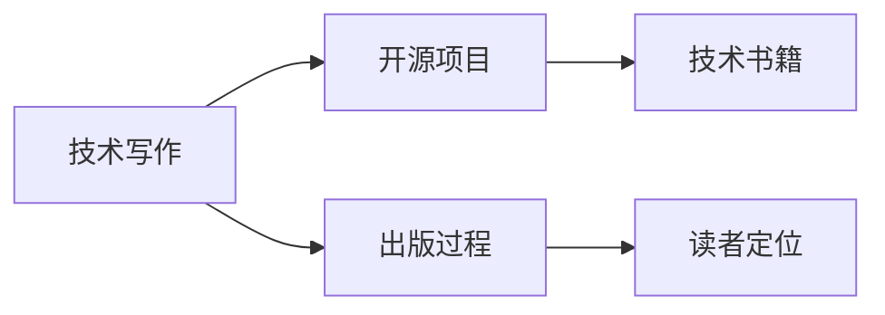

                 

# 技术作家之路：从开源项目到出版技术书籍

## 1. 背景介绍

### 1.1 问题由来
在互联网和数字化转型的大潮下，技术写作成为了连接开发者、从业者与广泛读者群体的重要桥梁。通过优质的技术文章，开发者不仅可以分享自身的实践经验和技术见解，还能不断积累行业声誉，开拓职业发展的新可能。技术作家，作为这一桥梁的搭建者，其价值日益凸显。

### 1.2 问题核心关键点
技术写作和出版技术书籍，是一条充满挑战和机遇的职业道路。技术作家需要具备深厚的技术积累、卓越的写作能力、丰富的表达技巧，以及对读者群体的深入理解。本文将围绕以下几个核心关键点展开探讨：

- 技术写作的基础与核心原则
- 从开源项目到技术书籍的实践路径
- 技术写作的进阶与创新方向
- 技术写作的商业化与职业发展

### 1.3 问题研究意义
研究技术写作和出版技术书籍，对于技术作家自身成长、技术社区的繁荣以及技术的普及传播都具有重要意义：

- 提升个人技术水平。技术写作要求作家不断学习、实践和总结，从而不断提升自身技术能力。
- 构建技术生态。通过写作和出版，技术作家可以连接更广泛的读者群体，推动技术社区的活跃和进步。
- 促进技术传播。高质量的技术文章和书籍，能够将复杂的技术知识转化为易于理解的形式，加速技术知识的传播和应用。
- 开拓职业机会。技术作家除了可以积累行业声誉，还可以通过写作出版获取版税、咨询费等收入，实现职业多元化。

## 2. 核心概念与联系

### 2.1 核心概念概述

为更好地理解技术写作和出版技术书籍的过程，本节将介绍几个关键概念：

- **技术写作**：指通过文字、图片、代码等方式，将复杂的概念和解决方案清晰、准确地传递给读者的活动。
- **开源项目**：指公开源代码、允许任何人自由使用、修改和分布的软件项目。
- **技术书籍**：指详细记录技术和经验的出版物，通常包含深入的技术分析、实践案例和操作手册。
- **出版过程**：从构思、编写、审校到出版的全流程管理。
- **读者定位**：根据目标受众的需求和背景，制定写作风格、深度和内容。

这些概念之间的联系如下：

1. **技术写作与开源项目**：技术写作通常以开源项目为载体，通过文章、文档、代码示例等形式，详细介绍项目的设计、实现和应用。
2. **开源项目与技术书籍**：优秀的开源项目可以成为技术书籍的内容源泉，作者从中提取经验，编写成书。
3. **技术写作与出版过程**：技术写作是出版过程的起点，优质的写作是成功出版的基础。
4. **出版过程与读者定位**：出版过程的管理，确保书籍内容符合目标读者的需求和兴趣。

这些概念的交织构成了技术写作和出版技术书籍的完整链条。

### 2.2 核心概念原理和架构的 Mermaid 流程图



这个流程图展示了技术写作、开源项目、技术书籍、出版过程和读者定位之间的联系。通过开源项目，技术作家积累了实践经验，成为书籍内容的来源；通过出版过程，将这些经验转化为可读性高的书籍；而读者定位则确保书籍内容符合目标读者的需求和兴趣。

## 3. 核心算法原理 & 具体操作步骤

### 3.1 算法原理概述

技术写作和出版技术书籍的过程，本质上是一种有组织的知识传递和积累活动。其核心算法原理可以概括为以下几个步骤：

1. **需求分析**：确定目标读者的背景、知识水平和兴趣，从而制定合适的写作策略。
2. **内容规划**：根据需求分析，规划书籍的结构、章节和主要内容。
3. **资料搜集**：收集和整理相关领域的资料、数据和案例，为写作提供支撑。
4. **写作实践**：撰写书籍内容，注重表达清晰、逻辑严谨、语言生动。
5. **审校修改**：邀请同行和专家对书籍内容进行审校，确保准确性和可读性。
6. **出版发行**：选择合适的出版渠道和发行方式，确保书籍能够覆盖到目标受众。

### 3.2 算法步骤详解

以下是技术写作和出版技术书籍的具体操作步骤：

#### 3.2.1 需求分析

1. **明确目标读者**：
   - 定位受众的职业背景，如开发者、架构师、产品经理等。
   - 分析受众的知识水平，如初学者、中级开发者、专家等。
   - 理解受众的兴趣和痛点，如技术栈迁移、性能优化、架构设计等。

2. **制定写作目标**：
   - 确定书籍的主要目标，如介绍一个新框架、解决一个常见问题、分享一个实践经验等。
   - 设定书籍的深度和广度，平衡专业性与可读性。

3. **研究竞品**：
   - 阅读同类书籍和文章，了解市场已有的内容和风格。
   - 分析竞品的优缺点，借鉴优秀之处，避免重复内容。

#### 3.2.2 内容规划

1. **确定书籍结构**：
   - 书籍的章节划分应符合逻辑和受众阅读习惯。
   - 每个章节应明确主题和目标，避免内容冗余。

2. **设计章节内容**：
   - 章节应包括引言、核心内容、示例和练习等。
   - 核心内容应涵盖技术基础、实践案例、问题解析等。

3. **编写大纲**：
   - 大纲应详细列出每个章节的主要内容和结构。
   - 大纲应作为写作的蓝图，确保内容连贯和逻辑清晰。

#### 3.2.3 资料搜集

1. **收集文档和代码**：
   - 收集开源项目的相关文档和代码，了解项目的背景、设计思路和实现细节。
   - 搜集相关领域的论文、书籍和文章，提取理论知识和实践经验。

2. **整理数据和案例**：
   - 根据章节内容，整理数据和案例，确保内容的真实性和代表性。
   - 编写代码示例，帮助读者理解和实践书籍内容。

3. **验证信息**：
   - 对收集的信息进行验证，确保数据的准确性和完整性。
   - 避免引用过时或错误的信息，保持内容的权威性。

#### 3.2.4 写作实践

1. **撰写初稿**：
   - 按照大纲和资料，撰写初稿，注重表达清晰、逻辑严谨。
   - 初稿应包含引言、正文和结论，结构完整。

2. **编写示例和练习**：
   - 编写代码示例，帮助读者理解和实践书籍内容。
   - 设计练习题，加深读者对知识的理解。

3. **持续优化**：
   - 根据读者反馈和专家建议，持续优化书籍内容。
   - 更新内容，确保技术栈的最新性和实用性。

#### 3.2.5 审校修改

1. **邀请同行审校**：
   - 邀请同领域的技术专家对书籍进行审校，提出改进意见。
   - 通过同行评审，确保书籍内容的准确性和权威性。

2. **自我校对**：
   - 对书籍进行自我校对，检查语法、拼写和排版等细节。
   - 确保书籍内容的流畅性和可读性。

3. **读者反馈**：
   - 收集早期读者的反馈，了解他们的疑问和建议。
   - 根据反馈优化内容，提高书籍的实用性和吸引力。

#### 3.2.6 出版发行

1. **选择合适的出版渠道**：
   - 考虑使用传统出版、自出版或数字出版等渠道。
   - 根据受众和市场情况，选择最适合的出版方式。

2. **设计书籍封面和排版**：
   - 设计符合目标受众审美和书籍主题的封面。
   - 确保书籍排版清晰、易读，提升阅读体验。

3. **推广和宣传**：
   - 通过社交媒体、技术社区和博客等渠道进行宣传。
   - 组织线上线下活动，与读者互动，提升书籍曝光度。

### 3.3 算法优缺点

技术写作和出版技术书籍的过程具有以下优点：

- **知识积累**：通过系统地写作和出版，将知识沉淀和传承下来。
- **品牌建设**：通过优质的书籍内容，建立技术作家的行业声誉和品牌。
- **职业发展**：通过写作出版，开拓新的职业路径，如培训师、咨询师等。

同时，该过程也存在一些局限性：

- **时间和精力投入**：写作和出版过程耗时耗力，需要持续的投入和迭代。
- **市场风险**：书籍的市场表现受多种因素影响，存在不确定性。
- **技术迭代**：技术的快速发展可能导致书籍内容过时，需要定期更新。

### 3.4 算法应用领域

技术写作和出版技术书籍的方法，不仅适用于软件开发和技术管理，还广泛应用于以下领域：

1. **教育培训**：编写教材、讲义和课程设计，帮助学生和从业者掌握新技术和新方法。
2. **技术咨询**：通过书籍和文章，提供专业建议和解决方案，解决技术难题。
3. **产品文档**：撰写产品手册、使用指南和API文档，帮助用户高效使用产品。
4. **项目管理**：编写项目管理方法论、最佳实践和案例分析，提升项目管理和团队协作效率。
5. **行业分析**：撰写行业报告、趋势分析和市场研究，为决策者提供数据和见解。

这些领域的技术作家，通过写作和出版，将自身经验转化为有价值的信息资源，帮助他人提升技能，推动技术发展。

## 4. 数学模型和公式 & 详细讲解 & 举例说明

### 4.1 数学模型构建

在技术写作和出版书籍的过程中，数学模型可以帮助我们更好地理解和表述技术内容。以下是一个示例模型，用于说明技术书籍的结构规划：

设 $S$ 为书籍的章节集合，每个章节 $s \in S$ 包括标题 $t_s$、内容 $c_s$ 和案例 $a_s$，则书籍的结构模型可以表示为：

$$
S = \{s|s = (t_s, c_s, a_s)\}
$$

其中 $t_s$ 为章节标题，$c_s$ 为章节内容，$a_s$ 为章节案例。

### 4.2 公式推导过程

假设某章节内容为 $c_s$，包含 $n_s$ 个子主题，每个子主题 $c_{s,i}$ 的复杂度为 $w_{s,i}$，则该章节的总复杂度 $W_s$ 可以表示为：

$$
W_s = \sum_{i=1}^{n_s} w_{s,i}
$$

如果每个子主题的复杂度 $w_{s,i}$ 可以通过复杂度函数 $f_{s,i}$ 计算，则：

$$
w_{s,i} = f_{s,i}(x_{s,i})
$$

其中 $x_{s,i}$ 为子主题 $c_{s,i}$ 的相关数据或实例。

### 4.3 案例分析与讲解

以某开源项目为示例，分析其技术书籍的编写过程：

1. **需求分析**：
   - 目标读者为中级开发者，对项目有一定基础的了解。
   - 目标为介绍项目的设计思想、核心技术和应用场景。
   - 市场调研显示，项目用户群体广泛，需求多样。

2. **内容规划**：
   - 书籍分为六章，包括引言、架构设计、核心功能、优化实践、应用案例和安全实践。
   - 每个章节内容丰富，包括理论讲解、代码示例和实践技巧。

3. **资料搜集**：
   - 收集项目文档、代码示例和社区讨论。
   - 整理项目功能点、架构图和使用指南。

4. **写作实践**：
   - 撰写初稿，包括章节引言、正文和结论。
   - 编写代码示例，帮助读者理解和实践书籍内容。

5. **审校修改**：
   - 邀请项目作者和社区专家审校，提出改进意见。
   - 进行自我校对，确保书籍内容的准确性和可读性。

6. **出版发行**：
   - 选择数字出版，方便读者在线阅读和下载。
   - 设计书籍封面，优化排版，提升阅读体验。
   - 通过技术社区和博客进行宣传，提高书籍曝光度。

## 5. 项目实践：代码实例和详细解释说明

### 5.1 开发环境搭建

在进行技术书籍编写和出版的实践过程中，需要搭建合适的开发环境。以下是常用的开发环境配置流程：

1. **安装编程工具**：
   - 安装IDE（如Visual Studio Code、PyCharm）和代码高亮工具。
   - 安装文本编辑器（如Sublime Text、Atom），用于写作和排版。

2. **搭建文档系统**：
   - 使用Markdown或LaTeX等工具，搭建书籍的文档系统。
   - 使用Git和GitHub进行版本控制，方便协作和发布。

3. **配置出版工具**：
   - 安装PDF生成器和电子书出版工具（如LaTeX、Calibre）。
   - 配置自动排版和校对工具，提升书籍的出版质量。

### 5.2 源代码详细实现

以下是一个示例代码，用于说明如何编写一个技术书籍的章节内容：

```python
# 示例代码：编写技术书籍章节内容
def chapter_content(title, content, cases):
    """
    编写技术书籍章节内容
    :param title: 章节标题
    :param content: 章节内容
    :param cases: 章节案例
    :return: 章节内容字符串
    """
    # 章节引言
    intro = f"## {title}\n\n该章节介绍 {title} 的相关内容，包括理论基础、实践案例和最佳实践。"
    
    # 章节正文
    body = f"{content}\n\n"
    
    # 章节案例
    body += f"## 案例分析\n\n以下是一个 {title} 的实际应用案例：\n\n{cases}"
    
    # 返回章节内容字符串
    return intro + "\n" + body

# 示例使用
title = "如何使用新技术"
content = "详细介绍如何使用新技术，包括步骤、注意事项和常见问题。"
cases = "案例一：项目A中的具体实现\n案例二：项目B中的优化技巧"
result = chapter_content(title, content, cases)
print(result)
```

### 5.3 代码解读与分析

该示例代码定义了一个 `chapter_content` 函数，用于编写技术书籍的章节内容。函数接受三个参数：章节标题、章节内容和章节案例。函数的返回值为一个字符串，包含章节的引言、正文和案例分析。

在实际使用中，可以根据不同章节的需求，调用 `chapter_content` 函数，逐步构建完整的技术书籍内容。

### 5.4 运行结果展示

运行上述示例代码，将输出以下结果：

```
## 如何使用新技术

该章节介绍 如何使用新技术，包括理论基础、实践案例和最佳实践。

## 案例分析

以下是一个 如何使用新技术 的实际应用案例：
```

该结果展示了如何通过代码生成技术书籍的章节内容，可以进一步扩展为完整的书籍文档。

## 6. 实际应用场景

### 6.1 智能家居应用开发

智能家居应用开发是一个典型的技术写作场景，可以通过技术书籍和博客文章，详细介绍智能家居设备的设计、实现和应用。作者可以通过开源项目收集设备数据和案例，撰写技术书籍和文章，帮助开发者了解智能家居的最新技术和应用场景。

### 6.2 数字营销策略制定

数字营销策略制定是一个复杂的领域，需要通过技术书籍和博客文章，详细介绍营销理论、工具和案例。作者可以从开源项目中提取数据和案例，撰写技术书籍和文章，帮助营销人员掌握最新技术和方法，提升营销效果。

### 6.3 人工智能项目实践

人工智能项目实践是一个不断发展的领域，需要通过技术书籍和博客文章，详细介绍AI算法、模型和应用。作者可以从开源项目中收集数据和案例，撰写技术书籍和文章，帮助开发者和从业者掌握AI技术和应用场景，推动AI技术的普及和发展。

### 6.4 未来应用展望

随着技术的发展和应用场景的扩大，技术写作和出版技术书籍的方法将不断进化和创新。未来的技术作家将面对更多挑战和机遇，需要不断学习和探索，才能更好地适应变化。

## 7. 工具和资源推荐

### 7.1 学习资源推荐

为了帮助技术作家系统掌握技术写作和出版技术书籍的理论基础和实践技巧，这里推荐一些优质的学习资源：

1. **《技术写作手册》**：提供系统性的技术写作指南，涵盖文档结构、写作风格、排版技巧等内容。
2. **《开源项目指南》**：详细介绍如何从开源项目中提取有价值的内容，撰写高质量的技术书籍和文章。
3. **Coursera《技术写作与出版》课程**：由多所大学开设的技术写作课程，提供理论知识和实践指导。
4. **Medium《写作指南》**：提供实用的写作技巧和投稿经验，帮助作者提升写作水平。
5. **Github《开源项目文档》**：介绍如何构建和维护开源项目文档，确保信息准确和易用。

### 7.2 开发工具推荐

高效的开发离不开优秀的工具支持。以下是几款用于技术写作和出版的常用工具：

1. **Visual Studio Code**：功能丰富的IDE，支持代码高亮、语法检查、版本控制等。
2. **LaTeX**：专业的排版工具，适用于技术书籍和学术论文的撰写和排版。
3. **Markdown**：轻量级的标记语言，适用于博客文章和技术文档的编写。
4. **Git**：分布式版本控制系统，支持多人协作和版本管理。
5. **Calibre**：电子书出版工具，支持多种格式转换和发布。

合理利用这些工具，可以显著提升技术写作和出版的效率，加快创新迭代的步伐。

### 7.3 相关论文推荐

技术写作和出版技术书籍的研究源于学界的持续探索。以下是几篇奠基性的相关论文，推荐阅读：

1. **《技术写作的未来：数字媒体与跨媒体技术》**：探讨技术写作在数字媒体环境下的变化和机遇。
2. **《开源项目的最佳实践与挑战》**：介绍开源项目的开发流程和管理方法，为技术写作提供指导。
3. **《技术书籍的读者定位与市场需求分析》**：分析技术书籍的目标读者和市场需求，指导作者撰写有针对性的书籍内容。
4. **《技术写作与出版流程的自动化》**：研究技术写作和出版流程的自动化技术，提升写作和出版的效率。
5. **《技术书籍的创新与趋势》**：分析技术书籍的创新方向和未来趋势，指导作者探索新的写作方式和出版渠道。

这些论文代表了大语言模型微调技术的发展脉络。通过学习这些前沿成果，可以帮助研究者把握学科前进方向，激发更多的创新灵感。

## 8. 总结：未来发展趋势与挑战

### 8.1 总结

本文对技术写作和出版技术书籍的方法进行了全面系统的介绍。首先阐述了技术写作和出版技术书籍的研究背景和意义，明确了技术写作在技术传递和知识积累中的重要作用。其次，从原理到实践，详细讲解了技术写作和出版技术书籍的数学模型和操作步骤，给出了技术书籍编写的完整代码实例。同时，本文还广泛探讨了技术写作和出版技术书籍的方法在多个行业领域的应用前景，展示了技术写作范式的广阔应用。此外，本文精选了技术写作和出版的各类学习资源，力求为读者提供全方位的技术指引。

通过本文的系统梳理，可以看到，技术写作和出版技术书籍是连接开发者、从业者与广泛读者群体的重要桥梁。技术作家通过写作和出版，将自身经验转化为有价值的信息资源，推动技术发展和应用。未来，伴随技术的不断进步和应用场景的拓展，技术写作和出版技术书籍的方法必将不断进化和创新，为技术传播和技术积累带来新的机遇。

### 8.2 未来发展趋势

展望未来，技术写作和出版技术书籍将呈现以下几个发展趋势：

1. **多模态写作**：结合图像、视频和音频等多模态数据，丰富技术内容的表达形式，提升阅读体验。
2. **互动写作**：通过在线编辑器和交互式工具，提供实时反馈和互动体验，增强学习效果。
3. **人工智能辅助**：引入自然语言处理和机器学习技术，自动化生成技术内容，提高写作效率。
4. **内容个性化**：根据用户背景和兴趣，生成个性化的技术内容，满足不同受众的需求。
5. **全球化出版**：利用国际化的写作和出版工具，拓展全球市场，提升技术书籍的影响力。

这些趋势凸显了技术写作和出版技术的广阔前景，为技术作家提供了新的机遇和挑战。

### 8.3 面临的挑战

尽管技术写作和出版技术书籍已经取得了一定的成就，但在迈向更加智能化、普适化应用的过程中，仍面临诸多挑战：

1. **技术更新快速**：技术的快速发展要求技术作家持续学习，及时更新内容，避免内容过时。
2. **市场竞争激烈**：技术书籍市场竞争激烈，如何差异化定位和提升内容质量，是技术作家需要面对的挑战。
3. **读者需求多样**：不同受众的需求差异较大，如何针对性地撰写内容，满足不同读者的需求，是技术作家需要解决的问题。
4. **版权和法律问题**：技术写作和出版涉及版权和法律问题，如何合法合规地使用开源项目和数据，是技术作家需要重视的课题。

这些挑战需要技术作家不断学习和探索，才能更好地适应变化，提升技术书籍的质量和影响力。

### 8.4 研究展望

未来的技术写作和出版技术书籍的研究需要在以下几个方面寻求新的突破：

1. **自动化生成技术**：利用人工智能技术，自动化生成技术书籍和文章，提高写作效率。
2. **跨媒体融合**：结合图像、视频和音频等多模态数据，丰富技术内容的表达形式。
3. **用户参与设计**：通过用户反馈和参与设计，提升技术书籍的内容质量和可读性。
4. **全球化出版平台**：构建全球化的技术书籍出版平台，提供更广泛的传播和市场机会。
5. **教育与实践结合**：结合教育资源和技术实践，提升技术书籍的教育价值和实用性。

这些研究方向将为技术写作和出版技术书籍带来新的视角和方法，推动技术传播和知识积累的进步。

## 9. 附录：常见问题与解答

**Q1：技术写作和出版技术书籍需要哪些基本技能？**

A: 技术写作和出版技术书籍需要以下基本技能：
- 扎实的技术基础：对所写技术领域有深入理解和实践经验。
- 优秀的写作能力：能够清晰、准确地表达技术内容，提升可读性。
- 熟练的工具使用：熟悉IDE、文本编辑器、PDF生成器等工具，提升写作和出版的效率。
- 项目管理能力：能够规划和管理书籍的撰写和出版流程，确保项目按时完成。

**Q2：如何提高技术写作和出版的质量？**

A: 提高技术写作和出版的质量需要多方面的努力：
- 深入理解读者需求：通过调研和反馈，了解目标读者的背景、兴趣和痛点。
- 精选有价值的内容：从开源项目中提取高质量的案例和数据，确保内容的实用性和权威性。
- 注重表达和排版：使用清晰的标题、逻辑严谨的段落和美观的排版，提升阅读体验。
- 多轮审校和反馈：邀请同行和读者进行审校和反馈，持续优化书籍内容。

**Q3：技术写作和出版技术书籍的商业模式有哪些？**

A: 技术写作和出版技术书籍的商业模式有多种，主要包括以下几种：
- 自出版：通过平台如Kindle Direct Publishing进行自出版，无需传统出版社介入。
- 传统出版：通过出版社进行书籍的印刷和发行，获取版税和销售收益。
- 课程和培训：通过在线平台如Udemy、Coursera提供课程和培训，收取学费。
- 咨询服务：提供技术咨询和培训服务，获取咨询费和技术支持费用。

选择适合自身优势和市场需求的模式，可以有效提升技术书籍的商业价值和影响力。

**Q4：技术写作和出版技术书籍的过程如何管理？**

A: 技术写作和出版技术书籍的过程管理，可以遵循以下几个步骤：
- 需求分析和目标设定：明确目标读者的需求和书籍的目标。
- 内容规划和结构设计：规划书籍的章节结构和主要内容。
- 资料搜集和整理：收集和整理相关领域的资料和案例。
- 写作实践和审校修改：撰写初稿并进行多轮审校修改。
- 出版发行和推广宣传：选择合适的出版渠道和推广方式，提升书籍的曝光度和影响力。

通过系统化的项目管理，可以确保技术书籍的质量和时效性，提升读者的阅读体验。

---

作者：禅与计算机程序设计艺术 / Zen and the Art of Computer Programming

