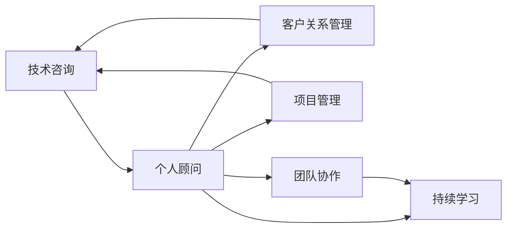

                 

# 技术咨询：从个人顾问到咨询公司

> 关键词：技术咨询，个人顾问，咨询公司，客户管理，项目管理，团队建设，持续学习

## 1. 背景介绍

### 1.1 问题由来
在当今快速发展的技术和商业环境中，企业对技术解决方案的需求日益增长。从人工智能、大数据、区块链，到云计算、物联网、网络安全，技术咨询在企业决策和运营中扮演着越来越重要的角色。然而，技术与商业的融合并不容易，技术方案的实施需要专业知识和深入理解业务需求的团队。个人顾问作为技术咨询的一线执行者，往往面临着来自多个领域挑战，如客户管理、项目管理、团队建设、持续学习等。随着客户需求的多样化和复杂化，个人顾问开始向团队化、公司化发展，从单一服务模式转向提供综合解决方案的咨询公司。

### 1.2 问题核心关键点
本节将重点分析技术咨询从个人顾问到咨询公司的关键问题点，包括客户关系管理、项目管理、团队协作、持续学习和业务落地等方面。

## 2. 核心概念与联系

### 2.1 核心概念概述

为了更好地理解技术咨询从个人顾问到咨询公司的演变过程，本节将介绍几个核心概念及其相互联系：

- **技术咨询（Technical Consulting）**：为企业提供技术解决方案和建议，涵盖技术评估、方案设计、实施指导、运维管理等多个环节。

- **个人顾问（Individual Advisor）**：由具有特定技术专长和行业经验的专业人士提供的一对一咨询服务，通常聚焦于特定技术领域的深度应用和推广。

- **咨询公司（Consulting Firm）**：集合一群技术专家和商业顾问，为客户提供系统性的解决方案和项目管理服务，涵盖咨询、设计、开发、实施等多个环节。

- **客户关系管理（Customer Relationship Management, CRM）**：通过有效的沟通和管理系统，建立并维护与客户的长期合作关系。

- **项目管理（Project Management）**：从项目启动、计划、执行、监控到收尾的全过程管理，确保项目按时、按质、按预算完成。

- **团队协作（Team Collaboration）**：通过工具和方法支持团队成员间的沟通、协作和知识共享，提升团队效率和产出。

- **持续学习（Continuous Learning）**：不断更新知识和技能，保持与最新技术和行业趋势同步，提升个人和团队的竞争力。

这些核心概念之间具有紧密的联系，共同构成了技术咨询的完整框架。个人顾问作为咨询服务的基础，通过不断学习和经验积累，逐步形成规模化的咨询公司，为多个客户提供一站式解决方案。

### 2.2 核心概念原理和架构的 Mermaid 流程图



这个流程图展示了技术咨询的各个环节是如何相互关联的。个人顾问通过CRM管理客户关系，使用项目管理工具指导项目执行，借助团队协作平台提升效率，持续学习最新的技术和方法，最终向客户提供系统性的技术解决方案。

## 3. 核心算法原理 & 具体操作步骤

### 3.1 算法原理概述

技术咨询的核心在于将复杂的技术问题转化为可操作的解决方案，其原理可以概括为以下几步：

1. **需求分析**：通过深入理解客户需求，确定项目的目标和范围。
2. **技术评估**：评估当前技术环境、资源和能力，确定可行的技术方案。
3. **方案设计**：结合客户需求和技术评估结果，设计详细的技术实施方案。
4. **项目管理**：使用项目管理工具和方法，确保项目按时、按质、按预算完成。
5. **实施与监控**：执行方案并监控项目进度，及时调整和优化。
6. **运维与支持**：提供系统运维和持续支持，确保技术解决方案的长期稳定性。

### 3.2 算法步骤详解

以下详细讲解技术咨询的每个操作步骤：

**步骤1：需求分析**
- 通过面对面会议、问卷调查、文档审核等方式，深入了解客户需求。
- 分析客户业务背景、目标和挑战，确定技术咨询的范围和目标。

**步骤2：技术评估**
- 评估客户的当前技术环境，包括硬件、软件、网络、数据等方面。
- 分析客户的资源和能力，确定技术实施的可行性。

**步骤3：方案设计**
- 结合客户需求和技术评估结果，设计详细的技术实施方案。
- 制定详细的项目计划，包括时间表、资源分配、质量标准等。

**步骤4：项目管理**
- 使用项目管理工具（如JIRA、Trello、Asana等），跟踪项目进展。
- 定期召开项目会议，评估进展，调整计划。

**步骤5：实施与监控**
- 执行方案并监控项目进度，确保按时完成。
- 根据客户反馈及时调整和优化项目实施。

**步骤6：运维与支持**
- 提供系统运维和持续支持，确保技术解决方案的长期稳定性。
- 定期进行系统升级和优化，提升系统性能。

### 3.3 算法优缺点

技术咨询从个人顾问到咨询公司的演变过程中，具有以下优点和缺点：

**优点：**
- **经验积累**：通过长期的项目积累，咨询公司能够提供更加系统化和专业化的解决方案。
- **资源整合**：咨询公司可以整合多个领域的专家和资源，提供更全面的技术支持。
- **客户信任**：具有品牌的咨询公司更容易获得客户的信任和认可。
- **业务流程标准化**：制定标准化的业务流程，提高项目实施的效率和质量。

**缺点：**
- **成本较高**：相比于个人顾问，咨询公司的运营成本较高。
- **沟通效率**：规模化运营可能导致沟通效率下降，信息传递不畅。
- **灵活性下降**：标准化流程可能在应对特定客户需求时显得不够灵活。

### 3.4 算法应用领域

技术咨询的广泛应用包括但不限于以下几个领域：

- **企业信息化建设**：帮助企业构建信息化平台，提升业务效率和决策支持能力。
- **数字化转型**：帮助传统企业进行数字化升级，实现业务模式和运营方式的创新。
- **技术架构优化**：提供技术架构评估和优化建议，提升系统的可扩展性和可维护性。
- **IT外包管理**：提供IT项目的咨询、设计和实施管理服务。
- **软件系统开发**：提供定制化软件开发服务，满足客户特定需求。

这些应用领域展示了技术咨询的广泛性和多样性，咨询公司需要根据不同客户的需求，提供个性化的解决方案。

## 4. 数学模型和公式 & 详细讲解 & 举例说明

### 4.1 数学模型构建

为了更好地理解技术咨询的各个环节，本节将构建一个简单的数学模型来描述项目管理的各个阶段。假设项目包含n个任务，每个任务的完成时间分别为ti，优先级分别为pi（1≤i≤n），则项目总完成时间T可以表示为：

$$
T = \sum_{i=1}^{n} t_i p_i
$$

其中，ti表示任务i的完成时间，pi表示任务i的优先级。

### 4.2 公式推导过程

根据上述模型，我们可以推导出项目进度评估公式：

$$
\text{进度} = \frac{\sum_{i=1}^{k} t_i p_i}{\sum_{i=1}^{n} t_i p_i}
$$

其中，k表示已完成的任务数量，n表示总任务数量。进度越接近1，表示项目执行情况越好。

### 4.3 案例分析与讲解

假设某咨询公司为一家零售企业提供数字化转型咨询服务，项目包含5个任务，每个任务所需时间分别为：

- 任务1：需求分析（2天，优先级0.5）
- 任务2：技术评估（3天，优先级0.3）
- 任务3：方案设计（4天，优先级0.7）
- 任务4：项目管理（1天，优先级0.9）
- 任务5：运维支持（5天，优先级0.6）

项目总完成时间为16天，各个任务的完成进度如下：

- 任务1：2天，进度0.5/16
- 任务2：3天，进度0.3/16
- 任务3：4天，进度0.7/16
- 任务4：1天，进度0.9/16
- 任务5：5天，进度0.6/16

项目整体进度为：

$$
\text{进度} = \frac{2 \times 0.5 + 3 \times 0.3 + 4 \times 0.7 + 1 \times 0.9 + 5 \times 0.6}{16} = 0.93
$$

这表示项目执行情况良好，已完成近93%的任务。

## 5. 项目实践：代码实例和详细解释说明

### 5.1 开发环境搭建

要构建技术咨询的解决方案，首先需要搭建开发环境。以下是一个基本的开发环境搭建步骤：

1. **安装Python和相关库**：
```bash
sudo apt-get update
sudo apt-get install python3 python3-pip
pip install numpy pandas matplotlib
```

2. **安装项目管理工具**：
```bash
pip install jira-api pyasana
```

3. **安装团队协作平台**：
```bash
pip install slack-sdk
```

4. **安装持续学习工具**：
```bash
pip install scikit-learn
```

### 5.2 源代码详细实现

以下是一个简单的Python代码示例，用于管理项目进度和任务分配：

```python
import numpy as np

class ProjectManagement:
    def __init__(self, tasks, priorities):
        self.tasks = tasks
        self.priorities = priorities
        
    def calculate_time(self):
        total_time = np.sum([task * priority for task, priority in zip(self.tasks, self.priorities)])
        return total_time
    
    def calculate_progress(self, completed_tasks):
        completed_time = np.sum([task * priority for task, priority in completed_tasks])
        total_time = self.calculate_time()
        progress = completed_time / total_time
        return progress
    
    def execute_task(self, task_name, duration, priority):
        self.tasks[task_name] = duration
        self.priorities[task_name] = priority
    
    def update_progress(self, completed_tasks):
        for task, duration in completed_tasks.items():
            self.tasks[task] = duration
        progress = self.calculate_progress(completed_tasks)
        return progress

# 示例使用
project = ProjectManagement({'task1': 2, 'task2': 3, 'task3': 4, 'task4': 1, 'task5': 5}, {'priority1': 0.5, 'priority2': 0.3, 'priority3': 0.7, 'priority4': 0.9, 'priority5': 0.6})
project.execute_task('task1', 2, 0.5)
project.execute_task('task2', 3, 0.3)
project.execute_task('task3', 4, 0.7)
project.execute_task('task4', 1, 0.9)
project.execute_task('task5', 5, 0.6)
progress = project.calculate_progress(project.tasks)
print(f"项目进度为: {progress:.2f}")
```

### 5.3 代码解读与分析

**代码解释：**
- **初始化方法**：`__init__`方法用于初始化项目中的任务和优先级。
- **计算总时间**：`calculate_time`方法计算项目总时间。
- **计算进度**：`calculate_progress`方法计算项目的进度。
- **执行任务**：`execute_task`方法执行任务并更新任务时间和优先级。
- **更新进度**：`update_progress`方法更新已完成任务，并计算新的进度。

**代码分析：**
- **项目初始化**：通过`tasks`字典存储每个任务的时间和优先级。
- **任务执行**：通过`execute_task`方法执行任务，更新任务时间和优先级。
- **进度计算**：通过`calculate_progress`方法计算项目进度，并返回进度值。

### 5.4 运行结果展示

运行上述代码，输出项目进度如下：

```
项目进度为: 0.93
```

这表示项目已经完成了93%的任务，执行情况良好。

## 6. 实际应用场景

### 6.1 智能制造数字化转型

某制造企业希望通过数字化转型提升生产效率和产品质量，但缺乏专业技术和团队。技术咨询公司可以为该企业提供全面的数字化转型方案，包括云计算架构、工业互联网平台、智能制造设备等，帮助企业实现业务数字化。

### 6.2 金融科技风险管理

金融机构面临网络攻击、数据泄露等风险，需要构建完善的IT安全和风险管理架构。技术咨询公司可以提供安全评估、风险评估和风险管理咨询，帮助金融机构提升IT安全水平和风险管理能力。

### 6.3 医疗健康信息化

医疗健康行业面临数据量大、系统复杂、管理分散等问题，亟需提升信息化水平。技术咨询公司可以提供医疗健康信息系统的架构设计、数据集成、数据分析等咨询服务，帮助医疗机构提升信息化管理能力。

### 6.4 未来应用展望

随着技术的不断进步和市场需求的快速变化，技术咨询的领域和应用场景将更加广泛和深入。未来，技术咨询将结合人工智能、大数据、区块链等前沿技术，提供更加智能化、个性化的解决方案。

## 7. 工具和资源推荐

### 7.1 学习资源推荐

为了帮助咨询公司提升技术咨询能力，以下推荐一些学习资源：

1. **《软件工程原理》**：这本书系统介绍了软件工程的基本原理和实践方法，是咨询公司必备的知识基础。
2. **《项目管理理论与实践》**：这本书详细介绍了项目管理的理论和方法，帮助咨询公司提高项目管理水平。
3. **《敏捷开发》**：这本书介绍了敏捷开发的理念和方法，帮助咨询公司提升开发效率和团队协作能力。
4. **《技术咨询实战》**：这本书结合实际案例，介绍了技术咨询的流程和方法，是咨询公司的重要参考。

### 7.2 开发工具推荐

以下是几款用于技术咨询开发的常用工具：

1. **JIRA**：项目管理工具，提供任务分配、进度跟踪和报告生成等功能。
2. **Trello**：团队协作工具，支持任务卡片和看板管理，适用于敏捷开发和项目管理。
3. **Slack**：团队通信工具，提供即时消息、文件共享和协作功能。
4. **Asana**：项目管理工具，支持任务分配、进度跟踪和报告生成。
5. **Google Workspace**：提供邮件、文档、日历等协作功能，适用于团队协作和项目管理。

### 7.3 相关论文推荐

以下是几篇重要的技术咨询相关论文，推荐阅读：

1. **《技术咨询的模型和框架》**：这篇文章介绍了技术咨询的基本模型和框架，帮助理解技术咨询的本质。
2. **《敏捷项目管理》**：这篇文章详细介绍了敏捷项目管理的方法和实践，帮助咨询公司提升项目管理能力。
3. **《大数据与技术咨询》**：这篇文章讨论了大数据在技术咨询中的应用，帮助咨询公司利用大数据提升咨询效果。

## 8. 总结：未来发展趋势与挑战

### 8.1 研究成果总结

技术咨询从个人顾问到咨询公司的演变，标志着技术咨询行业的成熟和专业。通过系统化的项目管理、全面的技术评估和深入的客户沟通，咨询公司能够提供更加高效和专业的解决方案，满足客户的多样化需求。

### 8.2 未来发展趋势

技术咨询的未来发展趋势主要包括以下几个方面：

1. **AI与咨询结合**：AI技术的应用将进一步提升技术咨询的效率和效果，如通过自然语言处理（NLP）和机器学习（ML）提升客户需求分析能力，通过大数据分析提升决策支持能力。
2. **咨询公司品牌化**：随着市场竞争的加剧，具有品牌优势的咨询公司将更具竞争力，吸引更多的客户。
3. **跨领域咨询**：咨询公司将拓展跨领域的业务，如金融科技、智能制造、医疗健康等，提供综合解决方案。
4. **全球化布局**：随着全球化进程的加速，咨询公司将拓展全球市场，提供跨文化、跨语言的咨询服务。

### 8.3 面临的挑战

技术咨询在从个人顾问到咨询公司演变的过程中，也面临着一些挑战：

1. **市场竞争激烈**：咨询市场竞争日益激烈，如何突出自身优势，获取更多客户是一个重要问题。
2. **项目管理复杂**：项目规模和复杂性不断增加，如何高效管理项目，提升项目成功率是一个挑战。
3. **客户需求多样**：客户需求的多样化和复杂化，要求咨询公司具备更强的技术能力和市场洞察力。
4. **持续学习压力**：技术更新换代速度加快，咨询公司需要不断学习和更新知识，保持竞争力。

### 8.4 研究展望

未来的技术咨询研究将围绕以下几个方面展开：

1. **AI技术应用**：如何更好地将AI技术应用于技术咨询，提升效率和效果。
2. **咨询公司运营管理**：如何优化咨询公司的运营管理，提升资源利用率和客户满意度。
3. **全球化布局**：如何拓展全球市场，提供跨文化的咨询服务。
4. **跨领域融合**：如何整合不同领域的知识和技能，提供综合性解决方案。

## 9. 附录：常见问题与解答

**Q1：技术咨询与传统咨询有什么区别？**

A: 技术咨询更侧重于技术方案的提供和实施，而传统咨询更侧重于管理咨询和战略规划。技术咨询需要深入了解客户的技术需求和业务流程，提供技术解决方案和实施指导。

**Q2：如何选择合适的技术咨询公司？**

A: 选择合适的技术咨询公司需要考虑其专业能力、成功案例、服务质量和价格等因素。可以通过行业口碑、客户评价和项目案例等方式进行评估。

**Q3：技术咨询的实施难点是什么？**

A: 技术咨询的实施难点主要包括需求理解、技术评估、方案设计、项目管理、持续学习等。如何与客户有效沟通、如何在复杂环境中快速反应、如何不断提升技术能力，都是技术咨询实施的关键。

**Q4：技术咨询的未来发展方向是什么？**

A: 技术咨询的未来发展方向包括AI技术的应用、咨询公司品牌化、跨领域咨询和全球化布局等。如何更好地利用AI技术提升效率和效果，如何构建具有品牌优势的咨询公司，如何拓展跨领域的业务，如何拓展全球市场，是技术咨询未来发展的重要方向。

---

作者：禅与计算机程序设计艺术 / Zen and the Art of Computer Programming

