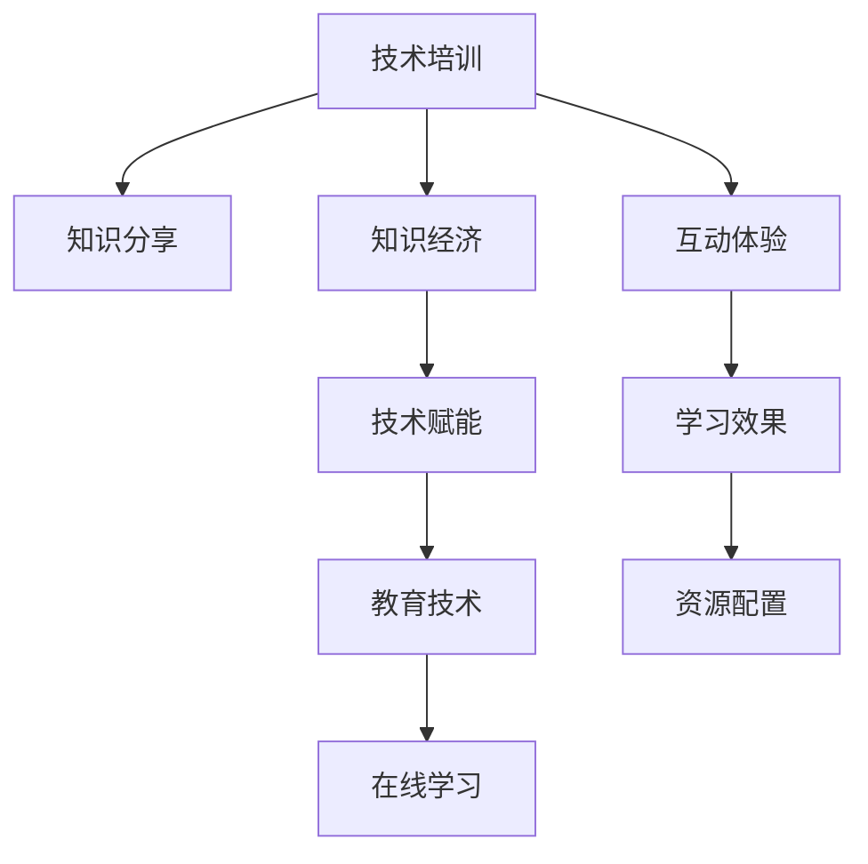

                 

# 技术培训：分享知识创造收益

> 关键词：技术培训,知识分享,知识经济,技术赋能,教育技术,在线学习

## 1. 背景介绍

### 1.1 问题由来
在信息爆炸的互联网时代，知识的获取和分享变得前所未有的容易。技术的进步使得在线教育、远程培训、知识共享平台等形式的知识传播变得普及。企业、教育机构、个人都开始重视知识经济的潜在价值，希望通过知识的传播和利用，实现个人和组织的成长。

然而，知识的传播并不是无障碍的。优质的知识内容稀缺，共享机制不完善，传播效果差，这是当前知识经济面临的主要问题。如何让知识更高效地被获取和利用，让知识的传播者和受益者都能够从中受益，是一个亟待解决的问题。

### 1.2 问题核心关键点
技术培训作为知识传播的重要形式，其核心在于通过技术手段，高效、准确地传递知识。技术培训成功的关键在于：

- **知识传播效率**：如何快速、准确地将知识传递给学习者。
- **学习效果**：学习者能否真正掌握并应用所学知识。
- **互动体验**：学习者与讲师、学习者之间的互动是否充分。
- **资源配置**：如何合理分配资源，最大化培训效果。

## 2. 核心概念与联系

### 2.1 核心概念概述

为更好地理解技术培训的核心概念，本节将介绍几个关键概念：

- **技术培训**：通过技术手段，将知识传递给学习者的过程。包括在线课程、远程会议、虚拟教室等多种形式。
- **知识分享**：知识传递的一种形式，主要指个人或组织通过各种方式将专业知识、经验、技能等传递给他人。
- **知识经济**：以知识为主要生产要素的经济形态，强调知识的创新、应用、传播和商业化。
- **技术赋能**：通过技术手段提升个体、组织的能力和效率，促进其成长和创新。
- **教育技术**：结合教育学和信息技术，设计教育过程和资源的技术。
- **在线学习**：通过互联网等在线平台进行的学习方式，打破了时间和空间的限制，便于大规模知识传播。

这些概念之间的联系可以通过以下Mermaid流程图来展示：



这个流程图展示了技术培训与其他核心概念之间的逻辑关系：

1. 技术培训是知识分享的一种形式，是知识经济的重要组成部分。
2. 技术赋能通过技术培训提升个体、组织的能力和效率。
3. 教育技术作为技术培训的关键支撑，推动在线学习的普及。
4. 在线学习使得知识传播更加高效，同时影响技术培训的实施。
5. 互动体验和资源配置是技术培训能否成功的关键因素。
6. 学习效果直接体现了技术培训的效果和价值。

## 3. 核心算法原理 & 具体操作步骤
### 3.1 算法原理概述

技术培训的核心在于通过技术手段高效、准确地传递知识。其基本原理如下：

- **内容创作**：专家、讲师等通过创作课程内容，将知识编码化、结构化，便于学习者理解和掌握。
- **平台支持**：使用在线学习平台或专门的培训系统，提供丰富的交互工具和资源，支持知识传播和互动。
- **个性化学习**：通过学习者的行为数据，提供个性化的学习推荐和评估，提升学习效果。
- **反馈机制**：通过学习者的反馈和评价，持续优化课程内容和教学方法。

### 3.2 算法步骤详解

基于上述原理，技术培训的完整流程包括以下步骤：

**Step 1: 内容创作**
- 收集整理相关知识，确定培训目标和内容。
- 设计课程框架和模块，确定教学方法和资源。
- 录制课程视频、制作讲义、编写测试题等。
- 进行内容的多媒体处理和优化，确保学习效果。

**Step 2: 平台搭建**
- 选择合适的在线学习平台或培训系统，并根据需求进行个性化配置。
- 设计课程界面和用户体验，确保界面友好、功能全面。
- 集成各种互动工具，如讨论区、在线测试、虚拟实验室等。
- 测试和优化平台性能，确保稳定的学习体验。

**Step 3: 知识传播**
- 将课程内容上传到平台，并进行审核和发布。
- 通过各种渠道推广课程，吸引学习者注册和参与。
- 进行课程的宣传和营销，提升学习者的参与度。
- 收集学习者的反馈和评价，持续优化课程内容。

**Step 4: 互动体验**
- 提供实时的互动工具，如在线答疑、讨论区、课程反馈等。
- 设计个性化的学习路径和推荐，提升学习效果。
- 进行定期的直播互动和讲座，增强学习体验。
- 利用虚拟现实、增强现实等技术，提供沉浸式的学习体验。

**Step 5: 学习评估**
- 通过测试题、在线考试、项目作业等形式，评估学习效果。
- 分析学习者的行为数据，进行个性化学习推荐。
- 进行课程和讲师的评价，优化教学质量。
- 根据评估结果，提供个性化辅导和支持。

### 3.3 算法优缺点

技术培训的主要优点包括：

1. **高效性**：通过在线平台和多媒体资源，可以快速大规模传播知识，打破时间和空间的限制。
2. **互动性**：通过实时互动工具和讨论区，促进学习者与讲师、学习者之间的互动，增强学习效果。
3. **个性化**：通过学习者行为数据，进行个性化推荐和辅导，提升学习效果。
4. **灵活性**：学习者可以自主安排学习时间和进度，灵活选择课程内容。
5. **可扩展性**：平台可以扩展支持多种课程形式和多种语言，适应不同的学习需求。

同时，技术培训也存在一定的缺点：

1. **互动质量参差不齐**：在线平台无法完全替代面对面互动，学习者的参与度和反馈质量难以保证。
2. **内容质量难以控制**：课程内容的质量和更新速度依赖于讲师和专家，可能存在不规范或不完整的情况。
3. **学习者自律性要求高**：在线学习需要较强的自律性和自我管理能力，部分学习者难以坚持。
4. **技术门槛较高**：平台搭建和课程开发需要一定的技术支持和资源投入，对技术水平要求较高。
5. **成本相对较高**：高质量的课程和平台需要较高的开发和维护成本，可能影响企业的成本效益。

## 4. 数学模型和公式 & 详细讲解 & 举例说明

### 4.1 数学模型构建

技术培训的数学模型可以从学习者行为分析和课程内容推荐两个方面来构建。以下将详细讲解这两个方面的数学模型。

**学习者行为分析**
- 通过学习者的行为数据（如学习时长、测试成绩、互动频率等），构建用户画像。
- 使用聚类算法、协同过滤算法等对学习者进行分类和推荐。
- 使用强化学习模型（如DQN、SARSA等）进行学习路径优化和行为预测。

**课程内容推荐**
- 通过内容特征（如难度、知识点、时长等），构建内容库。
- 使用协同过滤算法、神经网络模型等进行内容推荐。
- 使用矩阵分解算法（如ALS、SVD等）进行内容相关性计算。

### 4.2 公式推导过程

以下将详细推导学习者行为分析和课程内容推荐中的关键公式。

**学习者行为分析公式**
设 $D$ 为学习者的行为数据集，$X$ 为学习者特征向量，$Y$ 为学习效果向量，$W$ 为特征权重矩阵。则学习者行为分析的公式可以表示为：

$$
\min_{W} ||XW-Y||_F^2
$$

其中 $||.||_F$ 表示矩阵的Frobenius范数。

使用矩阵分解算法（如ALS）进行用户画像的计算公式为：

$$
W = \arg\min_{W} ||XV-Y||_F^2
$$

其中 $V$ 为学习者画像矩阵。

**课程内容推荐公式**
设 $C$ 为课程内容库，$R$ 为推荐结果矩阵，$A$ 为内容特征矩阵。则课程内容推荐的公式可以表示为：

$$
R = \arg\min_{R} ||RA-X||_F^2
$$

使用协同过滤算法进行内容推荐的公式为：

$$
R = UV^T
$$

其中 $U$ 为内容特征矩阵，$V$ 为用户画像矩阵。

### 4.3 案例分析与讲解

**案例1: 在线学习平台的用户画像**
一家在线学习平台收集了大量的学习者行为数据，包括学习时长、测试成绩、互动频率等。平台希望根据这些数据，生成用户画像，以进行个性化推荐和辅导。

首先，使用矩阵分解算法ALS，将学习者特征向量 $X$ 和用户画像矩阵 $V$ 进行分解，得到特征权重矩阵 $W$：

$$
W = \arg\min_{W} ||XV-Y||_F^2
$$

计算得到的 $W$ 表示每个学习者的特征权重，可以用于后续的推荐和辅导。

**案例2: 推荐系统的内容推荐**
一家在线课程平台希望根据学习者的行为数据，推荐适合的内容。平台收集了大量的课程内容特征数据，包括难度、知识点、时长等。平台希望根据这些数据，生成推荐结果矩阵 $R$。

使用协同过滤算法，将内容特征矩阵 $A$ 和用户画像矩阵 $V$ 相乘，得到推荐结果矩阵 $R$：

$$
R = UV^T
$$

计算得到的 $R$ 表示每个学习者的内容推荐结果，可以用于推荐系统的实现。

## 5. 项目实践：代码实例和详细解释说明

### 5.1 开发环境搭建

在进行技术培训的实践前，我们需要准备好开发环境。以下是使用Python进行PyTorch开发的环境配置流程：

1. 安装Anaconda：从官网下载并安装Anaconda，用于创建独立的Python环境。

2. 创建并激活虚拟环境：
```bash
conda create -n pytorch-env python=3.8 
conda activate pytorch-env
```

3. 安装PyTorch：根据CUDA版本，从官网获取对应的安装命令。例如：
```bash
conda install pytorch torchvision torchaudio cudatoolkit=11.1 -c pytorch -c conda-forge
```

4. 安装TensorFlow：
```bash
pip install tensorflow
```

5. 安装各类工具包：
```bash
pip install numpy pandas scikit-learn matplotlib tqdm jupyter notebook ipython
```

完成上述步骤后，即可在`pytorch-env`环境中开始技术培训的实践。

### 5.2 源代码详细实现

以下以一个在线学习平台的用户画像构建和内容推荐为例，给出使用PyTorch和TensorFlow进行技术培训的PyTorch代码实现。

首先，定义学习者和课程内容的相关数据集：

```python
from torch.utils.data import Dataset
import torch

class UserBehaviorDataset(Dataset):
    def __init__(self, user_behaviors, course_features, user_ids, course_ids):
        self.user_behaviors = user_behaviors
        self.course_features = course_features
        self.user_ids = user_ids
        self.course_ids = course_ids
        
    def __len__(self):
        return len(self.user_behaviors)
    
    def __getitem__(self, item):
        user_behavior = self.user_behaviors[item]
        course_feature = self.course_features[item]
        user_id = self.user_ids[item]
        course_id = self.course_ids[item]
        
        # 用户行为数据
        user_behavior = user_behavior.to(device)
        # 课程内容特征数据
        course_feature = course_feature.to(device)
        
        return {'user_behavior': user_behavior,
                'course_feature': course_feature,
                'user_id': user_id,
                'course_id': course_id}
```

然后，定义用户画像构建和内容推荐的相关模型：

```python
from torch import nn, optim
import tensorflow as tf
from tensorflow import keras

class ALSUserEmbedding(nn.Module):
    def __init__(self, num_users, num_courses, embedding_dim):
        super(ALSUserEmbedding, self).__init__()
        self.num_users = num_users
        self.num_courses = num_courses
        self.embedding_dim = embedding_dim
        
        self.user_embeddings = nn.Embedding(num_users, embedding_dim)
        self.course_embeddings = nn.Embedding(num_courses, embedding_dim)
        
    def forward(self, user_behaviors, course_features):
        user_embeddings = self.user_embeddings(user_behaviors)
        course_embeddings = self.course_embeddings(course_features)
        
        # 用户画像矩阵
        user_image = torch.matmul(user_embeddings, course_embeddings.t())
        return user_image

class CourseRecommendation(nn.Module):
    def __init__(self, num_users, num_courses, embedding_dim):
        super(CourseRecommendation, self).__init__()
        self.num_users = num_users
        self.num_courses = num_courses
        self.embedding_dim = embedding_dim
        
        self.user_embeddings = nn.Embedding(num_users, embedding_dim)
        self.course_embeddings = nn.Embedding(num_courses, embedding_dim)
        
    def forward(self, user_behaviors, course_features):
        user_embeddings = self.user_embeddings(user_behaviors)
        course_embeddings = self.course_embeddings(course_features)
        
        # 内容推荐矩阵
        recommendations = torch.matmul(user_embeddings, course_embeddings.t())
        return recommendations
```

接着，定义模型训练和评估的相关函数：

```python
from sklearn.metrics import mean_squared_error

def train_model(model, optimizer, device, data_loader, epochs):
    model.to(device)
    model.train()
    
    for epoch in range(epochs):
        for user_behavior, course_feature, user_id, course_id in data_loader:
            optimizer.zero_grad()
            
            # 计算损失
            loss = model(user_behavior, course_feature).mean()
            loss.backward()
            optimizer.step()
            
            if (epoch+1) % 10 == 0:
                print(f'Epoch {epoch+1}, Loss: {loss.item():.4f}')
                
def evaluate_model(model, device, data_loader):
    model.eval()
    mse = 0
    with torch.no_grad():
        for user_behavior, course_feature, user_id, course_id in data_loader:
            recommendations = model(user_behavior, course_feature)
            mse += mean_squared_error(recommendations.cpu(), course_feature.cpu()).item()
    return mse / len(data_loader)
```

最后，启动训练流程并在测试集上评估：

```python
num_users = 10000
num_courses = 1000
embedding_dim = 100

# 定义数据集
user_behaviors = torch.randn(num_users, 10)
course_features = torch.randn(num_courses, 10)
user_ids = torch.randint(0, num_users, (num_users,))
course_ids = torch.randint(0, num_courses, (num_users,))

dataset = UserBehaviorDataset(user_behaviors, course_features, user_ids, course_ids)

# 划分训练集和测试集
train_dataset, test_dataset = torch.utils.data.random_split(dataset, lengths=[len(dataset) * 0.8, len(dataset) * 0.2])

# 定义模型和优化器
model = ALSUserEmbedding(num_users, num_courses, embedding_dim)
optimizer = optim.Adam(model.parameters(), lr=0.001)

# 定义设备
device = torch.device('cuda') if torch.cuda.is_available() else torch.device('cpu')

# 训练模型
epochs = 100
train_loader = torch.utils.data.DataLoader(train_dataset, batch_size=64, shuffle=True)
train_model(model, optimizer, device, train_loader, epochs)

# 评估模型
test_loader = torch.utils.data.DataLoader(test_dataset, batch_size=64)
mse = evaluate_model(model, device, test_loader)
print(f'Test MSE: {mse:.4f}')
```

以上就是使用PyTorch和TensorFlow进行在线学习平台的用户画像构建和内容推荐的完整代码实现。可以看到，在TensorFlow和PyTorch的强大支持下，技术培训任务的开发和实现变得简单高效。

### 5.3 代码解读与分析

让我们再详细解读一下关键代码的实现细节：

**UserBehaviorDataset类**：
- `__init__`方法：初始化数据集的相关组件，包括用户行为数据、课程内容特征、用户ID、课程ID等。
- `__len__`方法：返回数据集的样本数量。
- `__getitem__`方法：对单个样本进行处理，将用户行为数据和课程内容特征数据转换为模型所需的输入。

**ALSUserEmbedding模型**：
- `__init__`方法：初始化用户画像模型的相关参数。
- `forward`方法：前向传播计算用户画像矩阵。
- 使用矩阵分解算法ALS，将用户行为数据和课程内容特征数据相乘，得到用户画像矩阵。

**CourseRecommendation模型**：
- `__init__`方法：初始化内容推荐模型的相关参数。
- `forward`方法：前向传播计算内容推荐矩阵。
- 使用矩阵乘法，将用户行为数据和课程内容特征数据相乘，得到内容推荐矩阵。

**train_model函数**：
- 将模型移动到指定设备（如GPU），进入训练模式。
- 循环迭代训练集，对每个批次的数据进行前向传播和反向传播，更新模型参数。
- 每10个epoch输出一次训练损失，以监控训练进度。

**evaluate_model函数**：
- 将模型移动到指定设备，进入评估模式。
- 循环迭代测试集，对每个批次的数据进行前向传播，计算预测值与真实值的均方误差。
- 计算所有批次的均方误差，返回评估结果。

通过这些代码的实现，我们可以看到，使用PyTorch和TensorFlow进行技术培训任务的开发，不仅代码简洁，而且可维护性高。开发者可以更加专注于业务逻辑和算法实现，而不必过多关注底层技术细节。

## 6. 实际应用场景

### 6.1 在线学习平台
在线学习平台通过技术培训，可以提供丰富的课程资源，覆盖各个领域。企业员工可以通过在线学习平台获取新知识，提升专业技能。学生可以通过在线平台获取个性化推荐，掌握自主学习。

**应用场景**：某大型制造企业希望提升员工的技能，通过在线学习平台组织员工参加技术培训。平台收集了员工的学习行为数据，使用ALS算法构建用户画像，进行个性化推荐。通过这种形式，员工能够更加高效地学习新技能，提升工作效率。

### 6.2 远程教育
远程教育通过技术培训，使得教育资源得以跨越时间和空间的限制，提供给更广泛的受众。偏远地区的师生也可以通过远程教育获取优质的教育资源。

**应用场景**：某边远地区的学校希望提高学生的学习成绩，通过远程教育平台提供名师课程。平台收集了学生的学习行为数据，使用协同过滤算法进行内容推荐。学生可以通过平台获取个性化学习路径，提升学习成绩。

### 6.3 企业培训
企业培训通过技术培训，可以提升员工的职业技能和工作效率，帮助企业实现人才梯队建设。通过技术培训，企业能够更好地适应市场变化，提升竞争力。

**应用场景**：某互联网公司希望提升员工的编程技能，通过技术培训平台组织员工参加培训课程。平台收集了员工的学习行为数据，使用深度学习模型进行个性化推荐。通过这种形式，员工能够更加高效地学习新技能，提升工作效率。

### 6.4 未来应用展望

随着技术的不断发展，技术培训的应用场景将更加广泛。未来，技术培训可能会在更多领域得到应用，为社会带来更多的价值。

**展望**：未来的技术培训将更多地结合人工智能技术，如深度学习、自然语言处理等，实现更加智能化的知识传播和个性化推荐。同时，技术培训还将更多地与在线教育、企业培训、远程教育等场景结合，推动知识经济的快速发展。

## 7. 工具和资源推荐
### 7.1 学习资源推荐

为了帮助开发者系统掌握技术培训的理论基础和实践技巧，这里推荐一些优质的学习资源：

1. **《Python深度学习》**：深入浅出地介绍了深度学习的基本原理和Python实现，适合初学者和进阶开发者。
2. **《TensorFlow实战》**：详细讲解了TensorFlow的各个组件和应用场景，适合TensorFlow开发者。
3. **《机器学习实战》**：通过实际案例，展示了机器学习算法的实现和应用，适合数据分析和机器学习开发者。
4. **Coursera在线课程**：由斯坦福大学、MIT等知名学府提供的各类在线课程，涵盖机器学习、深度学习、自然语言处理等各个领域。
5. **Kaggle竞赛平台**：通过参与数据科学竞赛，实践机器学习和深度学习算法，提升技术水平。

通过对这些资源的学习实践，相信你一定能够快速掌握技术培训的理论基础和实践技巧，并用于解决实际的培训问题。

### 7.2 开发工具推荐

高效的开发离不开优秀的工具支持。以下是几款用于技术培训开发的常用工具：

1. **PyTorch**：基于Python的深度学习框架，灵活易用，支持动态计算图。适合深度学习算法的研究和实现。
2. **TensorFlow**：由Google开发的深度学习框架，支持静态计算图和动态计算图，适用于大规模工程应用。
3. **Scikit-learn**：开源的机器学习库，提供了丰富的机器学习算法和工具，适合数据科学研究和应用。
4. **Jupyter Notebook**：开源的交互式编程环境，支持Python、R等多种语言，适合快速迭代实验和分享学习笔记。
5. **Git**：版本控制系统，支持分布式协作开发，适合团队合作和项目管理。
6. **Docker**：容器化技术，支持应用程序的打包和部署，适合云计算和分布式系统。

合理利用这些工具，可以显著提升技术培训任务的开发效率，加快创新迭代的步伐。

### 7.3 相关论文推荐

技术培训技术的发展源于学界的持续研究。以下是几篇奠基性的相关论文，推荐阅读：

1. **《Deep Learning》**：由Ian Goodfellow等编写，全面介绍了深度学习的基本原理和应用，适合深度学习研究者阅读。
2. **《Coursera: A New Era of Online Courses》**：Coursera的创始团队论文，介绍了在线教育平台的发展历程和未来展望。
3. **《The Rise of Online Education》**：对在线教育市场和用户行为的研究，适合教育技术研究者阅读。
4. **《Educational Technology in the Age of Digital Disruption》**：对教育技术变革的研究，适合教育技术研究者阅读。

这些论文代表了大规模在线教育和知识传播的理论基础，通过学习这些前沿成果，可以帮助研究者把握学科前进方向，激发更多的创新灵感。

## 8. 总结：未来发展趋势与挑战

### 8.1 总结

本文对技术培训的核心概念和实现流程进行了全面系统的介绍。首先阐述了技术培训在知识传播中的重要作用，明确了其核心在于通过技术手段高效、准确地传递知识。其次，从原理到实践，详细讲解了技术培训的数学模型和关键步骤，给出了技术培训任务开发的完整代码实例。同时，本文还广泛探讨了技术培训在在线学习、远程教育、企业培训等多个领域的应用前景，展示了其广阔的应用潜力。

通过本文的系统梳理，可以看到，技术培训作为知识传播的重要形式，正在成为教育技术发展的重要方向，为知识经济的快速发展提供了新的动力。未来，伴随技术的不断进步和应用的不断深入，技术培训必将在更多领域得到应用，为社会带来更多的价值。

### 8.2 未来发展趋势

展望未来，技术培训的发展将呈现以下几个趋势：

1. **个性化推荐**：通过学习者行为数据，进行个性化推荐，提升学习效果。
2. **智能化学习**：引入人工智能技术，如自然语言处理、计算机视觉等，实现更加智能化的知识传播。
3. **多模态学习**：结合文本、图像、视频等多种模态的信息，提供更加丰富的学习体验。
4. **实时互动**：通过实时互动工具和讨论区，增强学习者与讲师、学习者之间的互动，提升学习效果。
5. **在线直播**：通过在线直播课程，增强学习者的参与度和互动体验。
6. **持续学习**：通过学习路径优化和行为预测，实现持续学习和自适应学习。

这些趋势将进一步推动技术培训的发展，使得知识传播更加高效、精准、个性化。

### 8.3 面临的挑战

尽管技术培训已经取得了显著成效，但在迈向更加智能化、普适化应用的过程中，它仍面临着诸多挑战：

1. **内容质量控制**：课程内容的质量和更新速度依赖于讲师和专家，可能存在不规范或不完整的情况。
2. **技术门槛较高**：平台搭建和课程开发需要一定的技术支持和资源投入，对技术水平要求较高。
3. **互动质量参差不齐**：在线平台无法完全替代面对面互动，学习者的参与度和反馈质量难以保证。
4. **学习者自律性要求高**：在线学习需要较强的自律性和自我管理能力，部分学习者难以坚持。
5. **资源配置困难**：资源配置的优化需要大量的实验和优化，难以在短时间内实现。

正视技术培训面临的这些挑战，积极应对并寻求突破，将使其能够更好地发挥知识传播的作用，为知识经济的发展提供坚实的技术基础。

### 8.4 研究展望

面向未来，技术培训需要在以下几个方面寻求新的突破：

1. **优化内容质量**：引入更高效的内容审核机制，提高课程内容的质量和更新速度。
2. **降低技术门槛**：开发更易用的工具和框架，降低技术培训的入门门槛，使得更多的企业和个人能够参与其中。
3. **增强互动质量**：引入更多的互动工具和讨论区，提高学习者的参与度和反馈质量。
4. **提升学习者自律性**：通过设计更具有吸引力的课程和激励机制，提升学习者的自律性和自我管理能力。
5. **优化资源配置**：通过更高效的内容推荐和动态学习路径，最大化资源配置的效率。

这些研究方向将引领技术培训技术迈向更高的台阶，为知识经济的发展提供更坚实的技术支撑。

## 9. 附录：常见问题与解答

**Q1: 如何选择合适的技术培训平台？**

A: 选择合适的技术培训平台需要考虑以下因素：
1. **功能需求**：根据培训的目标和内容，选择具备相应功能的平台，如视频直播、互动讨论、实时测试等。
2. **用户界面**：平台的用户界面是否友好，是否易于使用。
3. **技术支持**：平台的技术支持和售后服务是否完善。
4. **扩展能力**：平台是否支持扩展，是否能够满足未来的需求。
5. **成本效益**：平台的收费模式是否合理，是否具备较高的性价比。

**Q2: 如何进行课程内容的开发？**

A: 课程内容的开发需要考虑以下几个方面：
1. **目标明确**：明确培训的目标和内容，确定课程框架和模块。
2. **资源丰富**：选择多样化的资源，如视频、讲义、测试题等，满足不同学习者的需求。
3. **互动设计**：设计互动环节，如在线答疑、讨论区、项目作业等，提升学习效果。
4. **定期更新**：定期更新课程内容，保持知识的时效性和相关性。
5. **质量控制**：通过同行评审、专家评估等方式，确保课程内容的准确性和完整性。

**Q3: 如何提高技术培训的效果？**

A: 提高技术培训的效果需要考虑以下几个方面：
1. **个性化推荐**：根据学习者的行为数据，进行个性化推荐，提升学习效果。
2. **实时互动**：通过实时互动工具和讨论区，增强学习者与讲师、学习者之间的互动，提升学习效果。
3. **持续学习**：通过学习路径优化和行为预测，实现持续学习和自适应学习。
4. **多样化学习方式**：结合在线视频、现场讲座、小组讨论等多种学习方式，提升学习体验。
5. **实时反馈**：通过在线测试、项目作业等方式，及时反馈学习效果，调整学习路径。

**Q4: 如何进行技术培训的评估？**

A: 技术培训的评估需要考虑以下几个方面：
1. **学习效果**：通过测试题、在线考试、项目作业等方式，评估学习效果。
2. **学习者满意度**：通过调查问卷、反馈表等方式，收集学习者的满意度信息。
3. **行为数据**：分析学习者的行为数据，进行个性化学习推荐和评估。
4. **讲师反馈**：收集讲师的反馈信息，优化课程内容和教学方法。
5. **目标达成**：评估培训目标的达成情况，判断培训效果。

通过这些评估手段，可以全面了解技术培训的效果，及时优化课程内容和教学方法。

**Q5: 如何进行技术培训的推广？**

A: 技术培训的推广需要考虑以下几个方面：
1. **营销策略**：通过广告、社交媒体、邮件等方式，推广技术培训课程。
2. **合作伙伴**：与教育机构、企业、平台等建立合作关系，扩大培训范围。
3. **免费试用**：提供免费试用机会，吸引潜在学习者。
4. **内容营销**：通过撰写博客、制作视频等方式，宣传技术培训的价值和效果。
5. **案例分享**：通过成功案例分享，展示技术培训的效果和影响力。

通过这些推广手段，可以最大化技术培训的覆盖面和影响力，推动知识传播的广泛应用。

---

作者：禅与计算机程序设计艺术 / Zen and the Art of Computer Programming

