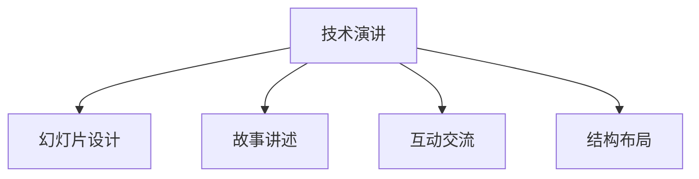

                 

# 技术演讲：打造个人TED演讲的成功之路

## 1. 背景介绍

### 1.1 问题由来

在当今数字化时代，技术演讲不仅是展示个人技术实力的绝佳机会，更是构建个人品牌、拓展职业发展的重要途径。TED演讲以其简洁而富有洞见的风格，赢得了全球观众的喜爱。然而，技术演讲并不仅局限于TED，它的影响力和技巧适用于所有形式的公共演讲和在线分享。

### 1.2 问题核心关键点

技术演讲的核心关键点在于内容的有深度和呈现的吸引力。如何在一番简短的时间内，清晰而有力地传达复杂的技术概念，同时吸引并保持听众的兴趣，是技术演讲的难点和挑战。

### 1.3 问题研究意义

掌握技术演讲的技巧，不仅能够显著提升个人在技术社区的知名度和影响力，还能够增强在实际工作中的应用能力，如技术分享、团队培训、技术销售等。更广泛地说，技术演讲能力是培养领导力、提升公众表达能力的关键，对个人和组织的长期发展具有重要意义。

## 2. 核心概念与联系

### 2.1 核心概念概述

为了更好地理解技术演讲的构建与实践，本节将介绍几个关键概念：

- **技术演讲**：以技术为主题，向非技术背景的听众传达复杂技术概念的演讲形式。
- **幻灯片设计**：演讲中使用的视觉辅助工具，包括文字、图像、图表等，以增强信息传达的效率和效果。
- **故事讲述**：通过构建引人入胜的故事，使技术内容更具吸引力，同时加深听众的情感共鸣。
- **互动交流**：在演讲中加入问答环节，鼓励听众参与讨论，增强演讲的互动性和参与感。
- **结构布局**：一个清晰、逻辑严密的结构布局，确保演讲内容条理清晰、易于理解。

这些核心概念通过以下Mermaid流程图展示其逻辑关系：



## 3. 核心算法原理 & 具体操作步骤

### 3.1 算法原理概述

技术演讲的本质是一个有目的的信息传递过程，其核心在于如何在有限的时间内，将复杂的技术知识高效、有趣地传达给听众。技术演讲的算法原理可以从以下几个方面进行理解：

- **信息简化**：将复杂技术问题简化为易于理解的核心概念和关键点。
- **情感连接**：通过故事讲述和互动交流，建立听众与技术内容的情感连接，增强信息的接受度。
- **结构优化**：合理规划演讲内容结构，确保信息的逻辑性和连贯性。

### 3.2 算法步骤详解

技术演讲的详细步骤可概括为以下几个关键步骤：

**Step 1: 确定演讲主题和目标受众**
- 选择观众感兴趣且与你专业领域相关的技术话题。
- 明确演讲的主要目标，如教育、启发、技术展示等。

**Step 2: 设计演讲结构和内容**
- 定义演讲的主要部分，如引言、背景、核心内容、应用场景和总结。
- 确保每个部分内容简洁明了，避免冗长和复杂的技术细节。

**Step 3: 制作幻灯片和视觉辅助材料**
- 使用简洁、清晰的图表、图像和文字，避免使用过多的技术术语。
- 确保视觉辅助材料能够有效支持演讲内容，而不是分散听众注意力。

**Step 4: 讲述故事和增强互动**
- 构建一个引人入胜的故事框架，将技术内容融入其中。
- 设计互动环节，如问答、小组讨论，鼓励听众参与。

**Step 5: 排练和反馈调整**
- 多次排练，确保演讲流畅自然。
- 获取反馈，不断改进和优化演讲内容和表现。

### 3.3 算法优缺点

技术演讲的优点包括：
- **高效传达**：通过简洁明了的内容和结构，快速传达复杂技术。
- **增强互动**：通过互动环节，提升听众的参与感和兴趣。
- **灵活调整**：根据反馈进行调整，不断改进演讲效果。

然而，其缺点也不可忽视：
- **准备要求高**：需要精心设计演讲内容，确保信息的准确性和易理解性。
- **依赖演讲者技巧**：演讲者的语言表达和现场应对能力直接影响演讲效果。

### 3.4 算法应用领域

技术演讲的应用领域广泛，包括但不限于：
- **技术分享会议**：如Google I/O、Apple WWDC等，分享最新的技术进展。
- **企业内部培训**：如产品发布会、团队培训等，教育团队成员。
- **学术演讲**：如学术会议、技术研讨会，向同行展示研究成果。
- **技术咨询**：向客户展示技术方案，提供解决方案。

## 4. 数学模型和公式 & 详细讲解 & 举例说明

### 4.1 数学模型构建

技术演讲的数学模型构建主要涉及信息的传递和接收过程。这里简要介绍一个基本模型，并说明其构建方式：

- **演讲者-听众模型**：
  - **输入**：演讲者准备的技术知识、幻灯片设计、故事框架。
  - **输出**：听众对技术内容的理解和兴趣。
  - **干扰因素**：听众的背景知识、现场环境、演讲者的表达能力。

### 4.2 公式推导过程

基于上述模型，可以推导出一些基本的公式和策略，帮助优化演讲效果：

- **信息简化公式**：
  $$
  I_{\text{简化的}} = f(I_{\text{原始}}, C)
  $$
  其中 $I_{\text{简化的}}$ 是简化后的信息量，$I_{\text{原始}}$ 是原始信息量，$C$ 是演讲者对内容的认知和选择能力。

- **情感连接公式**：
  $$
  E = g(S, A)
  $$
  其中 $E$ 是情感连接度，$S$ 是演讲中的故事元素，$A$ 是听众的个体特征和现场氛围。

### 4.3 案例分析与讲解

以Google I/O上的一次演讲为例，演讲者通过展示Google AI技术的最新应用，清晰地传达了AI在生活各个方面的深远影响。演讲者首先通过一个日常生活的场景，引出了AI技术的实际应用，然后通过图表和动画详细说明了技术的工作原理和优势。最后，演讲者分享了Google的AI伦理原则，增强了听众对技术的信任感。

## 5. 项目实践：代码实例和详细解释说明

### 5.1 开发环境搭建

为确保技术演讲的质量，推荐使用以下开发环境：

- **工具**：PowerPoint、Keynote等幻灯片制作工具。
- **平台**：Zoom、Slido等在线演讲平台。
- **资源**：访问TED演讲视频、Slideshare等资源平台，学习优秀演讲者的技巧。

### 5.2 源代码详细实现

虽然技术演讲的“代码实现”主要在幻灯片设计和演讲内容的安排上，但这里仍可以提供一些实用的代码示例：

```python
# 示例幻灯片代码，使用Python与Matplotlib库生成图表
import matplotlib.pyplot as plt

# 准备数据
x = [1, 2, 3, 4, 5]
y = [2, 4, 5, 4, 3]

# 生成图表
plt.plot(x, y)
plt.xlabel('X')
plt.ylabel('Y')
plt.title('A Simple Plot')
plt.show()
```

### 5.3 代码解读与分析

在上述代码中，我们使用了Python的Matplotlib库来生成一个简单的线性回归图表。这个图表展示了X和Y之间的关系，直观地表达了技术内容的某个特征。

### 5.4 运行结果展示

运行上述代码后，会生成一个图表，直观展示了数据点与拟合直线之间的关系。

## 6. 实际应用场景

### 6.1 技术分享会议

在技术分享会议上，技术演讲可以展示最新技术进展，激励听众进行进一步的研发和探索。例如，Google I/O通过一系列技术演讲，展示了Google在AI、云计算、操作系统等领域的最新成果，激发全球开发者对技术的热情。

### 6.2 企业内部培训

技术演讲在企业内部培训中，可以高效地传达复杂技术，并促进团队成员的协作和沟通。例如，Amazon通过内部的技术演讲活动，提升员工对AWS、Alexa等核心技术的理解和应用。

### 6.3 学术演讲

在学术演讲中，技术演讲能够向同行展示研究成果，促进学术交流和合作。例如，MIT在AI会议上展示了其在AI伦理、机器学习等领域的最新成果，推动了学术界的深入讨论和合作。

### 6.4 技术咨询

技术演讲在技术咨询过程中，可以向客户展示技术方案，提供具体的解决方案。例如，IBM通过技术演讲向客户展示其AI和云计算服务，帮助客户提升业务效率和竞争力。

## 7. 工具和资源推荐

### 7.1 学习资源推荐

为提升技术演讲的能力，推荐以下学习资源：

- **书籍**：
  - 《TED演讲秘籍：如何用简单的故事打动人心》
  - 《演讲的力量：如何在演讲中实现深度连接》
  - 《PPT设计之美：从构思到演示》

- **在线课程**：
  - Coursera的《有效演讲和演示》
  - Udemy的《TED演讲技巧》
  - LinkedIn Learning的《公共演讲和演讲技巧》

- **资源平台**：
  - TED演讲视频和字幕
  - SlideShare上的优秀幻灯片分享
  - YouTube上的技术演讲频道

### 7.2 开发工具推荐

为确保技术演讲的质量，推荐以下开发工具：

- **幻灯片制作工具**：
  - PowerPoint、Keynote、Prezi等
- **在线演讲平台**：
  - Zoom、Slido、Remo等
- **演示软件**：
  - Google Slides、SlideShare、Slidebean等

### 7.3 相关论文推荐

为深入理解技术演讲的理论基础和实践技巧，推荐以下论文：

- 《情感在演讲中的作用：理论与实证研究》
- 《有效故事讲述的心理学基础》
- 《技术演讲中的信息传递与情感连接》

## 8. 总结：未来发展趋势与挑战

### 8.1 研究成果总结

技术演讲作为一种高效、灵活的信息传递方式，已经在多个领域展示了其独特优势。通过不断的实践和理论研究，技术演讲的方法和技术也在不断进化和提升。

### 8.2 未来发展趋势

未来，技术演讲将呈现以下几个发展趋势：

- **融合技术创新**：随着新兴技术的不断涌现，技术演讲将更多地融合AR、VR等前沿技术，提升演讲的互动性和沉浸感。
- **增强情感连接**：通过更加深入的故事讲述和情感设计，使技术演讲更具感染力。
- **提升互动性**：利用AI技术，如智能问答系统，实现更高效的互动交流。

### 8.3 面临的挑战

尽管技术演讲具有诸多优点，但在实现过程中仍面临以下挑战：

- **准备复杂度**：精心设计幻灯片和内容需要大量的时间和精力。
- **依赖演讲者技巧**：演讲者的表现直接影响演讲效果。
- **技术复杂度**：如何在简短的时间内传达复杂技术，需要高度的抽象和概括能力。

### 8.4 研究展望

未来，技术演讲的研究将更加关注以下几个方面：

- **自动化工具**：开发能够辅助演讲者准备和优化演讲内容的工具，减少重复劳动。
- **多模态结合**：探索将视频、音频等多模态数据与演讲内容结合的方法，提升演讲效果。
- **情感分析**：通过情感分析技术，实时监测听众的反应，优化演讲策略。

## 9. 附录：常见问题与解答

### 9.1 问题Q1：如何进行有效的技术演讲准备？

**A**：有效的技术演讲准备包括：
- 深入了解演讲主题，简化复杂信息。
- 构建引人入胜的故事框架，增强情感连接。
- 多次排练，确保演讲流畅自然。
- 获取反馈，不断改进和优化演讲内容。

### 9.2 问题Q2：如何提升演讲者的表达能力？

**A**：提升演讲者的表达能力：
- 定期参加公共演讲俱乐部，如Toastmasters。
- 参加演讲培训课程，学习表达技巧和声音控制。
- 多观察优秀演讲者的表现，学习其优点。

### 9.3 问题Q3：如何在技术演讲中高效传递信息？

**A**：在技术演讲中高效传递信息：
- 使用简洁明了的幻灯片设计。
- 避免使用过多的技术术语。
- 通过故事讲述和互动交流，增强信息的接受度。

### 9.4 问题Q4：如何在技术演讲中增强互动？

**A**：在技术演讲中增强互动：
- 设计问答环节，鼓励听众提问。
- 利用在线工具，如Slido，实时展示和回答听众问题。
- 组织小组讨论，鼓励听众分组讨论技术问题。

---

作者：禅与计算机程序设计艺术 / Zen and the Art of Computer Programming

