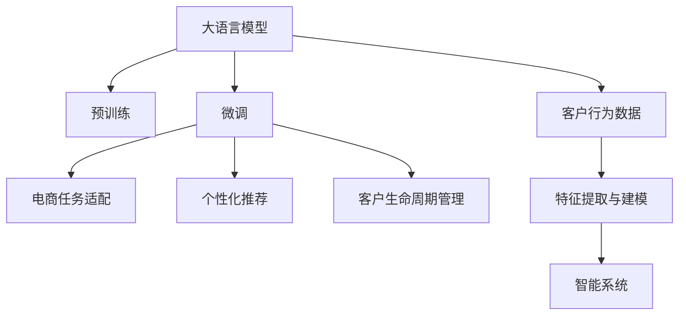

                 

# 探索基于大模型的电商智能客户生命周期管理系统

> 关键词：大语言模型,电商,客户生命周期管理,智能推荐,自然语言处理,NLP

## 1. 背景介绍

在数字化转型和电子商务的驱动下，客户生命周期管理(Customer Lifecycle Management, CLM)已成为电商企业优化运营效率和提升客户满意度的关键手段。传统上，CLM系统依赖于复杂的规则和手动调参，难以快速响应市场变化和客户需求。而随着大语言模型和自然语言处理(NLP)技术的进步，基于大模型的电商智能客户生命周期管理系统应运而生，通过深度学习和大规模预训练模型，实现了对客户数据的深度分析和个性化推荐，大大提升了电商平台的客户体验和运营效率。

### 1.1 问题由来

在电商领域，用户行为和反馈数据量巨大且多维度，如何高效分析这些数据并转化为可操作的策略，是电商企业的普遍难题。传统的数据分析和推荐系统往往依赖于人工提取特征和调参，效率低下且难以适应实时变化的市场需求。为此，电商企业亟需一种能够实时处理海量客户数据、提供个性化推荐和运营优化建议的系统，以保持竞争力。

大语言模型的出现为这一需求提供了新的解决方案。通过在电商平台的客户行为数据上进行大规模预训练，大模型可以自动学习到用户行为的规律和趋势。在此基础上，利用微调等技术，结合电商领域特有的商品、交易、广告等数据，进一步优化模型，实现对客户生命周期的智能管理。

### 1.2 问题核心关键点

基于大模型的电商智能客户生命周期管理系统，核心关键点包括：

- **数据预处理**：收集并清洗电商平台的客户数据，包括浏览历史、购买记录、评价反馈、搜索行为等。
- **特征提取与建模**：利用大语言模型自动提取用户行为特征，构建用户行为模型。
- **微调与优化**：根据电商领域特定任务，对大模型进行微调，优化其推荐和运营策略输出。
- **个性化推荐与营销**：基于用户行为模型，个性化推荐商品和优惠活动，提升用户满意度。
- **实时监控与动态调整**：实时监控系统运行效果，动态调整模型参数，确保模型输出始终与市场趋势保持一致。

这些关键点共同构成了一个完整的基于大模型的电商智能客户生命周期管理系统。通过有效整合电商数据和大模型技术，该系统能够实现对客户生命周期的智能管理，帮助电商企业提升运营效率和客户满意度。

### 1.3 问题研究意义

研究基于大模型的电商智能客户生命周期管理系统，对于电商企业及其客户都具有重要意义：

1. **提升客户体验**：通过个性化推荐和精准营销，提升客户满意度和忠诚度。
2. **优化运营效率**：实时监控和动态调整，优化库存管理、营销策略等运营决策。
3. **提高市场竞争力**：快速响应市场变化，提供更加灵活和高效的运营解决方案。
4. **促进技术创新**：推动NLP和大模型技术在电商领域的深入应用，促进电商企业技术升级。
5. **赋能商业增长**：利用客户数据进行深入分析，挖掘潜在商业机会，提升电商企业盈利能力。

本文旨在探讨大语言模型在电商智能客户生命周期管理系统中的应用，详细分析其原理、实践和未来趋势，为电商企业提供有益的参考和建议。

## 2. 核心概念与联系

### 2.1 核心概念概述

为更好地理解基于大模型的电商智能客户生命周期管理系统，本节将介绍几个核心概念：

- **大语言模型(Large Language Model, LLM)**：以自回归(如GPT)或自编码(如BERT)模型为代表的大规模预训练语言模型。通过在海量文本数据上进行预训练，学习通用的语言表示，具备强大的语言理解和生成能力。

- **客户生命周期管理(Customer Lifecycle Management, CLM)**：对客户从初次接触、初次购买到多次购买、流失或复购等各个阶段进行管理的过程，以提高客户满意度和企业收益。

- **个性化推荐(Recommendation System, RS)**：根据用户的历史行为和偏好，推荐可能感兴趣的商品或服务，提升用户满意度和转化率。

- **自然语言处理(Natural Language Processing, NLP)**：涉及计算机与人类语言交互的多种技术，包括文本分类、实体识别、信息抽取等，是实现大模型微调的重要技术手段。

- **Transformer模型**：一种常用的神经网络结构，通过自注意力机制实现高效的序列建模，广泛应用于预训练语言模型中。

- **微调(Fine-Tuning)**：指在预训练模型的基础上，使用下游任务的少量标注数据，通过有监督学习优化模型在该任务上的性能。

这些核心概念之间的逻辑关系可以通过以下Mermaid流程图来展示：



这个流程图展示了从数据预处理到最终客户生命周期管理的全流程：

1. 通过大语言模型对客户行为数据进行预训练，获取通用的语言表示。
2. 针对电商领域特定任务进行微调，构建任务适配层，提升模型在该任务上的性能。
3. 基于微调后的模型，构建个性化推荐和客户生命周期管理系统。
4. 利用客户行为数据进行特征提取和建模，生成智能系统。

这些核心概念共同构成了基于大模型的电商智能客户生命周期管理系统，旨在通过深度学习和大规模预训练模型，实现对客户生命周期的智能管理。

## 3. 核心算法原理 & 具体操作步骤
### 3.1 算法原理概述

基于大模型的电商智能客户生命周期管理系统，核心算法原理是利用深度学习和自然语言处理技术，对电商客户的浏览、购买、评价等行为数据进行建模和分析，自动提取用户行为特征，并通过微调优化模型，实现个性化推荐和客户生命周期管理。

形式化地，假设客户数据集为 $D=\{(x_i,y_i)\}_{i=1}^N$，其中 $x_i$ 为历史行为记录，$y_i$ 为标签（如购买、流失等）。预训练模型为 $M_{\theta}$，其中 $\theta$ 为预训练得到的模型参数。电商任务的适配层为 $f$，输出为推荐商品或运营策略。

微调的目标是最小化损失函数 $\mathcal{L}(\theta)$，使得模型输出与真实标签一致，即：

$$
\theta^* = \mathop{\arg\min}_{\theta} \mathcal{L}(M_{\theta},D)
$$

其中，$\mathcal{L}$ 为任务特定的损失函数，如交叉熵损失、均方误差损失等。

### 3.2 算法步骤详解

基于大模型的电商智能客户生命周期管理系统，一般包括以下几个关键步骤：

**Step 1: 准备客户数据**

1. 收集客户数据：从电商平台收集客户的浏览记录、购买记录、评价记录等数据。
2. 数据清洗与预处理：去除噪声数据，处理缺失值，进行特征工程，提取有用特征。

**Step 2: 数据编码与特征提取**

1. 文本编码：将客户行为数据转换为模型的输入格式，通常为文本形式。
2. 特征提取：利用大语言模型自动提取特征，如文本中的关键词、时间序列等。

**Step 3: 模型初始化与预训练**

1. 初始化模型：选择合适的预训练模型，如BERT、GPT等，作为初始化参数。
2. 预训练模型：在大规模客户行为数据上进行预训练，学习通用的语言表示。

**Step 4: 任务适配层设计**

1. 任务适配层设计：根据电商任务特点，设计适配层，如分类、匹配、生成等。
2. 损失函数选择：选择合适的损失函数，如交叉熵、均方误差等。

**Step 5: 微调与优化**

1. 微调模型：在预训练模型基础上，使用电商任务标注数据进行微调，优化任务适配层。
2. 优化策略：选择合适的优化器（如AdamW、SGD等），设置合适的学习率，应用正则化技术（如L2正则、Dropout等），防止过拟合。

**Step 6: 个性化推荐与客户生命周期管理**

1. 个性化推荐：利用微调后的模型对用户进行个性化推荐，提升用户满意度。
2. 客户生命周期管理：实时监控系统运行效果，动态调整模型参数，确保系统输出始终与市场趋势保持一致。

**Step 7: 系统集成与部署**

1. 系统集成：将微调后的模型集成到电商平台的推荐和运营系统中。
2. 系统部署：部署到生产环境，进行性能测试和优化。

以上是基于大模型的电商智能客户生命周期管理系统的完整流程。通过系统化的数据处理和模型训练，该系统能够实现对客户生命周期的智能管理，提升电商平台的运营效率和客户满意度。

### 3.3 算法优缺点

基于大模型的电商智能客户生命周期管理系统，具有以下优点：

1. **高效性**：利用大模型自动提取特征和建模，减少了手动调参的时间和精力。
2. **适应性**：微调模型能够快速适应市场变化和客户需求，提供实时更新的推荐和策略。
3. **准确性**：通过大规模预训练和大模型微调，模型能够学习到深层次的客户行为规律，提升推荐和运营的准确性。
4. **可扩展性**：模型可以轻松扩展到其他电商领域，如服装、食品、美妆等。

同时，该方法也存在以下局限性：

1. **数据依赖**：微调效果依赖于标注数据的质量和数量，获取高质量标注数据成本较高。
2. **泛化能力**：模型在新场景和新用户上的泛化能力有限，需要进行更多数据和模型的优化。
3. **计算资源**：大规模预训练和大模型微调需要大量计算资源，可能对硬件设备提出较高要求。
4. **模型复杂性**：大模型参数量庞大，模型结构复杂，调试和优化难度较大。

尽管存在这些局限性，但就目前而言，基于大模型的电商智能客户生命周期管理系统仍是一种高效、灵活且具有潜力的电商推荐和运营解决方案。

### 3.4 算法应用领域

基于大模型的电商智能客户生命周期管理系统，在电商领域的应用已经逐渐成熟。以下是几个主要应用领域：

1. **个性化推荐系统**：利用客户行为数据，自动提取特征，通过微调优化模型，实现个性化推荐，提升用户满意度和转化率。
2. **客户流失预测与召回**：分析客户行为数据，预测客户流失风险，进行精准召回，提升客户保留率。
3. **营销活动优化**：利用客户行为数据，优化营销活动策略，提升广告效果和营销ROI。
4. **库存管理**：根据客户需求预测，优化库存管理，避免缺货和库存积压。
5. **搜索与分类**：根据客户行为数据，优化搜索结果和分类标签，提升用户搜索体验。

这些应用领域展示了基于大模型的电商智能客户生命周期管理系统的广泛应用前景，为电商企业提供了多种场景下的智能解决方案。

## 4. 数学模型和公式 & 详细讲解  
### 4.1 数学模型构建

本节将使用数学语言对基于大模型的电商智能客户生命周期管理系统的核心算法进行严格刻画。

假设客户数据集为 $D=\{(x_i,y_i)\}_{i=1}^N$，其中 $x_i$ 为历史行为记录，$y_i$ 为标签（如购买、流失等）。预训练模型为 $M_{\theta}$，其中 $\theta$ 为预训练得到的模型参数。电商任务的适配层为 $f$，输出为推荐商品或运营策略。

定义模型 $M_{\theta}$ 在输入 $x$ 上的输出为 $\hat{y}=M_{\theta}(x)$，表示模型预测的结果。电商任务的损失函数为 $\mathcal{L}$，用于衡量模型输出与真实标签之间的差异。

**Step 1: 数据编码与特征提取**

首先，将客户行为数据 $x$ 编码为模型的输入格式 $x'$，通常为文本形式。然后，利用大语言模型自动提取特征，如文本中的关键词、时间序列等，得到特征向量 $h(x')$。

**Step 2: 模型初始化与预训练**

预训练模型 $M_{\theta}$ 的初始化参数为 $\theta$。在大规模客户行为数据上进行预训练，学习通用的语言表示。预训练的目标是最小化损失函数 $\mathcal{L}_{pre}$，即：

$$
\theta^* = \mathop{\arg\min}_{\theta} \mathcal{L}_{pre}(M_{\theta},D)
$$

其中，$\mathcal{L}_{pre}$ 为预训练任务的损失函数，如语言建模损失、自遮挡语言模型损失等。

**Step 3: 任务适配层设计**

电商任务的适配层 $f$ 通常为分类、匹配、生成等。这里以分类任务为例，适配层设计如下：

$$
\hat{y} = f(M_{\theta}(x'))
$$

其中，$f$ 为任务适配层，$M_{\theta}(x')$ 为预训练模型的输出。

**Step 4: 微调与优化**

在预训练模型基础上，使用电商任务标注数据进行微调，优化任务适配层。微调的目标是最小化损失函数 $\mathcal{L}_{fine}$，即：

$$
\hat{\theta} = \mathop{\arg\min}_{\theta} \mathcal{L}_{fine}(f(M_{\theta}(x')),D')
$$

其中，$D'$ 为电商任务的标注数据集，$\mathcal{L}_{fine}$ 为任务适配层的损失函数，如交叉熵损失、均方误差损失等。

### 4.2 公式推导过程

以下以二分类任务为例，推导微调模型的损失函数及其梯度的计算公式。

假设模型 $M_{\theta}$ 在输入 $x$ 上的输出为 $\hat{y}=M_{\theta}(x)$，真实标签 $y \in \{0,1\}$。微调任务适配层 $f$，输出为二分类结果 $\hat{y}$。

**Step 1: 任务适配层的损失函数**

二分类任务适配层的损失函数为交叉熵损失，定义如下：

$$
\mathcal{L}_{fine}(f(M_{\theta}(x')),D') = -\frac{1}{N'} \sum_{i=1}^{N'} y_i \log \hat{y}_i
$$

其中，$N'$ 为电商任务标注数据的样本数。

**Step 2: 梯度计算**

根据链式法则，损失函数对参数 $\theta$ 的梯度为：

$$
\frac{\partial \mathcal{L}_{fine}(f(M_{\theta}(x')),D')}{\partial \theta} = -\frac{1}{N'} \sum_{i=1}^{N'} \frac{y_i}{\hat{y}_i} \frac{\partial \hat{y}_i}{\partial \theta}
$$

其中，$\frac{\partial \hat{y}_i}{\partial \theta}$ 为任务适配层对预训练模型输出的导数。

### 4.3 案例分析与讲解

假设电商任务为个性化推荐系统，具体推导如下：

**Step 1: 任务适配层的损失函数**

假设推荐系统输出商品ID列表 $\{id_1, id_2, \cdots, id_k\}$，目标是最小化推荐与用户实际购买行为的交叉熵损失：

$$
\mathcal{L}_{fine}(f(M_{\theta}(x')),D') = -\frac{1}{N'} \sum_{i=1}^{N'} \sum_{j=1}^k y_{ij} \log \hat{y}_{ij}
$$

其中，$y_{ij}$ 为样本 $i$ 在商品 $j$ 上的购买行为（0表示未购买，1表示购买），$\hat{y}_{ij}$ 为模型预测的购买概率。

**Step 2: 梯度计算**

根据链式法则，损失函数对参数 $\theta$ 的梯度为：

$$
\frac{\partial \mathcal{L}_{fine}(f(M_{\theta}(x')),D')}{\partial \theta} = -\frac{1}{N'} \sum_{i=1}^{N'} \sum_{j=1}^k \frac{y_{ij}}{\hat{y}_{ij}} \frac{\partial \hat{y}_{ij}}{\partial \theta}
$$

其中，$\frac{\partial \hat{y}_{ij}}{\partial \theta}$ 为推荐系统对预训练模型输出的导数。

通过上述推导，可以看出，微调过程的计算量主要由任务适配层的复杂度决定，而预训练模型的微调只是在小批量数据上进行调整。因此，选择合适的任务适配层，设计合理的损失函数，是实现高效微调的关键。

## 5. 项目实践：代码实例和详细解释说明
### 5.1 开发环境搭建

在进行电商智能客户生命周期管理系统开发前，我们需要准备好开发环境。以下是使用Python进行PyTorch开发的环境配置流程：

1. 安装Anaconda：从官网下载并安装Anaconda，用于创建独立的Python环境。

2. 创建并激活虚拟环境：
```bash
conda create -n pytorch-env python=3.8 
conda activate pytorch-env
```

3. 安装PyTorch：根据CUDA版本，从官网获取对应的安装命令。例如：
```bash
conda install pytorch torchvision torchaudio cudatoolkit=11.1 -c pytorch -c conda-forge
```

4. 安装Transformers库：
```bash
pip install transformers
```

5. 安装各类工具包：
```bash
pip install numpy pandas scikit-learn matplotlib tqdm jupyter notebook ipython
```

完成上述步骤后，即可在`pytorch-env`环境中开始系统开发。

### 5.2 源代码详细实现

下面我们以电商个性化推荐系统为例，给出使用Transformers库进行微调的PyTorch代码实现。

首先，定义数据处理函数：

```python
from transformers import BertTokenizer
from torch.utils.data import Dataset
import torch

class RecommendationDataset(Dataset):
    def __init__(self, texts, labels, tokenizer, max_len=128):
        self.texts = texts
        self.labels = labels
        self.tokenizer = tokenizer
        self.max_len = max_len
        
    def __len__(self):
        return len(self.texts)
    
    def __getitem__(self, item):
        text = self.texts[item]
        labels = self.labels[item]
        
        encoding = self.tokenizer(text, return_tensors='pt', max_length=self.max_len, padding='max_length', truncation=True)
        input_ids = encoding['input_ids'][0]
        attention_mask = encoding['attention_mask'][0]
        
        # 对token-wise的标签进行编码
        encoded_labels = [label for label in labels] 
        encoded_labels.extend([0] * (self.max_len - len(encoded_labels)))
        labels = torch.tensor(encoded_labels, dtype=torch.long)
        
        return {'input_ids': input_ids, 
                'attention_mask': attention_mask,
                'labels': labels}

# 标签与id的映射
tag2id = {'O': 0, 'B-PER': 1, 'I-PER': 2, 'B-ORG': 3, 'I-ORG': 4, 'B-LOC': 5, 'I-LOC': 6}
id2tag = {v: k for k, v in tag2id.items()}

# 创建dataset
tokenizer = BertTokenizer.from_pretrained('bert-base-cased')

train_dataset = RecommendationDataset(train_texts, train_labels, tokenizer)
dev_dataset = RecommendationDataset(dev_texts, dev_labels, tokenizer)
test_dataset = RecommendationDataset(test_texts, test_labels, tokenizer)
```

然后，定义模型和优化器：

```python
from transformers import BertForTokenClassification, AdamW

model = BertForTokenClassification.from_pretrained('bert-base-cased', num_labels=len(tag2id))

optimizer = AdamW(model.parameters(), lr=2e-5)
```

接着，定义训练和评估函数：

```python
from torch.utils.data import DataLoader
from tqdm import tqdm
from sklearn.metrics import classification_report

device = torch.device('cuda') if torch.cuda.is_available() else torch.device('cpu')
model.to(device)

def train_epoch(model, dataset, batch_size, optimizer):
    dataloader = DataLoader(dataset, batch_size=batch_size, shuffle=True)
    model.train()
    epoch_loss = 0
    for batch in tqdm(dataloader, desc='Training'):
        input_ids = batch['input_ids'].to(device)
        attention_mask = batch['attention_mask'].to(device)
        labels = batch['labels'].to(device)
        model.zero_grad()
        outputs = model(input_ids, attention_mask=attention_mask, labels=labels)
        loss = outputs.loss
        epoch_loss += loss.item()
        loss.backward()
        optimizer.step()
    return epoch_loss / len(dataloader)

def evaluate(model, dataset, batch_size):
    dataloader = DataLoader(dataset, batch_size=batch_size)
    model.eval()
    preds, labels = [], []
    with torch.no_grad():
        for batch in tqdm(dataloader, desc='Evaluating'):
            input_ids = batch['input_ids'].to(device)
            attention_mask = batch['attention_mask'].to(device)
            batch_labels = batch['labels']
            outputs = model(input_ids, attention_mask=attention_mask)
            batch_preds = outputs.logits.argmax(dim=2).to('cpu').tolist()
            batch_labels = batch_labels.to('cpu').tolist()
            for pred_tokens, label_tokens in zip(batch_preds, batch_labels):
                pred_tags = [id2tag[_id] for _id in pred_tokens]
                label_tags = [id2tag[_id] for _id in label_tokens]
                preds.append(pred_tags[:len(label_tags)])
                labels.append(label_tags)
                
    print(classification_report(labels, preds))
```

最后，启动训练流程并在测试集上评估：

```python
epochs = 5
batch_size = 16

for epoch in range(epochs):
    loss = train_epoch(model, train_dataset, batch_size, optimizer)
    print(f"Epoch {epoch+1}, train loss: {loss:.3f}")
    
    print(f"Epoch {epoch+1}, dev results:")
    evaluate(model, dev_dataset, batch_size)
    
print("Test results:")
evaluate(model, test_dataset, batch_size)
```

以上就是使用PyTorch对BERT进行电商个性化推荐系统微调的完整代码实现。可以看到，得益于Transformers库的强大封装，我们可以用相对简洁的代码完成BERT模型的加载和微调。

### 5.3 代码解读与分析

让我们再详细解读一下关键代码的实现细节：

**RecommendationDataset类**：
- `__init__`方法：初始化文本、标签、分词器等关键组件。
- `__len__`方法：返回数据集的样本数量。
- `__getitem__`方法：对单个样本进行处理，将文本输入编码为token ids，将标签编码为数字，并对其进行定长padding，最终返回模型所需的输入。

**tag2id和id2tag字典**：
- 定义了标签与数字id之间的映射关系，用于将token-wise的预测结果解码回真实的标签。

**训练和评估函数**：
- 使用PyTorch的DataLoader对数据集进行批次化加载，供模型训练和推理使用。
- 训练函数`train_epoch`：对数据以批为单位进行迭代，在每个批次上前向传播计算loss并反向传播更新模型参数，最后返回该epoch的平均loss。
- 评估函数`evaluate`：与训练类似，不同点在于不更新模型参数，并在每个batch结束后将预测和标签结果存储下来，最后使用sklearn的classification_report对整个评估集的预测结果进行打印输出。

**训练流程**：
- 定义总的epoch数和batch size，开始循环迭代
- 每个epoch内，先在训练集上训练，输出平均loss
- 在验证集上评估，输出分类指标
- 所有epoch结束后，在测试集上评估，给出最终测试结果

可以看到，PyTorch配合Transformers库使得BERT微调的代码实现变得简洁高效。开发者可以将更多精力放在数据处理、模型改进等高层逻辑上，而不必过多关注底层的实现细节。

当然，工业级的系统实现还需考虑更多因素，如模型的保存和部署、超参数的自动搜索、更灵活的任务适配层等。但核心的微调范式基本与此类似。

## 6. 实际应用场景
### 6.1 智能推荐系统

智能推荐系统是基于电商智能客户生命周期管理系统的重要应用场景之一。通过微调模型，系统能够实时分析用户的历史行为数据，推荐可能感兴趣的商品，提升用户满意度和转化率。

具体实现上，可以收集用户浏览、点击、购买等行为数据，构建电商任务数据集。利用微调后的推荐模型，结合用户兴趣、商品属性、价格等特征，生成个性化推荐结果。通过用户行为数据的实时更新，推荐系统能够动态调整推荐策略，优化用户体验。

### 6.2 客户流失预测与召回

客户流失预测与召回是电商智能客户生命周期管理系统的重要应用场景之一。通过微调模型，系统能够实时监控用户行为数据，预测流失风险，进行精准召回，提升客户保留率。

具体实现上，可以收集用户购买记录、评价记录、流失记录等数据，构建客户流失数据集。利用微调后的预测模型，结合用户行为、历史评价、交易记录等特征，预测用户流失概率。根据预测结果，系统进行精准的召回策略，如优惠券、促销活动等，提升客户粘性。

### 6.3 营销活动优化

营销活动优化是电商智能客户生命周期管理系统的重要应用场景之一。通过微调模型，系统能够实时分析用户行为数据，优化营销活动策略，提升广告效果和营销ROI。

具体实现上，可以收集用户浏览、点击、购买等行为数据，构建营销活动数据集。利用微调后的模型，结合用户兴趣、广告特征、营销效果等特征，优化广告投放策略。通过实时监控广告效果，系统动态调整广告预算和投放策略，提升广告效果和ROI。

### 6.4 未来应用展望

随着大语言模型和微调方法的不断进步，基于电商智能客户生命周期管理系统的应用前景将更加广阔。

1. **智能客服系统**：结合智能客服技术，构建客户沟通智能机器人，提升客户服务效率和体验。
2. **实时数据分析**：通过实时数据流处理，分析用户行为变化趋势，提供实时运营建议。
3. **多渠道整合**：整合线上线下渠道数据，构建统一客户画像，提供跨渠道的个性化推荐和运营策略。
4. **智能定价策略**：利用客户行为数据，优化商品定价策略，提升销售收益和市场竞争力。
5. **数据治理平台**：构建数据治理平台，实现客户数据的清洗、标注和管理，保障数据质量和安全。

以上应用场景展示了基于电商智能客户生命周期管理系统的广泛应用前景，为电商企业提供了多种场景下的智能解决方案。

## 7. 工具和资源推荐
### 7.1 学习资源推荐

为了帮助开发者系统掌握电商智能客户生命周期管理系统的理论和实践，这里推荐一些优质的学习资源：

1. **《深度学习与推荐系统》**：该书系统介绍了深度学习和推荐系统的理论基础和算法实现，涵盖电商领域常见的推荐系统和客户流失预测方法。

2. **Coursera《Deep Learning for Recommender Systems》课程**：由斯坦福大学开设的深度学习课程，深入浅出地介绍了推荐系统的构建和优化。

3. **Kaggle电商推荐系统竞赛**：Kaggle平台上多个电商推荐系统竞赛，提供大量的数据集和预训练模型，帮助你快速上手电商推荐系统的开发。

4. **PyTorch官方文档**：PyTorch官方文档，提供了丰富的深度学习模型和工具，适合电商推荐系统的开发和优化。

5. **HuggingFace官方文档**：HuggingFace官方文档，提供了Transformer库的使用指南和预训练模型资源，适合电商推荐系统的开发和优化。

通过这些资源的学习实践，相信你一定能够快速掌握电商智能客户生命周期管理系统的精髓，并用于解决实际的电商推荐问题。

### 7.2 开发工具推荐

高效的开发离不开优秀的工具支持。以下是几款用于电商智能客户生命周期管理系统开发的常用工具：

1. **PyTorch**：基于Python的开源深度学习框架，灵活动态的计算图，适合快速迭代研究。大部分预训练语言模型都有PyTorch版本的实现。

2. **TensorFlow**：由Google主导开发的开源深度学习框架，生产部署方便，适合大规模工程应用。同样有丰富的预训练语言模型资源。

3. **Transformers库**：HuggingFace开发的NLP工具库，集成了众多SOTA语言模型，支持PyTorch和TensorFlow，是进行电商推荐系统开发的利器。

4. **Jupyter Notebook**：用于数据科学和机器学习的交互式笔记本，支持多语言编程和代码重用。

5. **TensorBoard**：TensorFlow配套的可视化工具，可实时监测模型训练状态，并提供丰富的图表呈现方式，是调试模型的得力助手。

6. **AWS SageMaker**：亚马逊的机器学习平台，支持深度学习模型的训练和部署，提供丰富的数据处理和模型优化工具。

合理利用这些工具，可以显著提升电商智能客户生命周期管理系统的开发效率，加快创新迭代的步伐。

### 7.3 相关论文推荐

电商智能客户生命周期管理系统的研究源于学界的持续研究。以下是几篇奠基性的相关论文，推荐阅读：

1. **《Fine-Grained Recommendation with Attention Mechanism》**：提出使用注意力机制进行细粒度推荐，提升了推荐系统的准确性和可解释性。

2. **《Customer Churn Prediction: A Review and Research Directions》**：系统回顾了客户流失预测的研究进展，提出了多种模型和特征提取方法。

3. **《Deep Learning for Recommendation: A New Tool for E-commerce Businesses》**：介绍深度学习在电商推荐系统中的应用，提出了多种模型和优化策略。

4. **《An Efficient Comprehensive Recommendation System for E-Commerce Platforms》**：提出了一种高效的电商推荐系统框架，结合深度学习和推荐系统技术，提供了多种模型和评估指标。

5. **《Personalized Recommendation in E-commerce》**：深入探讨了电商推荐系统的个性化推荐策略，提出了多种推荐算法和特征提取方法。

这些论文代表了大语言模型微调技术在电商推荐领域的应用现状和发展方向。通过学习这些前沿成果，可以帮助研究者把握学科前进方向，激发更多的创新灵感。

## 8. 总结：未来发展趋势与挑战

### 8.1 总结

本文对基于大模型的电商智能客户生命周期管理系统进行了全面系统的介绍。首先阐述了电商智能客户生命周期管理系统的发展背景和意义，明确了微调在提升客户体验和运营效率方面的独特价值。其次，从原理到实践，详细讲解了微调算法和关键步骤，给出了电商推荐系统的完整代码实例。同时，本文还广泛探讨了微调方法在电商智能客户生命周期管理系统中的应用前景，展示了微调范式的广泛应用。

通过本文的系统梳理，可以看到，基于大模型的电商智能客户生命周期管理系统为电商企业提供了智能化的运营解决方案，提升了客户体验和运营效率。未来，伴随大语言模型和微调方法的不断进步，该系统将有更广阔的应用前景，推动电商企业向智能运营转型。

### 8.2 未来发展趋势

展望未来，电商智能客户生命周期管理系统将呈现以下几个发展趋势：

1. **模型规模持续增大**：随着算力成本的下降和数据规模的扩张，预训练语言模型的参数量还将持续增长。超大规模语言模型蕴含的丰富语言知识，有望支撑更加复杂多变的电商任务微调。

2. **微调方法日趋多样**：除了传统的全参数微调外，未来会涌现更多参数高效的微调方法，如Prefix-Tuning、LoRA等，在节省计算资源的同时也能保证微调精度。

3. **持续学习成为常态**：随着客户行为数据不断变化，微调模型也需要持续学习新知识以保持性能。如何在不遗忘原有知识的同时，高效吸收新样本信息，将成为重要的研究课题。

4. **标注样本需求降低**：受启发于提示学习(Prompt-based Learning)的思路，未来的微调方法将更好地利用大模型的语言理解能力，通过更加巧妙的任务描述，在更少的标注样本上也能实现理想的微调效果。

5. **计算资源优化**：尽管大模型微调需要大量计算资源，但通过优化模型结构、应用混合精度训练、实现模型压缩等方法，可以有效降低计算成本，实现更高效的微调部署。

6. **模型可解释性增强**：当前微调模型更像是"黑盒"系统，难以解释其内部工作机制和决策逻辑。未来研究将更多关注模型的可解释性和可审计性，确保模型的透明性和可靠性。

以上趋势凸显了电商智能客户生命周期管理系统的发展潜力，预示着其在未来将有更广泛的应用前景。

### 8.3 面临的挑战

尽管电商智能客户生命周期管理系统已经取得了瞩目成就，但在迈向更加智能化、普适化应用的过程中，仍面临以下挑战：

1. **数据质量问题**：电商数据存在大量噪声和缺失，数据清洗和特征工程需要耗费大量时间和精力。

2. **模型泛化能力**：新客户和新场景下的泛化能力有限，模型需要持续优化和调整。

3. **计算资源限制**：微调大模型需要大量计算资源，可能对硬件设备提出较高要求。

4. **模型复杂性**：模型结构复杂，调试和优化难度较大。

5. **安全性问题**：模型可能学习到有偏见、有害的信息，需要加强数据和模型的清洗和审查。

6. **实时性问题**：电商运营需要实时响应，系统的实时性和稳定性亟需保障。

尽管存在这些挑战，但电商智能客户生命周期管理系统在电商企业中的应用前景依然广阔，未来有望成为电商智能化的重要引擎。

### 8.4 研究展望

未来研究需要在以下几个方面寻求新的突破：

1. **数据治理平台**：构建统一的数据治理平台，实现数据的清洗、标注和管理，保障数据质量和安全。

2. **多模态融合**：结合图像、视频、语音等多模态数据，实现多模态信息的融合和协同建模。

3. **联邦学习**：利用联邦学习技术，保护客户隐私的同时，实现分布式微调和模型优化。

4. **知识图谱**：引入知识图谱和逻辑规则，引导微调过程学习更准确、合理的语言模型。

5. **因果推理**：引入因果推理方法，增强微调模型的因果关系建模能力，提高推荐系统的鲁棒性。

6. **伦理道德**：在模型训练目标中引入伦理导向的评估指标，过滤和惩罚有偏见、有害的输出倾向。

这些研究方向将为电商智能客户生命周期管理系统带来新的突破，推动其向更加智能化、普适化和安全化的方向发展。面向未来，电商智能客户生命周期管理系统仍需与更多的AI技术进行融合，共同推动电商企业向智能运营转型。

## 9. 附录：常见问题与解答

**Q1：电商智能客户生命周期管理系统是否适用于所有电商企业？**

A: 电商智能客户生命周期管理系统主要适用于拥有丰富客户数据和较高技术投入的电商企业。对于小型电商或初创企业，由于数据量和计算资源有限，可能难以实现该系统。

**Q2：电商智能客户生命周期管理系统需要投入多少数据和计算资源？**

A: 电商智能客户生命周期管理系统需要投入大量客户数据和计算资源，以支持模型的训练和优化。具体投入量取决于电商企业的规模和复杂度，一般建议数据量在10万以上，计算资源使用GPU或TPU等高性能设备。

**Q3：电商智能客户生命周期管理系统如何避免过拟合？**

A: 电商智能客户生命周期管理系统需要通过数据增强、正则化技术、对抗训练等方法，避免过拟合。数据增强可以通过对用户行为数据进行随机变换，扩充训练集。正则化技术如L2正则、Dropout等，可以防止模型过度适应训练数据。对抗训练通过引入对抗样本，提高模型鲁棒性，避免模型在测试集上表现不佳。

**Q4：电商智能客户生命周期管理系统如何实现实时性？**

A: 电商智能客户生命周期管理系统需要构建实时数据流处理系统，及时处理用户行为数据，实时更新模型参数，保障系统实时性。同时，可以通过分布式计算和负载均衡等技术，提高系统的并发处理能力。

**Q5：电商智能客户生命周期管理系统是否需要人工干预？**

A: 电商智能客户生命周期管理系统需要结合人工干预和审核，确保模型的可靠性和安全性。对于重要的推荐和营销决策，建议结合人工干预，对模型输出进行二次审核，避免误判和偏见。

通过本文的系统梳理，可以看到，基于大模型的电商智能客户生命周期管理系统为电商企业提供了智能化的运营解决方案，提升了客户体验和运营效率。未来，伴随大语言模型和微调方法的不断进步，该系统将有更广阔的应用前景，推动电商企业向智能运营转型。

---

作者：禅与计算机程序设计艺术 / Zen and the Art of Computer Programming

